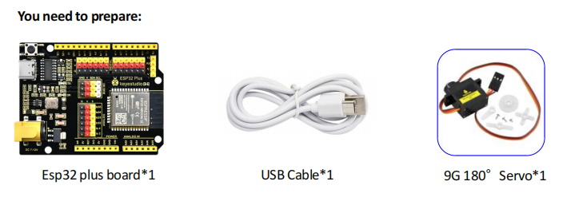
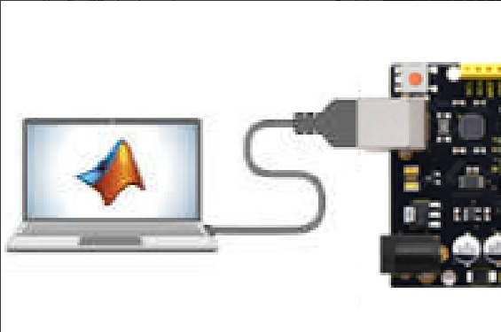
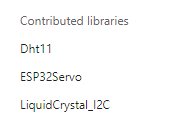
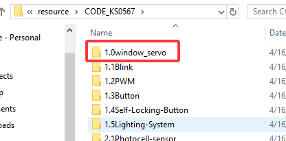
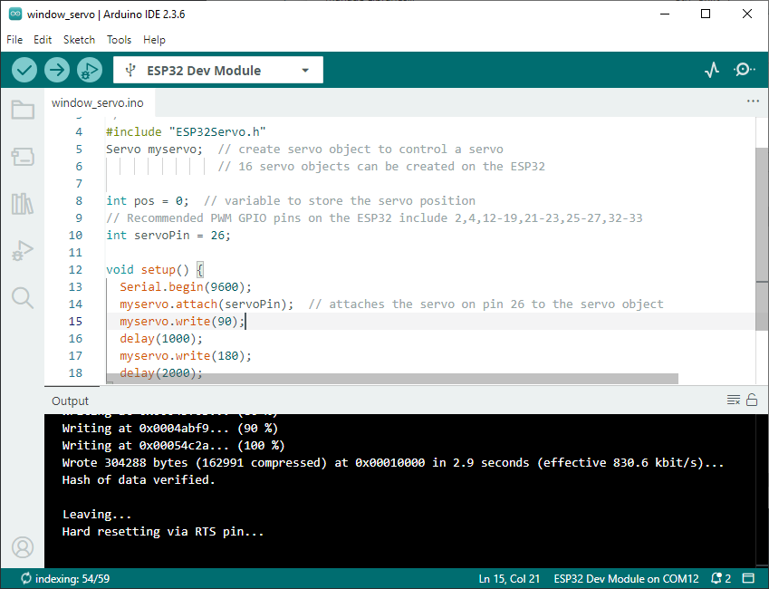

## 3. Set the Angle of the Servo

In the next lesson, we will assemble this smart farm kit. Before assembling the servo to the kit, we need to **set its angle to 165°** (with a 15° buffer reserved at each end) so that it will work as expected and avoid mechanical damage.

> **⚠ WARNING — Read Before Proceeding:**
>
> 1. **Do NOT set the servo to 180°.** The door mechanism does not require the full 0°–180° range. Setting it to the extreme end will cause the servo to press against the mechanical stop, which may overheat and permanently damage the servo motor.
> 2. **Keep the board powered during installation.** When the servo is powered and holding its angle, do NOT force the gear or door by hand. If the board is unpowered, the servo has no holding torque, and manually rotating the gear will shift the calibrated angle, causing misalignment after power-on.
> 3. **Do NOT use brute force.** If the door does not move smoothly, stop immediately and check the assembly. Forcing it will strip the servo gears.

1. Connect the servo to the **pin io26** of the ESP32 PLUS board. Note: The brown, red and orange wire of the servo are respectively attached to GND(G), 5V(V) and **Pin io26.**

2. Connect the ESP32 PLUS board to the computer.

3. Make sure you have installed the **ESP32Servo.h** library for the Arduino IDE. If not, please refer to the previous section to install it.

4. Open the **window_servo** code provided in our tutorial package with Arduino IDE.

> **Note:** The provided `window_servo` code sets the servo to **165°** (not 180°). This reserves a 15° mechanical buffer to prevent collision at the end stop. The working range of the door is 15°–165°.

5. Click on **Tools**, select "**ESP32 Dev Module**" for the board type, and select **COM-XX** for Port as shown in the Device Manager.

6. Click  to upload. After uploading is complete, the servo will move to **165°** and hold that position.

> **Important:** Keep the board powered and the servo holding at 165° while you proceed to the assembly step. Do **not** disconnect power or manually move the gear until the door panel is fully installed.

