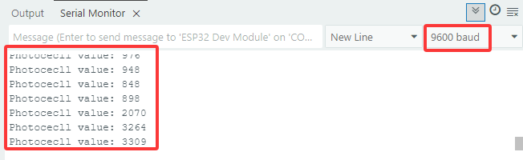
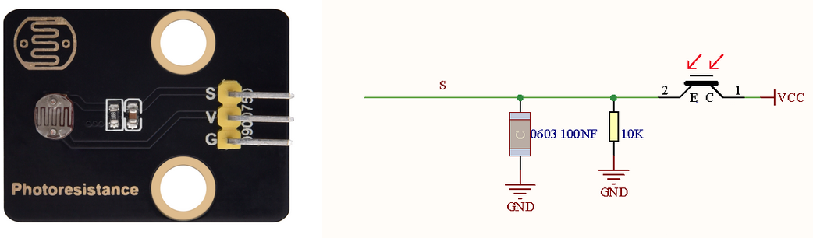
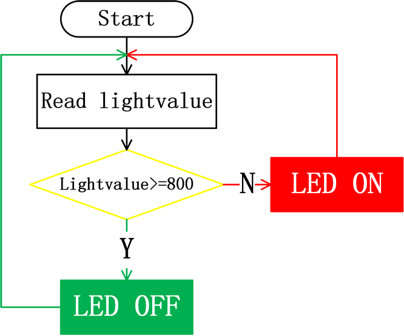
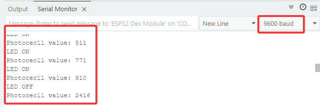

### 5.2 Light Control System


#### 5.2.1 Photocell-sensor


Open the **5.2.1Photocell-sensor** code with Arduino IDE.

```c
#define PhotocecllPin 34  //Define the photoresistor pin

void setup() {
  //Initialize the serial port
  Serial.begin(9600);
  //Set the pin to input mode
  pinMode(PhotocecllPin,INPUT);
}

void loop() {
  //Read the value of photoresistor
  int ReadValue = analogRead(PhotocecllPin);
  //Print the value. NOTE: ESP32 board is 12-bit ADC, whose detection value range is within 0~4095.
  Serial.print("Photocecll value: ");
  Serial.println(ReadValue);
  delay(500);
}
```

Choose the **ESP32 Dev Module** board and **COM** port, and upload the code.


**Test Result:**

Open the serial monitor.

The brighter the light detected by the photoresistoris, the greater the value will be.



A photoresistor module converts light signal into electric signal (voltage, current, and resistor). When light hits the photoresistor, the stronger the light is, the smaller the resistance will be, so the greaterthe VCC voltage will passthrough the photoresistor.




#### 5.2.2 Light Control System


Open the **5.2.2Light-Control-System** code with Arduino IDE.

```c
#define PhotocecllPin 34  //Define the photoresistor pin
#define LED           27  //Define LED pin

void setup() {
  //Initialize serial port
  Serial.begin(9600);
  //Set the photoresistor pin to input mode 
  pinMode(PhotocecllPin,INPUT);
  //Set the LED pin to output mode
  pinMode(LED,OUTPUT);
}

void loop() {
  //Read the value of the photoresistor
  int ReadValue = analogRead(PhotocecllPin);
  //Print the value. NOTE: ESP32 board is 12-bit ADC, whose detection value range is within 0~4095.
  Serial.print("Photocecll value: ");
  Serial.println(ReadValue);
  //Determine:
  //The value of the photoresistor >= 800, LED turns off
  //The value of the photoresistor =< 800, LED turns on
  if(ReadValue >= 800) {
    digitalWrite(LED,LOW);
    Serial.println("LED OFF");
  }
  else{
    digitalWrite(LED,HIGH);
    Serial.println("LED ON");
  }
  delay(100);
}
```

Choose the **ESP32 Dev Module** board and **COM** port, and upload the code.


**Test Result:**

When the value of the photoresistor is greater than 800 (in daytime), LED goes off. However, if the value islessthan 800, LED will automatically light on.





