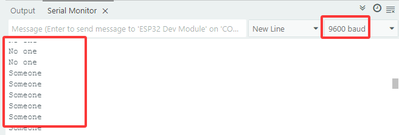
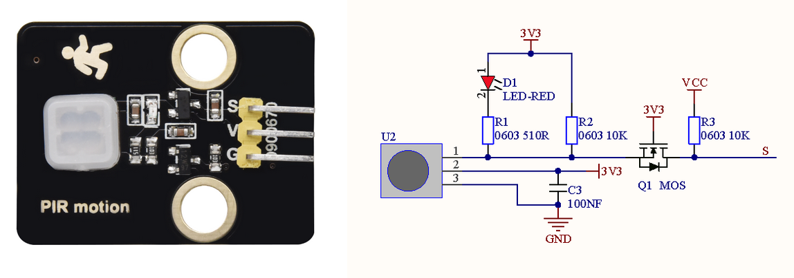
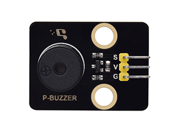
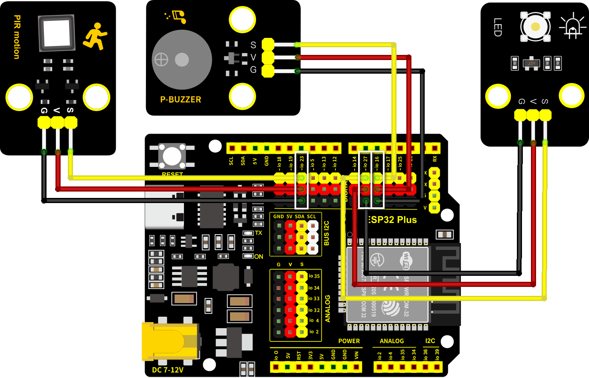

.. _53-alarm-system:

5.3 Alarm System
================

.. _531-pir-motion-sensor:

5.3.1 PIR Motion Sensor
-----------------------

Open the **5.3.1PIR-Motion-Sensor** code with Arduino IDE.

.. code:: c

   #define PyroelectricPIN 23

   void setup() {
     Serial.begin(9600);
     pinMode(PyroelectricPIN,INPUT);
   }

   void loop() {
     //Read the value of PIR motion sensor
     int ReadValue = digitalRead(PyroelectricPIN);
     if(ReadValue){
       Serial.println("Someone");
     }
     else{
       Serial.println("No one");
     }
     delay(100);
   }

Choose the **ESP32 Dev Module** board and **COM** port, and upload the
code.

|image1|

**Test Result:**

When someone is in the area, **Someone** is displayed on the monitor,
and the red LED on the sensor goes off. However, if there is no one,
**No one** will be printed and the LED on the sensor will always be on.

|image2|

Voltage: 3~5V

Current: 3.6mA

Power: 18mW

Angle of View: Y = 90°, X = 110° (Theoretical value)

Detection Distance: ≤5m

|image3|

.. _532-passive-buzzer:

5.3.2 Passive Buzzer
--------------------

|image4|

**Passive Buzzer** cannot vibrate to emit sound itself, unless putting a
square wave signal with a certain frequency. Moreover, the emitting
sound varies due to the different frequency of square wave, so a passive
buzzer can simulate tunes.

An analog squire wave can be generated by changing the power level at
pins. For example, after the high level lasting for 500ms, it shifts to
a low level for another 500ms then to a high level again...

We drive the buzzer via a squire wave within 200~5000Hz, and we can
compute the frequency(f): **f=1/T**, T is theperiod (the total time of
high and low level).

|image5|

**Parameters:**

Voltage: 3~5V

Current: ≤5mA

Power: ≤25mW

Open the **5.3.2Passive-Buzzer** code with Arduino IDE.

.. code:: c

   #define BuzzerPin 16  //Define the buzzer pin

   void setup() {
     //Set the pin to output mode
     pinMode(BuzzerPin,OUTPUT);
   }

   void loop() {
     digitalWrite(BuzzerPin,HIGH);
     delayMicroseconds(500);//Delay 500us
     digitalWrite(BuzzerPin,LOW);
     delayMicroseconds(500);//Delay 500us
   }

Choose the **ESP32 Dev Module** board and **COM** port, and upload the
code.

|image6|

**Test Result:**

Passive Buzzer keeps emitting sound.

.. _533-buzzer-tone:

5.3.3 Buzzer-Tone
-----------------

Open the **5.3.3Buzzer-Tone** code with Arduino IDE.

.. code:: c

   const int buzzerPin = 16;   //Set buzzer pin to 16
   void setup() {
     ledcAttachChannel(buzzerPin,1000,8,4);
   }
   void loop() {
       ledcWriteTone(buzzerPin,532);           //duo --C2
       delay(100);
       ledcWriteTone(buzzerPin,587);           //re --D3
       delay(100);
       ledcWriteTone(buzzerPin,659);           //mi --E3
       delay(100);
      //Alarm
      for(int i = 200; i<=1000; i+=10){ 
       ledcWriteTone(buzzerPin,i);
       delay(10);
      }
       //Alarm
      for(int i = 1000; i>=200; i-=10){ 
       ledcWriteTone(buzzerPin,i);
       delay(10);
      }
   ledcWriteTone(buzzerPin,0);
   }

| Choose the **ESP32 Dev Module** board and **COM** port, and upload the
| code.

|image7|

**Test Result:**

Buzzer alarms via\ ``ledcWriteTone()`` function.

``ledcWriteTone()`` generates PWM signal with a certain frequency to
drive the buzzer to vibrate, and the duration and tone is controlled by
related parameters.

The ``ledcWriteTone()`` function needs to be used in conjunction with
the ``ledcAttachChannel()`` function

**ledcAttachChannel**

This function is used to set duty for the LEDC channel.

.. code:: 

   bool ledcWriteChannel(uint8_t channel, uint32_t duty);

- ``channel`` select LEDC channel.

- ``duty`` select duty to be set for selected LEDC channel.

This function will return ``true`` if setting duty is successful. If
``false`` is returned, error occurs and duty was not set.

**ledcWriteTone**

This function is used to setup the LEDC pin to 50 % PWM tone on selected
frequency.

.. code:: 

   uint32_t ledcWriteTone(uint8_t pin, uint32_t freq);

- ``pin`` select LEDC pin.

- | ``freq`` select frequency of pwm signal. If frequency is ``0``, duty
  | will be set to 0.

This function will return ``frequency`` set for LEDC pin. If ``0`` is
returned, error occurs and LEDC pin was not configured.

.. _54-buzzer-music:

5.4 Buzzer-Music
----------------

Open the **5.3.4Buzzer-Music** code with Arduino IDE

.. code:: c

   #define NOTE_B0  31
   #define NOTE_C1  33
   #define NOTE_CS1 35
   #define NOTE_D1  37
   #define NOTE_DS1 39
   #define NOTE_E1  41
   #define NOTE_F1  44
   #define NOTE_FS1 46
   #define NOTE_G1  49
   #define NOTE_GS1 52
   #define NOTE_A1  55
   #define NOTE_AS1 58
   #define NOTE_B1  62
   #define NOTE_C2  65
   #define NOTE_CS2 69
   #define NOTE_D2  73
   #define NOTE_DS2 78
   #define NOTE_E2  82
   #define NOTE_F2  87
   #define NOTE_FS2 93
   #define NOTE_G2  98
   #define NOTE_GS2 104
   #define NOTE_A2  110
   #define NOTE_AS2 117
   #define NOTE_B2  123
   #define NOTE_C3  131
   #define NOTE_CS3 139
   #define NOTE_D3  147
   #define NOTE_DS3 156
   #define NOTE_E3  165
   #define NOTE_F3  175
   #define NOTE_FS3 185
   #define NOTE_G3  196
   #define NOTE_GS3 208
   #define NOTE_A3  220
   #define NOTE_AS3 233
   #define NOTE_B3  247
   #define NOTE_C4  262
   #define NOTE_CS4 277
   #define NOTE_D4  294
   #define NOTE_DS4 311
   #define NOTE_E4  330
   #define NOTE_F4  349
   #define NOTE_FS4 370
   #define NOTE_G4  392
   #define NOTE_GS4 415
   #define NOTE_A4  440
   #define NOTE_AS4 466
   #define NOTE_B4  494
   #define NOTE_C5  523
   #define NOTE_CS5 554
   #define NOTE_D5  587
   #define NOTE_DS5 622
   #define NOTE_E5  659
   #define NOTE_F5  698
   #define NOTE_FS5 740
   #define NOTE_G5  784
   #define NOTE_GS5 831
   #define NOTE_A5  880
   #define NOTE_AS5 932
   #define NOTE_B5  988
   #define NOTE_C6  1047
   #define NOTE_CS6 1109
   #define NOTE_D6  1175
   #define NOTE_DS6 1245
   #define NOTE_E6  1319
   #define NOTE_F6  1397
   #define NOTE_FS6 1480
   #define NOTE_G6  1568
   #define NOTE_GS6 1661
   #define NOTE_A6  1760
   #define NOTE_AS6 1865
   #define NOTE_B6  1976
   #define NOTE_C7  2093
   #define NOTE_CS7 2217
   #define NOTE_D7  2349
   #define NOTE_DS7 2489
   #define NOTE_E7  2637
   #define NOTE_F7  2794
   #define NOTE_FS7 2960
   #define NOTE_G7  3136
   #define NOTE_GS7 3322
   #define NOTE_A7  3520
   #define NOTE_AS7 3729
   #define NOTE_B7  3951
   #define NOTE_C8  4186
   #define NOTE_CS8 4435
   #define NOTE_D8  4699
   #define NOTE_DS8 4978

   #define BUZZERPIN 16
    
   // notes in the melody:
   int melody[] = {
   NOTE_E4, NOTE_E4, NOTE_E4, NOTE_C4, NOTE_E4, NOTE_G4, NOTE_G3,
   NOTE_C4, NOTE_G3, NOTE_E3, NOTE_A3, NOTE_B3, NOTE_AS3, NOTE_A3, NOTE_G3, NOTE_E4, NOTE_G4, NOTE_A4, NOTE_F4, NOTE_G4, NOTE_E4, NOTE_C4, NOTE_D4, NOTE_B3,
   NOTE_C4, NOTE_G3, NOTE_E3, NOTE_A3, NOTE_B3, NOTE_AS3, NOTE_A3, NOTE_G3, NOTE_E4, NOTE_G4, NOTE_A4, NOTE_F4, NOTE_G4, NOTE_E4, NOTE_C4, NOTE_D4, NOTE_B3,
   NOTE_G4, NOTE_FS4, NOTE_E4, NOTE_DS4, NOTE_E4, NOTE_GS3, NOTE_A3, NOTE_C4, NOTE_A3, NOTE_C4, NOTE_D4, NOTE_G4, NOTE_FS4, NOTE_E4, NOTE_DS4, NOTE_E4, NOTE_C5, NOTE_C5, NOTE_C5,
   NOTE_G4, NOTE_FS4, NOTE_E4, NOTE_DS4, NOTE_E4, NOTE_GS3, NOTE_A3, NOTE_C4, NOTE_A3, NOTE_C4, NOTE_D4, NOTE_DS4, NOTE_D4, NOTE_C4,
   NOTE_C4, NOTE_C4, NOTE_C4, NOTE_C4, NOTE_D4, NOTE_E4, NOTE_C4, NOTE_A3, NOTE_G3, NOTE_C4, NOTE_C4, NOTE_C4, NOTE_C4, NOTE_D4, NOTE_E4,
   NOTE_C4, NOTE_C4, NOTE_C4, NOTE_C4, NOTE_D4, NOTE_E4, NOTE_C4, NOTE_A3, NOTE_G3
   };
    
   // note durations: 4 = quarter note, 8 = eighth note, etc.:
   int noteDurations[] = {
   8,4,4,8,4,2,2,
   3,3,3,4,4,8,4,8,8,8,4,8,4,3,8,8,3,
   3,3,3,4,4,8,4,8,8,8,4,8,4,3,8,8,2,
   8,8,8,4,4,8,8,4,8,8,3,8,8,8,4,4,4,8,2,
   8,8,8,4,4,8,8,4,8,8,3,3,3,1,
   8,4,4,8,4,8,4,8,2,8,4,4,8,4,1,
   8,4,4,8,4,8,4,8,2
   };
    
   void setup() {
     ledcAttachChannel(BUZZERPIN,1000,8,4);
     // iterate over the notes of the melody:
     for (int thisNote = 0; thisNote < 98; thisNote++) {
     
     // to calculate the note duration, take one second
     // divided by the note type.
     //e.g. quarter note = 1000 / 4, eighth note = 1000/8, etc.
     int noteDuration = 1000/noteDurations[thisNote];
     ledcWriteTone(BUZZERPIN, melody[thisNote]);
     delayMicroseconds(noteDuration);
     
     // to distinguish the notes, set a minimum time between them.
     // the note's duration + 30% seems to work well:
     int pauseBetweenNotes = noteDuration * 1.30;
     delay(pauseBetweenNotes);
     // stop
     ledcWriteTone(BUZZERPIN,0);
     }
   }
    
   void loop() {
   // no need to repeat the melody.
   }

Choose the **ESP32 Dev Module** board and **COM** port, and upload the
code.

|image8|

**Test Result:**

The buzzer will play music.

.. _535-alarm-system:

5.3.5 Alarm System
------------------

Open the **5.3.5Alarm-System** code with Arduino IDE

.. code:: c

   #define BuzzerPin 16        //Set buzzer pin to 16
   #define PyroelectricPIN 23  //Set PIR mition sensor to 23
   #define Led 27              //Set led pin to 27

   void setup() {
     Serial.begin(9600);
     //Set the pins modes
     pinMode(PyroelectricPIN,INPUT);
     pinMode(Led,OUTPUT);

     ledcAttachChannel(BuzzerPin,1000,8,4);
   }
   void loop() {
     //Read the value of PIR motion sensor
     int ReadValue = digitalRead(PyroelectricPIN);
     if(ReadValue){
       Serial.println("Someone");
       digitalWrite(Led,HIGH);
       //Alarm
       for(int i = 200; i<=1000; i+=10){ 
         ledcWriteTone(BuzzerPin,i);
         delay(10);
       }
       digitalWrite(Led,LOW);
       //Alarm
       for(int i = 1000; i>=200; i-=10){ 
         ledcWriteTone(BuzzerPin,i);
         delay(10);
       }
     }
     //Stop alarming
     ledcWriteTone(BuzzerPin,0);
     Serial.println("No one");
   }

Choose the **ESP32 Dev Module** board and **COM** port, and upload the
code.

|image9|

**Test Result:**

When the sensor detects a motion, buzzer emits sound and LED blinks to
remind of an invasion.

|image10|

.. |image1| image:: ./media/5458448.png

.. |image5| image:: ./media/cou38.png
.. |image6| image:: ./media/5458448.png
.. |image7| image:: ./media/5458448.png
.. |image8| image:: ./media/5458448.png
.. |image9| image:: ./media/5458448.png

