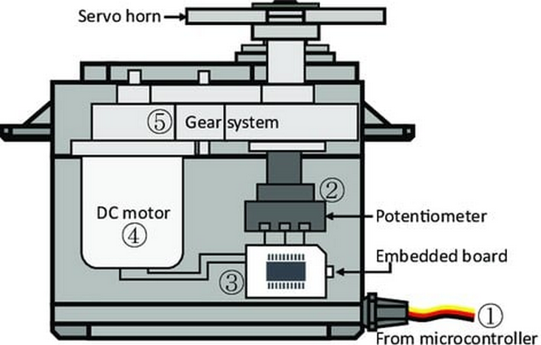
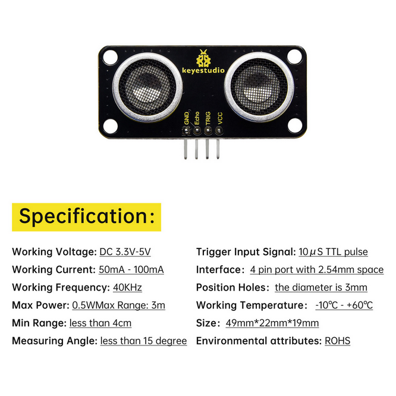
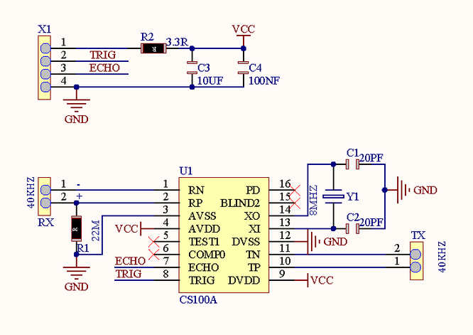
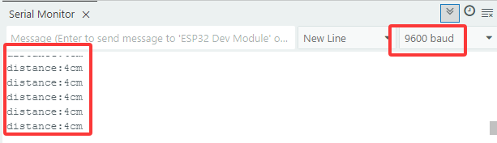
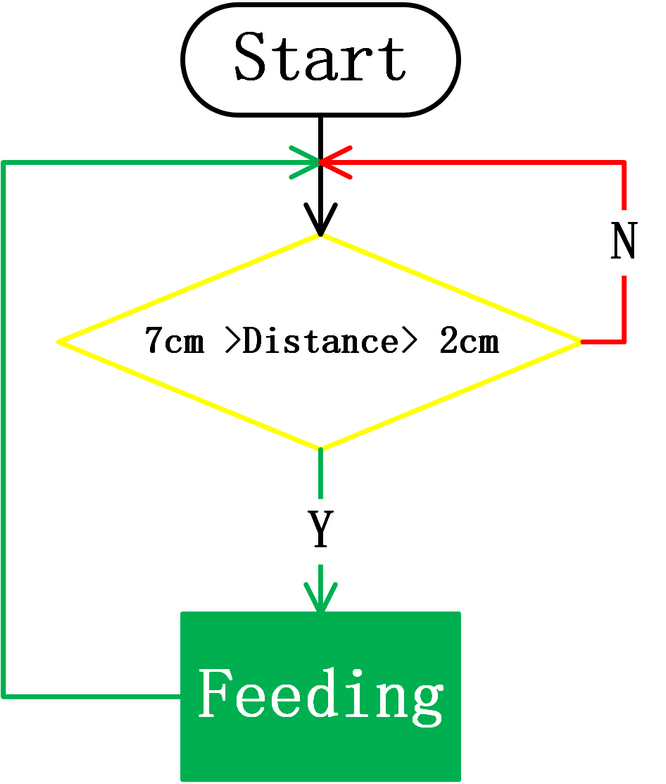

.. _56-smart-feeding-system:

5.6 Smart Feeding System
========================

.. _561-door-of-feeding-cabin:

5.6.1 Door of feeding cabin
---------------------------

Open the **5.6.1Servo** code with Arduino IDE.

.. code:: c

   #include <ESP32Servo.h>  //Import the library of servo
   Servo myservo;  // create servo object to control a servo
                   // 16 servo objects can be created on the ESP32
                   
   int pos = 0;    // variable to store the servo position
   // Recommended PWM GPIO pins on the ESP32 include 2,4,12-19,21-23,25-27,32-33 
   int servoPin = 26;
                   
   void setup() {
     Serial.begin(9600);
     myservo.attach(servoPin);   // attaches the servo on pin 26 to the servo object
     myservo.write(180);
     delay(2000);
   }

   void loop() {

     for (pos = 80; pos <= 179; pos += 1) { // goes from 0 degrees to 80 degrees
       // in steps of 1 degree
       myservo.write(pos);              // tell servo to go to position in variable 'pos'
       delay(15);                       // waits 15ms for the servo to reach the position
     }
     for (pos = 180; pos >= 81; pos -= 1) { // goes from 80 degrees to 0 degrees
       myservo.write(pos);              // tell servo to go to position in variable 'pos'
       delay(15);                       // waits 15ms for the servo to reach the position
     }
   }

| Choose the **ESP32 Dev Module** board and **COM** port, and upload the
| code.

|image1|

**Test Result:**

The door of feeding cabin is slowly opened and then closed.

**NOTE:** SG90 servo can rotate 180°. As the feeding box is small, 100°
of rotation is enough to completely close the box.

80°: fully open

120°: half open

180°: close

|image2|

**ATTENTION**

Do not put your fingers into the box to avoid nipping!

Do not block the door with something to avoid damaging servo!

The dooris controlled by a servo.

**Internal Structure:**

|image3|

① Signal(S): It receives the control signal from microcontroller.

② Potentiometer: the feedback part of the Servo. It measures the
position of output shaft.

③ Embedded board (Internal controller): the core of the Servo. It
processes external control signal and the feedback signal of position
and drives the Servo.

④ DC motor: the execution part. It outputs speed, torque and position.

⑤ Gear system: It scales the outputs from motor to the final output
Angle ccording to a certain transmission ratio.

**Drive the Servo:**

Signal(S) receives PWM to control the output of Servo, and the position
of output shaft directly relies on the duty cycle of PWM.

**For instance:**

A. If we send a signal with pulse width of 1.5ms to Servo, its
shaft(horn) will revolves to the middle position(90°);

B. If pulse width = 0.5ms, the shaft turns to its minimum(0°);

C. If pulse width = 2.5ms, the shaft turns to its maximum(180°).

**NOTE: The maximum angle varies from the types of Servos. Some are 170°
while some are only 90°. In spite of this, Servos usually will move a
half (of the maximum) if they receive a signal with pulse width of
1.5ms.**

.. _562-ultrasonic-sensor:

5.6.2 Ultrasonic-Sensor
-----------------------

|image4|

|image5|

Open the **5.6.2 Ultrasonic-Sensor** code with Arduino IDE.

.. code:: c

   #define Trigpin 12 //connect trig to io12
   #define Echopin 13 //connect echo to io13
   int duration,distance;

   void setup(){
     Serial.begin(9600); //Set the baud rate to 9600
     pinMode(Trigpin,OUTPUT);  //set trig pin to output mode
     pinMode(Echopin,INPUT);   //set echo pin to input mode
   }
   void loop(){
     digitalWrite(Trigpin,LOW);
     delayMicroseconds(2);
     digitalWrite(Trigpin,HIGH);
     delayMicroseconds(10);    //Trigger the trig pin via a high level lasting at least 10us
     digitalWrite(Trigpin,LOW);
     duration = pulseIn(Echopin,HIGH); //the time of high level at echo pin
     distance = duration/58;       //convert into distance(cm)
     delay(50);
     Serial.print("distance:");    //Serial monitor prints the value
     Serial.print(distance);
     Serial.println("cm");
   }

Choose the **ESP32 Dev Module** board and **COM** port, and upload the
code.

|image6|

**Test Result:**

In this kit, the detection range is within 3~8cm.

Open the serial monitor and set the baud rate to 9600, the serial
monitor will display the distance between the ultrasonic module and the
obstacle in front.

|image7|

.. _563-intelligent-feeding-system:

5.6.3 Intelligent Feeding System
--------------------------------

Open the **5.6.3Intelligent-Feeding-System** code with Arduino IDE.

.. code:: c

   #include <ESP32Servo.h>  //Import the library of servo on ESP32 board
   Servo myservo;  // create servo object to control a servo
                   // 16 servo objects can be created on the ESP32

   #define TrigPin 12 //connect trig to D12
   #define EchoPin 13 //connect echo to D13
   #define ServoPin 26
   int duration,distance;

   void setup(){

     Serial.begin(9600); //Set the baud rate to 9600
     pinMode(TrigPin,OUTPUT);  //set trig pin to output mode
     pinMode(EchoPin,INPUT);   //Set echo pin to input mode
     myservo.attach(ServoPin);   // attaches the servo on pin 26 to the servo object
   }
   void loop(){
     Serial.println(getDistance());
     //When the distance is detected within 2~7cm, open the feeding box. Or else, close. 
     if (getDistance() >= 2 && 7 >= getDistance()) {
       //Servo rotates to 80° to open the box
       myservo.write(80);
       delay(500);
     }
     else{
       myservo.write(180);
       delay(500);
     }
   }

   //Put the gotten distance in a function
   float getDistance() {

     digitalWrite(TrigPin,LOW);
     delayMicroseconds(2);
     digitalWrite(TrigPin,HIGH);
     delayMicroseconds(10);    //Trigger the trig pin via a high level lasting at least 10us
     digitalWrite(TrigPin,LOW);
     duration = pulseIn(EchoPin,HIGH); //the time of high level at echo pin
     distance = duration/58;       //convert into distance(cm)
     delay(50);
     
     return distance;
   }

Choose the **ESP32 Dev Module** board and **COM** port, and upload the
code.

|image8|

**Test Result:**

The smart feeding system intelligently feeds domestic fowls via an
ultrasonic module and a servo. The former detects the distance to
animals while the later controls to open or close the feeding box. When
a pet is detected close to the box, servo opens it to feed.

**ATTENTION**

Do not put your fingers into the box to avoid nipping!

Do not block the door with something to avoid damaging servo!

|image9|

.. |image1| image:: ./media/5458448.png
.. |image2| image:: ./media/cou63.gif

.. |image6| image:: ./media/5458448.png

.. |image8| image:: ./media/5458448.png

