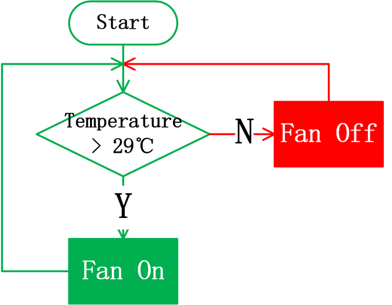

.. _57-temperature-control-system:

5.7 Temperature Control System
==============================

.. _571-dht11-temperature-and-humidity-sensor:

5.7.1 DHT11 temperature and humidity sensor
-------------------------------------------

|image1|

DHT11 temperature and humidity sensor outputs digital signals. It
applies principles of analog signal acquisition and conversion as well
as temperature and humidity sensing technology, so that it features
long-term stability and high reliability. Besides, the sensor integrates
a high-precision resistive humidity sensor and a resistive
thermo-sensitive temperature sensor, and is connected with an 8-bit
high-performance MCU.

Open the **5.7.4Temperature-Control-System** code with Arduino IDE

.. code:: c

   #include <dht11.h>
   #define DHT11PIN 17

   dht11 DHT11;

   void setup()
   {
     Serial.begin(9600);
     Serial.println("DHT11 TEST PROGRAM ");
     Serial.print("LIBRARY VERSION: ");
     Serial.println(DHT11LIB_VERSION);
     Serial.println();
   }

   void loop()
   {
     Serial.println("\n");

     int chk = DHT11.read(DHT11PIN);

     Serial.print("Read sensor: ");
     switch (chk)
     {
       case DHTLIB_OK: 
                   Serial.println("OK"); 
                   break;
       case DHTLIB_ERROR_CHECKSUM: 
                   Serial.println("Checksum error"); 
                   break;
       case DHTLIB_ERROR_TIMEOUT: 
                   Serial.println("Time out error"); 
                   break;
       default: 
                   Serial.println("Unknown error"); 
                   break;
     }

     Serial.print("Humidity (%): ");
     Serial.println((float)DHT11.humidity, 2);

     Serial.print("Temperature (oC): ");
     Serial.println((float)DHT11.temperature, 2);

     Serial.print("Temperature (oF): ");
     Serial.println(Fahrenheit(DHT11.temperature), 2);

     Serial.print("Temperature (K): ");
     Serial.println(Kelvin(DHT11.temperature), 2);

     Serial.print("Dew Point (oC): ");
     Serial.println(dewPoint(DHT11.temperature, DHT11.humidity));

     Serial.print("Dew PointFast (oC): ");
     Serial.println(dewPointFast(DHT11.temperature, DHT11.humidity));

     delay(2000);
   }

   double Fahrenheit(double celsius) 
   {
           return 1.8 * celsius + 32;
   }    //Convert Celsius degree to Fahrenheit degree

   double Kelvin(double celsius)
   {
           return celsius + 273.15;
   }     //Convert Celsius degree to Kelvins

   //Dew Point. The air is saturated and dews are produced under this temperature.
   //Reference: http://wahiduddin.net/calc/density_algorithms.htm 
   double dewPoint(double celsius, double humidity)
   {
           double A0= 373.15/(273.15 + celsius);
           double SUM = -7.90298 * (A0-1);
           SUM += 5.02808 * log10(A0);
           SUM += -1.3816e-7 * (pow(10, (11.344*(1-1/A0)))-1) ;
           SUM += 8.1328e-3 * (pow(10,(-3.49149*(A0-1)))-1) ;
           SUM += log10(1013.246);
           double VP = pow(10, SUM-3) * humidity;
           double T = log(VP/0.61078);   // temp var
           return (241.88 * T) / (17.558-T);
   }

   // Fast calculate the Dew Point, its speed is 5 times of dewPoint()
   // Reference: http://en.wikipedia.org/wiki/Dew_point
   double dewPointFast(double celsius, double humidity)
   {
           double a = 17.271;
           double b = 237.7;
           double temp = (a * celsius) / (b + celsius) + log(humidity/100);
           double Td = (b * temp) / (a - temp);
           return Td;
   }

Choose the **ESP32 Dev Module** board and **COM** port, and upload the
code.

|image2|

**Test Result:**

Open the serial monitor and set the baud rate to 9600, the serial
monitor will display the the current temperature and humidity value.

|image3|

.. _572-lcd-1602-module:

5.7.2 LCD 1602 Module
---------------------

LCD 1602 possesses a standard 14-pin (without backlight) or 16-pin (with
backlight) interface, saving the pins of MCU. Its display drives IC to
realize I2C control.

|image4|

Open the **5.7.2LCD1602** code with Arduino IDE.

.. code:: c

   #include <LiquidCrystal_I2C.h>

   //Initialize LCD 1602, 0x27 is I2C address
   LiquidCrystal_I2C lcd(0x27,16,2);

   void setup() {
     //Initialize LCD
     lcd.init();
     // Turn the (optional) backlight off/on
     lcd.backlight();
     //lcd.noBacklight();

     //Set the position o dcursor
     lcd.setCursor(0, 0);
     //LCD prints
     lcd.print("HELLO WORLD 0");
     lcd.setCursor(0, 1);
     lcd.print("HELLO WORLD 1");

     //Clear displays
     // lcd.clear();
   }

   void loop() {

     // Turn the display on/off (quickly)
     //lcd.noDisplay();
     //lcd.display();

     // Turns the underline cursor on/off
     //lcd.noCursor();
     //lcd.cursor();

     // Turn on and off the blinking cursor
     // lcd.noBlink();
     // lcd.blink();

     // These commands scroll the display without changing the RAM
     //lcd.scrollDisplayLeft();
     //lcd.scrollDisplayRight();

     // This is for text that flows Left to Right
     //lcd.leftToRight();
     //lcd.rightToLeft();

     // This will 'right justify' text from the cursor
     //lcd.autoscroll();
     //lcd.noAutoscroll();

   }

Choose the **ESP32 Dev Module** board and **COM** port, and upload the
code.

|image5|

**Test Result:**

LCD1602 opens its backlight and displays ”HELLO WORLD 0“ and ”HELLO
WORLD 1“.

|image6|

.. _573-motor-and-fan:

5.7.3 Motor and Fan
-------------------

130 Motor is able to adjust speed via PWM. In the process, two pins are
needed to be connected for controlling.

|image7|

Open the **5.7.3Motor** code with Arduino IDE.

.. code:: c

   #define MotorPin1 19  //(IN+)
   #define MotorPin2 18  //(IN-)

   void setup() {
     pinMode(MotorPin1, OUTPUT);
     pinMode(MotorPin2, OUTPUT);
   }

   void loop() {
     //corotation 
     analogWrite(MotorPin1, 255); //Adjust the motor speed by modifying the analog value output range from 0-255
     analogWrite(MotorPin2, 0);
     delay(2000);
     //Stop Transition
     delay(200);
     analogWrite(MotorPin1, 0);
     analogWrite(MotorPin2, 0);
     delay(200);
     //reversal
     analogWrite(MotorPin1, 0);
     analogWrite(MotorPin2, 255);
     delay(2000);
     //Stop
     analogWrite(MotorPin1, 0);
     analogWrite(MotorPin2, 0);
     delay(2000);
   }

| Choose the **ESP32 Dev Module** board and **COM** port, and upload the
| code.

|image8|

**Test Result:**

130 motor alternatively rotatesleft and right every 2 seconds.

| NOTE: Since the fan is a high-power electronic device, please remember
| to use batteries to power it.

.. _574-temperature-control-system:

5.7.4 Temperature Control System
--------------------------------

Open the **5.7.4Temperature-Control-System** code with Arduino IDE.

.. code:: c

   #include <LiquidCrystal_I2C.h>
   #include <dht11.h>

   #define DHT11PIN 17
   #define MotorPin1 19  //(IN+)
   #define MotorPin2 18  //(IN-)

   dht11 DHT11;

   LiquidCrystal_I2C lcd(0x27, 16, 2);

   void setup() {
     lcd.init();
     lcd.backlight();

     pinMode(MotorPin1, OUTPUT);
     pinMode(MotorPin2, OUTPUT);
   }

   void loop() {
     //Difine temperature and humidity value
     int Temperature;
     int Humidity;
     //Read the value
     int chk = DHT11.read(DHT11PIN);

     Temperature = DHT11.temperature;
     Humidity = DHT11.humidity;
     lcd.setCursor(0, 0);
     lcd.print("Temp:");
     lcd.setCursor(5, 0);
     lcd.print(Temperature);

     lcd.setCursor(0, 1);
     lcd.print("Hum:");
     lcd.setCursor(5, 1);
     lcd.print(Humidity);
     delay(500);

     if (Temperature >= 29) {
       //Turn left
       analogWrite(MotorPin1, 150);  //Adjust the motor speed by modifying the analog value output range from 0-255
       analogWrite(MotorPin2, 0);
     } else {
       //Stop
       delay(3000);
       analogWrite(MotorPin1, 0);
       analogWrite(MotorPin2, 0);
       delay(200);
     }
   }

Choose the **ESP32 Dev Module** board and **COM** port, and upload the
code.

|image9|

**Test Result:**

When the temperature reaches 29°C, the fan will turn on to dissipate
heat. When it is lower than 29°C, the fan will turn off (the fan just
simulates heat dissipation, so the effect is not good), which saves
energy forthe farm.

|image10|

.. |image1| image:: ./media/cou71.png
.. |image2| image:: ./media/5458448.png
.. |image3| image:: ./media/image-20250417141933151.png
.. |image4| image:: ./media/cou72.png
.. |image5| image:: ./media/5458448.png
.. |image6| image:: ./media/cou78.png
.. |image7| image:: ./media/cou710.png
.. |image8| image:: ./media/5458448.png
.. |image9| image:: ./media/5458448.png

