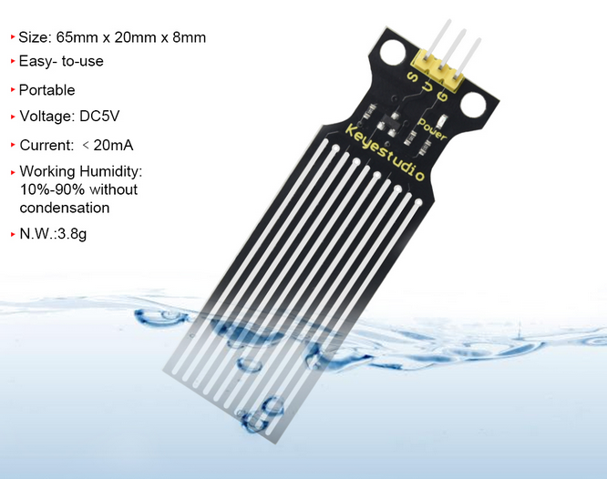
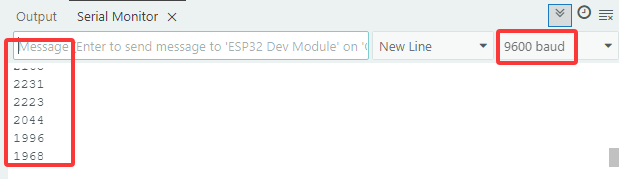
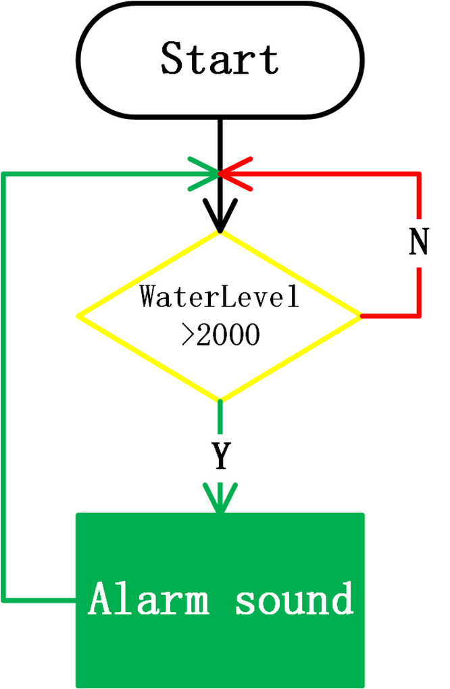

### 5.9 Water Level Monitoring System


#### 5.9.1 Water Level Sensor


The water level sensor integrates a series of exposed parallel lines to measure the volume of water and droplets.



Pay attention:With the exception of the detection area, the sensor is not waterproof. Spilling water on other area may result in a short circuit.

Open the **5.9.1Water-Level-Sensor** code with Arduino IDE.

```c
#define WaterLevelPin 33

void setup() {

  Serial.begin(9600);
  pinMode(WaterLevelPin,INPUT);
}

void loop() {
  int ReadValue = analogRead(WaterLevelPin);
  Serial.println(ReadValue);
  delay(500);
}
```

Choose the **ESP32 Dev Module** board and **COM** port, and upload the code.


**Test Result:**

Open the serial monitor. Touch the detection area of the sensor with a wet finger and the currently detected value will be printed on the monitor(range: 0~4095).




#### 5.9.2 Water Level Monitoring System


Open the **5.9.2Water-Level-Testing-System** code with Arduino IDE

```c
#include <LiquidCrystal_I2C.h>

#define BuzzerPin 16
#define WaterLevelPin 33

LiquidCrystal_I2C lcd(0x27,16,2);

void setup() {

  //Initialize the serial port
  Serial.begin(9600);
  //Set the water level pin to input mode
  pinMode(WaterLevelPin,INPUT);

  //Initialize LCD
  lcd.init();
  //turn on the LCD backlight
  lcd.backlight();
  //clear displays on LCD
  lcd.clear();

  ledcAttachChannel(BuzzerPin,1000,8,4);
}

void loop() {
  //Read the value of water level sensor
  int ReadValue = analogRead(WaterLevelPin);
  //Set the display position of cursor
  lcd.setCursor(0, 0);
  //Set the display position of characters
  lcd.print("WaterLevel:");
  lcd.setCursor(6, 1);
  lcd.print(ReadValue);
  
  //When the detected value exceeds the threshold, the buzzer starts to alarm
  if(ReadValue >= 2000)
  {
    ledcWriteTone(BuzzerPin,659);
    delay(100);
    ledcWriteTone(BuzzerPin,532);
    delay(100);
    ledcWriteTone(BuzzerPin,659);
    delay(100);
    ledcWriteTone(BuzzerPin,0);  //Stop alarming
  }
  delay(500);
  lcd.clear();
}
```

Choose the **ESP32 Dev Module** board and **COM** port, and upload the code.


**Test Result:**

LCD displays the real-time value of water level. When the water level sensor detects that the water level is lower than 200, the buzzer starts to alarm.



