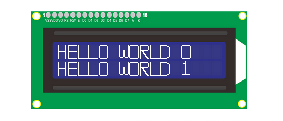

# Arduino Tutorials

## Arduino Installation

[https://arduinoide.readthedocs.io](https://arduinoide.readthedocs.io)

### **Install Software**

#### **Download Arduino IDE (Windows)**

You could download Arduino IDE from the official website: [https://www.arduino.cc/](https://www.arduino.cc/)

Enter the link and click **SOFTWARE**: 

.png)

------


There are various versions of IDE for Arduino. Just download a version compatible with your system. 

.png)

------


Here we will show you how to download and install the windows version of Arduino IDE. 

There are two versions of IDE for WINDOWS system. You can choose between the installer (.exe) and the Zip file. For installer, it can be directly downloaded, without the need of installing it manually while for Zip package, you will need to install the driver manually.

.png)

You just need to click **JUST DOWNLOAD**.

------


#### Download Arduino IDE (Mac)

The versions of Arduino IDE vary from operation systems.

For how to download Arduino IDE on Mac, please refer to Windows:

.png)

------


### **Install Driver**

#### Windows System

Connect the control board to your computer via USB cable. 

Windows 10 (and later systems) boasts their own drivers, so there is no need to install additional drivers. 

CH340 is the USB-to-serial port chip of this board, so we need to install CH340 dirver: usb_ch341_3.1.2009.06.

.png)

Click **Computer > Properties > Device Manager**, as shown below. 


------


Click" USB Serial" to select “Update driver”. And then the driver will start to install. 


------


Tap "Browse my computer for drivers".


------


Find the file **usb_ch341_3.1.2009.06**: 


------


After finishing installing, click "Close" and the serial port number will show up. 


------


The driver is successfully installed!

Click **Computer > Properties > Device Manager** to check: 


------


#### MAC System

Please refer to: 

[https://wiki.keyestudio.com/Download_CH340_Driver_on_MAC_System](https://wiki.keyestudio.com/Download_CH340_Driver_on_MAC_System)


------


### **Install Development Board on Arduino IDE**

Arduino ESP32 development board: 

[https://docs.espressif.com/projects/arduino-esp32/en/latest/getting_started.html#about-arduino-esp32](https://docs.espressif.com/projects/arduino-esp32/en/latest/getting_started.html#about-arduino-esp32)

#### Windows System

Click Arduino icon to open it: 

.png)

------


There are only boards of Arduino series in Tools when you install Arduino IDE for the first time, so you need to install ESP32 board on it. 

.png)

------


Here are the procedures of ESP32 board installation:

Click **File** > **Preferences**. 

Copy the link of ESP32 board ([https://espressif.github.io/arduino-esp32/package_esp32_index.json](https://espressif.github.io/arduino-esp32/package_esp32_index.json)) to **Additional boards manager URLs**, and tap OK.

.png)

------


Click the icon of "Board Manager" to check for boards.

.png)

------


In the search bar, type in ESP32 and search to install the latest version. Then you just need to wait a few minutes for the installation to complete. 

**During installing, please ensure the stability of network. If it fails, please operate last step again to re-install.**

.png)

------


After installation, select the right board model.

.png)

------


#### MAC System

When setting Arduino IDE, please refer to the methods on windows. Note that COM port is different: 

.png)

------


Click **“Arduino IDE > Preferences”**.

Copy the link of ESP32 board ([https://espressif.github.io/arduino-esp32/package_esp32_index.json](https://espressif.github.io/arduino-esp32/package_esp32_index.json)) to **Additional boards manager URLs**, and tap OK.

.png)

------


In the search bar, type in ESP32 and search to install the latest version. Then you just need to wait a few minutes for the installation to complete. 

**During installing, please ensure the stability of network. If it fails, please operate last step again to re-install.**

.png)

------


If the scroll bar on the right has been slid to the bottom, and **INSTALL** has not been displayed , please set the **“Interface scale”**. 

.png)

------


Click **“Arduino IDE > Preferences > Interface scale”**, and choose a proper size till **“INSTALL”** appearers.

.png)

------


### **Import Library**

First of all, the corresponding Arduino library files are required. 

#### What are Libraries ?

Libraries are a collection of code that make it easy for you to connect a sensor,display, module, etc.

For example, the built-in LiquidCrystal library helps talk to LCD displays. 

There are hundreds of additional libraries available on the Internet for download. The built-in libraries and some of these additional libraries are listed in the reference.

#### How to Install a Library ?

Here we will introduce the most simple way to add libraries.

Click **Skerch > Include Library > Add .Zip Library...**


.png)

------


Find files(.zip) you need to add as library and wait. “**Library installed**” will be displayed if library is successfully added.

.png)

For how to include a library, the method of the two system is the same. 


------

For more details, please visit our official website: [https://www.keyestudio.com/](https://www.keyestudio.com/)

------

------


## Assembling

During assembling, some codes are required to be burned, so please install software first. 

The whole assembling generally can be divided into two parts: assembling parts and wirings. 

------

### Step 1

##### 1.1 Required components


------
##### 1.2


------
##### 1.3


------
##### 1.4


------
##### 1.5


------


### Step 2

------

##### 2.1 Required components


------

##### 2.2

Assemble the wooden board X and O on bottom plate H


------

##### 2.3


------

##### 2.4


------

##### 2.5


------

##### 2.6


------

##### 2.7


------

##### 2.8 Wiring

|    Module    |   Wire    | Pin  |
| :----------: | :-------: | :--: |
| Relay Module | 3PIN 20cm | IO25 |

**Pay attention to the color of the Dupont wire: For the relay module, connect yellow to S, red to V, black to G.**


------

##### 2.9


------


### Step 3

------

##### 3.1 Required components


------

##### 3.2


------

##### 3.3


------

##### 3.4


------

##### 3.5


------

##### 3.6


------

##### 3.7


------

##### 3.8


------

##### 3.9


------

##### 3.10


------

##### 3.11


------


### Step 4

------

##### 4.1 Required components


------

##### 4.2 Set Servo to 180°

**Before mount the servo, firstly please set the angle to 180° by programming: Arduino(C++) or Scratch(Graphical programming).**

Please refer to the software installation steps for details:

[https://arduinoide.readthedocs.io](https://arduinoide.readthedocs.io)

**Connect Servo to ESP32 development board at pin IO26.**


------


------


- Open **window_servo.ino** on **Arduino IDE** and upload it to ESP32 board. 

  

**After setting the servo to a specific angle, disconnect the it from the development board for installation.**

------

##### 4.3 Install Servo


------

##### 4.4


------

##### 4.5


------

##### 4.6


------

##### 4.7


------

##### 4.8


------

##### 4.9 

**NOTE: When installing the lid of the feeding box, its opening should be fully closed.**


------

##### 4.10


------

##### 4.11


------

##### 4.12


------


### Step 5

------

##### 5.1 Required components


------

##### 5.2


------

##### 5.3


------

##### 5.4


------

##### 5.5 Prototype


------

##### 5.6 Wiring

**Connect modules via Dupont wires.**

|             Module              |              Wire               |
| :-----------------------------: | :-----------------------------: |
| Temperature and Humidity Sensor |            3PIN 20cm            |
|            LCD 1602             | 4PIN **(Black-Red-Blue-Green)** |

**Pay attention to the color of the Dupont wire:**

**For temperature and humidity sensor, connect yellow to S, red to V, black to G.**


------

##### 5.7

**For the LCD display, connect green to SCL, blue to SDA, red to VCC, black to GND.**


------


### Step 6

------

##### 6.1 Required components


------

##### 6.2


------

##### 6.3


------

##### 6.4 Wiring

|      Module       |              Wire               |
| :---------------: | :-----------------------------: |
| Ultrasonic module | 4PIN **(Black-Green-Blue-Red)** |

**Pay attention to the color of the Dupont wire: For the ultrasonic module, connect blue to TRIG,green  to ECHO, red to VCC, black to GND.**


------

### Step 7

------

##### 7.1 Required components


------

##### 7.2


------

##### 7.3


------

##### 7.4 Wiring

**Connect modules via Dupont wires.**

|      Module       |   Wire    |
| :---------------: | :-------: |
| PIR Motion Sensor | 3PIN 15cm |
|   Button Module   | 3PIN 15cm |

**Pay attention to the color of the Dupont wire: Connect yellow to S, red to V, black to G.**


------


### Step 8

------

##### 8.1 Required components


------

##### 8.2


------

##### 8.3


------

##### 8.4


------

##### 8.5


------

##### 8.6


------

##### 8.7


------

##### 8.8 Prototype


------

##### 8.9 Wiring

|    Module     |              Wire               |
| :-----------: | :-----------------------------: |
|      Fan      | 4PIN **(Black-Red-Blue-Green)** |
| Steam Sensor  |            3PIN 15cm            |
| Photoresistor |            3PIN 15cm            |

**Pay attention to the color of the Dupont wire: Connect yellow to S, red to V, black to G, blue to IN+, green to IN-.**


------

### Step 9

------

##### 9.1 Required components


------

##### 9.2


------

##### 9.3


------

##### 9.4 Wiring


------


### Step 10

------

##### 10.1 Required components


------

##### 10.2


------

##### 10.3


------

##### 10.4 Bottom View


------

##### 10.5


------

##### 10.6


------

##### 10.7 


------


### Step 11 Wiring

------

##### 11.1 

**Pay attention to the color of the Dupont wire: Connect yellow to S, red to V, black to G.**

| NO.  |           Components            |                 Wires                  |      ESP32 Board Pins      |
| :--: | :-----------------------------: | :------------------------------------: | :------------------------: |
|  1   |               Fan               | 4pin, **Divided** Black-Red-Blue-Green | io18(IN-)   \|   io19(IN+) |
|  2   |        PIR Motion Sensor        |               3pin 15cm                |            io23            |
|  3   |             Button              |               3pin 15cm                |            io5             |
|  4   |        Ultrasonic Module        | 4pin,**Divided** Black-Green-Blue-Red  |    D12(TRIG) D13(ECHO)     |
|  5   |            LCD 1602             |          4pin, **Connected**           |            I2C             |
|  6   | Temperature and Humidity Sensor |               3pin 20cm                |            io17            |
|  7   |          Steam Sensor           |               3pin 15cm                |            io35            |
|  8   |          Photoresistor          |               3pin 15cm                |            io34            |
|  9   |              Servo              |                   --                   |            io26            |
|  10  |             Buzzer              |               3pin 20cm                |            io16            |
|  11  |               LED               |               3pin 20cm                |            io27            |
|  12  |       Water Level Sensor        |               3pin 25cm                |            io33            |
|  13  |      Soil Humidity Sensor       |               3pin 20cm                |            io32            |
|  14  |           Water Pump            |               3pin 20cm                |            io25            |


##### 11.2 Fan

| Components |                    Wire                     |   ESP32 Board Pins   |
| :--------: | :-----------------------------------------: | :------------------: |
|    Fan     | 4PIN **Divided** **(Black-Red-Blue-Green)** | io18(IN-), io19(IN+) |

| Module Pin | Wire Color |
| :--------: | :--------: |
|    IN-     |   GREEN    |
|    IN+     |    BLUE    |
|     V      |    RED     |
|     G      |   BLACK    |


------

##### 11.3 PIR Motion Sensor

|     Component     |   Wire    | ESP32 Board Pin |
| :---------------: | :-------: | :-------------: |
| PIR Motion Sensor | 3PIN 15cm |      io23       |

**Connect red to V, black to G, yellow to S.**

| Module Pin | Wire Color |
| :--------: | :--------: |
|     V      |    RED     |
|     G      |   BLACK    |
|     S      |   YELLOW   |


------

##### 11.4 Button Module

| Component |   Wire    | ESP32 Board Pin |
| :-------: | :-------: | :-------------: |
|  Button   | 3PIN 15cm |       io5       |

**Connect red to V, black to G, yellow to S.**

| Module Pin | Wire Color |
| :--------: | :--------: |
|     V      |    RED     |
|     G      |   BLACK    |
|     S      |   YELLOW   |


------

##### 11.5 Ultrasonic Module  

|     Component     |                    Wire                     |    ESP32 Board Pins    |
| :---------------: | :-----------------------------------------: | :--------------------: |
| Ultrasonic Module | 4PIN **Divided** **(Black-Green-Blue-Red)** | io13(ECHO), io12(TRIG) |

**Connect red to V, black to G, blue to io12, green to io13.**

| Module Pin | Wire Color |
| :--------: | :--------: |
|     V      |    RED     |
|     G      |   BLACK    |
|    ECHO    |   GREEN    |
|    TRIG    |    BLUE    |


------

##### 11.6 LCD 1602

| Component |                     Wire                      | ESP32 Board Pins |
| :-------: | :-------------------------------------------: | :--------------: |
|  LCD1602  | 4PIN **Connected** **(Black-Red-Blue-Green)** |       I2C        |

**Connect red to V, black to G, blue to SDA, green to SCL.**

| Module Pin | Wire Color |
| :--------: | :--------: |
|     V      |    RED     |
|     G      |   BLACK    |
|    SCL     |   GREEN    |
|    SDA     |    BLUE    |


------

##### 11.7 Temperature and Humidity Sensor  

|            Component            |   Wire    | ESP32 Board Pins |
| :-----------------------------: | :-------: | :--------------: |
| Temperature and Humidity Sensor | 3PIN 20cm |       io17       |

**Connect red to V, black to G, yellow to io17.**

| Module Pin | Wire Color |
| :--------: | :--------: |
|     V      |    RED     |
|     G      |   BLACK    |
|     S      |   YELLOW   |


------

##### 11.8 Steam Sensor

|  Component   |   Wire    | ESP32 Board Pin |
| :----------: | :-------: | :-------------: |
| Steam Sensor | 3PIN 15cm |      io35       |

**Connect red to V, black to G, yellow to io35.**

| Module Pin | Wire Color |
| :--------: | :--------: |
|     V      |    RED     |
|     G      |   BLACK    |
|     S      |   YELLOW   |


------

##### 11.9 Photoresistor

|   Component   |   Wire    | ESP32 Board Pin |
| :-----------: | :-------: | :-------------: |
| Photoresistor | 3PIN 15cm |      io34       |

**Connect red to V, black to G, yellow to io34.**

| Module Pin | Wire Color |
| :--------: | :--------: |
|     V      |    RED     |
|     G      |   BLACK    |
|     S      |   YELLOW   |


------

##### 11.10 Servo

**Pass the wire of Servo through the Hole 15, and then connect it to ESP32 board.**

| Component | Wire | ESP32 Board Pin |
| :-------: | :--: | :-------------: |
|   Servo   | 3PIN |      io26       |

**Connect red to V, black to G, yellow to io26.**

| Board Pin | Wire Color |
| :-------: | :--------: |
|     V     |    RED     |
|     G     |   BLACK    |
|   IO26    |   YELLOW   |


------

##### 11.11 Buzzer

**Pass the wire of Buzzer through the Hole 17, and then connect it to ESP32 board.**

| Component |   Wire    | ESP32 Board Pin |
| :-------: | :-------: | :-------------: |
|  Buzzer   | 3PIN 20cm |      io16       |

**Connect red to V, black to G, yellow to io16.**

| Module Pin | Wire Color |
| :--------: | :--------: |
|     V      |    RED     |
|     G      |   BLACK    |
|     S      |   YELLOW   |


------

##### 11.12 LED

**Pass the wire of LED through the Hole 7, and then connect it to ESP32 board.**

| Component |   Wire    | ESP32 Board Pin |
| :-------: | :-------: | :-------------: |
|    LED    | 3PIN 20cm |      io27       |

**Connect red to V, black to G, yellow to io27.**

| Module Pin | Wire Color |
| :--------: | :--------: |
|     V      |    RED     |
|     G      |   BLACK    |
|     S      |   YELLOW   |


------

##### 11.13 Water Lever Sensor

**Pass the wire of water level sensor through the Hole 13, and then connect it to ESP32 board.**

|     Component      |   Wire    | ESP32 Board Pin |
| :----------------: | :-------: | :-------------: |
| Water Lever Sensor | 3PIN 25cm |      io33       |

**Connect red to V, black to G, yellow to io33.**

| Module Pin | Wire Color |
| :--------: | :--------: |
|     V      |    RED     |
|     G      |   BLACK    |
|     S      |   YELLOW   |


------

##### 11.14 Soil Humidity Sensor

**Pass the wire of soil humidity sensor through the Hole 11, and then connect it to ESP32 board.**

|      Component       |   Wire    | ESP32 Board Pin |
| :------------------: | :-------: | :-------------: |
| Soil Humidity Sensor | 3PIN 20cm |      io32       |

**Connect red to V, black to G, yellow to io32.**

| Module Pin | Wire Color |
| :--------: | :--------: |
|     V      |    RED     |
|     G      |   BLACK    |
|     S      |   YELLOW   |


------

##### 11.15 Relay Module  

|  Component   | Wire | ESP32 Board Pin |
| :----------: | :--: | :-------------: |
| Relay Module | 3PIN |      io25       |

**Pass the wire of Water Pump through the Hole 11 in the way as shown below:**


**Connect red to V, black to G, yellow to io25.**

| Module Pin | Wire Color |
| :--------: | :--------: |
|     V      |    RED     |
|     G      |   BLACK    |
|     S      |   YELLOW   |


------

##### 11.16


------


### Step 12

------

##### 12.1 Required components


------

##### 12.2


------

##### 12.3


------

##### 12.4


------

##### 12.5


------


### Step 13

------

##### 13.1 Required components


------

##### 13.2


------

##### 13.3


------


### Step 14

------

##### 14.1 Required components


------

##### 14.2


------

##### 14.3


------

##### 14.4


------

##### 14.5


------

##### 14.6


------

##### 14.7


------


### Step 15

------

##### 15.1 Required components


------

##### 15.2


------

##### 15.3


------

##### 15.4


------


### Step 16

------

##### 16.1 Required components


------

##### 16.2


------

##### 16.3


------

##### 16.4


------


### Step 17

------

##### 17.1 Required components


------

##### 17.2


------

##### 17.3


------


### Step 18

------

##### 18.1


------

##### 18.2


------


##### 18.3


------

##### 18.4


------

##### 18.5


------

##### 18.6


------

##### 18.7


------

##### 18.8


------

##### 18.9


------

##### 18.10


------


### Step 19

------

##### 19.1


------

##### 19.2


------

##### 19.3


------

------

## Projects

### Project 1: Lighting System

**Let's start our first project, lighting system.**

------

Lighting up an LED is one of the most fundamental Arduino practice. 

This start-up lesson is designed for beginners to understand hardware and software programming on ESP32 development board and to master basic circuit and programming knowledge.

------


Therefore, our tutorial guidance is simple. And this intriguing project can be applied in actual scenarios at home or in office.

In this project, you will have learned the basic connections and settings of the ESP32 development board in the Arduino programming. What's more, some functions will also be presented for you, such as lighting on/off an LED via the output level of a digital pin or by a button. 

All in all, this is an entry-level tutorial to lay the foundation for subsequent Arduino practices.

------

#### Flow Diagram


------


#### Light up an LED

##### Description

LED, short for Light Emitting Diode, is a solid-state semiconductor that converts electrical energy into visible light, so it is also called solid-state lighting. 

When current passes through an LED, it light up.

**Various LED:**


------


**LED module** is a device to output, whose brightness and blinks can be set. For how to use, you only need to directly plug it into digital output pins on the development board.


------


**Working principle:**

When S is at a high level, Q1 triode is into conduction, and VCC voltage passes through LED to light up it. 


**Parameters:**

- Voltage: 3~5V
- Current: ≤1.5mA
- Power: 0.07W

------


##### Wiring Diagram

**Connect the LED module to io27.**

**Attention: Connect yellow to S(Signal), red to V(Power), and black to GND. Do not reverse them!**


------


##### Test Code

Open Arduino IDE and choose corresponding board and COM port. 

.png)

**Code file path: CODDE_KS0567 > 1.1Blink > 1.1Blink.ino**

Compile and upload the code to the board:

```c++
#define LED_BUILTIN 27  //LED pins

void setup() {
  // initialize digital pin LED_BUILTIN as an output.
  pinMode(LED_BUILTIN, OUTPUT);
}

// the loop function runs over and over again forever
void loop() {
  digitalWrite(LED_BUILTIN, HIGH);  // turn the LED on (HIGH is the voltage level)
  delay(1000);                      // wait for a second
  digitalWrite(LED_BUILTIN, LOW);   // turn the LED off by making the voltage LOW
  delay(1000);                      // wait for a second
}
```

------


##### Test Result

LED blinks per second, because io27 on ESP32 board outputs high and low level alternatively every second. Besides, various interactive applications can also be realized via an LED, like breathing LED, water flow lights and flashing police light.

| Power Level | Result  |
| :---------: | :-----: |
|    HIGH     | LED on  |
|     LOW     | LED off |


------


##### Expansion: Breathing LED

###### Description

IO interfaces of MCU (arduino UNO, ESP32 and Raspberry Pi Pico) output only digital signals (high or low level). For instance, in previous experiment (light up an LED), the digital outputs are only HIGH(3.3V) and LOW(0V).

If MCU outputs a high level of 3.3V or a low level of 0V, the input voltage should be at 0~3.3V. Thus, PWM (**Pulse Width Modulation**) is needed to output different voltage value, which is called "analog output".


------

###### Knowledge

What is PWM?

PWM contains three elements: Frequency(Hz), Period, Duty Cycle(%).

- **PWM Frequency (f):** the times of signal changing from high to low and return to high within one second. Generally speaking, Frequency is the number of PWM Period in a second.

- **PWM Period (T):** Period = 1 / Frequency (T=1/f, and 1 means 1 second). For instance: f = 50Hz, so T = 20ms, which implies there are 50 times of Period per second.
- **PWM Duty Cycle:** the time ratio of HIGH to the whole Period. If Period = 10ms and 8ms is pulse width time, Low level occupies 2ms, so the Duty Cycle = 8/(8+2) = 80%.


**Conclusion: At an appropriate signal frequency, PWM changes effective output voltage by changing the duty cycle in one period.** In plain English, within a specified time, the more high level the IO port outputs, the greater PWM value is, and the lighter LED will be. 


For novice of PWM principles, it may be difficult to transform PWM into codes. Yet, don't worry, we provide you with a library file <analogWrite.h>, which sets the pin of ESP32 to PWM output. Therefore, you can learn PWM input and output referring to this library. 

----

###### Test Code

Open Arduino IDE and choose corresponding board and COM port. Compile and upload the code to the board.

.png)

**Code file path: CODDE_KS0567 > 1.2PWM > 1.2PWM.ino**

Complete code:

```c++
#include <analogWrite.h>  //Import PWM output library
#define led 27    //Define LED pin

void setup(){
  pinMode(led, OUTPUT);  //Set pin to output mode
}

void loop(){
  for(int i=0; i<255; i++)  //for loop statement. Constantly increase variable i till 255, exit the loop
  {
    analogWrite(led, i);  //PWM output, used to control the brightness of LED
    delay(3);
  }
  for(int i=255; i>0; i--)  //for loop statement. Constantly decrease variable i till 0, exit the loop
  {
    analogWrite(led, i);
    delay(3);
  }
}
```

###### Test Result

LED lights up and dims gradually; it breathes evenly. 


------


#### A Button

##### Description

**Button Module** is a device to input. MCU reads its power level to detect whether the button is pressed. 


------

**Schematic Diagram:**


**Parameters:**

- Voltage: 3~5V
- Current: ≤1.1mA
- Power: ≤5.5mW

------

**The principle of the button module is a circuit controlled by this button.**

- **When the button is pressed**, the circuit is closed so that current passes through the button to GND, which causes the digital input pin to detect a low level.
- **When the button is released**, the circuit is cut and pin level increases due to a pull-up resistor, which makes the digital pin to detect a high level.

------


##### Wiring Diagram

**Connect the button module to io5**

**Attention: Connect yellow to S(Signal), red to V(Power), and black to GND. Do not reverse them!**


------


##### Test Code

Open Arduino IDE and choose corresponding board and COM port. Compile and upload the code to the board.

.png)

------


**Code file path: CODDE_KS0567 > 1.3Button > 1.3Button.ino**

Complete Code: 

```c++
#define ButtonPin 5 //Define the button pin to 5

void setup() {
  //initialize serial port and set baud rate to 9600
  Serial.begin(9600);
  //Set pin to input mode
  pinMode(ButtonPin,INPUT);
}

void loop() {
  //Define a value as the read button value
  int ReadValue = digitalRead(ButtonPin); 
  //Serial port prints the defined value
  Serial.print("The current status of the button is : ");
  Serial.println(ReadValue);
  delay(500);
}
```

------


##### Test Result

Open serial monitor and set the corresponding baud rate. 

When the button is released, the value is 1; if you press the button, it becomes 0.


------

We can read the state of the digital input pin by programming to detect whether the button is pressed. Thus, various interactive applications can be realized via a button module, such as LED on/off and display brightness adjustment. 

------


##### Expansion: Auto-locking Button

###### Test Code

An auto-locking button won't pop up when you press it without holding, and it pops up unless you press it again. It works like a switch. For regular buttons, such function can be realized via MCU and software. 

Open Arduino IDE and choose corresponding board and COM port. 

.png)

**Code file path: CODDE_KS0567 > 1.4Self-Locking_Button > 1.4Self-Locking_Button.ino**

Compile and upload the code to the board.

Complete code: 

```c++
#define ButtonPin 5 //Define the button pin
int value = 0;      //Define a value to determine the status of button

void setup() {
  //Initialize the serial port and set baud rate to 9600
  Serial.begin(9600);
  //Set the pin to inpu tmode
  pinMode(ButtonPin,INPUT);
}

void loop() {
  //Define a value as the read button value
  int ReadValue = digitalRead(ButtonPin); 
  //Detect whether the button is pressed
  if (ReadValue == 0) {
    //Eliminate the button shake
    delay(10);  
    if (ReadValue == 0) {
      value = !value;
      Serial.print("The current status of the button is : ");
      Serial.println(value);
    }
    //Detect again whether the button is still pressed
    //Pressed: execute the loop; Released: exit the loop to next step
    while (digitalRead(ButtonPin) == 0); 
  }
}

```

------

###### Test Result

Upload code and open the serial monitor. 

When you press the button once, 1 will be displayed. If you press button for the second time, the value becomes 0. Now, a common button boasts the function of an auto-locking one. 


------


#### Lighting Control

##### Description

In above basic experiments, we remould an auto-locking button to control the LED. An auto-locking button is suitable for any situations where a certain state needs to be maintained, for example, when LED needs to light up for a long time, the ESP32 development board is required for some operations.

In this experiment, we will adopt Arduino ESP32 board to guide you to implement a lighting system and simulate real-life scenes to control light via the button.

------


##### Wiring Diagram

**Connect the button to io5 and LED to io27**

**Attention: Connect yellow to S(Signal), red to V(Power), and black to GND. Do not reverse them!**


------


##### Test Code

Open Arduino IDE and choose corresponding board and COM port. Compile and upload the code to the board.

.png)

------

Code Flow: 


------

**Code file path: CODDE_KS0567 > 1.5Lighting-System > 1.5Lighting-System.ino**

Complete Code: 

```c++
#define ButtonPin 5   //Define a button pin
#define LED       27  //Define LED pin
int value = 0;        //Define a value to detect button status

void setup() {
  //initialize serial port and set baud rate to 9600
  Serial.begin(9600);
  //Set pin to input mode
  pinMode(ButtonPin,INPUT);
  //Set pin to output mode
  pinMode(LED,OUTPUT);
}

void loop() {
  //Define a value as the read button value
  int ReadValue = digitalRead(ButtonPin); 
  //Detect whether the button is pressed
  if (ReadValue == 0) {
    //Eliminate the button shake
    delay(10);  
    if (ReadValue == 0) {
      value = !value;
      //Detect the button status, press once to light up LED, press again to turn off LED, in a loop
      if(value) {
        digitalWrite(LED,HIGH);
      }else{
        digitalWrite(LED,LOW);
      }
    }
    //Detect the button status again
    //Pressed: execute the loop; Released: exit the loop to next step
    while (digitalRead(ButtonPin) == 0); 
  }
}
```

------


##### Test Result

**When you press the button once, LED lights up; if you press again, LED turns off.  This operation is a loop, which is consistent with the lighting principle in reality.**

------

In this chapter, we have demonstrated how to program and control via Arduino IDE, and we have learned the basics as well as some software and hardware concepts in experiments such as auto-locking button and lighting control system.

These are essential for a good Arduino developer. Next, we will guide you to keep exploring more applications and skills, whether you are a beginner or a veteran. Hope you enjoy the fun and challenges during learning Arduino. Let's move on!

------


#### FAQ

###### Q: LED doesn't light up after uploading code.

A: Please check whether the pin defined in code is consistent with that in your wirings. If they are incompatible, please adjust it referring to the code. 

------

###### Q: The button sometimes works while sometimes doesn't.

A: Please modify the delay of shake elimination to a proper value. 

```c++
 //Eliminate the button shake
    delay(10);  //Modify the delay val in this line
```

------

### Project 2: Light Control System

In this project, we will construct a light control system by a photoresistor and an LED. It is an intelligent system to adjust light, which saves energy and enhance efficiency as well. 


This system is compatible with multiple conditions. Thanks to its photoresistor, it is able to detect the light intensity in day or at night, realizing a more intelligent and energy-saving system. 

When the photoresistor detects that ambient brightness is lower than the set value, LED lights up. On the contrary, if the ambient light intensity is higher than the set value, photorisistor will send a different signal to turn off the LED.

------

#### Flow Diagram


------


#### Photoresistor

##### Description

A photoresistor, also called photosensor, converts light signal into electric signal (voltage, current, and resistor). 

**Working principle:**

We place a photoresistor in a circuit in series connection and add suitable voltage to both poles. When there is no light, the resistance is infinite and the circuit almost opens. However, when there is light, the resistance decreases while the current increases, and it is equivalent to a short circuit when the light intensity is sufficient.

Now we will read the value of photoresistor by programming on ESP32 development board.


------


**Schematic Diagram:**

When light hits the photoresistor, the stronger the light is, the smaller the resistance will be, so the greater the VCC voltage will pass through the photoresistor.


**Parameters:**

- Voltage: 3~5V

- Current: 0.2mA
- Power: 1mW
- Spectrum Peak Value: 540nm
- Bright Resistance (10lux): 5~10KR
- Dark Resistance: 0.5MR


------


##### Wiring Diagram

**Connect the photoresistor to io34.**

**Attention: Connect yellow to S(Signal), red to V(Power), and black to GND. Do not reverse them!**


------


##### Test Code

Open Arduino IDE and choose corresponding board and COM port. Compile and upload the code to the board.

.png)

------

Complete Code:


```c++
#define PhotocecllPin 34  //Define the photoresistor pin

void setup() {
  //Initialize the serial port
  Serial.begin(9600);
  //Set the pin to input mode
  pinMode(PhotocecllPin,INPUT);
}

void loop() {
  //Read the value of photoresistor
  int ReadValue = analogRead(PhotocecllPin);
  //Print the value. NOTE: ESP32 board is 12-bit ADC, whose detection value range is within 0~4095.
  Serial.print("Photocecll value: ");
  Serial.println(ReadValue);
  delay(500);
}
```

------


##### Test Result

Open the serial monitor.

The brighter the light detected by the photoresistor is, the greater the value will be. 


------


#### Light Control System

##### Wiring Diagram

**Connect the photoresistor to io34 and LED to io27.**

**Attention: Connect yellow to S(Signal), red to V(Power), and black to GND. Do not reverse them!**


------


##### Test Code

Open Arduino IDE and choose corresponding board and COM port. Compile and upload the code to the board.

.png)

------

Code Flow:


------

Complete code:

```c++
#define PhotocecllPin 34  //Define the photoresistor pin
#define LED           27  //Define LED pin

void setup() {
  //Initialize serial port
  Serial.begin(9600);
  //Set the photoresistor pin to input mode 
  pinMode(PhotocecllPin,INPUT);
  //Set the LED pin to output mode
  pinMode(LED,OUTPUT);
}

void loop() {
  //Read the value of the photoresistor
  int ReadValue = analogRead(PhotocecllPin);
  //Print the value. NOTE: ESP32 board is 12-bit ADC, whose detection value range is within 0~4095.
  Serial.print("Photocecll value: ");
  Serial.println(ReadValue);
  //Determine:
  //The value of the photoresistor >= 800, LED turns off
  //The value of the photoresistor =< 800, LED turns on
  if(ReadValue >= 800) {
    digitalWrite(LED,LOW);
    Serial.println("LED OFF");
  }
  else{
    digitalWrite(LED,HIGH);
    Serial.println("LED ON");
  }
  delay(100);
}
```

------


##### Test Result

When the value of the photoresistor is greater than 800 (in daytime), LED goes off. However, if the value is less than 800, LED will automatically light on. 


------


**Various conditions adopt this type of system. Thanks to its photoresistor, it is able to detect the light intensity in day or at night, which saves energy and intellectualize the whole system. **

------


#### FAQ

###### Q: The value of the photoresistor cannot be 0?

A: In actual life, little light exists although you turn off all lights in your room, so the value of photoresistor only approaches to 0 rather than equals to 0. 

------

###### Q: After uploading code, LED doesn't light up even though the room is dark without lights.

A: Increase the determined value of photoresistor. In our example, we set to 800. So you may adjust it to 1000 or a greater value.

```c++
//Determine
  //The value of the photoresistor >= 800, LED turns off
  //The value of the photoresistor =< 800, LED turns on
  if(ReadValue >= 800) {
    digitalWrite(LED,LOW);
    Serial.println("LED OFF");
  }
  else{
    digitalWrite(LED,HIGH);
    Serial.println("LED ON");
  }
```

------

### Project 3: Alarm System


In this project, we use a PIR motion sensor and a buzzer to consist an alarm system, which can be controlled by ESP32 development board. 

How does it work? The electric signals are detected and read by the PIR motion sensor through programming on Arduino IDE, and then it determines whether there is a person. If there is, the buzzer alarms. In this way, this alarm system costs much lower. 


---


#### Flow Diagram


------


#### PIR Motion Sensor

##### Description

A PIR motion sensor detects the presence of a person by sensing the heat given off by the human body. 

This sensor is small and easy to use.


------

**Schematic Diagram:**


**Parameters:**

- Voltage: 3~5V
- Current: 3.6mA
- Power: 18mW
- Angle of View: Y = 90°, X = 110° (Theoretical value)
- Detection Distance: ≤5m

------


##### Wiring Diagram

**Connect the PIR motion sensor to io23.**

**Attention: Connect yellow to S(Signal), red to V(Power), and black to GND. Do not reverse them!**


------


##### Test Code

Open Arduino IDE and choose corresponding board and COM port. Compile and upload the code to the board.

.png)

------


Complete Code:

```c++
#define PyroelectricPIN 23

void setup() {
  Serial.begin(9600);
  pinMode(PyroelectricPIN,INPUT);
}

void loop() {
  //Read the value of PIR motion sensor
  int ReadValue = digitalRead(PyroelectricPIN);
  if(ReadValue){
    Serial.println("Someone");
  }
  else{
    Serial.println("No one");
  }
  delay(100);
}
```

------


##### Test Result

Open the serial monotor.

When someone is in the area, **Someone** is displayed on the monitor, and the red LED on the sensor goes off. However, if there is no one, **No one** will be printed and the LED on the sensor will always be on.

Attention: PIR motion sensor is not able to penetrate things, so please do not cover the sensor while detecting motions.


------


#### Buzzer

##### Description

A buzzer is an electronic sounder, which emits sounds with different frequencies and durations and is powered by DC voltage. Thus, it can be used as a reminder or an alarm in various electronic devices, such as computers, printers, copiers, alarms, electronic toys, automotive electronics, telephones and timers.


------

A buzzer consists of **vibration device** and **resonance device**. And there are two categories: Passive and active buzzer. 

- **Passive Buzzer** cannot `vibrate` to emit sound itself, unless putting a `square wave` signal with a certain frequency. Moreover, the emitting sound varies due to the different frequency of square wave, so a passive buzzer can simulate tunes.
  - An analog squire wave can be generated by changing the power level at pins. For example, after the high level lasting for 500ms, it shifts to a low level for another 500ms then to a high level again...
  - We drive the buzzer via a squire wave within 200~5000Hz, and we can compute the frequency(f): **f=1/T**, T is the period (the total time of high and low level). 


- **Active Buzzer** is able to emit sound automatically without an external motivator, because it includes a driving circuit which only needs `DC power supply`.  However, its sound is flat with relatively fixed frequency.

------

**In this experiment, a passive buzzer is applied to" play music".**

------

**Schematic Diagram:**


------

**Parameters:**

- Voltage: 3~5V
- Current: ≤5mA
- Power: ≤25mW

------


##### Wiring Diagram

**Connect the buzzer to io16.**

**Attention: Connect yellow to S(Signal), red to V(Power), and black to GND. Do not reverse them!**


------


##### Test Code

###### Method 1: Analog Squire Wave

Passive buzzer is driven by squire waves, so we stimulate the wave.

An analog squire wave can be generated by changing the power level of pin: high level for 500us and low level for 500us. So, the buzzer will emit sound. Also, the durations can adjust the sound volume. 

Please try 1000us, 1500us, 3000us…What's the difference?


------


Complete Code:

```c++
#define BuzzerPin 16  //Define the buzzer pin

void setup() {
  //Set the pin to output mode
  pinMode(BuzzerPin,OUTPUT);
}

void loop() {
  digitalWrite(BuzzerPin,HIGH);
  delayMicroseconds(500);//Delay 500us
  digitalWrite(BuzzerPin,LOW);
  delayMicroseconds(500);//Delay 500us
}
```

**delayMicroseconds**: Delay time in the unit of microseconds(us). delayMicroseconds(500) means to delay 500us.

While function **delay** is in the unit of millisecond(ms). So, delay(500) indicates to delay 500ms = 0.5s. 
$$
f=1/T
$$
Thus, 500us is the duration, and we can calculate the frequency = 2kHz, i.e., the high and low level alter 2000 times per second.


------


###### Method 2: "tone()" Function

**tone() generates PWM signal with a certain frequency to drive the buzzer to vibrate,** and the duration and tone is controlled by related parameters.

There are two ways to define the duration. One is to adjust the parameters of the tone() function to set a duration, and the other is to adopt a noTone() function to directly stop the sound. If you do not define a duration in tone(), the sound signal will always be generated unless a noTone() stops it.

In Arduino, one sound can only be produced at a time. If one pin of ESP32 is generating a sound signal via tone(), it is not acceptable to emit sound by this function on another pin.


------

**Tone Table**


------


Complete Code:

```c++
const int buzzerPin = 16;   //Set buzzer pin to 16
void setup() {
  pinMode(buzzerPin,OUTPUT);
}
void loop() {
//tone(buzzerPin,294,250,0);  //4 parameters are: pin, frequency, delay, path
    tone(buzzerPin,532);           //duo --C2
    delay(100);
    tone(buzzerPin,587);           //re --D3
    delay(100);
    tone(buzzerPin,659);           //mi --E3
    delay(100);
   //Alarm
   for(int i = 200; i<=1000; i+=10){ 
    tone(buzzerPin,i);
    delay(10);
   }
    //Alarm
   for(int i = 1000; i>=200; i-=10){ 
    tone(buzzerPin,i);
    delay(10);
   }
noTone(buzzerPin);
}
```

------


##### Test Result

Method 1: Buzzer keeps emitting sound. 

Method 2: Buzzer alarms via tone() function.

------


##### Expansion: Play Music

Play music through tone().

Complete Code:

```c++
#define NOTE_B0  31
#define NOTE_C1  33
#define NOTE_CS1 35
#define NOTE_D1  37
#define NOTE_DS1 39
#define NOTE_E1  41
#define NOTE_F1  44
#define NOTE_FS1 46
#define NOTE_G1  49
#define NOTE_GS1 52
#define NOTE_A1  55
#define NOTE_AS1 58
#define NOTE_B1  62
#define NOTE_C2  65
#define NOTE_CS2 69
#define NOTE_D2  73
#define NOTE_DS2 78
#define NOTE_E2  82
#define NOTE_F2  87
#define NOTE_FS2 93
#define NOTE_G2  98
#define NOTE_GS2 104
#define NOTE_A2  110
#define NOTE_AS2 117
#define NOTE_B2  123
#define NOTE_C3  131
#define NOTE_CS3 139
#define NOTE_D3  147
#define NOTE_DS3 156
#define NOTE_E3  165
#define NOTE_F3  175
#define NOTE_FS3 185
#define NOTE_G3  196
#define NOTE_GS3 208
#define NOTE_A3  220
#define NOTE_AS3 233
#define NOTE_B3  247
#define NOTE_C4  262
#define NOTE_CS4 277
#define NOTE_D4  294
#define NOTE_DS4 311
#define NOTE_E4  330
#define NOTE_F4  349
#define NOTE_FS4 370
#define NOTE_G4  392
#define NOTE_GS4 415
#define NOTE_A4  440
#define NOTE_AS4 466
#define NOTE_B4  494
#define NOTE_C5  523
#define NOTE_CS5 554
#define NOTE_D5  587
#define NOTE_DS5 622
#define NOTE_E5  659
#define NOTE_F5  698
#define NOTE_FS5 740
#define NOTE_G5  784
#define NOTE_GS5 831
#define NOTE_A5  880
#define NOTE_AS5 932
#define NOTE_B5  988
#define NOTE_C6  1047
#define NOTE_CS6 1109
#define NOTE_D6  1175
#define NOTE_DS6 1245
#define NOTE_E6  1319
#define NOTE_F6  1397
#define NOTE_FS6 1480
#define NOTE_G6  1568
#define NOTE_GS6 1661
#define NOTE_A6  1760
#define NOTE_AS6 1865
#define NOTE_B6  1976
#define NOTE_C7  2093
#define NOTE_CS7 2217
#define NOTE_D7  2349
#define NOTE_DS7 2489
#define NOTE_E7  2637
#define NOTE_F7  2794
#define NOTE_FS7 2960
#define NOTE_G7  3136
#define NOTE_GS7 3322
#define NOTE_A7  3520
#define NOTE_AS7 3729
#define NOTE_B7  3951
#define NOTE_C8  4186
#define NOTE_CS8 4435
#define NOTE_D8  4699
#define NOTE_DS8 4978

#define BUZZERPIN 16
 
// notes in the melody:
int melody[] = {
NOTE_E4, NOTE_E4, NOTE_E4, NOTE_C4, NOTE_E4, NOTE_G4, NOTE_G3,
NOTE_C4, NOTE_G3, NOTE_E3, NOTE_A3, NOTE_B3, NOTE_AS3, NOTE_A3, NOTE_G3, NOTE_E4, NOTE_G4, NOTE_A4, NOTE_F4, NOTE_G4, NOTE_E4, NOTE_C4, NOTE_D4, NOTE_B3,
NOTE_C4, NOTE_G3, NOTE_E3, NOTE_A3, NOTE_B3, NOTE_AS3, NOTE_A3, NOTE_G3, NOTE_E4, NOTE_G4, NOTE_A4, NOTE_F4, NOTE_G4, NOTE_E4, NOTE_C4, NOTE_D4, NOTE_B3,
NOTE_G4, NOTE_FS4, NOTE_E4, NOTE_DS4, NOTE_E4, NOTE_GS3, NOTE_A3, NOTE_C4, NOTE_A3, NOTE_C4, NOTE_D4, NOTE_G4, NOTE_FS4, NOTE_E4, NOTE_DS4, NOTE_E4, NOTE_C5, NOTE_C5, NOTE_C5,
NOTE_G4, NOTE_FS4, NOTE_E4, NOTE_DS4, NOTE_E4, NOTE_GS3, NOTE_A3, NOTE_C4, NOTE_A3, NOTE_C4, NOTE_D4, NOTE_DS4, NOTE_D4, NOTE_C4,
NOTE_C4, NOTE_C4, NOTE_C4, NOTE_C4, NOTE_D4, NOTE_E4, NOTE_C4, NOTE_A3, NOTE_G3, NOTE_C4, NOTE_C4, NOTE_C4, NOTE_C4, NOTE_D4, NOTE_E4,
NOTE_C4, NOTE_C4, NOTE_C4, NOTE_C4, NOTE_D4, NOTE_E4, NOTE_C4, NOTE_A3, NOTE_G3
};
 
// note durations: 4 = quarter note, 8 = eighth note, etc.:
int noteDurations[] = {
8,4,4,8,4,2,2,
3,3,3,4,4,8,4,8,8,8,4,8,4,3,8,8,3,
3,3,3,4,4,8,4,8,8,8,4,8,4,3,8,8,2,
8,8,8,4,4,8,8,4,8,8,3,8,8,8,4,4,4,8,2,
8,8,8,4,4,8,8,4,8,8,3,3,3,1,
8,4,4,8,4,8,4,8,2,8,4,4,8,4,1,
8,4,4,8,4,8,4,8,2
};
 
void setup() {
  // iterate over the notes of the melody:
  for (int thisNote = 0; thisNote < 41; thisNote++) {
  
  // to calculate the note duration, take one second
  // divided by the note type.
  //e.g. quarter note = 1000 / 4, eighth note = 1000/8, etc.
  int noteDuration = 1000/noteDurations[thisNote];
  tone(BUZZERPIN, melody[thisNote],noteDuration);
  
  // to distinguish the notes, set a minimum time between them.
  // the note's duration + 30% seems to work well:
  int pauseBetweenNotes = noteDuration * 1.30;
  delay(pauseBetweenNotes);
  // stop the tone playing:
  noTone(BUZZERPIN);
  }
}
 
void loop() {
// no need to repeat the melody.
}
```

------


#### Alarm System

In this experiment, we will construct an alarm system by a PIR motion sensor, a buzzer and an LED. When the sensor detects a motion, buzzer emits sound and LED blinks to remind of an invasion.

------


##### Wiring Diagram

**Connect the PIR motionsensor to io23, buzzer to io16, and LED to io27.**

**Attention: Connect yellow to S(Signal), red to V(Power), and black to GND. Do not reverse them!**


------


##### Test Code

Code Flow:


Complete Code:

```c++
#define BuzzerPin 16        //Set buzzer pin to 16
#define PyroelectricPIN 23  //Set PIR mition sensor to 23
#define Led 27              //Set led pin to 27

void setup() {
  Serial.begin(9600);
  //Set the pins' modes
  pinMode(BuzzerPin,OUTPUT);
  pinMode(PyroelectricPIN,INPUT);
  pinMode(Led,OUTPUT);
}
void loop() {
  //Read the value of PIR motion sensor
  int ReadValue = digitalRead(PyroelectricPIN);
  if(ReadValue){
    Serial.println("Someone");
    digitalWrite(Led,HIGH);
    //Alarm
    for(int i = 200; i<=1000; i+=10){ 
      tone(BuzzerPin,i);
      delay(10);
    }
    digitalWrite(Led,LOW);
    //Alarm
    for(int i = 1000; i>=200; i-=10){ 
      tone(BuzzerPin,i);
      delay(10);
    }	
  }
  //Stop alarming
  noTone(BuzzerPin);
  Serial.println("No one");
}
```

------


##### Test Result

Upload the code and the alarm system starts to work. When it detects a motion, buzzer alarms and LED blinks. 


------


#### FAQ

###### Q: Tones of buzzer is not accurate with actual ones.

A: This regular buzzer just stimulates tones, so it is not able to meet professional requirements. If you want standard tones, a more specialized speaker is required. 

------

###### Q: The PIR motion sensor misinforms results.

A: This PIR motion sensor is also not a professional one. 

Please guarantee the following situations to avoid a misinformation: 

- Avoid objects blown by wind to flutter within the detection area, such as curtains, clothing and flowers.
- Avoid strong light in the detection area, such as sunlight, car lights, spotlights and other light sources.
- And so on...

------

### Project 4: Rain Detection System

------

***NOTE: Sprinkling water on sensors(except steam sensor) may cause a short circuit or modules to be out of work. If batteries get wet, even explosion may occur. Do be extra careful! For younger users, please operate with your parents. To guarantee security, please obey guidances and safety regulations.***

------

In this project, we will create a rain detection system by a steam sensor. When rain is detected, ESP32 triggers various actions like sending message, activating sprinklers and turning on lights. Through this system, rainfall amount can be monitored, and water leakage can also be detected on roofs or in buildings. 

Besides, it is easy to connect the steam sensor to ESP32 board, which forms a simple but effective rain detection system.


------


#### Flow Diagram


------


#### Steam Sensor

##### Description

Steam sensor detects the presence of water, so it is usually used in rain detection. If the rain hits the conductive pads on the sensor, it will send a signal to the Arduino board.


------

**Schematic Diagram:**


------

**Parameters**:

- Voltage: 3~5V
- Current: 1.5mA
- Power: 7.5mW

------


##### Wiring Diagram

**Connect the steam sensor to io35.**

**Attention: Connect yellow to S(Signal), red to V(Power), and black to GND. Do not reverse them!**


------


##### Test Code

Open Arduino IDE and choose corresponding board and COM port. Compile and upload the code to the board.

.png)

Complete Code: 

```c++
#define SteamPin 35   //Define the steam sensor pin to 35

void setup() {
  Serial.begin(9600);
  pinMode(SteamPin,INPUT);
}

void loop() {
  //Read the value of steam sensor
  int ReadValue = analogRead(SteamPin);
  Serial.print("Steam Value: ");
  Serial.println(ReadValue);
  delay(500);
}
```

------


##### Test Result

Touch the detection area with a wet finger. The larger the area you touched is, the larger the value will be. 

You may open the serial monitor to observe the currently detected value (range: 0~4095).


------


#### Rain Detection System

##### Description

When the steam sensor detects rain, it sends a signal to the board to trigger various actions, for instance, the buzzer alarms to remind that it is raining. This is especially useful for outdoor gardening and farming, enabling users to take necessary precautions to avoid over-watering.

Additionally, this system can be used to detect water leakage to prevent damage from water intrusion. Overall, the steam sensor is versatile and effective in various applications.


---


##### Wiring Diagram

**Connect the steam sensor to io35 and buzzer to io16.**

**Attention: Connect yellow to S(Signal), red to V(Power), and black to GND. Do not reverse them!**


------


##### Test Code:

Code Flow:


Complete Code:

```c++
#define SteamPin 35   //Define pins
#define BuzzerPin 16

void setup() {
  Serial.begin(9600);
  pinMode(SteamPin,INPUT);
  pinMode(BuzzerPin,OUTPUT);
}

void loop() {
  //Read the value of steam sensor
  int ReadValue = analogRead(SteamPin);
  Serial.print("Steam Value: ");
  Serial.println(ReadValue);
  //Determine whether the detected value is within 800~2000
  if(ReadValue >= 800 && 2000 > ReadValue){
    //Execute for 3 times
    for (int i = 0; i < 3; i++) {
      tone(BuzzerPin,200);
      delay(100);
      noTone(BuzzerPin);
      delay(100);
    }
  }
  //Determine whether the detected value is within 2000~4000
  else if (ReadValue >= 2000 && 4000 >= ReadValue) {
    for (int i = 0; i < 3; i++) {
      tone(BuzzerPin,400);
      delay(100);
      noTone(BuzzerPin);
      delay(100);
    }
  }
  //Determine whether the detected value is greater than 4000
  else if (ReadValue > 4000) {
    for (int i = 0; i < 3; i++) {
      tone(BuzzerPin,600);
      delay(100);
      noTone(BuzzerPin);
      delay(100);
    }
  }
  noTone(BuzzerPin);
  delay(500);
}
```


##### Test Result

The greater the detected value is, the loader the sound emitted by the buzzer will be. 


------


#### FAQ

###### Q: Is the steam sensor waterproof?

A: The detection area can be exposed to water, but the wire junctions are not waterproof. During the experiment, please pay attention to the amount of water not to be too much to prevent short circuit.

------

###### Q: Although a long time has elapsed since the sensor detected water, the buzzer keeps buzzing.

A: It keeps buzzing because there are still blots of water in the detection area. Please just clean it up.

------

### Project 5: Solar Power System


------


#### Description

Solar panel converts solar power into electricity for the LED. It is suitable for multiple applications, such as outdoor lighting, mobile devices charging, and back up power. Hence, you may establish a sophisticated and efficient solar power system according to your own needs.


------


#### Working Principle


**How does solar panel convert solar power into electricity?**


The solar panel absorbs light and directly or indirectly converts solar radiation into electricity. Compared with ordinary coal power generation, solar, wind and water power are more energy-saving and environment-friendly.

------


**How does light convert to electricity?**

Next, let's talk about the conversion process from inside to outside in a solar panel .


**The Sun emits energy in waves with a wide range of wavelengths, from ultraviolet to visible and infrared light.**

- Wavelength of Ultraviolet: 150~400nm;
- Wavelength of Visible Light: 400~760nm;
- Wavelength of Infrared Light: 760~4000nm;

***The panel absorbs one of these ranges of wavelength and converts them into electricity. But how? Let's move on.***


------

**The active part of most solar panel cell is made of a semiconductor --- silicon(Si).**


The conductivity of a semiconductor is between a conductor and an insulator in atmospheric temperature. Generally, it cannot conduct well, yet its conductivity improves in certain conditions.

------


**The diagram above shows the internal structure of the semiconductor in solar cell, which is divided into three layers:**

1. **The top layer (red part)** consists of Silicon(Si) and a little Phosphorus(P). The later carries more electrons than the former, providing sufficient electrons for the top layer. Due to these freely-moving electrons, this layer is conductive, so it is called **Negative or N-type.** 
2. **The middle layer (gray part)** contains too few electrons to conduct. 
3. **The bottom layer (green part)** mainly includes Silicon(Si) and Boron(B). The later carries less electrons than the former, so that a rarely few electrons move freely, causing the missing of electrons which are described as effective positive charge. Therefore, this layer is named **Positive or P-type.** 


**Usually, only the middle layer of the solar panel absorbs light waves with wavelength of 350~1140nm.** According to the spectrum distribution in previous paragraphs, absorptions are long wave ultraviolet, short wave infrared and visible light.


**The wavelength of ultraviolet is so short that they stops on the surface.**


**The wavelength of infrared light is too long too be absorbed by the panel, so they usually passes through or is reflected back.** 


------

The middle layer absorbs light and knocks electrons off from silicon in the top layer, leaving them in a free state, and empty electron holes are generated at the place where they were before. 


The holes carries a positive charge. Meanwhile, free electrons move upwards to reach N-type layer, while holes move downwards to reach P-type layer.


**In conclusion, electrons in the top and bottom layers are struck out after the middle layer absorbing solar energy. Therefore, N-type layer carries negative charge as a negative pole, while P-type layer is positively charged as a positive pole. In this case, as long as the two layers are connected, it conducts.** 


------

If sunlight shines on the solar panel, the above situation will last, and a large number of free electrons and holes will be produced. As our conclusion goes, electrons move upwards while holes move downwards, which forms the two poles and generates current.


------


Solar energy is an alternative energy source, which features sustainability and cost-effectiveness.

However, the electricity generated by one solar panel can be converted into several watts of power, which is enough for a calculator or a cellphone charger, yet not nearly enough to run a one-kilowatt toaster.

Solar power systems satisfy the needs of different users and benefit for environment as well. Combined with Arduino programming, this kind of system builds a variety of useful and efficient solar applications, like automatic lighting, chargers and smart homes.

Generally speaking, solar energy promises well for a wonderful and sustainable future.


------


#### Parameters

- Voltage: 5V
- Current: 80mA
- Power: 400mW
- Dimensions: 60*60mm

------


#### Test Result

Codes are not required in this project. Importantly, we learn about the new environmental energy --- solar power. 

When good illumination is provided, LED will light up in yellow. The brighter the light is, the brighter the LED will be.


------


#### FAQ

###### Q: Why does solar panel still work without sunlight?

A: It works with not only sunlight but also ambient light. The brighter the light is, the greater the voltage will be, and the lighter the LED will be.


------

### Project 6: Smart Feeding System


In this project, the ultrasonic module detects whether animals are in the feeding area, and the Servo automatically opens the feeding box for fowls. Besides, incorporating IOT enables remote monitoring of such feeding systems which provides much convenience. 

Overall, the automation and remote operation are optimizing the feeding process for this system.


------


#### Flow Diagram


------


#### Servo

##### Description

**Servo**, also called **RC Servo Device**, is a motor with a feedback. Commonly, Servo performs precise position control and outputs high torque, which most often appears in robotics projects, RC cars, airplanes and aircraft.


**Internal Structure:**


① Signal(S): It receives the control signal from microcontroller. 

② Potentiometer: the feedback part of the Servo. It measures the position of output shaft.

③ Embedded board (Internal controller): the core of the Servo. It processes external control signal and the feedback signal of position and drives the Servo. 

④ DC motor: the execution part. It outputs speed, torque and position. 

⑤ Gear system: It scales the outputs from motor to the final output Angle ccording to a certain transmission ratio.

------


**Drive the Servo:**

Signal(S) receives PWM to control the output of Servo, and **the position of output shaft directly relies on the duty cycle of PWM**. 

For instance:

- If we send a signal with pulse width of 1.5ms to Servo, its shaft(horn) will revolves to the middle position(90°);
- If pulse width = `0.5ms`, the shaft turns to its minimum(0°);
- If pulse width = `2.5ms`, the shaft turns to its maximum(180°).

***NOTE: The maximum angle varies from the types of Servos. Some are 170° while some are only 90°. In spite of this, Servos usually will move a half (of the maximum) if they receive a signal with pulse width of 1.5ms.***


The period of a Servo usually lasts 20ms and it produce pulses at a frequency of `50Hz`. Most servos work normally at 40~200Hz. 

------


##### Wiring Diagram

**Connect the Servo to io26.**

**Attention: Connect yellow to S(Signal), red to V(Power), and black to GND. Do not reverse them!**


------


##### Test Code

Import the library <ESP32_Servo.h> before driving the servo.

```c++
#include <ESP32_Servo.h>  //Import the library of servo
Servo myservo;  // create servo object to control a servo
                // 16 servo objects can be created on the ESP32
                
int pos = 0; // variable to store the servo position
// Recommended PWM GPIO pins on the ESP32 include 2,4,12-19,21-23,25-27,32-33 
int servoPin = 26;
                
void setup() {
  Serial.begin(9600);
  myservo.attach(servoPin);   // attaches the servo on pin 26 to the servo object
  myservo.write(180);
  delay(2000);
}

void loop() {

  for (pos = 80; pos <= 179; pos += 1) { // goes from 0 to 80 degrees
    // in steps of 1 degree
    myservo.write(pos); // tell servo to go to position in variable 'pos'
    delay(15);   // waits 15ms for the servo to reach the position
  }
  for (pos = 180; pos >= 81; pos -= 1) { // goes from 80 degrees to 0 degrees
    myservo.write(pos);    // tell servo to go to position in variable 'pos'
    delay(15);    // waits 15ms for the servo to reach the position
  }
}
```

------


##### Test Result

The feeding box is slowly opened and then closed ,which is controllable.

**NOTE: SG90 servo can rotate 180°. As the feeding box is small, 100° of rotation is enough to completely close the box.**

- 80°: fully open
- 120°: half open
- 180°: close


------

**ATTENTION**

**Do not put your fingers into the box to avoid nipping! **

**Do not block the door with something to avoid damaging servo!**

------


#### Ultrasonic Sensor

##### Description


**Schematic Diagram:**


------


The frequency of sound waves that the human can hear is 20Hz ~ 20KHz, while ultrasonic waves are beyond that range.

**Ultrasonic:** 


Ultrasonic module converts electricity and ultrasonic wave into each other by piezoelectric effect, and it also transmits and receives ultrasonic wave. 

This kind of wave features directivity, strong penetration and easy concentration of sound energy.


In this ultrasonic ranging system, we firstly program on MCU(ESP32 development board) to generate an original square wave at 40KHz and drive the ultrasonic module to emit it. Immediately, the module calculates the distance to the object after receiving the reflected wave(Echo) amplified and shaped by the circuit. Herein, it records the duration of emission and reflection and calculates the distance according to the time difference.

Simply, MCU controls the module to emit ultrasonic wave which is bounced back after encountering obstacles and is received by the module. The time difference between them is an important factor in calculating the distance (the speed of sound propagation in air is 340m/s). 


------


##### Wiring Diagram

**Connect the Echo of Ultrasonic module to io13 and Trig to io12.**

**Attention: Connect yellow to S(Signal) and red to V(Power). Do not reverse them!**


------


##### Test Code

```c++
#define Trigpin 12 //connect trig to io12
#define Echopin 13 //connect echo to io13
int duration,distance;

void setup(){
  Serial.begin(9600); //Set the baud rate to 9600
  pinMode(Trigpin,OUTPUT);  //set trig pin to output mode
  pinMode(Echopin,INPUT);   //set echo pin to input mode
}
void loop(){
  digitalWrite(Trigpin,LOW);
  delayMicroseconds(2);
  digitalWrite(Trigpin,HIGH);
  delayMicroseconds(10);	//Trigger the trig pin via a high level lasting at least 10us
  digitalWrite(Trigpin,LOW);
  duration = pulseIn(Echopin,HIGH);	//the time of high level at echo pin
  distance = duration/58;		//convert into distance(cm)
  delay(50);
  Serial.print("distance:");	//Serial monitor prints the value
  Serial.print(distance);
  Serial.println("cm");
}
```

------


##### Test Result

In this kit, the detection range is within 3~8cm.

Open the serial monitor, and observe. 


------


##### Smart Feeding System

###### Description

The smart feeding system intelligently feeds domestic fowls via an ultrasonic module and a servo. The former detects the distance to animals while the later controls to open or close the feeding box. When a pet is detected close to the box, servo opens it to feed.

---


##### Wiring Diagram

**Connect the Echo of Ultrasonic module to io13 and Trig to io12; connect the servo to io26.**

**Attention: Connect yellow to S(Signal), red to V(Power) and black to GND. Do not reverse them!**


------


##### Test Code

Code Flow:


Complete code:

```c++
#include <ESP32_Servo.h>  //Import the library of servo on ESP32 board
Servo myservo;  // create an object to control servo
                // 16 servo objects can be created in total on the ESP32

#define TrigPin 12 //connect trig to D12
#define EchoPin 13 //connect echo to D13
#define ServoPin 26
int duration,distance;

void setup(){

  Serial.begin(9600); //Set the baud rate to 9600
  pinMode(TrigPin,OUTPUT);  //set trig pin to output mode
  pinMode(EchoPin,INPUT);   //Set echo pin to input mode
  myservo.attach(ServoPin);   // attaches the servo on pin 26 to the servo object
}
void loop(){
  Serial.println(getDistance());
  //When the distance is detected within 2~7cm, open the feeding box. Or else, close. 
  if (getDistance() >= 2 && 7 >= getDistance()) {
    //Servo rotates to 80° to open the box
    myservo.write(80);
    delay(500);
  }
  else{
    myservo.write(180);
    delay(500);
  }
}

//Put the gotten distance in a function
float getDistance() {

  digitalWrite(TrigPin,LOW);
  delayMicroseconds(2);
  digitalWrite(TrigPin,HIGH);
  delayMicroseconds(10);	//Trigger the trig pin via a high level lasting at least 10us
  digitalWrite(TrigPin,LOW);
  duration = pulseIn(EchoPin,HIGH);	//the time of high level at echo pin
  distance = duration/58;		//convert into distance(cm)
  delay(50);
  
  return distance;
}
```

------


##### Test Result

When an animal is detected, open the feeding box.


**ATTENTION**

**Do not put your fingers into the box to avoid nipping! **

**Do not block the door with something to avoid damaging servo!**


------


#### FAQ


###### Q: Servo doesn't work.

A: It may be stuck by itself or by wires when mount the bottom plate. before installing, please adjust the servo to 0° first. For how, please refer to the installation guidance. 

------

###### Q: The detected distance is inaccurate.

A: When detecting, please measure from the transmitting head. Herein, this module is not a high-precision detector, so errors may exist.


------

### 	Project 7: Temperature Control System


In this project, we will demonstrate how to use temperature and humidity sensor, fan and LCD1602 display to constitute an intelligent temperature and humidity control system.

The system measures ambient temperature and humidity and controls fan to cool down as needed. When the temperature exceeds the set threshold, the fan automatically turns on to reduce the ambient temperature below the set value. Meanwhile, the current temperature and humidity values will be displayed on LCD1602. 

Therefore, it realizes automatic adjustment of ambient temperature and humidity, which is perfect for projects that require these functions.


------


#### Flow Diagram


------


#### Temperature and Humidity Sensor

##### Description

DHT11 temperature and humidity sensor outputs digital signals. It applies principles of analog signal acquisition and conversion as well as temperature and humidity sensing technology, so that it features long-term stability and high reliability. Besides, the sensor integrates a high-precision resistive humidity sensor and a resistive thermosensitive temperature sensor, and is connected with an 8-bit high-performance MCU.


------

**DHT11 Communication Means:**

DHT11 communicates through monobus(a single bus) which exchanges and controls data.

- Monobus transmits **Data Bit**:

  - Data format of monobus: transmit 40bit data every time, and high-bit first. 
  - 8bit humidity integer value + 8bit humidity decimal value + 8bit temperature integer value + 8bit temperature decimal value + 8bit parity.
  - **NOTE: Humidity decimal value equals 0.**

- **Paraty Bit**:
  - 8bit humidity integer value + 8bit humidity decimal value + 8bit temperature integer value + 8bit temperature decimal value. 
  - 8bit parity equals the end 8 bits of the result.


**Timing Diagram:** 


**NOTE: **

**The host always reads the temperature and humidity values of last measurement from DHT11. Therefore, If the interval between two measurements is long, please consecutively detect twice and adopt the second result.**


For more details, please visit ASAIR official website: [http://www.aosong.com/products-21.html](http://www.aosong.com/products-21.html)


------


##### Wiring Diagram

**Connect the temperature and humidity sensor to io17.**

**Attention: Connect yellow to S(Signal), red to V(Power), and black to GND. Do not reverse them!**


------


##### Test Code

```c++
#include <dht11.h>
#define DHT11PIN 17

dht11 DHT11;

void setup()
{
  Serial.begin(9600);
  Serial.println("DHT11 TEST PROGRAM ");
  Serial.print("LIBRARY VERSION: ");
  Serial.println(DHT11LIB_VERSION);
  Serial.println();
}

void loop()
{
  Serial.println("\n");

  int chk = DHT11.read(DHT11PIN);

  Serial.print("Read sensor: ");
  switch (chk)
  {
    case DHTLIB_OK: 
                Serial.println("OK"); 
                break;
    case DHTLIB_ERROR_CHECKSUM: 
                Serial.println("Checksum error"); 
                break;
    case DHTLIB_ERROR_TIMEOUT: 
                Serial.println("Time out error"); 
                break;
    default: 
                Serial.println("Unknown error"); 
                break;
  }

  Serial.print("Humidity (%): ");
  Serial.println((float)DHT11.humidity, 2);

  Serial.print("Temperature (oC): ");
  Serial.println((float)DHT11.temperature, 2);

  Serial.print("Temperature (oF): ");
  Serial.println(Fahrenheit(DHT11.temperature), 2);

  Serial.print("Temperature (K): ");
  Serial.println(Kelvin(DHT11.temperature), 2);

  Serial.print("Dew Point (oC): ");
  Serial.println(dewPoint(DHT11.temperature, DHT11.humidity));

  Serial.print("Dew PointFast (oC): ");
  Serial.println(dewPointFast(DHT11.temperature, DHT11.humidity));

  delay(2000);
}

double Fahrenheit(double celsius) 
{
        return 1.8 * celsius + 32;
}    //Convert Celsius degree to Fahrenheit degree

double Kelvin(double celsius)
{
        return celsius + 273.15;
}     //Convert Celsius degree to Kelvins

//Dew Point. The air is saturated and dews are produced under this temperature.
//Reference: http://wahiduddin.net/calc/density_algorithms.htm 
double dewPoint(double celsius, double humidity)
{
        double A0= 373.15/(273.15 + celsius);
        double SUM = -7.90298 * (A0-1);
        SUM += 5.02808 * log10(A0);
        SUM += -1.3816e-7 * (pow(10, (11.344*(1-1/A0)))-1) ;
        SUM += 8.1328e-3 * (pow(10,(-3.49149*(A0-1)))-1) ;
        SUM += log10(1013.246);
        double VP = pow(10, SUM-3) * humidity;
        double T = log(VP/0.61078);   // temp var
        return (241.88 * T) / (17.558-T);
}

// Fast calculate the Dew Point, its speed is 5 times of dewPoint()
// Reference: http://en.wikipedia.org/wiki/Dew_point
double dewPointFast(double celsius, double humidity)
{
        double a = 17.271;
        double b = 237.7;
        double temp = (a * celsius) / (b + celsius) + log(humidity/100);
        double Td = (b * temp) / (a - temp);
        return Td;
}
```

------


##### Test Result


Open the serial monitor, and you will see the current temperature and humidity value. 


------


#### LCD 1602 Module

##### Description

LCD 1602 possesses a standard 14-pin (without backlight) or 16-pin (with backlight) interface, saving the pins of MCU. Its display drives IC to realize I2C control. 


------

**I2C Serial Communication:**

I2C communication, known fully as Inter-Integrated Circuit (IIC) or Two-Wire Interface (TWI), is a commonly-used dual-bus(a host and a slave) communication protocol, which is developed by Phillips Semiconductor (purchased by US NXP Semiconductors).

The biggest advantage is that only two wires complete the transmission of data, which largely simplifies circuits. In total, I2C bus can connect 127 nodes in parallel, so it supports multiple hosts and slaves. 

Generally, external power supply is needless for slaves, as I2C bus will transmit the power to them:


------

I2C bus transmits data via 8-bit data transmission. Usually, one-byte-data is composed of nine clock signals, eight of which transmit data and the last one marks the end of transmission. 

Moreover, I2C bus supports multi-byte data transmission by repeating the above process continuously.

------

I2C Protocol basically consists of:

- Starting signal: Before transmission, sender transmits a starting signal to inform receiver of starting point.
- Address: It notifies receiver to whom the data is being sent. 
- Data: It is transmitted one byte each time and bit by bit. 
- Ending Signal: When finishing transmission, sender ends data with an ending signal to inform receiver that process is over. 


**Timing Diagram of Serial Protocol:**

For more details, please visit the official website: [https://www.nxp.com/](https://www.nxp.com/)


We provide you with a library file **Wire.h** on Arduino for I2C protocol, in which functions can be directly called to communicate with I2C/TWI devices. 

For details of library, please refer to: 

[https://www.arduino.cc/reference/en/language/functions/communication/wire/](https://www.arduino.cc/reference/en/language/functions/communication/wire/)


------


##### Wiring Diagram

**Connect the LCD to I2C BUS as shown below.**

**Attention: Connect yellow to S(Signal), red to V(Power), and black to GND. Do not reverse them!**


------


##### Test Code

```c++
#include <LiquidCrystal_I2C.h>

//Initialize LCD 1602, 0x27 is I2C address
LiquidCrystal_I2C lcd(0x27,16,2);

void setup() {
  //Initialize LCD
  lcd.init();
  // Turn the (optional) backlight off/on
  lcd.backlight();
  //lcd.noBacklight();

  //Set the position o dcursor
  lcd.setCursor(0, 0);
  //LCD prints
  lcd.print("HELLO WORLD 0");
  lcd.setCursor(0, 1);
  lcd.print("HELLO WORLD 1");

  //Clear displays
  // lcd.clear();
}

void loop() {

  // Turn the display on/off (quickly)
  //lcd.noDisplay();
  //lcd.display();

  // Turns the underline cursor on/off
  //lcd.noCursor();
  //lcd.cursor();

  // Turn on and off the blinking cursor
  // lcd.noBlink();
  // lcd.blink();

  // These commands scroll the display without changing the RAM
  //lcd.scrollDisplayLeft();
  //lcd.scrollDisplayRight();

  // This is for text that flows Left to Right
  //lcd.leftToRight();
  //lcd.rightToLeft();

  // This will 'right justify' text from the cursor
  //lcd.autoscroll();
  //lcd.noAutoscroll();

}

```


##### Test Result

LCD1602 opens its backlight and displays ”**HELLO WORLD 0**“ and ”**HELLO WORLD 1**“.




---


#### Motor and Fan

##### Description

130 Motor is able to adjust speed via PWM. In the process, two pins are needed to be connected for controlling. 

The module is suitable for multiple applications, such as computer heat dissipation and industrial production. What's more it is compact and easy to install, which is very practical.


**Schematic Diagram:**


---


##### Wiring Diagram

**Connect the motor to io18 and io19.**

**Attention: Connect yellow to S(Signal), red to V(Power), and black to GND. Do not reverse them!**


------


##### Test Code

```c++
#define MotorPin1 19//(IN+)
#define MotorPin2 18//(IN-)

void setup() {
  pinMode(MotorPin1,OUTPUT);
  pinMode(MotorPin2,OUTPUT);
    
  // Set PWM output to adjust the speed of motor
  ledcSetup(1, 1200, 8); // Set frequency of LEDC Channel 1 to 1200, PWM resolution to 8, so duty cycle = 256
  ledcAttachPin(MotorPin1, 1); // Bound LEDC Channel 1 to the specified left motor pin gpio19 to output.
  ledcSetup(3, 1200, 8); // Set frequency of LEDC Channel 3 to 1200, PWM resolution to 8, so duty cycle = 256
  ledcAttachPin(MotorPin2, 3); // Bound LEDC Channel 3 to the specified left motor pin gpio18 to output.
}

void loop() {
  //Turn left
  ledcWrite(1, 70);
  ledcWrite(3, 0);

  delay(2000);

  //Stop
  //WHY STOP: Prevent an excessive current at the moment of reversal. Otherwise, a forced reset may occur due to insufficient power supply on the development board.
  delay(200);
  ledcWrite(1, 0);
  ledcWrite(3, 0);
  delay(200);
  
  //Turn right
  ledcWrite(1, 0);
  ledcWrite(3, 70);

  delay(2000);
  
  //Stop
  delay(200);
  ledcWrite(1, 0);
  ledcWrite(3, 0);
  delay(200);
  
}
```


##### Test Result

130 motor alternatively rotates left and right every 2 seconds.


**NOTE: **

**Intermittent stops exist during changing directions of rotation. The object is to prevent an excessive current at the moment of reversal. Otherwise, a forced reset may occur due to insufficient power supply on the development board.**


---


#### Temperature Control System

##### Description

Herein, we read the value of the DHT11 temperature and humidity sensor through monobus communication, and the values will be displayed on the LCD. If values exceed the set threshold, the fan will turn on for dehumidification and cooling to protect the animals and plants in the farm. Remarkably, this system is easy to install with multiple functions, such as speed controlling via PWM and data transmission by monobus. 

Overall, it is a practical system that helps farmers monitor and control the real-time status to improve production efficiency.


---


##### Wiring Diagram

- **Connect the temperature and humidity sensor to io17.**
- **Connect motor(fan) modue to io18 and io19**
- **Connect LCD1602 to BUS I2C.**

**Attention: Connect yellow to S(Signal), red to V(Power), and black to GND. Do not reverse them!**


------


##### Test Code

Code Flow: 


Complete Code: 

```c++
#include <LiquidCrystal_I2C.h>
#include <dht11.h>

#define DHT11PIN 17
#define MotorPin1 19//(IN+)
#define MotorPin2 18//(IN-)

dht11 DHT11;

LiquidCrystal_I2C lcd(0x27,16,2);

void setup() {
  lcd.init();
  lcd.backlight();  

  pinMode(MotorPin1,OUTPUT);
  pinMode(MotorPin2,OUTPUT);

  //Set PWM output to adjust the speed of motor
  ledcSetup(1, 1200, 8);//Set frequency of LEDC Channel 1 to 1200, PWM resolution to 8, so duty cycle = 256
  ledcAttachPin(MotorPin1, 1);  //Bound LEDC Channel 1 to the specified left motor pin gpio19 to output.
  ledcSetup(3, 1200, 8);//Set frequency of LEDC Channel 3 to 1200, PWM resolution to 8, so duty cycle = 256
  ledcAttachPin(MotorPin2, 3);  //Bound LEDC Channel 3 to the specified left motor pin gpio18 to output.
}

void loop() {
  //Difine temperature and humidity value
  int Temperature;
  int Humidity;
  //Read the value
  int chk = DHT11.read(DHT11PIN);

  Temperature = DHT11.temperature;
  Humidity = DHT11.humidity;
  lcd.setCursor(0, 0);
  lcd.print("Temp:");
  lcd.setCursor(5, 0);
  lcd.print(Temperature); 

  lcd.setCursor(0, 1);
  lcd.print("Hum:");
  lcd.setCursor(5, 1);
  lcd.print(Humidity);
  delay(500);
  
  if (Temperature >= 29) {
    //Turn left
    ledcWrite(1, 100);
    ledcWrite(3, 0);
  }else{
    //Stop
    delay(3000);
    ledcWrite(1, 0);
    ledcWrite(3, 0);
    delay(200);
  }
}
```


##### Test Result

When the temperature reaches 29°C, the fan will turn on to dissipate heat. When it is lower than 29°C, the fan will turn off (the fan just simulates heat dissipation, so the effect is not good), which saves energy for the farm.


------


#### FAQ

###### Q: Is temperature and humidty sensor waterproof?

A: No. It detects the ambient temperature and humidity (in the air), so please do not put it in water. 

------

###### Q: ESP32 board is reset when fan rotates.

A: When fan rotates, more current is required than other sensors, hence voltage and current may fluctuate in the circuit. Especially at the moment of fan reversal, fluctuations may be too heavy, resulting in a reset due to extremely low voltage and current in ESP32 development board.

------


### Project 8: Soil Humidity Monitoring System

------

***Pay attention! Do not overflow water from plastic pools in experiments. Spilling water on other sensors may cause not only a short circuit or modules to be out of work but also heat generation and even explosion. Do be extra careful! Especially for younger users, please operate with your parents. To guarantee security, please obey guidances and safety regulations.*** 

------


------


##### Flow Diagram


------


#### Soil Humidity Sensor

##### Description

Soil humidity sensors are mainly used to measure water content in volumetric soil, monitor soil moisture, irrigate crops and protect forests. This kind of sensor is integrated in agricultural irrigation system to supply water regularly and efficiently, which optimize irrigation for a best plant growth.


**Schematic Diagram:**


------


##### Wiring Diagram

**Connect the soil humidity sensor to io32.**

**Attention: Connect yellow to S(Signal), red to V(Power), and black to GND. Do not reverse them!**


------


##### Test Code

```c++
#define SoilHumidityPin 32

void setup() {
  Serial.begin(9600);
  pinMode(SoilHumidityPin,INPUT);
}

void loop() {
  //Define a variab as the value of soil humidity sensor
  int ReadValue = analogRead(SoilHumidityPin);
  Serial.println(ReadValue);
  delay(500);
}
```

------


##### Test Result

Open the serial monitor.

Touch the detection area of the sensor with a wet finger and the currently detected humidity value will be printed on the monitor (range: 0~4095).


------


#### Soil Humidity Monitoring System

We adopt LCD1602 to reveal the real-time value of soil humidity value. When the value is lower than the set minimum humidity, the buzzer will emit sound to prompt farmers of irrigation. 


##### Wiring Diagram

- **Connect the soil humidity sensor to io32.**
- **Connect the buzzer to io16.**
- **Connect the LCD1602 to BUS I2C.**

**Attention: Connect yellow to S(Signal), red to V(Power), and black to GND. Do not reverse them!**


------


##### Test Code

Code Flow: 


Complete Code:

```c++
#include <LiquidCrystal_I2C.h>

#define BuzzerPin 16
#define SoilHumidityPin 32

LiquidCrystal_I2C lcd(0x27,16,2);

void setup() {

  pinMode(BuzzerPin,OUTPUT);
  pinMode(SoilHumidityPin,INPUT);

  lcd.init();
  lcd.backlight();  
  lcd.clear();

}

void loop() {

  float shvalue = analogRead(SoilHumidityPin);

  lcd.setCursor(0, 0);
  lcd.print("SoilHum:");
  lcd.setCursor(9, 0);
  lcd.print(shvalue);
  
  //When the value is lower than the set threshold, the buzzer emits sound
  if(200 >= shvalue)
  {
    tone(BuzzerPin,532);
    delay(100);
    tone(BuzzerPin,532);
    delay(100);
    tone(BuzzerPin,659);
    delay(100);
    noTone(BuzzerPin);  //Stop alarming
  }
  delay(500);
  lcd.clear();
}
```


##### Test Result

When the value detected by the soil humidity sensor is lower than the set threshold, the buzzer emits sound to alarm. 


------


#### FAQ

###### Q: Is soil humidity sensor waterproof?

A: With the exception of the detection area, the sensor is not waterproof. Spilling water on other area may result in a short circuit.

------

### Project 9: Water Level Monitoring System

------

***Pay attention! Do not overflow water from plastic pools in experiments. Spilling water on other sensors may cause not only a short circuit to disturb normal operations but also heat generation and even explosion. Do be extra careful! Especially for younger users, please operate with your parents. To guarantee security, please obey guidances and safety regulations.***

------


##### Flow Diagram


------


#### Water Level Sensor

##### Description

The water level sensor is easy to use, portable and cost effective. It integrates a series of exposed parallel lines to measure the volume of water and droplets. Not only is the sensor smaller and smarter than other water detectors, but it also features:


- Smooth transition between water volume and analog volume;
- Strong flexibility. The sensor outputs the basic analog values;
- Low power consumption and high sensitivity;
- Directly connect to microprocessors or circuits, and is suitable for various development boards and controllers, such as Aduino controllers, STC and AVR single-chip microcomputers.


------


##### Wiring Diagram

**Connect the water level sensor to io33.**

**Attention: Connect yellow to S(Signal), red to V(Power), and black to GND. Do not reverse them!**


------


##### Test Code

```c++
#define WaterLevelPin 33

void setup() {

  Serial.begin(9600);
  pinMode(WaterLevelPin,INPUT);
}

void loop() {
  int ReadValue = analogRead(WaterLevelPin);
  Serial.println(ReadValue);
  delay(500);
}
```

------


##### Test Result

Open the serial monitor.

Touch the detection area of the sensor with a wet finger and the currently detected value will be printed on the monitor (range: 0~4095).


------


#### Water Level Monitoring System

The water level monitoring system supervises the change of water level to identify problems in time and take measures to avoid disasters. It is widely used in water conservancy projects, urban drainage and environmental monitoring.


##### Wiring Diagram

- **Connect the water level sensor to io33.**
- **Connect the buzzer to io16.**
- **Connect the LCD1602 to BUS I2C.**

**Attention: Connect yellow to S(Signal), red to V(Power), and black to GND. Do not reverse them!**


------


##### Test Code

Code Flow: 


Complete Code:

```c++
#include <LiquidCrystal_I2C.h>

#define BuzzerPin 16
#define WaterLevelPin 33

LiquidCrystal_I2C lcd(0x27,16,2);

void setup() {

  //Initialize the serial port
  Serial.begin(9600);
  pinMode(WaterLevelPin,INPUT); //Set the water level pin to input mode

  lcd.init(); //Initialize LCD
  lcd.backlight();  //turn on the LCD backlight
  lcd.clear();  //clear displays on LCD
}

void loop() {
  int ReadValue = analogRead(WaterLevelPin);  //Read the value of water level sensor
  lcd.setCursor(0, 0);  //Set the display position of cursor
  lcd.print("WaterLevel:");  //Set the display position of characters
  lcd.setCursor(6, 1);
  lcd.print(ReadValue);
  
  //When the detected value exceeds the threshold, the buzzer starts to alarm
  if(ReadValue >= 2000)
  {
    tone(BuzzerPin,659);
    delay(100);
    tone(BuzzerPin,532);
    delay(100);
    tone(BuzzerPin,659);
    delay(100);
    noTone(BuzzerPin);  //Stop alarming
  }
  delay(500);
  lcd.clear();
}
```

------


##### Test Result

LCD displays the real-time value of water level. In the experiment, we cover the detection area with water to stimulate the water level. When the detected value exceeds the threshold, the buzzer starts to alarm.


------


#### FAQ

###### Q: Is water level sensor waterproof?

A: With the exception of the detection area, the sensor is not waterproof. Spilling water on other area may result in a short circuit.

------

### Project 10: Auto-Irrigation System

------

###### ***Pay attention! Do not overflow water from plastic pools in experiments. Spilling water on other sensors may cause not only a short circuit to disturb normal operations but also heat generation and even explosion. Do be extra careful! Especially for younger users, please operate with your parents. To guarantee security, please obey guidances and safety regulations.***

------

In this project, we stimulate irrigation via a water pump controlled by a relay module. Besides, we also determine whether there is water in the pool through water level sensor, and detect the soil humidity by soil humidity sensor. In this way, the system will be more intelligent in controlling the water pump.


------


##### Flow Diagram


------


#### Water Pumping System

##### Description

In this experiment, we use ESP32 development board to turn on/off the water pump by a relay module. A pump lifts water and transports liquids, and usually is combined with a relay module in usage.

Herein, we connect the relay module and the pump to the ESP32 board, and program to remotely turn on or off the pump through switching the state of relay. For how, we determine the state of relay according to the output value of the module or a preset time.

------

**Relay Module:**

In usage, it is often used in the management of high voltage and load current, say, motors, high-current sensors and high-power light. 


------

- **Normally Open (NO):** This pin is normally open, unless a signal is received by the signal pin of the relay. Therefore, common pins are disconnected via NC pin and connected through NO pin.
- **Common Contact (COM):** This pin connects to other modules, for example, water pump. 
  - Water Pump: 


- **Normally Closed (NC):** NC pin is linked with COM pin to form a closed circuit. It uses ESP32 board to control the closure and the disconnection of the relay module.

------

**Parameters:**

- Power voltage: 5V
- Static current: 2mA
- Maximum contact voltage: 250VAC/30VDC
- Maximum current: 10A

------

**Schematic Diagram:**


------


##### Wiring Diagram

**Attention: Connect yellow to S(Signal), red to V(Power), and black to GND. Do not reverse them!**


------


##### Test Code

```c++
#define RelayPin 25

void setup() {
  Serial.begin(9600);
  pinMode(RelayPin,OUTPUT);
}

void loop() {
  //Serial.read() receives one byte once. For example, when input "aaa", it receives one "a" at a time for three times in total.
  if(Serial.available() > 0) {
    if (Serial.read() == 'a') //When the input value equals to "a", irrigation begins.
    {
      digitalWrite(RelayPin,HIGH);
      delay(400);//irrigation delay
      digitalWrite(RelayPin,LOW);
      delay(700);
    }
  }
}
```


##### Test Result

Open the serial monitor and input "a", pump water once. 

In this experiment, the water pump is automatized, reducing time and efforts of manual operation and improving efficiency. Therefore, this water pumping system is wildly used in agricultural production and water treatment. 


------

##### Expansion

By default, function `Serial.read()` authorizes the Arduino serial port to receive only a byte at a time. What if several bytes are need to be received, you may try `Serial.readBytes()`. 

For instance, if you require three bytes to be received and stored in one array of bytes, please have a bash at the following code (`numBytes`: The number of bytes to be received. Or you set it yourself):

```c++
const int numBytes = 3;
char receivedBytes[numBytes];

void setup() {
  Serial.begin(9600);
}

void loop() {
  if (Serial.available() >= numBytes) {
    Serial.readBytes(receivedBytes, numBytes);
    
    // Execute some actions, like printing the received byte(s).
    for (int i = 0; i < numBytes; i++) {
      Serial.print(receivedBytes[i]);
    }
    Serial.println();
  }
}
```

In the above code, we define an array of bytes `receivedBytes` to store the three received bytes. 

In `loop()`, we examine whether there are enough bytes to read. If there are, `Serial.readBytes()` will read three bytes and store them in array `receivedBytes`.

Attention, please, the first parameter of `Serial.readBytes()` is a buffer for data to receive, while the second is the number of bytes to read. Moreover, `Serial.available()` will return the number of readable bytes, so `Serial.available() >= numBytes` is adopted to check whether readable bytes are sufficient.


------


#### Auto-Irrigation System

##### Description

In this experiment, we implement a smart irrigation system by a soil humidity sensor, a water level sensor, a relay module and a water pump. We connect the two sensors on ESP32 development board and program to read their output values to control the relay and water pump. 

If the soil is very dry, the relay will turn on to control the water pump to irrigate plants; And if the water level is too low, the water pump will not be able to work, and the buzzer will alarm. In this way, plant watering and water level controlling are automatized, which raises production efficiency and reduces the time and efforts of manual operations.


------


##### Wiring Diagram

- **Connect the relay module to io25; connect its NC pin to the GND(black) at io2.**
- **Water pump:**
  - **Connect the red wire to POWER 3V3 of the board**
  - **Connect the black wire(GND) to the COM pin of the relay**
- **Connect the soil humidity sensor to io32**
- **Connect the water level sensor to io33**

**Attention: Connect yellow to S(Signal), red to V(Power), and black to GND. Do not reverse them!**


---


##### Test Code

Code Flow:


Complete Code: 

```c++
#include <LiquidCrystal_I2C.h>

#define BuzzerPin 16
#define SoilHumidityPin 32
#define WaterLevelPin 33
#define RelayPin 25
#define ButtonPin 5 //Define a button pin
int value = 0;      //Set an initial button value

LiquidCrystal_I2C lcd(0x27,16,2);

void setup() {
  //Set the pins mode
  pinMode(BuzzerPin,OUTPUT);
  pinMode(SoilHumidityPin,INPUT);
  pinMode(WaterLevelPin,INPUT);
  pinMode(RelayPin,OUTPUT);
  pinMode(ButtonPin,INPUT);

  //Initialize LCD
  lcd.init();
  //Turn on LCD backlight
  lcd.backlight();
  //Clear LCD displays
  lcd.clear();
}

void loop() {
  //define variables as the read values of water level, humidity and button state
  int shvalue = analogRead(SoilHumidityPin);
  int wlvalue = analogRead(WaterLevelPin);
  int ReadValue = digitalRead(ButtonPin); 

  //Set the display position of cursor
  lcd.setCursor(0, 0);
  //Set the display position of character strings
  lcd.print("SoilHum:");
  lcd.setCursor(9, 0);
  lcd.print(shvalue);
  lcd.setCursor(0, 1);
  lcd.print("WaterLevel:");
  lcd.setCursor(11, 1);
  lcd.print(wlvalue);

  //Determine whether the button is pressed 
  if (ReadValue == 0) {
    //Eliminate the button shake
    delay(10);  
    if (ReadValue == 0) {
      value = !value;
      Serial.print("The current status of the button is : ");
      Serial.println(value);
    }
    //Again, determine whether the button is still pressed
    //Pressed: execute the loop; Released: exit the loop to next execution
    while (digitalRead(ButtonPin) == 0); 
  }
  //When the detected humidity is lower than the set threshold, the buzzer starts to alarm. Press button to stop alarming. 
  if(500 >= shvalue && value == 0)
  {
    tone(BuzzerPin,532);
    delay(100);
    tone(BuzzerPin,532);
    delay(100);
    tone(BuzzerPin,659);
    delay(100);
    noTone(BuzzerPin);  //Stop alarming
  }
  //When the detected water level is lower than the set threshold, the buzzer starts to alarm. Press button to stop alarming. 
  if(500 >= wlvalue && value == 0)
  {
    tone(BuzzerPin,411);
    delay(100);
    tone(BuzzerPin,639);
    delay(100);
    tone(BuzzerPin,411);
    delay(100);
    noTone(BuzzerPin);  //Stop alarming
  }
  //When the detected humidity is lower than the set threshold, and the water is sufficient in the pool, irrigation starts automatically. 
  if(500 >= shvalue && wlvalue >= 1000) {
    digitalWrite(RelayPin,HIGH);
    delay(400);//Irrigation delay
    digitalWrite(RelayPin,LOW);
    delay(700);
  }
  delay(500);
  //Clear displays
  lcd.clear();
}
```


##### Test Result


- LCD 1602 will display the current value of soil humidity and water level. When the detected humidity is lower than the set threshold, it implies the soil is being arid, and irrigation starts automatically.
- When the detected water level is lower than the set threshold, the water pumping system doesn't work, and the buzzer alarms to notify that water is insufficient. 
- Press the button to stop alarming.


------

**To sum up, we have achieved an analog auto-irrigation system in this project, which intelligently controls the on and off of the water pump according to the water level. In application, this system usually goes for household and agricultural production.**

------


#### FAQ

###### Q: Are the modules waterproof?

A: The relay module is not, yet the water pump is. The waterproof grade of the water pump is IP68.

------

###### Q: ESP32 board is reset when the water pump works.

A: When water pump works, more current is required than other modules, hence voltage and current may fluctuate in the circuit. Sometimes fluctuations may be too heavy, resulting in a reset due to extremely low voltage and current in ESP32 development board.

When operating the water pump, please follow the example code for an irrigation with an appropriate amount:

```c++
	//The code of irrigation for one time
	digitalWrite(RelayPin,HIGH);
    delay(400);//Irrigation delay.
    digitalWrite(RelayPin,LOW);
    delay(700);
```

------

###### Q: Fail to pump water?

A: Several pumping operations are required to fill the water pump before using it. These initial pumpings do not actually draw the water, but to introduce sufficient water into the pump. Only after the pump is full can water be carried out. So we are first for filling, not pumping.

------

### Project 11: WIFI Control Smart Farm

------

***Pay attention! Do not overflow water from plastic pools in experiments. Spilling water on other sensors may cause a short circuit or modules to be out of work. If batteries get wet, even explosion may occur. Do be extra careful! For younger users, please operate with your parents. To guarantee security, please obey guidances and safety regulations.***

------


------


##### Flow Diagram


------


#### WIFI Web Page Display

##### Description

ESP32 board is equipped with Wi-Fi(2.4G) and Bluetooth(4.2), which enable it to easily connect to WiFi and communicate with other devices on the network. What's more, web pages can be displayed in browsers via ESP32.


**Arduino IDE provides you wih library file <WiFi.h>, which support Wi-Fi configurations and ESP32 Wi-Fi networking monitoring.**

- **Base station mode** (STA or Wi-Fi client-side mode): In this mode, ESP32 connects to the Wi-Fi hotspot (AP).
- **AP mode** (Soft-AP or Wi-Fi hotspot mode): In this mode, other Wi-Fi devices connect to ESP32.
- **AP-STA mode**: In this mode, ESP32 is a Wi-Fi hotspot as well as a Wi-Fi device connecting to another Wi-Fi hotspot.
- These modes is compatible with multiple safe modes, like WPA, WPA2 and WEP.
- It is able to scan for Wi-Fi hotspot, including active and passive scan.
- It supports promiscuous mode to monitor IEEE802.11 Wi-Fi Packets.


------


For wifi details, please refer to: [https://docs.espressif.com/projects/esp-idf/en/latest/esp32/api-reference/network/esp_wifi.html](https://docs.espressif.com/projects/esp-idf/en/latest/esp32/api-reference/network/esp_wifi.html)

ESPRESSIF official website: [https://www.espressif.com.cn/en/home](https://www.espressif.com.cn/en/home)


------


##### Procedures

###### Connect to WiFi

First of all, please make sure that the Wi-Fi networking can normally work on ESP32. The following example code is provided fo r you to connect ESP32 to Wi-Fi: 

```c++
#include <WiFi.h>

const char* ssid = "your_SSID";
const char* password = "your_PASSWORD";

void setup() {
  Serial.begin(9600);
  //Initialize Wifi
  WiFi.begin(ssid, password);
  //Scan for wifi. If connection fails, stay in connecting, and execute "while" loop
  while (WiFi.status() != WL_CONNECTED) {
    delay(1000);
    Serial.println("Connecting to WiFi...");
  }
  //Connected. Print the IP address
  Serial.println("Connected to WiFi");
  Serial.println(WiFi.localIP());
}

void loop() {
}
```

In this code, you need to replace `ssid` and `password` with your Wi-Fi name and password.

```c++
const char* ssid = "your_SSID";
const char* password = "your_PASSWORD";
```

Upload the code, and the board will connect to Wi-Fi network and print the connection state on the serial monitor.


------


###### Set Up a Website

As long as connecting to Wi-Fi, Web server library of ESP32 is able to provide web pages. In the following example code, we set up a simple website to show “Hello, World!”.

```c++
#include <WiFi.h>
#include <WebServer.h>

const char* ssid = "your_SSID";
const char* password = "your_PASSWORD";

WebServer server(80); //Set the server port to 80. Enter the website by IP address rather than the port number.

//Initialize the website
void handleRoot() {
  //Used to send HTTP to the client-side for response, sending 200 means success.
  server.send(200, "text/html", "<h1>Hello, World!</h1>");
}

void setup() {
  Serial.begin(9600);
  //Initialize wifi
  WiFi.begin(ssid, password);
  //Scan for wifi. If connection fails, stay in connecting, and execute "while" loop
  while (WiFi.status() != WL_CONNECTED) {
    delay(1000);
    Serial.println("Connecting to WiFi...");
  }

  //Connected. Print the IP address
  Serial.println("Connected to WiFi");
  Serial.println(WiFi.localIP());

  server.on("/", handleRoot);
  //Start server
  server.begin();
  Serial.println("Web server started");
}

void loop() {
  server.handleClient();
}
```

In this example code, we establish a Web server by WebServer library on ESP32. The function `handleRoot()` asks for processing in root path and sends HTML response of “Hello, World!” to client-side. Then, `setup()` sets the root route, and `server.begin()` starts the Web server.


------


==**Something Important**==


- `server.send()` is used to send HTTP response to client-side. Three parameters are required: Response Status Code, Response Type, Response Content. 

  - For example, `server.send()` sends a HTML response to to client-side, whose response status code is 200 (indicates success), response type is “text/html”, and response content is “Hello, World!”.

    ```c++
    void handleRoot() {
      server.send(200, "text/html", "<h1>Hello, World!</h1>");
    }
    ```

  - In this code, `handleRoot()` asks for processing in root path, and `server.send()` sends a response to client-side. The three things in the bracket are the parameters of response: 200, "text/html" and “Hello, World!”(the content is displayed in Title). 

  - Except HTML response,`server.send()` also sends response of text, JSON, XML and binary data. 


- `server.begin()` is used to start Web server at a specified port.

  - When calling functions from WebServer library, please call `server.begin()` in `setup()` to start Web server.

    ```c++
    void setup() {
      // Codes...
      
      server.begin();
      
      // Codes...
    }
    ```

  - Here, `server.begin()` starts Web server at port 80 by default. If you want to modify it, please use `server.begin(port)` to specify a port number, for example, port 8080, code as shown below:

    ```c++
    void setup() {
      // Codes...
      
      server.begin(8080);
      
      // Codes...
    }
    ```

  - At the moment the server starts, ESP32 monitors HTTP requests from client and calls related route processing functions when the requests arrive. During processing, server uses `server.send()` to send HTTP response to client-side. 

  - Please call `server.handleClient()` in `loop()` to keep monitoring:

    ```c++
    void loop() {
      server.handleClient();
    }
    ```


  - In the above example, `server.handleClient()` processes requests. If these requests arrive and are received, corresponding route processing functions will be called and HTTP response will be sent to client. Notably, this function is called in `loop()`, so ESP32 is able to keep monitoring in the background and asking for processing. 


------


###### Visit the Website

**Last but not least, you may open the IP address in browser to visit the web page. In our example code, please input “http://[IP address of ESP32]” to visit the website titled “Hello, World!”.**

**NOTE: When PC, mobile phones and ESP32 board are connected to one network, you can visit this website at PC and phones at the same time.**

**Here is the ESP32 IP address of your own.**

*PC:*


*Mobile phone:*


------


#### WIFI Control Smart Farm

***NOTE: In this comprehensive experiment, some extracurricular knowledge may be involved, like HTML, CSS and JS, and here we just have a glance at them. For more details, please google them.***

##### Code Flow


Burn the following code (**SSID** and **PASS** should be modified as your wifi name and password): 

```c++
const char *SSID = "your_SSID";
const char *PASS = "your_PASSWORD";
```


##### Complete Code

```c++
#include <Arduino.h>
/* Determine which development board it is (ESP32 or 8266). 
The library files of these two boards are separated, so the corresponding library should be imported to avoid compiling error.*/

#ifdef ESP32
  #include <WiFi.h>
  #include <AsyncTCP.h>
#elif defined(ESP8266)
  #include <ESP8266WiFi.h>
  #include <ESPAsyncTCP.h>
#endif
// Import library
#include <ESPAsyncWebServer.h>
#include <LiquidCrystal_I2C.h>
#include <dht11.h>
#include <analogWrite.h>
#include <ESP32_Servo.h>

#define DHT11PIN        17  //Temperature and humiddity sensor pin
#define LEDPIN          27  //LED pin
#define SERVOPIN        26  //Servo pin
#define FANPIN1         19  //Fan IN+ pin
#define FANPIN2         18  //Fan IN- pin
#define STEAMPIN        35  //Steam sensor pin
#define LIGHTPIN        34  //Photoresistor pin
#define SOILHUMIDITYPIN 32  //Soil humidity sensor pin
#define WATERLEVELPIN   33  //Water level sensor pin
#define RELAYPIN        25  //Relay pin

dht11 DHT11;
//Initialize LCD1602, 0x27 is I2C address
LiquidCrystal_I2C lcd(0x27,16,2);

const char *SSID = "your_SSID";
const char *PASS = "your_PASSWORD";

static int A = 0;
static int B = 0;
static int C = 0;

// Create WebServer object, port number is 80. Directly input IP to access while using port 80; Input "IP:Port number" to access while using other ports.
AsyncWebServer server(80);
Servo myservo;  // create servo object to control a servo
                // 16 servo objects can be created on the ESP32

// An array to store the web page
const char index_html[] PROGMEM = R"rawliteral(
<!DOCTYPE HTML>
<html>
<title>TEST HTML ESP32</title>
<head>
  <meta charset="utf-8">
</head>
<body>
  <div class="btn">
    <div id="dht"></div>
    <button id="btn-led" onclick="setLED()">LED</button>
    <button id="btn-fan" onclick="setFan()">Fan</button>
    <button id="btn-feeding" onclick="setFeeding()">Feeding</button>
    <button id="btn-watering" onclick="setWatering()">Watering</button>
  </div>
</body>
<script>
    // Run the JS function when button is pressed
    function setLED() {
      var payload = "A"; // Content to be sent
      // To "/set" via "get" request
      var xhr = new XMLHttpRequest();
      xhr.open("GET", "/set?value=" + payload, true);
      xhr.send();
    }
    function setFan() {
      var payload = "B"; // Content to be sent
      // To "/set" via "get" request
      var xhr = new XMLHttpRequest();
      xhr.open("GET", "/set?value=" + payload, true);
      xhr.send();
    }
    function setFeeding() {
      var payload = "C"; // Content to be sent
      // To "/set" via "get" request
      var xhr = new XMLHttpRequest();
      xhr.open("GET", "/set?value=" + payload, true);
      xhr.send();
    }
    function setWatering() {
      var payload = "D"; // Content to be sent
      // To "/set" via "get" request
      var xhr = new XMLHttpRequest();
      xhr.open("GET", "/set?value=" + payload, true);
      xhr.send();
    }
    // Set a scheduled task to be executed once every 1000ms
    setInterval(function () {
      var xhttp = new XMLHttpRequest();
      xhttp.onreadystatechange = function () {
        if (this.readyState == 4 && this.status == 200) {
          // This code searches for the component with ID "dht" and replaces the component content with the returned content
          document.getElementById("dht").innerHTML = this.responseText;
        }
      };
      // Request "/dht" via "GET"
      xhttp.open("GET", "/dht", true);
      xhttp.send();
    }, 1000)
</script>
<style>
  /*Web page*/
  html,body{margin: 0;width: 100%;height: 100%;}
  body{display: flex;justify-content: center;align-items: center;}
  #dht{text-align: center;width: 100%;height: 100%;color: #fff;background-color: #47a047;font-size: 48px;}
  .btn button{width: 100%;height: 100%;border: none;font-size: 30px;color: #fff;position: relative;}
  button{color: #ffff;background-color: #89e689;margin-top: 20px;}
  .btn button:active{top: 2px;}
</style>
</html>
)rawliteral";

//Acquire values and package it in HTML format
String Merge_Data(void)
{
  //Define variables as detected values
  String dataBuffer;
  String Humidity;
  String Temperature;
  String Steam;
  String Light;
  String SoilHumidity;
  String WaterLevel;
  //Acquire values
  int chk = DHT11.read(DHT11PIN);
  //Steam sensor
  Steam = String(analogRead(STEAMPIN) / 4095.0 * 100);
  //Photoresistor
  Light = String(analogRead(LIGHTPIN));
  //Soil humidity sensor
  int shvalue = analogRead(SOILHUMIDITYPIN) / 4095.0 * 100 * 2.3;
  shvalue = shvalue > 100 ? 100 : shvalue;
  SoilHumidity = String(shvalue);
  //Water level sensor
  int wlvalue = analogRead(WATERLEVELPIN) / 4095.0 * 100 * 2.5;
  wlvalue = wlvalue > 100 ? 100 : wlvalue;
  WaterLevel = String(wlvalue);
  //Temperature
  Temperature = String(DHT11.temperature);
  //Humidity
  Humidity = String(DHT11.humidity);
  
  // Package the data into an HTML, display code
  dataBuffer += "<p>";
  dataBuffer += "<h1>Sensor Data</h1>";
  dataBuffer += "<b>Temperature:</b><b>";
  dataBuffer += Temperature;
  dataBuffer += "</b><b>℃</b><br/>";
  dataBuffer += "<b>Humidity:</b><b>";
  dataBuffer += Humidity;
  dataBuffer += "</b><b>%rh</b><br/>";
  dataBuffer += "<b>WaterLevel:</b><b>";
  dataBuffer += WaterLevel;
  dataBuffer += "</b><b>%</b><br/>";
  dataBuffer += "<b>Steam:</b><b>";
  dataBuffer += Steam;
  dataBuffer += "</b><b>%</b><br/>";
  dataBuffer += "<b>Light:</b><b>";
  dataBuffer += Light;
  dataBuffer += "</b><b></b><br/>";
  dataBuffer += "<b>SoilHumidity:</b><b>";
  dataBuffer += SoilHumidity;
  dataBuffer += "</b><b>%</b><br/>";
  dataBuffer += "</p>";

  // Return the array of data
  return dataBuffer;
}

// Diliver and process Callback function
void Config_Callback(AsyncWebServerRequest *request)
{
  if (request->hasParam("value")) // If there is a value to be delivered
  {
    // Acquire the delivered value
    String HTTP_Payload = request->getParam("value")->value();
    // Print the debug informations   
    Serial.printf("[%lu]%s\r\n", millis(), HTTP_Payload.c_str());

    //LED
    if(HTTP_Payload == "A"){
      if(A){
        digitalWrite(LEDPIN,LOW);
        A = 0;
      }
      else{
        digitalWrite(LEDPIN,HIGH);
        A = 1;
      }
    }
    //FAN
    if(HTTP_Payload == "B"){
      if(B){
        //Stop
        digitalWrite(FANPIN1, LOW);
        digitalWrite(FANPIN2, LOW);
        B = 0;
      }
      else{
        delay(500);
        digitalWrite(FANPIN1, HIGH);
        digitalWrite(FANPIN2, LOW);
        delay(500);
        B = 1;
      }
    }
    //FEEDING
    if(HTTP_Payload == "C"){
      if(C){
        //Servo rotates to 80°, open the feeding box.
        myservo.write(80);
        delay(500);
        C = 0;
      }
      else{
        C = 1;
        //Servo rotates to 180°, close the feeding box.
        myservo.write(180);
        delay(500);
      }
    }
    //WATERING
    if(HTTP_Payload == "D"){
      digitalWrite(RELAYPIN,HIGH);
      delay(400);//Irrigation delay
      digitalWrite(RELAYPIN,LOW);
      delay(650);
    }
  }
  request->send(200, "text/plain", "OK"); // Indicate the successful receiving of the sent data
}

//Set access to invalid URL
void notFound(AsyncWebServerRequest *request) {
    request->send(404, "text/plain", "Not found");
}
  
void setup()
{
  Serial.begin(9600);
  // Connect to hotspot, display IP address on LCD
  WiFi.begin(SSID, PASS);
  while (!WiFi.isConnected())
  {
    delay(500);
    Serial.print(".");
  }
  Serial.println("WiFi connected.");
  Serial.println("IP address: "); 
  Serial.println(WiFi.localIP());

  
  // Set pins modes 
  pinMode(LEDPIN,OUTPUT);
  pinMode(STEAMPIN,INPUT);
  pinMode(LIGHTPIN,INPUT);
  pinMode(SOILHUMIDITYPIN,INPUT);
  pinMode(WATERLEVELPIN,INPUT);
  pinMode(RELAYPIN,OUTPUT);
  pinMode(FANPIN1,OUTPUT);
  pinMode(FANPIN2,OUTPUT);

  delay(1000);

  // attaches the servo on pin 26 to the servo object
  myservo.attach(SERVOPIN);   

  //Initialize LCD
  lcd.init();
  // Turn the (optional) backlight off/on
  lcd.backlight();
  //lcd.noBacklight();
  //Clear display
  lcd.clear();
  
  
  //Set the position of Cursor
  lcd.setCursor(0, 0);
  //Display characters
  lcd.print("IP:");
  lcd.setCursor(0, 1);
  lcd.print(WiFi.localIP());
  
  // Add HTTP homepage. When access, push web pages to the visitor
  server.on("/", HTTP_GET, [](AsyncWebServerRequest *request)
            { request->send(200, "text/html", index_html); });

  // Set a response. When requesting the Ip/dht link on HTML, return the packaged sensor data
  server.on("/dht", HTTP_GET, [](AsyncWebServerRequest *request)
            { request->send(200, "text/plain", Merge_Data().c_str()); });

  // Bind the function delivered by the configuration
  server.on("/set", HTTP_GET, Config_Callback);   
  // Bind the invalid address of the access
  server.onNotFound(notFound);
  // Initialize HTTP server
  server.begin();  
}
void loop(){

}
```

------


##### Result

***PC:***


***Mobile Phone:***


Input the IP address in browsers at mobile phones or PC, you can check the sensor values and control the LED and fan. 


|    Sensor Values    | Controllable Devices |
| :-----------------: | :------------------: |
|   Temperature (℃)   |         LED          |
|   Humidity (%rh)    |         Fan          |
|   Water level (%)   |     Feeding box      |
|    Rainfall (%)     |      Water pump      |
| Brightness (0~4095) |                      |
|  Soil humidity (%)  |                      |


With the ESP32 development board, we have learned how to create a web page to display the sensor values, like temperature, humidity, water level and soil humidity, and we can also control LED lights, fans, feeding boxes and pumps. Moreover, these operations can be remotely finished through mobile phones or computers.


In this project, we stimulate a smart farm with intelligent and remote management. Such technology facilitates the control of equipments and improves agricultural efficiency and quality, which make Internet of Things, informatization, automation and intelligence possible.


------

#### FAQ

###### Q: Wifi always fails to be connected. 

A: Move ESP32 to the side of the router and reboot the board, and just be patient to wait. If it still fails to connected, please check whether the WiFi name and password are correct.

------

###### Q: The response is slow during remote opterations on web page.

A: Possible reasons: 

- The router CPU resources are insufficient due to multiple connections. Please reboot the router to try a reconnection.
- The router works for a long time. Please reboot the router.
- Wireless interference. Wireless signal is unstable, so please do not use it through the wall. 

For knowledge of routers, please google by yourself.

------

###### Q: Fail to pump water?

A: Several pumping operations are required to fill the water pump before using it. These initial pumpings do not actually draw the water, but to introduce sufficient water into the pump. Only after the pump is full can water be carried out. So we are first for filling, not pumping.

------

### Project 12: APP Control Smart Farm

------

***Pay attention! Do not overflow water from plastic pools in experiments. Spilling water on other sensors may cause a short circuit or modules to be out of work. If batteries get wet, even explosion may occur. Do be extra careful! For younger users, please operate with your parents. To guarantee security, please obey guidances and safety regulations.***

------


##### Description

The APP management system is able to monitor multiple real-time index of the farm, such as temperature and humidity, pool water level, soil humidity, light intensity and rainfall.

Meanwhile, it also controls LED for lighting, water pump for irrigation, feeding box for feeding and fan for adjusting temperature and humidity.


These functions can be realized via an APP on your phone, facilitating farm management. For more intelligence, a buzzer also adopted as an alarm.


------


##### Flow Diagram


------


#### Test Code

###### Burn Code on ESP32

Connect ESP32 to WiFi. In the following code, **ssid** and **pwd** are respectively WiFi name and password.

```c++
const char* ssid = "your_SSID";
const char* pwd = "your_PASSWORD";
```

###### Initialize

In setup(), initialize wifi.

```c++
  WiFi.begin(ssid, pwd);

  Serial.println("Connecting to WiFi...");
  while (WiFi.status() != WL_CONNECTED) {
    delay(1000);
    Serial.print(".");
  }
```

After ESP32 being connected, open serial monitor to see the IP address of ESP32.

```c++
  Serial.println("Connected to WiFi");
  Serial.print("WiFi NAME:");
  Serial.println(ssid);
  Serial.print("IP:");
  Serial.println(WiFi.localIP());
```

Initialize sensors and modules to be controlled and displayed, like LED, LCD1602 and DHT11 temperature and humidity sensor...

```c++
  //Initialize LCD
  lcd.init();

  pinMode(LEDPIN,OUTPUT);
  pinMode(RAINWATERPIN,INPUT);
  pinMode(LIGHTPIN,INPUT);
  pinMode(SOILHUMIDITYPIN,INPUT);
  pinMode(WATERLEVELPIN,INPUT);
  pinMode(RELAYPIN,OUTPUT);
  pinMode(FANPIN1,OUTPUT);
  pinMode(FANPIN2,OUTPUT);
  pinMode(BUZZERPIN,OUTPUT);
  delay(1000);
```

Initialize wifi server.

```c++
  server.begin();
```

After initialization, ESP32 and APP can communicate with each other through WIFI.

###### Receive and Send Data

ESP32 receives data from APP.

```c++
//Check whether a client is connected to the web server
  //When the client is connected to server, "server.available()" returns a WiFiClient object for communication at client-side.
  WiFiClient client = server.available();

 if (client) {
    Serial.println("New client connected");
    while (client.connected()) {
      //Determine whether the server sends data
      if (client.available()) {
        //Store the transmitted data
        request = client.readStringUntil('s');
        //Print on serial monitor
        Serial.print("Received message: ");
        Serial.println(request);
      }
    }
```

ESP32 sends data to APP.

```c++
//Send data to server, transmit it to APP
	client.print(dataBuffer);
```


###### Code Flow


***NOTE:** "BuzzerMusic.h" and "12.1APP-Smart-Farm.ino" are put in the same folder.*


###### Complete Code

```c++
#include <Arduino.h>
#ifdef ESP32
  #include <WiFi.h>
#elif defined(ESP8266)
  #include <ESP8266WiFi.h>
#endif

#include <dht11.h>
#include <analogWrite.h>
#include <ESP32_Servo.h>
#include <LiquidCrystal_I2C.h>
#include "BuzzerMusic.h"

//To be displayed
#define DHT11PIN        17  //Temperature and humidity sensor pin
#define RAINWATERPIN    35  //Steam sensor pin
#define LIGHTPIN        34  //Photoresistor pin
#define WATERLEVELPIN   33  //Water level sensor pin
#define SOILHUMIDITYPIN 32  //Soil humidity sensor pin
//To be controlled
#define LEDPIN          27  //LED pin
#define RELAYPIN        25  //Relay pin (to control water pump)
#define SERVOPIN        26  //Servo pin
#define FANPIN1         19  //Fan IN+ pin
#define FANPIN2         18  //Fan IN- pin
#define BUZZERPIN       16  //Buzzer pin

const char* ssid = "ppip";
const char* pwd = "88888888";

//Initialize LCD1602, 0x27 is I2C address
LiquidCrystal_I2C lcd(0x27,16,2);
WiFiServer server(80);  //Initialize wifi server
dht11 DHT11;            //Initialize temperature and humidity sensor
Servo myservo;          // create servo object to control a servo
                // 16 servo objects can be created on the ESP32

//Define variable as detected values
String request;
String dataBuffer;
int Temperature;   //Temperature
int Humidity;      //Humidity
int SoilHumidity;  //Soil humidity
int Light;         //Brightness
int WaterLevel;    //Water level
int Rainwater;     //Rainfall

void setup() {
  Serial.begin(9600);
  //Connect to wifi
  WiFi.begin(ssid, pwd);
  //Determine whether connected
  Serial.println("Connecting to WiFi...");
  while (WiFi.status() != WL_CONNECTED) {
    delay(1000);
    Serial.print(".");
  }
  delay(1000);
  //Serial monitor prints wifi name and IP address
  Serial.println("Connected to WiFi");
  Serial.print("WiFi NAME:");
  Serial.println(ssid);
  Serial.print("IP:");
  Serial.println(WiFi.localIP());

  //Initialize LCD
  lcd.init();
  // Turn the (optional) backlight off/on
  lcd.backlight();
  //lcd.noBacklight();
  lcd.clear();
  //Set the position of cursor
  lcd.setCursor(0, 0);
  //LCD prints
  lcd.print(ssid);
  //Set the position of cursor
  lcd.setCursor(0, 1);
  //LCD prints
  lcd.print(WiFi.localIP());
    
  //set pins mode
  pinMode(LEDPIN,OUTPUT);
  pinMode(RAINWATERPIN,INPUT);
  pinMode(LIGHTPIN,INPUT);
  pinMode(SOILHUMIDITYPIN,INPUT);
  pinMode(WATERLEVELPIN,INPUT);
  pinMode(RELAYPIN,OUTPUT);
  pinMode(FANPIN1,OUTPUT);
  pinMode(FANPIN2,OUTPUT);
  pinMode(BUZZERPIN,OUTPUT);
  delay(1000);

  // attaches the servo on pin 26 to the servo object
  myservo.attach(SERVOPIN);

  //Start server
  server.begin();
}

void loop() {
  //Check whether a client is connected to the web server
  //When the client is connected to server, "server.available()" returns a WiFiClient object for communication at client-side.
  WiFiClient client = server.available();
  if (client) {
    Serial.println("New client connected");
    while (client.connected()) {
      //Determine whether the server sends data
      if (client.available()) {
        request = client.readStringUntil('s');
        Serial.print("Received message: ");
        Serial.println(request);
      }
        //Acquire all senser data
        getSensorsData();
        //put all data into "dataBuffer"
        dataBuffer = "";
        dataBuffer += String(Temperature,HEX);
        dataBuffer += String(Humidity,HEX);
        dataBuffer += dataHandle(SoilHumidity);
        dataBuffer += dataHandle(Light);
        dataBuffer += dataHandle(WaterLevel);
        dataBuffer += dataHandle(Rainwater);
        //Send data to server, transmit to APP
        client.print(dataBuffer);
        delay(500);

      //LED
      if(request == "a")
      {
        digitalWrite(LEDPIN,HIGH);
      }
      else if(request == "A")
      {
        digitalWrite(LEDPIN,LOW);
      }
      //Irrigation
      else if(request == "b")
      {
        digitalWrite(RELAYPIN,HIGH);
        delay(400);//Irrigation delay
        digitalWrite(RELAYPIN,LOW);
        delay(650);
      }
      //Fan
      else if(request == "c")
      {
        delay(800);
        digitalWrite(FANPIN1, HIGH);
        digitalWrite(FANPIN2, LOW);
        delay(200);
      }
      else if(request == "C")
      {
        digitalWrite(FANPIN1, LOW);
        digitalWrite(FANPIN2, LOW);
      }
      //Feeding box
      else if(request == "D")
      {
        //Servo rotates to 180°, open feeding box
        myservo.write(180);
        delay(500);
      }
      else if(request == "d")
      {
        //Servo rotates to 80°, close feeding box
        myservo.write(80);
      }
      //Music
      else if(request == "e")
      {
        Music();
      }
      request = "";
    }
    Serial.println("Client disconnected");
  }
}

void getSensorsData() {
  //Acquire data
  int chk = DHT11.read(DHT11PIN);
  //Steam sensor
  Rainwater = analogRead(RAINWATERPIN);
  //Photoresistor
  Light = analogRead(LIGHTPIN);
  //Soil humidity sensor
  SoilHumidity = analogRead(SOILHUMIDITYPIN) * 1.8;
  //Water level sensor
  WaterLevel = analogRead(WATERLEVELPIN) * 1.8;
  //Temperature
  Temperature = DHT11.temperature;
  //Humidity
  Humidity = DHT11.humidity;
}

void Music() {
  // iterate over the notes of the melody:
  for (int thisNote = 0; thisNote < 98; thisNote++) {
  
    // to calculate the note duration, take one second
    // divided by the note type.
    //e.g. quarter note = 1000 / 4, eighth note = 1000/8, etc.
    int noteDuration = 1000/noteDurations[thisNote];
    tone(BUZZERPIN, melody[thisNote],noteDuration);
    
    // to distinguish the notes, set a minimum time between them.
    // the note's duration + 30% seems to work well:
    int pauseBetweenNotes = noteDuration * 1.30;
    delay(pauseBetweenNotes);
    // stop the tone playing:
    noTone(BUZZERPIN);
  }
}

//Convert data into percentage
String dataHandle(int data){
  // Convert analog values into percentage
  int percentage = (data / 4095.0) * 100;
  percentage = percentage > 100 ? 100 : percentage;
  // Six characters store hexadecimal strings, one character is as terminators
  char hexString[3];
  // Convert hexadecimal values to 6-digit hexadecimal strings, add leading zeros
  sprintf(hexString, "%02X", percentage);

  return hexString;
}
```

------


#### APP

##### APP Download


###### Android：

- Open Google play, and search IOT farm to download.

  

- In provided files, Android apk installing package is included:

  

###### IOS：

Search **IOT farm** in APP Store and tap to download.


##### APP Interface


------


##### APP Function Description

1. When your phone and ESP32 board connect to the same WIFI, you only need to input IP address at upper-right conner to link them. 

   

2. Displays the temperature value of the farm in real time.

   

3. Displays the air humidity value of the farm in real time.

   

4. Displays the soil humidity value of the farm in real time.

   

5. Displays the sun brightness value of the farm in real time.

   

6. Displays the water level of the farm in real time.

   

7. Displays the analog rainfall value of the farm in real time.

   

8. Control LED.

   

9. Control irrigation via water pump.

   

10. Control the fan to adjust temperature.

    

11. Control servo to open or close feeding box.

    

12. Control buzzer to play music.

    


------


#### FAQ

###### Q: Wifi always fails to be connected. 

A: Move ESP32 to the side of the router and reboot the board, and just be patient to wait. If it still fails to connected, please check whether the WiFi name and password are correct.

------

###### Q: APP fails to connect to ESP32.

A: Please make sure that APP and ESP32 are connected to the same WiFi.

------

###### Q: Fail to pump water?

A: Several pumping operations are required to fill the water pump before using it. These initial pumpings do not actually draw the water, but to introduce sufficient water into the pump. Only after the pump is full can water be carried out. So we are first for filling, not pumping.

------

------


## FAQ

### Q: What type of batteries should this kit be equipped with?

A: Six AA batteries. Please install batteries in a correct way and do not reverse them! For younger learners, please operate under the accompaniment of parents.

### Q: An error occurs when burning programs on ESP32 mainboard.

A:

- Please check whether the COM port is correct.
- Please check whether the selected board is correct.

### Q: Can this kit expands to other modules?

A: Yes. When expanding to other modules, please check pin description to make sure that ESP32 pins work normally.

### Q: An error occurs when importing <Wire.h> library.

A: When installing ESP32 development board on arduino IDE, <Wire.h> library will be imported automatically, so you don't need to add it repeatedly.


------

