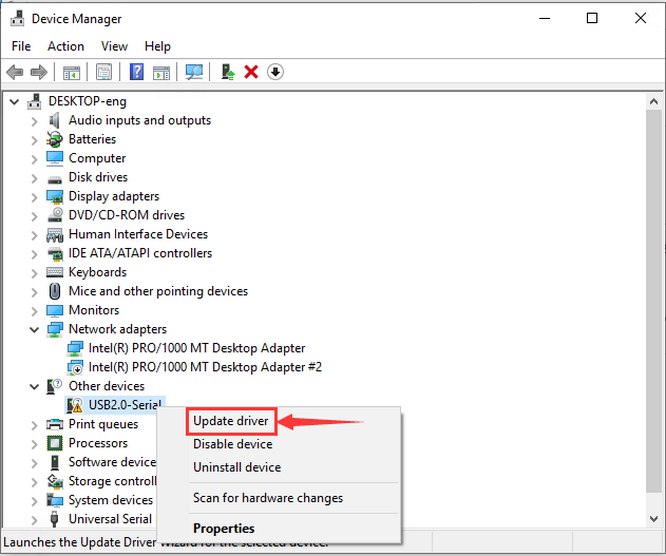
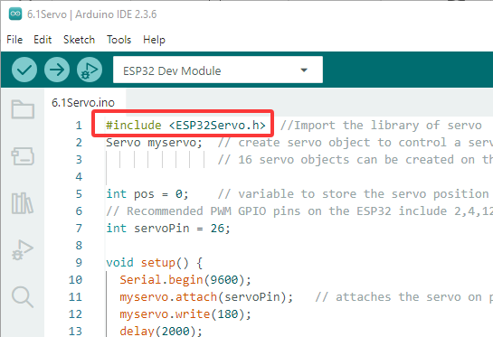
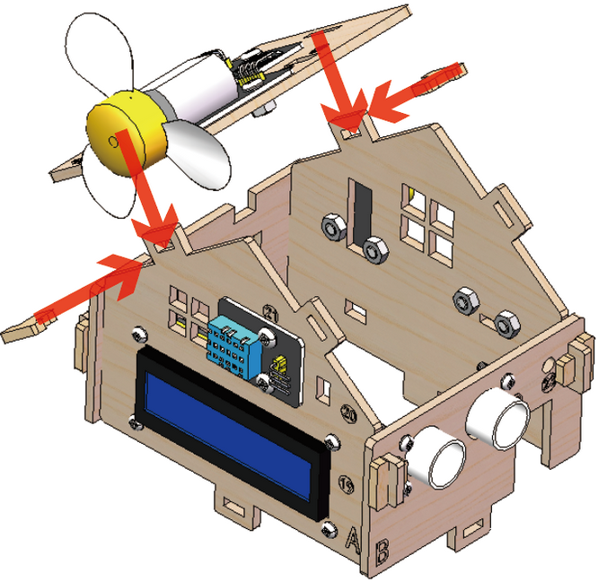
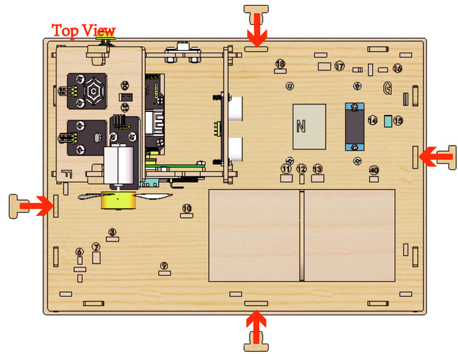
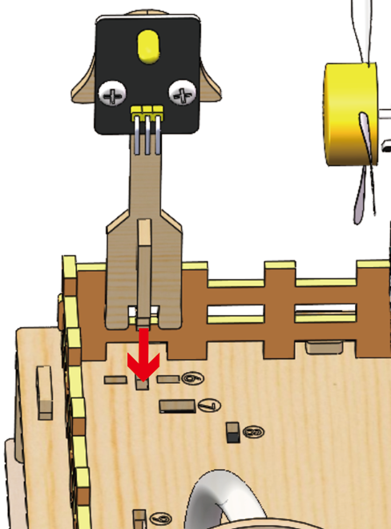
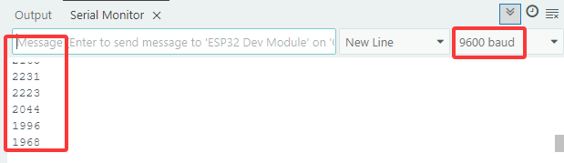

# Arduino Tutorial

## 1. Code and Library Download

Download links for the tutorial's library files and code files:

[Click to download](./resource.zip)


For more details, please visit our official website: [https://www.keyestudio.com/](https://www.keyestudio.com/)

## 2.Configure the Arduino

### 2.1 What is Arduino?

Arduino is an open-source electronics platform based on easy-to-use hardware and software.  Arduino boards are able to read inputs- light on a sensor, a finger on a button, or a Twitter message\- and turn it into an output - activating a motor, turning on an LED, publishing something online. You can tell your board what to do by writing the program code in the IDE and sending the instructions to the microcontroller on the board. To do so you use the Arduino programming language (based on Wiring), and the Arduino Software (IDE), based on Processing.

### 2.2 Install the Arduino IDE for Windows

Arduino official:[Software | Arduino](https://www.arduino.cc/en/software/)


.Here we click on the  option forthe easiest installation.


1. Here,  we will take Windows system as an example to introduce how to download and install it. Two versions are provided for Windows: for installing and for downloading(a zipped file, no need to install).


Click **JUST DOWNLOAD** to download the software. 

2. Save the .exe file downloaded from the software page to your hard drive and simply run the file .


3. Read the License Agreement and agree it.


4. Choose the installation options.


5. Choose the install location.


6. Click finish and run Arduino IDE


### 2.3 Install Driver for KEYESTUDIO ESP32 PLUS Board

KEYESTUDIO ESP32 PLUS Board a universal WIFI plus Bluetooth development board based on ESP32, integrated with ESP32-WOROOM-32 module and compatible with Arduino.

It has a hall sensor, high-speed SDIO/SPI, UART, I2S as well as I2C. Furthermore, equipped with freeRTOS operating system, which is quite suitable forthe Internet of things and smart home.

**Specifications**

Voltage: 3.3V-5V

CurrentOutput: 1.2A(maximum)

Maximum power Output: 10W

Working temperature: -10℃~50℃

Dimension: 69*54*14.5mm

Weight: 25.5g

Environmental protection attributes: ROHS


**Install driver**

Connect the ESP32 board to the computer and wait for Windowsto begin its driverinstallation process. Often CH340 driver will be automatically installed by yoursystem when using Arduino. You can check the Device Manager orthe port ofthe Arduino IDE to see ifthe driverissuccessfully installed.


If the CH340 driver is not installed automatically, we need to install it manually. 

Click to download [Windows CH340 driver](./Windows.zip).


1. Open the **Device Manager** by right clicking “**My PC**” and selecting **Properties**. Look under **Other devices**. You should see an open port named **USB Serial**


2. Right click on the "**USB Serial**" and choose the "**Update Driver**" option.



3. Choose the "**Browse my computerfor Driversoftware**" option.


4. Select the driver file named "**usb_ch341_3.1.2009.06**", located in the Driver Folder of the

tutorial package.


5. Driversuccessfully installed.


6. Device Manager will automatically refresh. Look under Ports (COM & LPT). You should see an open port named “**USB-SERIAL CH340(COM3)**”


7. Click **Tools>Port** at Arduino IDE, you can find the same COM port asthe CH340 driver in the device manager.


### 2.4 Introduce of Arduino IDE 2.0


**Verify / Upload** - compile and upload your code to your Arduino Board. 

**Select Board & Port** - detected Arduino boards automatically show up here, along with the port number. 

**Sketchbook** - here you will find all of your sketches locally stored on your computer. Additionally, you can sync with the Arduino Cloud, and also obtain yoursketchesfrom the online environment. 

**Boards Manager** - browse through Arduino & third party packages that can be installed. For example, using a MKR WiFi 1010 board requiresthe Arduino SAMD Boards package installed. 

**Library Manager** - browse through thousands of Arduino libraries, made by Arduino & its community. 

**Debugger**- test and debug programsin realtime. 

**Search** -search for keywordsin your code. 

**Open Serial Monitor**- opensthe Serial Monitortool, as a new tab in the console.

If you want to learn more about Arduino IDE, please refer to this document：Getting Started with Arduino IDE 2

### 2.5 Add Libraries to Arduino IDE

**Why Use Libraries?**

Libraries are incredibly useful when creating a project of any type. They make our development

experience much smoother, and there almost an infinite amount out there. They are used to

interface with many different sensors, RTCs, Wi-Fi modules, RGB matrices and of course with other

components on your board. 

**Including a Library in the sketch**

To use a library, you first need to include the library at the top of the sketch.If you find a line of code in the format of `#include "library name" `at the beginning of the code when using our code, it means that you need to add this library file to arduino IDE first before you can successfully upload this code.



To make the smart farm kit work, we will need to **add these library files to the Arduino IDE.** You can find them in the tutorial package.


**Importing a .zip Library**

In the menu bar, go to **Sketch  > Include Library > Add .ZIP Library...** You will be prompted to select the library you want to add.


Navigate to the .zip file’s location and open it.


You may need to restart the Arduino IDE for the library to be available. After successfully installing the library file, you will see them in the list.


### 2.6 Configure the development environment for ESP32

Before using Arduino IDE to program the smart farm, you need to configure the Arduino IDE, select the correct board type (**ESP32 Dev Module**) for the ESP32 Plus board, and select the **COM port** that is assigned in the device manager.

There is no option for ESP32 in Arduino's default board list,so we need to **install it manually**.


Click **File > Preferences**. Copy the link of ESP32 board(https://espressif.github.io/arduino-esp32/package_esp32_index.json) into the **Additional boards manager URLs**, and click **OK**.


Click the icon of"**Board Manager**"in the upperleft corner.


Search for **ESP32** in the search box and install the latest version. You can check its process in the lower right corner. **During installation, keep the network stable. If the installation fails, repeat the above steps.**

<span style="color:red; font-size:20px;">Note: We adopt ESP32 version 3.1.3 in this tutorial. Please keep it consistent to avoid code incompatibilities.</span>


installation is complete:


Click **Tools> Board > esp32** **,**and choose the **EPS32 Dev Module**


Choose COM port. You may check your port number at Device Manager. If there are many COM ports, unplug the cable of board to see which port disappears. Then that one is the port ready to use. If there is no COM port, please check whether driver is installed.


Herein, our COM port is COM3. Click “Tools” → “Port” → “COM3”.


## 3. Set the Angle of the Servo

In the next lesson, we will assemble thissmart farm kit. Before assembling the servo to the kit, we need to **setits angle to 180**°so that it will work as expected.


1.Connect the servo to the **pin io26** of the Esp32 plus board Note: The brown, red and orange wire of the servo are respectively attached to Gnd(G), 5v(V) and **Pin io26.**


2.Connect the Esp32 plus board to the computer


3.Make sure you have installed the **ESP32Servo.h** library for the Arduino IDE. If not, please referto the previoussection to install it.


4.Open the **window_servo** code provided in ourtutorial package with Arduino IDE.


5.Click on **Tools**,select"**EPS32 Dev Module**"for the board type, and select **COM-XX** for Port asshown in the Device Manager.


6.Click on upload >>>done uploading, the servo will be set to 180°.


## 4. Assemble the Smart Farm Kit

### Step 1 Install the ESP32 Board and the Relay Module

##### 1.1 Required components


------

##### 1.2


------

##### 1.3


------

##### 1.4


------

##### 1.5


------

### Step 2Install the Fixing Frame for Battery Case and install the Feeding Cabin,connect the ESP32 board and the Relay Module

##### 2.1 Required components


------

##### 2.2

Assemble the wooden board X and O on bottom plate


------

##### 2.3


------

##### 2.4


------

##### 2.5


------

##### 2.6


------

##### 2.7


------

##### 2.8 Connect the ESP32 board and the Relay Module

|    Module    |                   Wire                    | Pin  |
| :----------: | :---------------------------------------: | :--: |
| Relay Module | <span style="color:red;">3PIN 20cm</span> | IO25 |

| Module Pin | Wire Color | ESP32 Board Pin |
| :--------: | :--------: | :-------------: |
|     V      |    RED     |        V        |
|     G      |   BLACK    |        G        |
|     S      |   YELLOW   |      io25       |


------

##### 2.9


------

### Step 3 Install the Substructure of the house

##### 3.1 Required components


------

##### 3.2


------

##### 3.3


------

##### 3.4


------

##### 3.5


------

##### 3.6


------

##### 3.7


------

##### 3.8


------

##### 3.9


------

##### 3.10


------

##### 3.11


------

### Step 4 Install the Door of the Feeding Cabin

##### 4.1 Required components


------

##### 4.2 Set Servo to 180°


The acrylic sheet is packed separately, and it is recommended that you tear off its protective film to reduce the friction when it moves as a door.

------

##### 4.3 Install Servo


------

##### 4.4 

**Note: The screws need to be tightened to keep the servo stable, otherwise the door may get stuck**


------

##### 4.5


 Install M1.4*6MM self-tapping screws as shown below 


------

##### 4.6


------

##### 4.7


------

##### 4.8

Do not turn the gear after it is installed on the servo. If you have already turned the gear you will need to readjust the servo angle to 180°.


------

##### 4.9 

**NOTE: When installing the lid of the feeding box, its opening should be fully closed.**


------

##### 4.10


------

##### 4.11


------

##### 4.12


------

##### 4.13 Test the door

1) Connect Servo to pin IO26 of the ESP32 board. Connect yellow to S, red to V, black to G.


2. Connect 6 AA batteries to the DC 7-12V port of ESP32 board. (Batteries not included in the kit)


3. Upload the Test code

A. Connect the ESP32 board to the computer with the usb cable. Open the INO file inside the **6.1Servo** folder with Arduino IDE.


B. Click on Tools, select "ESP32 Dev Module" for the board type in the drop-down menu bar, and select COM-XX for Port (According to the port assigned by your computer in the device manager)


C. Please make sure you have uploaded the **ESP32Servo** library and then upload the code. The door of the feeding cabin will open and close slowly.


<span style="color:red;">NOTE: After uploading the code, ifthe door cannot be opened and closed and the servo is hot, please turn offthe powerimmediately.</span>

**check:**

1. Whether the plastic door has good contact and force points with the gear structure of the servo. 
2. Whether the tip of the fixing screw on the gear structure of the servo is stuck with the plastic shell of the servo. If so, please loosen the fixing screw a little to prevent its tip from contacting the servo.


### Step 5 Install the LCD display and the DHT11 Sensor

##### 5.1 Required components


------

##### 5.2


------

##### 5.3


------

##### 5.4


------

##### 5.5 Prototype


------

##### 5.6 Wiring

**Connect modules via Dupont wires.**

|             Module              |   Wire    |
| :-----------------------------: | :-------: |
| Temperature and Humidity Sensor | 3PIN 20cm |

**Pay attention to the color of the Dupont wire:**

**For temperature and humidity sensor, connect yellow to S, red to V, black to G.**


------

##### 5.7

|  Module  |              Wire               |
| :------: | :-----------------------------: |
| LCD 1602 | 4PIN **(Black-Red-Blue-Green)** |

**For the LCD display, connect green to SCL, blue to SDA, red to VCC, black to GND.**


------

### Step 6 Install the Ultrasonic Module

##### 6.1 Required components


------

##### 6.2


------

##### 6.3


------

##### 6.4 Wiring

|      Module       |              Wire               |
| :---------------: | :-----------------------------: |
| Ultrasonic module | 4PIN **(Black-Green-Blue-Red)** |

**Pay attention to the color of the Dupont wire: For the ultrasonic module, connect blue to TRIG,green  to ECHO, red to VCC, black to GND.**


------

### Step 7 Install the PIR Motion Sensor and Button Module

##### 7.1 Required components


------

##### 7.2


------

##### 7.3


------

##### 7.4 Wiring

**Connect modules via Dupont wires.**

|      Module       |   Wire    |
| :---------------: | :-------: |
| PIR Motion Sensor | 3PIN 15cm |
|   Button Module   | 3PIN 15cm |

**Pay attention to the color of the Dupont wire: Connect yellow to S, red to V, black to G.**


------

### Step 8 Install the Walls of the House

##### 8.1 Required components


------

##### 8.2


------

##### 8.3


------

##### 8.4


------

##### 8.5


------

##### 8.6


------

##### 8.7


------

##### 8.8 Prototype


------

##### 8.9 Wiring

|    Module     |              Wire               |
| :-----------: | :-----------------------------: |
|      Fan      | 4PIN **(Black-Red-Blue-Green)** |
| Steam Sensor  |            3PIN 15cm            |
| Photoresistor |            3PIN 15cm            |

**Pay attention to the color of the Dupont wire: Connect yellow to S, red to V, black to G, blue to IN+, green to IN-.**


------

### Step 9 Install the Roof of the house

##### 9.1 Required components


------

##### 9.2



------

##### 9.3


------

##### 9.4 Keep the wires organized


------

### Step 10 Install the House and Ground

##### 10.1 Required components


------

##### 10.2


------

##### 10.3


------

##### 10.4 Bottom View


------

##### 10.5


------

##### 10.6 Arrange the wires


------

##### 10.7 


------

### Step 11 Wiring the House

##### 11.1 

**Pay attention to the color of the Dupont wire: Connect yellow to S, red to V, black to G.**

| NO.  |           Components            |               Wires                |      ESP32 Board Pins      |
| :--: | :-----------------------------: | :--------------------------------: | :------------------------: |
|  1   |               Fan               | 4pin, Divided Black-Red-Blue-Green | io18(IN-)   \|   io19(IN+) |
|  2   |        PIR Motion Sensor        |             3pin 15cm              |            io23            |
|  3   |             Button              |             3pin 15cm              |            io5             |
|  4   |        Ultrasonic Module        | 4pin,Divided Black-Green-Blue-Red  |    D12(TRIG) D13(ECHO)     |
|  5   |            LCD 1602             |          4pin, Connected           |            I2C             |
|  6   | Temperature and Humidity Sensor |             3pin 20cm              |            io17            |
|  7   |          Steam Sensor           |             3pin 15cm              |            io35            |
|  8   |          Photoresistor          |             3pin 15cm              |            io34            |
|  9   |              Servo              |                 --                 |            io26            |
|  10  |             Buzzer              |             3pin 20cm              |            io16            |
|  11  |               LED               |             3pin 20cm              |            io27            |
|  12  |       Water Level Sensor        |             3pin 25cm              |            io33            |
|  13  |      Soil Humidity Sensor       |             3pin 20cm              |            io32            |
|  14  |           Water Pump            |             3pin 20cm              |            io25            |


##### 11.2 Fan

Pass the Dupont wire connected to the fan through the hole **marked 30** on the wooden board.

| Components |                Wire                 |   ESP32 Board Pins   |
| :--------: | :---------------------------------: | :------------------: |
|    Fan     | 4PIN Divided (Black-Red-Blue-Green) | io18(IN-), io19(IN+) |

| Module Pin | Wire Color | ESP32 Board Pins |
| :--------: | :--------: | :--------------: |
|    IN-     |   GREEN    |    io18(IN-)     |
|    IN+     |    BLUE    |    io19(IN+)     |
|     V      |    RED     |     V (io19)     |
|     G      |   BLACK    |     G (io19)     |


------

##### 11.3 PIR Motion Sensor

Pass the Dupont wire connected to the PIR motion sensor through the hole marked 24 on the wooden board.

|     Component     |   Wire    | ESP32 Board Pin |
| :---------------: | :-------: | :-------------: |
| PIR Motion Sensor | 3PIN 15cm |      io23       |

**Connect red to V, black to G, yellow to S.**

| Module Pin | Wire Color | ESP32 Board Pin |
| :--------: | :--------: | :-------------: |
|     V      |    RED     |        V        |
|     G      |   BLACK    |        G        |
|     S      |   YELLOW   |      io23       |


------

##### 11.4 Button Module

Pass the Dupont wire connected to the button module through the hole marked 25 on the wooden board.

| Component |   Wire    | ESP32 Board Pin |
| :-------: | :-------: | :-------------: |
|  Button   | 3PIN 15cm |       io5       |

**Connect red to V, black to G, yellow to S.**

| Module Pin | Wire Color | ESP32 Board Pin |
| :--------: | :--------: | :-------------: |
|     V      |    RED     |        V        |
|     G      |   BLACK    |        G        |
|     S      |   YELLOW   |       io5       |


------

##### 11.5 Ultrasonic Module  

|     Component     |                  Wire                   |    ESP32 Board Pins    |
| :---------------: | :-------------------------------------: | :--------------------: |
| Ultrasonic Module | 4PIN **Divided** (Black-Green-Blue-Red) | io13(ECHO), io12(TRIG) |

**Connect red to V, black to G, blue to io12, green to io13.**

| Module Pin | Wire Color | ESP32 Board Pin |
| :--------: | :--------: | :-------------: |
|     V      |    RED     |    V (io12)     |
|     G      |   BLACK    |    G (io12)     |
|    ECHO    |   GREEN    |      io13       |
|    TRIG    |    BLUE    |      io12       |


------

##### 11.6 LCD 1602

| Component |                 Wire                  | ESP32 Board Pins |
| :-------: | :-----------------------------------: | :--------------: |
|  LCD1602  | 4PIN Connected (Black-Red-Blue-Green) |       I2C        |

**Connect red to V, black to G, blue to SDA, green to SCL.**

| Module Pin | Wire Color | ESP32 Board Pin |
| :--------: | :--------: | :-------------: |
|     V      |    RED     |        V        |
|     G      |   BLACK    |        G        |
|    SCL     |   GREEN    |       SCL       |
|    SDA     |    BLUE    |       SDA       |


------

##### 11.7 Temperature and Humidity Sensor  

Pass the Dupont wire connected to the button module through the hole marked 20 on the wooden board.

|            Component            |   Wire    | ESP32 Board Pins |
| :-----------------------------: | :-------: | :--------------: |
| Temperature and Humidity Sensor | 3PIN 20cm |       io17       |

**Connect red to V, black to G, yellow to io17.**

| Module Pin | Wire Color | ESP32 Board Pin |
| :--------: | :--------: | :-------------: |
|     V      |    RED     |        V        |
|     G      |   BLACK    |        G        |
|     S      |   YELLOW   |      io17       |


------

##### 11.8 Steam Sensor

|  Component   |   Wire    | ESP32 Board Pin |
| :----------: | :-------: | :-------------: |
| Steam Sensor | 3PIN 15cm |      io35       |

**Connect red to V, black to G, yellow to io35.**

| Module Pin | Wire Color | ESP32 Board Pin |
| :--------: | :--------: | :-------------: |
|     V      |    RED     |        V        |
|     G      |   BLACK    |        G        |
|     S      |   YELLOW   |      io35       |


------

##### 11.9 Photoresistor

|   Component   |   Wire    | ESP32 Board Pin |
| :-----------: | :-------: | :-------------: |
| Photoresistor | 3PIN 15cm |      io34       |

**Connect red to V, black to G, yellow to io34.**

| Module Pin | Wire Color | ESP32 Board Pin |
| :--------: | :--------: | :-------------: |
|     V      |    RED     |        V        |
|     G      |   BLACK    |        G        |
|     S      |   YELLOW   |      io34       |


------

##### 11.10 Servo

Pass the wire of Servo through the Hole 15, and then connect it to ESP32 board.

| Component | Wire | ESP32 Board Pin |
| :-------: | :--: | :-------------: |
|   Servo   | 3PIN |      io26       |

**Connect red to V, black to G, yellow to io26.**

| ESP32 Board Pin | Wire Color |
| :-------------: | :--------: |
|        V        |    RED     |
|        G        |   BLACK    |
|      IO26       |   YELLOW   |


------

##### 11.11 Buzzer

Pass the wire of Buzzer through the Hole 17, and then connect it to ESP32 board.

| Component |   Wire    | ESP32 Board Pin |
| :-------: | :-------: | :-------------: |
|  Buzzer   | 3PIN 20cm |      io16       |

**Connect red to V, black to G, yellow to io16.**

| Module Pin | Wire Color | ESP32 Board Pin |
| :--------: | :--------: | :-------------: |
|     V      |    RED     |        V        |
|     G      |   BLACK    |        G        |
|     S      |   YELLOW   |      io16       |


------

##### 11.12 LED

Pass the wire of LED through the Hole 7, and then connect it to ESP32 board.

| Component |   Wire    | ESP32 Board Pin |
| :-------: | :-------: | :-------------: |
|    LED    | 3PIN 20cm |      io27       |

**Connect red to V, black to G, yellow to io27.**

| Module Pin | Wire Color | ESP32 Board Pin |
| :--------: | :--------: | :-------------: |
|     V      |    RED     |        V        |
|     G      |   BLACK    |        G        |
|     S      |   YELLOW   |      io27       |


------

##### 11.13 Water Lever Sensor

Pass the wire of water level sensor through the Hole 13, and then connect it to ESP32 board.

|     Component      |                   Wire                    | ESP32 Board Pin |
| :----------------: | :---------------------------------------: | :-------------: |
| Water Lever Sensor | <span style="color:red;">3PIN 25cm</span> |      io33       |

**Connect red to V, black to G, yellow to io33.**

| Module Pin | Wire Color | ESP32 Board Pin |
| :--------: | :--------: | :-------------: |
|     V      |    RED     |        V        |
|     G      |   BLACK    |        G        |
|     S      |   YELLOW   |      io33       |


------

##### 11.14 Soil Humidity Sensor

Pass the wire of soil humidity sensor through the Hole 11, and then connect it to ESP32 board.

|      Component       |   Wire    | ESP32 Board Pin |
| :------------------: | :-------: | :-------------: |
| Soil Humidity Sensor | 3PIN 20cm |      io32       |

**Connect red to V, black to G, yellow to io32.**

| Module Pin | Wire Color | ESP32 Board Pin |
| :--------: | :--------: | :-------------: |
|     V      |    RED     |        V        |
|     G      |   BLACK    |        G        |
|     S      |   YELLOW   |      io32       |


------

##### 11.15 Relay Module  

|  Component   | Wire | ESP32 Board Pin |
| :----------: | :--: | :-------------: |
| Relay Module | 3PIN |      io25       |

| Module Pin | Wire Color | ESP32 Board Pin |
| :--------: | :--------: | :-------------: |
|     V      |    RED     |        V        |
|     G      |   BLACK    |        G        |
|     S      |   YELLOW   |      io25       |

Pass the wire of Water Pump through the Hole 11 in the way as shown below:


The red wire of the water pump is connected to the middle terminal of the relay module, and the black wire is connected to the GND of the ESP32 board.

In addition, you need to use a Dupont wire to connect the left terminal of the relay module to the 3.3V of the ESP32.


Insert the male terminal of the Dupont wire into the female terminal of the relay module and tighten it with a screwdriver.


<span style="color:red;">After the above steps, note that all the wiring has been finished. And wires of the LED, water level sensor, soil humidity sensor, buzzer and relay water pump have respectively passed through the holes of 7, 11, 13, 17 and 40 carved on the basswood board, preparing for the subsequent installation.</span>


------

### Step 12 Install the house and foundation

##### 12.1 Required components


------

##### 12.2


------

##### 12.3


------

##### 12.4



------

##### 12.5


------

### Step 13 Install the Plastic Sinks

##### 13.1 Required components


------

##### 13.2


------

##### 13.3


------

### Step 14 Install the soil module and water level module

##### 14.1 Required components


------

##### 14.2


------

##### 14.3


------

##### 14.4


------

##### 14.5


------

##### 14.6


------

##### 14.7


------

### Step 15 Install fence

##### 15.1 Required components


------

##### 15.2


------

##### 15.3


------

##### 15.4


------

### Step 16 Install the Buzzer and the Led Module

##### 16.1 Required components


------

##### 16.2



------

##### 16.3


------

##### 16.4


------

### Step 17 Decorate the House

##### 17.1 Required components


------

##### 17.2


------

##### 17.3


------

### Step 18 Install Solar Panel

##### 18.1 Required components


------

##### 18.2


------


##### 18.3


------

##### 18.4


------

##### 18.5

Install the LED light of the solar panel into this hole.


------

##### 18.6

Use a sticker to secure its wires to the wall


------

##### 18.7


------

##### 18.8


------

##### 18.9


------

##### 18.10


------

### Step 19 Install Battery Case

##### 19.1 Required components


------

##### 19.2

Install 6 AA batteries（Not included in the kit）


##### 19.3


------

##### 19.4


------

## 5. Projects

**Things to note before starting the projects**

Please make sure you have configured the Arduino according to section 1.

1. Driverfor KEYESTUDIO ESP32 PLUS Board


2. Add Librariesto Arduino IDE


3. Install ESP32 environment in Arduino : **3.1.3** (ESP32 by Espressif Systems)


Note: You must select **version 3.1.3**, otherwise it may be incompatible with the library files we provide

4. Click on **Tools**, select "**EPS32 Dev Module**" for the board type, and select **COM-XX** Port that the computer assignsto your Arduino device.


5. You can download all the files needed to run the robot arm, including the driver, codes, libraries

[Click to download](./resource.zip)


6. You need to prepare a 2.4 GHz WiFi(It can be a mobile hotspot or a router), another phone that can connect to the same WiFi and install the app we provided.

Arduino's memory can store a project at a time, updating the code erasesthe previous code. 

Let'slearn how thissmart farm worksstep by step through projects of different difficulty levels.

--------------

### 5.1 Lighting System

#### 5.1.1 Light up an LED

Open the **5.1.1Blink** code with Arduino IDE.

```c
#define LED_BUILTIN 27  //LED pins

void setup() {
  // initialize digital pin LED_BUILTIN as an output.
  pinMode(LED_BUILTIN, OUTPUT);
}

// the loop function runs over and over again forever
void loop() {
  digitalWrite(LED_BUILTIN, HIGH);  // turn the LED on (HIGH is the voltage level)
  delay(1000);                      // wait for a second
  digitalWrite(LED_BUILTIN, LOW);   // turn the LED off by making the voltage LOW
  delay(1000);                      // wait for a second
}
```

Choose the **ESP32 Dev Module** board and **COM** port, and upload the code.


**Test Result:**

LED blinks per second, because io27 on ESP32 board outputs high and low level alternatively every second.

| Power Level | Result  |
| :---------: | :-----: |
|    HIGH     | LED ON  |
|     LOW     | LED OFF |


--------------

#### 5.1.2 Controlthe LED with PWM

Open the **5.1.2PWM** code with Arduino IDE.

```c
#define led 27    //Define LED pin

void setup(){
  pinMode(led, OUTPUT);  //Set pin to output mode
}

void loop(){
  for(int i=0; i<255; i++)  //for loop statement. Constantly increase variable i till 255, exit the loop
  {
    analogWrite(led, i);  //PWM output, used to control the brightness of LED
    delay(3);
  }
  for(int i=255; i>0; i--)  //for loop statement. Constantly decrease variable i till 0, exit the loop
  {
    analogWrite(led, i);
    delay(3);
  }
}
```

Choose the **ESP32 Dev Module** board and **COM** port, and upload the code.


**Test Result:**

At an appropriate signal frequency, PWM changes effective output voltage by changing the duty cycle in one period. In plain English, within a specified time, the more high level the IO port outputs,  the greater PWM value is, and the lighter LED will be.

**The LED module willslowly light up from dark to bright, and then from dark to bright.**


----------

#### 5.1.3 Read the digital value of Button

Open the **5.1.3Button** code with Arduino IDE.

```c
#define ButtonPin 5 //Define the button pin to 5

void setup() {
  //initialize serial port and set baud rate to 9600
  Serial.begin(9600);
  //Set pin to input mode
  pinMode(ButtonPin,INPUT);
}

void loop() {
  //Define a value as the read button value
  int ReadValue = digitalRead(ButtonPin); 
  //Serial port prints the defined value
  Serial.print("The current status of the button is : ");
  Serial.println(ReadValue);
  delay(500);
}
```

Choose the **ESP32 Dev Module** board and **COM** port, and upload the code.


**Test Result:**

Open serial monitor and set the baud rate to 9600. 

When the button isreleased, the value is 1; if you pressthe button, it becomes 0.

The principle ofthe button module is a circuit controlled by this button. 

When the button is pressed, the circuit is closed so that current passes through the button to GND, which causesthe digital input pin to detect a low level. 

When the button isreleased, the circuit is cut and pin level increases due to a pull-up resistor, which makesthe digital pin to detect a high level.


---------

#### 5.1.4 Auto-locking Button

Open the **5.1.4Self-Locking_Button** code with Arduino IDE.

```c
#define ButtonPin 5 //Define the button pin
int value = 0;      //Define a value to determine the status of button

void setup() {
  //Initialize the serial port and set baud rate to 9600
  Serial.begin(9600);
  //Set the pin to inpu tmode
  pinMode(ButtonPin,INPUT);
}

void loop() {
  //Define a value as the read button value
  int ReadValue = digitalRead(ButtonPin); 
  //Detect whether the button is pressed
  if (ReadValue == 0) {
    //Eliminate the button shake
    delay(10);  
    if (ReadValue == 0) {
      value = !value;
      Serial.print("The current status of the button is : ");
      Serial.println(value);
    }
    //Detect again whether the button is still pressed
    //Pressed: execute the loop; Released: exit the loop to next step
    while (digitalRead(ButtonPin) == 0); 
  }
}

```

Choose the **ESP32 Dev Module** board and **COM** port, and upload the code.


**Test Result:**

Open serial monitor and set the baud rate to 9600. 

When you press the button once, 1 will be displayed. If you press button for the second time, the value becomes 0. Now, a common button boaststhe function of an auto-locking one.


------------

#### 5.1.5 Use the button to control LED module

Open the **5.1.5Lighting-System** code with Arduino IDE.

```c
#define ButtonPin 5   //Define a button pin
#define LED       27  //Define LED pin
int value = 0;        //Define a value to detect button status

void setup() {
  //initialize serial port and set baud rate to 9600
  Serial.begin(9600);
  //Set pin to input mode
  pinMode(ButtonPin,INPUT);
  //Set pin to output mode
  pinMode(LED,OUTPUT);
}

void loop() {
  //Define a value as the read button value
  int ReadValue = digitalRead(ButtonPin); 
  //Detect whether the button is pressed
  if (ReadValue == 0) {
    //Eliminate the button shake
    delay(10);  
    if (ReadValue == 0) {
      value = !value;
      //Detect the button status, press once to light up LED, press again to turn off LED, in a loop
      if(value) {
        digitalWrite(LED,HIGH);
      }else{
        digitalWrite(LED,LOW);
      }
    }
    //Detect the button status again
    //Pressed: execute the loop; Released: exit the loop to next step
    while (digitalRead(ButtonPin) == 0); 
  }
}
```

Choose the **ESP32 Dev Module** board and **COM** port, and upload the code.


**Test Result:**

When you press the button once, LED lights up; if you press again, LED turns off. This operation is a loop, which is consistent with the lighting principle in reality


---------

### 5.2 Light Control System

#### 5.2.1 Photocell-sensor

Open the **5.2.1Photocell-sensor** code with Arduino IDE.

```c
#define PhotocecllPin 34  //Define the photoresistor pin

void setup() {
  //Initialize the serial port
  Serial.begin(9600);
  //Set the pin to input mode
  pinMode(PhotocecllPin,INPUT);
}

void loop() {
  //Read the value of photoresistor
  int ReadValue = analogRead(PhotocecllPin);
  //Print the value. NOTE: ESP32 board is 12-bit ADC, whose detection value range is within 0~4095.
  Serial.print("Photocecll value: ");
  Serial.println(ReadValue);
  delay(500);
}
```

Choose the **ESP32 Dev Module** board and **COM** port, and upload the code.


**Test Result:**

Open the serial monitor. 

The brighterthe light detected by the photoresistoris, the greaterthe value will be.


A photoresistor module converts light signal into electric signal (voltage, current, and resistor).  When light hits the photoresistor, the stronger the light is, the smaller the resistance will be, so the greaterthe VCC voltage will passthrough the photoresistor.


-----------

#### 5.2.2 Light Control Syst

Open the **5.2.2Light-Control-System** code with Arduino IDE.

```c
#define PhotocecllPin 34  //Define the photoresistor pin
#define LED           27  //Define LED pin

void setup() {
  //Initialize serial port
  Serial.begin(9600);
  //Set the photoresistor pin to input mode 
  pinMode(PhotocecllPin,INPUT);
  //Set the LED pin to output mode
  pinMode(LED,OUTPUT);
}

void loop() {
  //Read the value of the photoresistor
  int ReadValue = analogRead(PhotocecllPin);
  //Print the value. NOTE: ESP32 board is 12-bit ADC, whose detection value range is within 0~4095.
  Serial.print("Photocecll value: ");
  Serial.println(ReadValue);
  //Determine:
  //The value of the photoresistor >= 800, LED turns off
  //The value of the photoresistor =< 800, LED turns on
  if(ReadValue >= 800) {
    digitalWrite(LED,LOW);
    Serial.println("LED OFF");
  }
  else{
    digitalWrite(LED,HIGH);
    Serial.println("LED ON");
  }
  delay(100);
}
```

Choose the **ESP32 Dev Module** board and **COM** port, and upload the code.


**Test Result:**

When the value of the photoresistor is greater than 800 (in daytime), LED goes off. However, if the value islessthan 800, LED will automatically light on.


-------

### 5.3 Alarm System

#### 5.3.1 PIR Motion Sensor

Open the **5.3.1PIR-Motion-Sensor** code with Arduino IDE.

```c
#define PyroelectricPIN 23

void setup() {
  Serial.begin(9600);
  pinMode(PyroelectricPIN,INPUT);
}

void loop() {
  //Read the value of PIR motion sensor
  int ReadValue = digitalRead(PyroelectricPIN);
  if(ReadValue){
    Serial.println("Someone");
  }
  else{
    Serial.println("No one");
  }
  delay(100);
}
```

Choose the **ESP32 Dev Module** board and **COM** port, and upload the code.


**Test Result:**

When someone is in the area, **Someone** is displayed on the monitor, and the red LED on the sensor goes off. However, if there is no one, **No one** will be printed and the LED on the sensor will always be on.


Voltage: 3~5V

Current: 3.6mA

Power: 18mW

Angle of View: Y = 90°, X = 110° (Theoretical value)

Detection Distance: ≤5m


---------

#### 5.3.2 Passive Buzzer


**Passive Buzzer** cannot vibrate to emit sound itself, unless putting a square wave signal with a certain frequency. Moreover, the

emitting sound varies due to the different frequency of square wave, so a passive buzzer can simulate tunes. 

An analog squire wave can be generated by changing the power level at pins. For example, after the high level lasting for 500ms, it shifts to a low level for another 500ms then to a high level again... 

We drive the buzzer via a squire wave within 200~5000Hz, and we can compute the frequency(f): **f=1/T**, T is theperiod (the total time of high and low level).


**Parameters:**

Voltage: 3~5V

Current: ≤5mA

Power: ≤25mW

Open the **5.3.2Passive-Buzzer** code with Arduino IDE.

```c
#define BuzzerPin 16  //Define the buzzer pin

void setup() {
  //Set the pin to output mode
  pinMode(BuzzerPin,OUTPUT);
}

void loop() {
  digitalWrite(BuzzerPin,HIGH);
  delayMicroseconds(500);//Delay 500us
  digitalWrite(BuzzerPin,LOW);
  delayMicroseconds(500);//Delay 500us
}
```

Choose the **ESP32 Dev Module** board and **COM** port, and upload the code.


**Test Result:**

Passive Buzzer keeps emitting sound.

-----------

#### 5.3.3 Buzzer-Tone

Open the **5.3.3Buzzer-Tone** code with Arduino IDE.

```c
const int buzzerPin = 16;   //Set buzzer pin to 16
void setup() {
  ledcAttachChannel(buzzerPin,1000,8,4);
}
void loop() {
    ledcWriteTone(buzzerPin,532);           //duo --C2
    delay(100);
    ledcWriteTone(buzzerPin,587);           //re --D3
    delay(100);
    ledcWriteTone(buzzerPin,659);           //mi --E3
    delay(100);
   //Alarm
   for(int i = 200; i<=1000; i+=10){ 
    ledcWriteTone(buzzerPin,i);
    delay(10);
   }
    //Alarm
   for(int i = 1000; i>=200; i-=10){ 
    ledcWriteTone(buzzerPin,i);
    delay(10);
   }
ledcWriteTone(buzzerPin,0);
}
```

Choose the **ESP32 Dev Module** board and **COM** port, and upload the code.


**Test Result:**

Buzzer alarms via`ledcWriteTone()`  function.

`ledcWriteTone()`  generates PWM signal with a certain frequency to drive the buzzer to vibrate, and the duration and tone is controlled by related parameters.

The `ledcWriteTone()` function needs to be used in conjunction with the `ledcAttachChannel()` function

**ledcAttachChannel**

This function is used to set duty for the LEDC channel.

```
bool ledcWriteChannel(uint8_t channel, uint32_t duty);
```

- `channel` select LEDC channel.
- `duty` select duty to be set for selected LEDC channel.

This function will return `true` if setting duty is successful. If `false` is returned, error occurs and duty was not set.

**ledcWriteTone**

This function is used to setup the LEDC pin to 50 % PWM tone on selected frequency.

```
uint32_t ledcWriteTone(uint8_t pin, uint32_t freq);
```

- `pin` select LEDC pin.
- `freq` select frequency of pwm signal. If frequency is `0`, duty will be set to 0.

This function will return `frequency` set for LEDC pin. If `0` is returned, error occurs and LEDC pin was not configured.

--------

#### 5.4 Buzzer-Music

Open the **5.3.4Buzzer-Music** code with Arduino IDE

```c
#define NOTE_B0  31
#define NOTE_C1  33
#define NOTE_CS1 35
#define NOTE_D1  37
#define NOTE_DS1 39
#define NOTE_E1  41
#define NOTE_F1  44
#define NOTE_FS1 46
#define NOTE_G1  49
#define NOTE_GS1 52
#define NOTE_A1  55
#define NOTE_AS1 58
#define NOTE_B1  62
#define NOTE_C2  65
#define NOTE_CS2 69
#define NOTE_D2  73
#define NOTE_DS2 78
#define NOTE_E2  82
#define NOTE_F2  87
#define NOTE_FS2 93
#define NOTE_G2  98
#define NOTE_GS2 104
#define NOTE_A2  110
#define NOTE_AS2 117
#define NOTE_B2  123
#define NOTE_C3  131
#define NOTE_CS3 139
#define NOTE_D3  147
#define NOTE_DS3 156
#define NOTE_E3  165
#define NOTE_F3  175
#define NOTE_FS3 185
#define NOTE_G3  196
#define NOTE_GS3 208
#define NOTE_A3  220
#define NOTE_AS3 233
#define NOTE_B3  247
#define NOTE_C4  262
#define NOTE_CS4 277
#define NOTE_D4  294
#define NOTE_DS4 311
#define NOTE_E4  330
#define NOTE_F4  349
#define NOTE_FS4 370
#define NOTE_G4  392
#define NOTE_GS4 415
#define NOTE_A4  440
#define NOTE_AS4 466
#define NOTE_B4  494
#define NOTE_C5  523
#define NOTE_CS5 554
#define NOTE_D5  587
#define NOTE_DS5 622
#define NOTE_E5  659
#define NOTE_F5  698
#define NOTE_FS5 740
#define NOTE_G5  784
#define NOTE_GS5 831
#define NOTE_A5  880
#define NOTE_AS5 932
#define NOTE_B5  988
#define NOTE_C6  1047
#define NOTE_CS6 1109
#define NOTE_D6  1175
#define NOTE_DS6 1245
#define NOTE_E6  1319
#define NOTE_F6  1397
#define NOTE_FS6 1480
#define NOTE_G6  1568
#define NOTE_GS6 1661
#define NOTE_A6  1760
#define NOTE_AS6 1865
#define NOTE_B6  1976
#define NOTE_C7  2093
#define NOTE_CS7 2217
#define NOTE_D7  2349
#define NOTE_DS7 2489
#define NOTE_E7  2637
#define NOTE_F7  2794
#define NOTE_FS7 2960
#define NOTE_G7  3136
#define NOTE_GS7 3322
#define NOTE_A7  3520
#define NOTE_AS7 3729
#define NOTE_B7  3951
#define NOTE_C8  4186
#define NOTE_CS8 4435
#define NOTE_D8  4699
#define NOTE_DS8 4978

#define BUZZERPIN 16
 
// notes in the melody:
int melody[] = {
NOTE_E4, NOTE_E4, NOTE_E4, NOTE_C4, NOTE_E4, NOTE_G4, NOTE_G3,
NOTE_C4, NOTE_G3, NOTE_E3, NOTE_A3, NOTE_B3, NOTE_AS3, NOTE_A3, NOTE_G3, NOTE_E4, NOTE_G4, NOTE_A4, NOTE_F4, NOTE_G4, NOTE_E4, NOTE_C4, NOTE_D4, NOTE_B3,
NOTE_C4, NOTE_G3, NOTE_E3, NOTE_A3, NOTE_B3, NOTE_AS3, NOTE_A3, NOTE_G3, NOTE_E4, NOTE_G4, NOTE_A4, NOTE_F4, NOTE_G4, NOTE_E4, NOTE_C4, NOTE_D4, NOTE_B3,
NOTE_G4, NOTE_FS4, NOTE_E4, NOTE_DS4, NOTE_E4, NOTE_GS3, NOTE_A3, NOTE_C4, NOTE_A3, NOTE_C4, NOTE_D4, NOTE_G4, NOTE_FS4, NOTE_E4, NOTE_DS4, NOTE_E4, NOTE_C5, NOTE_C5, NOTE_C5,
NOTE_G4, NOTE_FS4, NOTE_E4, NOTE_DS4, NOTE_E4, NOTE_GS3, NOTE_A3, NOTE_C4, NOTE_A3, NOTE_C4, NOTE_D4, NOTE_DS4, NOTE_D4, NOTE_C4,
NOTE_C4, NOTE_C4, NOTE_C4, NOTE_C4, NOTE_D4, NOTE_E4, NOTE_C4, NOTE_A3, NOTE_G3, NOTE_C4, NOTE_C4, NOTE_C4, NOTE_C4, NOTE_D4, NOTE_E4,
NOTE_C4, NOTE_C4, NOTE_C4, NOTE_C4, NOTE_D4, NOTE_E4, NOTE_C4, NOTE_A3, NOTE_G3
};
 
// note durations: 4 = quarter note, 8 = eighth note, etc.:
int noteDurations[] = {
8,4,4,8,4,2,2,
3,3,3,4,4,8,4,8,8,8,4,8,4,3,8,8,3,
3,3,3,4,4,8,4,8,8,8,4,8,4,3,8,8,2,
8,8,8,4,4,8,8,4,8,8,3,8,8,8,4,4,4,8,2,
8,8,8,4,4,8,8,4,8,8,3,3,3,1,
8,4,4,8,4,8,4,8,2,8,4,4,8,4,1,
8,4,4,8,4,8,4,8,2
};
 
void setup() {
  ledcAttachChannel(BUZZERPIN,1000,8,4);
  // iterate over the notes of the melody:
  for (int thisNote = 0; thisNote < 98; thisNote++) {
  
  // to calculate the note duration, take one second
  // divided by the note type.
  //e.g. quarter note = 1000 / 4, eighth note = 1000/8, etc.
  int noteDuration = 1000/noteDurations[thisNote];
  ledcWriteTone(BUZZERPIN, melody[thisNote]);
  delayMicroseconds(noteDuration);
  
  // to distinguish the notes, set a minimum time between them.
  // the note's duration + 30% seems to work well:
  int pauseBetweenNotes = noteDuration * 1.30;
  delay(pauseBetweenNotes);
  // stop
  ledcWriteTone(BUZZERPIN,0);
  }
}
 
void loop() {
// no need to repeat the melody.
}
```

Choose the **ESP32 Dev Module** board and **COM** port, and upload the code.


**Test Result:**

The buzzer will play music.

--------

#### 5.3.5 Alarm System

Open the **5.3.5Alarm-System** code with Arduino IDE

```c
#define BuzzerPin 16        //Set buzzer pin to 16
#define PyroelectricPIN 23  //Set PIR mition sensor to 23
#define Led 27              //Set led pin to 27

void setup() {
  Serial.begin(9600);
  //Set the pins modes
  pinMode(PyroelectricPIN,INPUT);
  pinMode(Led,OUTPUT);

  ledcAttachChannel(BuzzerPin,1000,8,4);
}
void loop() {
  //Read the value of PIR motion sensor
  int ReadValue = digitalRead(PyroelectricPIN);
  if(ReadValue){
    Serial.println("Someone");
    digitalWrite(Led,HIGH);
    //Alarm
    for(int i = 200; i<=1000; i+=10){ 
      ledcWriteTone(BuzzerPin,i);
      delay(10);
    }
    digitalWrite(Led,LOW);
    //Alarm
    for(int i = 1000; i>=200; i-=10){ 
      ledcWriteTone(BuzzerPin,i);
      delay(10);
    }
  }
  //Stop alarming
  ledcWriteTone(BuzzerPin,0);
  Serial.println("No one");
}
```

Choose the **ESP32 Dev Module** board and **COM** port, and upload the code.


**Test Result:**

When the sensor detects a motion, buzzer emitssound and LED blinksto remind of an invasion.


---------

### 5.4 Rain Detection System

#### 5.4.1 Steam Sensor


Steam sensor detects the presence of water, so it is usually used in rain detection. If the rain hits the conductive pads on the sensor, it will send a signal to the Arduino board.


**Parameters**:

- Voltage: 3~5V
- Current: 1.5mA
- Power: 7.5mW

Open the **5.4.1Alarm-System** code with Arduino IDE.

```c
#define SteamPin 35   //Define the steam sensor pin to 35

void setup() {
  Serial.begin(9600);
  pinMode(SteamPin,INPUT);
}

void loop() {
  //Read the value of steam sensor
  int ReadValue = analogRead(SteamPin);
  Serial.print("Steam Value: ");
  Serial.println(ReadValue);
  delay(500);
}
```

Choose the **ESP32 Dev Module** board and **COM** port, and upload the code.


**Test Result:**

Touch the detection area with your finger. The larger the area you touched is, the larger the valuewill be. 

You can open the serial monitorto observe the currently detected value (range: 0~4095).


--------

#### 5.4.2 Rainwater Detection System

Open the **5.4.2Rainwater-Detection-System** code with Arduino IDE

```c
#define SteamPin 35   //Define pins
#define BuzzerPin 16

void setup() {
  Serial.begin(9600);
  pinMode(SteamPin,INPUT);
  pinMode(BuzzerPin,OUTPUT);
}

void loop() {
  //Read the value of steam sensor
  int ReadValue = analogRead(SteamPin);
  Serial.print("Steam Value: ");
  Serial.println(ReadValue);
  //Determine whether the detected value is within 800~2000
  if(ReadValue >= 800 && 2000 > ReadValue){
    //Execute for 3 times
    for (int i = 0; i < 3; i++) {
      tone(BuzzerPin,200);
      delay(100);
      noTone(BuzzerPin);
      delay(100);
    }
  }
  //Determine whether the detected value is within 2000~4000
  else if (ReadValue >= 2000 && 4000 >= ReadValue) {
    for (int i = 0; i < 3; i++) {
      tone(BuzzerPin,400);
      delay(100);
      noTone(BuzzerPin);
      delay(100);
    }
  }
  //Determine whether the detected value is greater than 4000
  else if (ReadValue > 4000) {
    for (int i = 0; i < 3; i++) {
      tone(BuzzerPin,600);
      delay(100);
      noTone(BuzzerPin);
      delay(100);
    }
  }
  noTone(BuzzerPin);
  delay(500);
}
```

Choose the **ESP32 Dev Module** board and **COM** port, and upload the code.


**Test Result:**

The greater the detected value of the steam sensor is, the loader the sound emitted by the buzzer will be.


------

### 5.5 Solar Power System


**Parameters**

 Voltage: 5V

 Current: 80mA

 Power: 400mW

 Dimensions: 60*60mm

Codes are not required in this project. Importantly, we learn about the new environmental energy --- solar power. 

When good illumination is provided, LED will light up in yellow. The brighter the light is, the brighter the LED will be.

The solar panel absorbs light and directly or indirectly converts solar radiation into electricity. Compared with ordinary coal power generation, solar, wind and water power are more energy-saving and environment-friendly.


The Sun emits energy in waves with a wide range of wavelengths, from ultraviolet to visible and infrared light.

Wavelength of Ultraviolet:150~400nm;

Wavelength of Visible Light:400~760nm;

Wavelength of Infrared Light:760~4000nm;

The panel absorbs one of these ranges of wavelength and converts them into electricity.

**Q: Why does solar panel still work without sunlight?**

A: It works with not only sunlight but also ambient light. The brighter the light is, the greater the voltage will be, and the lighter the LED will be.

------------

### 5.6 Smart Feeding System

#### 5.6.1 Door of feeding cabin

Open the **5.6.1Servo** code with Arduino IDE.

```c
#include <ESP32Servo.h>  //Import the library of servo
Servo myservo;  // create servo object to control a servo
                // 16 servo objects can be created on the ESP32
                
int pos = 0;    // variable to store the servo position
// Recommended PWM GPIO pins on the ESP32 include 2,4,12-19,21-23,25-27,32-33 
int servoPin = 26;
                
void setup() {
  Serial.begin(9600);
  myservo.attach(servoPin);   // attaches the servo on pin 26 to the servo object
  myservo.write(180);
  delay(2000);
}

void loop() {

  for (pos = 80; pos <= 179; pos += 1) { // goes from 0 degrees to 80 degrees
    // in steps of 1 degree
    myservo.write(pos);              // tell servo to go to position in variable 'pos'
    delay(15);                       // waits 15ms for the servo to reach the position
  }
  for (pos = 180; pos >= 81; pos -= 1) { // goes from 80 degrees to 0 degrees
    myservo.write(pos);              // tell servo to go to position in variable 'pos'
    delay(15);                       // waits 15ms for the servo to reach the position
  }
}
```

Choose the **ESP32 Dev Module** board and **COM** port, and upload the code.


**Test Result:**

The door of feeding cabin is slowly opened and then closed.

**NOTE:** SG90 servo can rotate 180°. As the feeding box is small, 100° of rotation is enough to completely close the box. 

80°: fully open

120°: half open

180°: close


**ATTENTION**

Do not put your fingers into the box to avoid nipping!

Do not block the door with something to avoid damaging servo!

The dooris controlled by a servo.

**Internal Structure:**


① Signal(S): It receives the control signal from microcontroller. 

② Potentiometer: the feedback part of the Servo. It measures the position of output shaft. 

③ Embedded board (Internal controller): the core of the Servo. It processes external control signal and the feedback signal of position and drives the Servo. 

④ DC motor: the execution part. It outputs speed, torque and position. 

⑤ Gear system: It scales the outputs from motor to the final output Angle ccording to a certain transmission ratio.

**Drive the Servo:**

Signal(S) receives PWM to control the output of Servo, and the position of output shaft directly relies on the duty cycle of PWM. 

**For instance:**

A. If we send a signal with pulse width of 1.5ms to Servo, its shaft(horn) will revolves to the middle position(90°);

B. If pulse width = 0.5ms, the shaft turns to its minimum(0°);

C. If pulse width = 2.5ms, the shaft turns to its maximum(180°). 

**NOTE: The maximum angle varies from the types of Servos. Some are 170° while some are only 90°. In spite of this, Servos usually will move a half (of the maximum) if they receive a signal with pulse width of 1.5ms.**

----------

#### 5.6.2 Ultrasonic-Sensor


Open the **5.6.2Ultrasonic-Sensor** code with Arduino IDE.

```c
#define Trigpin 12 //connect trig to io12
#define Echopin 13 //connect echo to io13
int duration,distance;

void setup(){
  Serial.begin(9600); //Set the baud rate to 9600
  pinMode(Trigpin,OUTPUT);  //set trig pin to output mode
  pinMode(Echopin,INPUT);   //set echo pin to input mode
}
void loop(){
  digitalWrite(Trigpin,LOW);
  delayMicroseconds(2);
  digitalWrite(Trigpin,HIGH);
  delayMicroseconds(10);	//Trigger the trig pin via a high level lasting at least 10us
  digitalWrite(Trigpin,LOW);
  duration = pulseIn(Echopin,HIGH);	//the time of high level at echo pin
  distance = duration/58;		//convert into distance(cm)
  delay(50);
  Serial.print("distance:");	//Serial monitor prints the value
  Serial.print(distance);
  Serial.println("cm");
}
```

Choose the **ESP32 Dev Module** board and **COM** port, and upload the code.


**Test Result:**

In this kit, the detection range is within 3~8cm. 

Open the serial monitor and set the baud rate to 9600, the serial monitor will display the distance between the ultrasonic module and the obstacle in front.


-------

#### 5.6.3 Intelligent Feeding System

Open the **5.6.3Intelligent-Feeding-System** code with Arduino IDE.

```c
#include <ESP32Servo.h>  //Import the library of servo on ESP32 board
Servo myservo;  // create servo object to control a servo
                // 16 servo objects can be created on the ESP32

#define TrigPin 12 //connect trig to D12
#define EchoPin 13 //connect echo to D13
#define ServoPin 26
int duration,distance;

void setup(){

  Serial.begin(9600); //Set the baud rate to 9600
  pinMode(TrigPin,OUTPUT);  //set trig pin to output mode
  pinMode(EchoPin,INPUT);   //Set echo pin to input mode
  myservo.attach(ServoPin);   // attaches the servo on pin 26 to the servo object
}
void loop(){
  Serial.println(getDistance());
  //When the distance is detected within 2~7cm, open the feeding box. Or else, close. 
  if (getDistance() >= 2 && 7 >= getDistance()) {
    //Servo rotates to 80° to open the box
    myservo.write(80);
    delay(500);
  }
  else{
    myservo.write(180);
    delay(500);
  }
}

//Put the gotten distance in a function
float getDistance() {

  digitalWrite(TrigPin,LOW);
  delayMicroseconds(2);
  digitalWrite(TrigPin,HIGH);
  delayMicroseconds(10);	//Trigger the trig pin via a high level lasting at least 10us
  digitalWrite(TrigPin,LOW);
  duration = pulseIn(EchoPin,HIGH);	//the time of high level at echo pin
  distance = duration/58;		//convert into distance(cm)
  delay(50);
  
  return distance;
}
```

Choose the **ESP32 Dev Module** board and **COM** port, and upload the code.


**Test Result:**

The smart feeding system intelligently feeds domestic fowls via an ultrasonic module and a servo. The former detects the distance to animals while the later controls to open or close the feeding box. When a pet is detected close to the box, servo opens it to feed.

**ATTENTION**

Do not put your fingers into the box to avoid nipping!

Do not block the door with something to avoid damaging servo!


--------

### 5.7 Temperature Control System

#### 5.7.1 DHT11 temperature and humidity sensor


DHT11 temperature and humidity sensor outputs digital signals. It applies principles of analog signal acquisition and conversion as well as temperature and humidity sensing technology, so that it features long-term stability and high reliability. Besides, the sensor integrates a high-precision resistive humidity sensor and a resistive thermosensitive temperature sensor, and is connected with an 8-bit high-performance MCU.

Open the **5.7.4Temperature-Control-System** code with Arduino IDE

```c
#include <dht11.h>
#define DHT11PIN 17

dht11 DHT11;

void setup()
{
  Serial.begin(9600);
  Serial.println("DHT11 TEST PROGRAM ");
  Serial.print("LIBRARY VERSION: ");
  Serial.println(DHT11LIB_VERSION);
  Serial.println();
}

void loop()
{
  Serial.println("\n");

  int chk = DHT11.read(DHT11PIN);

  Serial.print("Read sensor: ");
  switch (chk)
  {
    case DHTLIB_OK: 
                Serial.println("OK"); 
                break;
    case DHTLIB_ERROR_CHECKSUM: 
                Serial.println("Checksum error"); 
                break;
    case DHTLIB_ERROR_TIMEOUT: 
                Serial.println("Time out error"); 
                break;
    default: 
                Serial.println("Unknown error"); 
                break;
  }

  Serial.print("Humidity (%): ");
  Serial.println((float)DHT11.humidity, 2);

  Serial.print("Temperature (oC): ");
  Serial.println((float)DHT11.temperature, 2);

  Serial.print("Temperature (oF): ");
  Serial.println(Fahrenheit(DHT11.temperature), 2);

  Serial.print("Temperature (K): ");
  Serial.println(Kelvin(DHT11.temperature), 2);

  Serial.print("Dew Point (oC): ");
  Serial.println(dewPoint(DHT11.temperature, DHT11.humidity));

  Serial.print("Dew PointFast (oC): ");
  Serial.println(dewPointFast(DHT11.temperature, DHT11.humidity));

  delay(2000);
}

double Fahrenheit(double celsius) 
{
        return 1.8 * celsius + 32;
}    //Convert Celsius degree to Fahrenheit degree

double Kelvin(double celsius)
{
        return celsius + 273.15;
}     //Convert Celsius degree to Kelvins

//Dew Point. The air is saturated and dews are produced under this temperature.
//Reference: http://wahiduddin.net/calc/density_algorithms.htm 
double dewPoint(double celsius, double humidity)
{
        double A0= 373.15/(273.15 + celsius);
        double SUM = -7.90298 * (A0-1);
        SUM += 5.02808 * log10(A0);
        SUM += -1.3816e-7 * (pow(10, (11.344*(1-1/A0)))-1) ;
        SUM += 8.1328e-3 * (pow(10,(-3.49149*(A0-1)))-1) ;
        SUM += log10(1013.246);
        double VP = pow(10, SUM-3) * humidity;
        double T = log(VP/0.61078);   // temp var
        return (241.88 * T) / (17.558-T);
}

// Fast calculate the Dew Point, its speed is 5 times of dewPoint()
// Reference: http://en.wikipedia.org/wiki/Dew_point
double dewPointFast(double celsius, double humidity)
{
        double a = 17.271;
        double b = 237.7;
        double temp = (a * celsius) / (b + celsius) + log(humidity/100);
        double Td = (b * temp) / (a - temp);
        return Td;
}

```

Choose the **ESP32 Dev Module** board and **COM** port, and upload the code.


**Test Result:**

Open the serial monitor and set the baud rate to 9600, the serial monitor will display the the current temperature and humidity value.


-------

#### 5.7.2 LCD 1602 Module

LCD 1602 possesses a standard 14-pin (without backlight) or 16-pin (with backlight) interface, saving the pins of MCU. Its display drives IC to realize I2C control.


Open the **5.7.2LCD1602** code with Arduino IDE.

```c
#include <LiquidCrystal_I2C.h>

//Initialize LCD 1602, 0x27 is I2C address
LiquidCrystal_I2C lcd(0x27,16,2);

void setup() {
  //Initialize LCD
  lcd.init();
  // Turn the (optional) backlight off/on
  lcd.backlight();
  //lcd.noBacklight();

  //Set the position o dcursor
  lcd.setCursor(0, 0);
  //LCD prints
  lcd.print("HELLO WORLD 0");
  lcd.setCursor(0, 1);
  lcd.print("HELLO WORLD 1");

  //Clear displays
  // lcd.clear();
}

void loop() {

  // Turn the display on/off (quickly)
  //lcd.noDisplay();
  //lcd.display();

  // Turns the underline cursor on/off
  //lcd.noCursor();
  //lcd.cursor();

  // Turn on and off the blinking cursor
  // lcd.noBlink();
  // lcd.blink();

  // These commands scroll the display without changing the RAM
  //lcd.scrollDisplayLeft();
  //lcd.scrollDisplayRight();

  // This is for text that flows Left to Right
  //lcd.leftToRight();
  //lcd.rightToLeft();

  // This will 'right justify' text from the cursor
  //lcd.autoscroll();
  //lcd.noAutoscroll();

}

```

Choose the **ESP32 Dev Module** board and **COM** port, and upload the code.


**Test Result:**

LCD1602 opens its backlight and displays ”HELLO WORLD 0“ and ”HELLO WORLD 1“.


--------

#### 5.7.3 Motor and Fan

130 Motor is able to adjust speed via PWM. In the process, two pins are needed to be connected for controlling.


Open the **5.7.3Motor** code with Arduino IDE.

```c
#define MotorPin1 19  //(IN+)
#define MotorPin2 18  //(IN-)

void setup() {
  pinMode(MotorPin1, OUTPUT);
  pinMode(MotorPin2, OUTPUT);
}

void loop() {
  //corotation 
  analogWrite(MotorPin1, 255); //Adjust the motor speed by modifying the analog value output range from 0-255
  analogWrite(MotorPin2, 0);
  delay(2000);
  //Stop Transition
  delay(200);
  analogWrite(MotorPin1, 0);
  analogWrite(MotorPin2, 0);
  delay(200);
  //reversal
  analogWrite(MotorPin1, 0);
  analogWrite(MotorPin2, 255);
  delay(2000);
  //Stop
  analogWrite(MotorPin1, 0);
  analogWrite(MotorPin2, 0);
  delay(2000);
}
```

Choose the **ESP32 Dev Module** board and **COM** port, and upload the code.


**Test Result:**

130 motor alternatively rotatesleft and right every 2 seconds. 

<span style="color:red;">NOTE: Since the fan is a high-power electronic device, please remember to use batteries to power it.</span>

-----------

#### 5.7.4 Temperature Control System

Open the **5.7.4Temperature-Control-System** code with Arduino IDE.

```c
#include <LiquidCrystal_I2C.h>
#include <dht11.h>

#define DHT11PIN 17
#define MotorPin1 19  //(IN+)
#define MotorPin2 18  //(IN-)

dht11 DHT11;

LiquidCrystal_I2C lcd(0x27, 16, 2);

void setup() {
  lcd.init();
  lcd.backlight();

  pinMode(MotorPin1, OUTPUT);
  pinMode(MotorPin2, OUTPUT);
}

void loop() {
  //Difine temperature and humidity value
  int Temperature;
  int Humidity;
  //Read the value
  int chk = DHT11.read(DHT11PIN);

  Temperature = DHT11.temperature;
  Humidity = DHT11.humidity;
  lcd.setCursor(0, 0);
  lcd.print("Temp:");
  lcd.setCursor(5, 0);
  lcd.print(Temperature);

  lcd.setCursor(0, 1);
  lcd.print("Hum:");
  lcd.setCursor(5, 1);
  lcd.print(Humidity);
  delay(500);

  if (Temperature >= 29) {
    //Turn left
    analogWrite(MotorPin1, 150);  //Adjust the motor speed by modifying the analog value output range from 0-255
    analogWrite(MotorPin2, 0);
  } else {
    //Stop
    delay(3000);
    analogWrite(MotorPin1, 0);
    analogWrite(MotorPin2, 0);
    delay(200);
  }
}
```

Choose the **ESP32 Dev Module** board and **COM** port, and upload the code.


**Test Result:**

When the temperature reaches 29°C, the fan will turn on to dissipate heat. When it is lower than 29°C, the fan will turn off (the fan just simulates heat dissipation, so the effect is not good), which saves energy forthe farm.


--------

### 5.8 Soil Humidity Monitoring System

#### 5.8.1 Soil Humidity Sensor


<span style="color:red;">Pay attention:Do not overflow water from plastic pools in experiments. Spilling water on other sensors may cause not only a short circuit or modules to be out of work but also heat generation and even explosion. Do be extra careful! Especially for younger users, please operate with your parents.</span>

Open the **5.8.1Soil-Humidity-Sensor** code with Arduino IDE.

```c
#define SoilHumidityPin 32

void setup() {
  Serial.begin(9600);
  pinMode(SoilHumidityPin,INPUT);
}

void loop() {
  //Define a variable as the value of soil humidity sensor
  int ReadValue = analogRead(SoilHumidityPin);
  Serial.println(ReadValue);
  delay(500);
}

```

Choose the **ESP32 Dev Module** board and **COM** port, and upload the code.


**Test Result:**

Open the serial monitor. Touch the detection area of the sensor with a wet finger and the currently detected humidity value will be printed on the monitor(range: 0~4095).


Soil humidity sensors are mainly used to measure water content in volumetric soil, monitor soil moisture,irrigate crops and protect forests.


----------

#### 5.8.2 Soil Humidity Monitoring System

We adopt LCD1602 to reveal the real-time value of soil humidity value. When the value is lower than the set minimum humidity,the buzzer will emitsound to prompt farmers of irrigation. 

Open the **5.8.2Soil-Humidity-Testing-System** code with Arduino IDE.

```c
#include <LiquidCrystal_I2C.h>

#define BuzzerPin 16
#define SoilHumidityPin 32

LiquidCrystal_I2C lcd(0x27,16,2);

void setup() {

  ledcAttachChannel(BuzzerPin,1000,8,4);

  pinMode(SoilHumidityPin,INPUT);

  lcd.init();
  lcd.backlight();  
  lcd.clear();

}

void loop() {

  float shvalue = analogRead(SoilHumidityPin);

  lcd.setCursor(0, 0);
  lcd.print("SoilHum:");
  lcd.setCursor(9, 0);
  lcd.print(shvalue);
  
  //When the detected value is lower than the set threshold, the buzzer emits sound
  if(200 >= shvalue)
  {
    ledcWriteTone(BuzzerPin,532);
    delay(100);
    ledcWriteTone(BuzzerPin,532);
    delay(100);
    ledcWriteTone(BuzzerPin,659);
    delay(100);
    ledcWriteTone(BuzzerPin,0);  //Stop alarming
  }
  delay(500);
  lcd.clear();
}

```

Choose the **ESP32 Dev Module** board and **COM** port, and upload the code.


**Test Result:**

The LCD1602 displaysthe reveal the real-time value ofsoil humidity value. When the value detected by the soil humidity sensorislowerthan 200, the buzzer emitssound to alarm.


<span style="color:red;">Pay attention:Do not overflow water from plastic pools in experiments. Spilling water on other sensors may cause not only a short circuit or modules to be out of work but also heat generation and even explosion. Do be extra careful! Especially for younger users, please operate with your parents.</span>

--------

### 5.9 Water Level Monitoring System

#### 5.9.1 Water Level Sensor

The water level sensor integrates a series of exposed parallel lines to measure the volume of water and droplets.


<span style="color:red;">Pay attention:With the exception of the detection area, the sensor is not waterproof. Spilling water on other area may result in a short circuit.</span>

Open the **5.9.1Water-Level-Sensor** code with Arduino IDE.

```c
#define WaterLevelPin 33

void setup() {

  Serial.begin(9600);
  pinMode(WaterLevelPin,INPUT);
}

void loop() {
  int ReadValue = analogRead(WaterLevelPin);
  Serial.println(ReadValue);
  delay(500);
}

```

Choose the **ESP32 Dev Module** board and **COM** port, and upload the code.


**Test Result:**

Open the serial monitor. Touch the detection area of the sensor with a wet finger and the currently detected value will be printed on the monitor(range: 0~4095).



--------

#### 5.9.2 Water Level Monitoring System

Open the **5.9.2Water-Level-Testing-System** code with Arduino IDE

```c
#include <LiquidCrystal_I2C.h>

#define BuzzerPin 16
#define WaterLevelPin 33

LiquidCrystal_I2C lcd(0x27,16,2);

void setup() {

  //Initialize the serial port
  Serial.begin(9600);
  //Set the water level pin to input mode
  pinMode(WaterLevelPin,INPUT);

  //Initialize LCD
  lcd.init();
  //turn on the LCD backlight
  lcd.backlight();
  //clear displays on LCD
  lcd.clear();

  ledcAttachChannel(BuzzerPin,1000,8,4);
}

void loop() {
  //Read the value of water level sensor
  int ReadValue = analogRead(WaterLevelPin);
  //Set the display position of cursor
  lcd.setCursor(0, 0);
  //Set the display position of characters
  lcd.print("WaterLevel:");
  lcd.setCursor(6, 1);
  lcd.print(ReadValue);
  
  //When the detected value exceeds the threshold, the buzzer starts to alarm
  if(ReadValue >= 2000)
  {
    ledcWriteTone(BuzzerPin,659);
    delay(100);
    ledcWriteTone(BuzzerPin,532);
    delay(100);
    ledcWriteTone(BuzzerPin,659);
    delay(100);
    ledcWriteTone(BuzzerPin,0);  //Stop alarming
  }
  delay(500);
  lcd.clear();
}
```

Choose the **ESP32 Dev Module** board and **COM** port, and upload the code.


**Test Result:**

LCD displays the real-time value of water level. When the water level sensor detects that the water level islowerthan 200, the buzzerstartsto alarm.


-------

### 5.10 Auto-Irrigation System

#### 5.10.1 Water Pumping System

In this experiment, we use ESP32 development board to turn on/off the water pump by a relay module. A pump lifts water and transports liquids, and usually is combined with a relay module in usage. 

**Relay Module:**

In usage, it is often used in the management of high voltage and load current, say, motors, high-currentsensors and high-powerlight.


**Normally Open (NO):** This pin is normally open, unless a signal is received by the signal pin of the relay. Therefore, common pins are disconnected via NC pin and connected through NO pin. 

**Common Contact (COM):** This pin connects to other modules, for example, water pump. 

**Normally Closed (NC):** NC pin is linked with COM pin to form a closed circuit. It uses ESP32 board to control the closure and the disconnection of the relay module.


**Water Pump:**


**Parameters:** 

Power voltage: 5V

Static current: 2mA

Maximum contact voltage: 250VAC/30VDC

Maximum current: 10A

Open the **5.10.1Water-Pump** code with Arduino IDE.

```c
#define RelayPin 25
char content;  //Define a character string as the received value from serial port

void setup() {
  Serial.begin(9600);
  pinMode(RelayPin,OUTPUT);
}

void loop() {
  //Serial.read() receives one byte once. For example, when input "aaa", it receives one "a" at a time for three times in total.
  if(Serial.available() > 0) {
    if (Serial.read() == 'a') //When the input value equals to "a", irrigation begins.
    {
      digitalWrite(RelayPin,HIGH);
      delay(400);//irrigation delay
      digitalWrite(RelayPin,LOW);
      delay(700);
    }
  }
}

```

Choose the **ESP32 Dev Module** board and **COM** port, and upload the code.


**Test Result:**

Open the serial monitor and **input "a", pump water once**. 

<span style="color:red;">Pay attention:Do not overflow water from plastic pools in experiments. Spilling water on other sensors may cause not only a short circuit or modulesto be out of work but also heat generation and even explosion. Do be extra careful! Especially for younger users, please operate with your parents.</span>

---------

#### 5.10.2 Auto-Irrigation System

In this experiment, we connect the two sensors on ESP32 development board and program to read their output valuesto controlthe relay and water pump.

If the soil is very dry, the relay will turn on to control the water pump to irrigate plants; And if the waterlevel istoo low, the water pump will not be able to work, and the buzzer will alarm.

Open the **5.10.2Auto-irrigation** code with Arduino IDE.

```c
#include <LiquidCrystal_I2C.h>

#define BuzzerPin 16
#define SoilHumidityPin 32
#define WaterLevelPin 33
#define RelayPin 25
#define ButtonPin 5  //Define a button pin
int value = 0;       //Set an initial button value

LiquidCrystal_I2C lcd(0x27, 16, 2);

void setup() {
  //Set the pins mode
  pinMode(SoilHumidityPin, INPUT);
  pinMode(WaterLevelPin, INPUT);
  pinMode(RelayPin, OUTPUT);
  pinMode(ButtonPin, INPUT);

  //Initialize LCD
  lcd.init();
  //Turn on LCD backlight
  lcd.backlight();
  //Clear LCD displays
  lcd.clear();

  ledcAttachChannel(BuzzerPin, 1000, 8, 4);
}

void loop() {
  //define variables as the read values of water level, humidity and button state
  int shvalue = analogRead(SoilHumidityPin);
  int wlvalue = analogRead(WaterLevelPin);
  int ReadValue = digitalRead(ButtonPin);

  //Set the display position of cursor
  lcd.setCursor(0, 0);
  //Set the display position of character strings
  lcd.print("SoilHum:");
  lcd.setCursor(9, 0);
  lcd.print(shvalue);
  lcd.setCursor(0, 1);
  lcd.print("WaterLevel:");
  lcd.setCursor(11, 1);
  lcd.print(wlvalue);

  //Determine whether the button is pressed
  if (ReadValue == 0) {
    //Eliminate the button shake
    delay(10);
    if (ReadValue == 0) {
      value = !value;
      Serial.print("The current status of the button is : ");
      Serial.println(value);
    }
    //Again, determine whether the button is still pressed
    //Pressed: execute the loop; Released: exit the loop to next execution
    while (digitalRead(ButtonPin) == 0)
      ;
  }
  //When the detected humidity is lower than the set threshold, the buzzer starts to alarm. Press button to stop alarming.
  if (500 >= shvalue && value == 0) {
    ledcWriteTone(BuzzerPin, 532);
    delay(100);
    ledcWriteTone(BuzzerPin, 532);
    delay(100);
    ledcWriteTone(BuzzerPin, 659);
    delay(100);
    ledcWriteTone(BuzzerPin, 0);  //Stop alarming
  }
  //When the detected water level is lower than the set threshold, the buzzer starts to alarm. Press button to stop alarming.
  if (500 >= wlvalue && value == 0) {
    ledcWriteTone(BuzzerPin, 411);
    delay(100);
    ledcWriteTone(BuzzerPin, 639);
    delay(100);
    ledcWriteTone(BuzzerPin, 411);
    delay(100);
    ledcWriteTone(BuzzerPin, 0);  //Stop alarming
  }
  //When the detected humidity is lower than the set threshold, and the water is sufficient in the pool, irrigation starts automatically.
  if (500 >= shvalue && wlvalue >= 1000) {
    digitalWrite(RelayPin, HIGH);
    delay(400);  //Irrigation delay.
    digitalWrite(RelayPin, LOW);
    delay(700);
  }
  delay(500);
  //Clear displays
  lcd.clear();
}
```

Choose the **ESP32 Dev Module** board and **COM** port, and upload the code.


**Test Result:**

LCD 1602 will display the current value ofsoil humidity and waterlevel.


When the detected soil humidity value islower than 500, the buzzer alarms to notify that the soil is being arid. If the waterlevel value is greaterthan 1000, the irrigation starts automatically. 

When the detected water level is lower than 500, the water pumping system doesn't work, and the buzzer alarmsto notify that waterisinsufficient. Pressthe button to stop alarming.


---------

### 5.11 Web-controlled Smart Farm

#### 5.11.0 Connect the ESP32 Board to the Network

ESP32 board is equipped with Wi-Fi(**2.4G**) and Bluetooth(4.2), which enable it to easily connect to WiFi and communicate with other devices on the network.

<span style="color:red">**What do you need to prepare:**</span>

-A **2.4 GHz** WiFi(It can be a mobile hotspot or a router) 

-The WIFI name and password

-A phone/IPAD/computerthat can connect to the same WiFi.

**Arduino IDE provides you wih library file <WiFi.h>, which support Wi-Fi configurations and ESP32 Wi-Fi networking**

**monitoring.**

A.**Base station mode** (STA or Wi-Fi client-side mode): In this mode, ESP32 connects to the Wi-Fi hotspot (AP). 

B. **AP mode** (Soft-AP or Wi-Fi hotspot mode): In this mode, other Wi-Fi devices connect to ESP32. 

C. **AP-STA mode**: In this mode, ESP32 is a Wi-Fi hotspot as well as a Wi-Fi device connecting to another Wi-Fi hotspot. 

D. These modes is compatible with multiple safe modes, like WPA, WPA2 and WEP. 

E. It is able to scan for Wi-Fi hotspot, including active and passive scan. 

F. It supports promiscuous mode to monitor IEEE802.11 Wi-Fi Packets.


**For wifi details, please refer to:**

[https://docs.espressif.com/projects/esp-idf/en/latest/esp32/api-reference/network/esp_wifi.html](https://docs.espressif.com/projects/esp-idf/en/latest/esp32/api-reference/network/esp_wifi.html)

ESPRESSIF official website: [https://www.espressif.com.cn/en/home](https://www.espressif.com.cn/en/home)


Open the **5.11.0Connect-the-ESP32-to-the-Network** code with Arduino IDE.

```c
#include <WiFi.h>

const char* ssid = "your_SSID";
const char* password = "your_PASSWORD";

void setup() {
  Serial.begin(9600);
  //Initialize Wifi
  WiFi.begin(ssid, password);
  //Scan for wifi. If connection fails, stay in connecting, and execute "while" loop
  while (WiFi.status() != WL_CONNECTED) {
    delay(1000);
    Serial.println("Connecting to WiFi...");
  }
  //Connected. Print the IP address
  Serial.println("Connected to WiFi");
  Serial.println(WiFi.localIP());
}

void loop() {
}
```

Change `your_SSID` in the code to the name of your wifi, and `your_PASSWORD` to the wifi password

```c
const char* ssid = "your_SSID";
const char* password = "your_PASSWORD";
```

Choose the **ESP32 Dev Module** board and **COM** port, and upload the code.


**Test Result:**

Upload the code, and the board will connect to Wi-Fi network and print the IP Address on the serial monitor.


-------

#### 5.11.1 Set Up a Website-HELLOWORLD

As long as connecting to Wi-Fi, Web server library of ESP32 is able to provide web pages. In the following example code, we set up a simple website to show “Hello, World!”. 

Open the **5.11.1WiFi-HTML-HELLOWORLD** code with Arduino IDE.

```c
#include <WiFi.h>
#include <WebServer.h>

const char* ssid = "your_SSID";
const char* password = "your_PASSWORD";

WebServer server(80); //Set the server port to 80. Enter the website by IP address rather than the port number.

//Initialize the website
void handleRoot() {
  //Used to send HTTP to the client-side for response, sending 200 means success.
  server.send(200, "text/html", "<h1>Hello, World!</h1>");
}

void setup() {
  Serial.begin(9600);
  //Initialize wifi
  WiFi.begin(ssid, password);
  //Scan for wifi. If connection fails, stay in connecting, and execute "while" loop
  while (WiFi.status() != WL_CONNECTED) {
    delay(1000);
    Serial.println("Connecting to WiFi...");
  }

  //Connected. Print the IP address
  Serial.println("Connected to WiFi");
  Serial.println(WiFi.localIP());

  server.on("/", handleRoot);
  //Start server
  server.begin();
  Serial.println("Web server started");
}

void loop() {
  server.handleClient();
}
```

Change `your_SSID` in the code to the name of your wifi, and `your_PASSWORD` to the wifi password. Then upload the code.

```c
const char* ssid = "your_SSID";
const char* password = "your_PASSWORD";
```

Choose the **ESP32 Dev Module** board and **COM** port, and upload the code.


**Test Result:**

In this example code, we establish a Web server by WebServer library on ESP32. The function handleRoot() asks for processing in root path and sends HTML response of “Hello, World!” to client-side. Then,setup()setsthe rootroute, and server.begin()startsthe Web server. 

Click on the serial monitorto view the IP address：


**NOTE: When PC, mobile phones and ESP32 board are connected to one network, you can visit this website at PC and**

**phones at the same time.** 

Accessthe IP in the PC browser or phone browser:


<span style="color:red;">Note: Requires **2.4 GHz** WIFI, not 5G The PC or mobile phone accessing the IP address needs to be connected to the same WIFI asthe ESP32 board.</span>


-------

#### 5.11.2 Web-controlled smart farm


Open the **5.11.2WiFi-HTML-Smart-Farm** code with Arduino IDE.

```c
#include <Arduino.h>
#include <WiFi.h>
#include <WebServer.h>
#include <LiquidCrystal_I2C.h>
#include <dht11.h>
#include <ESP32Servo.h>

// Pin Definitions
#define DHT11PIN        17  // Temperature and humidity sensor pin
#define LEDPIN          27  // LED pin
#define SERVOPIN        26  // Servo pin
#define FANPIN1         19  // Fan IN+ pin
#define FANPIN2         18  // Fan IN- pin
#define STEAMPIN        35  // Steam sensor pin
#define LIGHTPIN        34  // Photoresistor pin
#define SOILHUMIDITYPIN 32  // Soil humidity sensor pin
#define WATERLEVELPIN   33  // Water level sensor pin
#define RELAYPIN        25  // Relay pin

// Initialize sensors and components
dht11 DHT11;
LiquidCrystal_I2C lcd(0x27, 16, 2);
Servo myservo;  // Servo object to control the servo

// WiFi credentials
const char *SSID = "your_SSID";
const char *PASS = "your_PASSWORD";

// Create WebServer object
WebServer server(80);

// Variables for controlling states
static int A = 0;
static int B = 0;
static int C = 0;

// HTML Web page content
const char index_html[] PROGMEM = R"rawliteral(
<!DOCTYPE HTML>
<html>
<title>TEST HTML ESP32</title>
<head>
  <meta charset="utf-8">
  <style>
    html, body {
      margin: 0;
      width: 100%;
      height: 100%;
      display: flex;
      justify-content: center;
      align-items: center;
      flex-direction: column;
      background-color: #f0f0f0;
    }

    /* The main button container */
    .btn {
      display: flex;
      justify-content: center;  /* Center the buttons */
      gap: 10px;  /* Add space between buttons */
      width: 320px;  /* Set width to ensure buttons are tightly packed */
      flex-wrap: wrap; /* Allow buttons to wrap to new lines if needed */
      margin-bottom: 20px;  /* Space between buttons and data display */
    }

    /* Button style */
    .btn button {
      width: 70px;  /* Set width for buttons */
      height: 70px;  /* Set height for buttons */
      border: none;
      font-size: 16px;
      color: #fff;
      background-color: #89e689;
      cursor: pointer;
    }

    .btn button:active {
      top: 2px;
    }

    /* The data display area */
    #dht {
      text-align: center;  /* Center the text */
      width: 320px;  /* Same width as the button container */
      color: #fff;
      background-color: #47a047;
      font-size: 18px; /* Adjust font size for readability */
      padding: 10px;
      border-radius: 10px;  /* Rounded corners */
      box-sizing: border-box;
      margin-bottom: 10px; /* Add space between the data display and buttons */
    }

  </style>
</head>
<body>

  <!-- Display area for sensor data -->
  <div id="dht"></div>

  <!-- Button row -->
  <div class="btn">
    <button id="btn-led" onclick="setLED()">LED</button>
    <button id="btn-fan" onclick="setFan()">Fan</button>
    <button id="btn-feeding" onclick="setFeeding()">Feeding</button>
    <button id="btn-watering" onclick="setWatering()">Watering</button>
  </div>

  <script>
    function setLED() {
      var payload = "A"; 
      var xhr = new XMLHttpRequest();
      xhr.open("GET", "/set?value=" + payload, true);
      xhr.send();
    }
    function setFan() {
      var payload = "B"; 
      var xhr = new XMLHttpRequest();
      xhr.open("GET", "/set?value=" + payload, true);
      xhr.send();
    }
    function setFeeding() {
      var payload = "C"; 
      var xhr = new XMLHttpRequest();
      xhr.open("GET", "/set?value=" + payload, true);
      xhr.send();
    }
    function setWatering() {
      var payload = "D"; 
      var xhr = new XMLHttpRequest();
      xhr.open("GET", "/set?value=" + payload, true);
      xhr.send();
    }

    setInterval(function () {
      var xhttp = new XMLHttpRequest();
      xhttp.onreadystatechange = function () {
        if (this.readyState == 4 && this.status == 200) {
          document.getElementById("dht").innerHTML = this.responseText;
        }
      };
      xhttp.open("GET", "/dht", true);
      xhttp.send();
    }, 1000)
  </script>

</body>
</html>

)rawliteral";

// Function to merge sensor data into HTML format
String Merge_Data(void) {
  String dataBuffer;
  String Humidity;
  String Temperature;
  String Steam;
  String Light;
  String SoilHumidity;
  String WaterLevel;
  
  // Read DHT11 sensor
  int chk = DHT11.read(DHT11PIN);
  
  // Read other sensors
  Steam = String(analogRead(STEAMPIN) / 4095.0 * 100);
  Light = String(analogRead(LIGHTPIN));
  int shvalue = analogRead(SOILHUMIDITYPIN) / 4095.0 * 100 * 2.3;
  shvalue = shvalue > 100 ? 100 : shvalue;
  SoilHumidity = String(shvalue);
  int wlvalue = analogRead(WATERLEVELPIN) / 4095.0 * 100 * 2.5;
  wlvalue = wlvalue > 100 ? 100 : wlvalue;
  WaterLevel = String(wlvalue);
  Temperature = String(DHT11.temperature);
  Humidity = String(DHT11.humidity);
  
  // Construct HTML content
  dataBuffer += "<p>";
  dataBuffer += "<h1>Sensor Data</h1>";
  dataBuffer += "<b>Temperature:</b><b>" + Temperature + "</b><b>℃</b><br/>";
  dataBuffer += "<b>Humidity:</b><b>" + Humidity + "</b><b>%rh</b><br/>";
  dataBuffer += "<b>WaterLevel:</b><b>" + WaterLevel + "</b><b>%</b><br/>";
  dataBuffer += "<b>Steam:</b><b>" + Steam + "</b><b>%</b><br/>";
  dataBuffer += "<b>Light:</b><b>" + Light + "</b><br/>";
  dataBuffer += "<b>SoilHumidity:</b><b>" + SoilHumidity + "</b><b>%</b><br/>";
  dataBuffer += "</p>";

  return dataBuffer;
}

// Configure actions based on received HTTP requests
void Config_Callback() {
  if (server.hasArg("value")) {
    String HTTP_Payload = server.arg("value");
    Serial.printf("[%lu]%s\r\n", millis(), HTTP_Payload.c_str());

    if (HTTP_Payload == "A") {
      if (A) {
        digitalWrite(LEDPIN, LOW);
        A = 0;
      } else {
        digitalWrite(LEDPIN, HIGH);
        A = 1;
      }
    }

    if (HTTP_Payload == "B") {
      if (B) {
        digitalWrite(FANPIN1, LOW);
        digitalWrite(FANPIN2, LOW);
        B = 0;
      } else {
        delay(500);
        digitalWrite(FANPIN1, HIGH);
        digitalWrite(FANPIN2, LOW);
        delay(500);
        B = 1;
      }
    }

    if (HTTP_Payload == "C") {
      if (C) {
        myservo.write(80);
        delay(500);
        C = 0;
      } else {
        C = 1;
        myservo.write(180);
        delay(500);
      }
    }

    if (HTTP_Payload == "D") {
      digitalWrite(RELAYPIN, HIGH);
      delay(400);
      digitalWrite(RELAYPIN, LOW);
      delay(650);
    }
  }
  server.send(200, "text/plain", "OK");
}

// Handle invalid URL access
void notFound() {
  server.send(404, "text/plain", "Not found");
}

void setup() {
  Serial.begin(9600);
  
  // Connect to WiFi
  WiFi.begin(SSID, PASS);
  while (!WiFi.isConnected()) {
    delay(500);
    Serial.print(".");
  }
  Serial.println("WiFi connected.");
  Serial.println("IP address: ");
  Serial.println(WiFi.localIP());

  // Set up pins
  pinMode(LEDPIN, OUTPUT);
  pinMode(STEAMPIN, INPUT);
  pinMode(LIGHTPIN, INPUT);
  pinMode(SOILHUMIDITYPIN, INPUT);
  pinMode(WATERLEVELPIN, INPUT);
  pinMode(RELAYPIN, OUTPUT);
  pinMode(FANPIN1, OUTPUT);
  pinMode(FANPIN2, OUTPUT);

  delay(1000);

  // Attach servo to the pin
  myservo.attach(SERVOPIN);
  myservo.write(180);

  // Initialize LCD
  lcd.init();
  lcd.backlight();
  lcd.clear();
  lcd.setCursor(0, 0);
  lcd.print("IP:");
  lcd.setCursor(0, 1);
  lcd.print(WiFi.localIP());

  // Set up server routes
  server.on("/", HTTP_GET, []() {
    server.send(200, "text/html", index_html);
  });

  server.on("/dht", HTTP_GET, []() {
    server.send(200, "text/plain", Merge_Data().c_str());
  });

  server.on("/set", HTTP_GET, Config_Callback);
  server.onNotFound(notFound);

  // Start the server
  server.begin();
}

void loop() {
  server.handleClient();
}

```

Change `your_SSID` in the code to the name of your wifi, and `your_PASSWORD` to the wifi password. Then upload the code.

```c
const char* ssid = "your_SSID";
const char* password = "your_PASSWORD";
```

Choose the **ESP32 Dev Module** board and **COM** port, and upload the code.


**Test Result:**

**NOTE: When PC, mobile phones and ESP32 board are connected to one network, you can visit this website at PC and phones at the same time.** 

View IP address from LCD1602:：


Input the IP addressin browsers at mobile phones or PC, you can see the sensor values at the top of the page and controlthe LED, fan, feeding cabin and water pump with the buttons below.


<span style="color:red;">Note: Requires **2.4 GHz** WIFI, not 5G The PC or mobile phone accessing the IP address needs to be connected to the same WIFI asthe ESP32 board.</span>


----------

### 5.12 APP Control Smart Farm

**Pay attention: Do not overflow water from plastic pools in experiments. Spilling water on other sensors may cause a short circuit or modules to be out of work. If batteries get wet,even explosion may occur. Do be extra careful! For younger users, please operate with yourparents. Use batteries for power instead of just USB.** 

Open the **5.12.1APP-Smart-Farm** code with Arduino IDE. 

```c
#include <Arduino.h>
#ifdef ESP32
#include <WiFi.h>
#elif defined(ESP8266)
#include <ESP8266WiFi.h>
#endif

#include <dht11.h>
#include <ESP32Servo.h>
#include <LiquidCrystal_I2C.h>

//To be displayed
#define DHT11PIN 17         //Temperature and humidity sensor pin
#define RAINWATERPIN 35     //Steam sensor pin
#define LIGHTPIN 34         //Photoresistor pin
#define WATERLEVELPIN 33    //Water level sensor pin
#define SOILHUMIDITYPIN 32  //Soil humidity sensor pin
//To be controlled
#define LEDPIN 27     //LED pin
#define RELAYPIN 25   //Relay pin (to control water pump)
#define SERVOPIN 26   //Servo pin
#define FANPIN1 19    //Fan IN+ pin
#define FANPIN2 18    //Fan IN- pin
#define BUZZERPIN 16  //Buzzer pin

const char* ssid = "your_SSID";
const char* pwd = "your_PASSWORD";

//Initialize LCD1602, 0x27 is I2C address
LiquidCrystal_I2C lcd(0x27, 16, 2);
WiFiServer server(80);  //Initialize wifi server
dht11 DHT11;            //Initialize temperature and humidity sensor
Servo myservo;          // create servo object to control a servo
                        // 16 servo objects can be created on the ESP32

//Define variable as detected values
String request;
String dataBuffer;
int Temperature;   //Temperature
int Humidity;      //Humidity
int SoilHumidity;  //Soil humidity
int Light;         //Brightness
int WaterLevel;    //Water level
int Rainwater;     //Rainfall

void setup() {
  Serial.begin(9600);
  //Connect to wifi
  WiFi.begin(ssid, pwd);
  //Determine whether connected
  Serial.println("Connecting to WiFi...");
  while (WiFi.status() != WL_CONNECTED) {
    delay(1000);
    Serial.print(".");
  }
  delay(1000);
  //Serial monitor prints wifi name and IP address
  Serial.println("Connected to WiFi");
  Serial.print("WiFi NAME:");
  Serial.println(ssid);
  Serial.print("IP:");
  Serial.println(WiFi.localIP());

  //Initialize LCD
  lcd.init();
  // Turn the (optional) backlight off/on
  lcd.backlight();
  //lcd.noBacklight();
  lcd.clear();
  //Set the position of cursor
  lcd.setCursor(0, 0);
  //LCD prints
  lcd.print("IP:");
  //Set the position of cursor
  lcd.setCursor(0, 1);
  //LCD prints
  lcd.print(WiFi.localIP());

  //set pins mode
  pinMode(LEDPIN, OUTPUT);
  pinMode(RAINWATERPIN, INPUT);
  pinMode(LIGHTPIN, INPUT);
  pinMode(SOILHUMIDITYPIN, INPUT);
  pinMode(WATERLEVELPIN, INPUT);
  pinMode(RELAYPIN, OUTPUT);
  pinMode(FANPIN1, OUTPUT);
  pinMode(FANPIN2, OUTPUT);
  pinMode(BUZZERPIN, OUTPUT);
  delay(1000);

  // attaches the servo on pin 26 to the servo object
  myservo.attach(SERVOPIN);
  myservo.write(160);

  //Start server
  server.begin();

  // Configure LEDC channel
  ledcAttachChannel(BUZZERPIN, 1000, 8, 4);
}

void loop() {
  //Check whether a client is connected to the web server
  //When the client is connected to server, "server.available()" returns a WiFiClient object for communication at client-side.
  WiFiClient client = server.available();
  if (client) {
    Serial.println("New client connected");
    while (client.connected()) {
      //Determine whether the server sends data
      if (client.available()) {
        request = client.readStringUntil('s');
        Serial.print("Received message: ");
        Serial.println(request);
      }
      //Acquire all senser data
      getSensorsData();
      //put all data into "dataBuffer"
      dataBuffer = "";
      dataBuffer += String(Temperature, HEX);
      dataBuffer += String(Humidity, HEX);
      dataBuffer += dataHandle(SoilHumidity);
      dataBuffer += dataHandle(Light);
      dataBuffer += dataHandle(WaterLevel);
      dataBuffer += dataHandle(Rainwater);
      //Send data to server, transmit to APP
      client.print(dataBuffer);
      delay(500);

      //LED
      if (request == "a") {
        digitalWrite(LEDPIN, HIGH);
      } else if (request == "A") {
        digitalWrite(LEDPIN, LOW);
      }
      //Irrigation
      else if (request == "b") {
        digitalWrite(RELAYPIN, HIGH);
        delay(400);  //Irrigation delay
        digitalWrite(RELAYPIN, LOW);
        delay(650);
      }
      //Fan
      else if (request == "c") {
        delay(800);
        digitalWrite(FANPIN1, HIGH);
        digitalWrite(FANPIN2, LOW);
        delay(200);
      } else if (request == "C") {
        digitalWrite(FANPIN1, LOW);
        digitalWrite(FANPIN2, LOW);
      }
      //Feeding box
      else if (request == "d") {
        //Servo rotates to 80°, open feeding box
        myservo.write(80);
        delay(500);
      } else if (request == "D") {
        //Servo rotates to 160°, close feeding box
        myservo.write(160);
      }
      //Buzzer
      else if (request == "e") {
        ledcWriteTone(BUZZERPIN, 262);
        delay(800);
        ledcWriteTone(BUZZERPIN, 0);
        delay(100);
      }
      request = "";
    }
    Serial.println("Client disconnected");
  }
}

void getSensorsData() {
  //Acquire data
  int chk = DHT11.read(DHT11PIN);
  //Steam sensor
  Rainwater = analogRead(RAINWATERPIN);
  //Photoresistor
  Light = analogRead(LIGHTPIN);
  //Soil humidity sensor
  SoilHumidity = analogRead(SOILHUMIDITYPIN) * 1.8;
  //Water level sensor
  WaterLevel = analogRead(WATERLEVELPIN) * 1.8;
  //Temperature
  Temperature = DHT11.temperature;
  //Humidity
  Humidity = DHT11.humidity;
}


//Convert data into percentage
String dataHandle(int data) {
  // Convert analog values into percentage
  int percentage = (data / 4095.0) * 100;
  // If the converted percentage is greater than 100, output 100.
  percentage = percentage > 100 ? 100 : percentage;
  // Six characters store hexadecimal strings, one character is as terminators
  char hexString[3];
  // Convert hexadecimal values to 6-digit hexadecimal strings, add leading zeros: 0 is 00, 1 is 01...
  sprintf(hexString, "%02X", percentage);

  return hexString;
}

```

Change `your_SSID` in the code to the name of your wifi, and `your_PASSWORD` to the wifi password. Then upload the code.

```c
const char* ssid = "your_SSID";
const char* password = "your_PASSWORD";
```

Choose the **ESP32 Dev Module** board and **COM** port, and upload the code.


**Download APP**

**For Android：**

Method 1: Search “**IOT Farm”** in Google Play and download it.


**For iOS：**

Search **IOT farm** in APP Store and tap to download.


**The home page of the APP**


**APP Function Description**

1. After upload the code, connect the phone to the same WIFI as the ESP32, you only need to input IP address at upper-right conner to connect. **Note:** Requires **2.4 GHz** WIFI, not 5G.


2. Displays the temperature value of the farm in real time.


3. Displays the air humidity value of the farm in real time.


4. Displays the soil humidity value of the farm in real time.


5. Displays the sun brightness value of the farm in real time.


6. Displays the water level of the farm in real time.


7. Displays the analog rainfall value of the farm in real time.


8. Control LED.


9. Control irrigation via water pump.


10. Control the fan to adjust temperature.


11. Control servo to open or close feeding box.


12. Control the buzzer to sound.


