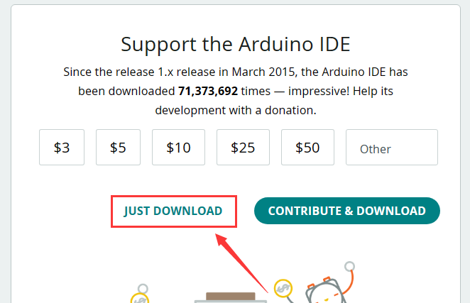
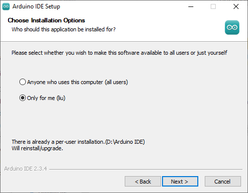
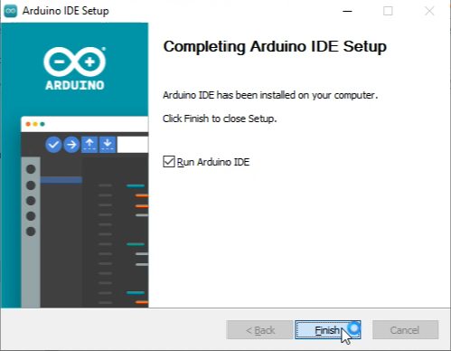
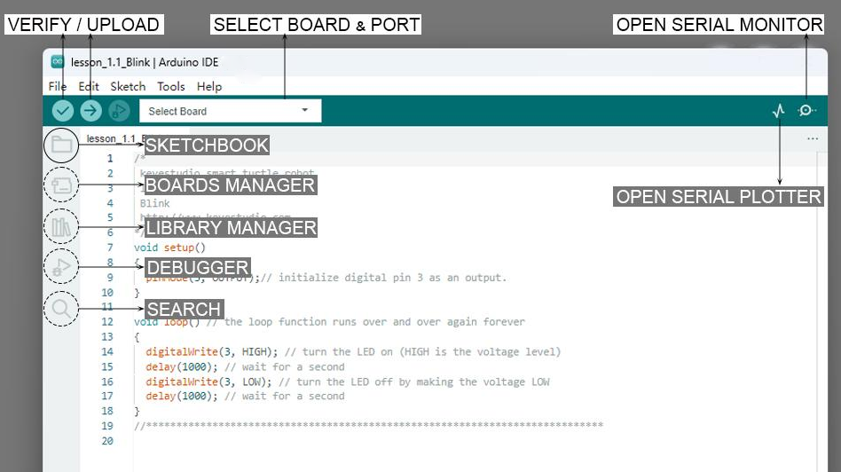

## 1. Introduce Arduino

### 1.1 What is Arduino?

Arduino is an open-source electronics platform based on easy-to-use
hardware and software. Arduino boards are able to read inputs- light on
a sensor, a finger on a button, or a Twitter message- and turn it into
an output - activating a motor, turning on an LED, publishing something
online. You can tell your board what to do by writing the program code
in the IDE and sending the instructions to the microcontroller on the
board. To do so you use the Arduino programming language (based on
Wiring), and the Arduino Software (IDE), based on Processing.

### 1.2 Install the Arduino IDE for Windows

Arduino official: `Software |
Arduino <https://www.arduino.cc/en/software/>`.

Here we click on the  option for the easiest
installation.

1. Here, we will take Windows system as an example to introduce how to
   download and install it. Two versions are provided for Windows: for
   installing and for downloading(a zipped file, no need to install).

Click **JUST DOWNLOAD** to download the software.

2. Save the .exe file downloaded from the software page to your hard
   drive and simply run the file .

3. Read the License Agreement and agree it.

4. Choose the installation options.

5. Choose the install location.

6. Click finish and run Arduino IDE

### 1.3 Introduce of Arduino IDE 2.0

**Verify / Upload** - compile and upload your code to your Arduino
Board.

**Select Board & Port** - detected Arduino boards automatically show up
here, along with the port number.

**Sketchbook** - here you will find all of your sketches locally stored on your computer. Additionally, you can sync with the Arduino Cloud, and also obtain your sketches from the online environment.

**Boards Manager** - browse through Arduino & third party packages that can be installed. For example, using a MKR WiFi 1010 board requires the Arduino SAMD Boards package installed.

**Library Manager** - browse through thousands of Arduino libraries, made by Arduino & its community.

**Debugger**- test and debug programs in real time.

**Search** - search for keywords in your code.

**Open Serial Monitor**- opens the Serial Monitor tool, as a new tab in the console.

If you want to learn more about Arduino IDE, please refer to this document：Getting Started with Arduino IDE 2

