## 2. Configura l'Arduino

### 2.1 Installa il driver per la scheda KEYESTUDIO ESP32 PLUS

La scheda KEYESTUDIO ESP32 PLUS è una scheda di sviluppo universale WIFI più Bluetooth basata su ESP32, integrata con il modulo ESP32-WOROOM-32 e compatibile con Arduino.

Dispone di un sensore Hall, SDIO/SPI ad alta velocità, UART, I2S e I2C. Inoltre, è dotata di sistema operativo freeRTOS, che è abbastanza adatto per l'Internet delle cose e la casa intelligente.

**Specifiche**

Tensione: 3.3V-5V

Corrente di uscita: 1.2A (massimo)

Potenza massima in uscita: 10W

Temperatura di lavoro: -10℃~50℃

Dimensioni: 69 * 54 * 14.5mm

Peso: 25.5g

Attributi di protezione ambientale: ROHS

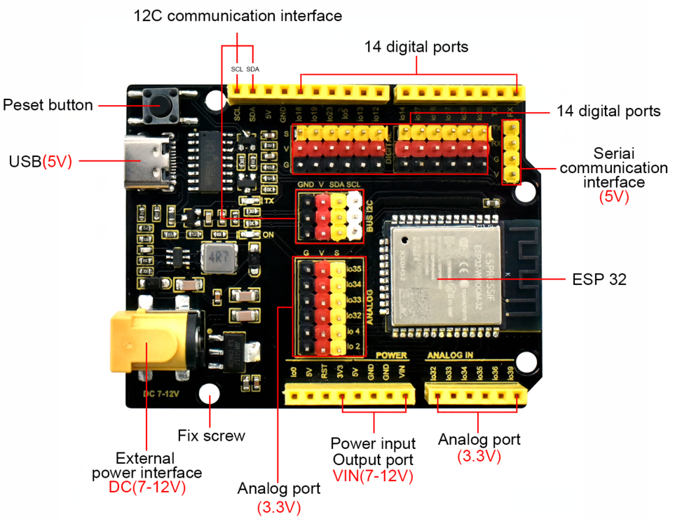

**Installa il driver**

Collega la scheda ESP32 al computer e attendi che Windows avvii il processo di installazione del driver. Spesso il driver CH340 verrà installato automaticamente dal tuo sistema quando usi Arduino. Puoi controllare la Gestione dispositivi o la porta dell'IDE di Arduino per vedere se il driver è stato installato correttamente.

Se il driver CH340 non viene installato automaticamente, dobbiamo installarlo manualmente.

Clicca per scaricare [driver CH340 per Windows](/Arduino/Windows.zip)

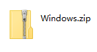

1. Apri la **Gestione dispositivi** facendo clic destro su "**Questo PC**" e selezionando **Proprietà**. Cerca sotto **Altri dispositivi**. Dovresti vedere una porta aperta denominata **USB Serial**.

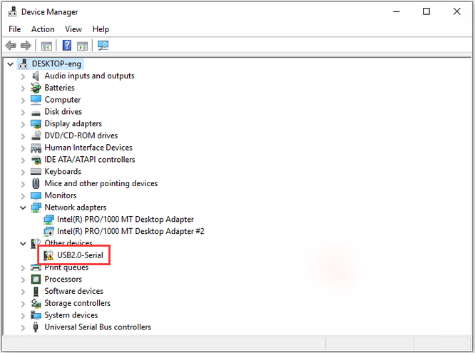

2. Fai clic destro su "**USB Serial**" e scegli l'opzione "**Aggiorna driver**".

3. Scegli l'opzione "**Cerca il software del driver nel computer**".

4. Seleziona il file del driver denominato "**usb_ch341_3.1.2009.06**", che si trova nella cartella Driver del pacchetto del tutorial.

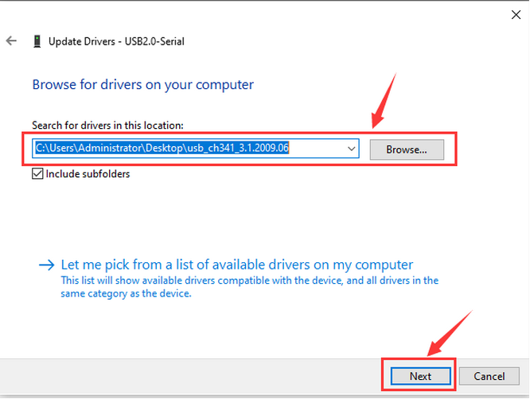

5. Driver installato con successo.

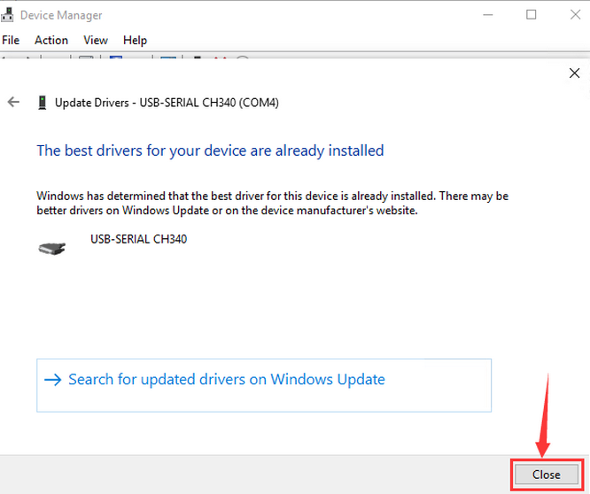

6. La Gestione dispositivi si aggiornerà automaticamente. Cerca sotto Porte (COM & LPT). Dovresti vedere una porta aperta denominata "**USB-SERIAL CH340(COM3)**".

7. Clicca **Strumenti>Porta** nell'IDE di Arduino, puoi trovare la stessa porta COM del driver CH340 nella gestione dispositivi.

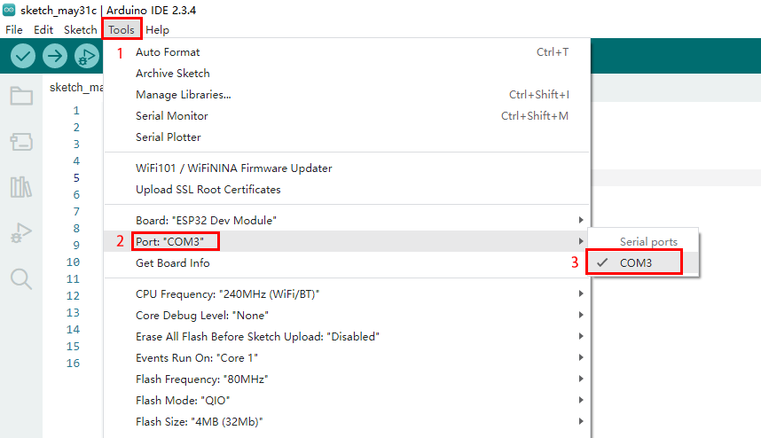

### 2.2 Aggiungi librerie all'IDE di Arduino

**Perché usare le librerie?**

Le librerie sono incredibilmente utili quando si crea un progetto di qualsiasi tipo. Rendono la nostra esperienza di sviluppo

molto più fluida, e ce ne sono quasi infinite. Vengono utilizzate per

interfacciarsi con molti sensori diversi, RTC, moduli Wi-Fi, matrici RGB e, naturalmente, con altri

componenti sulla tua scheda.

**Includere una libreria nello sketch**

Per utilizzare una libreria, devi prima includerla all'inizio dello sketch. Se trovi una riga di codice nel formato `#include "nome libreria"` all'inizio del codice quando usi il nostro codice, significa che devi prima aggiungere questo file di libreria all'IDE di Arduino prima di poter caricare con successo questo codice.

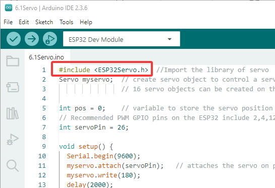

Per far funzionare il kit della fattoria intelligente, dovremo **aggiungere questi file di libreria all'IDE di Arduino.** Puoi trovarli nel pacchetto del tutorial.

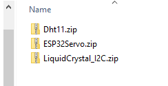

**Importare una libreria .zip**

Nella barra dei menu, vai su **Sketch > Includi libreria > Aggiungi libreria .ZIP...** Ti verrà chiesto di selezionare la libreria che desideri aggiungere.

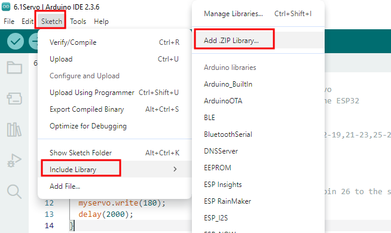

Naviga fino alla posizione del file .zip e aprilo.

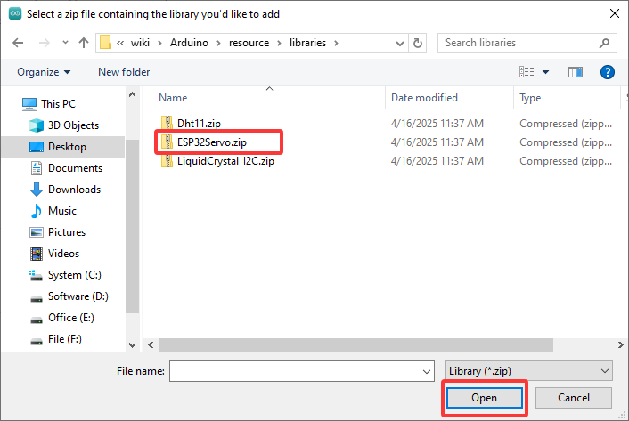

Potrebbe essere necessario riavviare l'IDE di Arduino affinché la libreria sia disponibile. Dopo aver installato correttamente il file della libreria, li vedrai nell'elenco.

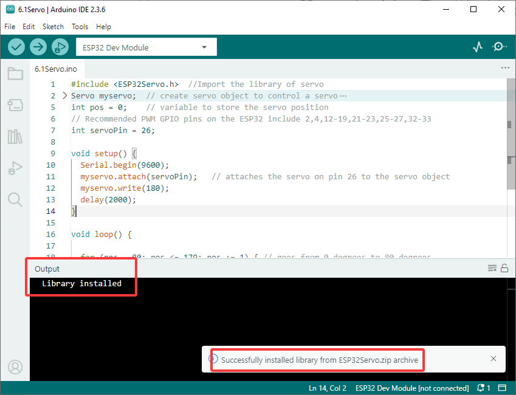

### 2.3 Configura l'ambiente di sviluppo per ESP32

Prima di utilizzare l'IDE di Arduino per programmare la fattoria intelligente, è necessario configurare l'IDE di Arduino, selezionare il tipo di scheda corretto (**ESP32 Dev Module**) per la scheda ESP32 Plus e selezionare la **porta COM** assegnata nella gestione dispositivi.

Non esiste un'opzione per ESP32 nell'elenco predefinito delle schede di Arduino, quindi dobbiamo **installarla manualmente**.

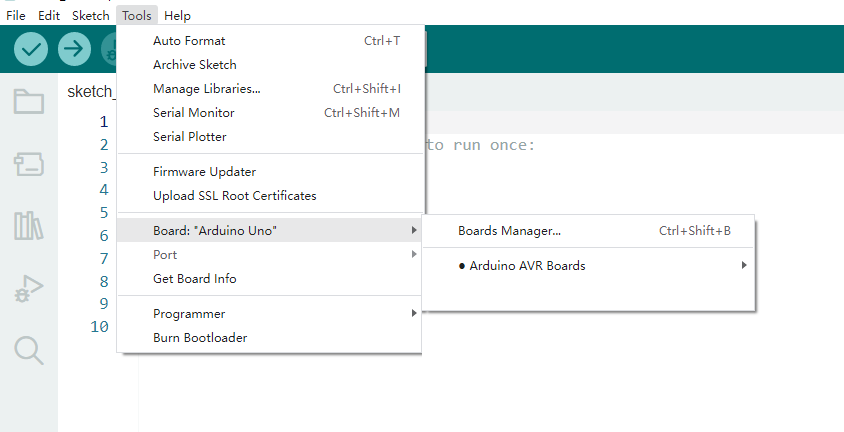

Clicca su **File > Preferenze**. Copia il link della scheda ESP32 (https://espressif.github.io/arduino-esp32/package_esp32_index.json) in **URL aggiuntivi per il gestore schede** e clicca **OK**.

Clicca sull'icona di "**Gestore schede**" nell'angolo in alto a sinistra.

Cerca **ESP32** nella casella di ricerca e installa l'ultima versione. Puoi controllare il processo nell'angolo in basso a destra. **Durante l'installazione, mantieni la rete stabile. Se l'installazione fallisce, ripeti i passaggi precedenti.**

Nota: in questo tutorial adottiamo la versione ESP32 3.1.3. Si prega di mantenerla coerente per evitare incompatibilità di codice.

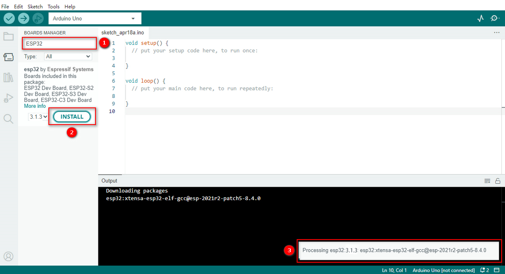

L'installazione è completa:

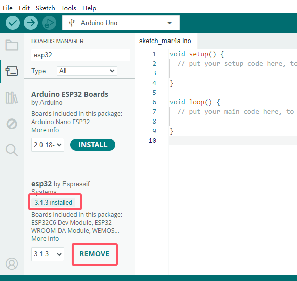

Clicca **Strumenti > Scheda > esp32**, e scegli il **Modulo di sviluppo EPS32**.

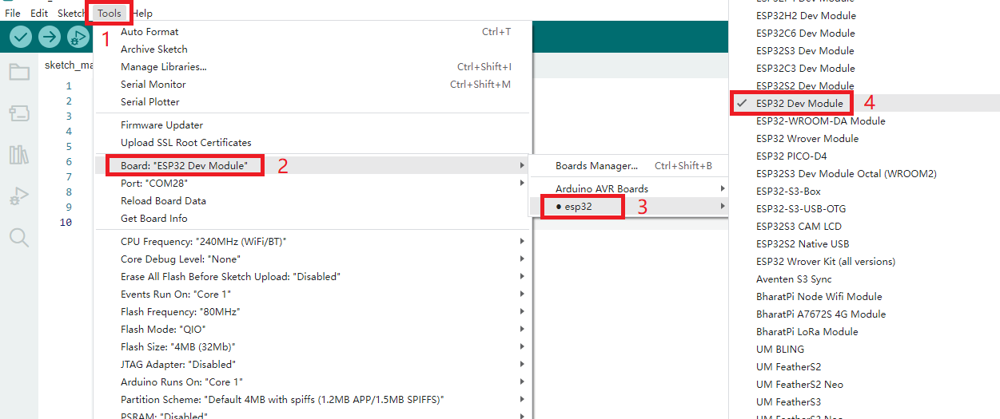

Scegli la porta COM. Puoi controllare il numero della tua porta in Gestione dispositivi. Se ci sono molte porte COM, scollega il cavo della scheda per vedere quale porta scompare. Quella sarà la porta pronta all'uso. Se non c'è nessuna porta COM, controlla se il driver è installato.

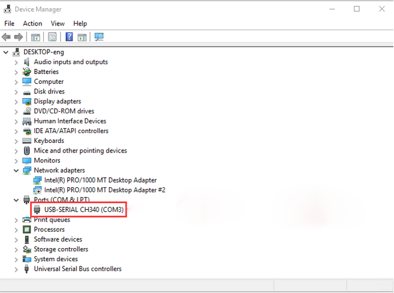

Qui, la nostra porta COM è COM3. Clicca su "Strumenti" → "Porta" → "COM3".

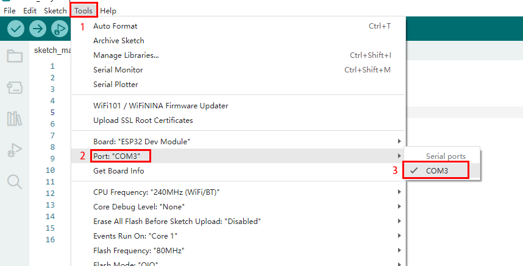