## 4. Assemblare il Kit Smart Farm

### Passo 1 Installare la scheda ESP32 e il modulo relè

#### 1.1 Componenti richiesti

#### 1.2

#### 1.3

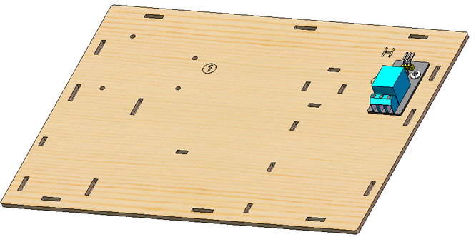

#### 1.4

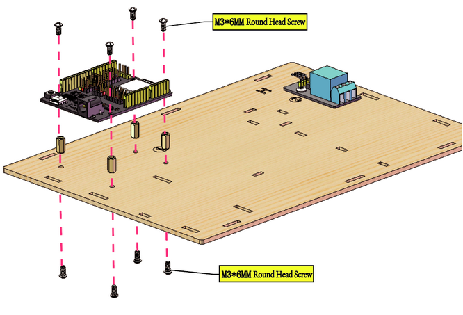

#### 1.5

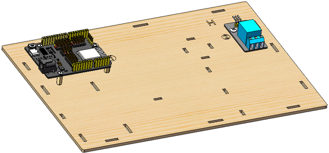

### Passo 2 Installare il telaio di fissaggio per il vano batteria e installare la cabina di alimentazione, collegare la scheda ESP32 e il modulo relè

#### 2.1 Componenti richiesti

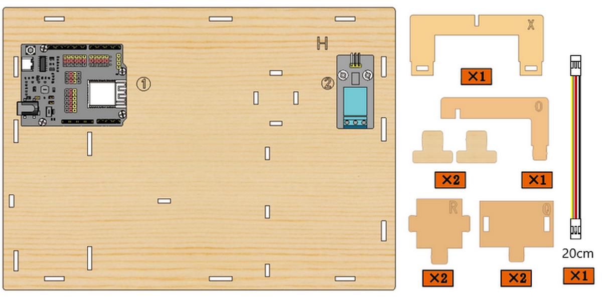

#### 2.2

Assemblare le tavole di legno X e O sulla piastra inferiore

#### 2.3

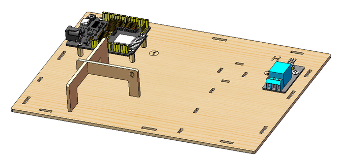

#### 2.4

#### 2.5

#### 2.6

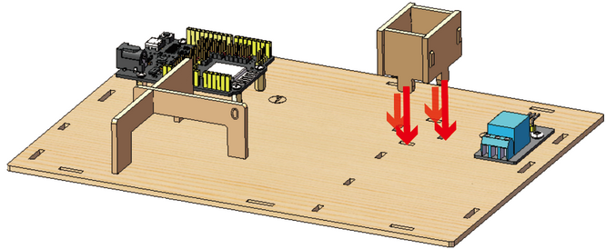

#### 2.7

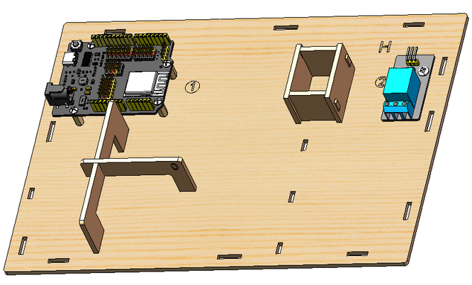

#### 2.8 Collegare la scheda ESP32 e il modulo relè

| Modulo | Filo | Pin |
| --- | --- | --- |
| Modulo relè | 3PIN 20cm | IO25 |

| Pin Modulo | Colore Filo | Pin Scheda ESP32 |
| --- | --- | --- |
| V | ROSSO | V |
| G | NERO | G |
| S | GIALLO | io25 |

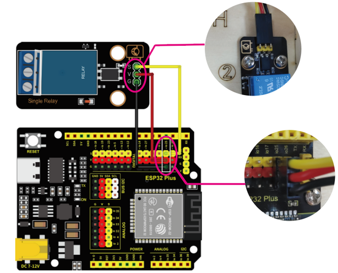

#### 2.9

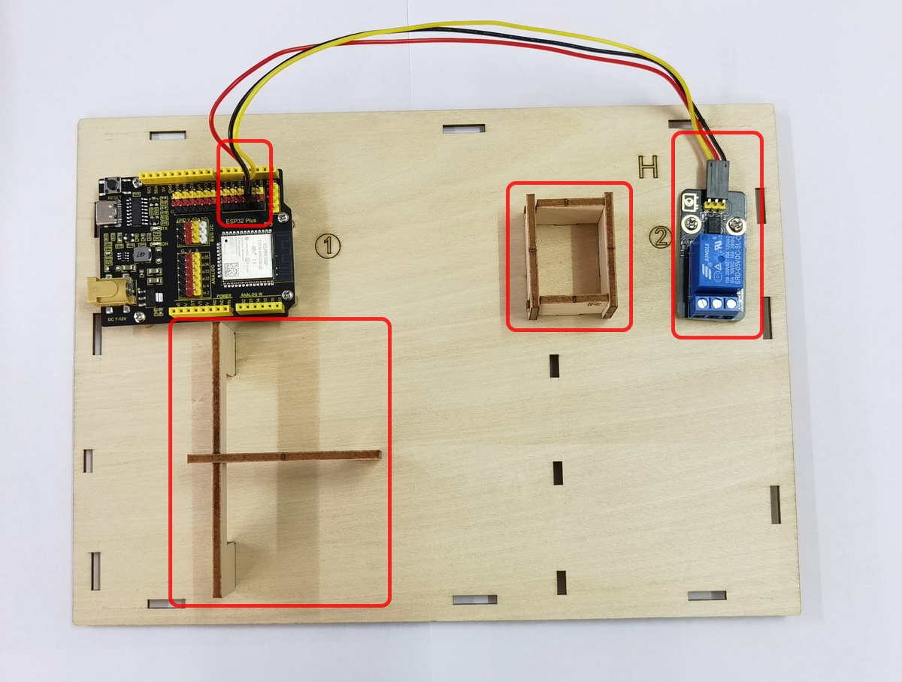

### Passo 3 Installare la sottostruttura della casa

#### 3.1 Componenti richiesti

#### 3.2

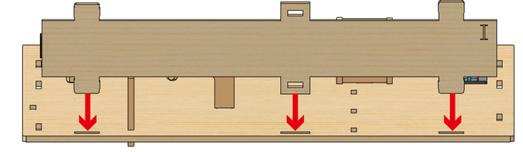

#### 3.3

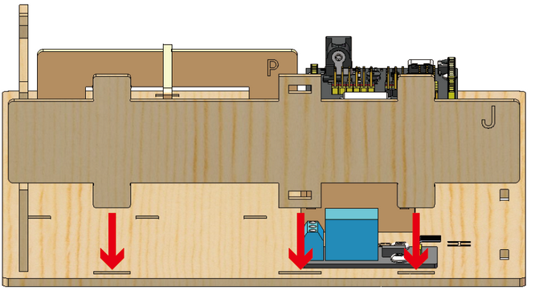

#### 3.4

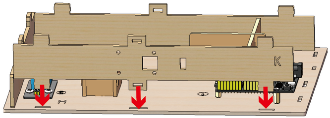

#### 3.5

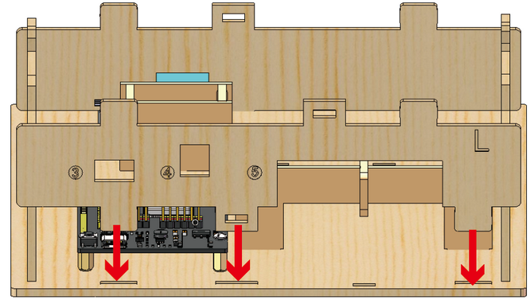

#### 3.6

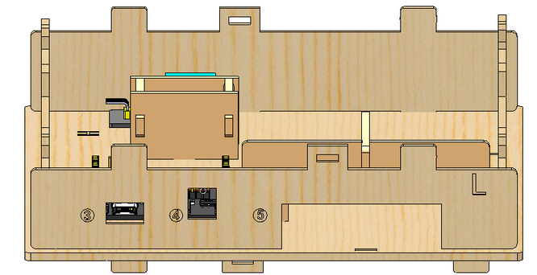

#### 3.7

#### 3.8

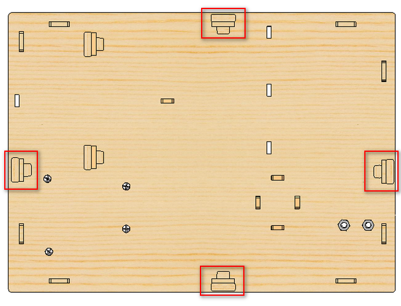

#### 3.9

#### 3.10

#### 3.11

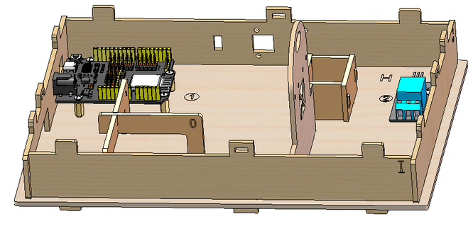

### Passo 4 Installare la porta della cabina di alimentazione

#### 4.1 Componenti richiesti

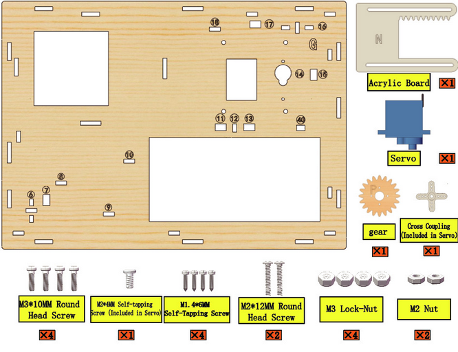

#### 4.2 Impostare il Servo a 180°

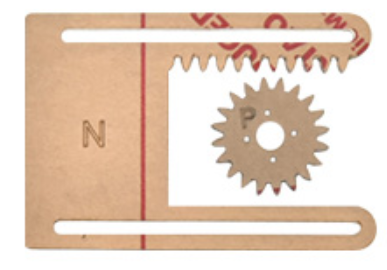

Il foglio acrilico è imballato separatamente, e si raccomanda di
rimuovere la sua pellicola protettiva per ridurre l'attrito quando si muove come
una porta.

#### 4.3 Installare il Servo

#### 4.4

**Nota: Le viti devono essere serrate per mantenere il servo stabile,
altrimenti la porta potrebbe bloccarsi.**

#### 4.5

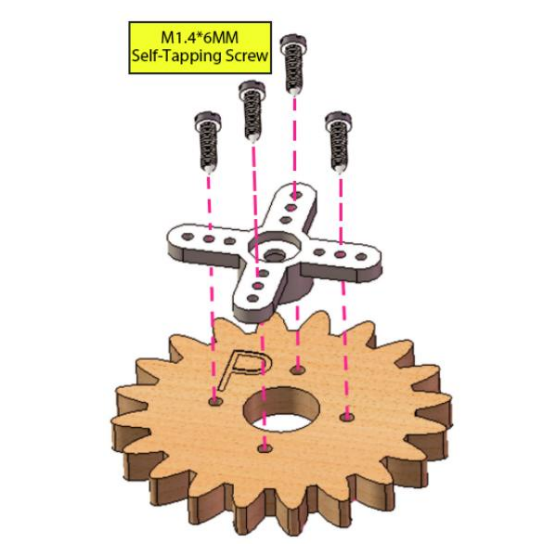

Installare le viti autofilettanti M1.4*6MM come mostrato di seguito

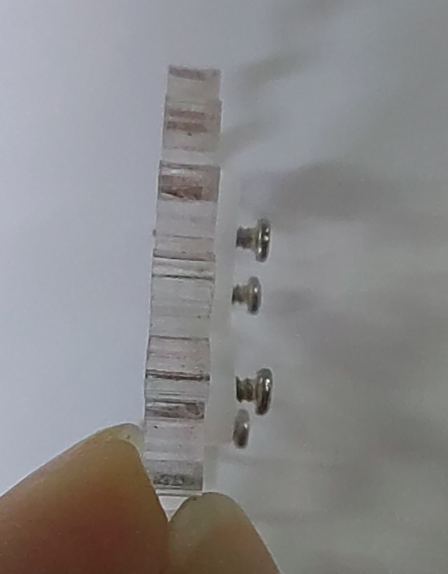

#### 4.6

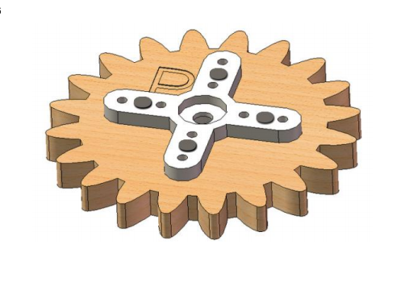

#### 4.7

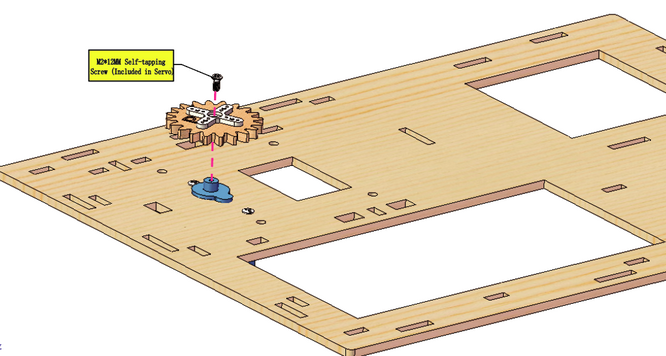

#### 4.8

Non girare l'ingranaggio dopo che è stato installato sul servo. Se hai
già girato l'ingranaggio, dovrai riaggiustare l'angolo del servo a
180°.

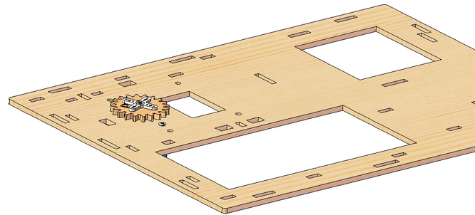

#### 4.9

**NOTA: Quando si installa il coperchio della scatola di alimentazione, la sua apertura deve
essere completamente chiusa.**

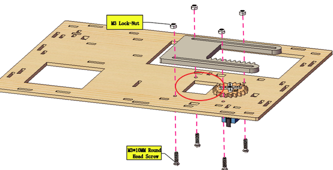

#### 4.10

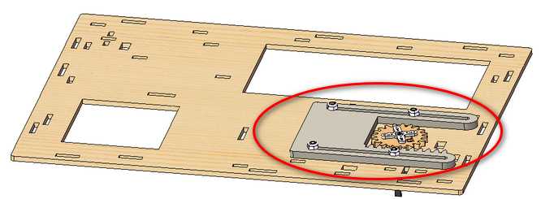

#### 4.11

#### 4.12

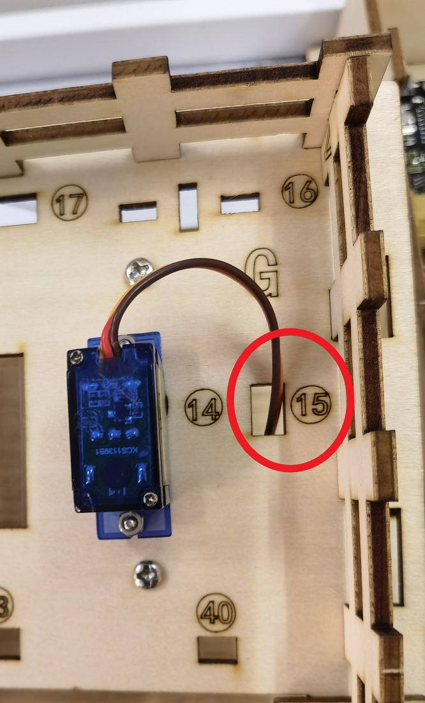

#### 4.13 Testare la porta

1. Collegare il Servo al pin IO26 della scheda ESP32. Collegare il giallo a S,
   il rosso a V, il nero a G.

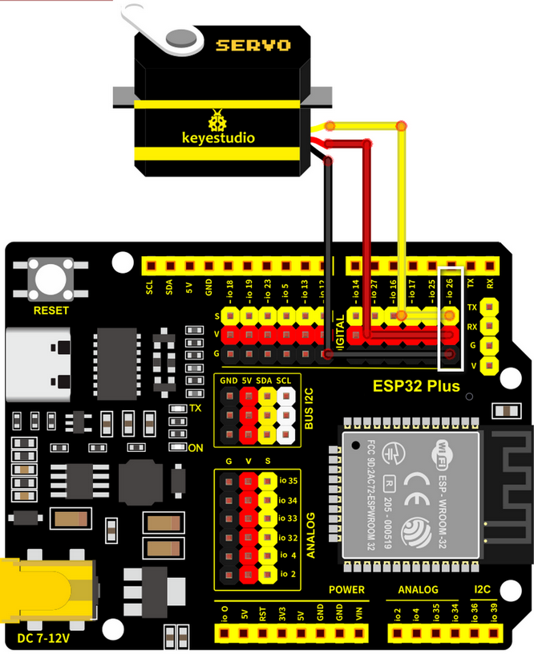

2. Collegare 6 batterie AA alla porta DC 7-12V della scheda ESP32.
   (Batterie non incluse nel kit)

3. Caricare il codice di test

A. Collegare la scheda ESP32 al computer con il cavo USB. Aprire il
file INO all'interno della cartella **6.1Servo** con Arduino IDE.

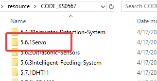

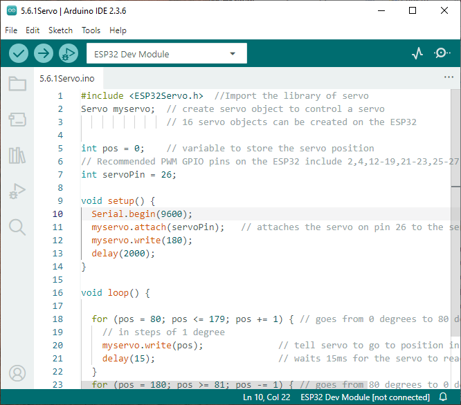

B. Cliccare su Strumenti, selezionare "ESP32 Dev Module" per il tipo di scheda nella
barra del menu a discesa, e selezionare COM-XX per la Porta (Secondo la porta
assegnata dal computer in gestione dispositivi)

C. Assicurarsi di aver caricato la libreria **ESP32Servo** e quindi caricare il codice. La porta della cabina di alimentazione si aprirà e si chiuderà
lentamente.

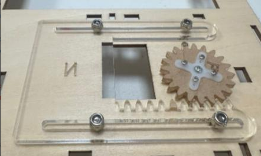

NOTA: Dopo aver caricato il codice, se la porta non si apre e si chiude e il servo è caldo, spegnere immediatamente l'alimentazione.

**Verificare:**

1. Se la porta di plastica ha un buon contatto e punti di forza con la
   struttura dell'ingranaggio del servo.
1. Se la punta della vite di fissaggio sulla struttura dell'ingranaggio del
   servo è bloccata con il guscio di plastica del servo. In tal caso,
   allentare leggermente la vite di fissaggio per evitare che la sua punta entri in contatto
   con il servo.

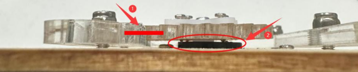

### Passaggio 5 Installare il display LCD e il sensore DHT11

#### 5.1 Componenti richiesti

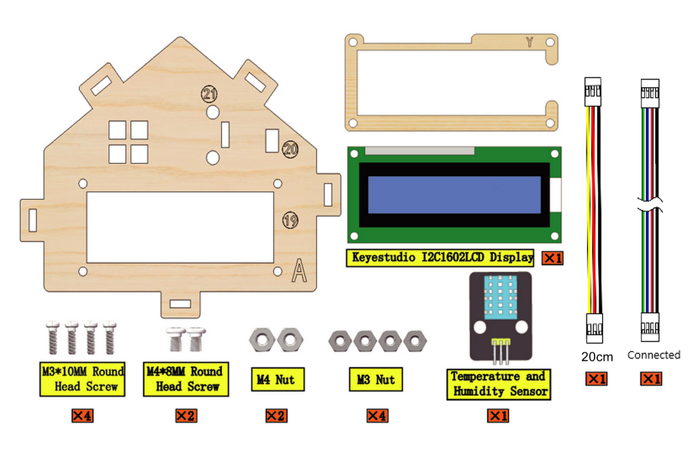

#### 5.2

#### 5.3

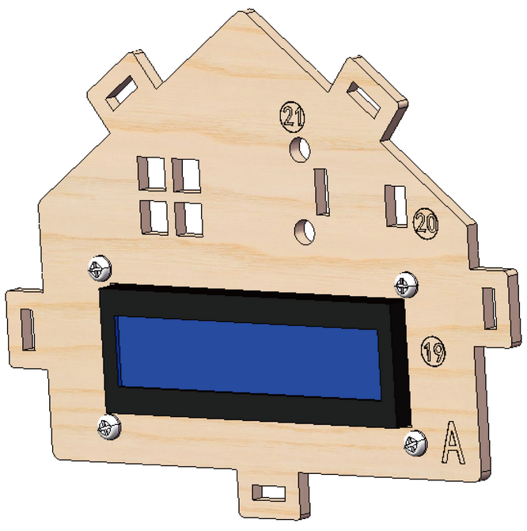

#### 5.4

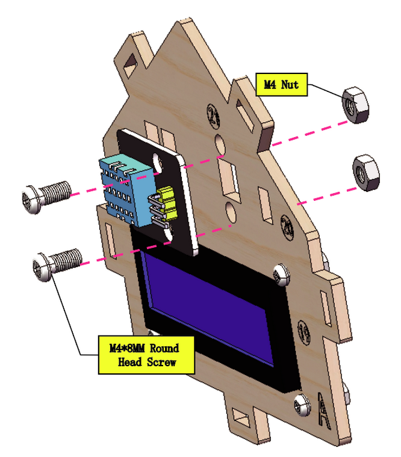

#### 5.5 Prototipo

#### 5.6 Cablaggio

**Collegare i moduli tramite cavi Dupont.**

| Modulo | Cavo |
| --- | --- |
| Sensore di temperatura e umidità | 3PIN 20cm |

**Prestare attenzione al colore del cavo Dupont:**

**Per il sensore di temperatura e umidità, collegare il giallo a S, il rosso a V, il nero a G.**

#### 5.7

| Modulo | Cavo |
| --- | --- |
| LCD 1602 | 4PIN **(Nero-Rosso-Blu-Verde)** |

**Per il display LCD, collegare il verde a SCL, il blu a SDA, il rosso a VCC, il nero a GND.**

### Passo 6 Installare il Modulo Ultrasonico

#### 6.1 Componenti richiesti

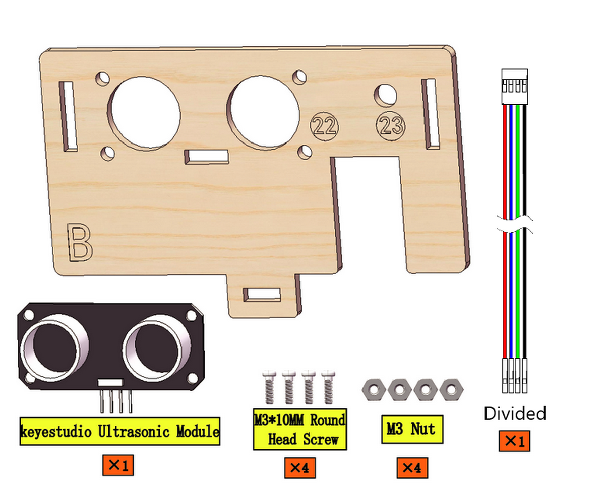

#### 6.2

#### 6.3

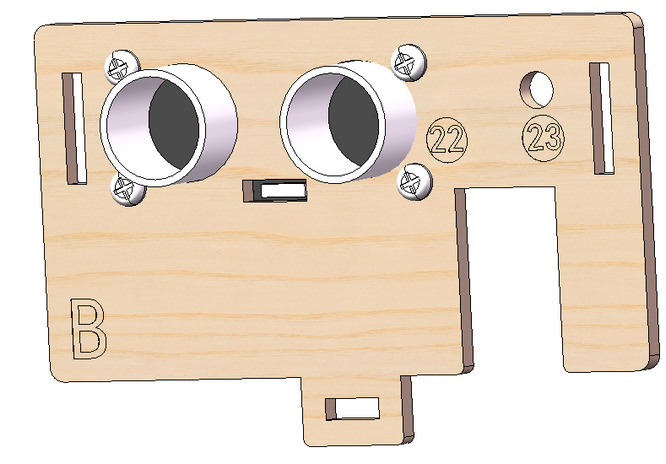

#### 6.4 Cablaggio

| Modulo | Cavo |
| --- | --- |
| Modulo ultrasonico | 4PIN **(Nero-Verde-Blu-Rosso)** |

**Prestare attenzione al colore del cavo Dupont: Per il modulo ultrasonico, collegare il blu a TRIG, il verde a ECHO, il rosso a VCC, il nero a GND.**

### Passo 7 Installare il Sensore di Movimento PIR e il Modulo Pulsante

#### 7.1 Componenti richiesti

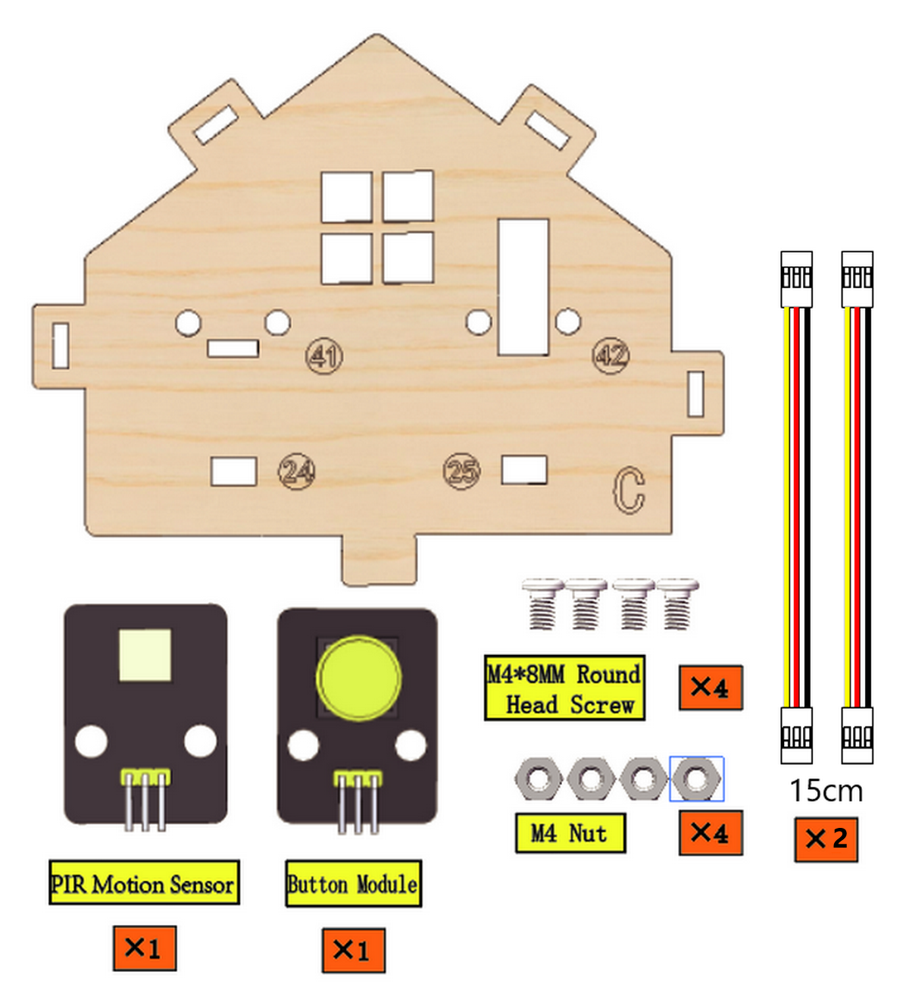

#### 7.2

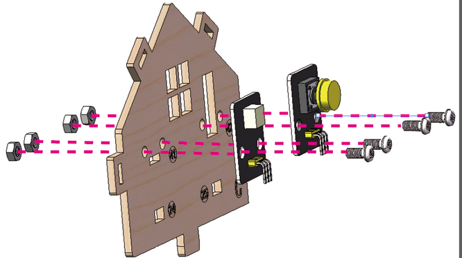

#### 7.3

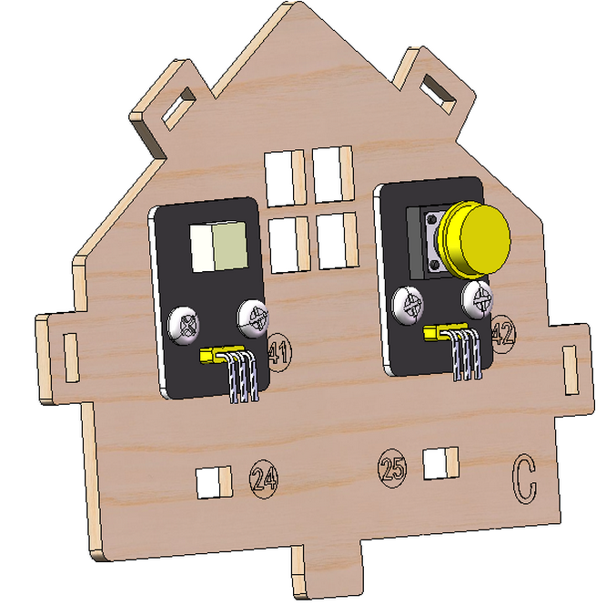

#### 7.4 Cablaggio

**Collegare i moduli tramite cavi Dupont.**

| Modulo | Cavo |
| --- | --- |
| Sensore di Movimento PIR | 3PIN 15cm |
| Modulo Pulsante | 3PIN 15cm |

**Prestare attenzione al colore del cavo Dupont: Collegare il giallo a S, il rosso a V, il nero a G.**

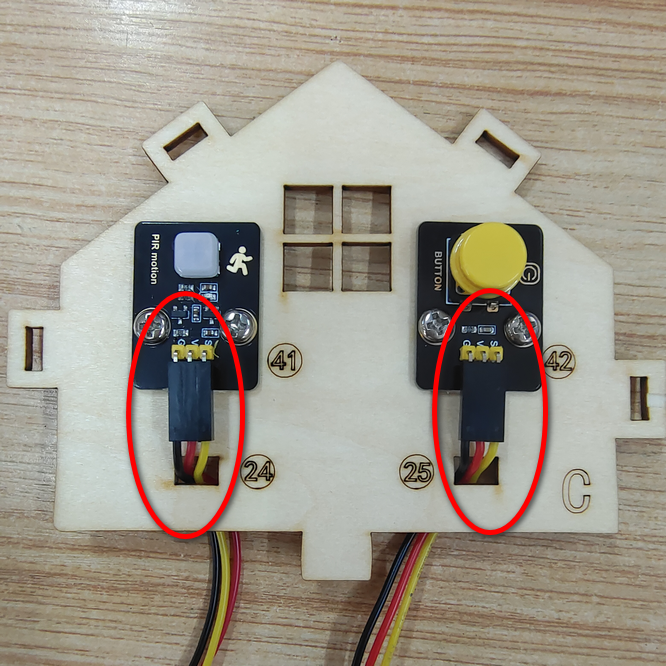

### Passo 8 Installare le Pareti della Casa

#### 8.1 Componenti richiesti

#### 8.2

#### 8.3

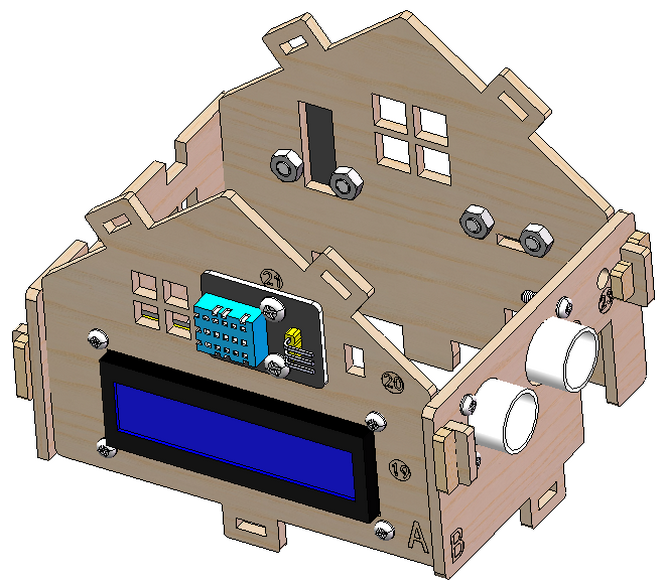

#### 8.4

#### 8.5

#### 8.6

#### 8.7

#### 8.8 Prototipo

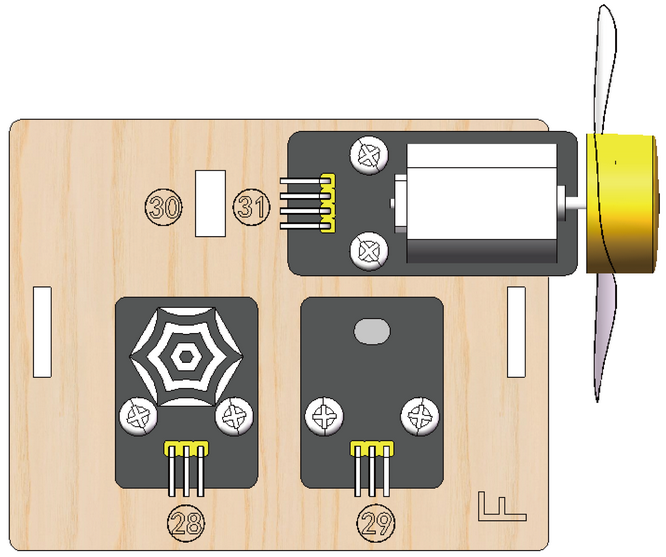

#### 8.9 Cablaggio

| Modulo | Cavo |
| --- | --- |
| Ventola | 4PIN **Diviso (Nero-Rosso-Blu-Verde)** |
| Sensore di Vapore | 3PIN 15cm |
| Fotoresistore | 3PIN 15cm |

**Prestare attenzione al colore del cavo Dupont per la Ventola:**

| Pin Modulo | Colore Cavo | Pin Scheda ESP32 |
| :--- | :--- | :--- |
| IN- | VERDE | io18 |
| IN+ | BLU | io19 |
| V | ROSSO | V |
| G | NERO | G |

**Per il Sensore di Vapore e il Fotoresistore: Collegare il giallo a S, il rosso a V, il nero a G.**

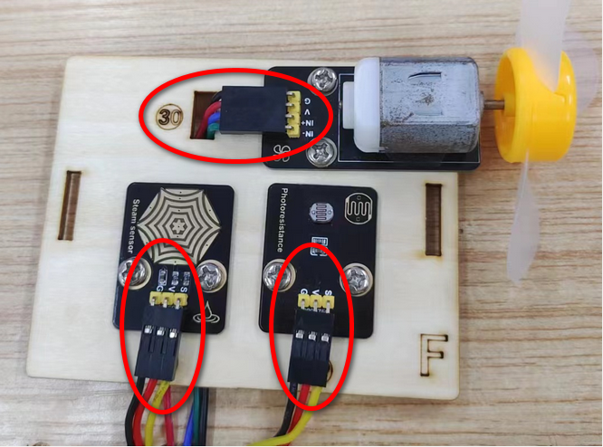

### Passo 9 Installare il Tetto della casa

#### 9.1 Componenti richiesti

#### 9.2

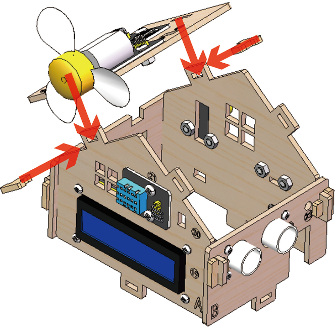

#### 9.3

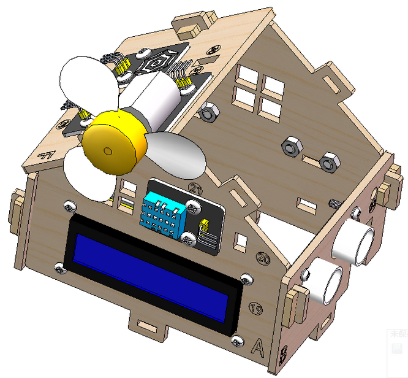

#### 9.4 Mantieni i cavi organizzati

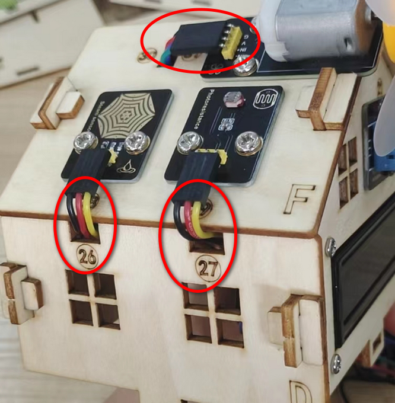

### Passo 10 Installa la Casa e la Base

#### 10.1 Componenti richiesti

#### 10.2

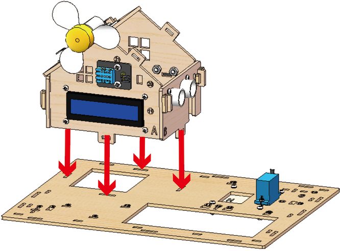

#### 10.3

#### 10.4 Vista dal basso

#### 10.5

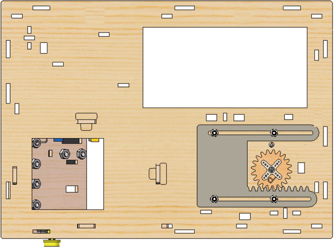

#### 10.6 Organizza i cavi

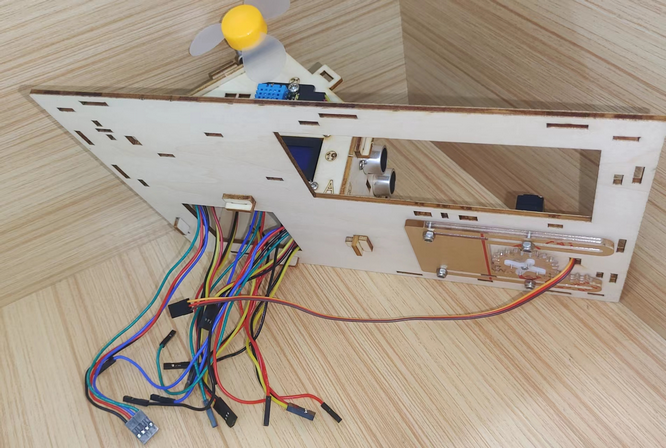

#### 10.7

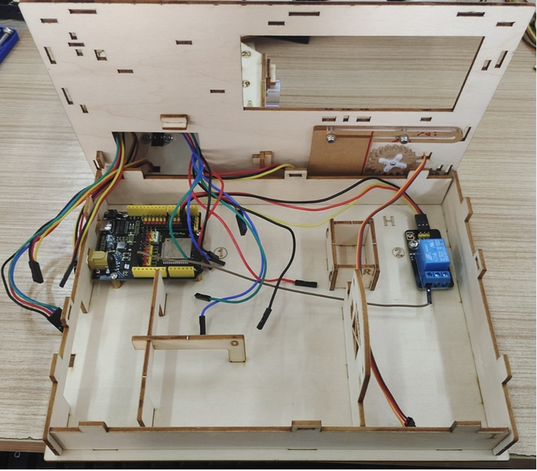

### Passo 11 Cablaggio della Casa

#### 11.1

**Presta attenzione al colore del cavo Dupont: collega il giallo a S,
il rosso a V, il nero a G.**

| NO. | Componenti | Cavi | Pin della scheda ESP32 |
| --- | --- | --- | --- |
| 1 | Ventola | 4pin, Diviso Nero-Rosso-Blu-Verde | io18(IN-) \ io19(IN+) | |
| 2 | Sensore di movimento PIR | 3pin 15cm | io23 |
| 3 | Pulsante | 3pin 15cm | io5 |
| 4 | Modulo Ultrasuoni | 4pin, Diviso Nero-Verde-Blu-Rosso | D12(TRIG) D13(ECHO) |
| 5 | LCD 1602 | 4pin, Connesso | I2C |
| 6 | Sensore di Temperatura e Umidità | 3pin 20cm | io17 |
| 7 | Sensore di Vapore | 3pin 15cm | io35 |
| 8 | Fotoresistore | 3pin 15cm | io34 |
| 9 | Servo | -- | io26 |
| 10 | Buzzer | 3pin 20cm | io16 |
| 11 | LED | 3pin 20cm | io27 |
| 12 | Sensore di Livello dell'Acqua | 3pin 25cm | io33 |
| 13 | Sensore di Umidità del Suolo | 3pin 20cm | io32 |
| 14 | Pompa dell'Acqua | 3pin 20cm | io25 |

#### 11.2 Ventola

Fai passare il cavo Dupont collegato alla ventola attraverso il foro **contrassegnato 30**
sulla tavola di legno.

| Componenti | Cavo | Pin della scheda ESP32 |
| --- | --- | --- |
| Ventola | 4PIN Diviso (Nero-Rosso-Blu-Verde) | io18(IN-), io19(IN+) |

| Pin del modulo | Colore del cavo | Pin della scheda ESP32 |
| :--- | :--- | :--- |
| IN- | VERDE | io18 |
| IN+ | BLU | io19 |
| V | ROSSO | V |
| G | NERO | G |

#### 11.3 Sensore di movimento PIR

Fai passare il cavo Dupont collegato al sensore di movimento PIR attraverso il foro
contrassegnato 24 sulla tavola di legno.

| Componente | Cavo | Pin della scheda ESP32 |
| --- | --- | --- |
| Sensore di movimento PIR | 3PIN 15cm | io23 |

**Collega il rosso a V, il nero a G, il giallo a S.**

| Pin del modulo | Colore del cavo | Pin della scheda ESP32 |
| --- | --- | --- |
| V | ROSSO | V |
| G | NERO | G |
| S | GIALLO | io23 |

#### 11.4 Modulo Pulsante

Fai passare il cavo Dupont collegato al modulo pulsante attraverso il foro
contrassegnato 25 sulla tavola di legno.

| Componente | Cavo | Pin della scheda ESP32 |
| --- | --- | --- |
| Pulsante | 3PIN 15cm | io5 |

**Collega il rosso a V, il nero a G, il giallo a S.**

| Pin del modulo | Colore del cavo | Pin della scheda ESP32 |
| --- | --- | --- |
| V | ROSSO | V |
| G | NERO | G |
| S | GIALLO | io5 |

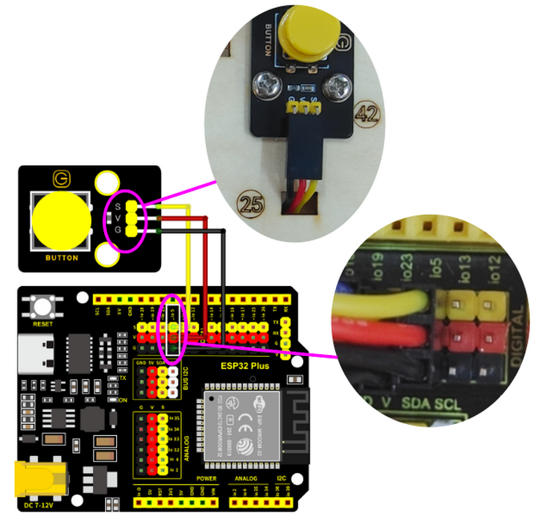

#### 11.5 Modulo Ultrasuoni

| Componente | Cavo | Pin della scheda ESP32 |
| --- | --- | --- |
| Modulo Ultrasuoni | 4PIN **Diviso** (Nero-Verde-Blu-Rosso) | io13(ECHO), io12(TRIG) |

**Collega il rosso a V, il nero a G, il blu a io12, il verde a io13.**

| Pin del modulo | Colore del cavo | Pin della scheda ESP32 |
| --- | --- | --- |
| V | ROSSO | V (io12) |
| G | NERO | G (io12) |
| ECHO | VERDE | io13 |
| TRIG | BLU | io12 |

#### 11.6 LCD 1602

| Componente | Cavo | Pin della scheda ESP32 |
| --- | --- | --- |
| LCD1602 | 4PIN Collegato (Nero-Rosso-Blu-Verde) | I2C |

**Collegare il rosso a V, il nero a G, il blu a SDA, il verde a SCL.**

| Pin del modulo | Colore del cavo | Pin della scheda ESP32 |
| --- | --- | --- |
| V | ROSSO | V |
| G | NERO | G |
| SCL | VERDE | SCL |
| SDA | BLU | SDA |

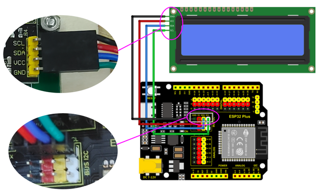

#### 11.7 Sensore di Temperatura e Umidità

Far passare il cavo Dupont collegato al modulo pulsante attraverso il foro contrassegnato con 20 sulla tavola di legno.

| Componente | Cavo | Pin della scheda ESP32 |
| --- | --- | --- |
| Sensore di Temperatura e Umidità | 3PIN 20cm | io17 |

**Collegare il rosso a V, il nero a G, il giallo a io17.**

| Pin del modulo | Colore del cavo | Pin della scheda ESP32 |
| --- | --- | --- |
| V | ROSSO | V |
| G | NERO | G |
| S | GIALLO | io17 |

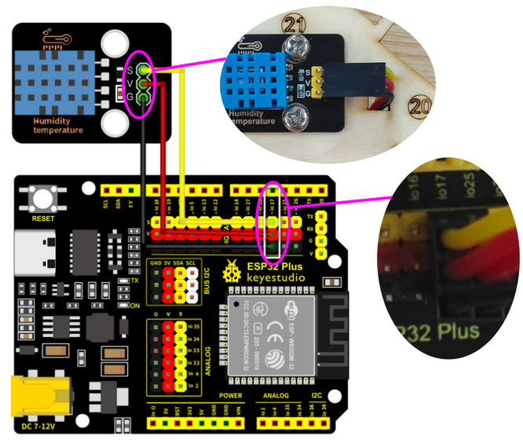

#### 11.8 Sensore di Vapore

| Componente | Cavo | Pin della scheda ESP32 |
| --- | --- | --- |
| Sensore di Vapore | 3PIN 15cm | io35 |

**Collegare il rosso a V, il nero a G, il giallo a io35.**

| Pin del modulo | Colore del cavo | Pin della scheda ESP32 |
| --- | --- | --- |
| V | ROSSO | V |
| G | NERO | G |
| S | GIALLO | io35 |

#### 11.9 Fotoresistore

| Componente | Cavo | Pin della scheda ESP32 |
| --- | --- | --- |
| Fotoresistore | 3PIN 15cm | io34 |

**Collegare il rosso a V, il nero a G, il giallo a io34.**

| Pin del modulo | Colore del cavo | Pin della scheda ESP32 |
| --- | --- | --- |
| V | ROSSO | V |
| G | NERO | G |
| S | GIALLO | io34 |

#### 11.10 Servo

Far passare il cavo del Servo attraverso il Foro 15, quindi collegarlo alla scheda ESP32.

| Componente | Cavo | Pin della scheda ESP32 |
| --- | --- | --- |
| Servo | 3PIN | io26 |

**Collegare il rosso a V, il nero a G, il giallo a io26.**

| Pin della scheda ESP32 | Colore del cavo |
| --- | --- |
| V | ROSSO |
| G | NERO |
| IO26 | GIALLO |

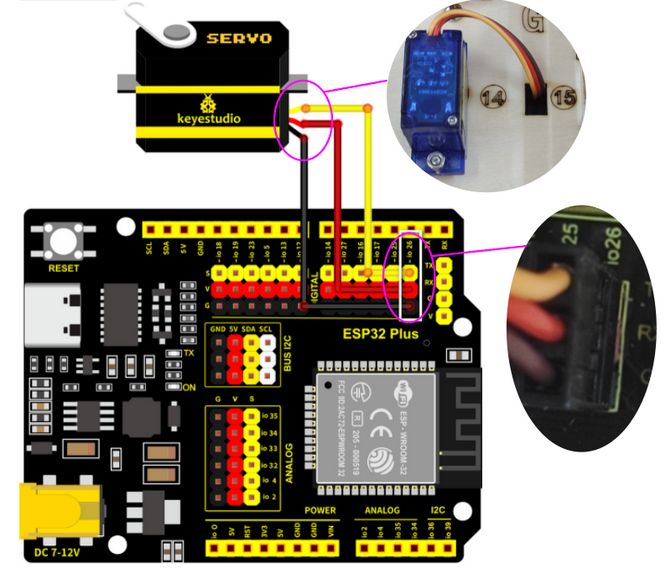

#### 11.11 Buzzer

Far passare il cavo del Buzzer attraverso il Foro 17, quindi collegarlo alla scheda ESP32.

| Componente | Cavo | Pin della scheda ESP32 |
| --- | --- | --- |
| Buzzer | 3PIN 20cm | io16 |

**Collegare il rosso a V, il nero a G, il giallo a io16.**

| Pin del modulo | Colore del cavo | Pin della scheda ESP32 |
| --- | --- | --- |
| V | ROSSO | V |
| G | NERO | G |
| S | GIALLO | io16 |

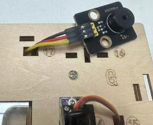

#### 11.12 LED

Far passare il cavo del LED attraverso il Foro 7, quindi collegarlo alla scheda ESP32.

| Componente | Cavo | Pin della scheda ESP32 |
| --- | --- | --- |
| LED | 3PIN 20cm | io27 |

**Collegare il rosso a V, il nero a G, il giallo a io27.**

| Pin del modulo | Colore del cavo | Pin della scheda ESP32 |
| --- | --- | --- |
| V | ROSSO | V |
| G | NERO | G |
| S | GIALLO | io27 |

#### 11.13 Sensore di Livello dell'Acqua

Far passare il cavo del sensore di livello dell'acqua attraverso il Foro 13, quindi collegarlo alla scheda ESP32.

| Componente | Cavo | Pin della scheda ESP32 |
| --- | --- | --- |
| Sensore di Livello dell'Acqua | 3PIN 25cm | io33 |

**Collegare il rosso a V, il nero a G, il giallo a io33.**

| Pin del modulo | Colore del cavo | Pin della scheda ESP32 |
| --- | --- | --- |
| V | ROSSO | V |
| G | NERO | G |
| S | GIALLO | io33 |

#### 11.14 Sensore di Umidità del Suolo

Far passare il cavo del sensore di umidità del suolo attraverso il Foro 11, quindi collegarlo alla scheda ESP32.

| Componente | Cavo | Pin della scheda ESP32 |
| --- | --- | --- |
| Sensore di Umidità del Suolo | 3PIN 20cm | io32 |

**Collegare il rosso a V, il nero a G, il giallo a io32.**

| Pin del modulo | Colore del cavo | Pin della scheda ESP32 |
| --- | --- | --- |
| V | ROSSO | V |
| G | NERO | G |
| S | GIALLO | io32 |

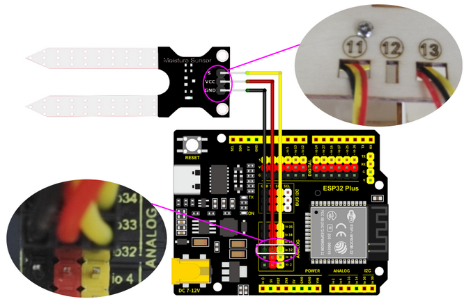

#### 11.15 Modulo Relè

| Componente | Filo | Pin della scheda ESP32 |
| --- | --- | --- |
| Modulo relè | 3PIN | io25 |

| Pin del modulo | Colore del filo | Pin della scheda ESP32 |
| --- | --- | --- |
| V | ROSSO | V |
| G | NERO | G |
| S | GIALLO | io25 |

Far passare il filo della pompa dell'acqua attraverso il Foro 11 nel modo mostrato di seguito:

Il filo rosso della pompa dell'acqua è collegato al terminale centrale del modulo relè, e il filo nero è collegato al GND della scheda ESP32.

Inoltre, è necessario utilizzare un cavo Dupont per collegare il terminale sinistro del modulo relè al 3.3V dell'ESP32.

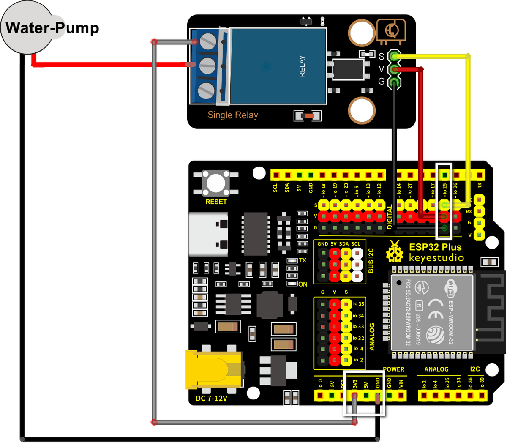

Inserire il terminale maschio del cavo Dupont nel terminale femmina del modulo relè e serrarlo con un cacciavite.

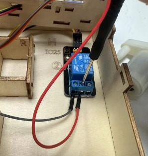

Dopo i passaggi precedenti, si noti che tutti i cablaggi sono stati completati. E i fili del LED, del sensore di livello dell'acqua, del sensore di umidità del suolo, del buzzer e della pompa dell'acqua del relè sono passati rispettivamente attraverso i fori 7, 11, 13, 17 e 40 intagliati sulla tavola di tiglio, preparandosi per la successiva installazione.

### Passaggio 12 Installare la casa e le fondamenta

#### 12.1 Componenti richiesti

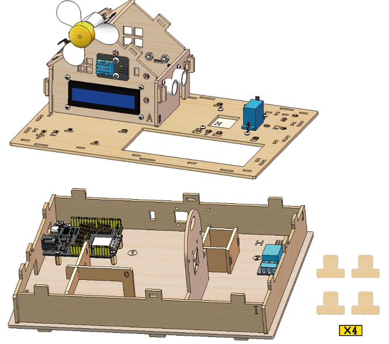

#### 12.2

#### 12.3

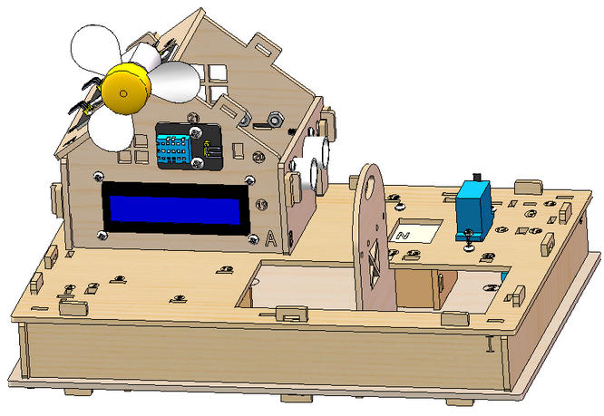

#### 12.4

#### 12.5

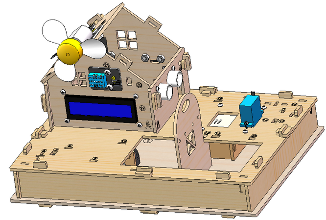

### Passaggio 13 Installare i lavelli in plastica

#### 13.1 Componenti richiesti

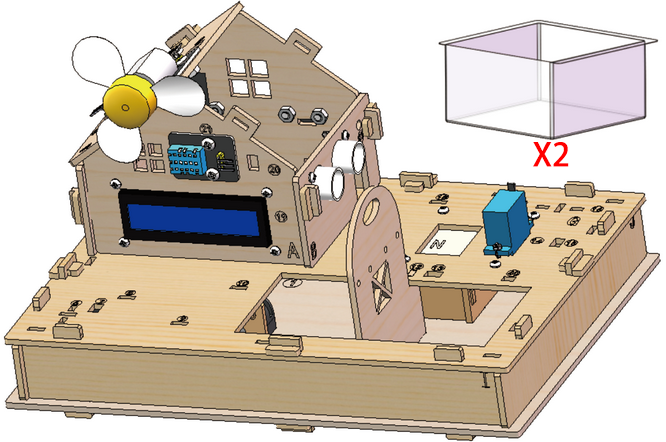

#### 13.2

#### 13.3

### Passaggio 14 Installare il modulo del suolo e il modulo del livello dell'acqua

#### 14.1 Componenti richiesti

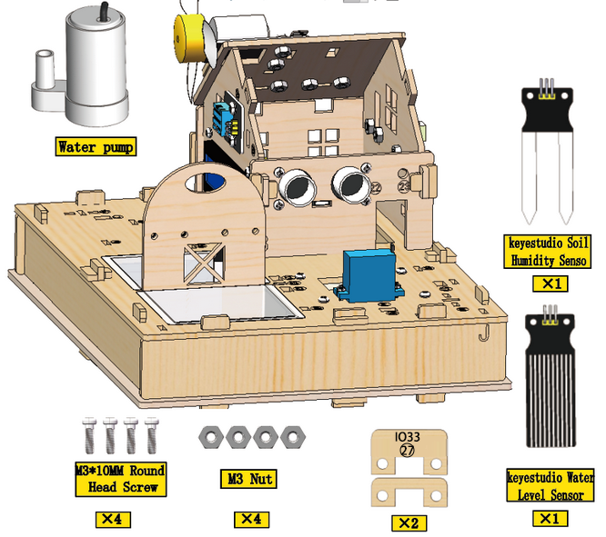

#### 14.2

#### 14.3

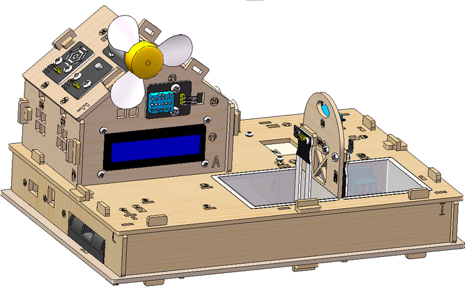

#### 14.4

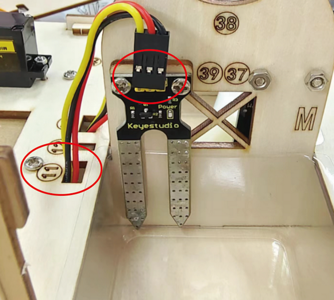

#### 14.5

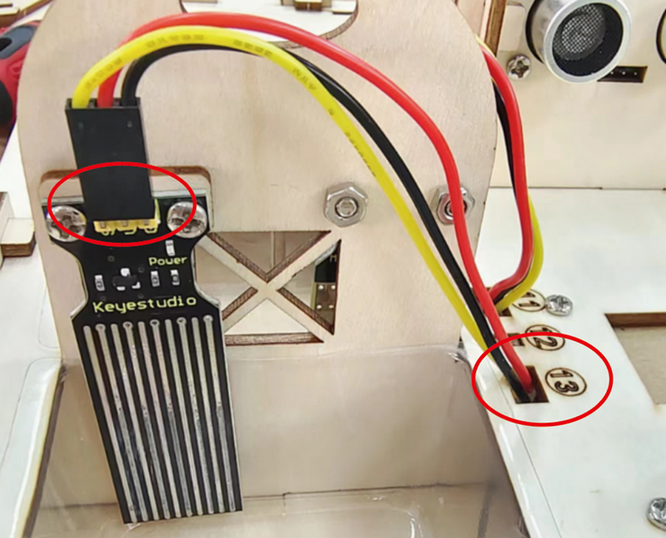

#### 14.6

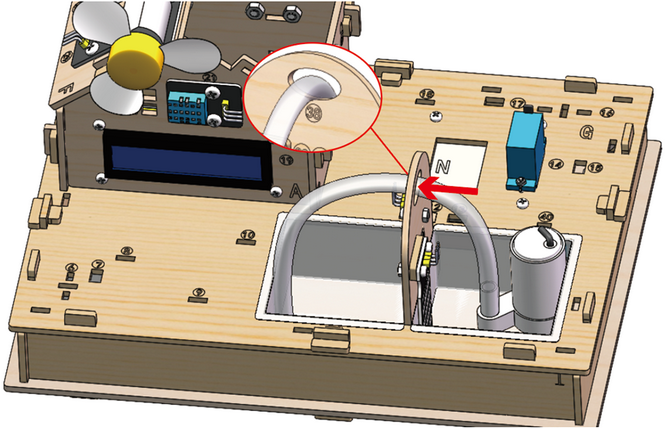

#### 14.7

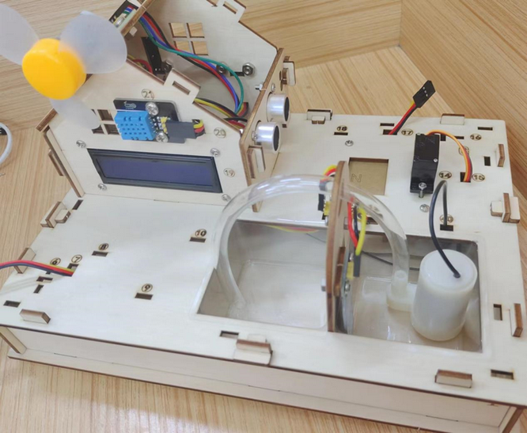

### Passaggio 15 Installare la recinzione

#### 15.1 Componenti richiesti

#### 15.2

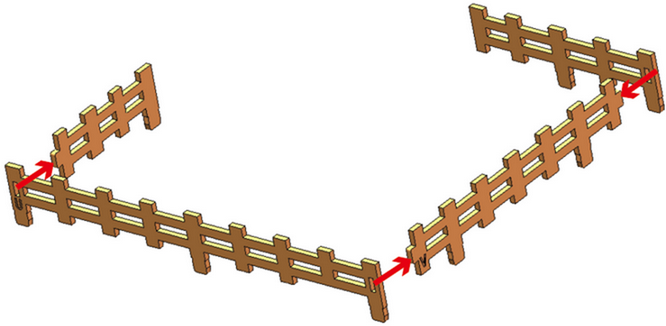

#### 15.3

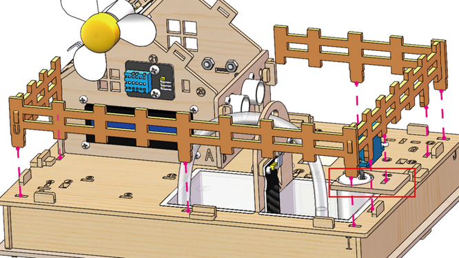

#### 15.4

### Passaggio 16 Installare il Buzzer e il modulo Led

#### 16.1 Componenti richiesti

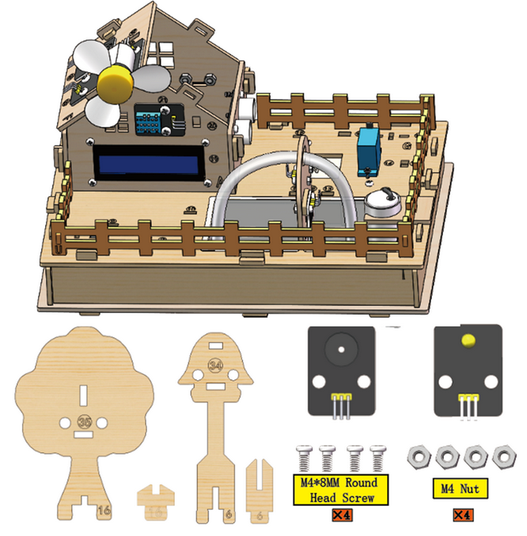

#### 16.2

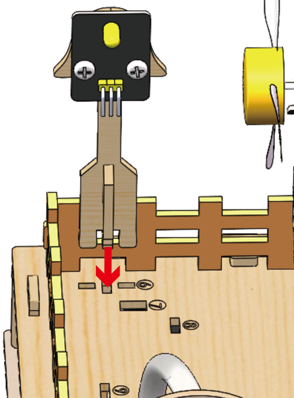

#### 16.3

#### 16.4

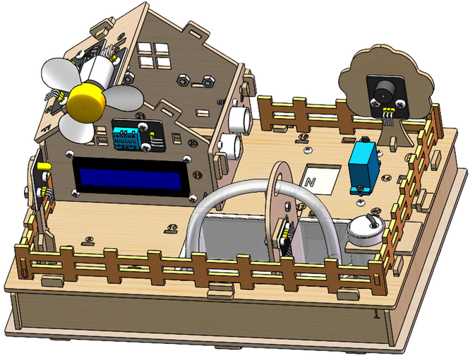

### Passo 17 Decora la Casa

#### 17.1 Componenti richiesti

#### 17.2

#### 17.3

### Passo 18 Installa il Pannello Solare

#### 18.1 Componenti richiesti

#### 18.2

#### 18.3

#### 18.4

#### 18.5

Installa la luce LED del pannello solare in questo foro.

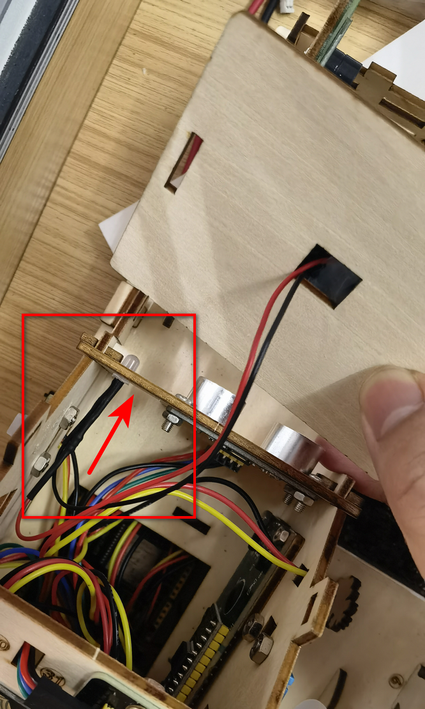

#### 18.6

Usa un adesivo per fissare i suoi fili al muro

#### 18.7

#### 18.8

#### 18.9

#### 18.10

### Passo 19 Installa il Portabatterie

#### 19.1 Componenti richiesti

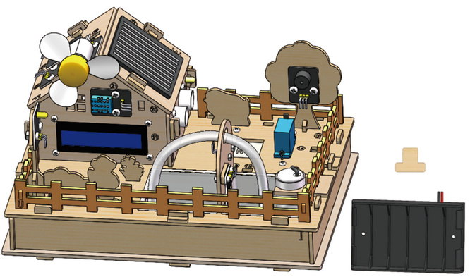

#### 19.2

Installa 6 batterie AA (non incluse nel kit)

#### 19.3

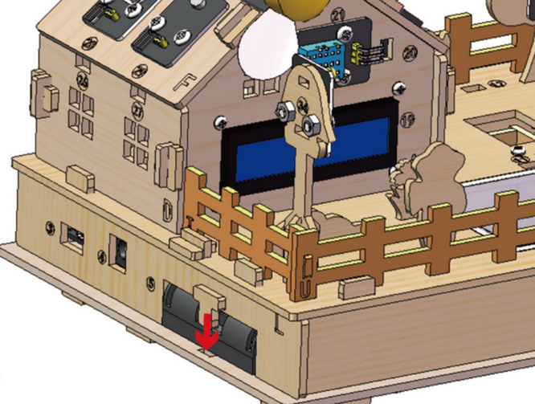

#### 19.4

