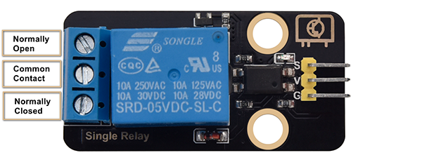
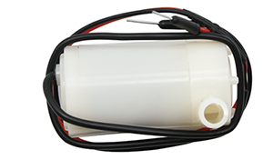

### 5.10 Sistema de Riego Automático


#### 5.10.1 Sistema de Bombeo de Agua


En este experimento, usamos la placa de desarrollo ESP32 para encender/apagar la bomba de agua mediante un módulo de relé. Una bomba eleva agua y transporta líquidos, y generalmente se combina con un módulo de relé en su uso.

**Módulo de Relé:**

En su uso, a menudo se utiliza en la gestión de alto voltaje y corriente de carga, por ejemplo, motores, sensores de alta corriente y luces de alta potencia.



**Normalmente Abierto (NO):** Este pin está normalmente abierto, a menos que se reciba una señal por el pin de señal del relé. Por lo tanto, los pines comunes se desconectan a través del pin NC y se conectan a través del pin NO.

**Contacto Común (COM):** Este pin se conecta a otros módulos, por ejemplo, la bomba de agua.

**Normalmente Cerrado (NC):** El pin NC está conectado con el pin COM para formar un circuito cerrado. Utiliza la placa ESP32 para controlar el cierre y la desconexión del módulo de relé.


**Bomba de Agua:**



**Parámetros:**

Voltaje de alimentación: 5V

Corriente estática: 2mA

Voltaje máximo de contacto: 250VAC/30VDC

Corriente máxima: 10A

Abre el código **5.10.1Water-Pump** con Arduino IDE.

```c
#define RelayPin 25
char content;  //Define a character string as the received value from serial port

void setup() {
  Serial.begin(9600);
  pinMode(RelayPin,OUTPUT);
}

void loop() {
  //Serial.read() receives one byte once. For example, when input "aaa", it receives one "a" at a time for three times in total.
  if(Serial.available() > 0) {
    if (Serial.read() == 'a') //When the input value equals to "a", irrigation begins.
    {
      digitalWrite(RelayPin,HIGH);
      delay(400);//irrigation delay
      digitalWrite(RelayPin,LOW);
      delay(700);
    }
  }
}
```

Elige la placa **ESP32 Dev Module** y el puerto **COM**, y sube el código.


**Resultado de la prueba:**

Abre el monitor serie e **introduce "a", bombea agua una vez**.

Atención: No desbordes agua de las piscinas de plástico en los experimentos. Derramar agua sobre otros sensores puede causar no solo un cortocircuito o que los módulos dejen de funcionar, sino también la generación de calor e incluso una explosión. ¡Ten mucho cuidado! Especialmente para los usuarios más jóvenes, por favor, operen con sus padres.


#### 5.10.2 Sistema de Riego Automático


En este experimento, conectamos los dos sensores a la placa de desarrollo ESP32 y programamos para leer sus valores de salida para controlar el relé y la bomba de agua.

Si el suelo está muy seco, el relé se activará para controlar la bomba de agua para regar las plantas; y si el nivel del agua es demasiado bajo, la bomba de agua no podrá funcionar y el zumbador emitirá una alarma.

Abre el código **5.10.2Auto-irrigation** con Arduino IDE.

```c
#include <LiquidCrystal_I2C.h>

#define BuzzerPin 16
#define SoilHumidityPin 32
#define WaterLevelPin 33
#define RelayPin 25
#define ButtonPin 5  //Define a button pin
int value = 0;       //Set an initial button value

LiquidCrystal_I2C lcd(0x27, 16, 2);

void setup() {
  //Set the pins mode
  pinMode(SoilHumidityPin, INPUT);
  pinMode(WaterLevelPin, INPUT);
  pinMode(RelayPin, OUTPUT);
  pinMode(ButtonPin, INPUT);

  //Initialize LCD
  lcd.init();
  //Turn on LCD backlight
  lcd.backlight();
  //Clear LCD displays
  lcd.clear();

  ledcAttachChannel(BuzzerPin, 1000, 8, 4);
}

void loop() {
  //define variables as the read values of water level, humidity and button state
  int shvalue = analogRead(SoilHumidityPin);
  int wlvalue = analogRead(WaterLevelPin);
  int ReadValue = digitalRead(ButtonPin);

  //Set the display position of cursor
  lcd.setCursor(0, 0);
  //Set the display position of character strings
  lcd.print("SoilHum:");
  lcd.setCursor(9, 0);
  lcd.print(shvalue);
  lcd.setCursor(0, 1);
  lcd.print("WaterLevel:");
  lcd.setCursor(11, 1);
  lcd.print(wlvalue);

  //Determine whether the button is pressed
  if (ReadValue == 0) {
    //Eliminate the button shake
    delay(10);
    if (ReadValue == 0) {
      value = !value;
      Serial.print("The current status of the button is : ");
      Serial.println(value);
    }
    //Again, determine whether the button is still pressed
    //Pressed: execute the loop; Released: exit the loop to next execution
    while (digitalRead(ButtonPin) == 0)
      ;
  }
  //When the detected humidity is lower than the set threshold, the buzzer starts to alarm. Press button to stop alarming.
  if (500 >= shvalue && value == 0) {
    ledcWriteTone(BuzzerPin, 532);
    delay(100);
    ledcWriteTone(BuzzerPin, 532);
    delay(100);
    ledcWriteTone(BuzzerPin, 659);
    delay(100);
    ledcWriteTone(BuzzerPin, 0);  //Stop alarming
  }
  //When the detected water level is lower than the set threshold, the buzzer starts to alarm. Press button to stop alarming.
  if (500 >= wlvalue && value == 0) {
    ledcWriteTone(BuzzerPin, 411);
    delay(100);
    ledcWriteTone(BuzzerPin, 639);
    delay(100);
    ledcWriteTone(BuzzerPin, 411);
    delay(100);
    ledcWriteTone(BuzzerPin, 0);  //Stop alarming
  }
  //When the detected humidity is lower than the set threshold, and the water is sufficient in the pool, irrigation starts automatically.
  if (500 >= shvalue && wlvalue >= 1000) {
    digitalWrite(RelayPin, HIGH);
    delay(400);  //Irrigation delay.
    digitalWrite(RelayPin, LOW);
    delay(700);
  }
  delay(500);
  //Clear displays
  lcd.clear();
}
```

Elige la placa **ESP32 Dev Module** y el puerto **COM**, y sube el código.


**Resultado de la prueba:**

La pantalla LCD 1602 mostrará el valor actual de humedad del suelo y nivel de agua.


Cuando el valor de humedad del suelo detectado es inferior a 500, el zumbador emite una alarma para notificar que el suelo está árido. Si el valor del nivel del agua es superior a 1000, el riego comienza automáticamente.

Cuando el nivel de agua detectado es inferior a 500, el sistema de bombeo de agua no funciona y el zumbador emite una alarma para notificar que el agua es insuficiente. Pulsa el botón para detener la alarma.


