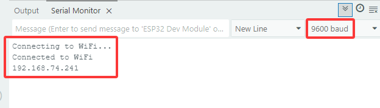
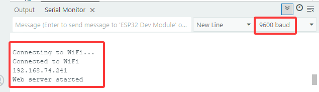
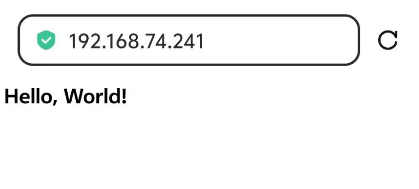
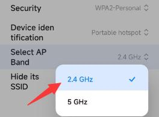
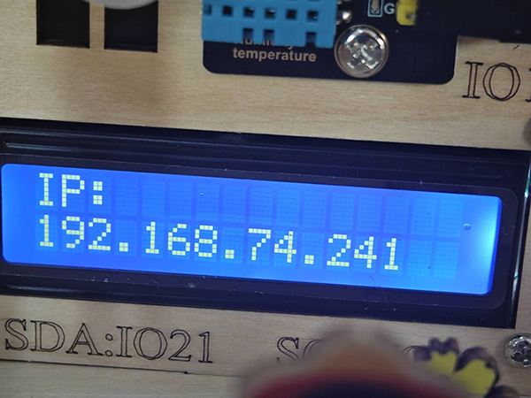
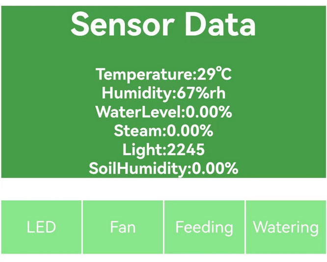

### 5.11 Ferme Intelligente Contrôlée par le Web

#### 5.11.1 Connecter la Carte ESP32 au Réseau

La carte ESP32 est équipée du Wi-Fi (**2.4G**) et du Bluetooth (4.2), ce qui lui permet de se connecter facilement au Wi-Fi et de communiquer avec d'autres appareils sur le réseau.

Ce dont vous avez besoin de préparer :

- Un Wi-Fi **2.4 GHz** (Il peut s'agir d'un point d'accès mobile ou d'un routeur)
- Le nom et le mot de passe du Wi-Fi
- Un téléphone/IPAD/ordinateur pouvant se connecter au même Wi-Fi.

**L'IDE Arduino vous fournit le fichier de bibliothèque <WiFi.h>, qui prend en charge les configurations Wi-Fi et la surveillance du réseau Wi-Fi de l'ESP32.**

A. **Mode station de base** (STA ou mode client Wi-Fi) : Dans ce mode, l'ESP32 se connecte au point d'accès Wi-Fi (AP).

B. **Mode AP** (Soft-AP ou mode point d'accès Wi-Fi) : Dans ce mode, d'autres appareils Wi-Fi se connectent à l'ESP32.

C. **Mode AP-STA** : Dans ce mode, l'ESP32 est à la fois un point d'accès Wi-Fi et un appareil Wi-Fi se connectant à un autre point d'accès Wi-Fi.

D. Ces modes sont compatibles avec plusieurs modes de sécurité, tels que WPA, WPA2 et WEP.

E. Il est capable de scanner les points d'accès Wi-Fi, y compris le balayage actif et passif.

F. Il prend en charge le mode promiscuité pour surveiller les paquets Wi-Fi IEEE802.11.

**Pour plus de détails sur le Wi-Fi, veuillez vous référer à :**

https://docs.espressif.com/projects/esp-idf/en/latest/esp32/api-reference/network/esp_wifi.html

Site officiel d'ESPRESSIF : https://www.espressif.com.cn/en/home

Ouvrez le code **5.11.0Connect-the-ESP32-to-the-Network** avec l'IDE Arduino.

```c
#include <WiFi.h>

const char* ssid = "your_SSID";
const char* password = "your_PASSWORD";

void setup() {
  Serial.begin(9600);
  //Initialize Wifi
  WiFi.begin(ssid, password);
  //Scan for wifi. If connection fails, stay in connecting, and execute "while" loop
  while (WiFi.status() != WL_CONNECTED) {
    delay(1000);
    Serial.println("Connecting to WiFi...");
  }
  //Connected. Print the IP address
  Serial.println("Connected to WiFi");
  Serial.println(WiFi.localIP());
}

void loop() {
}
```

Changez `your_SSID` dans le code par le nom de votre wifi, et `your_PASSWORD` par le mot de passe du wifi.

```c
const char* ssid = "your_SSID";
const char* password = "your_PASSWORD";
```

Choisissez la carte **ESP32 Dev Module** et le port **COM**, puis téléchargez le code.


**Résultat du test :**

Téléchargez le code, et la carte se connectera au réseau Wi-Fi et affichera l'adresse IP sur le moniteur série.



#### 5.11.2 Configurer un Site Web - HELLOWORLD

Dès qu'il est connecté au Wi-Fi, la bibliothèque de serveur Web de l'ESP32 est capable de fournir des pages Web. Dans l'exemple de code suivant, nous configurons un site Web simple pour afficher "Hello, World!".

Ouvrez le code **5.11.1WiFi-HTML-HELLOWORLD** avec l'IDE Arduino.

```c
#include <WiFi.h>
#include <WebServer.h>

const char* ssid = "your_SSID";
const char* password = "your_PASSWORD";

WebServer server(80); //Set the server port to 80. Enter the website by IP address rather than the port number.

//Initialize the website
void handleRoot() {
  //Used to send HTTP to the client-side for response, sending 200 means success.
  server.send(200, "text/html", "<h1>Hello, World!</h1>");
}

void setup() {
  Serial.begin(9600);
  //Initialize wifi
  WiFi.begin(ssid, password);
  //Scan for wifi. If connection fails, stay in connecting, and execute "while" loop
  while (WiFi.status() != WL_CONNECTED) {
    delay(1000);
    Serial.println("Connecting to WiFi...");
  }

  //Connected. Print the IP address
  Serial.println("Connected to WiFi");
  Serial.println(WiFi.localIP());

  server.on("/", handleRoot);
  //Start server
  server.begin();
  Serial.println("Web server started");
}

void loop() {
  server.handleClient();
}
```

Changez `your_SSID` dans le code par le nom de votre wifi, et `your_PASSWORD` par le mot de passe du wifi. Puis téléchargez le code.

```c
const char* ssid = "your_SSID";
const char* password = "your_PASSWORD";
```

Choisissez la carte **ESP32 Dev Module** et le port **COM**, puis téléchargez le code.


**Résultat du test :**

Dans cet exemple de code, nous établissons un serveur Web à l'aide de la bibliothèque WebServer sur l'ESP32. La fonction handleRoot() demande le traitement du chemin racine et envoie la réponse HTML "Hello, World!" au client. Ensuite, setup() définit la route racine, et server.begin() démarre le serveur Web.

Cliquez sur le moniteur série pour afficher l'adresse IP :



**NOTE : Lorsque le PC, les téléphones mobiles et la carte ESP32 sont connectés à un même réseau, vous pouvez visiter ce site Web sur PC et téléphones en même temps.**

Accédez à l'IP dans le navigateur PC ou le navigateur de téléphone :



Remarque : Nécessite un WIFI 2.4 GHz, pas 5G. Le PC ou le téléphone mobile accédant à l'adresse IP doit être connecté au même WIFI que la carte ESP32.



#### 5.11.3 Ferme intelligente contrôlée par le Web


Ouvrez le code **5.11.2WiFi-HTML-Smart-Farm** avec l'IDE Arduino.

```c
#include <Arduino.h>
#include <WiFi.h>
#include <WebServer.h>
#include <LiquidCrystal_I2C.h>
#include <dht11.h>
#include <ESP32Servo.h>

// Définitions des broches
#define DHT11PIN        17  // Broche du capteur de température et d'humidité
#define LEDPIN          27  // Broche de la LED
#define SERVOPIN        26  // Broche du servomoteur
#define FANPIN1         19  // Broche IN+ du ventilateur
#define FANPIN2         18  // Broche IN- du ventilateur
#define STEAMPIN        35  // Broche du capteur de vapeur
#define LIGHTPIN        34  // Broche de la photorésistance
#define SOILHUMIDITYPIN 32  // Broche du capteur d'humidité du sol
#define WATERLEVELPIN   33  // Broche du capteur de niveau d'eau
#define RELAYPIN        25  // Broche du relais

// Initialiser les capteurs et les composants
dht11 DHT11;
LiquidCrystal_I2C lcd(0x27, 16, 2);
Servo myservo;  // Objet Servo pour contrôler le servomoteur

// Identifiants WiFi
const char *SSID = "your_SSID";
const char *PASS = "your_PASSWORD";

// Créer l'objet WebServer
WebServer server(80);

// Variables pour contrôler les états
static int A = 0;
static int B = 0;
static int C = 0;

// Contenu de la page Web HTML
const char index_html[] PROGMEM = R"rawliteral(
<!DOCTYPE HTML>
<html>
<title>TEST HTML ESP32</title>
<head>
  <meta charset="utf-8">
  <style>
    html, body {
      margin: 0;
      width: 100%;
      height: 100%;
      display: flex;
      justify-content: center;
      align-items: center;
      flex-direction: column;
      background-color: #f0f0f0;
    }

    /* Le conteneur principal des boutons */
    .btn {
      display: flex;
      justify-content: center;  /* Centrer les boutons */
      gap: 10px;  /* Ajouter de l'espace entre les boutons */
      width: 320px;  /* Définir la largeur pour que les boutons soient bien serrés */
      flex-wrap: wrap; /* Permettre aux boutons de passer à la ligne si nécessaire */
      margin-bottom: 20px;  /* Espace entre les boutons et l'affichage des données */
    }

    /* Style des boutons */
    .btn button {
      width: 70px;  /* Définir la largeur des boutons */
      height: 70px;  /* Définir la hauteur des boutons */
      border: none;
      font-size: 16px;
      color: #fff;
      background-color: #89e689;
      cursor: pointer;
    }

    .btn button:active {
      top: 2px;
    }

    /* La zone d'affichage des données */
    #dht {
      text-align: center;  /* Centrer le texte */
      width: 320px;  /* Même largeur que le conteneur des boutons */
      color: #fff;
      background-color: #47a047;
      font-size: 18px; /* Ajuster la taille de la police pour la lisibilité */
      padding: 10px;
      border-radius: 10px;  /* Coins arrondis */
      box-sizing: border-box;
      margin-bottom: 10px; /* Ajouter de l'espace entre l'affichage des données et les boutons */
    }

  </style>
</head>
<body>

  <!-- Zone d'affichage des données des capteurs -->
  <div id="dht"></div>

  <!-- Ligne de boutons -->
  <div class="btn">
    <button id="btn-led" onclick="setLED()">LED</button>
    <button id="btn-fan" onclick="setFan()">Fan</button>
    <button id="btn-feeding" onclick="setFeeding()">Feeding</button>
    <button id="btn-watering" onclick="setWatering()">Watering</button>
  </div>

  <script>
    function setLED() {
      var payload = "A"; 
      var xhr = new XMLHttpRequest();
      xhr.open("GET", "/set?value=" + payload, true);
      xhr.send();
    }
    function setFan() {
      var payload = "B"; 
      var xhr = new XMLHttpRequest();
      xhr.open("GET", "/set?value=" + payload, true);
      xhr.send();
    }
    function setFeeding() {
      var payload = "C"; 
      var xhr = new XMLHttpRequest();
      xhr.open("GET", "/set?value=" + payload, true);
      xhr.send();
    }
    function setWatering() {
      var payload = "D"; 
      var xhr = new XMLHttpRequest();
      xhr.open("GET", "/set?value=" + payload, true);
      xhr.send();
    }

    setInterval(function () {
      var xhttp = new XMLHttpRequest();
      xhttp.onreadystatechange = function () {
        if (this.readyState == 4 && this.status == 200) {
          document.getElementById("dht").innerHTML = this.responseText;
        }
      };
      xhttp.open("GET", "/dht", true);
      xhttp.send();
    }, 1000)
  </script>

</body>
</html>

)rawliteral";

// Fonction pour fusionner les données des capteurs au format HTML
String Merge_Data(void) {
  String dataBuffer;
  String Humidity;
  String Temperature;
  String Steam;
  String Light;
  String SoilHumidity;
  String WaterLevel;
  
  // Lire le capteur DHT11
  int chk = DHT11.read(DHT11PIN);
  
  // Lire les autres capteurs
  Steam = String(analogRead(STEAMPIN) / 4095.0 * 100);
  Light = String(analogRead(LIGHTPIN));
  int shvalue = analogRead(SOILHUMIDITYPIN) / 4095.0 * 100 * 2.3;
  shvalue = shvalue > 100 ? 100 : shvalue;
  SoilHumidity = String(shvalue);
  int wlvalue = analogRead(WATERLEVELPIN) / 4095.0 * 100 * 2.5;
  wlvalue = wlvalue > 100 ? 100 : wlvalue;
  WaterLevel = String(wlvalue);
  Temperature = String(DHT11.temperature);
  Humidity = String(DHT11.humidity);
  
  // Construire le contenu HTML
  dataBuffer += "<p>";
  dataBuffer += "<h1>Données des capteurs</h1>";
  dataBuffer += "<b>Température:</b><b>" + Temperature + "</b><b>℃</b><br/>";
  dataBuffer += "<b>Humidité:</b><b>" + Humidity + "</b><b>%rh</b><br/>";
  dataBuffer += "<b>Niveau d'eau:</b><b>" + WaterLevel + "</b><b>%</b><br/>";
  dataBuffer += "<b>Vapeur:</b><b>" + Steam + "</b><b>%</b><br/>";
  dataBuffer += "<b>Lumière:</b><b>" + Light + "</b><br/>";
  dataBuffer += "<b>Humidité du sol:</b><b>" + SoilHumidity + "</b><b>%</b><br/>";
  dataBuffer += "</p>";

return dataBuffer;
}

// Configure actions based on received HTTP requests
void Config_Callback() {
  if (server.hasArg("value")) {
    String HTTP_Payload = server.arg("value");
    Serial.printf("[%lu]%s\r\n", millis(), HTTP_Payload.c_str());

    if (HTTP_Payload == "A") {
      if (A) {
        digitalWrite(LEDPIN, LOW);
        A = 0;
      } else {
        digitalWrite(LEDPIN, HIGH);
        A = 1;
      }
    }

    if (HTTP_Payload == "B") {
      if (B) {
        digitalWrite(FANPIN1, LOW);
        digitalWrite(FANPIN2, LOW);
        B = 0;
      } else {
        delay(500);
        digitalWrite(FANPIN1, HIGH);
        digitalWrite(FANPIN2, LOW);
        delay(500);
        B = 1;
      }
    }

    if (HTTP_Payload == "C") {
      if (C) {
        myservo.write(80);
        delay(500);
        C = 0;
      } else {
        C = 1;
        myservo.write(180);
        delay(500);
      }
    }

    if (HTTP_Payload == "D") {
      digitalWrite(RELAYPIN, HIGH);
      delay(400);
      digitalWrite(RELAYPIN, LOW);
      delay(650);
    }
  }
  server.send(200, "text/plain", "OK");
}

// Handle invalid URL access
void notFound() {
  server.send(404, "text/plain", "Not found");
}

void setup() {
  Serial.begin(9600);
  
  // Connect to WiFi
  WiFi.begin(SSID, PASS);
  while (!WiFi.isConnected()) {
    delay(500);
    Serial.print(".");
  }
  Serial.println("WiFi connected.");
  Serial.println("IP address: ");
  Serial.println(WiFi.localIP());

  // Set up pins
  pinMode(LEDPIN, OUTPUT);
  pinMode(STEAMPIN, INPUT);
  pinMode(LIGHTPIN, INPUT);
  pinMode(SOILHUMIDITYPIN, INPUT);
  pinMode(WATERLEVELPIN, INPUT);
  pinMode(RELAYPIN, OUTPUT);
  pinMode(FANPIN1, OUTPUT);
  pinMode(FANPIN2, OUTPUT);

  delay(1000);

  // Attach servo to the pin
  myservo.attach(SERVOPIN);
  myservo.write(180);

  // Initialize LCD
  lcd.init();
  lcd.backlight();
  lcd.clear();
  lcd.setCursor(0, 0);
  lcd.print("IP:");
  lcd.setCursor(0, 1);
  lcd.print(WiFi.localIP());

  // Set up server routes
  server.on("/", HTTP_GET, []() {
    server.send(200, "text/html", index_html);
  });

  server.on("/dht", HTTP_GET, []() {
    server.send(200, "text/plain", Merge_Data().c_str());
  });

  server.on("/set", HTTP_GET, Config_Callback);
  server.onNotFound(notFound);

  // Start the server
  server.begin();
}

void loop() {
  server.handleClient();
}
```

Changez `your_SSID` dans le code par le nom de votre wifi, et `your_PASSWORD` par le mot de passe du wifi. Ensuite, téléchargez le code.

```c
const char* ssid = "your_SSID";
const char* password = "your_PASSWORD";
```

Choisissez la carte **ESP32 Dev Module** et le port **COM**, puis téléchargez le code.


**Résultat du test :**

**NOTE : Lorsque le PC, les téléphones mobiles et la carte ESP32 sont connectés à un seul
réseau, vous pouvez visiter ce site web sur PC et téléphones en même temps.**

Afficher l'adresse IP depuis l'écran LCD1602 :



Entrez l'adresse IP dans les navigateurs des téléphones mobiles ou du PC, vous pouvez voir les valeurs des capteurs en haut de la page et contrôler la LED, le ventilateur, la cabine d'alimentation et la pompe à eau avec les boutons ci-dessous.



Note : Nécessite un WIFI 2,4 GHz, pas 5G. Le PC ou le téléphone mobile accédant à l'adresse IP doit être connecté au même WIFI que la carte ESP32.

