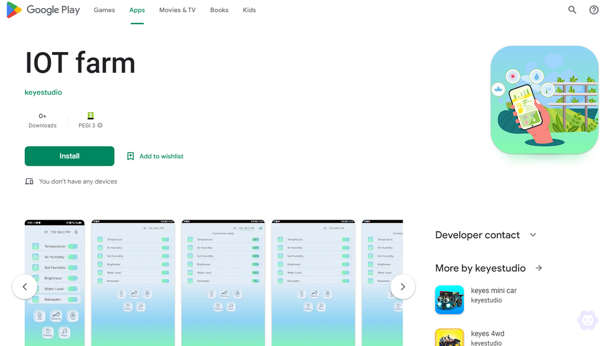
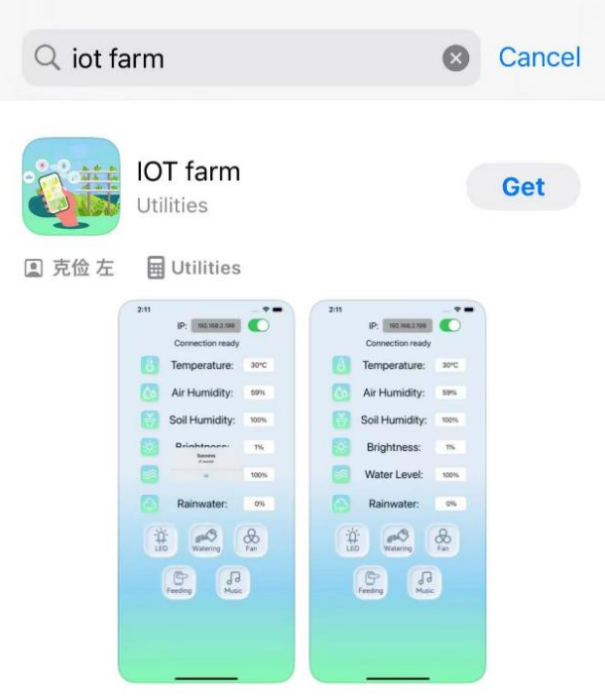
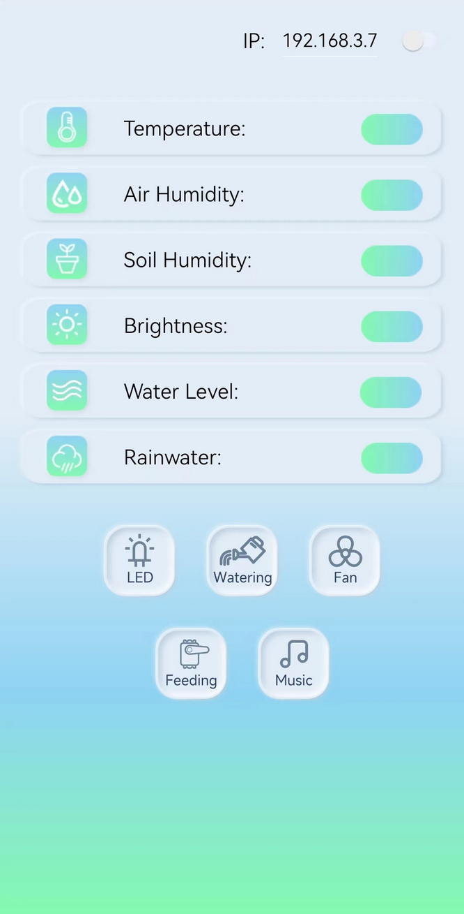
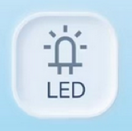

### 5.12 Contrôle de la ferme intelligente par application

**Attention : Ne laissez pas l'eau déborder des piscines en plastique lors des expériences. Le déversement d'eau sur d'autres capteurs peut provoquer un court-circuit ou rendre les modules hors service. Si les batteries sont mouillées, une explosion peut même se produire. Soyez extrêmement prudent ! Pour les jeunes utilisateurs, veuillez opérer avec vos parents. Utilisez des piles pour l'alimentation au lieu de simplement l'USB.**

Ouvrez le code **5.12.1APP-Smart-Farm** avec l'Arduino IDE.

```c
#include <Arduino.h>
#ifdef ESP32
#include <WiFi.h>
#elif defined(ESP8266)
#include <ESP8266WiFi.h>
#endif

#include <dht11.h>
#include <ESP32Servo.h>
#include <LiquidCrystal_I2C.h>

//À afficher
#define DHT11PIN 17         //Broche du capteur de température et d'humidité
#define RAINWATERPIN 35     //Broche du capteur de vapeur
#define LIGHTPIN 34         //Broche de la photorésistance
#define WATERLEVELPIN 33    //Broche du capteur de niveau d'eau
#define SOILHUMIDITYPIN 32  //Broche du capteur d'humidité du sol
//À contrôler
#define LEDPIN 27     //Broche de la LED
#define RELAYPIN 25   //Broche du relais (pour contrôler la pompe à eau)
#define SERVOPIN 26   //Broche du servo
#define FANPIN1 19    //Broche IN+ du ventilateur
#define FANPIN2 18    //Broche IN- du ventilateur
#define BUZZERPIN 16  //Broche du buzzer

const char* ssid = "your_SSID";
const char* pwd = "your_PASSWORD";

//Initialiser LCD1602, 0x27 est l'adresse I2C
LiquidCrystal_I2C lcd(0x27, 16, 2);
WiFiServer server(80);  //Initialiser le serveur wifi
dht11 DHT11;            //Initialiser le capteur de température et d'humidité
Servo myservo;          // créer un objet servo pour contrôler un servo
                        // 16 objets servo peuvent être créés sur l'ESP32

//Définir la variable comme valeurs détectées
String request;
String dataBuffer;
int Temperature;   //Température
int Humidity;      //Humidité
int SoilHumidity;  //Humidité du sol
int Light;         //Luminosité
int WaterLevel;    //Niveau d'eau
int Rainwater;     //Précipitations

void setup() {
  Serial.begin(9600);
  //Se connecter au wifi
  WiFi.begin(ssid, pwd);
  //Déterminer si connecté
  Serial.println("Connexion au WiFi...");
  while (WiFi.status() != WL_CONNECTED) {
    delay(1000);
    Serial.print(".");
  }
  delay(1000);
  //Le moniteur série affiche le nom du wifi et l'adresse IP
  Serial.println("Connecté au WiFi");
  Serial.print("NOM WiFi:");
  Serial.println(ssid);
  Serial.print("IP:");
  Serial.println(WiFi.localIP());

  //Initialiser l'écran LCD
  lcd.init();
  // Allumer/éteindre le rétroéclairage (optionnel)
  lcd.backlight();
  //lcd.noBacklight();
  lcd.clear();
  //Définir la position du curseur
  lcd.setCursor(0, 0);
  //Affichage LCD
  lcd.print("IP:");
  //Définir la position du curseur
  lcd.setCursor(0, 1);
  //Affichage LCD
  lcd.print(WiFi.localIP());

  //définir le mode des broches
  pinMode(LEDPIN, OUTPUT);
  pinMode(RAINWATERPIN, INPUT);
  pinMode(LIGHTPIN, INPUT);
  pinMode(SOILHUMIDITYPIN, INPUT);
  pinMode(WATERLEVELPIN, INPUT);
  pinMode(RELAYPIN, OUTPUT);
  pinMode(FANPIN1, OUTPUT);
  pinMode(FANPIN2, OUTPUT);
  pinMode(BUZZERPIN, OUTPUT);
  delay(1000);

  // attache le servo sur la broche 26 à l'objet servo
  myservo.attach(SERVOPIN);
  myservo.write(160);

  //Démarrer le serveur
  server.begin();

  // Configurer le canal LEDC
  ledcAttachChannel(BUZZERPIN, 1000, 8, 4);
}

cpp
void loop() {
  //Vérifier si un client est connecté au serveur web
  //Lorsque le client est connecté au serveur, "server.available()" renvoie un objet WiFiClient pour la communication côté client.
  WiFiClient client = server.available();
  if (client) {
    Serial.println("Nouveau client connecté");
    while (client.connected()) {
      //Déterminer si le serveur envoie des données
      if (client.available()) {
        request = client.readStringUntil('s');
        Serial.print("Message reçu : ");
        Serial.println(request);
      }
      //Acquérir toutes les données des capteurs
      getSensorsData();
      //Mettre toutes les données dans "dataBuffer"
      dataBuffer = "";
      dataBuffer += String(Temperature, HEX);
      dataBuffer += String(Humidity, HEX);
      dataBuffer += dataHandle(SoilHumidity);
      dataBuffer += dataHandle(Light);
      dataBuffer += dataHandle(WaterLevel);
      dataBuffer += dataHandle(Rainwater);
      //Envoyer les données au serveur, transmettre à l'APP
      client.print(dataBuffer);
      delay(500);

      //LED
      if (request == "a") {
        digitalWrite(LEDPIN, HIGH);
      } else if (request == "A") {
        digitalWrite(LEDPIN, LOW);
      }
      //Irrigation
      else if (request == "b") {
        digitalWrite(RELAYPIN, HIGH);
        delay(400);  //Délai d'irrigation
        digitalWrite(RELAYPIN, LOW);
        delay(650);
      }
      //Ventilateur
      else if (request == "c") {
        delay(800);
        digitalWrite(FANPIN1, HIGH);
        digitalWrite(FANPIN2, LOW);
        delay(200);
      } else if (request == "C") {
        digitalWrite(FANPIN1, LOW);
        digitalWrite(FANPIN2, LOW);
      }
      //Boîte d'alimentation
      else if (request == "d") {
        //Le servo tourne à 80°, ouvre la boîte d'alimentation
        myservo.write(80);
        delay(500);
      } else if (request == "D") {
        //Le servo tourne à 160°, ferme la boîte d'alimentation
        myservo.write(160);
      }
      //Buzzer
      else if (request == "e") {
        ledcWriteTone(BUZZERPIN, 262);
        delay(800);
        ledcWriteTone(BUZZERPIN, 0);
        delay(100);
      }
      request = "";
    }
    Serial.println("Client déconnecté");
  }
}

void getSensorsData() {
  //Acquérir les données
  int chk = DHT11.read(DHT11PIN);
  //Capteur de vapeur
  Rainwater = analogRead(RAINWATERPIN);
  //Photorésistance
  Light = analogRead(LIGHTPIN);
  //Capteur d'humidité du sol
  SoilHumidity = analogRead(SOILHUMIDITYPIN) * 1.8;
  //Capteur de niveau d'eau
  WaterLevel = analogRead(WATERLEVELPIN) * 1.8;
  //Température
  Temperature = DHT11.temperature;
  //Humidité
  Humidity = DHT11.humidity;
}


//Convertir les données en pourcentage
String dataHandle(int data) {
  // Convertir les valeurs analogiques en pourcentage
  int percentage = (data / 4095.0) * 100;
  // Si le pourcentage converti est supérieur à 100, afficher 100.
  percentage = percentage > 100 ? 100 : percentage;
  // Six caractères stockent les chaînes hexadécimales, un caractère est comme terminateur
  char hexString[3];
  // Convertir les valeurs hexadécimales en chaînes hexadécimales à 6 chiffres, ajouter des zéros non significatifs : 0 est 00, 1 est 01...
  sprintf(hexString, "%02X", percentage);

  return hexString;
}
```

Changez `your_SSID` dans le code par le nom de votre wifi, et `your_PASSWORD` par le mot de passe wifi. Ensuite, téléchargez le code.

```c
const char* ssid = "your_SSID";
const char* password = "your_PASSWORD";
```

Choisissez la carte **ESP32 Dev Module** et le port **COM**, puis téléchargez le code.


**Télécharger l'APP**

**Pour Android :**

Méthode 1 : Recherchez « **IOT Farm** » dans Google Play et téléchargez-la.



**Pour iOS :**

Recherchez **IOT farm** dans l'App Store et appuyez pour télécharger.



**La page d'accueil de l'application**



**Description des fonctions de l'application**

1. Après avoir téléchargé le code, connectez le téléphone au même WIFI que l'ESP32, il vous suffit d'entrer l'adresse IP dans le coin supérieur droit pour vous connecter. **Remarque :** Nécessite un WIFI **2,4 GHz**, pas 5G.


2. Affiche la valeur de la température de la ferme en temps réel.


3. Affiche la valeur de l'humidité de l'air de la ferme en temps réel.


4. Affiche la valeur de l'humidité du sol de la ferme en temps réel.


5. Affiche la valeur de la luminosité du soleil de la ferme en temps réel.


6. Affiche le niveau d'eau de la ferme en temps réel.


7. Affiche la valeur analogique des précipitations de la ferme en temps réel.


8. Contrôle la LED.



9. Contrôle l'irrigation via la pompe à eau.


10. Contrôle le ventilateur pour ajuster la température.


11. Contrôle le servomoteur pour ouvrir ou fermer la boîte d'alimentation.


12. Contrôle le buzzer pour émettre un son.

