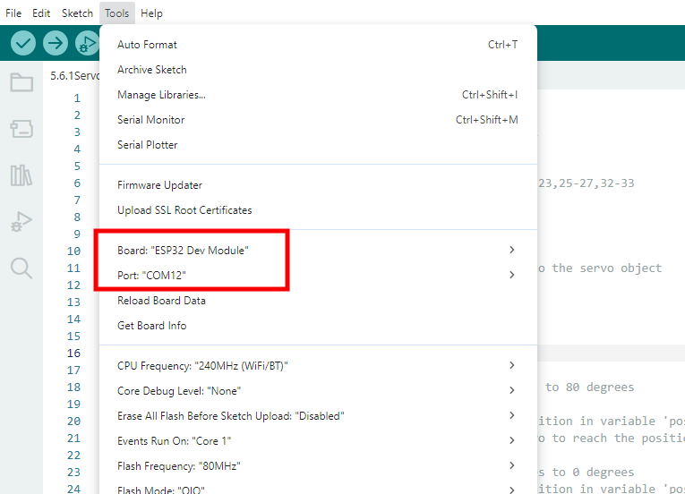
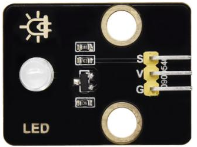
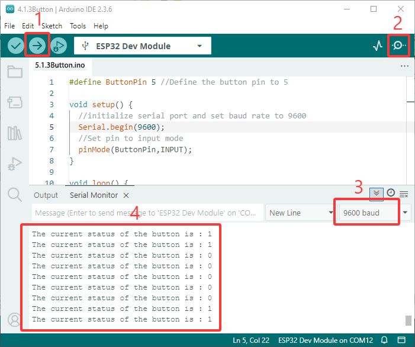
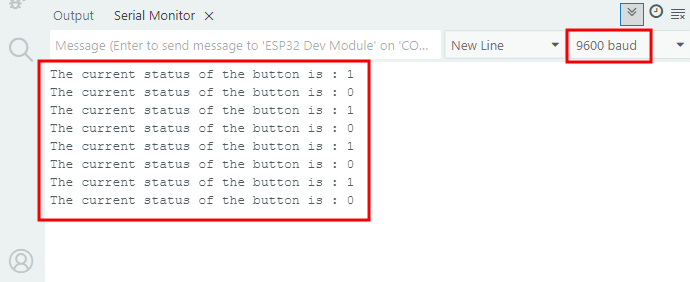

### 5.1 照明システム


#### 5.1.1 LEDを点灯させる


Arduino IDEで **5.1.1Blink** コードを開きます。

```c
#define LED_BUILTIN 27  //LED pins

void setup() {
  // initialize digital pin LED_BUILTIN as an output.
  pinMode(LED_BUILTIN, OUTPUT);
}

// the loop function runs over and over again forever
void loop() {
  digitalWrite(LED_BUILTIN, HIGH);  // turn the LED on (HIGH is the voltage level)
  delay(1000);                      // wait for a second
  digitalWrite(LED_BUILTIN, LOW);   // turn the LED off by making the voltage LOW
  delay(1000);                      // wait for a second
}
```

**ESP32 Dev Module** ボードと **COM** ポートを選択し、コードをアップロードします。



**テスト結果:**

ESP32ボードのio27が1秒ごとに高レベルと低レベルを交互に出力するため、LEDは1秒ごとに点滅します。

| 電源レベル | 結果 |
| --- | --- |
| HIGH | LED ON |
| LOW | LED OFF |




#### 5.1.2 PWMでLEDを制御する


Arduino IDEで **5.1.2PWM** コードを開きます。

```c
#define led 27    //Define LED pin

void setup(){
  pinMode(led, OUTPUT);  //Set pin to output mode
}

void loop(){
  for(int i=0; i<255; i++)  //for loop statement. Constantly increase variable i till 255, exit the loop
  {
    analogWrite(led, i);  //PWM output, used to control the brightness of LED
    delay(3);
  }
  for(int i=255; i>0; i--)  //for loop statement. Constantly decrease variable i till 0, exit the loop
  {
    analogWrite(led, i);
    delay(3);
  }
}
```

**ESP32 Dev Module** ボードと **COM** ポートを選択し、コードをアップロードします。


**テスト結果:**

適切な信号周波数では、PWMは1周期のデューティサイクルを変更することで実効出力電圧を変化させます。簡単に言えば、指定された時間内でIOポートが高レベルを出力する時間が長いほど、PWM値は大きくなり、LEDは明るくなります。

**LEDモジュールは暗い状態からゆっくりと明るくなり、その後、明るい状態から暗い状態へと変化します。**


#### 5.1.3 ボタンのデジタル値を読み取る


Arduino IDEで **5.1.3Button** コードを開きます。

```c
#define ButtonPin 5 //Define the button pin to 5

void setup() {
  //initialize serial port and set baud rate to 9600
  Serial.begin(9600);
  //Set pin to input mode
  pinMode(ButtonPin,INPUT);
}

void loop() {
  //Define a value as the read button value
  int ReadValue = digitalRead(ButtonPin); 
  //Serial port prints the defined value
  Serial.print("The current status of the button is : ");
  Serial.println(ReadValue);
  delay(500);
}
```

**ESP32 Dev Module** ボードと **COM** ポートを選択し、コードをアップロードします。


**テスト結果:**

シリアルモニターを開き、ボーレートを9600に設定します。

ボタンが離されているときは値は1で、ボタンを押すと0になります。

ボタンモジュールの原理は、このボタンによって制御される回路です。

ボタンが押されると回路が閉じ、電流がボタンを介してGNDに流れ、デジタル入力ピンが低レベルを検出します。

ボタンが離されると回路が切断され、プルアップ抵抗によりピンレベルが上昇し、デジタルピンが高レベルを検出します。




#### 5.1.4 自動ロックボタン


Arduino IDEで **5.1.4 Self-Locking_Button** コードを開きます。

```c
#define ButtonPin 5 //Define the button pin
int value = 0;      //Define a value to determine the status of button

void setup() {
  //Initialize the serial port and set baud rate to 9600
  Serial.begin(9600);
  //Set the pin to inpu tmode
  pinMode(ButtonPin,INPUT);
}

void loop() {
  //Define a value as the read button value
  int ReadValue = digitalRead(ButtonPin); 
  //Detect whether the button is pressed
  if (ReadValue == 0) {
    //Eliminate the button shake
    delay(10);  
    if (ReadValue == 0) {
      value = !value;
      Serial.print("The current status of the button is : ");
      Serial.println(value);
    }
    //Detect again whether the button is still pressed
    //Pressed: execute the loop; Released: exit the loop to next step
    while (digitalRead(ButtonPin) == 0); 
  }
}
```

**ESP32 Dev Module** ボードと **COM** ポートを選択し、コードをアップロードします。


**テスト結果:**

シリアルモニターを開き、ボーレートを9600に設定します。

ボタンを一度押すと1が表示されます。2回目にボタンを押すと値は0になります。これで、一般的なボタンが自動ロック機能を持つようになりました。




#### 5.1.5 ボタンでLEDモジュールを制御する


Arduino IDEで **5.1.5 Lighting-System** コードを開きます。

```c
#define ButtonPin 5   //Define a button pin
#define LED       27  //Define LED pin
int value = 0;        //Define a value to detect button status

void setup() {
  //initialize serial port and set baud rate to 9600
  Serial.begin(9600);
  //Set pin to input mode
  pinMode(ButtonPin,INPUT);
  //Set pin to output mode
  pinMode(LED,OUTPUT);
}

void loop() {
  //Define a value as the read button value
  int ReadValue = digitalRead(ButtonPin); 
  //Detect whether the button is pressed
  if (ReadValue == 0) {
    //Eliminate the button shake
    delay(10);  
    if (ReadValue == 0) {
      value = !value;
      //Detect the button status, press once to light up LED, press again to turn off LED, in a loop
      if(value) {
        digitalWrite(LED,HIGH);
      }else{
        digitalWrite(LED,LOW);
      }
    }
    //Detect the button status again
    //Pressed: execute the loop; Released: exit the loop to next step
    while (digitalRead(ButtonPin) == 0); 
  }
}
```

**ESP32 Dev Module** ボードと **COM** ポートを選択し、コードをアップロードします。


**テスト結果:**

ボタンを一度押すとLEDが点灯し、もう一度押すとLEDが消灯します。この操作はループであり、実際の照明原理と一致しています。


