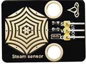
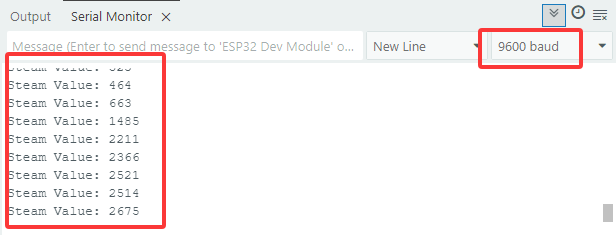

### 5.4 Système de détection de pluie


#### 5.4.1 Capteur de vapeur




Le capteur de vapeur détecte la présence d'eau, il est donc généralement utilisé pour la détection de pluie. Si la pluie touche les pastilles conductrices du capteur, il enverra un signal à la carte Arduino.


**Paramètres**:

- Tension : 3~5V
- Courant : 1.5mA
- Puissance : 7.5mW

Ouvrez le code **5.4.1Alarm-System** avec Arduino IDE.

```c
#define SteamPin 35   //Define the steam sensor pin to 35

void setup() {
  Serial.begin(9600);
  pinMode(SteamPin,INPUT);
}

void loop() {
  //Read the value of steam sensor
  int ReadValue = analogRead(SteamPin);
  Serial.print("Steam Value: ");
  Serial.println(ReadValue);
  delay(500);
}
```

Choisissez la carte **ESP32 Dev Module** et le port **COM**, puis téléchargez le code.


**Résultat du test :**

Touchez la zone de détection avec votre doigt. Plus la zone touchée est grande, plus la valeur sera élevée.

Vous pouvez ouvrir le moniteur série pour observer la valeur actuellement détectée (plage : 0~4095).




#### 5.4.2 Système de détection d'eau de pluie


Ouvrez le code **5.4.2Rainwater-Detection-System** avec Arduino IDE

```c
#define SteamPin 35   //Define pins
#define BuzzerPin 16

void setup() {
  Serial.begin(9600);
  pinMode(SteamPin,INPUT);
  pinMode(BuzzerPin,OUTPUT);
}

void loop() {
  //Read the value of steam sensor
  int ReadValue = analogRead(SteamPin);
  Serial.print("Steam Value: ");
  Serial.println(ReadValue);
  //Determine whether the detected value is within 800~2000
  if(ReadValue >= 800 && 2000 > ReadValue){
    //Execute for 3 times
    for (int i = 0; i < 3; i++) {
      tone(BuzzerPin,200);
      delay(100);
      noTone(BuzzerPin);
      delay(100);
    }
  }
  //Determine whether the detected value is within 2000~4000
  else if (ReadValue >= 2000 && 4000 >= ReadValue) {
    for (int i = 0; i < 3; i++) {
      tone(BuzzerPin,400);
      delay(100);
      noTone(BuzzerPin);
      delay(100);
    }
  }
  //Determine whether the detected value is greater than 4000
  else if (ReadValue > 4000) {
    for (int i = 0; i < 3; i++) {
      tone(BuzzerPin,600);
      delay(100);
      noTone(BuzzerPin);
      delay(100);
    }
  }
  noTone(BuzzerPin);
  delay(500);
}
```

Choisissez la carte **ESP32 Dev Module** et le port **COM**, puis téléchargez le code.


**Résultat du test :**

Plus la valeur détectée par le capteur de vapeur est élevée, plus le son émis par le buzzer sera fort.

