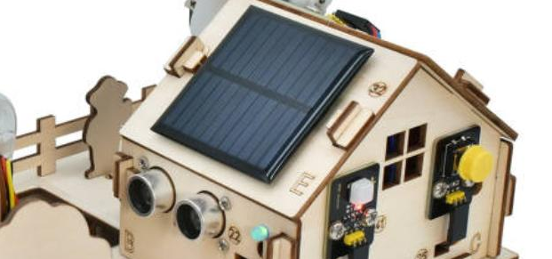
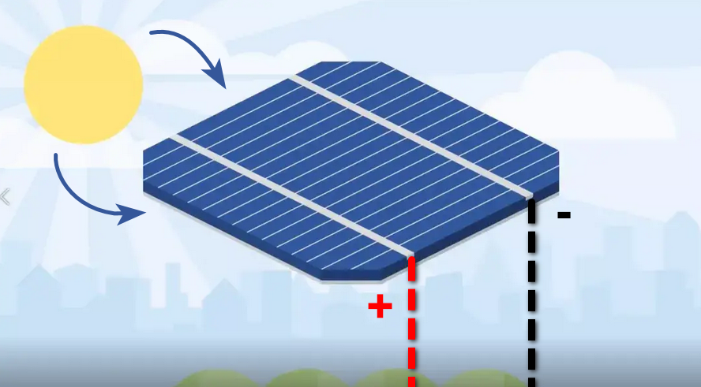

### 5.5 Système d'énergie solaire

**Paramètres**

Tension: 5V

Courant: 80mA

Puissance: 400mW

Dimensions: 60*60mm

Les codes ne sont pas requis dans ce projet. Il est important d'apprendre sur la nouvelle énergie environnementale --- l'énergie solaire.

Lorsque l'éclairage est bon, la LED s'allume en jaune. Plus la lumière est vive, plus la LED sera lumineuse.

Le panneau solaire absorbe la lumière et convertit directement ou indirectement le rayonnement solaire en électricité. Comparé à la production d'électricité au charbon ordinaire, l'énergie solaire, éolienne et hydraulique sont plus économes en énergie et respectueuses de l'environnement.

Le Soleil émet de l'énergie sous forme d'ondes avec une large gamme de longueurs d'onde, de l'ultraviolet à la lumière visible et infrarouge.

Longueur d'onde de l'ultraviolet: 150~400nm;

Longueur d'onde de la lumière visible: 400~760nm;

Longueur d'onde de la lumière infrarouge: 760~4000nm;

Le panneau absorbe l'une de ces gammes de longueurs d'onde et les convertit en électricité.

**Q: Pourquoi le panneau solaire fonctionne-t-il encore sans lumière du soleil?**

R: Il fonctionne non seulement avec la lumière du soleil mais aussi avec la lumière ambiante. Plus la lumière est vive, plus la tension sera élevée, et plus la LED sera lumineuse.