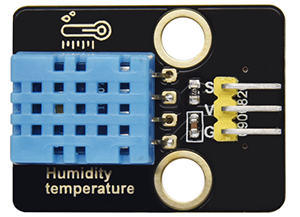
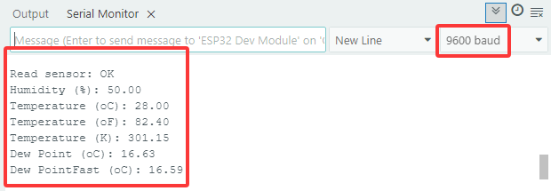
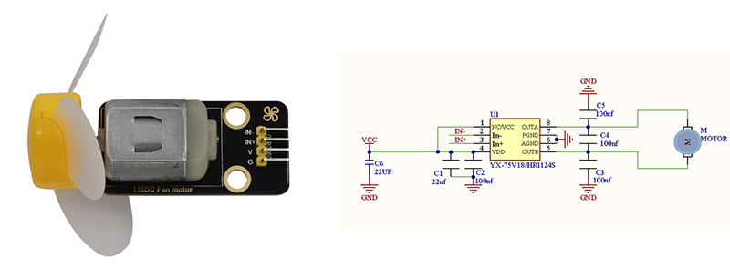

### 5.7 Sistema di Controllo della Temperatura


#### 5.7.1 Sensore di temperatura e umidità DHT11




Il sensore di temperatura e umidità DHT11 emette segnali digitali. Applica i principi dell'acquisizione e conversione del segnale analogico, nonché la tecnologia di rilevamento della temperatura e dell'umidità, in modo da garantire stabilità a lungo termine e alta affidabilità. Inoltre, il sensore integra un sensore di umidità resistivo ad alta precisione e un sensore di temperatura termo-sensibile resistivo, ed è collegato a una MCU a 8 bit ad alte prestazioni.

Apri il codice **5.7.4Temperature-Control-System** con Arduino IDE

```c
#include <dht11.h>
#define DHT11PIN 17

dht11 DHT11;

void setup()
{
  Serial.begin(9600);
  Serial.println("DHT11 TEST PROGRAM ");
  Serial.print("LIBRARY VERSION: ");
  Serial.println(DHT11LIB_VERSION);
  Serial.println();
}

void loop()
{
  Serial.println("\n");

  int chk = DHT11.read(DHT11PIN);

  Serial.print("Read sensor: ");
  switch (chk)
  {
    case DHTLIB_OK: 
                Serial.println("OK"); 
                break;
    case DHTLIB_ERROR_CHECKSUM: 
                Serial.println("Checksum error"); 
                break;
    case DHTLIB_ERROR_TIMEOUT: 
                Serial.println("Time out error"); 
                break;
    default: 
                Serial.println("Unknown error"); 
                break;
  }

  Serial.print("Humidity (%): ");
  Serial.println((float)DHT11.humidity, 2);

  Serial.print("Temperature (oC): ");
  Serial.println((float)DHT11.temperature, 2);

  Serial.print("Temperature (oF): ");
  Serial.println(Fahrenheit(DHT11.temperature), 2);

  Serial.print("Temperature (K): ");
  Serial.println(Kelvin(DHT11.temperature), 2);

  Serial.print("Dew Point (oC): ");
  Serial.println(dewPoint(DHT11.temperature, DHT11.humidity));

  Serial.print("Dew PointFast (oC): ");
  Serial.println(dewPointFast(DHT11.temperature, DHT11.humidity));

  delay(2000);
}

double Fahrenheit(double celsius) 
{
        return 1.8 * celsius + 32;
}    //Convert Celsius degree to Fahrenheit degree

double Kelvin(double celsius)
{
        return celsius + 273.15;
}     //Convert Celsius degree to Kelvins

//Dew Point. The air is saturated and dews are produced under this temperature.
//Reference: http://wahiduddin.net/calc/density_algorithms.htm 
double dewPoint(double celsius, double humidity)
{
        double A0= 373.15/(273.15 + celsius);
        double SUM = -7.90298 * (A0-1);
        SUM += 5.02808 * log10(A0);
        SUM += -1.3816e-7 * (pow(10, (11.344*(1-1/A0)))-1) ;
        SUM += 8.1328e-3 * (pow(10,(-3.49149*(A0-1)))-1) ;
        SUM += log10(1013.246);
        double VP = pow(10, SUM-3) * humidity;
        double T = log(VP/0.61078);   // temp var
        return (241.88 * T) / (17.558-T);
}

// Fast calculate the Dew Point, its speed is 5 times of dewPoint()
// Reference: http://en.wikipedia.org/wiki/Dew_point
double dewPointFast(double celsius, double humidity)
{
        double a = 17.271;
        double b = 237.7;
        double temp = (a * celsius) / (b + celsius) + log(humidity/100);
        double Td = (b * temp) / (a - temp);
        return Td;
}
```

Scegli la scheda **ESP32 Dev Module** e la porta **COM**, quindi carica il codice.


**Risultato del test:**

Apri il monitor seriale e imposta la velocità di trasmissione a 9600, il monitor seriale visualizzerà il valore attuale di temperatura e umidità.




#### 5.7.2 Modulo LCD 1602


L'LCD 1602 possiede un'interfaccia standard a 14 pin (senza retroilluminazione) o 16 pin (con retroilluminazione), risparmiando i pin della MCU. Il suo IC di pilotaggio del display realizza il controllo I2C.


Apri il codice **5.7.2LCD1602** con Arduino IDE.

```c
#include <LiquidCrystal_I2C.h>

//Initialize LCD 1602, 0x27 is I2C address
LiquidCrystal_I2C lcd(0x27,16,2);

void setup() {
  //Initialize LCD
  lcd.init();
  // Turn the (optional) backlight off/on
  lcd.backlight();
  //lcd.noBacklight();

  //Set the position o dcursor
  lcd.setCursor(0, 0);
  //LCD prints
  lcd.print("HELLO WORLD 0");
  lcd.setCursor(0, 1);
  lcd.print("HELLO WORLD 1");

  //Clear displays
  // lcd.clear();
}

void loop() {

  // Turn the display on/off (quickly)
  //lcd.noDisplay();
  //lcd.display();

  // Turns the underline cursor on/off
  //lcd.noCursor();
  //lcd.cursor();

  // Turn on and off the blinking cursor
  // lcd.noBlink();
  // lcd.blink();

  // These commands scroll the display without changing the RAM
  //lcd.scrollDisplayLeft();
  //lcd.scrollDisplayRight();

  // This is for text that flows Left to Right
  //lcd.leftToRight();
  //lcd.rightToLeft();

  // This will 'right justify' text from the cursor
  //lcd.autoscroll();
  //lcd.noAutoscroll();

}
```

Scegli la scheda **ESP32 Dev Module** e la porta **COM**, quindi carica il codice.


**Risultato del test:**

L'LCD1602 accende la sua retroilluminazione e visualizza "HELLO WORLD 0" e "HELLO WORLD 1".


#### 5.7.3 Motore e Ventola

Il motore 130 è in grado di regolare la velocità tramite PWM. Nel processo, sono necessari due pin per il controllo.



Apri il codice **5.7.3Motor** con Arduino IDE.

```c
#define MotorPin1 19  //(IN+)
#define MotorPin2 18  //(IN-)

void setup() {
  pinMode(MotorPin1, OUTPUT);
  pinMode(MotorPin2, OUTPUT);
}

void loop() {
  //corotation 
  analogWrite(MotorPin1, 255); //Adjust the motor speed by modifying the analog value output range from 0-255
  analogWrite(MotorPin2, 0);
  delay(2000);
  //Stop Transition
  delay(200);
  analogWrite(MotorPin1, 0);
  analogWrite(MotorPin2, 0);
  delay(200);
  //reversal
  analogWrite(MotorPin1, 0);
  analogWrite(MotorPin2,