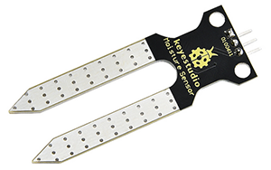
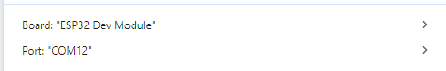
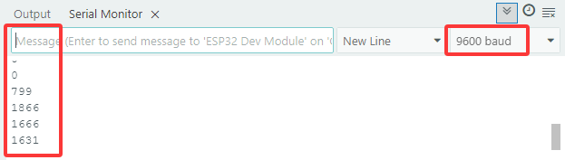
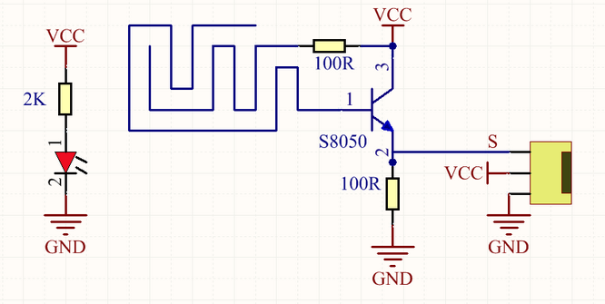
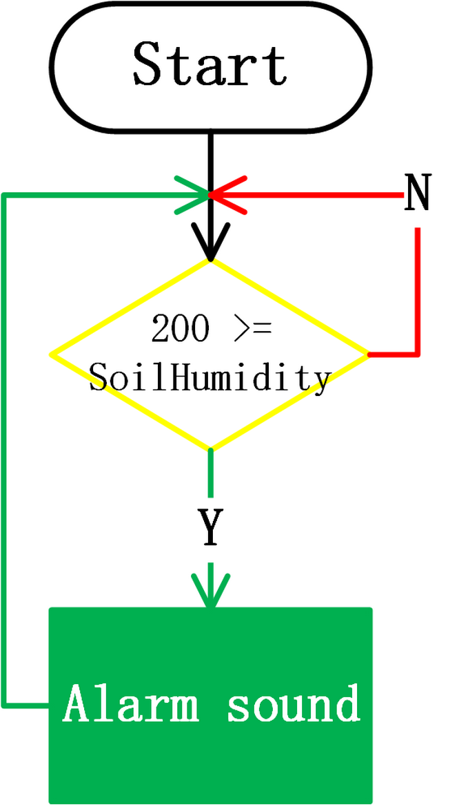

### 5.8 Bodemvochtigheidsbewakingssysteem


#### 5.8.1 Bodemvochtigheidssensor




Let op: Laat geen water overlopen uit plastic bakken tijdens experimenten. Morsen van water op andere sensoren kan niet alleen kortsluiting of uitval van modules veroorzaken, maar ook hitteontwikkeling en zelfs explosie. Wees extra voorzichtig! Vooral voor jongere gebruikers, gelieve onder toezicht van uw ouders te werken.

Open de code **5.8.1Soil-Humidity-Sensor** met Arduino IDE.

```c
#define SoilHumidityPin 32

void setup() {
  Serial.begin(9600);
  pinMode(SoilHumidityPin,INPUT);
}

void loop() {
  //Define a variable as the value of soil humidity sensor
  int ReadValue = analogRead(SoilHumidityPin);
  Serial.println(ReadValue);
  delay(500);
}
```

Kies het **ESP32 Dev Module** board en de **COM** poort, en upload de code.



**Testresultaat:**

Open de seriële monitor. Raak het detectiegebied van de sensor aan met een natte vinger en de momenteel gedetecteerde vochtigheidswaarde wordt op de monitor afgedrukt (bereik: 0~4095).



Bodemvochtigheidssensoren worden voornamelijk gebruikt om het watergehalte in volumetrische grond te meten, bodemvocht te monitoren, gewassen te irrigeren en bossen te beschermen.




#### 5.8.2 Bodemvochtigheidsbewakingssysteem


We gebruiken LCD1602 om de real-time waarde van de bodemvochtigheid weer te geven. Wanneer de waarde lager is dan de ingestelde minimale vochtigheid, zal de zoemer geluid maken om boeren te waarschuwen voor irrigatie.

Open de code **5.8.2Soil-Humidity-Testing-System** met Arduino IDE.

```c
#include <LiquidCrystal_I2C.h>

#define BuzzerPin 16
#define SoilHumidityPin 32

LiquidCrystal_I2C lcd(0x27,16,2);

void setup() {

  ledcAttachChannel(BuzzerPin,1000,8,4);

  pinMode(SoilHumidityPin,INPUT);

  lcd.init();
  lcd.backlight();  
  lcd.clear();

}

void loop() {

  float shvalue = analogRead(SoilHumidityPin);

  lcd.setCursor(0, 0);
  lcd.print("SoilHum:");
  lcd.setCursor(9, 0);
  lcd.print(shvalue);
  
  //When the detected value is lower than the set threshold, the buzzer emits sound
  if(200 >= shvalue)
  {
    ledcWriteTone(BuzzerPin,532);
    delay(100);
    ledcWriteTone(BuzzerPin,532);
    delay(100);
    ledcWriteTone(BuzzerPin,659);
    delay(100);
    ledcWriteTone(BuzzerPin,0);  //Stop alarming
  }
  delay(500);
  lcd.clear();
}
```

Kies het **ESP32 Dev Module** board en de **COM** poort, en upload de code.


**Testresultaat:**

De LCD1602 geeft de real-time waarde van de bodemvochtigheid weer. Wanneer de waarde gedetecteerd door de bodemvochtigheidssensor lager is dan 200, geeft de zoemer geluid om te alarmeren.



Let op: Laat geen water overlopen uit plastic bakken tijdens experimenten. Morsen van water op andere sensoren kan niet alleen kortsluiting of uitval van modules veroorzaken, maar ook hitteontwikkeling en zelfs explosie. Wees extra voorzichtig! Vooral voor jongere gebruikers, gelieve onder toezicht van uw ouders te werken.
