.. _KidsBlock-Tutorials:

KidsBlock Tutorials
===================

.. _1.-Code-and-Library-Download:

1. Code and Library Download
----------------------------

Download links for the tutorial's code files:

:download:`Click to download <Codes.zip>`

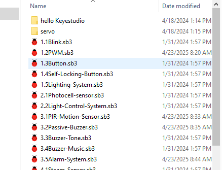

.. _2.-Software-Installation:

2. Software Installation
------------------------

.. _2.1-KidsBlock-Installation:

2.1 KidsBlock Installation
~~~~~~~~~~~~~~~~~~~~~~~~~~

.. _2.1.1-Install-Kidsblock-on-Windows-System:

2.1.1 Install Kidsblock on Windows System
^^^^^^^^^^^^^^^^^^^^^^^^^^^^^^^^^^^^^^^^^

#. You could download KidsBlock from:

   -  Link: http://xiazai.keyesrobot.cn/KidsBlock.exe

   -  Provided file: |img|

#. After downloading, click “KidsBlock.exe”\ |image1|

#. Tick “\ **Anyone who uses this computer(all users)**\ ” and then
   click “\ **Next**\ ”.

.. image:: ./scratch_img/an2.png
   :alt: img

4. Click “\ **Browse...**\ ” to choose a path to install (Here we choose
   Disk C; you may select any where you like), and click
   “\ **Install**\ ”. Now it is installing!

.. image:: ./scratch_img/an3.png
   :alt: img

.. image:: ./scratch_img/an4.png
   :alt: img

5. After installation completing, click “\ **Finish**\ ” to open it.

.. image:: ./scratch_img/an5.png
   :alt: img

6. If a warning shows up, please just click “\ **Allow access**\ ” to
   enter the software main page.

.. image:: ./scratch_img/an6.png
   :alt: img

--------------

.. _2.1.2-Install-Kidsblock-on-MacOS:

2.1.2 Install Kidsblock on MacOS
^^^^^^^^^^^^^^^^^^^^^^^^^^^^^^^^

#. Please download Kidsblock package first:
   http://xiazai.keyesrobot.cn/KidsBlock.dmg

.. image:: ./scratch_img/an7.png
   :alt: img

2. Click KidsBlock and drag the "**KidsBlock Desktop**" into
   "**Applications**", as shown below.

.. image:: ./scratch_img/an8.png
   :alt: img

3. After installation, the KidsBlock icon will show in operating pad:

   .. image:: ./scratch_img/an9.png
      :alt: img

4. Click the KidsBlock icon to enter the software. If it fails, please
   modify some computer settings to re-enter it. This is because Mac
   Systems, by default, only authorize the installation in App Store, so
   others is not allowed to be installed.

   .. image:: ././scratch_img/an9-1.png
      :alt: img

5. Open the settings, and click Privacy and Security. Switch the
   security option to “App Store and Approved Developers”, and click
   “Still Open”.

   .. image:: ././scratch_img/an9-2.png
      :alt: img

6. Click “Open” to re-enter the blocked software.

   .. image:: ././scratch_img/an9-3.png
      :alt: img

7. After settings, it can work normally.

   .. image:: ././scratch_img/an9-4.png
      :alt: img

8. The startup interface is as below. Now enjoy your journey of
   programming!

   .. image:: ././scratch_img/an9-5.png
      :alt: img

--------------

.. _2.2-Software-Guidance:

2.2 Software Guidance
~~~~~~~~~~~~~~~~~~~~~

(**Following demonstrations are based on Windows System, and is only a
reference for MacOS.**)

.. _2.2.1-Main-Page-Function-Distribution-1:

2.2.1 Main Page Function Distribution 1
^^^^^^^^^^^^^^^^^^^^^^^^^^^^^^^^^^^^^^^

.. image:: ./scratch_img/an10.png
   :alt: img

.. _2.2.2-Select-Language:

2.2.2 Select Language
^^^^^^^^^^^^^^^^^^^^^

Click |image2| to select “English” or “简体中文" |image3|

.. _2.2.3-Install-Driver:

2.2.3 Install Driver
^^^^^^^^^^^^^^^^^^^^

**NOTE: If your computer has already installed a driver, please just
skip this section. If not, please follow these steps.**

-  Click |image4| to select “\ **Install driver**\ ”.

.. image:: ./scratch_img/an14.png
   :alt: img

-  Click “\ **Next**\ ” when you see the device driver installation
   wizard:

.. image:: ./scratch_img/an15.png
   :alt: img

-  Click “\ **Finish**\ ”.

.. image:: ./scratch_img/an16.png
   :alt: img

-  Click “\ **Next**\ ”.

.. image:: ./scratch_img/an17.png
   :alt: img

-  Click “\ **Finish**\ ”.

.. image:: ./scratch_img/an18.png
   :alt: img

-  If a warning pops up, just click “\ **Allow**\ ”. Then click
   “\ **Install**\ ”.

.. image:: ./scratch_img/an19.png
   :alt: img

-  Tap “\ **Finish**\ ”.

.. image:: ./scratch_img/an20.png
   :alt: img

-  Click “\ **Extract**\ ”.

.. image:: ./scratch_img/an21.png
   :alt: img

-  Click “\ **Next**\ ”.

.. image:: ./scratch_img/an22.png
   :alt: img

-  Tick “\ **I accept this agreement**\ ” and click “\ **Next**\ ”.

.. image:: ./scratch_img/an23.png
   :alt: img

-  Click “\ **Finish**\ ”.

.. image:: ./scratch_img/an24.png
   :alt: img

-  Choose “\ **INSTALL**\ ”.

.. image:: ./scratch_img/an25.png
   :alt: img

-  A couple of seconds later, the driver will be successfully installed.
   Then click “\ **OK**\ ”.

.. image:: ./scratch_img/an26.png
   :alt: img

.. _2.2.4-Select-Devices:

2.2.4 Select Devices
^^^^^^^^^^^^^^^^^^^^

**Choose a device and a serial port**

-  Click |image5| to choose a device.

-  Here we enter **Kit** to find **Smart farm for ESP32** and add it.
   Note that all sensors are included in this kit, so you do not need to
   import them additionally.

   .. image:: ././scratch_img/an28.png
      :alt: img

-  After import this kit, you will see the following interface of port
   selecting. Click **Connect** at the correct port.

   .. image:: ././scratch_img/an29.png
      :alt: img

-  Tap **Go to Editor**.

   .. image:: ././scratch_img/an30.png
      :alt: img

-  Main Page:

   .. image:: ././scratch_img/an31.png
      :alt: img

**Disconnect the device**

-  If you want to disconnect the kit and port, please click |image6|.

-  Then tap **Disconnect** to unbind the current connection.

   .. image:: ././scratch_img/an33.png
      :alt: img

--------------

.. _2.2.5-Main-Page-Function-Distribution-2:

2.2.5 Main Page Function Distribution 2
^^^^^^^^^^^^^^^^^^^^^^^^^^^^^^^^^^^^^^^

.. image:: ././scratch_img/an34.png
   :alt: img

.. _2.2.6-Expand-a-Sensor/Module:

2.2.6 Expand a Sensor/Module
^^^^^^^^^^^^^^^^^^^^^^^^^^^^

**NOTE: This part can be SKIPPED, as all required sensors are integrated
in the kit with no need to expand. If you want to adopt an excluded
module, please refer to the following procedures.**

-  Click |an42| to enter the sensors/modules extension library.

-  Choose an extension.

   .. image:: ././scratch_img/an36.png
      :alt: img

-  For instance, a buzzer module is required, please click passive
   buzzer:

-  .. image:: ././scratch_img/an37.png
      :alt: img

-  When “\ **Not loaded**\ ” becomes “\ **Loaded**\ ”, this module is
   successfully imported.

   .. image:: ././scratch_img/an38.png
      :alt: img

-  Click |image7| to back to the editor. Now you will find that a
   Passive buzzer block appears in Code.

.. image:: ././scratch_img/an41.png
   :alt: img

-  If you want to remove the “Passive buzzer”, just click |image8| to
   enter library and tap.

   .. image:: ././scratch_img/an38.png
      :alt: img

-  When “Loaded” shifts to “Not loaded”, this module is successfully
   deleted.

.. image:: ././scratch_img/an37.png
   :alt: img

.. _2.2.7-Import-File:

2.2.7 Import File
^^^^^^^^^^^^^^^^^

-  Method 1

   -  If the software is not in operation, then directly click SB3 file
      to open it. For example, click |image9|\ to open it. Remember to
      select a device.

      .. image:: ././scratch_img/an54.png
         :alt: img

-  Method 2

   -  Open Kidsblock. Click “\ **file**\ ” to choose “\ **Load from your
      computer**\ ”.\ |image10|

   -  Select an SB3 file (like |image11|).

      .. image:: ././scratch_img/an50.png
         :alt: img

   -  Import successfully!

      .. image:: ././scratch_img/an54.png
         :alt: img

.. _2.2.8-Upload-Code-&-Set-Baud-Rate:

2.2.8 Upload Code & Set Baud Rate
^^^^^^^^^^^^^^^^^^^^^^^^^^^^^^^^^

**Upload code**

-  Upload file |image12| to Kidsblock.

-  Connect the development board to your computer (If the you cannot see
   a port, please install a driver first), and select the correct port
   and click |image13|.

   .. image:: ././scratch_img/an54.png
      :alt: img

-  Wait for uploading.

   .. image:: ././scratch_img/an53.png
      :alt: img

**Set Baud rate**

-  If there is not a print box, please click one of |image14| to adjust
   the box size.

   -  Small print box\ |image15|
   -  Large print box\ |image16|
   -  No print box\ |image17|

-  Click |image18| to set the corresponding baud rate.

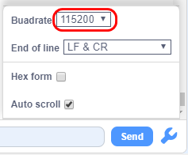

-  “\ **Hello KidsBlock**\ ” starts to be printed in the box after
   setting.

.. image:: ././scratch_img/an62.png
   :alt: img

--------------

--------------

.. _3.-Assembling:

3. Assembling
-------------

During assembling, some codes are required to be burned, so please
install software first.

The whole assembling generally can be divided into two parts: assembling
parts and wirings.

--------------

.. _Step-1-Install-the-ESP32-Board-and-the-Relay-Module:

Step 1 Install the ESP32 Board and the Relay Module
~~~~~~~~~~~~~~~~~~~~~~~~~~~~~~~~~~~~~~~~~~~~~~~~~~~

.. _1.1-Required-components:

1.1 Required components
^^^^^^^^^^^^^^^^^^^^^^^

.. image:: ./scratch_img/image001.png
   :alt: img

--------------

.. _1.2:

1.2
^^^

.. image:: ./scratch_img/image002.png
   :alt: img

--------------

.. _1.3:

1.3
^^^

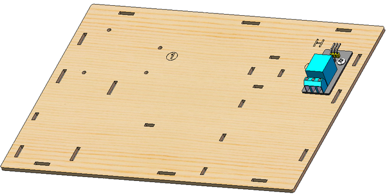

--------------

.. _1.4:

1.4
^^^

.. image:: ./scratch_img/image004.png
   :alt: img

--------------

.. _1.5:

1.5
^^^

.. image:: ./scratch_img/image006.png
   :alt: img

--------------

.. _Step-2Install-the-Fixing-Frame-for-Battery-Case-and-install-the-Feeding-Cabin,connect-the-ESP32-board-and-the-Relay-Module:

Step 2Install the Fixing Frame for Battery Case and install the Feeding Cabin,connect the ESP32 board and the Relay Module
~~~~~~~~~~~~~~~~~~~~~~~~~~~~~~~~~~~~~~~~~~~~~~~~~~~~~~~~~~~~~~~~~~~~~~~~~~~~~~~~~~~~~~~~~~~~~~~~~~~~~~~~~~~~~~~~~~~~~~~~~~

.. _2.1-Required-components:

2.1 Required components
^^^^^^^^^^^^^^^^^^^^^^^

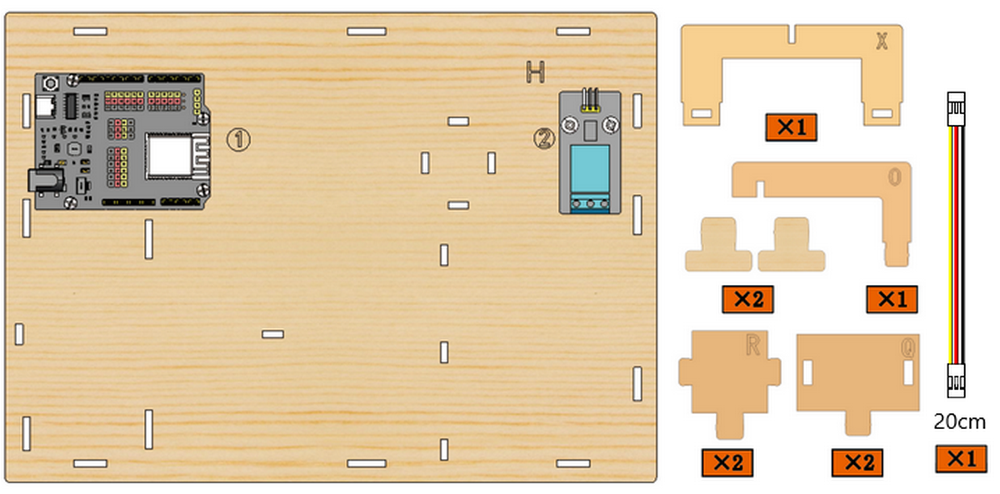

--------------

.. _2.2:

2.2
^^^

Assemble the wooden board X and O on bottom plate

.. image:: ./scratch_img/image008.png
   :alt: img

--------------

.. _2.3:

2.3
^^^

.. image:: ./scratch_img/image010.png
   :alt: img

--------------

.. _2.4:

2.4
^^^

.. image:: ./scratch_img/image011.png
   :alt: img

--------------

.. _2.5:

2.5
^^^

.. image:: ./scratch_img/image012.png
   :alt: img

--------------

.. _2.6:

2.6
^^^

.. image:: ./scratch_img/image013.png
   :alt: img

--------------

.. _2.7:

2.7
^^^

.. image:: ./scratch_img/image014.png
   :alt: img

--------------

.. _2.8-Connect-the-ESP32-board-and-the-Relay-Module:

2.8 Connect the ESP32 board and the Relay Module
^^^^^^^^^^^^^^^^^^^^^^^^^^^^^^^^^^^^^^^^^^^^^^^^

.. container:: table-wrapper

   ============ ========= ====
   Module       Wire      Pin
   ============ ========= ====
   Relay Module 3PIN 20cm IO25
   ============ ========= ====

.. container:: table-wrapper

   ========== ========== ===============
   Module Pin Wire Color ESP32 Board Pin
   ========== ========== ===============
   V          RED        V
   G          BLACK      G
   S          YELLOW     io25
   ========== ========== ===============

.. image:: ./scratch_img/image015.png
   :alt: img

--------------

.. _2.9:

2.9
^^^

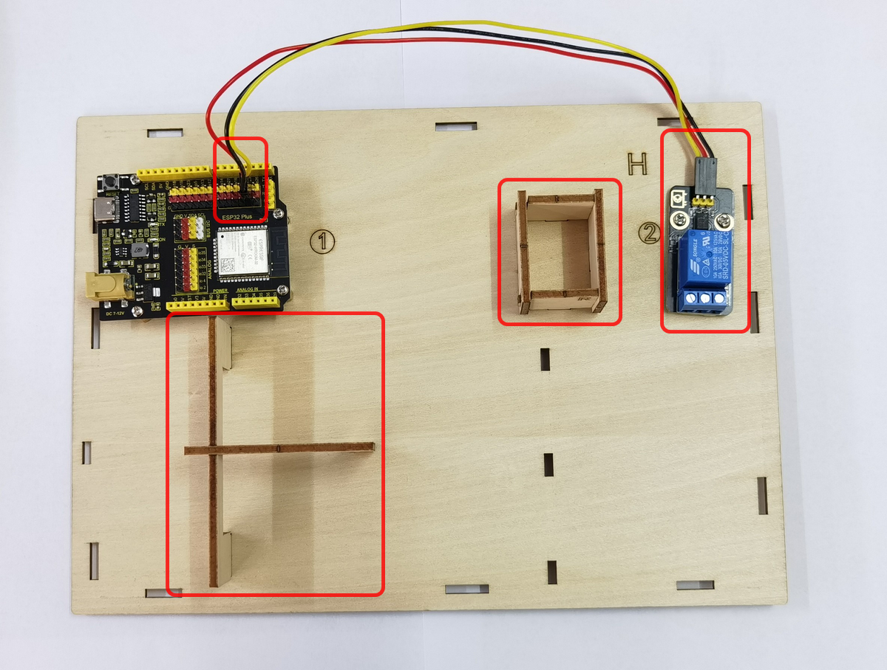

--------------

.. _Step-3-Install-the-Substructure-of-the-house:

Step 3 Install the Substructure of the house
~~~~~~~~~~~~~~~~~~~~~~~~~~~~~~~~~~~~~~~~~~~~

--------------

.. _3.1-Required-components:

3.1 Required components
^^^^^^^^^^^^^^^^^^^^^^^

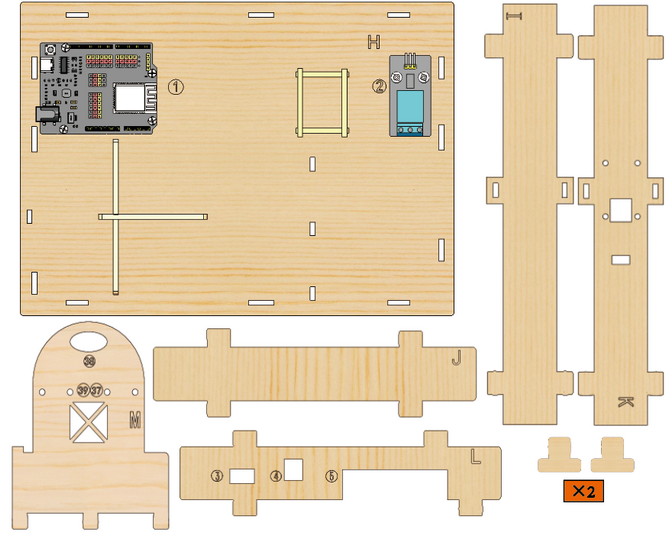

--------------

.. _3.2:

3.2
^^^

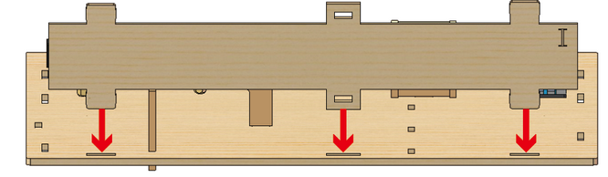

--------------

.. _3.3:

3.3
^^^

.. image:: ./scratch_img/image018.png
   :alt: img

--------------

.. _3.4:

3.4
^^^

.. image:: ./scratch_img/image019.png
   :alt: img

--------------

.. _3.5:

3.5
^^^

.. image:: ./scratch_img/image020.png
   :alt: img

--------------

.. _3.6:

3.6
^^^

.. image:: ./scratch_img/image021.png
   :alt: img

--------------

.. _3.7:

3.7
^^^

.. image:: ./scratch_img/image022.png
   :alt: img

--------------

.. _3.8:

3.8
^^^

.. image:: ./scratch_img/image023.png
   :alt: img

--------------

.. _3.9:

3.9
^^^

.. image:: ./scratch_img/image024.png
   :alt: img

--------------

.. _3.10:

3.10
^^^^

.. image:: ./scratch_img/image025.png
   :alt: img

--------------

.. _3.11:

3.11
^^^^

.. image:: ./scratch_img/image026.png
   :alt: img

--------------

.. _Step-4-Install-the-Door-of-the-Feeding-Cabin:

Step 4 Install the Door of the Feeding Cabin
~~~~~~~~~~~~~~~~~~~~~~~~~~~~~~~~~~~~~~~~~~~~

--------------

.. _4.1-Required-components:

4.1 Required components
^^^^^^^^^^^^^^^^^^^^^^^

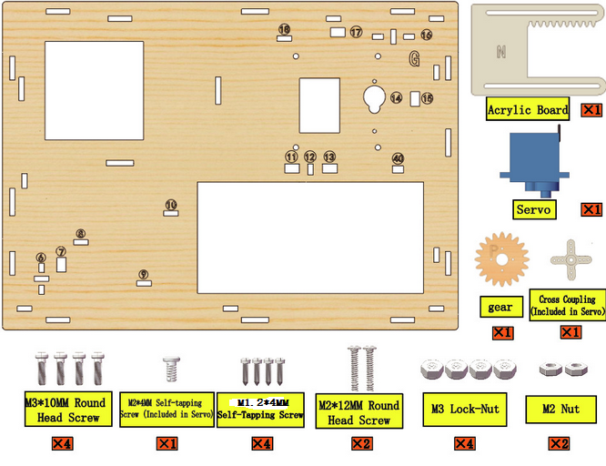

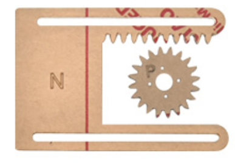

The acrylic sheet is packed separately, and it is recommended that you
tear off its protective film to reduce the friction when it moves as a
door.

--------------

.. _4.2-Set-Servo-to-180°:

4.2 Set Servo to 180°
^^^^^^^^^^^^^^^^^^^^^

Please note that this step is very important. Before installation, be
sure to set the servo to 180 °.

**Before mount the servo, firstly please set the angle to 180° by
programming: KidsBlock(Graphical programming).**

Please refer to the software installation steps for details.

**Connect Servo to ESP32 development board at pin IO26.**

.. image:: ./scratch_img/image028-1.png
   :alt: img

--------------

.. image:: ./scratch_img/image028-3.png
   :alt: img

--------------

-  Open **KidsBlock**. Select ESP32 board and the correct serial port,
   and burn the following code to the board.

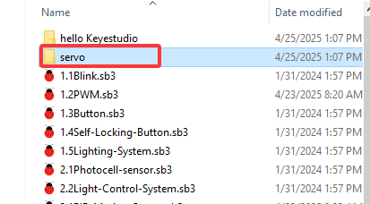

**After setting the servo to a specific angle, disconnect the it from
the development board for installation.**

--------------

.. _4.3-Install-Servo:

4.3 Install Servo
^^^^^^^^^^^^^^^^^

.. image:: ./scratch_img/image029.png
   :alt: img

--------------

.. _4.4:

4.4
^^^

**Note: The screws need to be tightened to keep the servo stable,
otherwise the door may get stuck**

.. image:: ./scratch_img/image030.png
   :alt: img

--------------

.. _4.5:

4.5
^^^

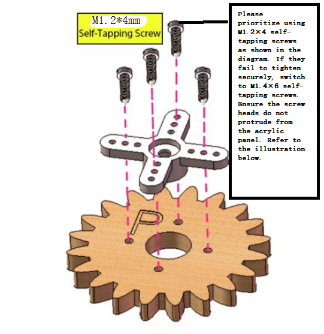

Install M1.4*6MM self-tapping screws as shown below

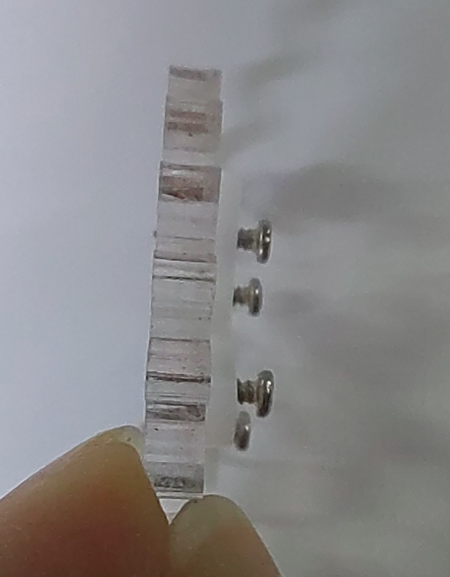

--------------

.. _4.6:

4.6
^^^

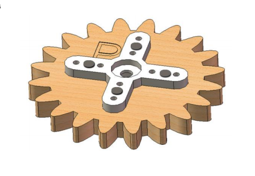

--------------

.. _4.7:

4.7
^^^

.. image:: ./scratch_img/image033.png
   :alt: img

--------------

.. _4.8:

4.8
^^^

Do not turn the gear after it is installed on the servo. If you have
already turned the gear you will need to readjust the servo angle to
180°.

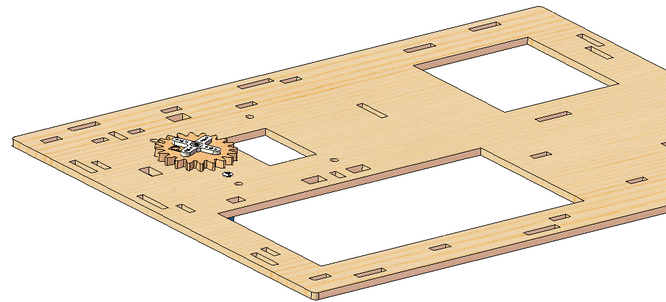

--------------

.. _4.9:

4.9
^^^

**NOTE: When installing the lid of the feeding box, its opening should
be fully closed.**

.. image:: ./scratch_img/image035.png
   :alt: img

--------------

.. _4.10:

4.10
^^^^

.. image:: ./scratch_img/image036.png
   :alt: img

--------------

.. _4.11:

4.11
^^^^

.. image:: ./scratch_img/image037.png
   :alt: img

--------------

.. _4.12:

4.12
^^^^

.. image:: ./scratch_img/image037-1.png
   :alt: img

--------------

.. _4.13-Test-the-door:

4.13 Test the door
^^^^^^^^^^^^^^^^^^

#. Connect Servo to pin IO26 of the ESP32 board. Connect yellow to S,
   red to V, black to G.

.. image:: ./scratch_img/image028-1.png
   :alt: img

2. Connect 6 AA batteries to the DC 7-12V port of ESP32 board.
   (Batteries not included in the kit)

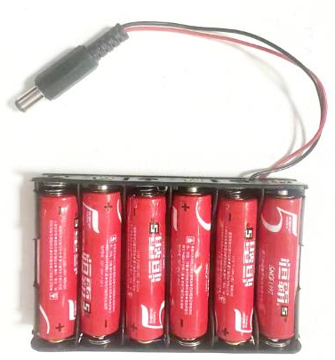

3. Upload the Test code

A. Connect the ESP32 board to the computer with the usb cable. Open the
INO file inside the **6.1Servo.sb3** folder with KidsBlock .

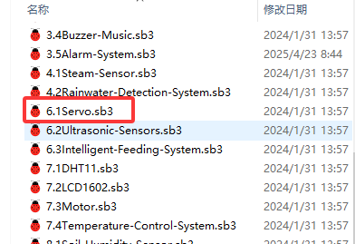

B.Upload code

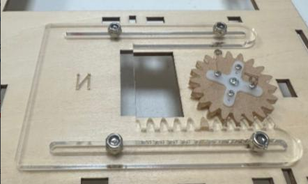

NOTE: After uploading the code, ifthe door cannot be opened and closed
and the servo is hot, please turn offthe powerimmediately.

**check:**

#. Whether the plastic door has good contact and force points with the
   gear structure of the servo.
#. Whether the tip of the fixing screw on the gear structure of the
   servo is stuck with the plastic shell of the servo. If so, please
   loosen the fixing screw a little to prevent its tip from contacting
   the servo.

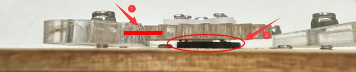

.. _Step-5-Install-the-LCD-display-and-the-DHT11-Sensor:

Step 5 Install the LCD display and the DHT11 Sensor
~~~~~~~~~~~~~~~~~~~~~~~~~~~~~~~~~~~~~~~~~~~~~~~~~~~

--------------

.. _5.1-Required-components:

5.1 Required components
^^^^^^^^^^^^^^^^^^^^^^^

.. image:: ./scratch_img/image038.png
   :alt: img

--------------

.. _5.2:

5.2
^^^

.. image:: ./scratch_img/image039.png
   :alt: img

--------------

.. _5.3:

5.3
^^^

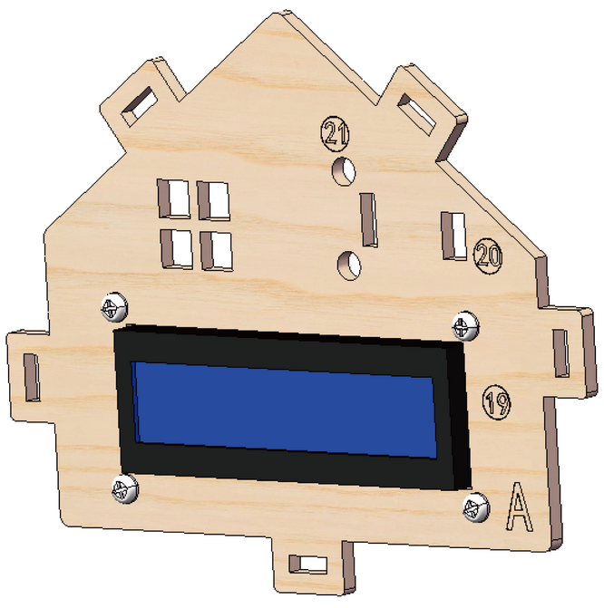

--------------

.. _5.4:

5.4
^^^

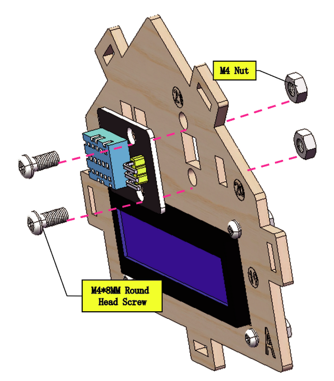

--------------

.. _5.5-Prototype:

5.5 Prototype
^^^^^^^^^^^^^

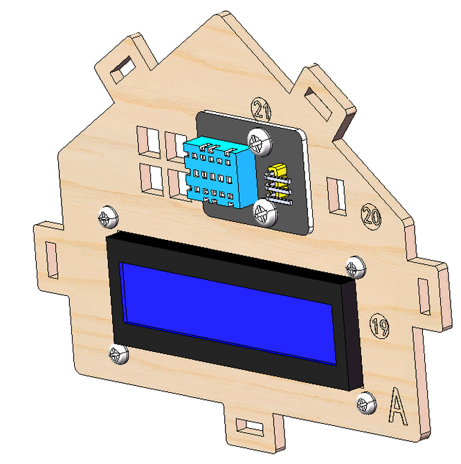

--------------

.. _5.6-Wiring:

5.6 Wiring
^^^^^^^^^^

**Connect modules via Dupont wires.**

.. container:: table-wrapper

   =============================== ===============================
   Module                          Wire
   =============================== ===============================
   Temperature and Humidity Sensor 3PIN 20cm
   LCD 1602                        4PIN **(Black-Red-Blue-Green)**
   =============================== ===============================

**Pay attention to the color of the Dupont wire:**

**For temperature and humidity sensor, connect yellow to S, red to V,
black to G.**

.. image:: ./scratch_img/image043.png
   :alt: img

--------------

.. _5.7:

5.7
^^^

.. container:: table-wrapper

   ======== ===============================
   Module   Wire
   ======== ===============================
   LCD 1602 4PIN **(Black-Red-Blue-Green)**
   ======== ===============================

**For the LCD display, connect green to SCL, blue to SDA, red to VCC,
black to GND.**

.. image:: ./scratch_img/image044.png
   :alt: img

--------------

.. _Step-6-Install-the-Ultrasonic-Module:

Step 6 Install the Ultrasonic Module
~~~~~~~~~~~~~~~~~~~~~~~~~~~~~~~~~~~~

--------------

.. _6.1-Required-components:

6.1 Required components
^^^^^^^^^^^^^^^^^^^^^^^

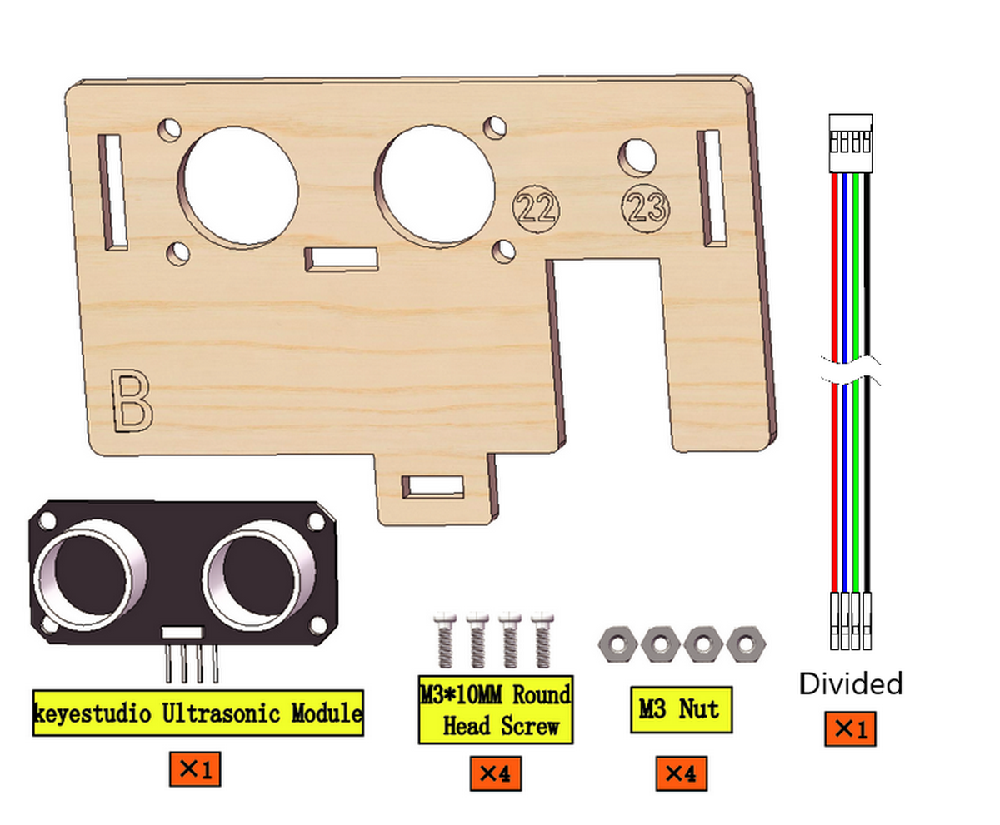

--------------

.. _6.2:

6.2
^^^

.. image:: ./scratch_img/image046.png
   :alt: img

--------------

.. _6.3:

6.3
^^^

.. image:: ./scratch_img/image047.png
   :alt: img

--------------

.. _6.4-Wiring:

6.4 Wiring
^^^^^^^^^^

.. container:: table-wrapper

   ================= ===============================
   Module            Wire
   ================= ===============================
   Ultrasonic module 4PIN **(Black-Green-Blue-Red)**
   ================= ===============================

**Pay attention to the color of the Dupont wire: For the ultrasonic
module, connect blue to TRIG,green to ECHO, red to VCC, black to GND.**

.. image:: ./scratch_img/image048.png
   :alt: img

--------------

.. _Step-7-Install-the-PIR-Motion-Sensor-and-Button-Module:

Step 7 Install the PIR Motion Sensor and Button Module
~~~~~~~~~~~~~~~~~~~~~~~~~~~~~~~~~~~~~~~~~~~~~~~~~~~~~~

--------------

.. _7.1-Required-components:

7.1 Required components
^^^^^^^^^^^^^^^^^^^^^^^

.. image:: ./scratch_img/image049.png
   :alt: img

--------------

.. _7.2:

7.2
^^^

.. image:: ./scratch_img/image050.png
   :alt: img

--------------

.. _7.3:

7.3
^^^

.. image:: ./scratch_img/image051.png
   :alt: img

--------------

.. _7.4-Wiring:

7.4 Wiring
^^^^^^^^^^

**Connect modules via Dupont wires.**

.. container:: table-wrapper

   ================= =========
   Module            Wire
   ================= =========
   PIR Motion Sensor 3PIN 15cm
   Button Module     3PIN 15cm
   ================= =========

**Pay attention to the color of the Dupont wire: Connect yellow to S,
red to V, black to G.**

.. image:: ./scratch_img/image052.png
   :alt: img

--------------

.. _Step-8-Install-the-Walls-of-the-House:

Step 8 Install the Walls of the House
~~~~~~~~~~~~~~~~~~~~~~~~~~~~~~~~~~~~~

--------------

.. _8.1-Required-components:

8.1 Required components
^^^^^^^^^^^^^^^^^^^^^^^

.. image:: ./scratch_img/image053.png
   :alt: img

--------------

.. _8.2:

8.2
^^^

.. image:: ./scratch_img/image054.png
   :alt: img

--------------

.. _8.3:

8.3
^^^

.. image:: ./scratch_img/image055.png
   :alt: img

--------------

.. _8.4:

8.4
^^^

.. image:: ./scratch_img/image056.png
   :alt: img

--------------

.. _8.5:

8.5
^^^

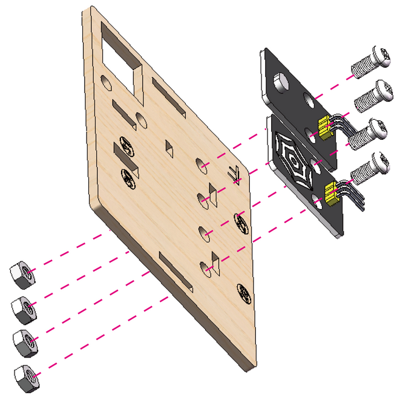

--------------

.. _8.6:

8.6
^^^

.. image:: ./scratch_img/image058.png
   :alt: img

--------------

.. _8.7:

8.7
^^^

.. image:: ./scratch_img/image059.png
   :alt: img

--------------

.. _8.8-Prototype:

8.8 Prototype
^^^^^^^^^^^^^

.. image:: ./scratch_img/image060.png
   :alt: img

--------------

.. _8.9-Wiring:

8.9 Wiring
^^^^^^^^^^

.. container:: table-wrapper

   ============= ===============================
   Module        Wire
   ============= ===============================
   Fan           4PIN **(Black-Red-Blue-Green)**
   Steam Sensor  3PIN 15cm
   Photoresistor 3PIN 15cm
   ============= ===============================

**Pay attention to the color of the Dupont wire: Connect yellow to S,
red to V, black to G, blue to IN+, green to IN-.**

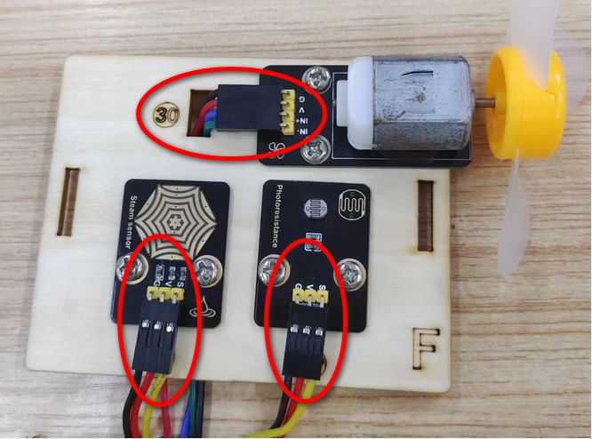

--------------

.. _Step-9-Install-the-Roof-of-the-house:

Step 9 Install the Roof of the house
~~~~~~~~~~~~~~~~~~~~~~~~~~~~~~~~~~~~

--------------

.. _9.1-Required-components:

9.1 Required components
^^^^^^^^^^^^^^^^^^^^^^^

.. image:: ./scratch_img/image062.png
   :alt: img

--------------

.. _9.2:

9.2
^^^

.. image:: ./scratch_img/image063.png
   :alt: img

--------------

.. _9.3:

9.3
^^^

.. image:: ./scratch_img/image064.png
   :alt: img

--------------

.. _9.4-Keep-the-wires-organized:

9.4 Keep the wires organized
^^^^^^^^^^^^^^^^^^^^^^^^^^^^

.. image:: ./scratch_img/image065.png
   :alt: img

--------------

.. _Step-10-Install-the-House-and-Ground:

Step 10 Install the House and Ground
~~~~~~~~~~~~~~~~~~~~~~~~~~~~~~~~~~~~

.. _10.1-Required-components:

10.1 Required components
^^^^^^^^^^^^^^^^^^^^^^^^

.. image:: ./scratch_img/image066.png
   :alt: img

--------------

.. _10.2:

10.2
^^^^

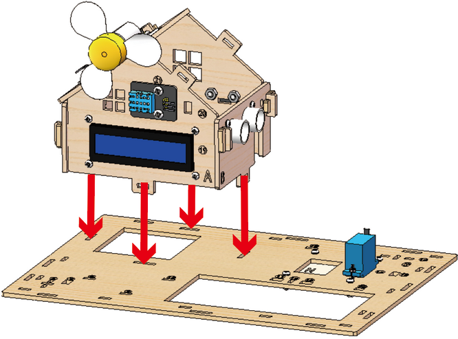

--------------

.. _10.3:

10.3
^^^^

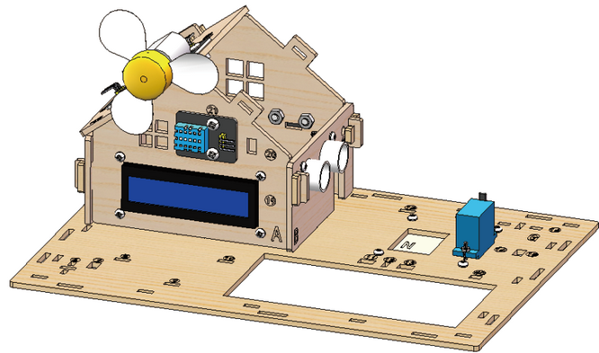

--------------

.. _10.4-Bottom-View:

10.4 Bottom View
^^^^^^^^^^^^^^^^

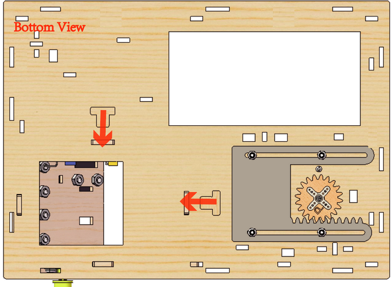

--------------

.. _10.5:

10.5
^^^^

.. image:: ./scratch_img/image070.png
   :alt: img

--------------

.. _10.6-Arrange-the-wires:

10.6 Arrange the wires
^^^^^^^^^^^^^^^^^^^^^^

.. image:: ./scratch_img/image071.png
   :alt: img

--------------

.. _10.7:

10.7
^^^^

.. image:: ./scratch_img/image072.png
   :alt: img

--------------

.. _Step-11-Wiring-the-House:

Step 11 Wiring the House
~~~~~~~~~~~~~~~~~~~~~~~~

--------------

.. _11.1:

11.1
^^^^

**Pay attention to the color of the Dupont wire: Connect yellow to S,
red to V, black to G.**

.. container:: table-wrapper

   +-----+-------------------+-------------------+-------------------+
   | NO. | Components        | Wires             | ESP32 Board Pins  |
   +=====+===================+===================+===================+
   | 1   | Fan               | 4pin, **Divided** | io18(IN-) \|      |
   |     |                   | Bla               | io19(IN+)         |
   |     |                   | ck-Red-Blue-Green |                   |
   +-----+-------------------+-------------------+-------------------+
   | 2   | PIR Motion Sensor | 3pin 15cm         | io23              |
   +-----+-------------------+-------------------+-------------------+
   | 3   | Button            | 3pin 15cm         | io5               |
   +-----+-------------------+-------------------+-------------------+
   | 4   | Ultrasonic Module | 4                 | D12(TRIG)         |
   |     |                   | pin,\ **Divided** | D13(ECHO)         |
   |     |                   | Bla               |                   |
   |     |                   | ck-Green-Blue-Red |                   |
   +-----+-------------------+-------------------+-------------------+
   | 5   | LCD 1602          | 4pin,             | I2C               |
   |     |                   | **Connected**     |                   |
   +-----+-------------------+-------------------+-------------------+
   | 6   | Temperature and   | 3pin 20cm         | io17              |
   |     | Humidity Sensor   |                   |                   |
   +-----+-------------------+-------------------+-------------------+
   | 7   | Steam Sensor      | 3pin 15cm         | io35              |
   +-----+-------------------+-------------------+-------------------+
   | 8   | Photoresistor     | 3pin 15cm         | io34              |
   +-----+-------------------+-------------------+-------------------+
   | 9   | Servo             | --                | io26              |
   +-----+-------------------+-------------------+-------------------+
   | 10  | Buzzer            | 3pin 20cm         | io16              |
   +-----+-------------------+-------------------+-------------------+
   | 11  | LED               | 3pin 20cm         | io27              |
   +-----+-------------------+-------------------+-------------------+
   | 12  | Water Level       | 3pin 25cm         | io33              |
   |     | Sensor            |                   |                   |
   +-----+-------------------+-------------------+-------------------+
   | 13  | Soil Humidity     | 3pin 20cm         | io32              |
   |     | Sensor            |                   |                   |
   +-----+-------------------+-------------------+-------------------+
   | 14  | Water Pump        | 3pin 20cm         | io25              |
   +-----+-------------------+-------------------+-------------------+

.. _11.2-Fan:

11.2 Fan
^^^^^^^^

Pass the Dupont wire connected to the fan through the hole **marked 30**
on the wooden board.

.. container:: table-wrapper

   +------------+---------------------------+----------------------+
   | Components | Wire                      | ESP32 Board Pins     |
   +============+===========================+======================+
   | Fan        | 4PIN **Divided**          | io18(IN-), io19(IN+) |
   |            | *                         |                      |
   |            | *(Black-Red-Blue-Green)** |                      |
   +------------+---------------------------+----------------------+

.. container:: table-wrapper

   ========== ==========
   Module Pin Wire Color
   ========== ==========
   IN-        GREEN
   IN+        BLUE
   V          RED
   G          BLACK
   ========== ==========

.. image:: ./scratch_img/image073.png
   :alt: img

--------------

.. _11.3-PIR-Motion-Sensor:

11.3 PIR Motion Sensor
^^^^^^^^^^^^^^^^^^^^^^

Pass the Dupont wire connected to the PIR motion sensor through the hole
marked 24 on the wooden board.

.. container:: table-wrapper

   ================= ========= ===============
   Component         Wire      ESP32 Board Pin
   ================= ========= ===============
   PIR Motion Sensor 3PIN 15cm io23
   ================= ========= ===============

**Connect red to V, black to G, yellow to S.**

.. container:: table-wrapper

   ========== ========== ===============
   Module Pin Wire Color ESP32 Board Pin
   ========== ========== ===============
   V          RED        V
   G          BLACK      G
   S          YELLOW     io23
   ========== ========== ===============

.. image:: ./scratch_img/image074.png
   :alt: img

--------------

.. _11.4-Button-Module:

11.4 Button Module
^^^^^^^^^^^^^^^^^^

Pass the Dupont wire connected to the button module through the hole
marked 25 on the wooden board.

.. container:: table-wrapper

   ========= ========= ===============
   Component Wire      ESP32 Board Pin
   ========= ========= ===============
   Button    3PIN 15cm io5
   ========= ========= ===============

**Connect red to V, black to G, yellow to S.**

.. container:: table-wrapper

   ========== ========== ===============
   Module Pin Wire Color ESP32 Board Pin
   ========== ========== ===============
   V          RED        V
   G          BLACK      G
   S          YELLOW     io5
   ========== ========== ===============

.. image:: ./scratch_img/image075.png
   :alt: img

--------------

.. _11.5-Ultrasonic-Module:

11.5 Ultrasonic Module
^^^^^^^^^^^^^^^^^^^^^^

.. container:: table-wrapper

   +-------------------+-----------------------+-----------------------+
   | Component         | Wire                  | ESP32 Board Pins      |
   +===================+=======================+=======================+
   | Ultrasonic Module | 4PIN **Divided**      | io13(ECHO),           |
   |                   | (                     | io12(TRIG)            |
   |                   | Black-Green-Blue-Red) |                       |
   +-------------------+-----------------------+-----------------------+

**Connect red to V, black to G, blue to io12, green to io13.**

.. container:: table-wrapper

   ========== ========== ===============
   Module Pin Wire Color ESP32 Board Pin
   ========== ========== ===============
   V          RED        V (io12)
   G          BLACK      G (io12)
   ECHO       GREEN      io13
   TRIG       BLUE       io12
   ========== ========== ===============

.. image:: ./scratch_img/image076.png
   :alt: img

--------------

.. _11.6-LCD-1602:

11.6 LCD 1602
^^^^^^^^^^^^^

.. container:: table-wrapper

   ========= ============================================= ================
   Component Wire                                          ESP32 Board Pins
   ========= ============================================= ================
   LCD1602   4PIN **Connected** **(Black-Red-Blue-Green)** I2C
   ========= ============================================= ================

**Connect red to V, black to G, blue to SDA, green to SCL.**

.. container:: table-wrapper

   ========== ========== ===============
   Module Pin Wire Color ESP32 Board Pin
   ========== ========== ===============
   V          RED        V
   G          BLACK      G
   SCL        GREEN      SCL
   SDA        BLUE       SDA
   ========== ========== ===============

.. image:: ./scratch_img/image077.png
   :alt: img

--------------

.. _11.7-Temperature-and-Humidity-Sensor:

11.7 Temperature and Humidity Sensor
^^^^^^^^^^^^^^^^^^^^^^^^^^^^^^^^^^^^

Pass the Dupont wire connected to the button module through the hole
marked 20 on the wooden board.

.. container:: table-wrapper

   =============================== ========= ================
   Component                       Wire      ESP32 Board Pins
   =============================== ========= ================
   Temperature and Humidity Sensor 3PIN 20cm io17
   =============================== ========= ================

**Connect red to V, black to G, yellow to io17.**

.. container:: table-wrapper

   ========== ========== ===============
   Module Pin Wire Color ESP32 Board Pin
   ========== ========== ===============
   V          RED        V
   G          BLACK      G
   S          YELLOW     io17
   ========== ========== ===============

.. image:: ./scratch_img/image078.png
   :alt: img

--------------

.. _11.8-Steam-Sensor:

11.8 Steam Sensor
^^^^^^^^^^^^^^^^^

.. container:: table-wrapper

   ============ ========= ===============
   Component    Wire      ESP32 Board Pin
   ============ ========= ===============
   Steam Sensor 3PIN 15cm io35
   ============ ========= ===============

**Connect red to V, black to G, yellow to io35.**

.. container:: table-wrapper

   ========== ========== ===============
   Module Pin Wire Color ESP32 Board Pin
   ========== ========== ===============
   V          RED        V
   G          BLACK      G
   S          YELLOW     io35
   ========== ========== ===============

.. image:: ./scratch_img/image079.png
   :alt: img

--------------

.. _11.9-Photoresistor:

11.9 Photoresistor
^^^^^^^^^^^^^^^^^^

.. container:: table-wrapper

   ============= ========= ===============
   Component     Wire      ESP32 Board Pin
   ============= ========= ===============
   Photoresistor 3PIN 15cm io34
   ============= ========= ===============

**Connect red to V, black to G, yellow to io34.**

.. container:: table-wrapper

   ========== ========== ===============
   Module Pin Wire Color ESP32 Board Pin
   ========== ========== ===============
   V          RED        V
   G          BLACK      G
   S          YELLOW     io34
   ========== ========== ===============

.. image:: ./scratch_img/image080.png
   :alt: img

--------------

.. _11.10-Servo:

11.10 Servo
^^^^^^^^^^^

**Pass the wire of Servo through the Hole 15, and then connect it to
ESP32 board.**

.. container:: table-wrapper

   ========= ==== ===============
   Component Wire ESP32 Board Pin
   ========= ==== ===============
   Servo     3PIN io26
   ========= ==== ===============

**Connect red to V, black to G, yellow to io26.**

.. container:: table-wrapper

   ========= ==========
   Board Pin Wire Color
   ========= ==========
   V         RED
   G         BLACK
   IO26      YELLOW
   ========= ==========

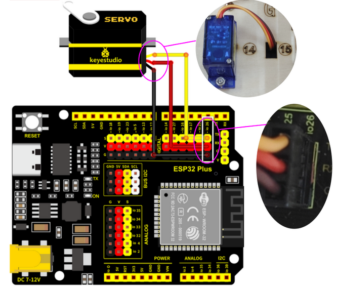

--------------

.. _11.11-Buzzer:

11.11 Buzzer
^^^^^^^^^^^^

**Pass the wire of Buzzer through the Hole 17, and then connect it to
ESP32 board.**

.. container:: table-wrapper

   ========= ========= ===============
   Component Wire      ESP32 Board Pin
   ========= ========= ===============
   Buzzer    3PIN 20cm io16
   ========= ========= ===============

**Connect red to V, black to G, yellow to io16.**

.. container:: table-wrapper

   ========== ========== ===============
   Module Pin Wire Color ESP32 Board Pin
   ========== ========== ===============
   V          RED        V
   G          BLACK      G
   S          YELLOW     io16
   ========== ========== ===============

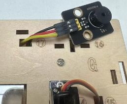

.. image:: ./scratch_img/image082.png
   :alt: img

--------------

.. _11.12-LED:

11.12 LED
^^^^^^^^^

**Pass the wire of LED through the Hole 7, and then connect it to ESP32
board.**

.. container:: table-wrapper

   ========= ========= ===============
   Component Wire      ESP32 Board Pin
   ========= ========= ===============
   LED       3PIN 20cm io27
   ========= ========= ===============

**Connect red to V, black to G, yellow to io27.**

.. container:: table-wrapper

   ========== ========== ===============
   Module Pin Wire Color ESP32 Board Pin
   ========== ========== ===============
   V          RED        V
   G          BLACK      G
   S          YELLOW     io27
   ========== ========== ===============

.. image:: ./scratch_img/image083.png
   :alt: img

--------------

.. _11.13-Water-Lever-Sensor:

11.13 Water Lever Sensor
^^^^^^^^^^^^^^^^^^^^^^^^

**Pass the wire of water level sensor through the Hole 13, and then
connect it to ESP32 board.**

.. container:: table-wrapper

   ================== ========= ===============
   Component          Wire      ESP32 Board Pin
   ================== ========= ===============
   Water Lever Sensor 3PIN 25cm io33
   ================== ========= ===============

**Connect red to V, black to G, yellow to io33.**

.. container:: table-wrapper

   ========== ========== ===============
   Module Pin Wire Color ESP32 Board Pin
   ========== ========== ===============
   V          RED        V
   G          BLACK      G
   S          YELLOW     io33
   ========== ========== ===============

.. image:: ./scratch_img/image084.png
   :alt: img

--------------

.. _11.14-Soil-Humidity-Sensor:

11.14 Soil Humidity Sensor
^^^^^^^^^^^^^^^^^^^^^^^^^^

**Pass the wire of soil humidity sensor through the Hole 11, and then
connect it to ESP32 board.**

.. container:: table-wrapper

   ==================== ========= ===============
   Component            Wire      ESP32 Board Pin
   ==================== ========= ===============
   Soil Humidity Sensor 3PIN 20cm io32
   ==================== ========= ===============

**Connect red to V, black to G, yellow to io32.**

.. container:: table-wrapper

   ========== ========== ===============
   Module Pin Wire Color ESP32 Board Pin
   ========== ========== ===============
   V          RED        V
   G          BLACK      G
   S          YELLOW     io32
   ========== ========== ===============

.. image:: ./scratch_img/image085.png
   :alt: img

--------------

.. _11.15-Relay-Module:

11.15 Relay Module
^^^^^^^^^^^^^^^^^^

.. container:: table-wrapper

   ============ ==== ===============
   Component    Wire ESP32 Board Pin
   ============ ==== ===============
   Relay Module 3PIN io25
   ============ ==== ===============

.. container:: table-wrapper

   ========== ========== ===============
   Module Pin Wire Color ESP32 Board Pin
   ========== ========== ===============
   V          RED        V
   G          BLACK      G
   S          YELLOW     io25
   ========== ========== ===============

**Pass the wire of Water Pump through the Hole 11 in the way as shown
below:**

.. image:: ./scratch_img/image086.png
   :alt: img

The red wire of the water pump is connected to the middle terminal of
the relay module, and the black wire is connected to the GND of the
ESP32 board.

In addition, you need to use a Dupont wire to connect the left terminal
of the relay module to the 3.3V of the ESP32.

.. image:: ./scratch_img/image087.png
   :alt: img

--------------

.. _11.16:

11.16
^^^^^

.. image:: ./scratch_img/image088.png
   :alt: img

--------------

Insert the male terminal of the Dupont wire into the female terminal of
the relay module and tighten it with a screwdriver.

.. image:: ./scratch_img/image-20250417093737686.png
   :alt: image-20250417093737686

After the above steps, note that all the wiring has been finished. And
wires of the LED, water level sensor, soil humidity sensor, buzzer and
relay water pump have respectively passed through the holes of 7, 11,
13, 17 and 40 carved on the basswood board, preparing for the subsequent
installation.

.. image:: ./scratch_img/354e13bf130d878628f1361fdd37b997.png
   :alt: 354e13bf130d878628f1361fdd37b997

.. _Step-12-Install-the-house-and-foundation:

Step 12 Install the house and foundation
~~~~~~~~~~~~~~~~~~~~~~~~~~~~~~~~~~~~~~~~

--------------

.. _12.1-Required-components:

12.1 Required components
^^^^^^^^^^^^^^^^^^^^^^^^

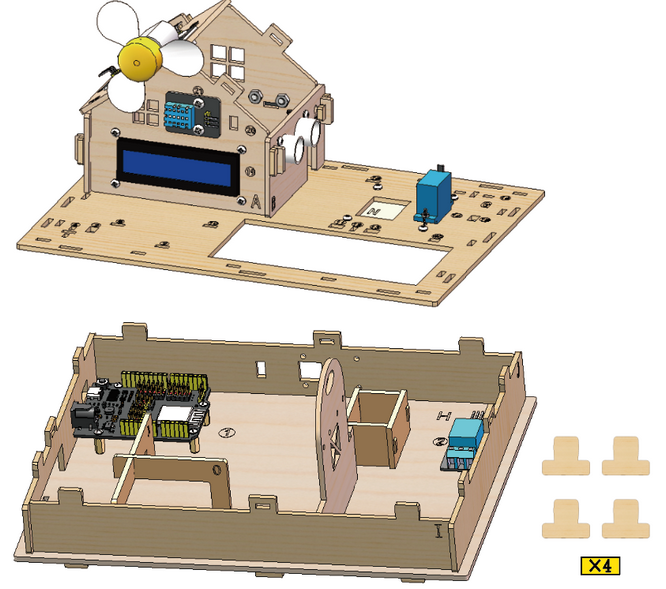

--------------

.. _12.2:

12.2
^^^^

.. image:: ./scratch_img/image090.png
   :alt: img

--------------

.. _12.3:

12.3
^^^^

.. image:: ./scratch_img/image091.png
   :alt: img

--------------

.. _12.4:

12.4
^^^^

.. image:: ./scratch_img/image092.png
   :alt: img

--------------

.. _12.5:

12.5
^^^^

.. image:: ./scratch_img/image093.png
   :alt: img

--------------

.. _Step-13-Install-the-Plastic-Sinks:

Step 13 Install the Plastic Sinks
~~~~~~~~~~~~~~~~~~~~~~~~~~~~~~~~~

--------------

.. _13.1-Required-components:

13.1 Required components
^^^^^^^^^^^^^^^^^^^^^^^^

.. image:: ./scratch_img/image094.png
   :alt: img

--------------

.. _13.2:

13.2
^^^^

.. image:: ./scratch_img/image095.png
   :alt: img

--------------

.. _13.3:

13.3
^^^^

.. image:: ./scratch_img/image096.png
   :alt: img

--------------

.. _Step-14-Install-the-soil-module-and-water-level-module:

Step 14 Install the soil module and water level module
~~~~~~~~~~~~~~~~~~~~~~~~~~~~~~~~~~~~~~~~~~~~~~~~~~~~~~

--------------

.. _14.1-Required-components:

14.1 Required components
^^^^^^^^^^^^^^^^^^^^^^^^

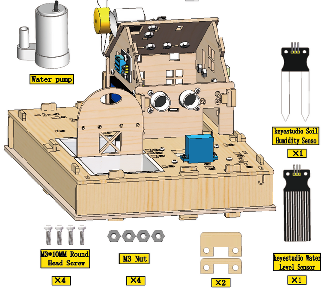

--------------

.. _14.2:

14.2
^^^^

.. image:: ./scratch_img/image099.png
   :alt: img

--------------

.. _14.3:

14.3
^^^^

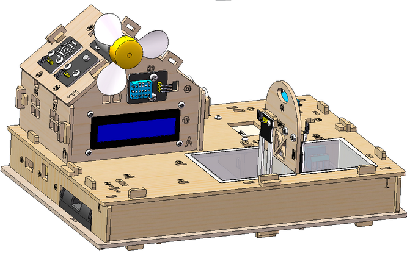

--------------

.. _14.4:

14.4
^^^^

.. image:: ./scratch_img/image-20230718085623979.png
   :alt: image-20230718085623979

--------------

.. _14.5:

14.5
^^^^

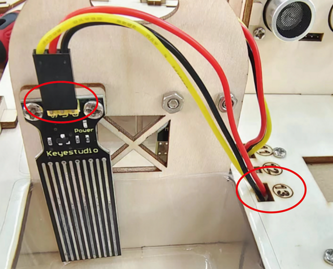

--------------

.. _14.6:

14.6
^^^^

.. image:: ./scratch_img/image-20230718085722378.png
   :alt: image-20230718085722378

--------------

.. _14.7:

14.7
^^^^

.. image:: ./scratch_img/image-20230718085743776.png
   :alt: image-20230718085743776

--------------

.. _Step-15-Install-fence:

Step 15 Install fence
~~~~~~~~~~~~~~~~~~~~~

--------------

.. _15.1-Required-components:

15.1 Required components
^^^^^^^^^^^^^^^^^^^^^^^^

.. image:: ./scratch_img/image-20230718085854136.png
   :alt: image-20230718085854136

--------------

.. _15.2:

15.2
^^^^

.. image:: ./scratch_img/image-20230718085921988.png
   :alt: image-20230718085921988

--------------

.. _15.3:

15.3
^^^^

.. image:: ./scratch_img/image-20230718085936256.png
   :alt: image-20230718085936256

--------------

.. _15.4:

15.4
^^^^

.. image:: ./scratch_img/image-20230718085954487.png
   :alt: image-20230718085954487

--------------

.. _Step-16-Install-the-Buzzer-and-the-Led-Module:

Step 16 Install the Buzzer and the Led Module
~~~~~~~~~~~~~~~~~~~~~~~~~~~~~~~~~~~~~~~~~~~~~

--------------

.. _16.1-Required-components:

16.1 Required components
^^^^^^^^^^^^^^^^^^^^^^^^

.. image:: ./scratch_img/image-20230718090031524.png
   :alt: image-20230718090031524

--------------

.. _16.2:

16.2
^^^^

.. image:: ./scratch_img/image-20230718090057124.png
   :alt: image-20230718090057124

--------------

.. _16.3:

16.3
^^^^

.. image:: ./scratch_img/image-20230718090110113.png
   :alt: image-20230718090110113

--------------

.. _16.4:

16.4
^^^^

.. image:: ./scratch_img/image-20230718090127577.png
   :alt: image-20230718090127577

--------------

.. _Step-17-Decorate-the-House:

Step 17 Decorate the House
~~~~~~~~~~~~~~~~~~~~~~~~~~

--------------

.. _17.1-Required-components:

17.1 Required components
^^^^^^^^^^^^^^^^^^^^^^^^

.. image:: ./scratch_img/image-20230718090150918.png
   :alt: image-20230718090150918

--------------

.. _17.2:

17.2
^^^^

.. image:: ./scratch_img/image-20230718090215504.png
   :alt: image-20230718090215504

--------------

.. _17.3:

17.3
^^^^

.. image:: ./scratch_img/image-20230718090227072.png
   :alt: image-20230718090227072

--------------

.. _Step-18-Install-Solar-Panel:

Step 18 Install Solar Panel
~~~~~~~~~~~~~~~~~~~~~~~~~~~

--------------

.. _18.1:

18.1
^^^^

.. image:: ./scratch_img/image128.png
   :alt: img

--------------

.. _18.2:

18.2
^^^^

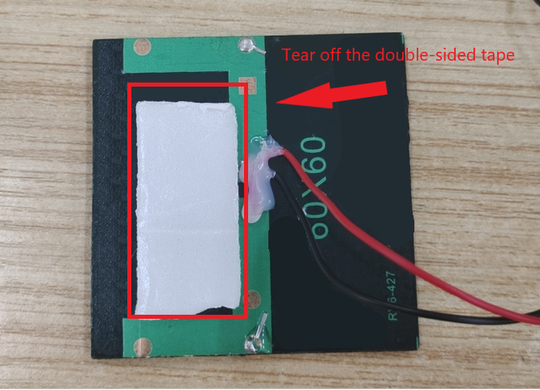

--------------

.. _18.3:

18.3
^^^^

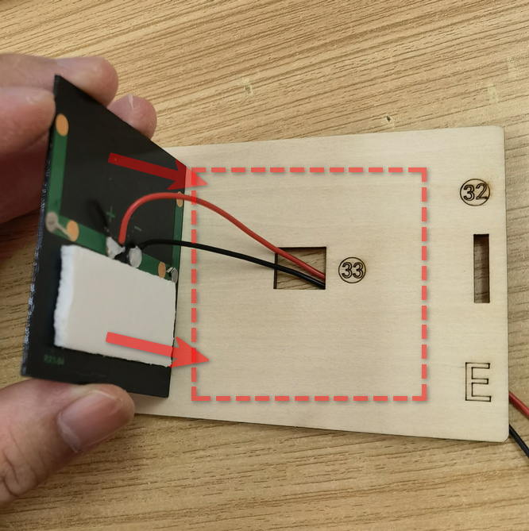

--------------

.. _18.4:

18.4
^^^^

.. image:: ./scratch_img/image131.png
   :alt: img

--------------

.. _18.5:

18.5
^^^^

Install the LED light of the solar panel into this hole.

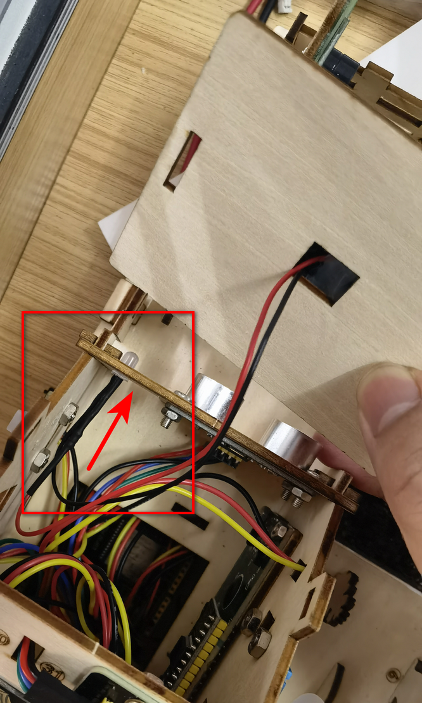

--------------

.. _18.6:

18.6
^^^^

Use a sticker to secure its wires to the wall

.. image:: ./scratch_img/image131-1.png
   :alt: img

--------------

.. _18.7:

18.7
^^^^

.. image:: ./scratch_img/image132-1.png
   :alt: img

--------------

.. _18.8:

18.8
^^^^

.. image:: ./scratch_img/image133.png
   :alt: img

--------------

.. _18.9:

18.9
^^^^

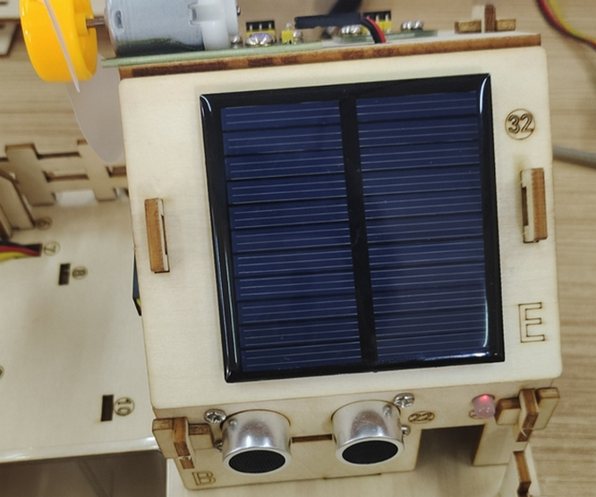

--------------

.. _18.10:

18.10
^^^^^

.. image:: ./scratch_img/image-20230718091556561.png
   :alt: image-20230718091556561

--------------

.. _Step-19-Install-Battery-Case:

Step 19 Install Battery Case
~~~~~~~~~~~~~~~~~~~~~~~~~~~~

--------------

.. _19.1:

19.1
^^^^

.. image:: ./scratch_img/image-20230718091623881.png
   :alt: image-20230718091623881

--------------

.. _19.2:

19.2
^^^^

Install 6 AA batteries（Not included in the kit）

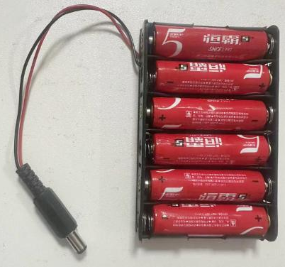

.. image:: ./scratch_img/image-20230718091649546.png
   :alt: image-20230718091649546

--------------

.. _19.3:

19.3
^^^^

.. image:: ./scratch_img/image-20230718091701966.png
   :alt: image-20230718091701966

--------------

--------------

.. _4.-Projects:

4. Projects
-----------

.. _4.1-Project-:-Lighting-System:

4.1 Project : Lighting System
~~~~~~~~~~~~~~~~~~~~~~~~~~~~~

**Let's start our first project, lighting system.**

--------------

Lighting up an LED is one of the most fundamental Arduino practice.

This start-up lesson is designed for beginners to understand hardware
and software programming on ESP32 development board and to master basic
circuit and programming knowledge.

.. image:: ./scratch_img/cout1.png
   :alt: img

Therefore, our tutorial guidance is simple. And this intriguing project
can be applied in actual scenarios at home or in office.

In this project, you will have learned the basic connections and
settings of the ESP32 development board in the Arduino programming.
What's more, some functions will also be presented for you, such as
lighting on/off an LED via the output level of a digital pin or by a
button.

All in all, this is an entry-level tutorial to lay the foundation for
subsequent Arduino practices.

--------------

.. _4.1.1-Flow-Diagram:

4.1.1 Flow Diagram
^^^^^^^^^^^^^^^^^^

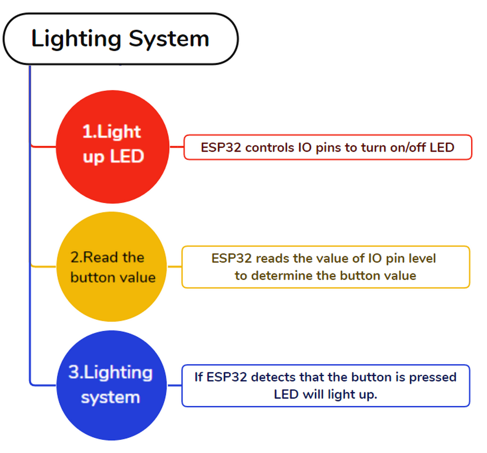

--------------

.. _4.1.2-Light-up-an-LED:

4.1.2 Light up an LED
^^^^^^^^^^^^^^^^^^^^^

**Description:**

LED, short for Light Emitting Diode, is a solid-state semiconductor that
converts electrical energy into visible light, so it is also called
solid-state lighting.

When current passes through an LED, it light up.

**Various LED:**

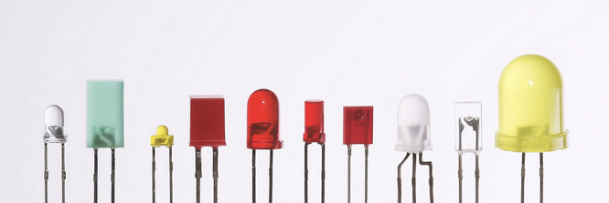

--------------

**LED module** is a device to output, whose brightness and blinks can be
controlled. For how to use, you only need to directly plug it into
digital output pins on the development board.

.. image:: ./scratch_img/cou12.png
   :alt: img

--------------

**Working principle:**

When S is at a high level, Q1 triode is into conduction, and VCC voltage
passes through LED to light up it.

.. image:: ./scratch_img/couy1.png
   :alt: img

**Parameters:**

-  Voltage: 3~5V
-  Current: ≤1.5mA
-  Power: 0.07W

--------------

**Wiring Diagram:**

**Connect the LED module to io27.**

**Attention: Connect yellow to S(Signal), red to V(Power), and black to
GND. Do not reverse them!**

.. image:: ./scratch_img/couj1.png
   :alt: img

--------------

**Test Code:**

-  Open Kidsblock and choose the correct device and port.

   .. image:: ./scratch_img/st1.png
      :alt: img

-  Drag |image19| from |image20| to the code editing area. Code Blocks
   execute only when they are in this area.

   .. image:: ./scratch_img/st12.png
      :alt: img

-  With this block, when booting the development board, code will run.

   .. image:: ./scratch_img/st11.png
      :alt: img

-  In |image21|, drag “\ **forever**\ ” and paste it below the previous
   block. Block “\ **forever**\ ” indicates a loop.

   .. image:: ./scratch_img/st20.png
      :alt: img

-  Drag an "**LED pin output**" block from |image22| and paste it in
   “\ **forever**\ ”. Set the pin to IO27 and output level to HIGH, so
   that the LED pin will continue to output high level.

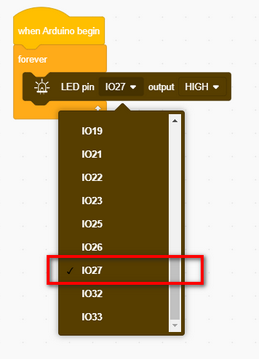

.. image:: ./scratch_img/st22-1.png
   :alt: img

-  Add a 1s delay. Duplicate the "**LED pin output**" block but set the
   output to LOW, and also add a delay. Then LED will light up and go
   off in circulation.

   .. image:: ./scratch_img/st22.png
      :alt: img

**Test Result:**

LED blinks per second, because io27 on ESP32 board outputs high and low
level alternatively every second. Besides, various interactive
applications can also be realized via an LED, like breathing LED, water
flow lights and flashing police light.

.. container:: table-wrapper

   =========== =======
   Power Level Result
   =========== =======
   HIGH        LED on
   LOW         LED off
   =========== =======

--------------

**Expansion: Breathing LED**

**Description:**

IO interfaces of MCU (arduino UNO, ESP32 and Raspberry Pi Pico) output
only digital signals (high or low level). For instance, in previous
experiment (light up an LED), the digital outputs are only HIGH(3.3V)
and LOW(0V).

If MCU outputs a high level of 3.3V or a low level of 0V, the input
voltage should be at 0~3.3V. Thus, PWM (**Pulse Width Modulation**) is
needed to output different voltage value, which is called "analog
output".

--------------

**Knowledge:**

What is PWM?

PWM contains three elements: Frequency(Hz), Period, Duty Cycle(%).

-  **PWM Frequency (f):** the times of signal changing from high to low
   and return to high within one second. Generally speaking, Frequency
   is the number of PWM Period in a second.

-  **PWM Period (T):** Period = 1 / Frequency (T=1/f, and 1 means 1
   second). For instance: f = 50Hz, so T = 20ms, which implies there are
   50 times of Period per second.

-  **PWM Duty Cycle:** the time ratio of HIGH to the whole Period. If
   Period = 10ms and 8ms is pulse width time, Low level occupies 2ms, so
   the Duty Cycle = 8/(8+2) = 80%.

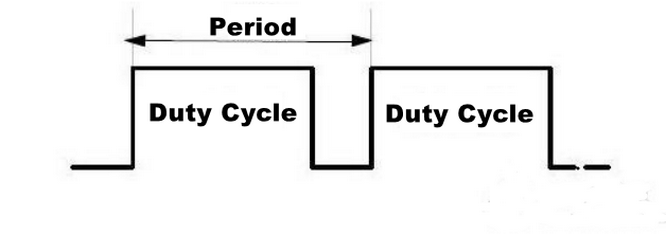

**Conclusion: At an appropriate signal frequency, PWM changes effective
output voltage by changing the duty cycle in one period.** In plain
English, within a specified time, the more high level the IO port
outputs, the greater PWM value is, and the lighter LED will be.

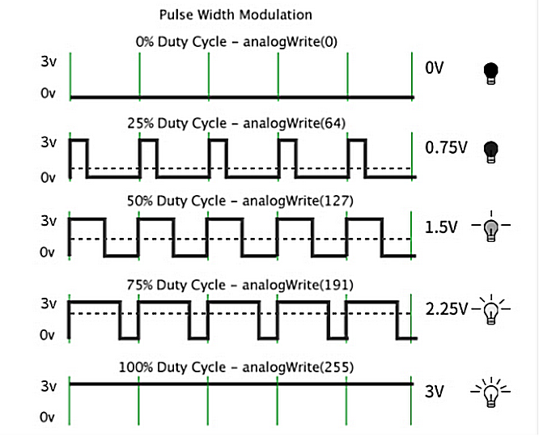

**Test Code:**

.. image:: ./scratch_img/st23.png
   :alt: img

-  Define a variable **item** and assign it to 0.

   .. image:: ./scratch_img/st25.png
      :alt: img

-  Drag a "**forever**" block and paste a "**repeat**" block in it. Set
   repeat times to 255.

   .. image:: ./scratch_img/st26.png
      :alt: img

-  Drag a "**variable mode**" block in "**repeat**" and set the mode to
   “\ **++**\ ”, which means **item** will increase 1 after each
   execution.

   .. image:: ./scratch_img/st27.png
      :alt: img

-  Find the block to set PWM which is contained in |image23| as shown
   below, so you only need to set corresponding pin and analog value to
   output PWM.

   .. image:: ./scratch_img/st28.png
      :alt: img

   -  Set LED pin:

      .. image:: ./scratch_img/st29.png
         :alt: img

   -  Set channel: (16 channels in total: including 0~15)

      .. image:: ./scratch_img/st30.png
         :alt: img

   -  Set PWM output value to **item**, which will automatically add 1
      from 0 to 255. **PWM output is 0~255, so we set the repeat times
      to 255.**

      .. image:: ./scratch_img/st31.png
         :alt: img

-  Add a delay to 0.01s, so that LED will light up gradually rather than
   all of a sudden.

   .. image:: ./scratch_img/st32.png
      :alt: img

-  Duplicate the "**repeat**" block as follows, but set mode to
   "**－－**", which decreases variable **item** each time. And LED will
   dim gradually.

   .. image:: ./scratch_img/st33.png
      :alt: img

**Test Result**

LED lights up and dims gradually; it breathes evenly.

.. image:: ./scratch_img/st34.gif
   :alt: img

--------------

.. _4.1.4-A-Button:

4.1.4 A Button
^^^^^^^^^^^^^^

**Description**

**Button Module** is a device to input. MCU reads its power level to
detect whether the button is pressed.

.. image:: ./scratch_img/cou13.png
   :alt: img

--------------

**Schematic Diagram:**

.. image:: ./scratch_img/couy12.png
   :alt: img

**Parameters:**

-  Voltage: 3~5V
-  Current: ≤1.1mA
-  Power: ≤5.5mW

--------------

**The principle of the button module is a circuit controlled by this
button.**

-  **When the button is pressed**, the circuit is in closed state so
   that current passes through the button to GND, which causes the
   digital input pin to detect a low level.
-  **When the button is released**, the circuit is cut and pin level
   increases due to a pull-up resistor, which makes the digital pin to
   detect a high level.

--------------

**Wiring Diagram:**

**Connect the button module to io5**

**Attention: Connect yellow to S(Signal), red to V(Power), and black to
GND. Do not reverse them!**

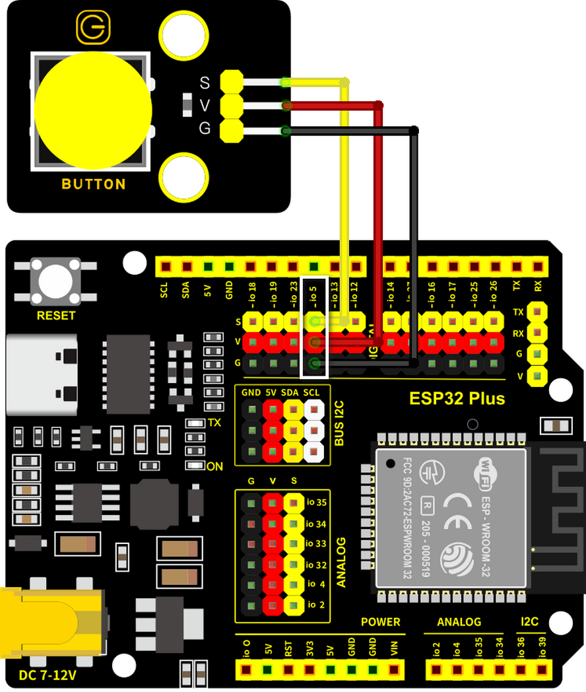

--------------

**Test Code**

-  Initialize the serial port first of all, and set baud rate to 115200.

   .. image:: ./scratch_img/st36.png
      :alt: img

-  Set pin to IO5 and mode to input. What follows it is a "**forever**"
   block.

   .. image:: ./scratch_img/st37.png
      :alt: img

-  Read the power level of digital pin 5. If it is 1, print 1. Or else,
   print 0.

   .. image:: ./scratch_img/st38.png
      :alt: img

Complete code:

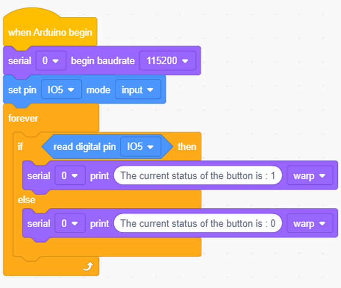

**Test Result**

Open serial monitor and set the corresponding baud rate.

When the button is released, the value is 1; if you press the button, it
becomes 0.

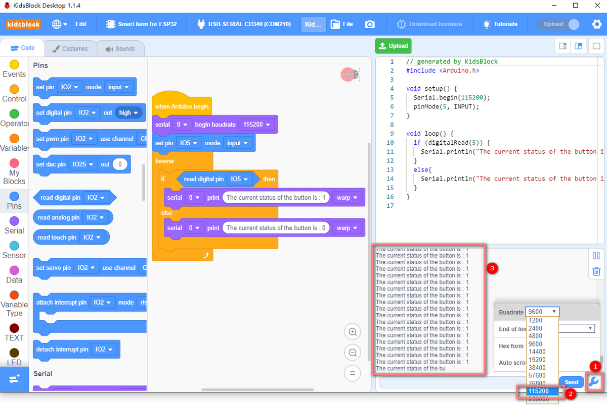

In KidsBlock, we can read the state of the digital input pin by
programming to detect whether the button is pressed. Thus, loads of
interactive applications can be realized via a button module, such as
LED on/off and display brightness adjustment.

--------------

**Expansion: Auto-locking Button**

An auto-locking button won't pop up when you press it without holding,
and it never pops up unless you press it again. It works like a switch.
For regular buttons, such function can be realized via MCU and software.

**Test Code**

-  Define two variables: **item** as the read button value and
   **button** as the value shifted by button.

   .. image:: ./scratch_img/st40.png
      :alt: img

-  Assign the read button value to **item**.

   .. image:: ./scratch_img/st41.png
      :alt: img

-  Determine whether the button is pressed. If it is, shift the value of
   **button** and print it.

   .. image:: ./scratch_img/st43.png
      :alt: img

   -  Delay 0.01s to eliminate the button jitter.

      -  If a close state is detected at the button, a delay will be
         executed to eliminate **Front Porch Jitter**. Generally, the
         delay is within 5ms～10ms (Mechanical properties decide). After
         the jitter disappears, check the button state again. If the
         closed state level is still maintained, it is confirmed that
         there is a button pressed.
      -  When a released button is detected, a delay of 5ms～10ms also
         should happen to remove the **Back Porch Jitter**, so that the
         program for the button can be executed.

-  When the button is pressed, **button** equals 1. Press it again,
   **button** shifts to 0, alternatively.

Complete code:

.. image:: ./scratch_img/st44.png
   :alt: img

**Test Result**

Upload code and open the serial monitor.

When you press the button once, 1 will be displayed. If you press button
for the second time, the value becomes 0. Now, a common button boasts
the function of an auto-locking one.

.. image:: ./scratch_img/st46.png
   :alt: img

--------------

.. _4.1.3-Lighting-Control:

4.1.3 Lighting Control
^^^^^^^^^^^^^^^^^^^^^^

**Description**

In above basic experiments, we remould an auto-locking button to control
the LED. An auto-locking button is suitable for any situations where a
certain state needs to be maintained, for example, when LED needs to
light up for a long time, the ESP32 development board is required for
some operations.

In this experiment, we will adopt Arduino ESP32 board to guide you to
implement a lighting system and simulate real-life scenes to control
light via the button.

--------------

**Wiring Diagram:**

**Connect the button to io5 and LED to io27**

**Attention: Connect yellow to S(Signal), red to V(Power), and black to
GND. Do not reverse them!**

.. image:: ./scratch_img/couj13.png
   :alt: img

--------------

**Test Code:**

Code Flow:

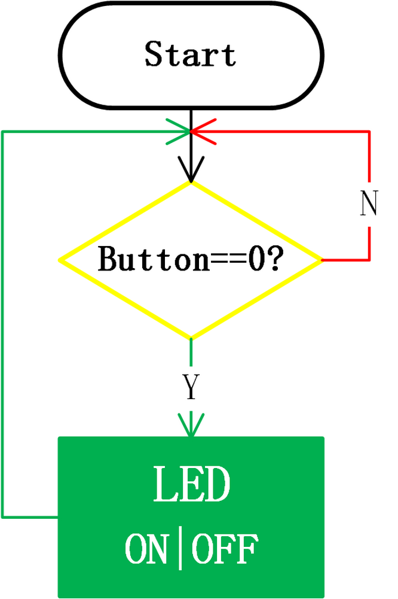

Complete code:

Based on the code for Auto-locking Button, we add "**LED pin output**"
blocks.

.. image:: ./scratch_img/st47.png
   :alt: img

**Test Result:**

**When you press the button once, LED lights up; if you press again, LED
turns off. This operation is a loop, which is consistent with the
lighting principle in reality.**

--------------

In this chapter, we have demonstrated how to program and control via
KidsBlock, and we have learned the basics as well as some software and
hardware concepts in experiments such as auto-locking button and
lighting control system.

These are essential for a good KidsBlock developer. Next, we will guide
you to keep exploring more applications and skills, whether you are a
beginner or a veteran. Hope you enjoy the fun and challenges during
learning KidsBlock. Let's move on!

--------------

.. _4.1.5-FAQ:

4.1.5 FAQ
^^^^^^^^^

**Q: LED doesn't light up after uploading code.**

A: Please check whether the pin defined in code is consistent with that
in your wirings. If they are incompatible, please adjust it referring to
the code.

--------------

**Q: The button sometimes works while sometimes doesn't.**

A: Please modify the delay of jitter elimination to a proper value.

.. code:: c++

    //Eliminate the button jitter
      delay(10);  //Modify the delay val in this line

--------------

.. _4.2-Project-:-Light-Control-System:

4.2 Project : Light Control System
~~~~~~~~~~~~~~~~~~~~~~~~~~~~~~~~~~

In this project, we will construct a light control system by a
photoresistor and an LED. It is an intelligent system to adjust light,
which saves energy and enhance efficiency as well.

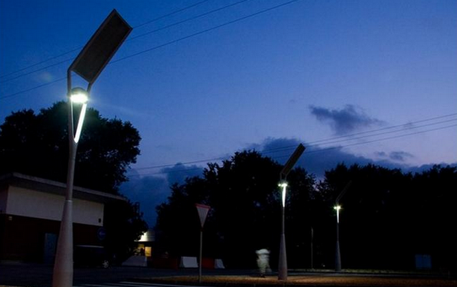

This system is compatible with multiple conditions. Thanks to its
photoresistor, it is able to detect the light intensity in day or at
night, realizing a more intelligent and energy-saving system.

When the photoresistor detects that ambient brightness is lower than the
set value, LED lights up. On the contrary, if the ambient light
intensity is higher than the set value, photorisistor will send a
different signal to turn off the LED.

--------------

.. _4.2.1-Flow-Diagram:

4.2.1 Flow Diagram
^^^^^^^^^^^^^^^^^^

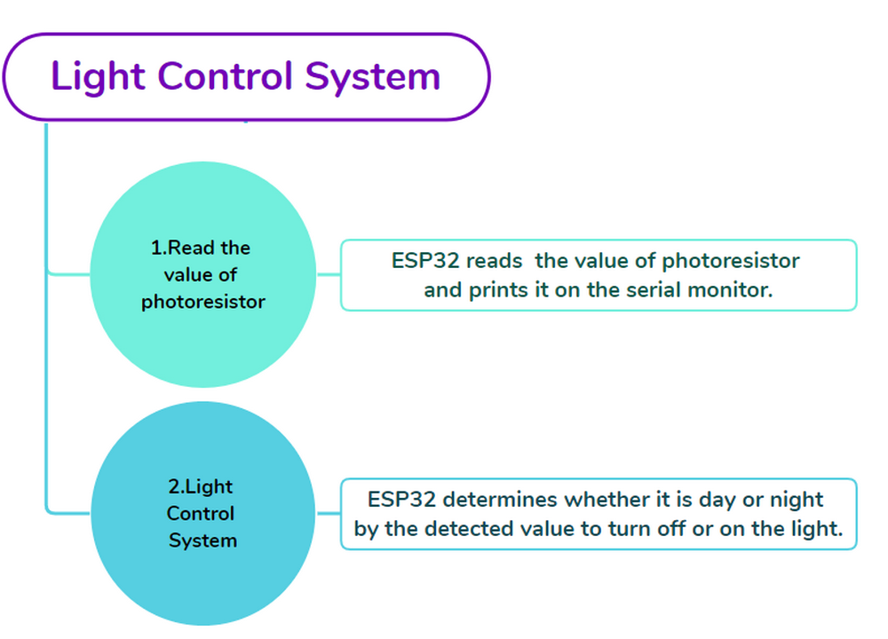

--------------

.. _4.2.2-Photoresistor:

4.2.2 Photoresistor
^^^^^^^^^^^^^^^^^^^

**Description:**

A photoresistor, also called photosensor, converts light signal into
electric signal (voltage, current, and resistor).

**Working principle:**

We place a photoresistor in a circuit in series connection and add
suitable voltage to both poles. When there is no light, the resistance
is infinite and the circuit almost opens. However, when there is light,
the resistance decreases while the current increases, and it is
equivalent to a short circuit when the light intensity is sufficient.

Now we will read the value of photoresistor by programming on ESP32
development board.

.. image:: ./scratch_img/cou2.png
   :alt: img

--------------

**Schematic Diagram:**

When light hits the photoresistor, the stronger the light is, the
smaller the resistance will be, so the greater the VCC voltage will pass
through the resistor.

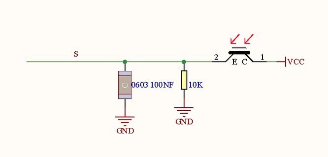

**Parameters:**

-  Voltage: 3~5V

-  Current: 0.2mA

-  Power: 1mW

-  Spectrum Peak Value: 540nm

-  Bright Resistance (10lux): 5~10KR

-  Dark Resistance: 0.5MR

--------------

**Wiring Diagram:**

**Connect the photoresistor to io34.**

**Attention: Connect yellow to S(Signal), red to V(Power), and black to
GND. Do not reverse them!**

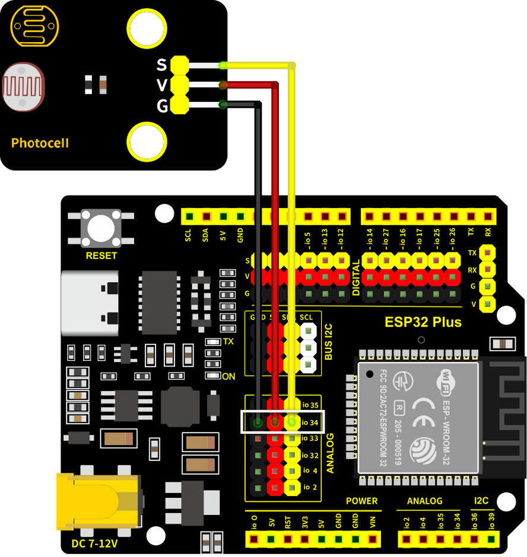

--------------

**Test Code:**

-  Initialize the serial port.

   .. image:: ./scratch_img/st48.png
      :alt: img

-  Define a global variable "**item**" as the photoresistor value.

   .. image:: ./scratch_img/st49.png
      :alt: img

-  Set "**item**" to the read value and print it on serial monitor.

   .. image:: ./scratch_img/st50.png
      :alt: img

Complete code:

.. image:: ./scratch_img/st51.png
   :alt: img

--------------

**Test Result:**

Open the serial monitor.

The brighter the light detected by the photoresistor is, the greater the
value will be.

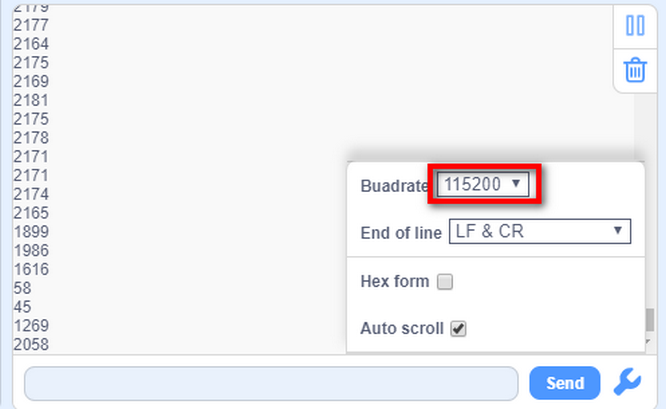

--------------

.. _4.2.3-Light-Control-System:

4.2.3 Light Control System
^^^^^^^^^^^^^^^^^^^^^^^^^^

**Wiring Diagram:**

**Connect the photoresistor to io34 and LED to io27.**

**Attention: Connect yellow to S(Signal), red to V(Power), and black to
GND. Do not reverse them!**

.. image:: ./scratch_img/couj22.png
   :alt: img

--------------

**Test Code:**

Code Flow:

.. image:: ./scratch_img/flo2.png
   :alt: img

-  Determine:

   -  The value of the photoresistor >= 800, LED turns off.
   -  The value of the photoresistor =< 800, LED turns on.

   .. image:: ./scratch_img/st53.png
      :alt: img

Complete code:

.. image:: ./scratch_img/st54.png
   :alt: img

**Test Result:**

When the value of the photoresistor is greater than 800 (in daytime),
LED goes off. However, if the value is less than 800, LED will
automatically light on.

.. image:: ./scratch_img/st55.png
   :alt: img

--------------

\**Various conditions can adopt this type of system. Thanks to its
photoresistor, it is able to detect the light intensity in day or at
night, which saves energy and intellectualize the whole system. \*\*

--------------

.. _4.2.2-FAQ:

4.2.2 FAQ
^^^^^^^^^

**Q: The value of the photoresistor cannot be 0.**

A: In actual life, little light exists although you turn off all lights
in your room, so the value of photoresistor only approaches to 0 rather
than equals to 0.

--------------

**Q: After uploading code, LED doesn't light up even though the room is
dark without lights.**

A: Increase the determined value of photoresistor. In our example, we
set to 800. So you may adjust it to 1000 or a greater value.

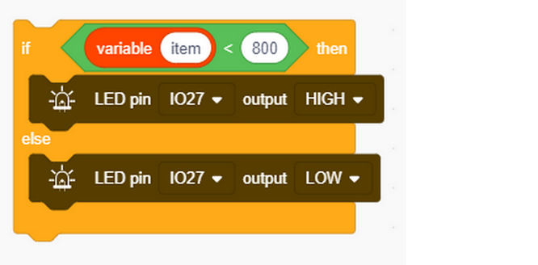

--------------

.. _4.3-Project-:-Alarm-System:

4.3 Project : Alarm System
~~~~~~~~~~~~~~~~~~~~~~~~~~

In this project, we use a PIR motion sensor and a buzzer to consist an
alarm system, which can be controlled by ESP32 development board.

How does it work? The electric signals are detected and read by the PIR
motion sensor through programming on Arduino IDE, and then it determines
whether there is a person. If there is, the buzzer alarms. In this way,
this alarm system costs much lower for families and offices.

--------------

.. _4.3.1-Flow-Diagram:

4.3.1 Flow Diagram
^^^^^^^^^^^^^^^^^^

.. image:: ./scratch_img/image-20230606102303743.png
   :alt: image-20230606102303743

--------------

.. _4.3.2-PIR-Motion-Sensor:

4.3.2 PIR Motion Sensor
^^^^^^^^^^^^^^^^^^^^^^^

**Description:**

A PIR motion sensor detects the presence of a person by sensing the heat
given off by the human body.

Moreover, this sensor is small and easy to use.

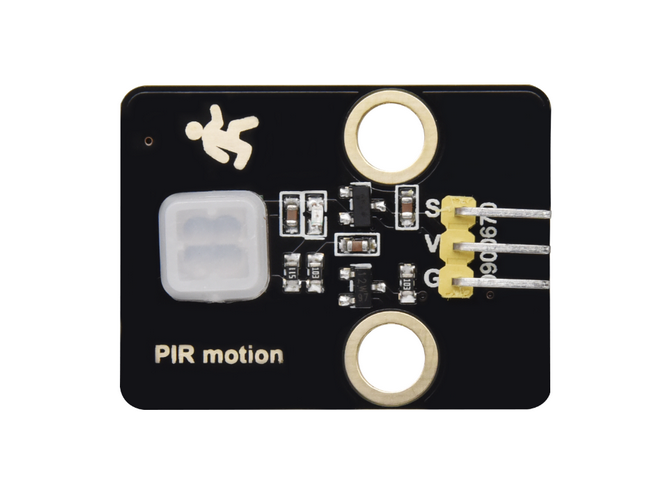

--------------

**Schematic Diagram:**

.. image:: ./scratch_img/couy31.png
   :alt: img

**Parameters:**

-  Voltage: 3~5V
-  Current: 3.6mA
-  Power: 18mW
-  Angle of View: Y = 90°, X = 110° (theoretical value)
-  Detection Distance: ≤5m

--------------

**Wiring Diagram:**

**Connect the PIR motion sensor to io23.**

**Attention: Connect yellow to S(Signal), red to V(Power), and black to
GND. Do not reverse them!**

.. image:: ./scratch_img/couj31.png
   :alt: img

--------------

**Test Code:**

Read the value at pin IO23 to determine whether there is a human motion.

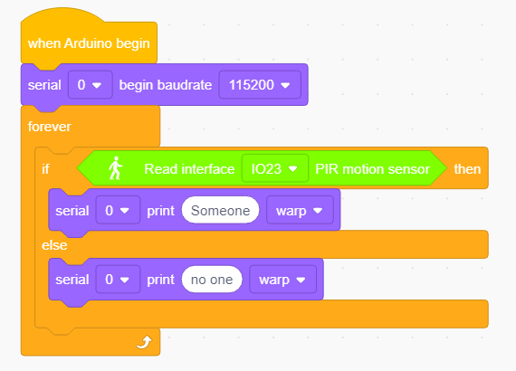

**Test Result:**

Open the serial monotor.

When someone is in the area, **Someone** is displayed on the monitor,
and the red LED on the sensor goes off. However, if there is no one,
**No one** will be printed and the LED will always be on.

**ATTENTION**: PIR motion sensor is not able to penetrate things, so
please do not cover the sensor while detecting motions.

.. image:: ./scratch_img/st57.png
   :alt: img

--------------

.. _4.3.3-Buzzer:

4.3.3 Buzzer
^^^^^^^^^^^^

**Description:**

A buzzer is an electronic sounder, which emits sounds with different
frequencies and durations and is powered by DC voltage. Thus, it can be
used as a reminder or an alarm in considerable electronic devices, such
as computers, printers, copiers, alarms, electronic toys, automotive
electronics, telephones and timers.

.. image:: ./scratch_img/cou34.png
   :alt: img

--------------

A buzzer consists of **vibration device** and **resonance device**. And
there are two categories: Passive buzzers and active buzzers.

-  A **Passive Buzzer** cannot ``vibrate`` to emit sound itself, unless
   putting a ``square wave`` signal with a certain frequency. Moreover,
   the emitting sound varies due to the different frequency of square
   wave, so a passive buzzer can simulate tunes.

   -  An analog squire wave can be generated by changing the power level
      at pins. For example, after the high level lasting for 500ms, it
      shifts to a low level for another 500ms then to a high level
      again...
   -  \**We drive the buzzer via a squire wave within 200~5000Hz, and we
      can compute the frequency(f): *f=1/T*; T is the period (the total
      time of high and low level). \*\*

.. image:: ./scratch_img/cou35.png
   :alt: img

-  An **Active Buzzer** is able to emit sound automatically without an
   external motivator, because it includes a driving circuit which only
   needs ``DC power supply``. However, its sound is flat with relatively
   fixed frequency.

--------------

**In this experiment, a passive buzzer is applied to" play music".**

--------------

**Schematic Diagram:**

.. image:: ./scratch_img/cou38.png
   :alt: img

**Parameters:**

-  Voltage: 3~5V
-  Current: ≤5mA
-  Power: ≤25mW

--------------

**Wiring Diagram:**

**Connect the buzzer to io16.**

**Attention: Connect yellow to S(Signal), red to V(Power), and black to
GND. Do not reverse them!**

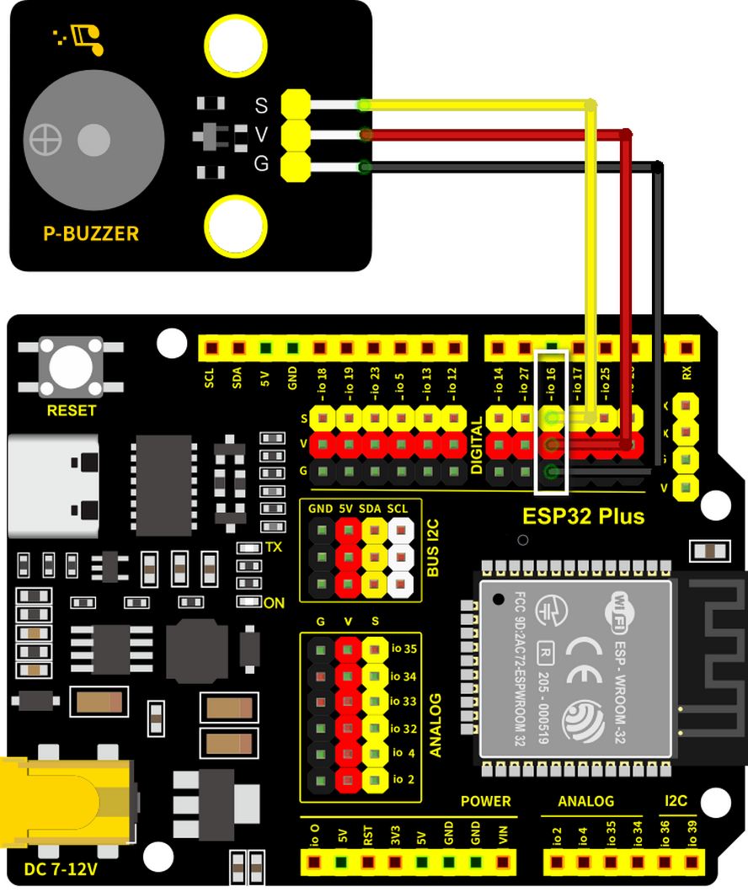

--------------

**Test Code:**

**Method 1: Analog Squire Wave**

A passive buzzer is driven by squire waves, so we stimulate the wave.

An analog squire wave can be generated by changing the power level of
pin: high level for 500us and low level for 500us. So, the buzzer will
emit sound. Also, the durations can adjust the sound volume.

Please try 1000us, 1500us, 3000us…What's the difference?

.. image:: ./scratch_img/cou36.png
   :alt: img

Code:

.. image:: ./scratch_img/st58.png
   :alt: img

-  In delay function, the time unit us micro-seconds. So the following
   block represents a 500ms delay.

.. image:: ./scratch_img/st59.png
   :alt: img

According to formula:

.. math:: f = 1/T

Thus, 500us is the duration, and we can calculate the frequency = 2kHz,
i.e., the high and low level alter 2000 times per second.

--------------

**Method 2: Speaker Blocks**

We adopt Speaker\ |image24| code blocks to drive the buzzer to vibrate.

**Speaker Blocks generates PWM signal with a certain frequency to drive
the buzzer to vibrate,** and the duration and tone is controlled by
related parameters.

There are two ways to define the duration. One is to adjust the
parameters of the tone() function to set a duration, and the other is to
adopt a noTone() function to directly stop the sound. If you do not
define a duration in tone(), the sound signal will always be generated
unless a noTone() stops it.

For ESP32 board, one sound can only be produced at a time. If one pin of
ESP32 is generating a sound signal via tone(), it is not acceptable to
emit sound by this function on another pin.

**Tone Table**

.. image:: ./scratch_img/cou37.png
   :alt: img

Code:

-  Drag a "**Tone**" block from |image25| as shown below, and set pin to
   IO16.

   .. image:: ./scratch_img/st61.png
      :alt: img

-  You may select a frequency at will.

   .. image:: ./scratch_img/st62.png
      :alt: img

-  No Tone: It is used to turn off all tones.

   .. image:: ./scratch_img/st65.png
      :alt: img

Complete code:

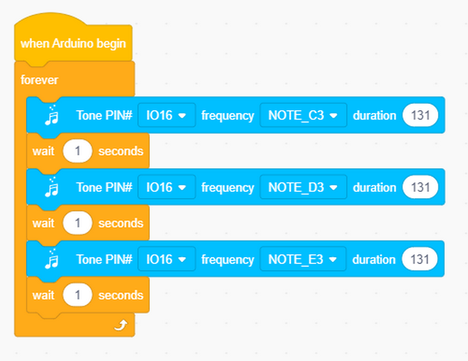

**Test Result:**

Method 1: Buzzer keeps emitting sound.

Method 2: Buzzer alarms via tone() function.

--------------

**Expansion: Play Music**

Play music through tone().

Complete Code:

--------------

.. _4.3.4-Alarm-System:

4.3.4 Alarm System
^^^^^^^^^^^^^^^^^^

In this experiment, we will construct an alarm system by a PIR motion
sensor, a buzzer and an LED. When the sensor detects a motion, buzzer
emits sound and LED blinks to remind of an invasion.

--------------

**Wiring Diagram:**

**Connect the PIR motionsensor to io23, buzzer to io16, and LED to
io27.**

**Attention: Connect yellow to S(Signal), red to V(Power), and black to
GND. Do not reverse them!**

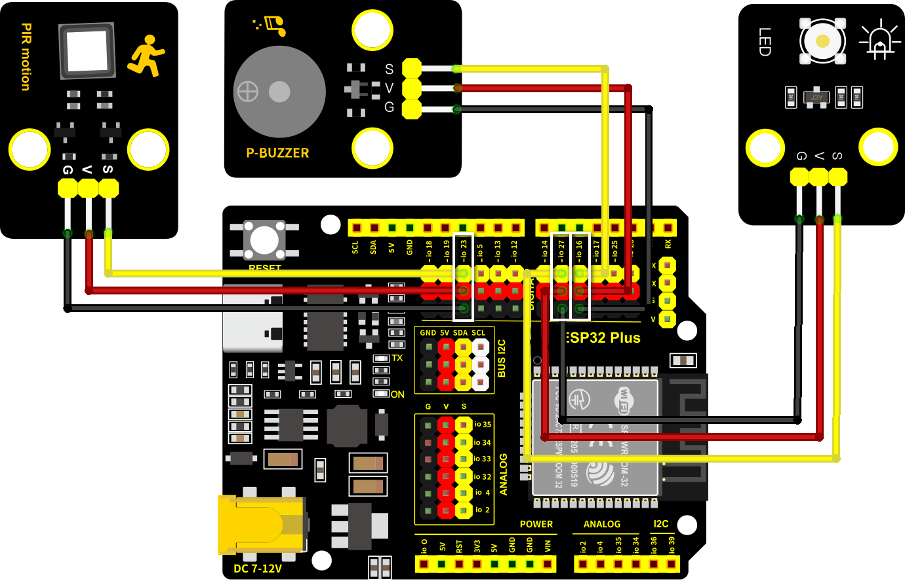

--------------

**Test Code:**

Code flow:

.. image:: ./scratch_img/flo3.png
   :alt: img

Complete code:

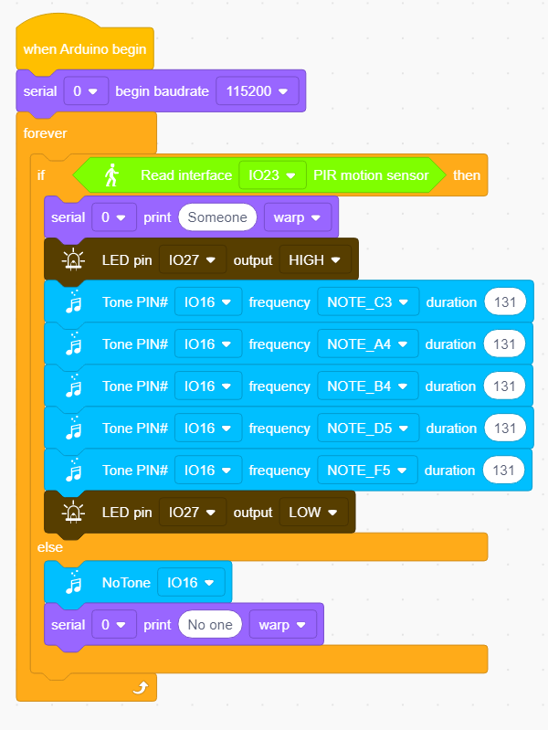

**Test Result:**

Upload the code and the alarm system starts to work. When it detects a
motion, buzzer alarms and LED blinks.

--------------

.. _4.3.5-FAQ:

4.3.5 FAQ
^^^^^^^^^

**Q: Tones of buzzer is not accurate with actual ones.**

A: This regular buzzer just stimulates tones, so it is not able to meet
professional requirements. If you want standard tones, a more
specialized speaker is required.

--------------

**Q: The PIR motion sensor misinforms results.**

A: This PIR motion sensor is also not a professional one.

Please guarantee the following situations to avoid a misinformation:

-  Avoid objects blown by wind to flutter within the detection area,
   such as curtains, clothing and flowers.
-  Avoid strong light in the detection area, such as sunlight, car
   lights, spotlights and other light sources.
-  And so on...

--------------

.. _4.4-Project-:-Rain-Detection-System:

4.4 Project : Rain Detection System
~~~~~~~~~~~~~~~~~~~~~~~~~~~~~~~~~~~

**NOTE: Sprinkling water on sensors(except steam sensor) may cause a
short circuit or modules to be out of work. If batteries get wet, even
explosion may occur. Do be extra careful! For younger users, please
operate with your parents. To guarantee security, please obey guidances
and safety regulations.**

--------------

In this project, we will create a rain detection system by a steam
sensor. When rain is detected, ESP32 triggers various actions like
sending message, activating sprinklers and turning on lights. Through
this system, rainfall amount can be monitored, and water leakage can
also be detected on roofs or in buildings.

Besides, it is easy to connect the steam sensor to ESP32 board, which
forms a simple but effective rain detection system.

--------------

.. _4.4.1-Flow-Diagram:

4.4.1 Flow Diagram
^^^^^^^^^^^^^^^^^^

.. image:: ./scratch_img/image-20230607180917475.png
   :alt: image-20230607180917475

--------------

.. _4.4.2-Steam-Sensor:

4.4.2 Steam Sensor
^^^^^^^^^^^^^^^^^^

**Description:**

Steam sensor detects the presence of water, so it is usually used in
rain detection. If the rain hits the conductive pad on the sensor, it
will send a signal to the Arduino board.

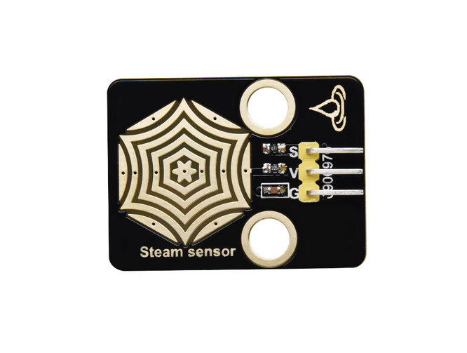

--------------

**Schematic Diagram:**

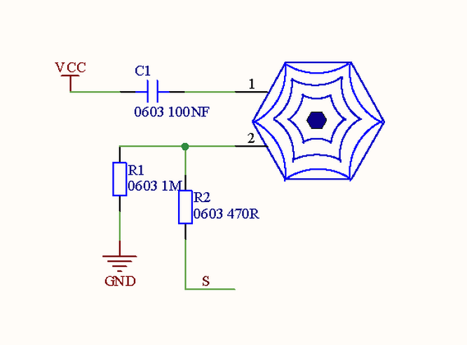

**Parameters:**

-  Voltage: 3~5V
-  Current: 1.5mA
-  Power: 7.5mW

--------------

**Wiring Diagram:**

**Connect the steam sensor to io35.**

**Attention: Connect yellow to S(Signal), red to V(Power), and black to
GND. Do not reverse them!**

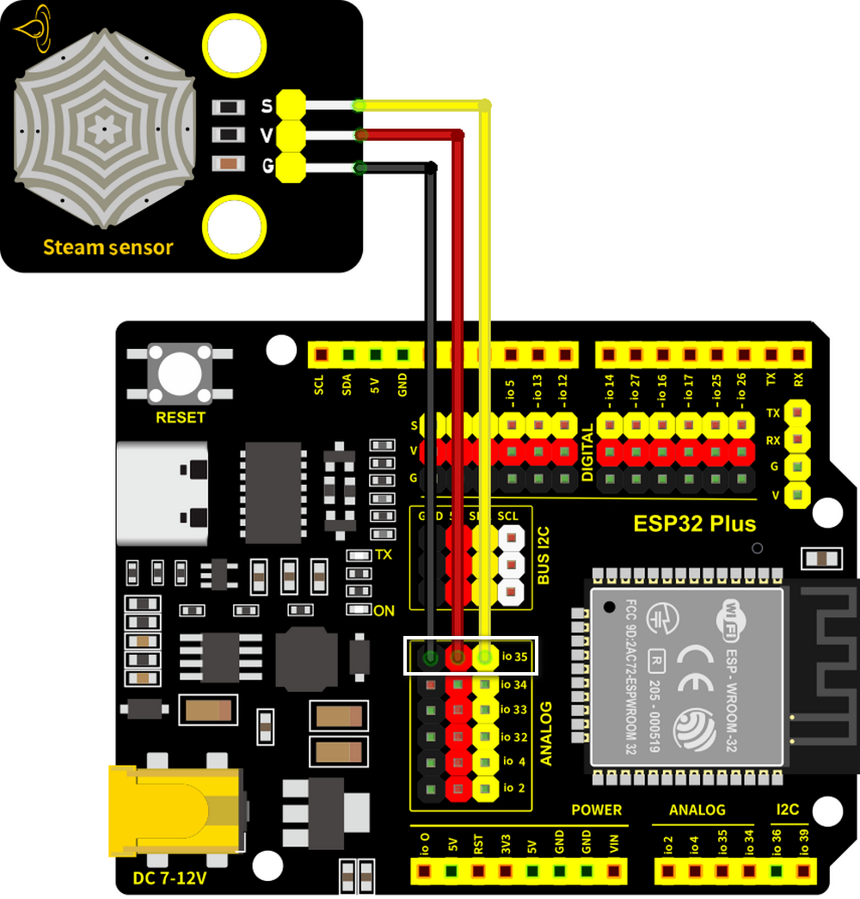

--------------

**Test Code:**

-  Initialize the serial port.

   .. image:: ./scratch_img/st67.png
      :alt: img

-  Read the sensor value at pin io35 and print it per second.

   .. image:: ./scratch_img/st68.png
      :alt: img

Complete code:

.. image:: ./scratch_img/st69.png
   :alt: img

**Test Result:**

Touch the detection area with a wet finger. The larger the area you
touched is, the larger the value will be.

You may open the serial monitor to observe the currently detected value
(range: 0~4095).

.. image:: ./scratch_img/st70.png
   :alt: img

--------------

.. _4.4.3-Rain-Detection-System:

4.4.3 Rain Detection System
^^^^^^^^^^^^^^^^^^^^^^^^^^^

**Description:**

When the steam sensor detects rain, it sends a signal to the board to
trigger various actions, for instance, the buzzer alarms to remind that
it is raining. This is especially useful for outdoor gardening and
farming, enabling users to take necessary precautions to avoid
over-watering.

Additionally, this system can be used to detect water leakage to prevent
damage from water intrusion. Overall, the steam sensor is versatile and
effective in various applications.

--------------

**Wiring Diagram:**

**Connect the steam sensor to io35 and buzzer to io16.**

**Attention: Connect yellow to S(Signal), red to V(Power), and black to
GND. Do not reverse them!**

.. image:: ./scratch_img/couj42.png
   :alt: img

--------------

**Test Code:**

Code flow:

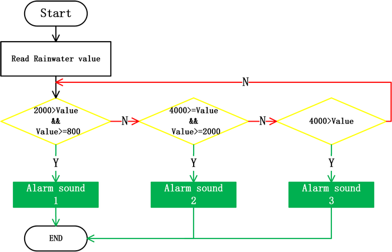

Code:

-  Initialize the serial port, and define a variable **item** as the
   received sensor value.

   .. image:: ./scratch_img/st71.png
      :alt: img

-  Receive the sensor value and print it on the serial monitor.

   .. image:: ./scratch_img/st72.png
      :alt: img

-  The received value detected by the sensor is within 800 ~ 1999:

   .. image:: ./scratch_img/st73.png
      :alt: img

-  The received value detected by the sensor is within 2000 ~ 2999:

   .. image:: ./scratch_img/st74.png
      :alt: img

-  The received value detected by the sensor is greater than 3000:

   .. image:: ./scratch_img/st75.png
      :alt: img

-  At the end of code blocks, add a "**No Tone**" to turn off the
   buzzer.

   .. image:: ./scratch_img/st76.png
      :alt: img

Complete code:

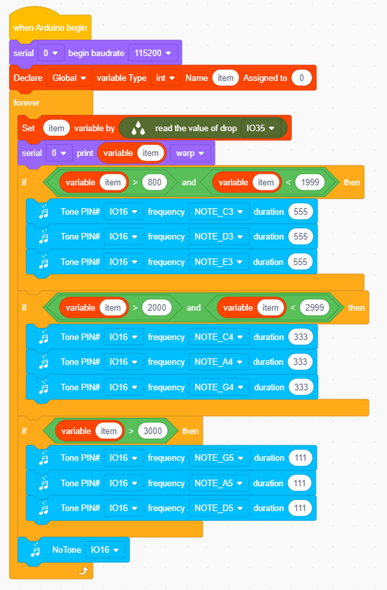

**Test Result:**

The greater the detected value is, the loader the sound emitted by the
buzzer will be.

--------------

.. _4.4.4-FAQ:

4.4.4 FAQ
^^^^^^^^^

Q: Is the steam sensor waterproof?

A: The detection area can be exposed to water, but the wire junctions
are not waterproof. During the experiment, please pay attention to the
amount of water not to be too much to prevent short circuit.

--------------

Q: Although a long time has elapsed since the sensor detected water, the
buzzer keeps buzzing.

A: It keeps buzzing because there are still blots of water in the
detection area. Please just clean it up.

--------------

.. _4.5-Project:-Solar-Power-System:

4.5 Project: Solar Power System
~~~~~~~~~~~~~~~~~~~~~~~~~~~~~~~

.. image:: ./scratch_img/cou51.png
   :alt: img

.. _4.5.1-Description:

4.5.1 Description
^^^^^^^^^^^^^^^^^

Solar panel converts solar power into electricity for the LED. It is
suitable for multiple applications, such as outdoor lighting, mobile
devices charging, and back up power. Hence, you may establish a
sophisticated and efficient solar power system according to your own
needs.

--------------

.. _4.5.2-Working-Principle:

4.5.2 Working Principle
^^^^^^^^^^^^^^^^^^^^^^^

**How does solar panel convert solar power into electricity?**

.. image:: ./scratch_img/cou52.png
   :alt: img

The solar panel absorbs light and directly or indirectly converts solar
radiation into electricity. Compared with ordinary coal power
generation, solar, wind and water power are more energy-saving and
environment-friendly.

--------------

**How does light convert to electricity?**

Next, let's talk about the conversion process from inside to outside in
a solar panel .

**The Sun emits energy in waves with a wide range of wavelengths, from
ultraviolet to visible to infrared light.**

-  Wavelength of Ultraviolet: 150~400nm;
-  Wavelength of Visible Light: 400~760nm;
-  Wavelength of Infrared Light: 760~4000nm;

**The panel absorbs one of these ranges of wavelength and converts them
into electricity. But how? Let's move on.**

--------------

**The active part of most solar panel cell is made of a semiconductor
--- silicon(Si).**

The conductivity of a semiconductor is between a conductor and an
insulator in atmospheric temperature. Generally, it cannot conduct well,
yet its conductivity improves in certain conditions.

--------------

.. image:: ./scratch_img/cou54.png
   :alt: img

**The diagram above shows the internal structure of the semiconductor in
solar cell, which is divided into three layers:**

#. **The top layer (red part)** consists of Silicon(Si) and a little
   Phosphorus(P). The later carries more electrons than the former,
   providing sufficient electrons for the top layer. Due to these
   freely-moving electrons, this layer is conductive, so it is called
   **Negative or N-type.**
#. **The middle layer (gray part)** contains too few electrons to
   conduct.
#. **The bottom layer (green part)** mainly includes Silicon(Si) and
   Boron(B). The later carries less electrons than the former, so that a
   rarely few electrons move freely, causing the missing of electrons
   which are described as effective positive charge. Therefore, this
   layer is named **Positive or P-type.**

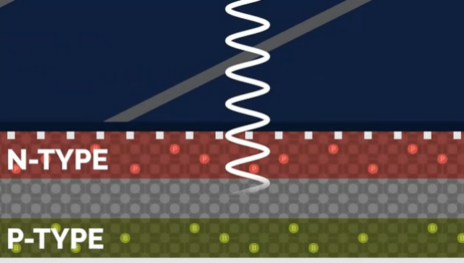

**Usually, only the middle layer of the solar panel absorbs light waves
with wavelength of 350~1140nm.** According to the spectrum distribution
in previous paragraphs, absorptions are long wave ultraviolet, short
wave infrared and visible light.

**The wavelength of ultraviolet is so short that they stops on the
surface.**

.. image:: ./scratch_img/cou56.png
   :alt: img

**The wavelength of infrared light is too long too be absorbed by the
panel, so they usually passes through or is reflected back.**

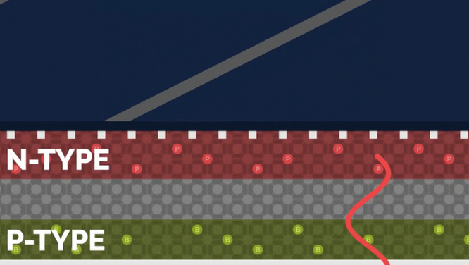

The middle layer absorbs light and knocks electrons off from silicon in
the top layer, leaving them in a free state, and empty electron holes
are generated at the place where they were before.

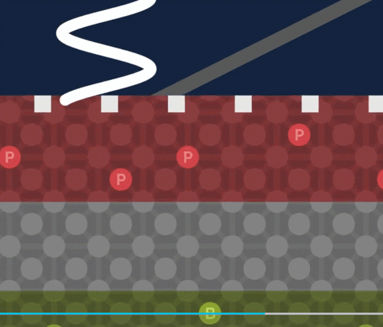

The holes carries a positive charge. Meanwhile, free electrons move
upwards to reach N-type layer, while holes move downwards to reach
P-type layer.

**In conclusion, electrons in the top and bottom layers are struck out
after the middle layer absorbing solar energy. Therefore, N-type layer
carries negative charge as a negative pole, while P-type layer is
positively charged as a positive pole. In this case, as long as the two
layers are connected, it conducts.**

--------------

If sunlight shines on the solar panel, the above situation will last,
and a large number of free electrons and holes will be produced. As our
conclusion goes, electrons move upwards while holes move downwards,
which forms the two poles and generates current.

.. image:: ./scratch_img/cou59.gif
   :alt: img

--------------

.. image:: ./scratch_img/cou510.png
   :alt: img

Solar energy is an alternative energy source, which features
sustainability and cost-effectiveness.

However, the electricity generated by one solar panel can be converted
into several watts of power, which is enough for a calculator or a
cellphone charger, yet not nearly enough to run a one-kilowatt toaster.

Solar power systems satisfy the needs of different users and benefit for
environment as well. Combined with Arduino programming, this kind of
system builds a variety of useful and efficient solar applications, like
automatic lighting, chargers and smart homes.

Generally speaking, solar energy promises well for a wonderful and
sustainable future.

--------------

.. _4.5.3-Parameters:

4.5.3 Parameters
^^^^^^^^^^^^^^^^

-  Voltage: 5V
-  Current: 80mA
-  Power: 400mW
-  Dimensions: 60*60mm

--------------

.. _4.5.4-Test-Result:

4.5.4 Test Result
^^^^^^^^^^^^^^^^^

Codes are not required in this project. Importantly, we learn about the
new environmental energy --- solar power.

When good illumination is provided, LED will light up in yellow. The
brighter the light is, the brighter the LED will be.

--------------

.. _4.5.5-FAQ:

4.5.5 FAQ
^^^^^^^^^

Q: Why does solar panel still work without sunlight?

A: It works with not only sunlight but also ambient light. The brighter
the light is, the greater the voltage will be, and the lighter the LED
will be.

--------------

.. _4.6-Project:-Smart-Feeding-System:

4.6 Project: Smart Feeding System
~~~~~~~~~~~~~~~~~~~~~~~~~~~~~~~~~

In this project, the ultrasonic module detects whether animals are in
the feeding area, and the Servo automatically opens the feeding box for
fowls. Besides, incorporating IOT enables remote monitoring of such
feeding systems which provides much convenience.

Overall, the automation and remote operation are optimizing the feeding
process for this system.

.. image:: ./scratch_img/cout6.png
   :alt: img

--------------

.. _4.6.1-Flow-Diagram:

4.6.1 Flow Diagram
^^^^^^^^^^^^^^^^^^

.. image:: ./scratch_img/image-20230607085516167.png
   :alt: image-20230607085516167

--------------

.. _4.6.2-Servo:

4.6.2 Servo
^^^^^^^^^^^

**Description:**

**Servo**, also called **RC Servo Device**, is a motor with a feedback.
Commonly, Servo performs precise position control and outputs high
torque, which most often appears in robotics projects, RC cars,
airplanes and aircraft.

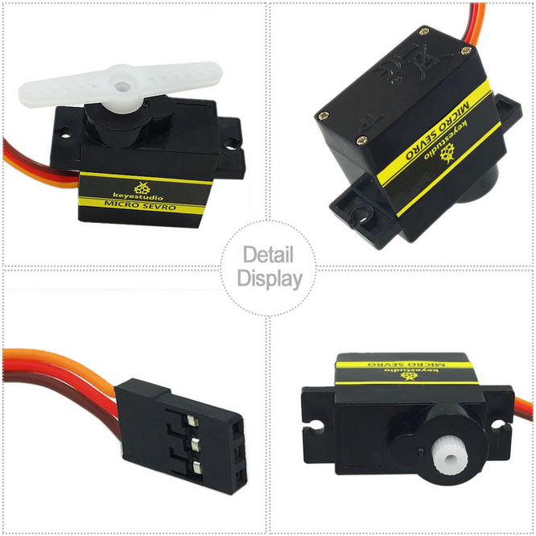

--------------

**Internal Structure:**

.. image:: ./scratch_img/cou61.png
   :alt: img

-  ① Signal(S): It receives the control signal from microcontroller.
-  ② Potentiometer: the feedback part of the Servo. It measures the
   position of output shaft.
-  ③ Embedded board (Internal controller): the core of the Servo. It
   processes external control signal and the feedback signal of position
   and drives the Servo.
-  ④ DC motor: the execution part. It outputs speed, torque and
   position.
-  ⑤ Gear system: It scales the outputs from motor to the final output
   Angle ccording to a certain transmission ratio.

--------------

**Drive the Servo:**

Signal(S) receives PWM to control the output of Servo, and **the
position of output shaft directly relies on the duty cycle of PWM**.

For instance:

-  If we send a signal with pulse width of 1.5ms to Servo, its
   shaft(horn) will revolves to the middle position(90°);
-  If pulse width = ``0.5ms``, the shaft turns to its minimum(0°);
-  If pulse width = ``2.5ms``, the shaft turns to its maximum(180°).

**NOTE: The maximum angle varies from the types of Servos. Some are 170°
while some are only 90°. In spite of this, Servos usually will move a
half (of the maximum) if they receive a signal with pulse width of
1.5ms.**

.. image:: ./scratch_img/cou62.png
   :alt: img

The period of a Servo usually lasts 20ms and it produce pulses at a
frequency of ``50Hz``. Most servos work normally at 40~200Hz.

--------------

**Wiring Diagram:**

**Connect the Servo to io26.**

**Attention: Connect yellow to S(Signal), red to V(Power), and black to
GND. Do not reverse them!**

.. image:: ./scratch_img/couj61.png
   :alt: img

--------------

**Test Code:**

-  Initialize the serial port and define a variable **item** with an
   assignment of 80.

   .. image:: ./scratch_img/st78.png
      :alt: img

-  Set **item** to the angle of Servo from 80° to 180°, rotating 1°
   every 15ms.

   .. image:: ./scratch_img/st79.png
      :alt: img

-  Servo rotates 1° every 15ms, from 180° to 80°.

   .. image:: ./scratch_img/st80.png
      :alt: img

Complete code:

.. image:: ./scratch_img/st81.png
   :alt: img

**Test Result:**

The feeding box is slowly opened and then closed ,which is controllable.

**NOTE: SG90 servo can rotate 180°. As the feeding box is small, 100° of
rotation is enough to completely close the box.**

-  80°: fully open
-  120°: half open
-  180°: close

.. image:: ./scratch_img/cou63.gif
   :alt: img

--------------

**ATTENTION**

\**Do not put your fingers into the box to avoid nipping! \*\*

**Do not block the door with something to avoid damaging servo!**

--------------

.. _4.6.3-Ultrasonic-Sensor:

4.6.3 Ultrasonic Sensor
^^^^^^^^^^^^^^^^^^^^^^^

**Description:**

.. image:: ./scratch_img/cou65.png
   :alt: img

**Schematic Diagram:**

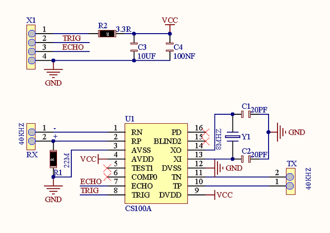

--------------

The frequency of sound waves that the human can hear is 20Hz ~ 20KHz,
while ultrasonic waves are beyond that range.

**Ultrasonic:**

.. image:: ./scratch_img/cou66.png
   :alt: img

Ultrasonic module converts electricity and ultrasonic wave into each
other by piezoelectric effect, and it also transmits and receives
ultrasonic wave.

This kind of wave features directivity, strong penetration and easy
concentration of sound energy.

.. image:: ./scratch_img/cou67.png
   :alt: img

In this ultrasonic ranging system, we firstly program on MCU(ESP32
development board) to generate an original square wave at 40KHz and
drive the ultrasonic module to emit it. Immediately, the module
calculates the distance to the object after receiving the reflected
wave(Echo) amplified and shaped by the circuit. Herein, it records the
duration of emission and reflection and calculates the distance
according to the time difference.

Simply, MCU controls the module to emit ultrasonic wave which is bounced
back after encountering obstacles and is received by the module. The
time difference between them is an important factor in computing the
distance (the speed of sound propagation in air is 340m/s).

--------------

**Wiring Diagram:**

**Connect the Echo of Ultrasonic module to io13 and Trig to io12.**

**Attention: Connect yellow to S(Signal) and red to V(Power). Do not
reverse them!**

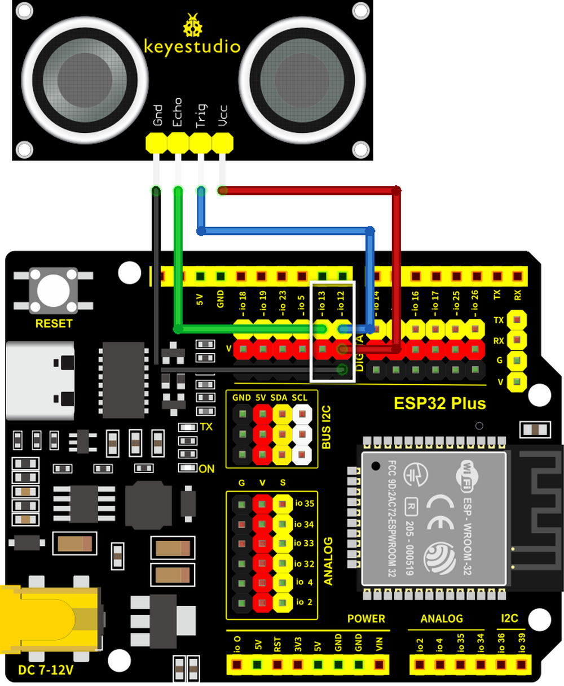

--------------

**Test Code:**

Set the correct pin: Trig to pin io12; Echo to pin io13.

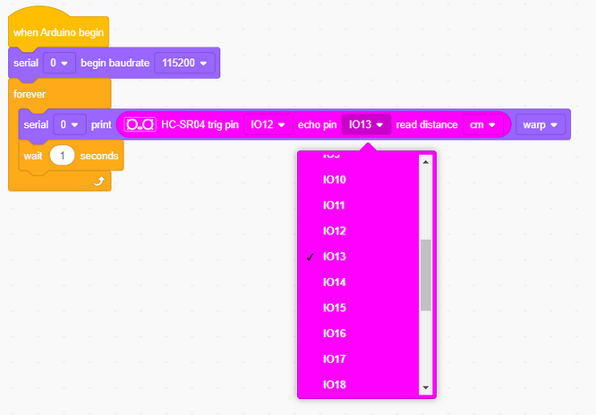

**Test Result:**

In this kit, the detection range is within 3~8cm.

Open the serial monitor, and observe.

.. image:: ./scratch_img/st82.png
   :alt: img

--------------

.. _4.6.4-Smart-Feeding-System:

4.6.4 Smart Feeding System
^^^^^^^^^^^^^^^^^^^^^^^^^^

**Description:**

The smart feeding system intelligently feeds domestic fowls via an
ultrasonic module and a servo. The former detects the distance to
animals while the later controls to open or close the feeding box. When
a pet is detected close to the box, servo opens it to feed.

--------------

**Wiring Diagram:**

**Connect the Echo of Ultrasonic module to io13 and Trig to io12;
connect the servo to io26.**

**Attention: Connect yellow to S(Signal), red to V(Power) and black to
GND. Do not reverse them!**

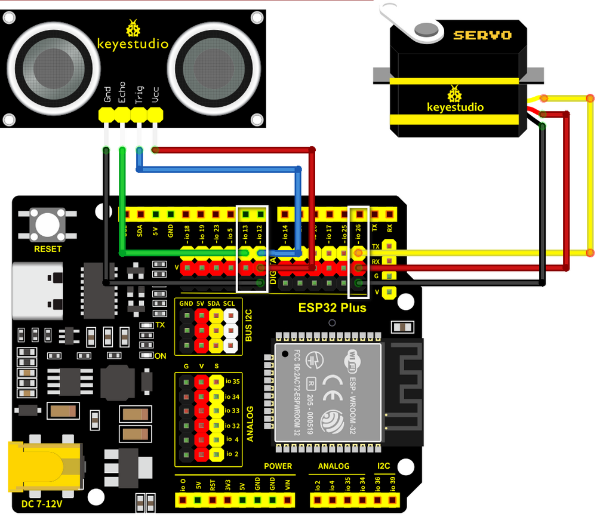

--------------

**Test Code:**

Code Flow:

.. image:: ./scratch_img/flo6.png
   :alt: img

Code:

-  Initialize the serial port. Define a variable and assign it to 180.

   .. image:: ./scratch_img/st84.png
      :alt: img

-  Set the pin correctly, and print the received value.

   .. image:: ./scratch_img/st85.png
      :alt: img

-  Determine the detected distance value. If it is within 2cm ~ 7cm, the
   feeding box will open.

   .. image:: ./scratch_img/st86.png
      :alt: img

Complete code:

.. image:: ./scratch_img/st87.png
   :alt: img

**Test Result:**

When an animal is detected, open the feeding box.

--------------

**ATTENTION**

\**Do not put your fingers into the box to avoid nipping! \*\*

**Do not block the door with something to avoid damaging servo!**

--------------

.. _4.6.5-FAQ:

4.6.5 FAQ
^^^^^^^^^

Q: Servo doesn't work.

A: It may be stuck by itself or by wires when mount the bottom plate.
before installing, please adjust the servo to 180° first. For how,
please refer to the installation guidance.

--------------

Q: The detected distance is inaccurate.

A: When detecting, please measure from the transmitting head. Herein,
this module is not a high-precision detector, so errors may exist.

.. image:: ./scratch_img/cou69.png
   :alt: img

--------------

.. _4.7-Project:-Temperature-Control-System:

4.7 Project: Temperature Control System
~~~~~~~~~~~~~~~~~~~~~~~~~~~~~~~~~~~~~~~

In this project, we will demonstrate how to use temperature and humidity
sensor, fan and LCD1602 display to constitute an intelligent temperature
and humidity control system.

The system measures ambient temperature and humidity and controls fan to
cool down as needed. When the temperature exceeds the set threshold, the
fan automatically turns on to reduce the ambient temperature below the
set value. Meanwhile, the current temperature and humidity values will
be displayed on LCD1602.

Therefore, it realizes automatic adjustment of ambient temperature and
humidity, which is perfect for projects that require these functions.

.. image:: ./scratch_img/cout7.png
   :alt: img

--------------

.. _4.7.1-Flow-Diagram:

4.7.1 Flow Diagram
^^^^^^^^^^^^^^^^^^

.. image:: ./scratch_img/image-20230607121651834.png
   :alt: image-20230607121651834

--------------

.. _4.7.2-Temperature-and-Humidity-Sensor:

4.7.2 Temperature and Humidity Sensor
^^^^^^^^^^^^^^^^^^^^^^^^^^^^^^^^^^^^^

**Description:**

DHT11 temperature and humidity sensor outputs digital signals. It
applies principles of analog signal acquisition and conversion as well
as temperature and humidity sensing technology, so that it features
long-term stability and high reliability. Besides, the sensor integrates
a high-precision resistive humidity sensor and a resistive
thermosensitive temperature sensor, and is connected with an 8-bit
high-performance MCU.

.. image:: ./scratch_img/cou71.png
   :alt: img

--------------

**DHT11 Communication Means:**

DHT11 communicates through monobus(a single bus) which exchanges and
controls data.

-  Monobus transmits **Data Bit**:

   -  Data format of monobus: transmit 40bit data every time, and
      high-bit first.
   -  8bit humidity integer value + 8bit humidity decimal value + 8bit
      temperature integer value + 8bit temperature decimal value + 8bit
      parity.
   -  **NOTE: Humidity decimal value equals 0.**

-  **Paraty Bit**:

   -  8bit humidity integer value + 8bit humidity decimal value + 8bit
      temperature integer value + 8bit temperature decimal value.
   -  8bit parity equals the end 8 bits of the result.

**Timing Diagram:**

.. image:: ./scratch_img/cou73.png
   :alt: img

\**NOTE: \*\*

**The host always reads the temperature and humidity values of last
measurement from DHT11. Therefore, If the interval between two
measurements is long, please consecutively detect twice and adopt the
second result.**

For more details, please visit ASAIR official website:
http://www.aosong.com/products-21.html

--------------

**Wiring Diagram:**

**Connect the temperature and humidity sensor to io17.**

**Attention: Connect yellow to S(Signal), red to V(Power), and black to
GND. Do not reverse them!**

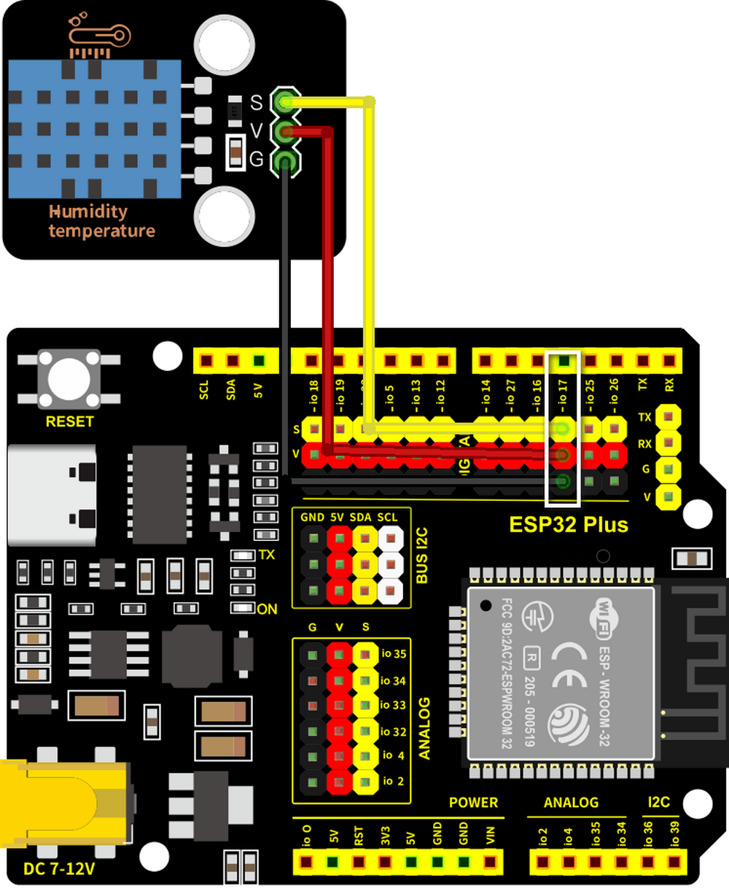

--------------

**Test Code:**

-  Initialize the serial port and the sensor.

   .. image:: ./scratch_img/st89.png
      :alt: img

-  The serial monitor prints and refreshes humidity and temperature
   values per second.

   .. image:: ./scratch_img/st90.png
      :alt: img

Complete code:

.. image:: ./scratch_img/st91.png
   :alt: img

**Test Result:**

.. image:: ./scratch_img/cou71-1.png
   :alt: img

Open the serial monitor, and you will see the current temperature and
humidity value.

.. image:: ./scratch_img/st88.png
   :alt: img

--------------

.. _4.7.3-LCD-1602-Module:

4.7.3 LCD 1602 Module
^^^^^^^^^^^^^^^^^^^^^

**Description:**

LCD 1602 possesses a standard 14-pin (without back light) or 16-pin
(with back light) interface, saving the pins of MCU. Its display drives
IC to realize I2C control.

.. image:: ./scratch_img/cou72.png
   :alt: img

--------------

**I2C Serial Communication:**

I2C communication, known fully as Inter-Integrated Circuit (IIC) or
Two-Wire Interface (TWI), is a commonly-used dual-bus (a host and a
slave) communication protocol, which is developed by Phillips
Semiconductor (purchased by US NXP Semiconductors).

The biggest advantage is that only two wires complete the transmission
of data, which largely simplifies circuits. In total, I2C bus can
connect 127 nodes in parallel, so it supports multiple hosts and slaves.

Generally, external power supply is needless for slaves, as I2C bus will
transmit the power to them:

.. image:: ./scratch_img/cou75.png
   :alt: img

I2C bus transmits data via 8-bit data transmission. Usually,
one-byte-data is composed of nine clock signals, eight of which transmit
data and the last one marks the end of transmission.

Moreover, I2C bus supports multi-byte data transmission by repeating the
above process continuously.

I2C Protocol basically consists of:

-  **Starting signal**: Before transmission, sender transmits a starting
   signal to inform receiver of starting point.
-  **Address**: It notifies receiver to whom the data is being sent.
-  **Data**: It is transmitted one byte each time and bit by bit.
-  **Ending Signal**: When finishing transmission, sender ends data with
   an ending signal to inform receiver that process is over.

**Timing Diagram of Serial Protocol:**

For more details, please visit the official website:
https://www.nxp.com/

.. image:: ./scratch_img/cou76.png
   :alt: img

.. image:: ./scratch_img/cou77.png
   :alt: img

We provide you with a library file **Wire.h** on Arduino for I2C
protocol, in which functions can be directly called to communicate with
I2C/TWI devices.

For details of library, please refer to:

https://www.arduino.cc/reference/en/language/functions/communication/wire/

--------------

**Wiring Diagram:**

**Connect the LCD to I2C BUS as shown below.**

**Attention: Connect yellow to S(Signal), red to V(Power), and black to
GND. Do not reverse them!**

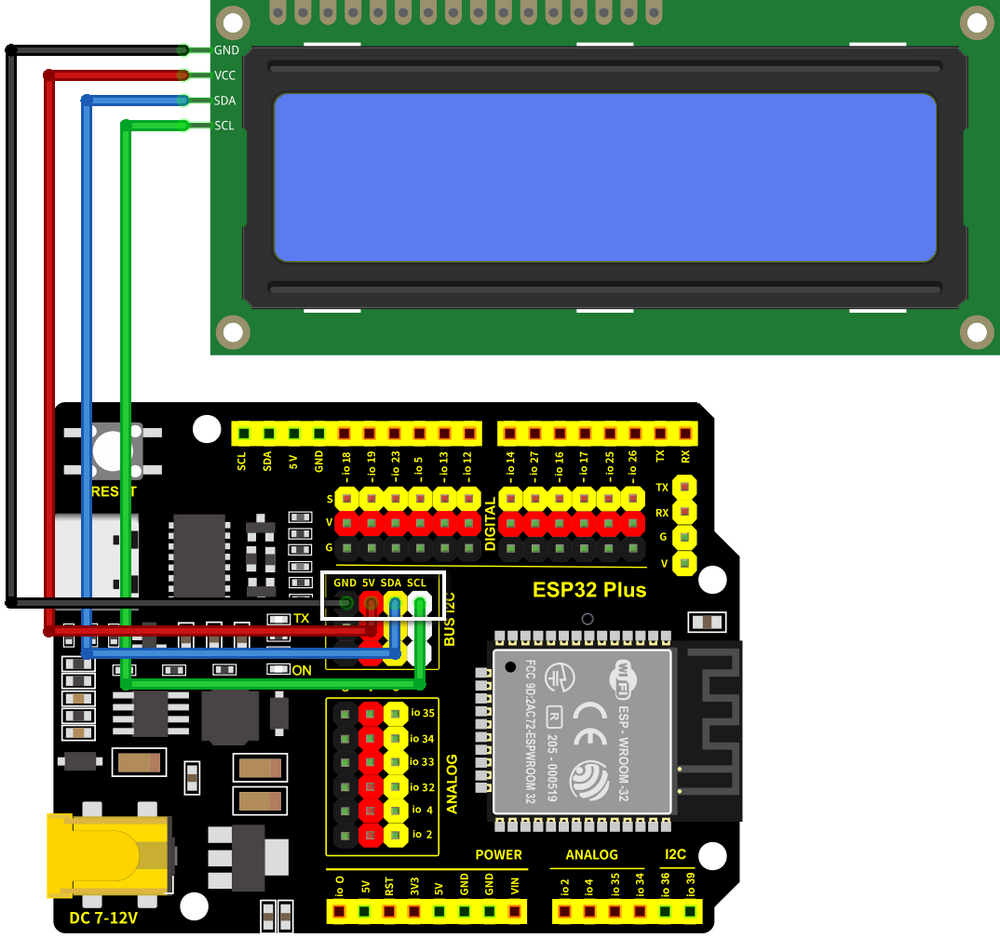

--------------

**Test Code:**

-  Initialize I2C address of LCD and turn on its back light.

   .. image:: ./scratch_img/st92.png
      :alt: img

-  Set the LCD cursor position in X and Y axis (X-axis displays a
   maximum of 16 characters, and Y-axis displays a maximum of 2
   columns).

   .. image:: ./scratch_img/st93.png
      :alt: img

-  Input the print content (No more than 16 characters, otherwise it
   will not be complete).

   .. image:: ./scratch_img/st94.png
      :alt: img

Complete code:

.. image:: ./scratch_img/st95.png
   :alt: img

**Test Result:**

LCD1602 opens its back light and displays ”\ **HELLO WORLD 0**\ “ and
”\ **HELLO WORLD 1**\ “.

.. image:: ./scratch_img/cou78.png
   :alt: img

--------------

.. _4.7.4-Fan-Module:

4.7.4 Fan Module
^^^^^^^^^^^^^^^^

**Description:**

130 Motor is able to adjust speed via PWM. In the process, two pins are
needed to be connected for controlling.

The module is suitable for multiple applications, such as computer heat
dissipation and industrial production. What's more it is compact and
easy to install, which is very practical.

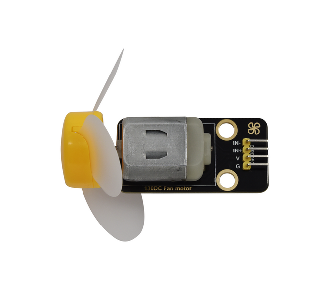

--------------

**Schematic Diagram:**

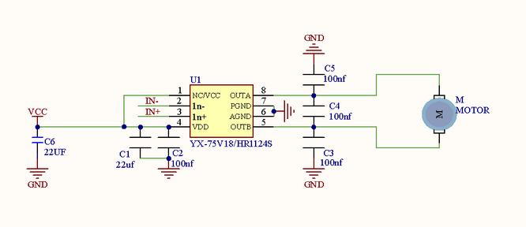

--------------

**Wiring Diagram:**

**Connect the motor to io18 and io19.**

**Attention: Connect yellow to S(Signal), red to V(Power), and black to
GND. Do not reverse them!**

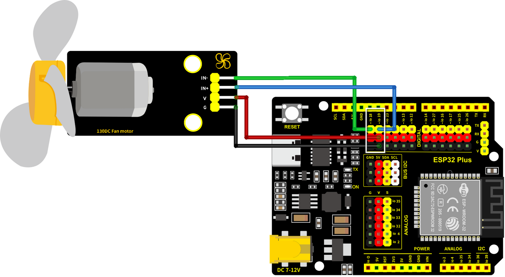

--------------

**Test Code:**

-  Set fan pin **INA**

   .. image:: ./scratch_img/st96.png
      :alt: img

-  Set the power level state of **INA**, which determines the rotation
   direction of fan.

   .. image:: ./scratch_img/st97.png
      :alt: img

-  Set fan pin **INB**.

   .. image:: ./scratch_img/st98.png
      :alt: img

-  Set the analog output at **INB**, which decides the rotation speed.

   -  When INA is at high, the lower the analog output at INB is, the
      faster the fan will rotate.

   -  When INA is at low, the greater the analog output at INB is, the
      faster the fan will rotate.

      .. image:: ./scratch_img/st99.png
         :alt: img

**Test Result:**

130 motor alternatively rotates left and right every 2 seconds.

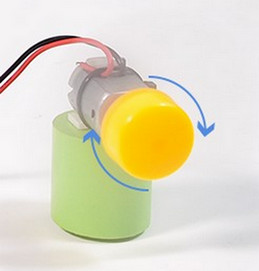

\**NOTE: \*\*

**Intermittent stops exist during changing directions of rotation. They
prevent an excessive current at the moment of reversal. Otherwise, a
forced reset may occur due to insufficient power supply on the
development board.**

--------------

.. _4.7.5-Temperature-Control-System:

4.7.5 Temperature Control System
^^^^^^^^^^^^^^^^^^^^^^^^^^^^^^^^

**Description:**

Herein, we read the value of the DHT11 temperature and humidity sensor
through monobus communication, and the values will be displayed on the
LCD. If values exceed the set threshold, the fan will turn on for
dehumidification and cooling to protect the animals and plants in the
farm. Remarkably, this system is easy to install with multiple
functions, such as speed controlling via PWM and data transmission by
monobus.

Overall, it is a practical system that helps farmers monitor and control
the real-time status to improve production efficiency.

--------------

**Wiring Diagram:**

-  **Connect the temperature and humidity sensor to io17.**
-  **Connect motor(fan) modue to io18 and io19**
-  **Connect LCD1602 to BUS I2C.**

**Attention: Connect yellow to S(Signal), red to V(Power), and black to
GND. Do not reverse them!**

.. image:: ./scratch_img/couj74.png
   :alt: img

--------------

**Test Code:**

Code Flow:

.. image:: ./scratch_img/flo7.png
   :alt: img

Code:

-  Initialize LCD to set an address, and clear the display. Turn on its
   backlight and set cursor position:

   .. image:: ./scratch_img/st100.png
      :alt: img

-  Initialize the DHT11 sensor and choose a corresponding pin. Define
   two variables as temperature and humidity values.

   .. image:: ./scratch_img/st101.png
      :alt: img

-  In the loop, respectively assign the detected values to the two
   variables.

   .. image:: ./scratch_img/st102.png
      :alt: img

-  Display the values on LCD.

   .. image:: ./scratch_img/st103.png
      :alt: img

-  Determine the temperature and humidity value. if temperature is
   higher than 29° or humidity exceeds 80, fan will rotate.

   .. image:: ./scratch_img/st104.png
      :alt: img

Complete code:

.. image:: ./scratch_img/st105.png
   :alt: img

**Test Result:**

When the temperature reaches 29°C, the fan will turn on to dissipate
heat. When it is lower than 29°C, the fan will turn off (the fan just
simulates heat dissipation, so the effect is not good), which saves
energy for the farm.

--------------

.. _4.7.6-FAQ:

4.7.6 FAQ
^^^^^^^^^

#Q: Is temperature and humidty sensor waterproof?

A: No. It detects the ambient temperature and humidity (in the air), so
please do not put it in water.

--------------

#Q: ESP32 board is reset when fan rotates.

A: When fan rotates, more current is required than other sensors, hence
voltage and current may fluctuate in the circuit. Especially at the
moment of fan reversal, fluctuations may be too heavy, resulting in a
reset due to extremely low voltage and current in ESP32 development
board.

--------------

.. _4.8-Project:-Soil-Humidity-Monitoring-System:

4.8 Project: Soil Humidity Monitoring System
~~~~~~~~~~~~~~~~~~~~~~~~~~~~~~~~~~~~~~~~~~~~

--------------

**Pay attention! Do not overflow water from plastic pools in
experiments. Spilling water on other sensors may cause not only a short
circuit or modules to be out of work but also heat generation and even
explosion. Do be extra careful! Especially for younger users, please
operate with your parents. To guarantee security, please obey guidances
and safety regulations.**

--------------

.. image:: ./scratch_img/cout8.png
   :alt: img

--------------

.. _4.8.1-Flow-Diagram:

4.8.1 Flow Diagram
^^^^^^^^^^^^^^^^^^

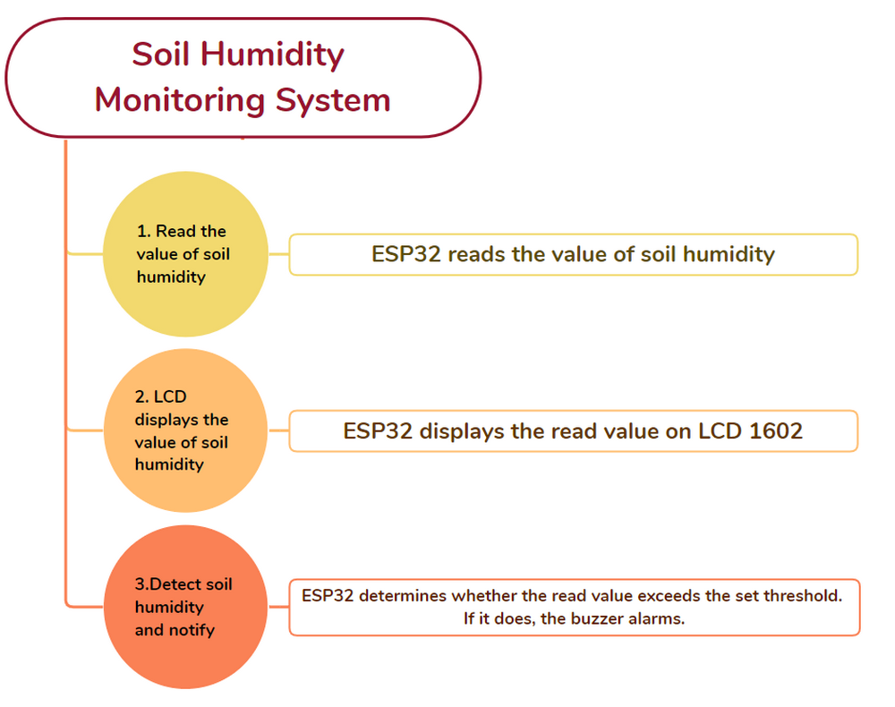

--------------

.. _4.8.2-Soil-Humidity-Sensor:

4.8.2 Soil Humidity Sensor
^^^^^^^^^^^^^^^^^^^^^^^^^^

**Description:**

Soil humidity sensors are mainly used to measure water content in
volumetric soil, monitor soil moisture, irrigate crops and protect
forests. This kind of sensor is integrated in agricultural irrigation
system to supply water regularly and efficiently, which optimize
irrigation for a best plant growth.

.. image:: ./scratch_img/cou81.png
   :alt: img

--------------

**Schematic Diagram:**

.. image:: ./scratch_img/couy81.png
   :alt: img

--------------

**Wiring Diagram:**

**Connect the soil humidity sensor to io32.**

**Attention: Connect yellow to S(Signal), red to V(Power), and black to
GND. Do not reverse them!**

.. image:: ./scratch_img/couj81.png
   :alt: img

--------------

**Test Code:**

-  Initialize the serial port.

   .. image:: ./scratch_img/st106.png
      :alt: img

-  Print the read sensor value.

   .. image:: ./scratch_img/st107.png
      :alt: img

Complete code:

.. image:: ./scratch_img/st108.png
   :alt: img

**Test Result:**

Open the serial monitor.

Touch the detection area of the sensor with a wet finger and the
currently detected humidity value will be printed on the monitor (range:
0~4095).

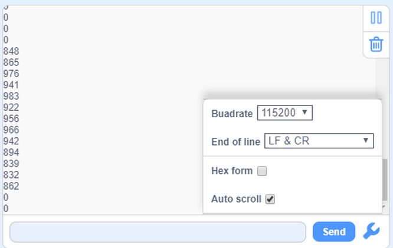

--------------

.. _4.8.3-Soil-Humidity-Monitoring-System:

4.8.3 Soil Humidity Monitoring System
^^^^^^^^^^^^^^^^^^^^^^^^^^^^^^^^^^^^^

We adopt LCD1602 to reveal the real-time value of soil humidity value.
When the value is lower than the set minimum humidity, the buzzer will
emit sound to prompt farmers of irrigation.

**Wiring Diagram:**

-  **Connect the soil humidity sensor to io32.**
-  **Connect the buzzer to io16.**
-  **Connect the LCD1602 to BUS I2C.**

**Attention: Connect yellow to S(Signal), red to V(Power), and black to
GND. Do not reverse them!**

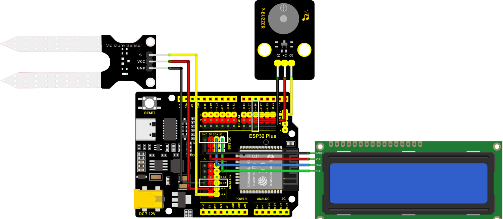

--------------

**Test Code:**

Code Flow:

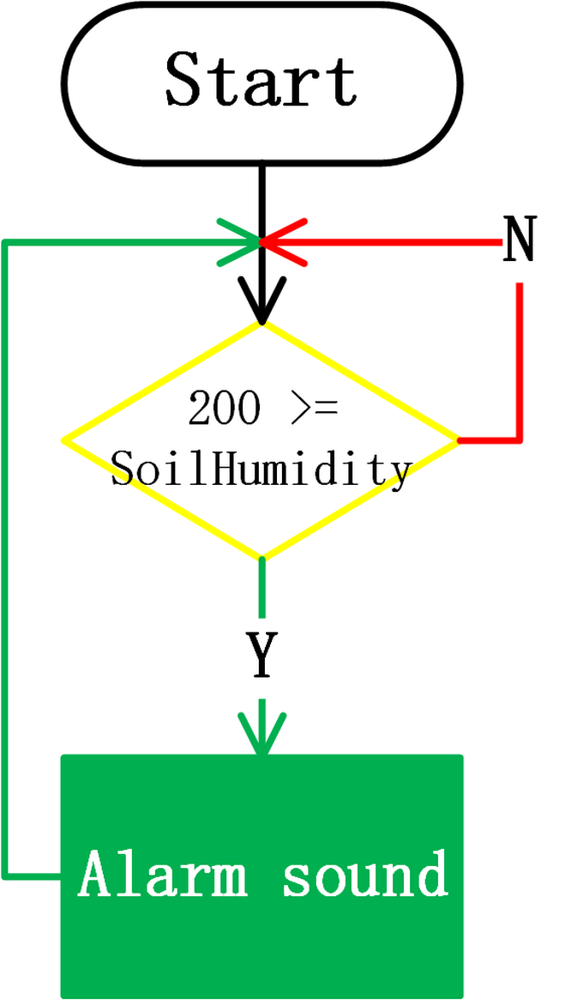

Code:

-  Initialize LCD and clear its display. Turn on the back light to
   observe the displayed value.

   .. image:: ./scratch_img/st110.png
      :alt: img

-  Initialize the serial port and define a variable.

   .. image:: ./scratch_img/st111.png
      :alt: img

-  Read the value of the soil humidity value and assign it to the
   variable. LCD shows the value.

   .. image:: ./scratch_img/st112.png
      :alt: img

-  Determine the read value. If it is lower than 200, the buzzer will
   alarm.

   .. image:: ./scratch_img/st113.png
      :alt: img

Complete code:

.. image:: ./scratch_img/st114.png
   :alt: img

**Test Result:**

When the value detected by the soil humidity sensor is lower than the
set threshold, the buzzer emits sound to alarm.

--------------

.. _4.8.4-FAQ:

4.8.4 FAQ
^^^^^^^^^

Q: Is soil humidity sensor waterproof?

A: With the exception of the detection area, the sensor is not
waterproof. Spilling water on other area may result in a short circuit.

--------------

.. _4.9-Project:-Water-Level-Monitoring-System:

4.9 Project: Water Level Monitoring System
~~~~~~~~~~~~~~~~~~~~~~~~~~~~~~~~~~~~~~~~~~

--------------

**Pay attention! Do not overflow water from plastic pools in
experiments. Spilling water on other sensors may cause not only a short
circuit to disturb normal operations but also heat generation and even
explosion. Do be extra careful! Especially for younger users, please
operate with your parents. To guarantee security, please obey guidances
and safety regulations.**

--------------

.. _4.9.1-Flow-Diagram:

4.9.1 Flow Diagram
^^^^^^^^^^^^^^^^^^

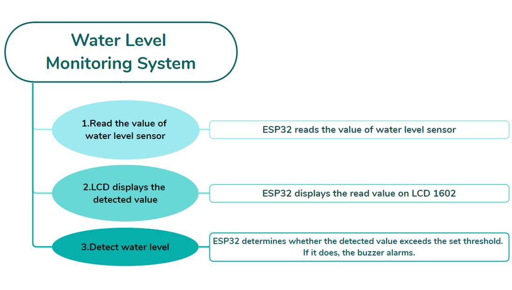

--------------

.. _4.9.2-Water-Level-Sensor:

4.9.2 Water Level Sensor
^^^^^^^^^^^^^^^^^^^^^^^^

**Description:**

The water level sensor is easy to use, portable and cost effective. It
integrates a series of exposed parallel lines to measure the volume of
water and droplets. Not only is the sensor smaller and smarter than
other water detectors, but it also features:

-  Smooth transition between water volume and analog volume;
-  Strong flexibility. The sensor outputs basic analog values;
-  Low power consumption and high sensitivity;
-  Directly connect to microprocessors or circuits, and is suitable for
   various development boards and controllers, such as Arduino
   controllers, STC and AVR single-chip microcomputers.

.. image:: ./scratch_img/cou91.png
   :alt: img

--------------

**Wiring Diagram:**

**Connect the water level sensor to io33.**

**Attention: Connect yellow to S(Signal), red to V(Power), and black to
GND. Do not reverse them!**

.. image:: ./scratch_img/couj91.png
   :alt: img

--------------

**Test Code:**

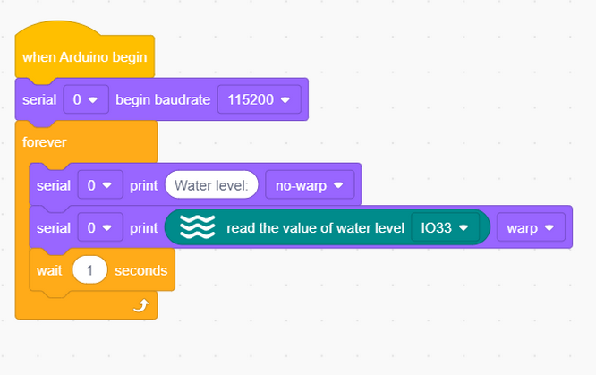

**Test Result:**

Open the serial monitor.

Touch the detection area of the sensor with a wet finger and the
currently detected value will be printed on the monitor (range: 0~4095).

.. image:: ./scratch_img/st116.png
   :alt: img

--------------

.. _4.9.3-Water-Level-Monitoring-System:

4.9.3 Water Level Monitoring System
^^^^^^^^^^^^^^^^^^^^^^^^^^^^^^^^^^^

The water level monitoring system supervises the change of water level
to clarify problems in time and take measures to avoid disasters. It is
widely used in water conservancy projects, urban drainage and
environmental monitoring.

**Wiring Diagram:**

-  **Connect the water level sensor to io33.**
-  **Connect the buzzer to io16.**
-  **Connect the LCD1602 to BUS I2C.**

**Attention: Connect yellow to S(Signal), red to V(Power), and black to
GND. Do not reverse them!**

.. image:: ./scratch_img/couj92.png
   :alt: img

--------------

**Test Code:**

Code Flow:

.. image:: ./scratch_img/flo9.png
   :alt: img

Code:

-  Initialize the LCD and turn on its back light; clear all display and
   then print water level.

   .. image:: ./scratch_img/st117.png
      :alt: img

-  Define a variable as the detected water level.

   .. image:: ./scratch_img/st118.png
      :alt: img

-  Read the sensor value and display it on LCD.

   .. image:: ./scratch_img/st119.png
      :alt: img

-  Determine the water level value. If it is greater than 2000, the
   buzer will alarm.

   .. image:: ./scratch_img/st120.png
      :alt: img

Complete code:

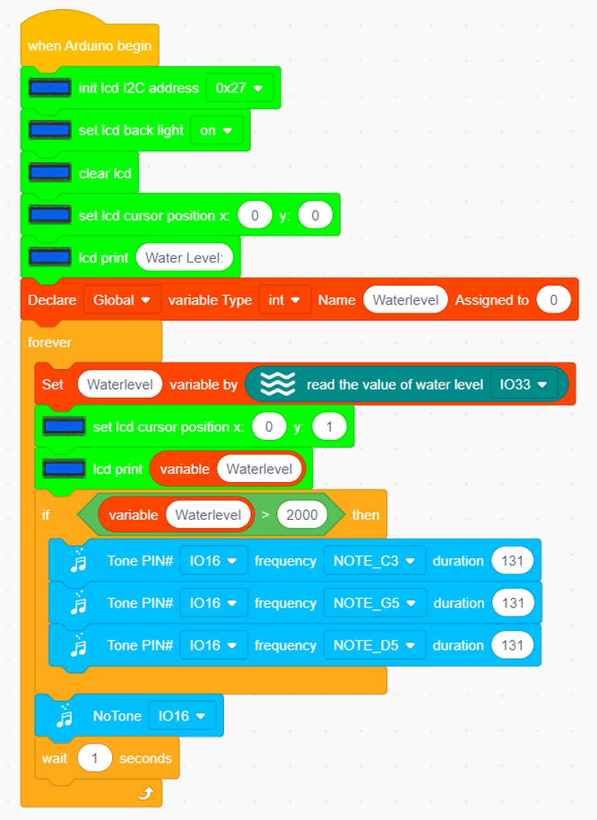

**Test Result:**

LCD displays the real-time value of water level. In the experiment, we
cover the detection area with water to stimulate the water level. When
the detected value exceeds the threshold, the buzzer starts to alarm.

--------------

.. _4.9.4-FAQ:

4.9.4 FAQ
^^^^^^^^^

Q: Is water level sensor waterproof?

A: With the exception of the detection area, the sensor is not
waterproof. Spilling water on other area may result in a short circuit.

--------------

.. _4.10-Project:-Auto-Irrigation-System:

4.10 Project: Auto-Irrigation System
~~~~~~~~~~~~~~~~~~~~~~~~~~~~~~~~~~~~

--------------

**Pay attention! Do not overflow water from plastic pools in
experiments. Spilling water on other sensors may cause not only a short
circuit to disturb normal operations but also heat generation and even
explosion. Do be extra careful! Especially for younger users, please
operate with your parents. To guarantee security, please obey guidances
and safety regulations.**

--------------

In this project, we stimulate irrigation via a water pump controlled by
a relay module. Besides, we also determine whether there is water in the
pool through water level sensor, and detect the soil humidity by soil
humidity sensor. In this way, the system will be more intelligent in
controlling the water pump.

.. image:: ./scratch_img/cout10.png
   :alt: img

--------------

.. _4.10.1-Flow-Diagram:

4.10.1 Flow Diagram
^^^^^^^^^^^^^^^^^^^

.. image:: ./scratch_img/image-20230607183214310.png
   :alt: image-20230607183214310

--------------

.. _4.10.2-Water-Pumping-System:

4.10.2 Water Pumping System
^^^^^^^^^^^^^^^^^^^^^^^^^^^

**Description:**

In this experiment, we use ESP32 development board to turn on/off the
water pump by a relay module. A pump lifts water and transports liquids,
and usually is combined with a relay module in usage.

Herein, we connect the relay module and the pump to the ESP32 board, and
program to remotely turn on or off the pump through switching the state
of relay. For how, we determine the state of relay according to the
output value of the module or a preset time.

--------------

**Relay Module:**

In usage, it is often used in the management of high voltage and load
current, say, motors, high-current sensors and high-power lights.

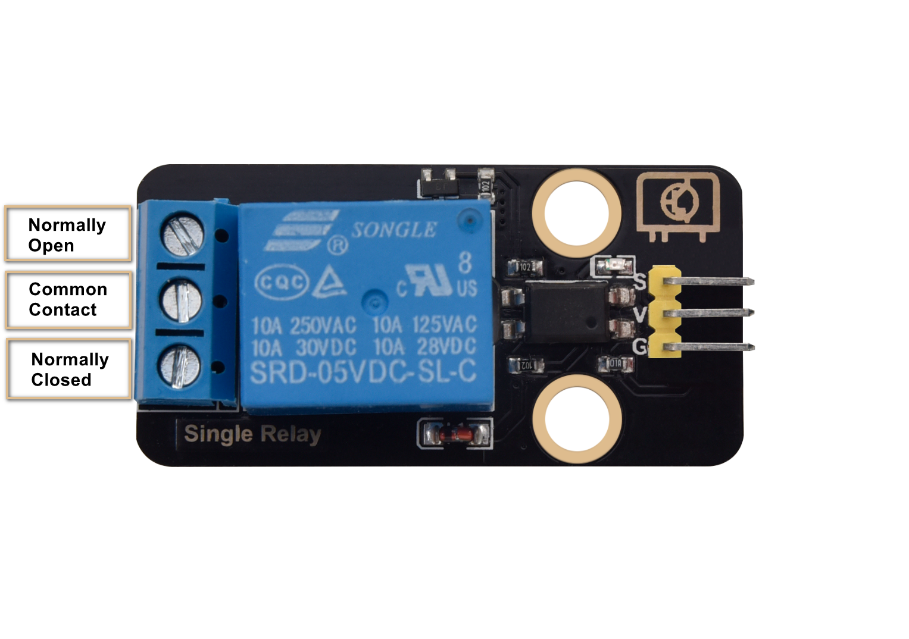

-  **Normally Open (NO):** This pin is normally open, unless a signal is
   received by the signal pin of the relay. Therefore, common pins are
   disconnected via NC pin and connected through NO pin.

-  **Common Contact (COM):** This pin connects to other modules, for
   example, water pump.

   -  Water Pump:

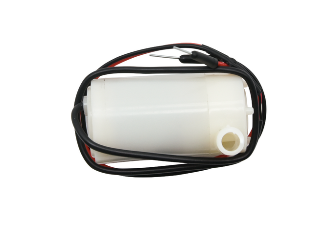

-  **Normally Closed (NC):** NC pin is linked with COM pin to form a
   closed circuit. It uses ESP32 board to control the closure and the
   disconnection of the relay module.

--------------

**Parameters:**

-  Power voltage: 5V
-  Static current: 2mA
-  Maximum contact voltage: 250VAC/30VDC
-  Maximum current: 10A

**Schematic Diagram:**

.. image:: ./scratch_img/couy101.png
   :alt: img

--------------

**Wiring Diagram:**

**Attention: Connect yellow to S(Signal), red to V(Power), and black to
GND. Do not reverse them!**

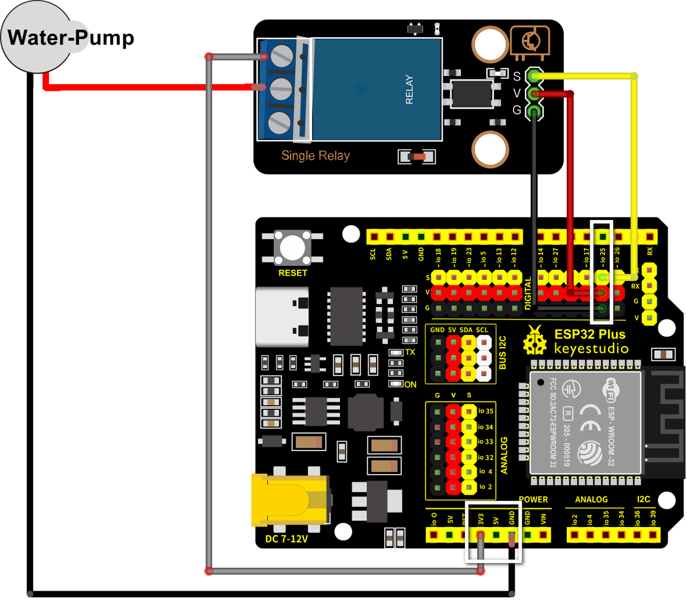

--------------

**Test Code:**

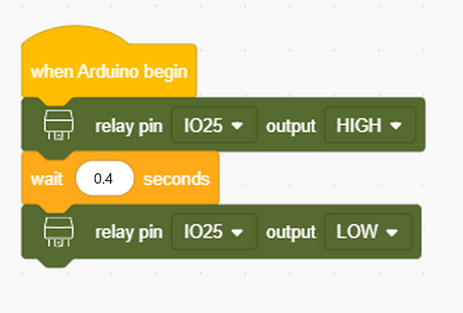

**Test Result:**

After uploading code, the device will pump water once.

In this experiment, the water pump is automatized, reducing time and
efforts of manual operation and improving efficiency. Therefore, this
water pumping system is wildly used in agricultural production and water
treatment.

--------------

.. _4.10.3-Auto-Irrigation-System:

4.10.3 Auto-Irrigation System
^^^^^^^^^^^^^^^^^^^^^^^^^^^^^

**Description:**

In this experiment, we implement a smart irrigation system by a soil
humidity sensor, a water level sensor, a relay module and a water pump.
We connect the two sensors on ESP32 development board and program to
read their output values to control the relay and water pump.

If the soil is very dry, the relay will turn on to control the water
pump to irrigate plants; And if the water level is too low, the water
pump will not be able to work, and the buzzer will alarm. In this way,
plant watering and water level controlling are automatized, which raises
production efficiency and reduces the time and efforts of manual
operations.

--------------

**Wiring Diagram:**

-  **Connect the relay module to io25; connect its NC pin to the
   GND(black) at io2.**
-  **Water pump:**

   -  **Connect the red wire to POWER 3V3 of the board**
   -  **Connect the black wire(GND) to the COM pin of the relay**

-  **Connect the soil humidity sensor to io32**
-  **Connect the water level sensor to io33**

**Attention: Connect yellow to S(Signal), red to V(Power), and black to
GND. Do not reverse them!**

.. image:: ./scratch_img/couj102.png
   :alt: img

--------------

**Test Code:**

Code Flow:

.. image:: ./scratch_img/flo10.png
   :alt: img

Code:

-  Initialize and clear the LCD, turn on the LCD back light. Define two
   variables as the detected sensor values.

   .. image:: ./scratch_img/st123.png
      :alt: img

-  Assign the two read sensor values to those variables.

   .. image:: ./scratch_img/st124.png
      :alt: img

-  Display these values on LCD.

   .. image:: ./scratch_img/st125.png
      :alt: img

-  If the water level value is lower than 700 or the soil humidity value
   is less than 1200, the buzzer will alarm.

   .. image:: ./scratch_img/st126.png
      :alt: img

-  When the soil humidity value is lower than 1200 but the water level
   value is greater than 700, the water pump will automatically irrigate
   the farm.

   .. image:: ./scratch_img/st127.png
      :alt: img

Complete code:

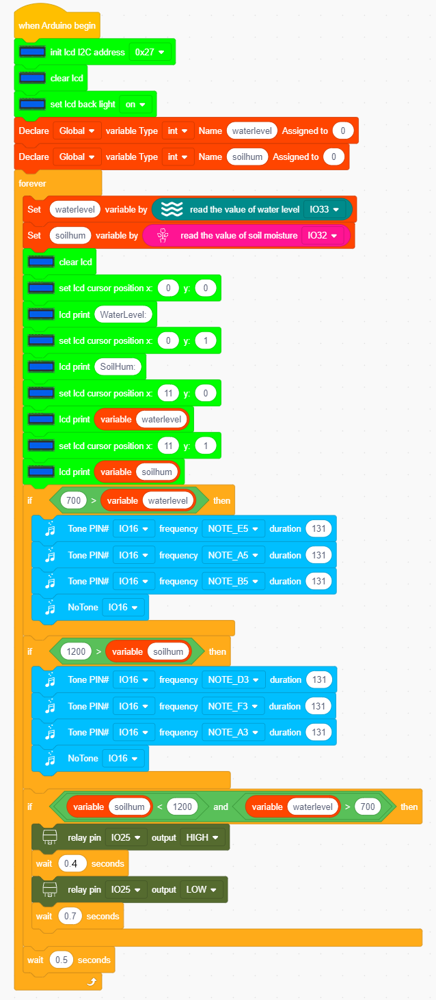

**Test Result:**

.. image:: ./scratch_img/cou102.png
   :alt: img

-  LCD 1602 will display the current values of soil humidity and water
   level. When the detected humidity is lower than the set threshold, it
   implies that the soil is being arid, and irrigation starts
   automatically.
-  When the detected water level is lower than the set threshold, the
   water pumping system doesn't work, and the buzzer alarms to notify
   that water is insufficient.
-  Press the button to stop alarming.

--------------

**To sum up, we have achieved an analog auto-irrigation system in this
project, which intelligently controls the on and off of the water pump
according to the water level. In application, this system usually goes
for household and agricultural production.**

--------------

.. _4.10.4-FAQ:

4.10.4 FAQ
^^^^^^^^^^

Q: Are the modules waterproof?

A: The relay module is not, yet the water pump is. The waterproof grade
of the water pump is IP68.

--------------

Q: ESP32 board is reset when the water pump works.

A: When water pump works, more current is required than other modules,
hence voltage and current may fluctuate in the circuit. Sometimes
fluctuations may be too heavy, resulting in a reset due to extremely low
voltage and current in ESP32 development board.

When operating the water pump, please follow the example code:

.. image:: ./scratch_img/st127.png
   :alt: img

--------------

Q: Fail to pump water?

A: Several pumping operations are required to fill the water pump before
using it. These initial pumpings do not actually draw the water, but to
introduce sufficient water into the pump. Only after the pump is full
can water be carried out. So we are first for filling, not pumping.

--------------

.. _4.11-Project:-WIFI-Control-Smart-Farm:

4.11 Project: WIFI Control Smart Farm
~~~~~~~~~~~~~~~~~~~~~~~~~~~~~~~~~~~~~

--------------

**Pay attention! Do not overflow water from plastic pools in
experiments. Spilling water on other sensors may cause a short circuit
or modules to be out of work. If batteries get wet, even explosion may
occur. Do be extra careful! For younger users, please operate with your
parents. To guarantee security, please obey guidances and safety
regulations.**

--------------

.. image:: ./scratch_img/cout11.png
   :alt: img

--------------

.. _4.11.1-Flow-Diagram:

4.11.1 Flow Diagram
^^^^^^^^^^^^^^^^^^^

.. image:: ./scratch_img/image-20230608105334194.png
   :alt: image-20230608105334194

--------------

.. _4.11.2-WIFI-Web-Page-Display:

4.11.2 WIFI Web Page Display
^^^^^^^^^^^^^^^^^^^^^^^^^^^^

**Description:**

ESP32 board is equipped with Wi-Fi(2.4G) and Bluetooth(4.2), which
enable it to easily connect to WiFi and communicate with other devices
on the network. What's more, web pages can be displayed in browsers via
ESP32.

.. image:: ./scratch_img/cou111.png
   :alt: img

**Arduino IDE provides you wih library file <WiFi.h>, which support
Wi-Fi configurations and ESP32 Wi-Fi networking monitoring.**

-  **Base station mode** (STA or Wi-Fi client-side mode): In this mode,
   ESP32 connects to the Wi-Fi hotspot (AP).
-  **AP mode** (Soft-AP or Wi-Fi hotspot mode): In this mode, other
   Wi-Fi devices connect to ESP32.
-  **AP-STA mode**: In this mode, ESP32 is a Wi-Fi hotspot as well as a
   Wi-Fi device connecting to another Wi-Fi hotspot.
-  These modes is compatible with multiple safe modes, like WPA, WPA2
   and WEP.
-  It is able to scan for Wi-Fi hotspot, including active and passive
   scan.
-  It supports promiscuous mode to monitor IEEE802.11 Wi-Fi Packets.

--------------

For wifi details, please refer to:

https://docs.espressif.com/projects/esp-idf/en/latest/esp32/api-reference/network/esp_wifi.html

ESPRESSIF official website: https://www.espressif.com.cn/en/home

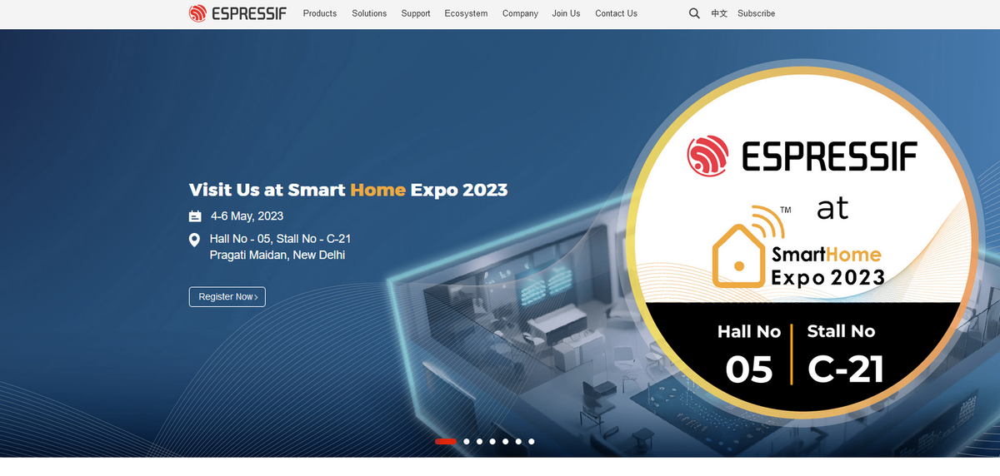

--------------

**Import Library**

-  Click |image26|

-  Click |st131.|\ to choose “\ **Web Page Editing PRO**\ ”, and
   libraries will be loaded.

   .. image:: ./scratch_img/st131.png
      :alt: img

**Test Code:**

-  Connect to the WiFi hotspot, input your SSID and password.

   .. image:: ./scratch_img/st134.png
      :alt: img

-  Display IP address on LCD

   .. image:: ./scratch_img/st135.png
      :alt: img

-  Define a web page components named temperature (unit: ℃)

   .. image:: ./scratch_img/st136.png
      :alt: img

   .. image:: ./scratch_img/st136-1.png
      :alt: img

-  Add a button named "button"

   .. image:: ./scratch_img/st141.png
      :alt: img

   .. image:: ./scratch_img/st141-1.png
      :alt: img

Complete code:

.. image:: ./scratch_img/st137.png
   :alt: img

**Visit the Website**

Once connected to WiFi, you can use the ESP32's web server library to
serve web pages. In the following example, we will create a simple web
page to display a fixed temperature information:

Last but not least, you may open the IP address in browser to visit the
web page. In our example code, please input “http://[IP address of
ESP32]” to visit the website.

**NOTE: When PC, mobile phones and ESP32 board are connected to one
network, you can visit this website at PC and phones at the same time.**

**Here is the ESP32 IP address of your own.**

*PC:*

.. image:: ./scratch_img/st132.png
   :alt: img

*Mobile phone:*

.. image:: ./scratch_img/st133.png
   :alt: img

--------------

.. _4.11.3-WIFI-Control-Smart-Farm:

4.11.3 WIFI Control Smart Farm
^^^^^^^^^^^^^^^^^^^^^^^^^^^^^^

**Code Flow:**

.. image:: ./scratch_img/flo11.png
   :alt: img

--------------

Upload the code.

**SSID** and **PASSWORD** are needed to modify to your wifi name and
password:

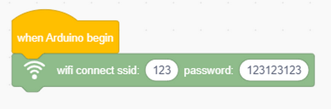

**Complete Code:**

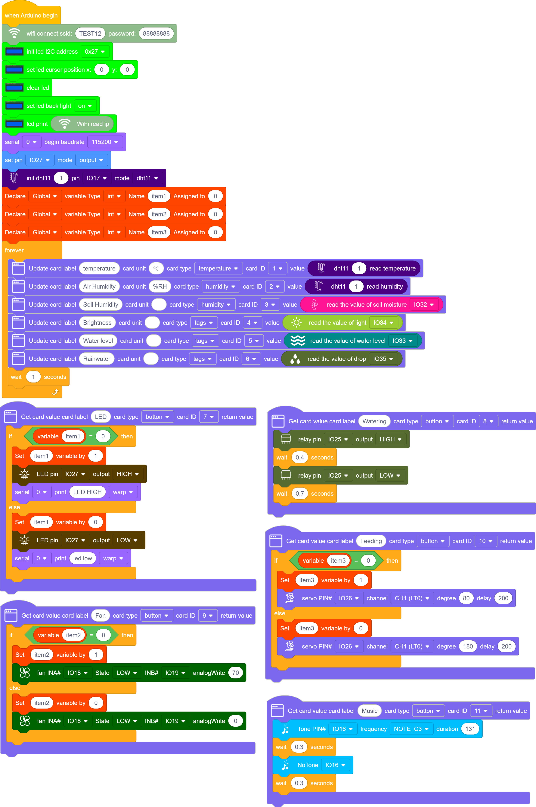

--------------

**Result:**

**PC:**

.. image:: ./scratch_img/st140.png
   :alt: img

**Mobile Phone:**

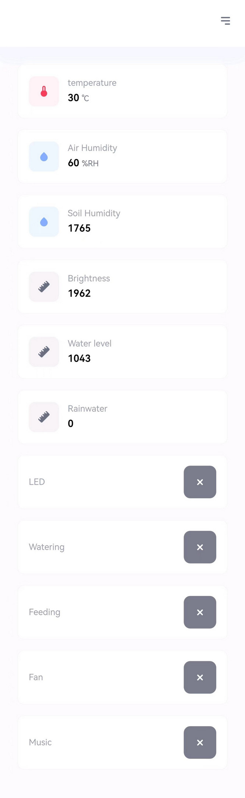

Input the IP address in browsers at mobile phones or PC, you can check
the sensor values and control the LED and fan.

--------------

.. container:: table-wrapper

   =================== ====================
   Sensor Values       Controllable Devices
   =================== ====================
   Temperature (℃)     LED
   Humidity (%rh)      Fan
   Water level (%)     Feeding box
   Rainfall (%)        Water pump
   Brightness (0~4095) 
   Soil humidity (%)   
   =================== ====================

With the ESP32 development board, we have learned how to create a web
page to display the sensor values, like temperature, humidity, water
level and soil humidity, and we can also control LED lights, fans,
feeding boxes and pumps. Moreover, these operations can be remotely
finished through mobile phones or computers.

.. image:: ./scratch_img/cou118.png
   :alt: img

In this project, we stimulate a smart farm with intelligent and remote
management. Such technology facilitates the control of equipments and
improves agricultural efficiency and quality, which make Internet of
Things, informatization, automation and intelligence possible.

--------------

.. _4.11.4-FAQ:

4.11.4 FAQ
^^^^^^^^^^

Q: Wifi always fails to be connected.

A: Move ESP32 to the side of the router and reboot the board, and just
be patient to wait. If it still fails to connected, please check whether
the WiFi name and password are correct.

--------------

Q: The response is slow during remote opterations on web page.

A: Possible reasons:

-  The router CPU resources are insufficient due to multiple
   connections. Please reboot the router to try a reconnection.
-  The router works for a long time. Please reboot the router.
-  Wireless interference. Wireless signal is unstable, so please do not
   use it through the wall.

For knowledge of routers, please Google by yourself.

--------------

Q: Fail to pump water?

A: Several pumping operations are required to fill the water pump before
using it. These initial pumpings do not actually draw the water, but to
introduce sufficient water into the pump. Only after the pump is full
can water be carried out. So we are first for filling, not pumping.

--------------

.. _4.12-Project:-APP-Control-Smart-Farm:

4.12 Project: APP Control Smart Farm
~~~~~~~~~~~~~~~~~~~~~~~~~~~~~~~~~~~~

--------------

**Pay attention! Do not overflow water from plastic pools in
experiments. Spilling water on other sensors may cause a short circuit
or modules to be out of work. If batteries get wet, even explosion may
occur. Do be extra careful! For younger users, please operate with your
parents. To guarantee security, please obey guidances and safety
regulations.**

--------------

.. image:: ./scratch_img/cou121.png
   :alt: img

.. _4.12.1-Description:

4.12.1 Description
^^^^^^^^^^^^^^^^^^

The APP management system is able to monitor multiple real-time index of
the farm, such as temperature and humidity, pool water level, soil
humidity, light intensity and rainfall.

Meanwhile, it also controls LED for lighting, water pump for irrigation,
feeding box for feeding and fan for adjusting temperature and humidity.

.. image:: ./scratch_img/cou122.png
   :alt: img

These functions can be realized via an APP on your phone, facilitating
farm management. For more intelligence, a buzzer also adopted as an
alarm.

--------------

.. _4.12.2-Flow-Diagram:

4.12.2 Flow Diagram
^^^^^^^^^^^^^^^^^^^

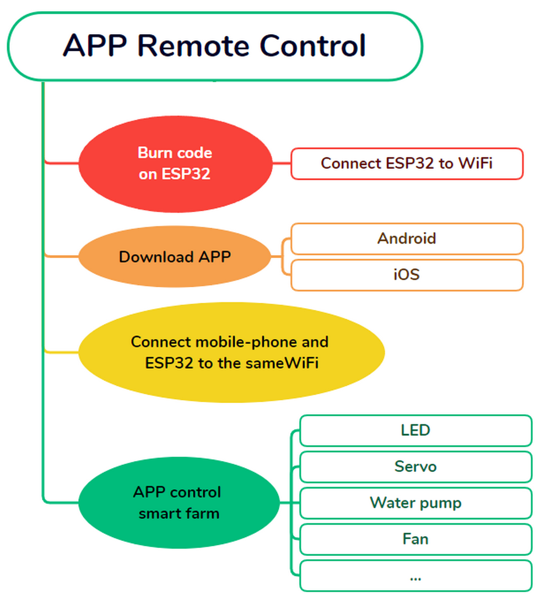

--------------

.. _4.12.3-Test-Code:

4.12.3 Test Code
^^^^^^^^^^^^^^^^

**Code Flow:**

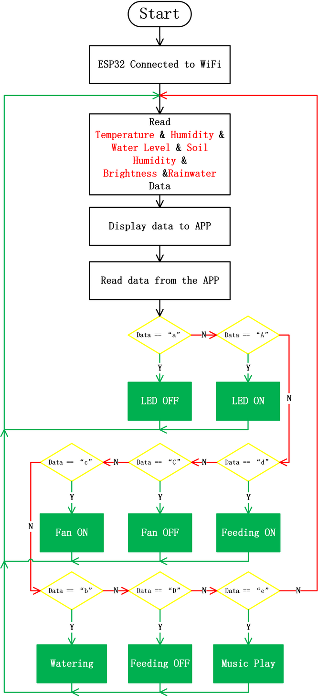

**Burn Code on ESP32:**

-  Connect ESP32 to WiFi. In the following code, **ssid** and **pwd**
   are respectively WiFi name and password

-  LCD displays IP address

   .. image:: ./scratch_img/st135.png
      :alt: img

-  Initialize wifi server. After initialization, ESP32 and APP can
   communicate with each other through WIFI.

   .. image:: ./scratch_img/st142.png
      :alt: img

-  Check whether wifi is connected to client/APP

   .. image:: ./scratch_img/st143.png
      :alt: img

-  Send real time data of sensors to APP:

   .. image:: ./scratch_img/st144.png
      :alt: img

-  ESP32 receives data from APP and determine them. NOTE: All data are
   in the format of String.

   .. image:: ./scratch_img/st145.png
      :alt: img

**Complete Code:**

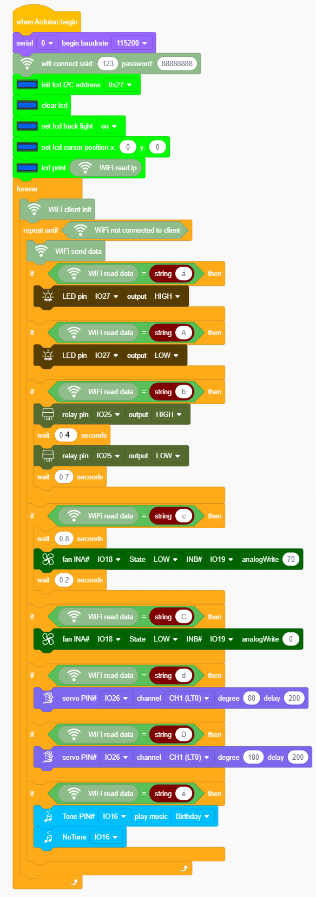

--------------

.. _4.12.4-APP:

4.12.4 APP
^^^^^^^^^^

**APP Download:**

.. image:: ./scratch_img/couapp1.png
   :alt: img

**Android：**

-  Open Google play, and search IOT farm to download.

​ |image27|

-  In provided files, Android apk installing package is included:

   .. image:: ./scratch_img/cou123.png
      :alt: img

I\ **OS：**

Search **IOT farm** in APP Store and tap to download.

--------------

**APP Interface**

.. image:: ./scratch_img/cou124.png
   :alt: img

--------------

**APP Function Description:**

#. When your phone and ESP32 board connect to the same WIFI, you only
   need to input IP address at upper-right conner to link them.

.. image:: ./scratch_img/cou126.png
   :alt: img

2. Displays the temperature value of the farm in real time.

.. image:: ./scratch_img/cou127.png
   :alt: img

3. Displays the humidity value of the farm in real time.

.. image:: ./scratch_img/cou128.png
   :alt: img

4. Displays the soil humidity value of the farm in real time.

5. Displays the sun brightness value of the farm in real time.

.. image:: ./scratch_img/cou1210.png
   :alt: img

6. Displays the water level of the farm in real time.

.. image:: ./scratch_img/cou1211.png
   :alt: img

7. Displays the analog rainfall value of the farm in real time.

8. Control LED.

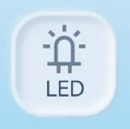

9. Control irrigation via water pump.

.. image:: ./scratch_img/cou1214.png
   :alt: img

10. Control the fan to adjust temperature.

.. image:: ./scratch_img/cou1215.png
   :alt: img

11. Control servo to open or close feeding box.

.. image:: ./scratch_img/cou1216.png
   :alt: img

12. Control buzzer to play music.

.. image:: ./scratch_img/cou1217.png
   :alt: img

--------------

.. _4.12.5-FAQ:

4.12.5 FAQ
^^^^^^^^^^

Q: Wifi always fails to be connected.

A: Move ESP32 to the side of the router and reboot the board, and just
be patient to wait. If it still fails to connected, please check whether
the WiFi name and password are correct.

--------------

Q: APP fails to connect to ESP32.

A: Please make sure that APP and ESP32 are connected to the same WiFi.

--------------

Q: Fail to pump water?

A: Several pumping operations are required to fill the water pump before
using it. These initial pumpings do not actually draw the water, but to
introduce sufficient water into the pump. Only after the pump is full
can water be carried out. So we are first for filling, not pumping.

--------------

--------------

.. _5.-FAQ:

5. FAQ
------

.. _Q:-What-type-of-batteries-should-this-kit-be-equipped-with?:

Q: What type of batteries should this kit be equipped with?
~~~~~~~~~~~~~~~~~~~~~~~~~~~~~~~~~~~~~~~~~~~~~~~~~~~~~~~~~~~

A: Six AA batteries, each one with the diameter of 14MM and height of
49MM. Please install batteries in a correct way and do not reverse them!
For younger learners, please operate under the accompaniment of parents.

.. _Q:-An-error-occurs-when-burning-programs-on-ESP32-mainboard.:

Q: An error occurs when burning programs on ESP32 mainboard.
~~~~~~~~~~~~~~~~~~~~~~~~~~~~~~~~~~~~~~~~~~~~~~~~~~~~~~~~~~~~

A:

-  Please check whether the COM port is correct.
-  Please check whether the selected board is correct.

.. _Q:-Can-this-kit-expands-to-other-modules?:

Q: Can this kit expands to other modules?
~~~~~~~~~~~~~~~~~~~~~~~~~~~~~~~~~~~~~~~~~

A: Yes. When expanding to other modules, please check pin description to
make sure that ESP32 pins work normally.

.. _Q:-An-error-occurs-when-importing-<Wire.h>-library.:

Q: An error occurs when importing <Wire.h> library.
~~~~~~~~~~~~~~~~~~~~~~~~~~~~~~~~~~~~~~~~~~~~~~~~~~~

A: When installing ESP32 development board on arduino IDE, <Wire.h>
library will be imported automatically, so you don't need to add it
repeatedly.

.. |img| image:: ./scratch_img/an1-1.png
.. |image1| image:: ./scratch_img/an1.png
.. |image2| image:: ./scratch_img/an11.png
.. |image3| image:: ./scratch_img/an12.png
.. |image4| image:: ./scratch_img/an13.png
.. |image5| image:: ././scratch_img/an27.png

.. |an42| image:: ././scratch_img/an35.png
.. |image7| image:: ././scratch_img/an39.png
.. |image8| image:: ././scratch_img/an42.png
.. |image9| image:: ././scratch_img/an46.png
.. |image10| image:: ././scratch_img/an47.png
.. |image11| image:: ././scratch_img/an46.png
.. |image12| image:: ././scratch_img/an47.png

.. |image14| image:: ././scratch_img/an56.png
.. |image15| image:: ././scratch_img/an58.png
.. |image16| image:: ././scratch_img/an59.png

.. |image19| image:: ./scratch_img/st11.png
.. |image20| image:: ./scratch_img/st14.png

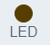

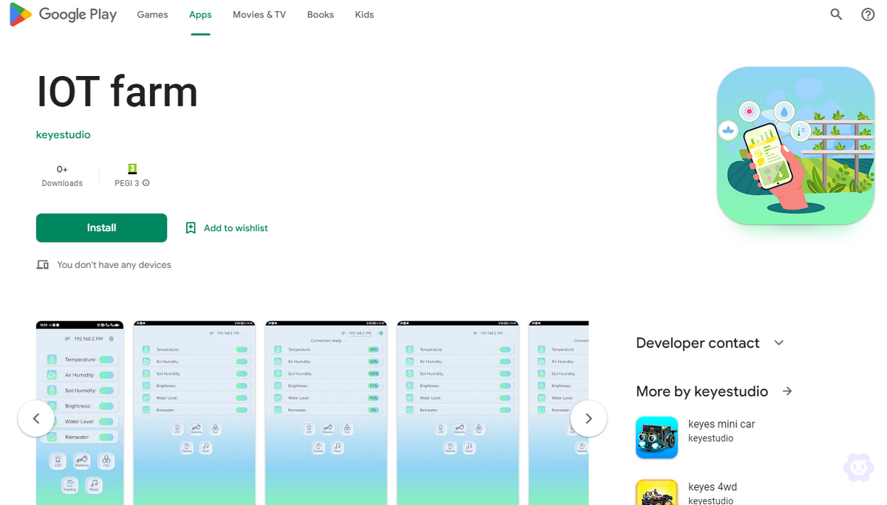
