**Thanks for your appreciation to keyestudio.**

**We will keep devoting ourselves to provide you with good products and services!**

------

**About Keyestudio**

Keyestudio is the best-selling brand of KEYES Corporation. Our products include Arduino development boards, expansion boards, sensors and modules, Raspberry PI, micro:bit expansion boards as well as smart cars, which are committed to learning about Arduino for customers of any level. 

Notably, all of our products are in line with international quality standards and are greatly appreciated in different markets across the world. 

Welcome to check out more contents from our official website:

[http://www.keyestudio.com](http://www.keyestudio.com)

------

**Obtain Information and After-sales Service**

1. Information reference: <https://fs.keyestudio.com/KS0567>

2. If something is found missing or broken, or you have some difficulty learning the kit, please feel free to contact us. Welcome to send email to us: [service@keyestudio.com](http://m.138.gz.cn/webadmin/~CAmsnCrrNXhTAySKCerrIfWjjZuuWVfI/~/usr/mod_edituser.jsp?;uid=service@keyestudio.com;;clearCache=)

3. We will seek to update projects and products continuously from your sincere advice. Thank you! 

------

**Warning**

1. Some of the electronic components, sensors and modules in this product contain tiny pins, please keep them out of reach of children under 7 years old.
2. This product contains conductive parts (control board and electronic module). Please operate according to the requirements of tutorials. Otherwise, improper operation may cause parts to overheat damage. Do not touch and immediately disconnect the circuit power.

------

**Copyright**

The keyestudio trademark and logo are the copyright of KEYES DIY ROBOT co.,LTD. All products under Keyestudio brand can’t be copied, sold and resold without authorization by anyone or company. If you are interested in our products, please contact to our sales representatives: [fennie@keyestudio.com](http://m.138.gz.cn/webadmin/~CAmsnCrrNXhTAySKCerrIfWjjZuuWVfI/~/usr/mod_edituser.jsp?;uid=fennie@keyestudio.com;;clearCache=)

------

# **Keyestudio ESP32 Smart Farm Kit**

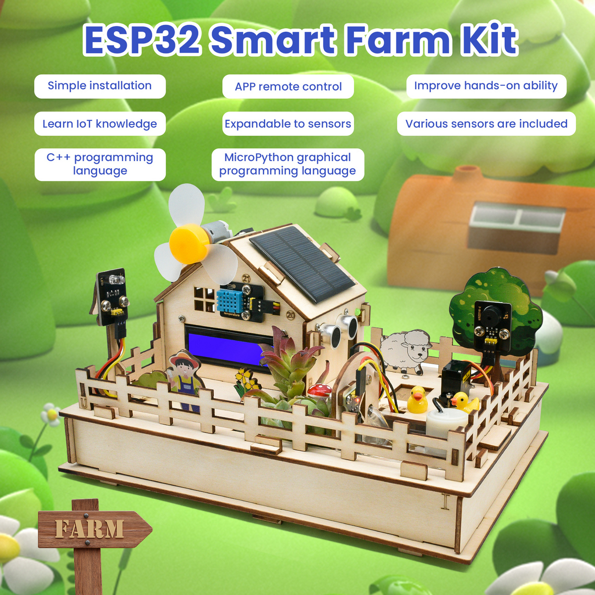

------

## 1. Kit List

**When receiving this kit, please make an inventory according to the list.**

**If something is found missing or broken, or you have some difficulty learning the kit, please feel free to contact us.**

| NO.  |             PIC             |                             NAME                             | QTY  |
| :--: | :-------------------------: | :----------------------------------------------------------: | :--: |
|  1   | 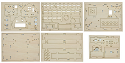 |                       Basswood Board*6                       |  1   |
|  2   | 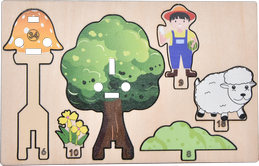  |                 Basswood Board with Patterns                 |  1   |
|  3   |  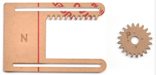  |                        Acrylic Board                         |  1   |
|  4   |  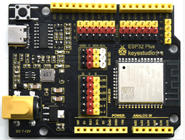  |                 ESP32 PLUS Development Board                 |  1   |
|  5   |  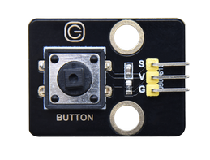  |                        Button Module                         |  1   |
|  6   |  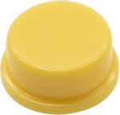  |                  Button Cap (12 * 12 * 7.3)                  |  1   |
|  7   |  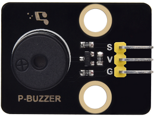  |                        Passive Buzzer                        |  1   |
|  8   |  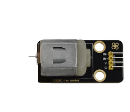  |                          130 Motor                           |  1   |
|  9   |  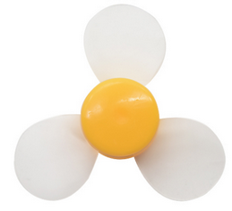  |                             Fan                              |  1   |
|  10  |  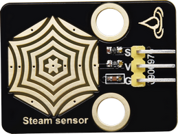  |                         Steam Sensor                         |  1   |
|  11  | 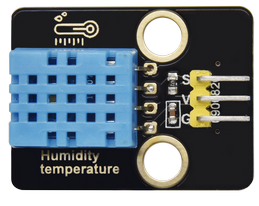  |          DHT11 Temperature and   Humidity Sensor          |  1   |
|  12  | 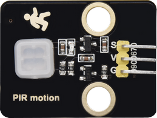  |                      PIR Motion Sensor                       |  1   |
|  13  | 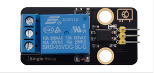  |                       5V Relay Module                        |  1   |
|  14  | 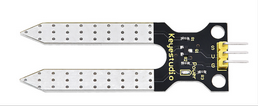  |                     Soil Humidity Sensor                     |  1   |
|  15  | 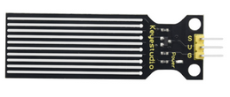  |                      Water Level Sensor                      |  1   |
|  16  | 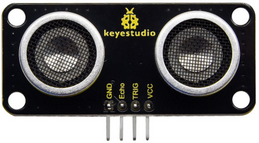  |                  SR01 V3 Ultrasonic Module                   |  1   |
|  17  | 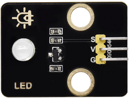  |                       White LED Module                       |  1   |
|  18  | 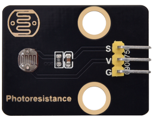  |                        Photoresistor                         |  1   |
|  19  | 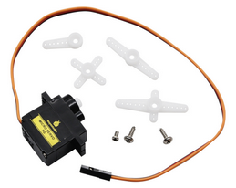  |            9G 180° Servo  (23 * 12.2 * 29mm)             |  1   |
|  20  | 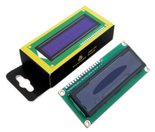  |                     I2C 1602 LCD Display                     |  1   |
|  21  | 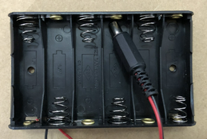  |                   6-slot AA Battery Holder                   |  1   |
|  22  | 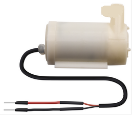  |      DC 3V Water Pump  (With 15CM Breadboard Wire)       |  1   |
|  23  | 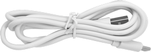  |                       USB Cable TYPE-C                       |  1   |
|  24  | 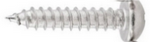  |                 M1.4*6MM Self-Tapping Screw                  |  4   |
|  25  | 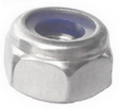  |                         M3 Lock-Nut                          |  4   |
|  26  | 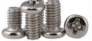  |                   M4*8MM Round Head Screw                    |  18  |
|  27  |   |                   M3*6MM Round Head Screw                    |  8   |
|  28  |   |                   M3*10MM Round Head Screw                   |  16  |
|  29  | 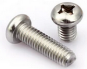  |                   M2*12MM Round Head Screw                   |  2   |
|  30  |   |                            M4 Nut                            |  18  |
|  31  | 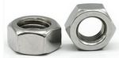  |                            M3 Nut                            |  12  |
|  32  |   |                            M2 Nut                            |  2   |
|  33  | 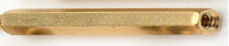  |               M3*10MM Dual-Pass Copper Pillar                |  4   |
|  34  | 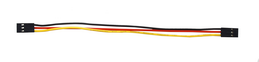  | 15cm 3P F-F DuPont Wires  (Connected, 26AWG, Black-Red-Yellow) |  4   |
|  35  | 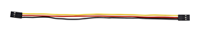  | 20cm 3P F-F DuPont Wires  (Connected, 26AWG, Black-Red-Yellow) |  5   |
|  36  |   | 25cm 3P F-F DuPont Wires  (Connected, 26AWG, Black-Red-Yellow) |  1   |
|  37  | 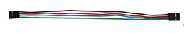  | 20cm 4P F-F DuPont Wires  (Connected, 26AWG, Black-Red-Blue-Green) |  1   |
|  38  |   | 20cm 4P F-F DuPont Wires  (Divided, 26AWG, Black-Green-Blue-Red) |  1   |
|  39  |   | 20cm 4P F-F DuPont Wires  (Divided, 26AWG, Black-Red-Blue-Green) |  1   |
|  40  | 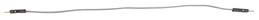  |                  15CM 40P M-F DuPont Wires                   |  2   |
|  41  | 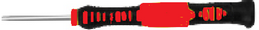  |                3.0*40MM Phillips Screwdriver                 |  1   |
|  42  |   |                     Slotted Screwdriver                      |  1   |
|  43  | 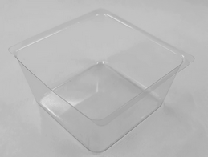  |                         Plastic Box                          |  2   |
|  44  |   |                       Water Pump Pipe                        | 6cm  |
|  45  | 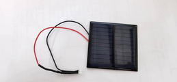  |                         Solar panel                          |  1   |
|  46  | 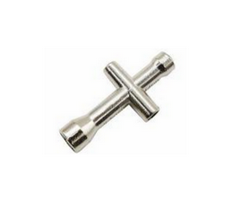  |                         Cross Wrench                         |  1   |
|  47  | 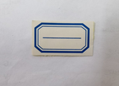  |                           Stickers                           |  1   |

------

## 2. Introduction

- Based on ESP32 Internet of Things, this Smart Farm Kit integrates multiple sensors, realizing automatic and wireless manipulation as well as intellectual management.

- In this tutorial, our projects comprehensively apply all sensors and modules in the kit, like photoresistor, soil humidity sensor, water level sensor and ESP32 wireless communication module. As a result, by learning this tutorial, you can possess the knowledge that how to use sensors and construct IOT system and that how to realize intelligence in farm management through programming.

- What’s more, we provide detailed courses and example codes for you to deeply understand and master knowledge. In this way, it can not only improve the hands-on capability and creativity, but also cultivate the awareness of scientific and technological innovation as well as the ability of problem-solving.

## 3. Features

1. Comprehensive: This kit includes multiple modules related to smart farms, such as photoresistor, soil humidity sensor, water level sensor, as well as ESP32 module. So, you can master the knowledge of various sensors and wireless communication during learning.
2. Practical: Through experiments, you may deeply understand how each sensor works and how it collects and processes data. These knowledge helps you build an intelligent farm system.
3. Innovative: Detailed tutorials are provided: experimental instructions, video guidance and example codes. By learning and practicing, you can understand the application of the Internet of Things and sensing-tech in agriculture, which cultivates technological innovation and problem-solving ability.
4. Flexible: With ESP32 as its main control board, this kit enjoys splendid flexibility and scalability. Thus, You can create its design at will, which expands your knowledge and abilities.
5. Interactive: To improve learning, this kit offers an experiment platform and community for you to share experiences and communicate with others. Meanwhile, it also supplies a wealth of experimental cases and practices to stimulate your learning enthusiasm and enhance the ability to understand and apply knowledge.

------

## 4. Parameters

Working Voltage: 5V

Battery Voltage: 9V

Maximum Output Current: ≤1.5A

Maximum Power Consumption: ≤10W

WiFi Working Principle: 2.4G

Bluetooth Protocol: v4.2 Full Standard

Dimension: 255*185\*130mm±1%

Working Temperature: –10°C ~ +65°C

For the detailed parameters of ESP32 development board, please refer to: 

[https://wiki.keyestudio.com/KS5016_Keyestudio_ESP32_PLUS_Development_Board](https://wiki.keyestudio.com/KS5016_Keyestudio_ESP32_PLUS_Development_Board)

------

## 5. Resources

Keyestudio official website: 

[https://www.keyestudio.com/](https://www.keyestudio.com/)

Keyestudio wiki main page:

[https://wiki.keyestudio.com/Main_Page](https://wiki.keyestudio.com/Main_Page)

ESP32 development board: 

[https://wiki.keyestudio.com/KS5016_Keyestudio_ESP32_PLUS_Development_Board](https://wiki.keyestudio.com/KS5016_Keyestudio_ESP32_PLUS_Development_Board)

Arduino official website: 

[https://www.arduino.cc/](https://www.arduino.cc/)

ESP32 espressif official website: 

[https://www.espressif.com/](https://www.espressif.com/)

------

## 6. Tutorial

[Arduino Tutorial](./Arduino/arduino.md)

[KidsBlock Tutorial](./Scratch/scratch.md)
