**Grazie per il tuo apprezzamento a keyestudio.**

**Continueremo a dedicarci a fornirti buoni prodotti e servizi!**

---

**Informazioni su Keyestudio**

Keyestudio è il marchio più venduto di KEYES Corporation. I nostri prodotti includono schede di sviluppo Arduino, schede di espansione, sensori e moduli, Raspberry PI, schede di espansione micro:bit, nonché auto intelligenti, che si impegnano a far conoscere Arduino a clienti di qualsiasi livello.

In particolare, tutti i nostri prodotti sono in linea con gli standard di qualità internazionali e sono molto apprezzati in diversi mercati in tutto il mondo.

Benvenuti a consultare altri contenuti dal nostro sito web ufficiale:

http://www.keyestudio.com

---

**Ottieni informazioni e servizio post-vendita**

1. Riferimento informazioni: https://fs.keyestudio.com/KS0567

1. Se qualcosa risulta mancante o rotto, o se hai difficoltà nell'apprendimento del kit, non esitare a contattarci. Benvenuti a inviarci un'e-mail: [service@keyestudio.com](http://m.138.gz.cn/webadmin/~CAmsnCrrNXhTAySKCerrIfWjjZuuWVfI/~/usr/mod_edituser.jsp?;uid=service@keyestudio.com;;clearCache=)

1. Cercheremo di aggiornare continuamente progetti e prodotti in base ai tuoi sinceri consigli. Grazie!

---

**Avvertenza**

1. Alcuni dei componenti elettronici, sensori e moduli di questo prodotto contengono piccoli pin, si prega di tenerli fuori dalla portata dei bambini sotto i 7 anni.
1. Questo prodotto contiene parti conduttive (scheda di controllo e modulo elettronico). Si prega di operare secondo i requisiti dei tutorial.
   In caso contrario, un funzionamento improprio potrebbe causare danni da surriscaldamento delle parti. Non toccare e scollegare immediatamente l'alimentazione del circuito.

---

**Copyright**

Il marchio e il logo keyestudio sono copyright di KEYES DIY ROBOT co.,LTD. Tutti i prodotti a marchio Keyestudio non possono essere copiati, venduti e rivenduti senza autorizzazione da parte di nessuno o di alcuna azienda. Se sei interessato ai nostri prodotti, contatta i nostri rappresentanti di vendita: [fennie@keyestudio.com](http://m.138.gz.cn/webadmin/~CAmsnCrrNXhTAySKCerrIfWjjZuuWVfI/~/usr/mod_edituser.jsp?;uid=fennie@keyestudio.com;;clearCache=)

---

# **Kit Fattoria Intelligente Keyestudio ESP32**

---

## 1. Elenco del Kit

**Quando ricevi questo kit, fai un inventario secondo l'elenco.**

**Se qualcosa risulta mancante o rotto, o se hai difficoltà nell'apprendimento del kit, non esitare a contattarci.**

| NO. | PIC | NOME | QTY |
| --- | --- | --- | --- |
| 1 | 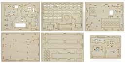 | Tavola di Tiglio*6 | 1 |
| 2 |  | Tavola di Tiglio con Motivi | 1 |
| 3 |  | Tavola Acrilica | 1 |
| 4 | 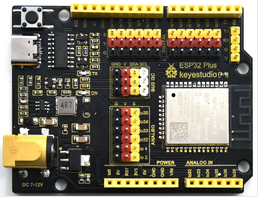 | Scheda di Sviluppo ESP32 PLUS | 1 |
| 5 |  | Modulo Pulsante | 1 |
| 6 | 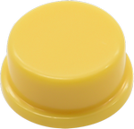 | Cappuccio Pulsante (12 * 12 * 7.3) | 1 |
| 7 | 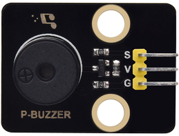 | Buzzer Passivo | 1 |
| 8 | 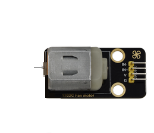 | Motore 130 | 1 |
| 9 | 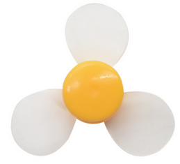 | Ventola | 1 |
| 10 |  | Sensore di Vapore | 1 |
| 11 | 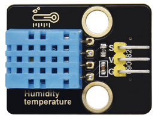 | Sensore di Temperatura e Umidità DHT11 | 1 |
| 12 | 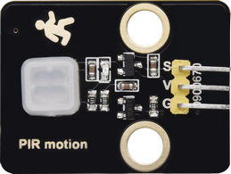 | Sensore di Movimento PIR | 1 |
| 13 | 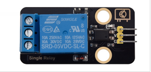 | Modulo Relè 5V | 1 |
| 14 | 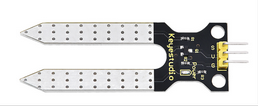 | Sensore di Umidità del Suolo | 1 |
| 15 | 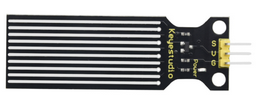 | Sensore di Livello dell'Acqua | 1 |
| 16 |  | Modulo Ultrasuoni SR01 V3 | 1 |
| 17 | 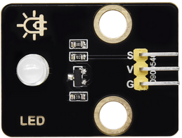 | Modulo LED Bianco | 1 |
| 18 | 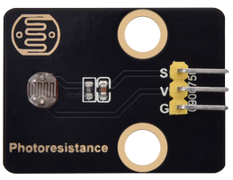 | Fotoresistore | 1 |
| 19 | 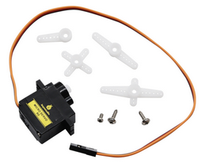 | Servo 9G 180° (23 * 12.2 * 29mm) | 1 |
| 20 | 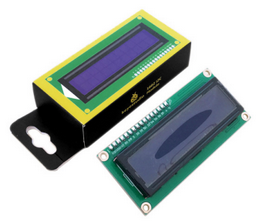 | Display LCD I2C 1602 | 1 |
| 21 |  | Portabatterie AA a 6 slot | 1 |
| 22 |  | Pompa dell'Acqua DC 3V (Con Cavo Breadboard da 15CM) | 1 |
| 23 |  | Cavo USB TIPO-C | 1 |
| 24 | 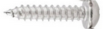 | Vite Autofilettante M1.4*6MM | 6 |
| 25 |  | Dado Autobloccante M3 | 6 |
| 26 | 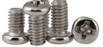 | Vite a Testa Tonda M4*8MM | 18 |
| 27 |  | Vite a Testa Tonda M3*6MM | 8 |
| 28 |  | Vite a Testa Tonda M3*10MM | 16 |
| 29 |  | Vite a Testa Tonda M2*12MM | 2 |
| 30 |  | Dado M4 | 18 |
| 31 |  | Dado M3 | 12 |
| 32 | 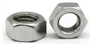 | Dado M2 | 2 |
| 33 |  | Pilastro in Rame a Doppio Passaggio M3*10MM | 4 |
| 34 | 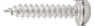 | Vite Autofilettante M1.2*4MM | 4 |
| 35 |  | Cavi DuPont F-F 3P da 15cm (Connessi, 26AWG, Nero-Rosso-Giallo) | 4 |
| 36 | 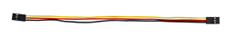 | Cavi DuPont F-F 3P da 20cm (Connessi, 26AWG, Nero-Rosso-Giallo) | 5 |
| 37 |  | Cavi DuPont F-F 3P da 25cm (Connessi, 26AWG, Nero-Rosso-Giallo) | 1 |
| 38 |  | Cavi DuPont F-F 4P da 20cm (Connessi, 26AWG, Nero-Rosso-Blu-Verde) | 1 |
| 39 |  | Cavi DuPont F-F 4P da 20cm (Divisi, 26AWG, Nero-Verde-Blu-Rosso) | 1 |
| 40 |  | Cavi DuPont F-F 4P da 20cm (Divisi, 26AWG, Nero-Rosso-Blu-Verde) | 1 |
| 41 |  | Cavi DuPont M-M 40P da 22CM | 1 |
| 42 | 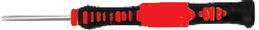 | Cacciavite a Croce 3.0*40MM | 1 |
| 43 |  | Cacciavite a Taglio | 1 |
| 44 | 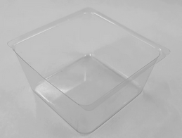 | Scatola di Plastica | 2 |
| 45 | 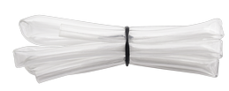 | Tubo Pompa dell'Acqua | 6cm |
| 46 |  | Pannello Solare | 1 |
| 47 | 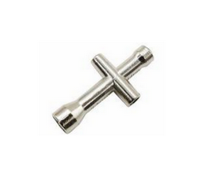 | Chiave a Croce | 1 |
| 48 | 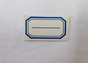 | Adesivi | 1 |

---

## 2. Introduzione

- Basato sull'Internet delle Cose ESP32, questo Smart Farm Kit integra
  sensori multipli, realizzando manipolazione automatica e wireless
  nonché gestione intellettuale.

- In questo tutorial, i nostri progetti applicano in modo completo tutti i sensori e
  i moduli del kit, come fotoresistore, sensore di umidità del suolo, sensore di livello dell'acqua e modulo di comunicazione wireless ESP32. Di conseguenza, imparando questo tutorial, potrai acquisire la conoscenza di come utilizzare
  i sensori e costruire un sistema IoT e di come realizzare l'intelligenza
  nella gestione agricola attraverso la programmazione.

- Inoltre, forniamo corsi dettagliati e codici di esempio per farti
  comprendere e padroneggiare a fondo le conoscenze. In questo modo, non solo può
  migliorare la capacità pratica e la creatività, ma anche coltivare
  la consapevolezza dell'innovazione scientifica e tecnologica, nonché
  la capacità di risoluzione dei problemi.

## 3. Caratteristiche

1. Completo: Questo kit include moduli multipli relativi alle fattorie intelligenti,
   come fotoresistore, sensore di umidità del suolo, sensore di livello dell'acqua,
   nonché modulo ESP32. Così, puoi padroneggiare la conoscenza di
   vari sensori e della comunicazione wireless durante l'apprendimento.
1. Pratico: Attraverso esperimenti, potrai comprendere a fondo come funziona ogni
   sensore e come raccoglie ed elabora i dati. Queste conoscenze
   ti aiutano a costruire un sistema agricolo intelligente.
1. Innovativo: Vengono forniti tutorial dettagliati: istruzioni sperimentali,
   guida video e codici di esempio. Imparando e praticando, puoi
   comprendere l'applicazione dell'Internet delle Cose e della tecnologia di rilevamento
   in agricoltura, che coltiva l'innovazione tecnologica e la capacità di risoluzione dei problemi.
1. Flessibile: Con ESP32 come scheda di controllo principale, questo kit gode di
   splendida flessibilità e scalabilità. Così, puoi creare il suo design
   a piacimento, il che espande le tue conoscenze e abilità.
1. Interattivo: Per migliorare l'apprendimento, questo kit offre una piattaforma
   sperimentale e una comunità per condividere esperienze e comunicare
   con gli altri. Nel frattempo, fornisce anche una ricchezza di casi
   sperimentali e pratiche per stimolare il tuo entusiasmo per l'apprendimento e migliorare
   la capacità di comprendere e applicare le conoscenze.

---

## 4. Parametri

Tensione di lavoro: 5V

Tensione della batteria: 9V

Corrente di uscita massima: ≤1.5A

Consumo energetico massimo: ≤10W

Principio di funzionamento WiFi: 2.4G

Protocollo Bluetooth: v4.2 Full Standard

Dimensioni: 255 * 185 * 130mm±1%

Temperatura di lavoro: –10°C ~ +65°C

Per i parametri dettagliati della scheda di sviluppo ESP32, fare riferimento a:

https://wiki.keyestudio.com/KS5016_Keyestudio_ESP32_PLUS_Development_Board

---

## 5. Download

Link per il download dei file di libreria e dei file di codice del tutorial:

[Clicca per scaricare](./resource.zip)

## 6. Risorse

Sito web ufficiale di Keyestudio:

https://www.keyestudio.com/

Pagina principale della wiki di Keyestudio:

https://wiki.keyestudio.com/Main_Page

Scheda di sviluppo ESP32:

https://wiki.keyestudio.com/KS5016_Keyestudio_ESP32_PLUS_Development_Board

Sito web ufficiale di Arduino:

https://www.arduino.cc/

Sito web ufficiale di ESP32 espressif:

https://www.espressif.com/