**Thanks for your appreciation to keyestudio.**

**We will keep devoting ourselves to provide you with good products and
services!**

--------------

**About Keyestudio**

Keyestudio is the best-selling brand of KEYES Corporation. Our products
include Arduino development boards, expansion boards, sensors and
modules, Raspberry PI, micro:bit expansion boards as well as smart cars,
which are committed to learning about Arduino for customers of any
level.

Notably, all of our products are in line with international quality
standards and are greatly appreciated in different markets across the
world.

Welcome to check out more contents from our official website:

http://www.keyestudio.com

--------------

**Obtain Information and After-sales Service**

1. Information reference: https://fs.keyestudio.com/KS0567

2. If something is found missing or broken, or you have some difficulty
   learning the kit, please feel free to contact us. Welcome to send
   email to us:
   `service@keyestudio.com <http://m.138.gz.cn/webadmin/~CAmsnCrrNXhTAySKCerrIfWjjZuuWVfI/~/usr/mod_edituser.jsp?;uid=service@keyestudio.com;;clearCache=>`__

3. We will seek to update projects and products continuously from your
   sincere advice. Thank you!

--------------

**Warning**

1. Some of the electronic components, sensors and modules in this
   product contain tiny pins, please keep them out of reach of children
   under 7 years old.

2. | This product contains conductive parts (control board and
     electronic module). Please operate according to the requirements of
     tutorials.
   | Otherwise, improper operation may cause parts to overheat damage.
     Do
   | not touch and immediately disconnect the circuit power.

--------------

**Copyright**

The keyestudio trademark and logo are the copyright of KEYES DIY ROBOT
co.,LTD. All products under Keyestudio brand can’t be copied, sold and
resold without authorization by anyone or company. If you are interested
in our products, please contact to our sales representatives:
`fennie@keyestudio.com <http://m.138.gz.cn/webadmin/~CAmsnCrrNXhTAySKCerrIfWjjZuuWVfI/~/usr/mod_edituser.jsp?;uid=fennie@keyestudio.com;;clearCache=>`__

--------------

**Keyestudio ESP32 Smart Farm Kit**
===================================

|image1|

--------------

.. _1-kit-list:

1. Kit List
-----------

**When receiving this kit, please make an inventory according to the
list.**

**If something is found missing or broken, or you have some
difficultylearning the kit, please feel free to contact us.**

+-----+-----------+----------------------------------------------+-----+
| NO. | PIC       | NAME                                         | QTY |
+=====+===========+==============================================+=====+
| 1   | |image50| | Basswood Board*6                             | 1   |
+-----+-----------+----------------------------------------------+-----+
| 2   | |image51| | Basswood Board with Patterns                 | 1   |
+-----+-----------+----------------------------------------------+-----+
| 3   | |image52| | Acrylic Board                                | 1   |
+-----+-----------+----------------------------------------------+-----+
| 4   | |image53| | ESP32 PLUS Development Board                 | 1   |
+-----+-----------+----------------------------------------------+-----+
| 5   | |image54| | Button Module                                | 1   |
+-----+-----------+----------------------------------------------+-----+
| 6   | |image55| | Button Cap (12 \* 12 \* 7.3)                 | 1   |
+-----+-----------+----------------------------------------------+-----+
| 7   | |image56| | Passive Buzzer                               | 1   |
+-----+-----------+----------------------------------------------+-----+
| 8   | |image57| | 130 Motor                                    | 1   |
+-----+-----------+----------------------------------------------+-----+
| 9   | |image58| | Fan                                          | 1   |
+-----+-----------+----------------------------------------------+-----+
| 10  | |image59| | Steam Sensor                                 | 1   |
+-----+-----------+----------------------------------------------+-----+
| 11  | |image60| | DHT11 Temperature and Humidity Sensor        | 1   |
+-----+-----------+----------------------------------------------+-----+
| 12  | |image61| | PIR Motion Sensor                            | 1   |
+-----+-----------+----------------------------------------------+-----+
| 13  | |image62| | 5V Relay Module                              | 1   |
+-----+-----------+----------------------------------------------+-----+
| 14  | |image63| | Soil Humidity Sensor                         | 1   |
+-----+-----------+----------------------------------------------+-----+
| 15  | |image64| | Water Level Sensor                           | 1   |
+-----+-----------+----------------------------------------------+-----+
| 16  | |image65| | SR01 V3 Ultrasonic Module                    | 1   |
+-----+-----------+----------------------------------------------+-----+
| 17  | |image66| | White LED Module                             | 1   |
+-----+-----------+----------------------------------------------+-----+
| 18  | |image67| | Photoresistor                                | 1   |
+-----+-----------+----------------------------------------------+-----+
| 19  | |image68| | 9G 180° Servo (23 \* 12.2 \* 29mm)           | 1   |
+-----+-----------+----------------------------------------------+-----+
| 20  | |image69| | I2C 1602 LCD Display                         | 1   |
+-----+-----------+----------------------------------------------+-----+
| 21  | |image70| | 6-slot AA Battery Holder                     | 1   |
+-----+-----------+----------------------------------------------+-----+
| 22  | |image71| | DC 3V Water Pump (With 15CM Breadboard Wire) | 1   |
+-----+-----------+----------------------------------------------+-----+
| 23  | |image72| | USB Cable TYPE-C                             | 1   |
+-----+-----------+----------------------------------------------+-----+
| 24  | |image73| | M1.4*6MM Self-Tapping Screw                  | 6   |
+-----+-----------+----------------------------------------------+-----+
| 25  | |image74| | M3 Lock-Nut                                  | 6   |
+-----+-----------+----------------------------------------------+-----+
| 26  | |image75| | M4*8MM Round Head Screw                      | 18  |
+-----+-----------+----------------------------------------------+-----+
| 27  | |image76| | M3*6MM Round Head Screw                      | 8   |
+-----+-----------+----------------------------------------------+-----+
| 28  | |image77| | M3*10MM Round Head Screw                     | 16  |
+-----+-----------+----------------------------------------------+-----+
| 29  | |image78| | M2*12MM Round Head Screw                     | 2   |
+-----+-----------+----------------------------------------------+-----+
| 30  | |image79| | M4 Nut                                       | 18  |
+-----+-----------+----------------------------------------------+-----+
| 31  | |image80| | M3 Nut                                       | 12  |
+-----+-----------+----------------------------------------------+-----+
| 32  | |image81| | M2 Nut                                       | 2   |
+-----+-----------+----------------------------------------------+-----+
| 33  | |image82| | M3*10MM Dual-Pass Copper Pillar              | 4   |
+-----+-----------+----------------------------------------------+-----+
| 34  | |image83| | M1.2*4MM Self-Tapping Screw                  | 4   |
+-----+-----------+----------------------------------------------+-----+
| 35  | |image84| | 15cm 3P F-F DuPont Wires (Connected, 26AWG,  | 4   |
|     |           | Black-Red-Yellow)                            |     |
+-----+-----------+----------------------------------------------+-----+
| 36  | |image85| | 20cm 3P F-F DuPont Wires (Connected, 26AWG,  | 5   |
|     |           | Black-Red-Yellow)                            |     |
+-----+-----------+----------------------------------------------+-----+
| 37  | |image86| | 25cm 3P F-F DuPont Wires (Connected, 26AWG,  | 1   |
|     |           | Black-Red-Yellow)                            |     |
+-----+-----------+----------------------------------------------+-----+
| 38  | |image87| | 20cm 4P F-F DuPont Wires (Connected, 26AWG,  | 1   |
|     |           | Black-Red-Blue-Green)                        |     |
+-----+-----------+----------------------------------------------+-----+
| 39  | |image88| | 20cm 4P F-F DuPont Wires (Divided, 26AWG,    | 1   |
|     |           | Black-Green-Blue-Red)                        |     |
+-----+-----------+----------------------------------------------+-----+
| 40  | |image89| | 20cm 4P F-F DuPont Wires (Divided, 26AWG,    | 1   |
|     |           | Black-Red-Blue-Green)                        |     |
+-----+-----------+----------------------------------------------+-----+
| 41  | |image90| | 22CM 40P M-M DuPont Wires                    | 1   |
+-----+-----------+----------------------------------------------+-----+
| 42  | |image91| | 3.0*40MM Phillips Screwdriver                | 1   |
+-----+-----------+----------------------------------------------+-----+
| 43  | |image92| | Slotted Screwdriver                          | 1   |
+-----+-----------+----------------------------------------------+-----+
| 44  | |image93| | Plastic Box                                  | 2   |
+-----+-----------+----------------------------------------------+-----+
| 45  | |image94| | Water Pump Pipe                              | 6cm |
+-----+-----------+----------------------------------------------+-----+
| 46  | |image95| | Solar panel                                  | 1   |
+-----+-----------+----------------------------------------------+-----+
| 47  | |image96| | Cross Wrench                                 | 1   |
+-----+-----------+----------------------------------------------+-----+
| 48  | |image97| | Stickers                                     | 1   |
+-----+-----------+----------------------------------------------+-----+

--------------

.. _2-introduction:

2. Introduction
---------------

- | Based on ESP32 Internet of Things, this Smart Farm Kit integrates
  | multiple sensors, realizing automatic and wireless manipulation as
  | well as intellectual management.

- | In this tutorial, our projects comprehensively apply all sensors and
  | modules in the kit, like photoresistor, soil humidity sensor, water
  | level sensor and ESP32 wireless communication module. As a result,
    by
  | learning this tutorial, you can possess the knowledge that how to
    use
  | sensors and construct IOT system and that how to realize
    intelligence
  | in farm management through programming.

- | What’s more, we provide detailed courses and example codes for you
    to
  | deeply understand and master knowledge. In this way, it can not only
  | improve the hands-on capability and creativity, but also cultivate
  | the awareness of scientific and technological innovation as well as
  | the ability of problem-solving.

.. _3-features:

3. Features
-----------

1. | Comprehensive: This kit includes multiple modules related to smart
   | farms, such as photoresistor, soil humidity sensor, water level
   | sensor, as well as ESP32 module. So, you can master the knowledge
     of
   | various sensors and wireless communication during learning.

2. | Practical: Through experiments, you may deeply understand how each
   | sensor works and how it collects and processes data. These
     knowledge
   | helps you build an intelligent farm system.

3. | Innovative: Detailed tutorials are provided: experimental
   | instructions, video guidance and example codes. By learning and
   | practicing, you can understand the application of the Internet of
   | Things and sensing-tech in agriculture, which cultivates
   | technological innovation and problem-solving ability.

4. | Flexible: With ESP32 as its main control board, this kit enjoys
   | splendid flexibility and scalability. Thus, You can create its
     design
   | at will, which expands your knowledge and abilities.

5. | Interactive: To improve learning, this kit offers an experiment
   | platform and community for you to share experiences and communicate
   | with others. Meanwhile, it also supplies a wealth of experimental
   | cases and practices to stimulate your learning enthusiasm and
     enhance
   | the ability to understand and apply knowledge.

--------------

.. _4-parameters:

4. Parameters
-------------

Working Voltage: 5V

Battery Voltage: 9V

Maximum Output Current: ≤1.5A

Maximum Power Consumption: ≤10W

WiFi Working Principle: 2.4G

Bluetooth Protocol: v4.2 Full Standard

Dimension: 255 \* 185 \* 130mm±1%

Working Temperature: –10°C ~ +65°C

For the detailed parameters of ESP32 development board, please refer to:

https://wiki.keyestudio.com/KS5016_Keyestudio_ESP32_PLUS_Development_Board

--------------

.. _5-download:

5. Download
-----------

Download links for the tutorial's library files and code files:

`Click to download </KS0567/resource.zip>`__

.. _6-resources:

6. Resources
------------

Keyestudio official website:

https://www.keyestudio.com/

Keyestudio wiki main page:

https://wiki.keyestudio.com/Main_Page

ESP32 development board:

https://wiki.keyestudio.com/KS5016_Keyestudio_ESP32_PLUS_Development_Board

Arduino official website:

https://www.arduino.cc/

ESP32 espressif official website:

https://www.espressif.com/

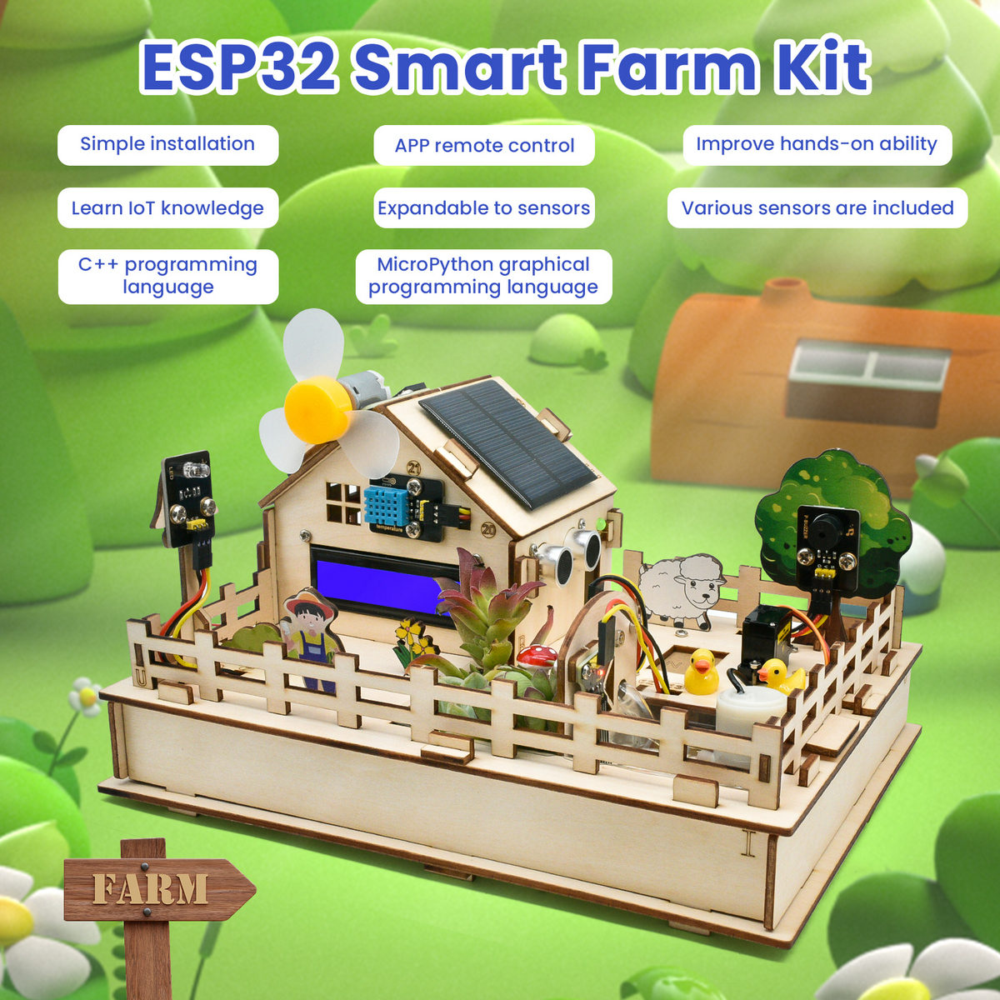
.. |image2| image:: ./media/1-1.png
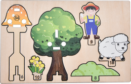
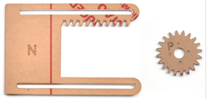
.. |image5| image:: ./media/3.png
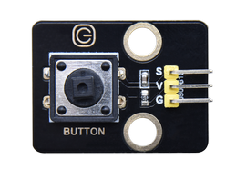
.. |image7| image:: ./media/5.png
.. |image8| image:: ./media/6.png
.. |image9| image:: ./media/7.png
.. |image10| image:: ./media/8.png
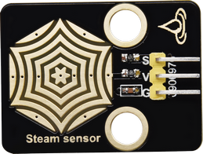
.. |image12| image:: ./media/10.png
.. |image13| image:: ./media/11.png
.. |image14| image:: ./media/12.png
.. |image15| image:: ./media/13.png
.. |image16| image:: ./media/14.png
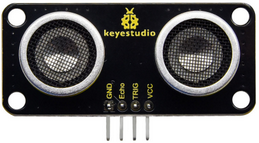
.. |image18| image:: ./media/16.png
.. |image19| image:: ./media/17.png
.. |image20| image:: ./media/18.png
.. |image21| image:: ./media/19.png
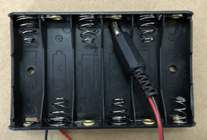
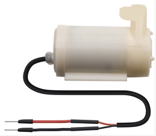
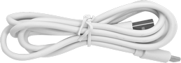
.. |image25| image:: ./media/23.png
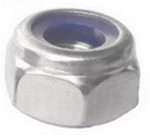
.. |image27| image:: ./media/25.png
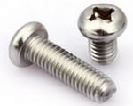
.. |image29| image:: ./media/27.png
.. |image30| image:: ./media/28.png
.. |image31| image:: ./media/29.png
.. |image32| image:: ./media/30.png
.. |image33| image:: ./media/31.png
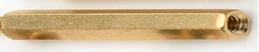
.. |image35| image:: ./media/wps1.jpg
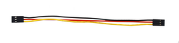
.. |image37| image:: ./media/34.png
.. |image38| image:: ./media/34.png
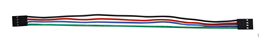
.. |image40| image:: ./media/36.png

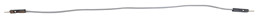
.. |image43| image:: ./media/39.png

.. |image45| image:: ./media/48.png
.. |image46| image:: ./media/45.png
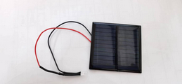
.. |image48| image:: ./media/49.png
.. |image49| image:: ./media/53.png
.. |image50| image:: ./media/1-1.png

.. |image53| image:: ./media/3.png

.. |image55| image:: ./media/5.png
.. |image56| image:: ./media/6.png
.. |image57| image:: ./media/7.png
.. |image58| image:: ./media/8.png

.. |image60| image:: ./media/10.png
.. |image61| image:: ./media/11.png
.. |image62| image:: ./media/12.png
.. |image63| image:: ./media/13.png
.. |image64| image:: ./media/14.png

.. |image66| image:: ./media/16.png
.. |image67| image:: ./media/17.png
.. |image68| image:: ./media/18.png
.. |image69| image:: ./media/19.png

.. |image73| image:: ./media/23.png

.. |image75| image:: ./media/25.png

.. |image77| image:: ./media/27.png
.. |image78| image:: ./media/28.png
.. |image79| image:: ./media/29.png
.. |image80| image:: ./media/30.png
.. |image81| image:: ./media/31.png

.. |image83| image:: ./media/wps1.jpg

.. |image85| image:: ./media/34.png
.. |image86| image:: ./media/34.png

.. |image88| image:: ./media/36.png

.. |image91| image:: ./media/39.png

.. |image93| image:: ./media/48.png
.. |image94| image:: ./media/45.png

.. |image96| image:: ./media/49.png
.. |image97| image:: ./media/53.png
