## 3. Assembling

During assembling, some codes are required to be burned, so please install software first.

The whole assembling generally can be divided into two parts: assembling
parts and wirings.

---

### Step 1 Install the ESP32 Board and the Relay Module

#### 1.1 Required components

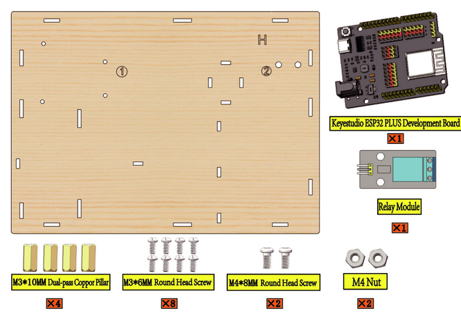

---

#### 1.2

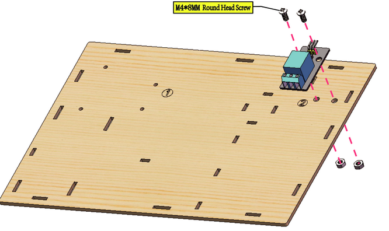

---

#### 1.3

---

#### 1.4

---

#### 1.5

---

### Step 2Install the Fixing Frame for Battery Case and install the Feeding Cabin,connect the ESP32 board and the Relay Module

#### 2.1 Required components

---

#### 2.2

Assemble the wooden board X and O on bottom plate

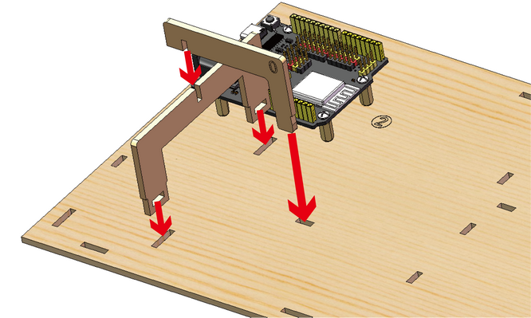

---

#### 2.3

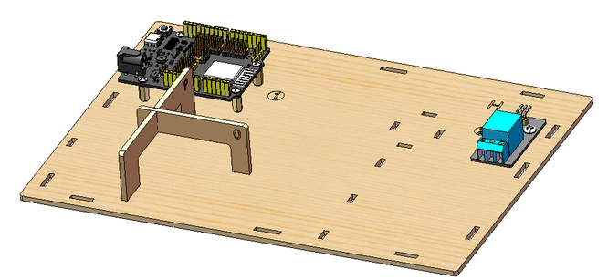

---

#### 2.4

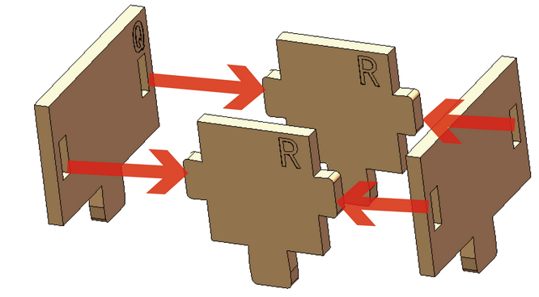

---

#### 2.5

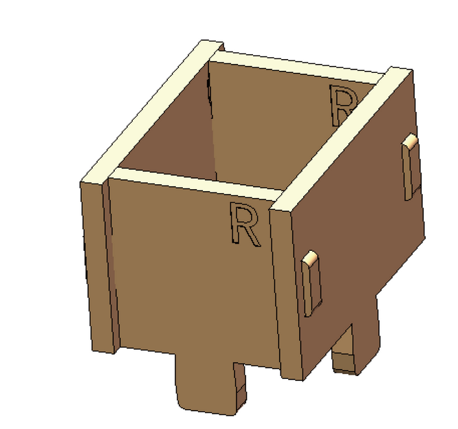

---

#### 2.6

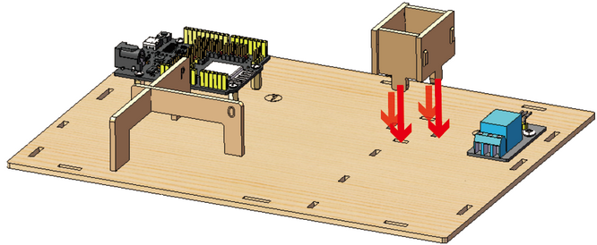

---

#### 2.7

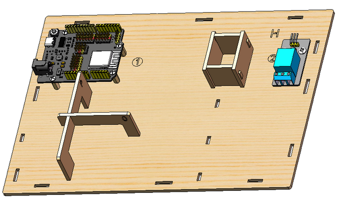

---

#### 2.8 Connect the ESP32 board and the Relay Module

| Module | Wire | Pin |
| --- | --- | --- |
| Relay Module | 3PIN 20cm | IO25 |

| Module Pin | Wire Color | ESP32 Board Pin |
| --- | --- | --- |
| V | RED | V |
| G | BLACK | G |
| S | YELLOW | io25 |

---

#### 2.9

---

### Step 3 Install the Substructure of the house

---

#### 3.1 Required components

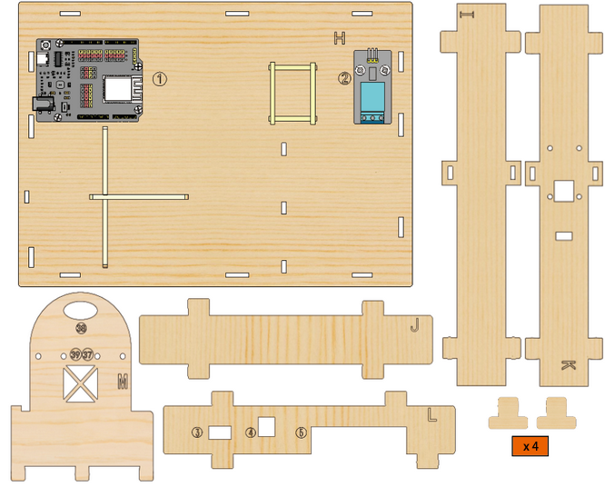

---

#### 3.2

---

#### 3.3

---

#### 3.4

---

#### 3.5

---

#### 3.6

---

#### 3.7

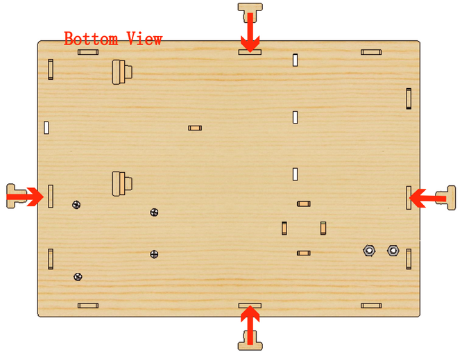

---

#### 3.8

---

#### 3.9

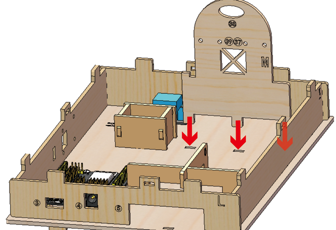

---

#### 3.10

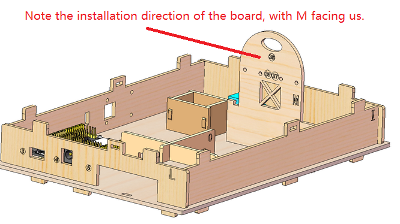

---

#### 3.11

---

### Step 4 Install the Door of the Feeding Cabin

---

#### 4.1 Required components

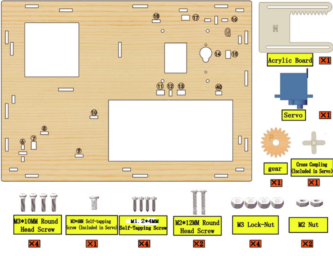

The acrylic sheet is packed separately, and it is recommended that you tear off its protective film to reduce the friction when it moves as a door.

---

#### 4.2 Set Servo to 165°

> **⚠ WARNING — Read Before Proceeding:**
>
> 1. **Do NOT set the servo to 180°.** The door mechanism does not require the full 0°–180° range. Setting it to the extreme end will cause the servo to press against the mechanical stop, which may overheat and permanently damage the servo motor.
> 2. **Keep the board powered during installation.** When the servo is powered and holding its angle, do NOT force the gear or door by hand. If the board is unpowered, the servo has no holding torque, and manually rotating the gear will shift the calibrated angle, causing misalignment after power-on.
> 3. **Do NOT use brute force.** If the door does not move smoothly, stop immediately and check the assembly. Forcing it will strip the servo gears.

Please note that this step is very important. Before installation, be sure to set the servo to **165°** (with a 15° buffer reserved at each end to prevent mechanical damage).

**Before mounting the servo, firstly please set the angle to 165° by programming with KidsBlock (Graphical programming).**

Please refer to the software installation steps for details.

**Connect Servo to ESP32 development board at pin IO26.**

---

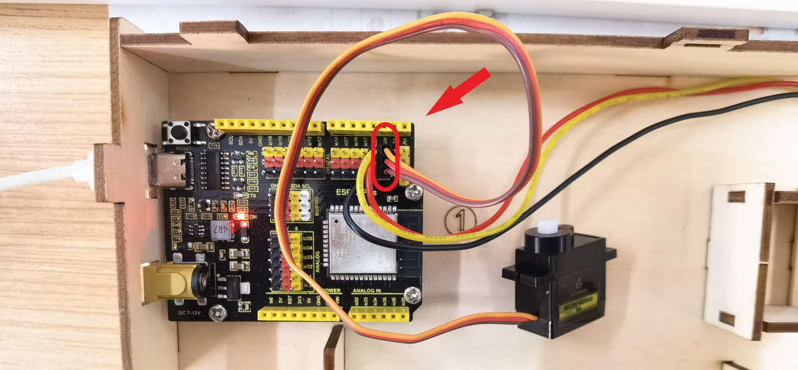

---

-  Open **KidsBlock**. Select ESP32 board and the correct serial port, and burn the following code to the board. The code sets the servo to **165°**.

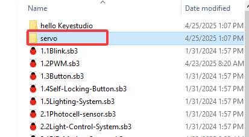

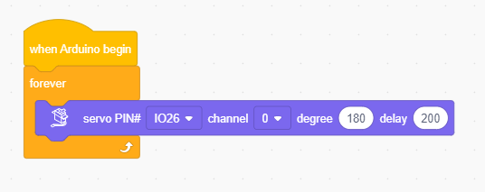

> **Important:** Keep the board powered and the servo holding at 165° while you proceed to the assembly step. Do **not** disconnect power or manually move the gear until the door panel is fully installed.

---

#### 4.3 Install Servo

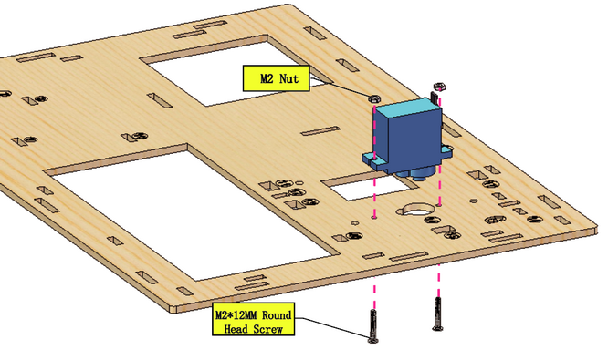

---

#### 4.4

**Note: The screws need to be tightened to keep the servo stable, otherwise the door may get stuck**

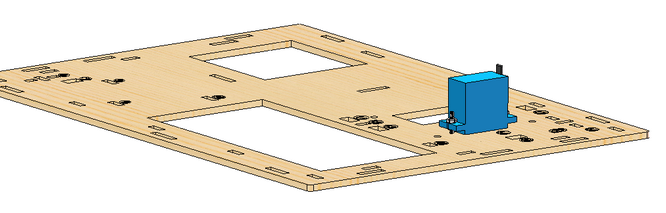

---

#### 4.5

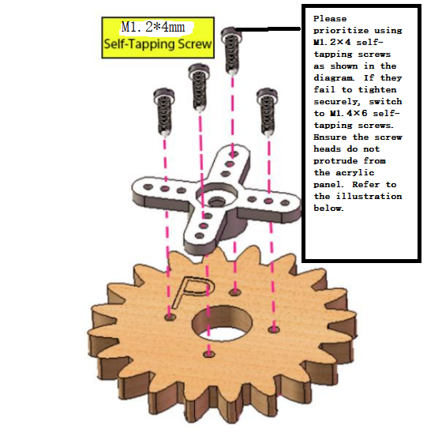

Install M1.4*6MM self-tapping screws as shown below

---

#### 4.6

---

#### 4.7

---

#### 4.8

Do not turn the gear after it is installed on the servo. If you have already turned the gear you will need to readjust the servo angle to 180°.

---

#### 4.9

**NOTE: When installing the lid of the feeding box, its opening should be fully closed.**

---

#### 4.10

---

#### 4.11

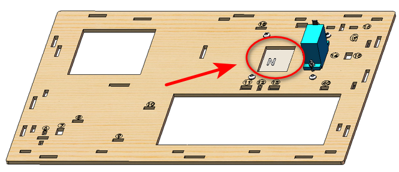

---

#### 4.12

---

#### 4.13 Test the door

1. Connect Servo to pin IO26 of the ESP32 board. Connect yellow to S, red to V, black to G.

2. Connect 6 AA batteries to the DC 7-12V port of ESP32 board. (Batteries not included in the kit)

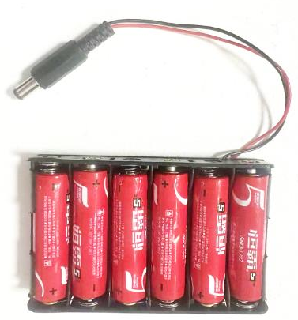

3. Upload the Test code

A. Connect the ESP32 board to the computer with the usb cable. Open the INO file inside the **6.1Servo.sb3** folder with KidsBlock .

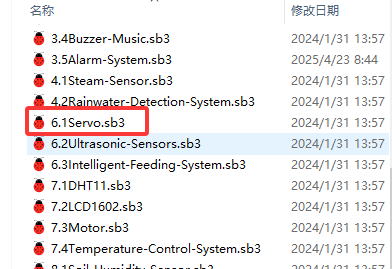

B.Upload code

> **⚠ NOTE:** After uploading the code, if the door cannot be opened and closed smoothly and the servo is hot, please **turn off the power immediately** to prevent servo burnout. Then check the items below.
>
> **Do NOT use brute force** to move the door or gear at any time.

**check:**

1. Whether the plastic door has good contact and force points with the gear structure of the servo.
1. Whether the tip of the fixing screw on the gear structure of the servo is stuck with the plastic shell of the servo. If so, please loosen the fixing screw a little to prevent its tip from contacting the servo.

### Step 5 Install the LCD display and the DHT11 Sensor

---

#### 5.1 Required components

---

#### 5.2

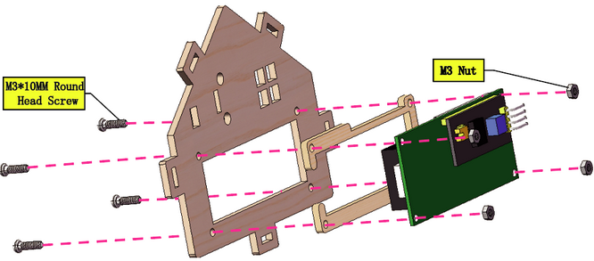

---

#### 5.3

---

#### 5.4

---

#### 5.5 Prototype

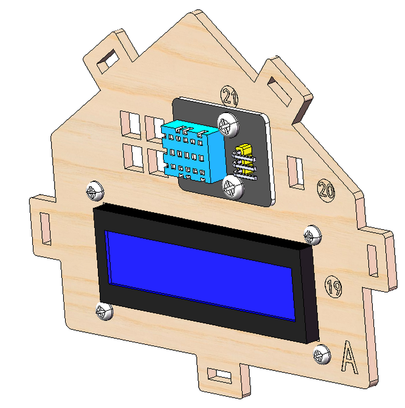

---

#### 5.6 Wiring

**Connect modules via Dupont wires.**

| Module | Wire |
| --- | --- |
| Temperature and Humidity Sensor | 3PIN 20cm |
| LCD 1602 | 4PIN **(Black-Red-Blue-Green)** |

**Pay attention to the color of the Dupont wire:**

**For temperature and humidity sensor, connect yellow to S, red to V,
black to G.**

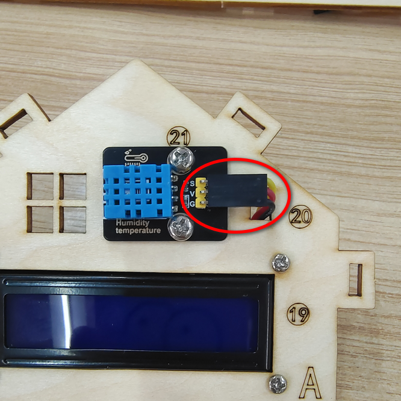

---

#### 5.7

| Module | Wire |
| --- | --- |
| LCD 1602 | 4PIN **(Black-Red-Blue-Green)** |

**For the LCD display, connect green to SCL, blue to SDA, red to VCC, black to GND.**

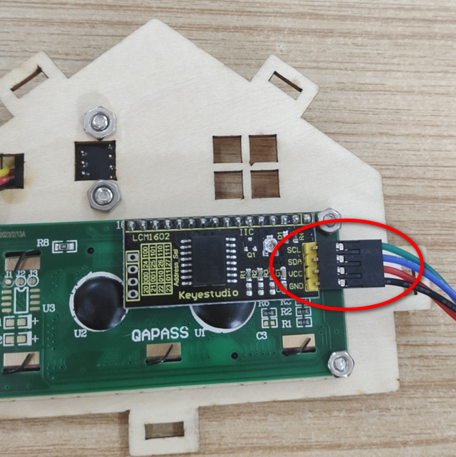

---

### Step 6 Install the Ultrasonic Module

---

#### 6.1 Required components

---

#### 6.2

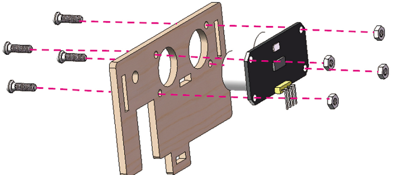

---

#### 6.3

---

#### 6.4 Wiring

| Module | Wire |
| --- | --- |
| Ultrasonic module | 4PIN **(Black-Green-Blue-Red)** |

**Pay attention to the color of the Dupont wire: For the ultrasonic
module, connect blue to TRIG,green to ECHO, red to VCC, black to GND.**

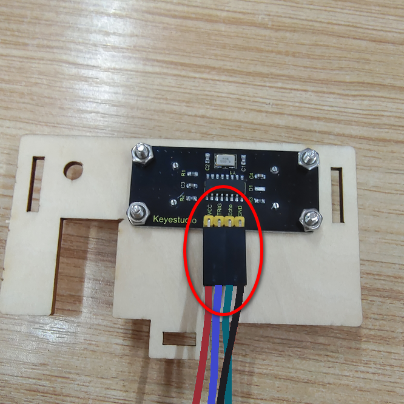

---

### Step 7 Install the PIR Motion Sensor and Button Module

---

#### 7.1 Required components

---

#### 7.2

---

#### 7.3

---

#### 7.4 Wiring

**Connect modules via Dupont wires.**

| Module | Wire |
| --- | --- |
| PIR Motion Sensor | 3PIN 15cm |
| Button Module | 3PIN 15cm |

**Pay attention to the color of the Dupont wire: Connect yellow to S, red to V, black to G.**

---

### Step 8 Install the Walls of the House

---

#### 8.1 Required components

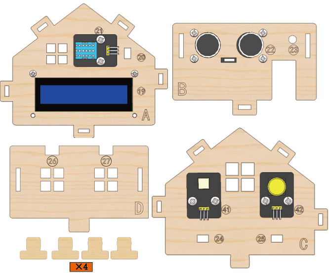

---

#### 8.2

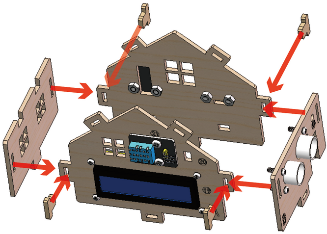

---

#### 8.3

---

#### 8.4

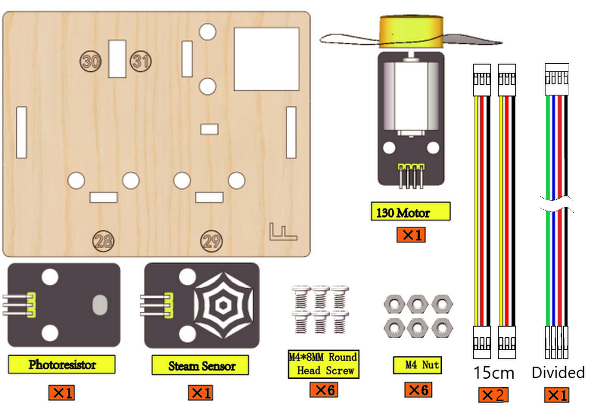

---

#### 8.5

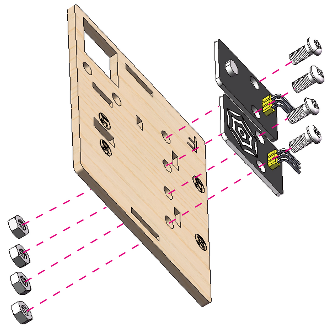

---

#### 8.6

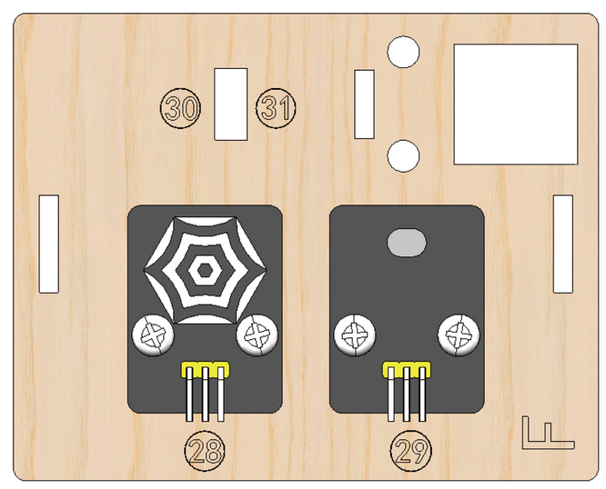

---

#### 8.7

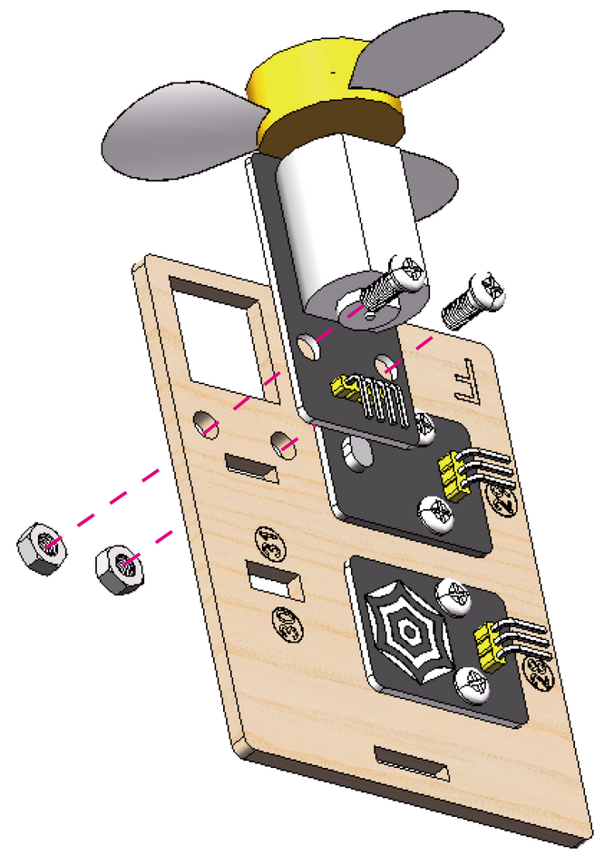

---

#### 8.8 Prototype

---

#### 8.9 Wiring

| Module | Wire |
| --- | --- |
| Fan | 4PIN **Divided (Black-Red-Blue-Green)** |
| Steam Sensor | 3PIN 15cm |
| Photoresistor | 3PIN 15cm |

**Pay attention to the color of the Dupont wire for the Fan:**

| Module Pin | Wire Color | ESP32 Board Pins |
| :--- | :--- | :--- |
| IN- | GREEN | io18 |
| IN+ | BLUE | io19 |
| V | RED | V |
| G | BLACK | G |

**For Steam Sensor and Photoresistor: Connect yellow to S, red to V, black to G.**

---

### Step 9 Install the Roof of the house

---

#### 9.1 Required components

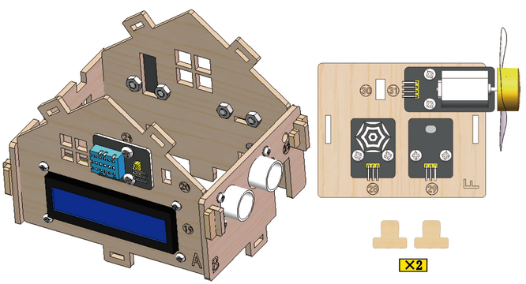

---

#### 9.2

---

#### 9.3

---

#### 9.4 Keep the wires organized

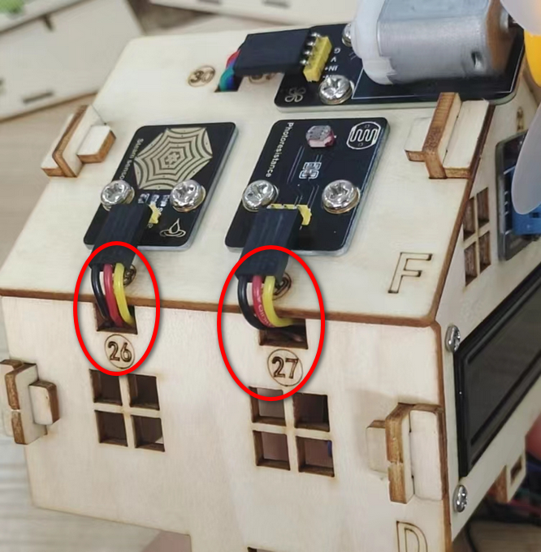

---

### Step 10 Install the House and Ground

#### 10.1 Required components

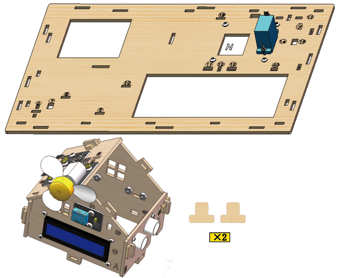

---

#### 10.2

---

#### 10.3

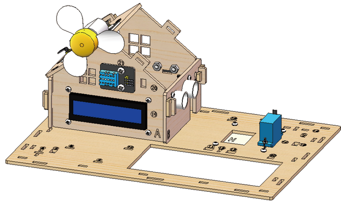

---

#### 10.4 Bottom View

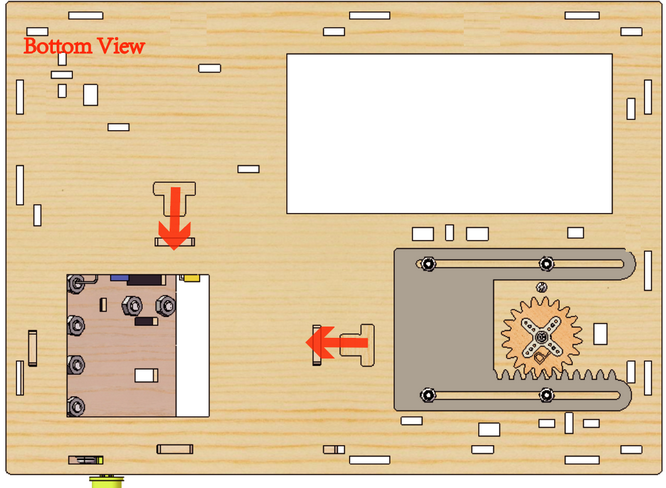

---

#### 10.5

---

#### 10.6 Arrange the wires

---

#### 10.7

---

### Step 11 Wiring the House

---

#### 11.1

**Pay attention to the color of the Dupont wire: Connect yellow to S, red to V, black to G.**

| NO. | Components | Wires | ESP32 Board Pins |  |
| --- | --- | --- | --- | --- |
| 1 | Fan | 4pin, **Divided** Bla ck-Red-Blue-Green | io18(IN-) \ io19(IN+) |  |
| 2 | PIR Motion Sensor | 3pin 15cm | io23 |  |
| 3 | Button | 3pin 15cm | io5 |  |
| 4 | Ultrasonic Module | 4 pin,\ **Divided** Bla ck-Green-Blue-Red | D12(TRIG) D13(ECHO) |  |
| 5 | LCD 1602 | 4pin, **Connected** | I2C |  |
| 6 | Temperature and Humidity Sensor | 3pin 20cm | io17 |  |
| 7 | Steam Sensor | 3pin 15cm | io35 |  |
| 8 | Photoresistor | 3pin 15cm | io34 |  |
| 9 | Servo | -- | io26 |  |
| 10 | Buzzer | 3pin 20cm | io16 |  |
| 11 | LED | 3pin 20cm | io27 |  |
| 12 | Water Level Sensor | 3pin 25cm | io33 |  |
| 13 | Soil Humidity Sensor | 3pin 20cm | io32 |  |
| 14 | Water Pump | 3pin 20cm | io25 |  |

#### 11.2 Fan

Pass the Dupont wire connected to the fan through the hole **marked 30** on the wooden board.

| Components | Wire | ESP32 Board Pins |
| :--- | :--- | :--- |
| Fan | 4PIN **Divided (Black-Red-Blue-Green)** | io18(IN-), io19(IN+) |

| Module Pin | Wire Color | ESP32 Board Pins |
| :--- | :--- | :--- |
| IN- | GREEN | io18 |
| IN+ | BLUE | io19 |
| V | RED | V |
| G | BLACK | G |

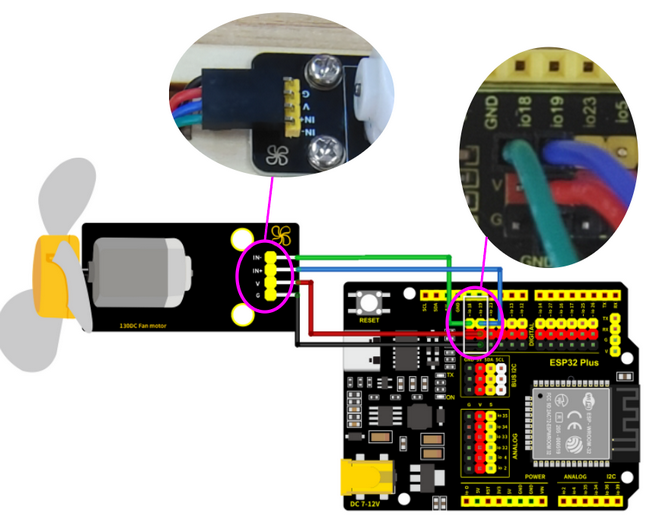

---

#### 11.3 PIR Motion Sensor

Pass the Dupont wire connected to the PIR motion sensor through the hole marked 24 on the wooden board.

| Component | Wire | ESP32 Board Pin |
| --- | --- | --- |
| PIR Motion Sensor | 3PIN 15cm | io23 |

**Connect red to V, black to G, yellow to S.**

| Module Pin | Wire Color | ESP32 Board Pin |
| --- | --- | --- |
| V | RED | V |
| G | BLACK | G |
| S | YELLOW | io23 |

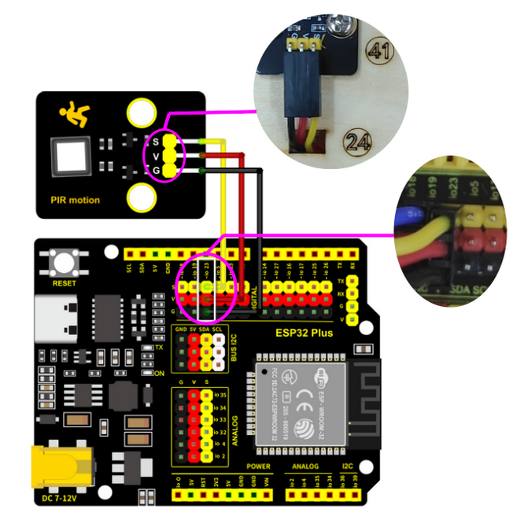

---

#### 11.4 Button Module

Pass the Dupont wire connected to the button module through the hole marked 25 on the wooden board.

| Component | Wire | ESP32 Board Pin |
| --- | --- | --- |
| Button | 3PIN 15cm | io5 |

**Connect red to V, black to G, yellow to S.**

| Module Pin | Wire Color | ESP32 Board Pin |
| --- | --- | --- |
| V | RED | V |
| G | BLACK | G |
| S | YELLOW | io5 |

---

#### 11.5 Ultrasonic Module

| Component | Wire | ESP32 Board Pins |
| --- | --- | --- |
| Ultrasonic Module | 4PIN **Divided** ( Black-Green-Blue-Red) | io13(ECHO), io12(TRIG) |

**Connect red to V, black to G, blue to io12, green to io13.**

| Module Pin | Wire Color | ESP32 Board Pin |
| --- | --- | --- |
| V | RED | V (io12) |
| G | BLACK | G (io12) |
| ECHO | GREEN | io13 |
| TRIG | BLUE | io12 |

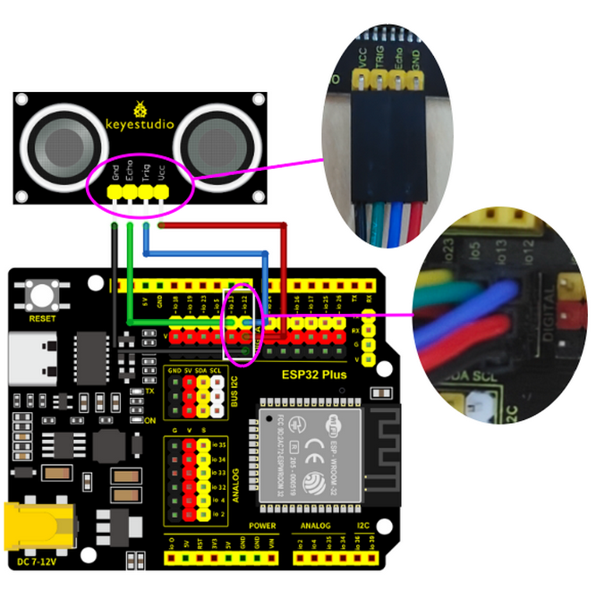

---

#### 11.6 LCD 1602

| Component | Wire | ESP32 Board Pins |
| --- | --- | --- |
| LCD1602 | 4PIN **Connected** **(Black-Red-Blue-Green)** | I2C |

**Connect red to V, black to G, blue to SDA, green to SCL.**

| Module Pin | Wire Color | ESP32 Board Pin |
| --- | --- | --- |
| V | RED | V |
| G | BLACK | G |
| SCL | GREEN | SCL |
| SDA | BLUE | SDA |

---

#### 11.7 Temperature and Humidity Sensor

Pass the Dupont wire connected to the button module through the hole marked 20 on the wooden board.

| Component | Wire | ESP32 Board Pins |
| --- | --- | --- |
| Temperature and Humidity Sensor | 3PIN 20cm | io17 |

**Connect red to V, black to G, yellow to io17.**

| Module Pin | Wire Color | ESP32 Board Pin |
| --- | --- | --- |
| V | RED | V |
| G | BLACK | G |
| S | YELLOW | io17 |

---

#### 11.8 Steam Sensor

| Component | Wire | ESP32 Board Pin |
| --- | --- | --- |
| Steam Sensor | 3PIN 15cm | io35 |

**Connect red to V, black to G, yellow to io35.**

| Module Pin | Wire Color | ESP32 Board Pin |
| --- | --- | --- |
| V | RED | V |
| G | BLACK | G |
| S | YELLOW | io35 |

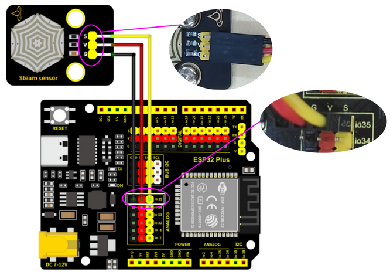

---

#### 11.9 Photoresistor

| Component | Wire | ESP32 Board Pin |
| --- | --- | --- |
| Photoresistor | 3PIN 15cm | io34 |

**Connect red to V, black to G, yellow to io34.**

| Module Pin | Wire Color | ESP32 Board Pin |
| --- | --- | --- |
| V | RED | V |
| G | BLACK | G |
| S | YELLOW | io34 |

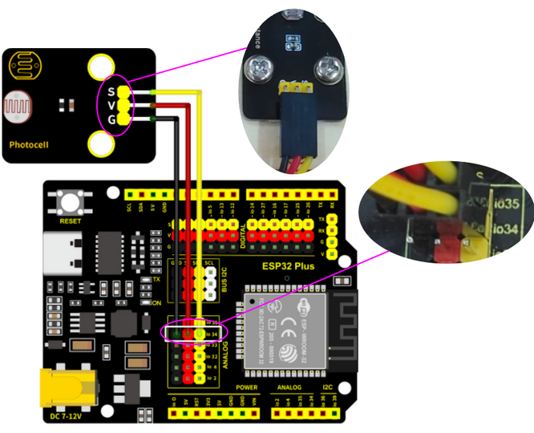

---

#### 11.10 Servo

**Pass the wire of Servo through the Hole 15, and then connect it to ESP32 board.**

| Component | Wire | ESP32 Board Pin |
| --- | --- | --- |
| Servo | 3PIN | io26 |

**Connect red to V, black to G, yellow to io26.**

| Board Pin | Wire Color |
| --- | --- |
| V | RED |
| G | BLACK |
| IO26 | YELLOW |

---

#### 11.11 Buzzer

**Pass the wire of Buzzer through the Hole 17, and then connect it to ESP32 board.**

| Component | Wire | ESP32 Board Pin |
| --- | --- | --- |
| Buzzer | 3PIN 20cm | io16 |

**Connect red to V, black to G, yellow to io16.**

| Module Pin | Wire Color | ESP32 Board Pin |
| --- | --- | --- |
| V | RED | V |
| G | BLACK | G |
| S | YELLOW | io16 |

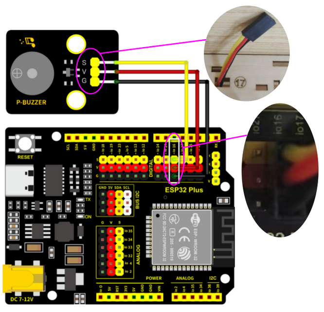

---

#### 11.12 LED

**Pass the wire of LED through the Hole 7, and then connect it to ESP32
board.**

| Component | Wire | ESP32 Board Pin |
| --- | --- | --- |
| LED | 3PIN 20cm | io27 |

**Connect red to V, black to G, yellow to io27.**

| Module Pin | Wire Color | ESP32 Board Pin |
| --- | --- | --- |
| V | RED | V |
| G | BLACK | G |
| S | YELLOW | io27 |

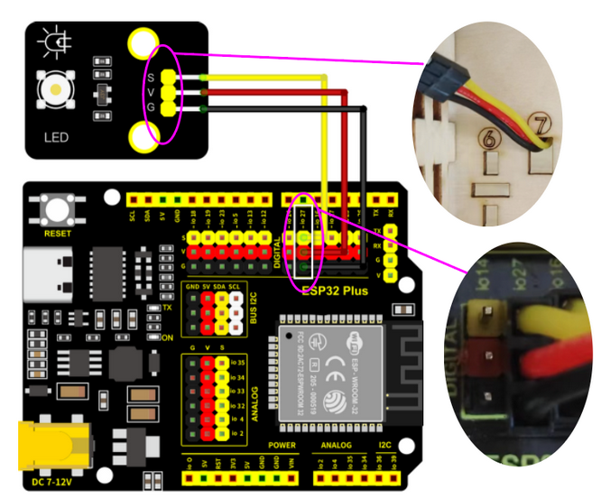

---

#### 11.13 Water Lever Sensor

**Pass the wire of water level sensor through the Hole 13, and then
connect it to ESP32 board.**

| Component | Wire | ESP32 Board Pin |
| --- | --- | --- |
| Water Lever Sensor | 3PIN 25cm | io33 |

**Connect red to V, black to G, yellow to io33.**

| Module Pin | Wire Color | ESP32 Board Pin |
| --- | --- | --- |
| V | RED | V |
| G | BLACK | G |
| S | YELLOW | io33 |

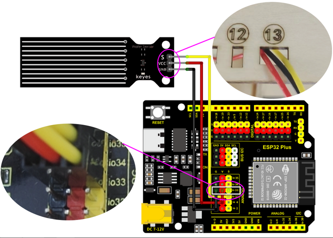

---

#### 11.14 Soil Humidity Sensor

**Pass the wire of soil humidity sensor through the Hole 11, and then
connect it to ESP32 board.**

| Component | Wire | ESP32 Board Pin |
| --- | --- | --- |
| Soil Humidity Sensor | 3PIN 20cm | io32 |

**Connect red to V, black to G, yellow to io32.**

| Module Pin | Wire Color | ESP32 Board Pin |
| --- | --- | --- |
| V | RED | V |
| G | BLACK | G |
| S | YELLOW | io32 |

---

#### 11.15 Relay Module

| Component | Wire | ESP32 Board Pin |
| --- | --- | --- |
| Relay Module | 3PIN | io25 |

| Module Pin | Wire Color | ESP32 Board Pin |
| --- | --- | --- |
| V | RED | V |
| G | BLACK | G |
| S | YELLOW | io25 |

**Pass the wire of Water Pump through the Hole 11 in the way as shown
below:**

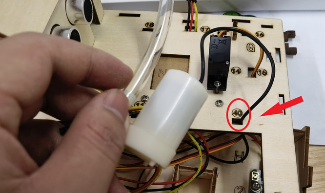

The red wire of the water pump is connected to the middle terminal of
the relay module, and the black wire is connected to the GND of the
ESP32 board.

In addition, you need to use a Dupont wire to connect the left terminal
of the relay module to the 3.3V of the ESP32.

---

#### 11.16

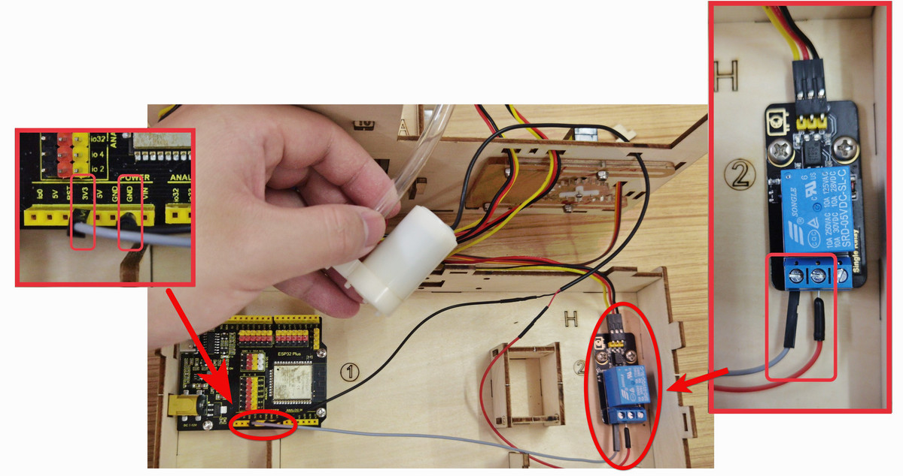

---

Insert the male terminal of the Dupont wire into the female terminal of
the relay module and tighten it with a screwdriver.

After the above steps, note that all the wiring has been finished. And wires of the LED, water level sensor, soil humidity sensor, buzzer and relay water pump have respectively passed through the holes of 7, 11, 13, 17 and 40 carved on the basswood board, preparing for the subsequent installation.

### Step 12 Install the house and foundation

---

#### 12.1 Required components

---

#### 12.2

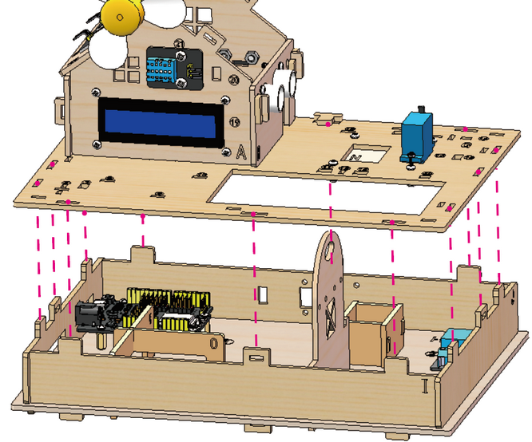

---

#### 12.3

---

#### 12.4

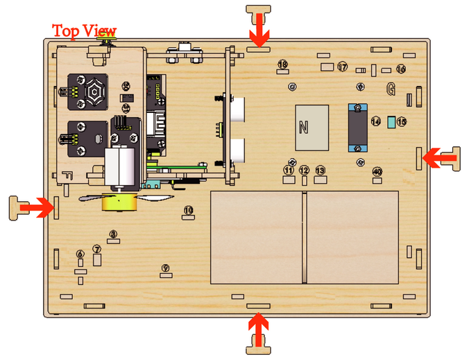

---

#### 12.5

---

### Step 13 Install the Plastic Sinks

---

#### 13.1 Required components

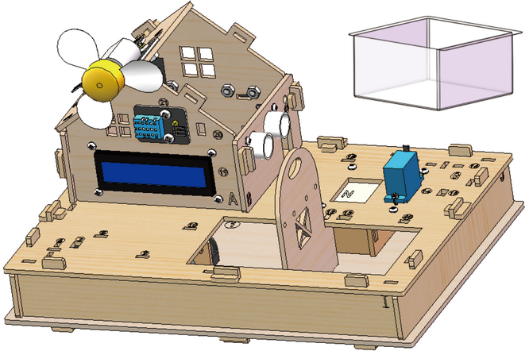

---

#### 13.2

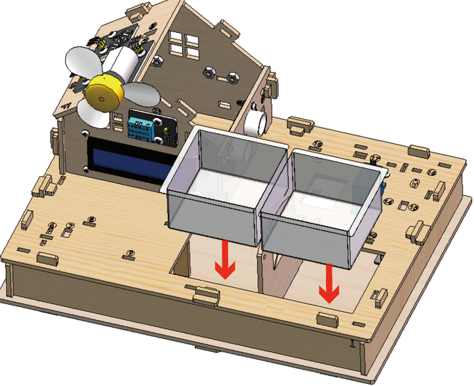

---

#### 13.3

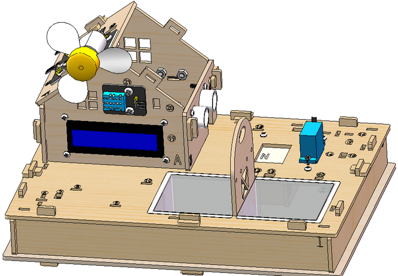

---

### Step 14 Install the soil module and water level module

---

#### 14.1 Required components

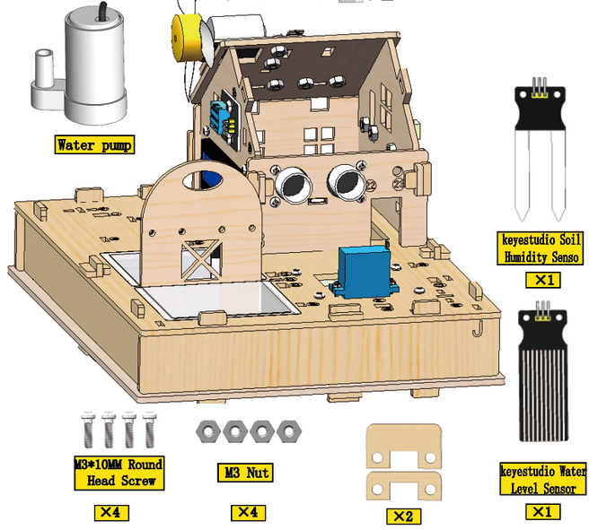

---

#### 14.2

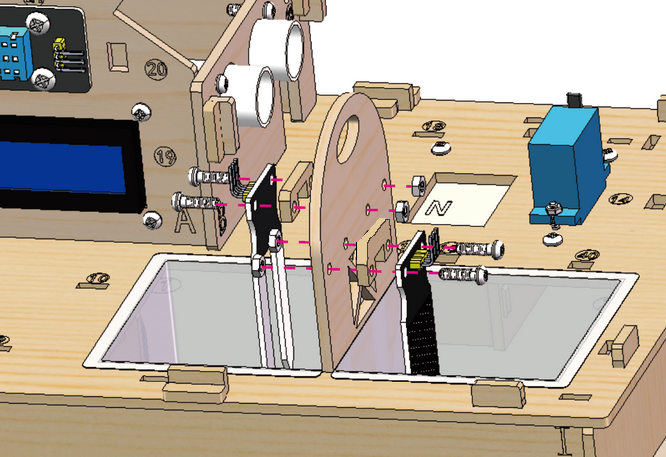

---

#### 14.3

---

#### 14.4

---

#### 14.5

---

#### 14.6

---

#### 14.7

---

### Step 15 Install fence

---

#### 15.1 Required components

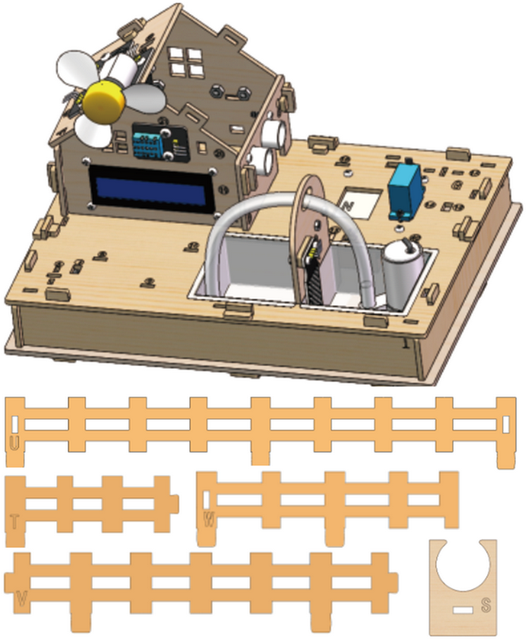

---

#### 15.2

---

#### 15.3

---

#### 15.4

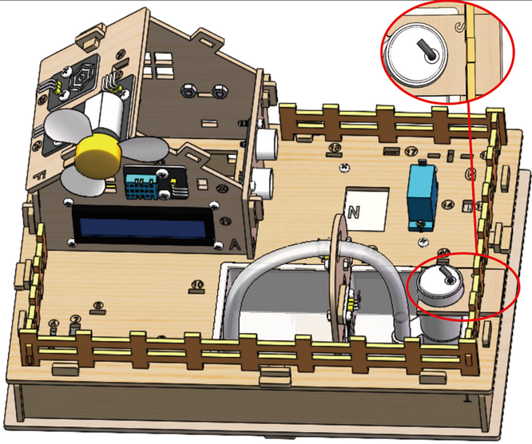

---

### Step 16 Install the Buzzer and the Led Module

---

#### 16.1 Required components

---

#### 16.2

---

#### 16.3

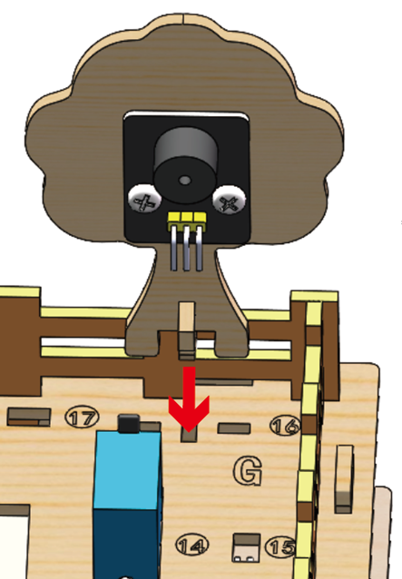

---

#### 16.4

---

### Step 17 Decorate the House

---

#### 17.1 Required components

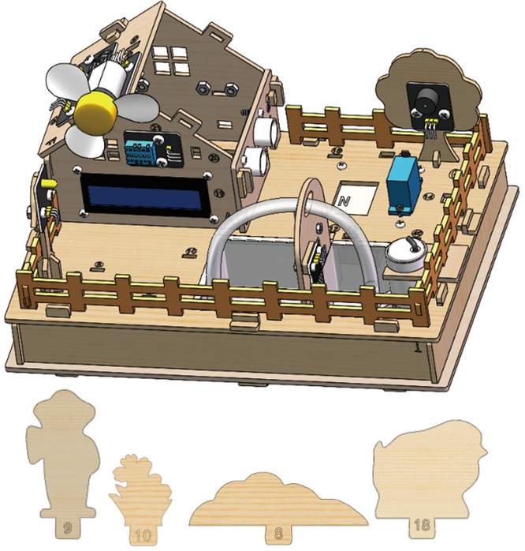

---

#### 17.2

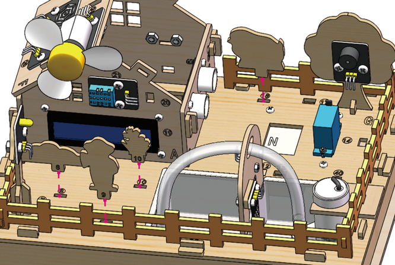

---

#### 17.3

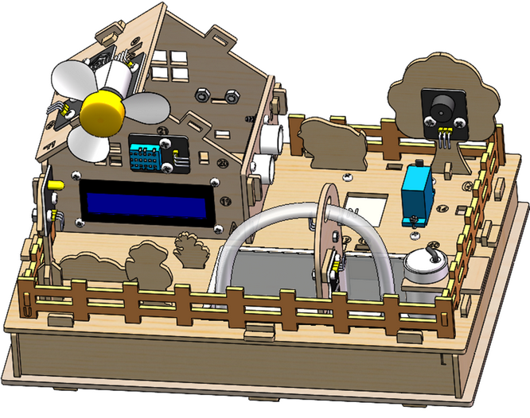

---

### Step 18 Install Solar Panel

---

#### 18.1

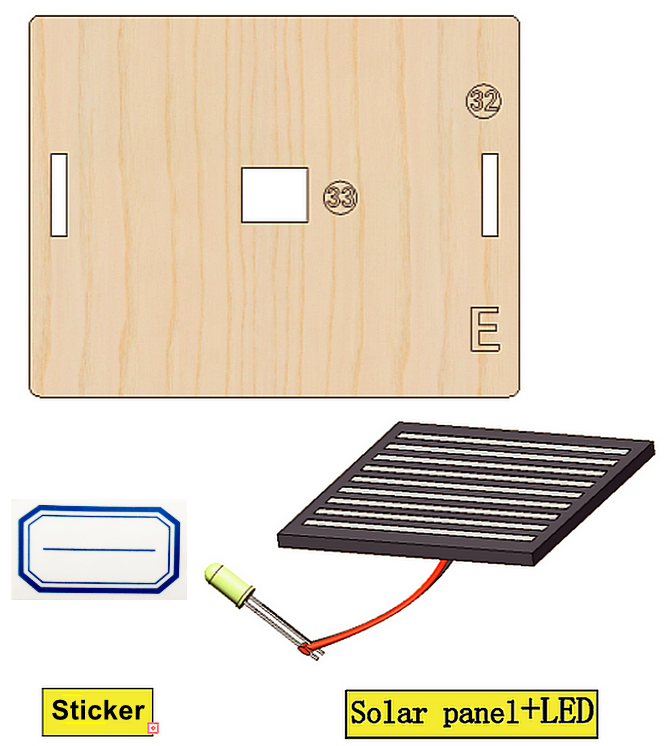

---

#### 18.2

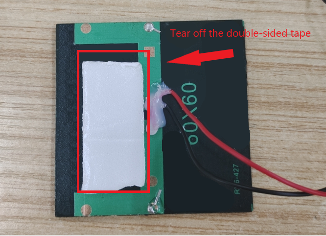

---

#### 18.3

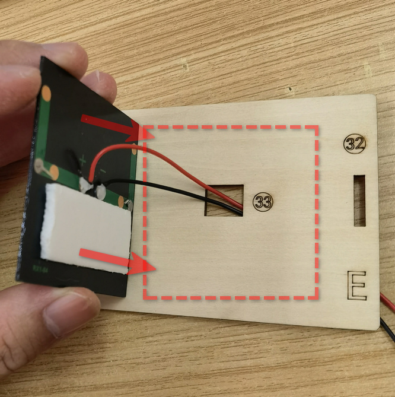

---

#### 18.4

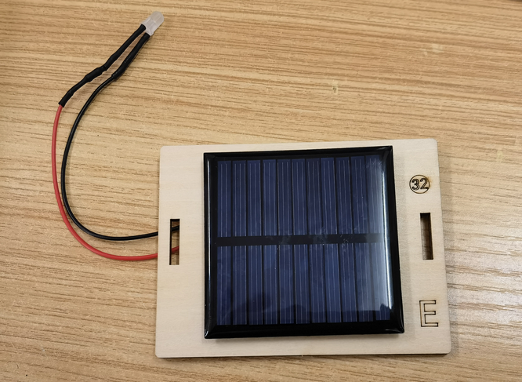

---

#### 18.5

Install the LED light of the solar panel into this hole.

---

#### 18.6

Use a sticker to secure its wires to the wall

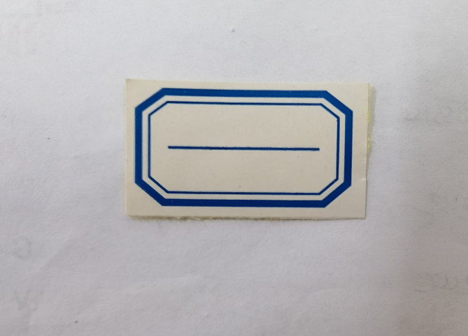

---

#### 18.7

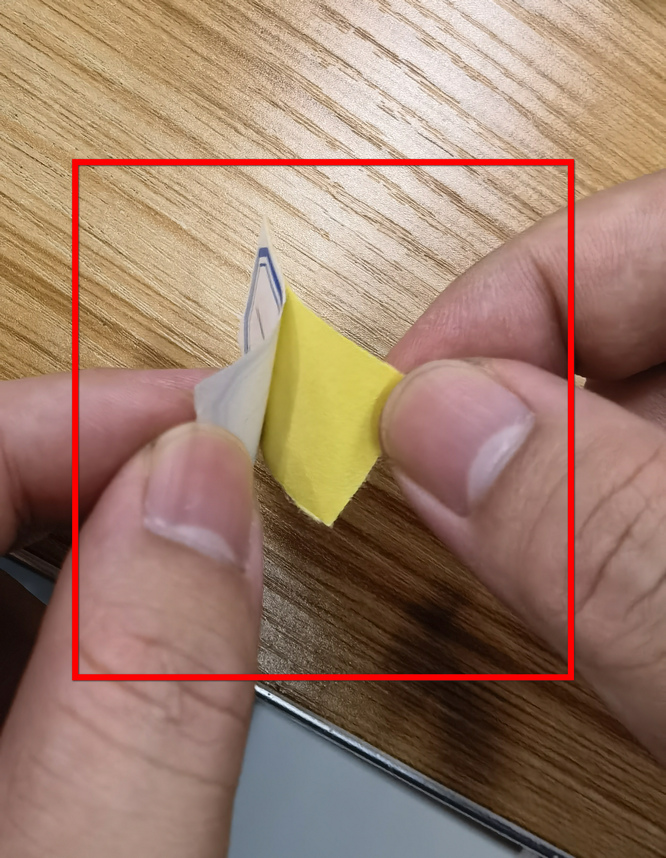

---

#### 18.8

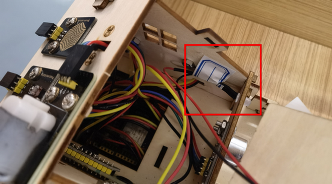

---

#### 18.9

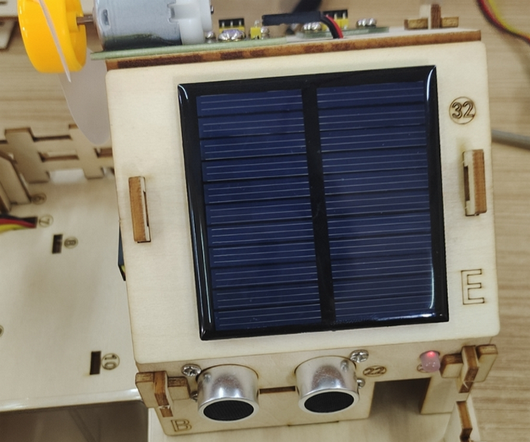

---

#### 18.10

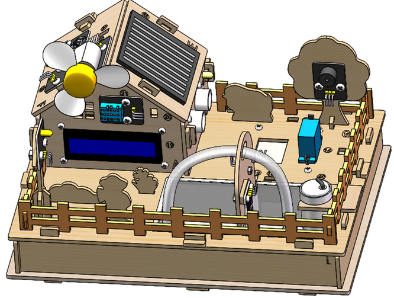

---

### Step 19 Install Battery Case

---

#### 19.1

---

#### 19.2

Install 6 AA batteries（Not included in the kit）

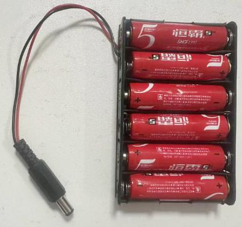

---

#### 19.3

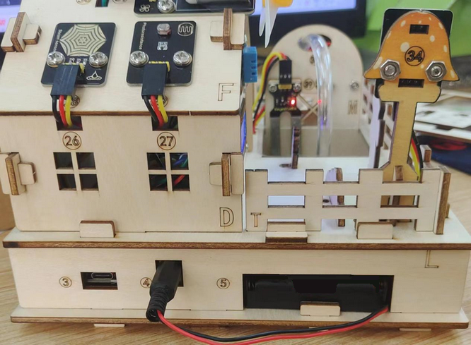

---

---

## 4. Projects

