### 4.12 Project: APP Control Smart Farm

---

**Pay attention! Do not overflow water from plastic pools in experiments. Spilling water on other sensors may cause a short circuit or modules to be out of work. If batteries get wet, even explosion may occur. Do be extra careful! For younger users, please operate with your parents. To guarantee security, please obey guidances and safety regulations.**

---

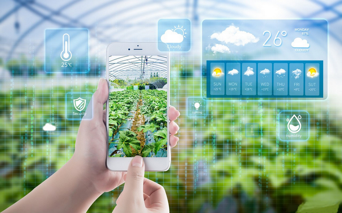

#### 4.12.1 Description

The APP management system is able to monitor multiple real-time index of the farm, such as temperature and humidity, pool water level, soil humidity, light intensity and rainfall.

Meanwhile, it also controls LED for lighting, water pump for irrigation, feeding box for feeding and fan for adjusting temperature and humidity.

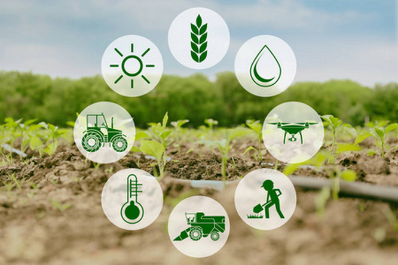

These functions can be realized via an APP on your phone, facilitating farm management. For more intelligence, a buzzer also adopted as an alarm.

---

#### 4.12.2 Flow Diagram

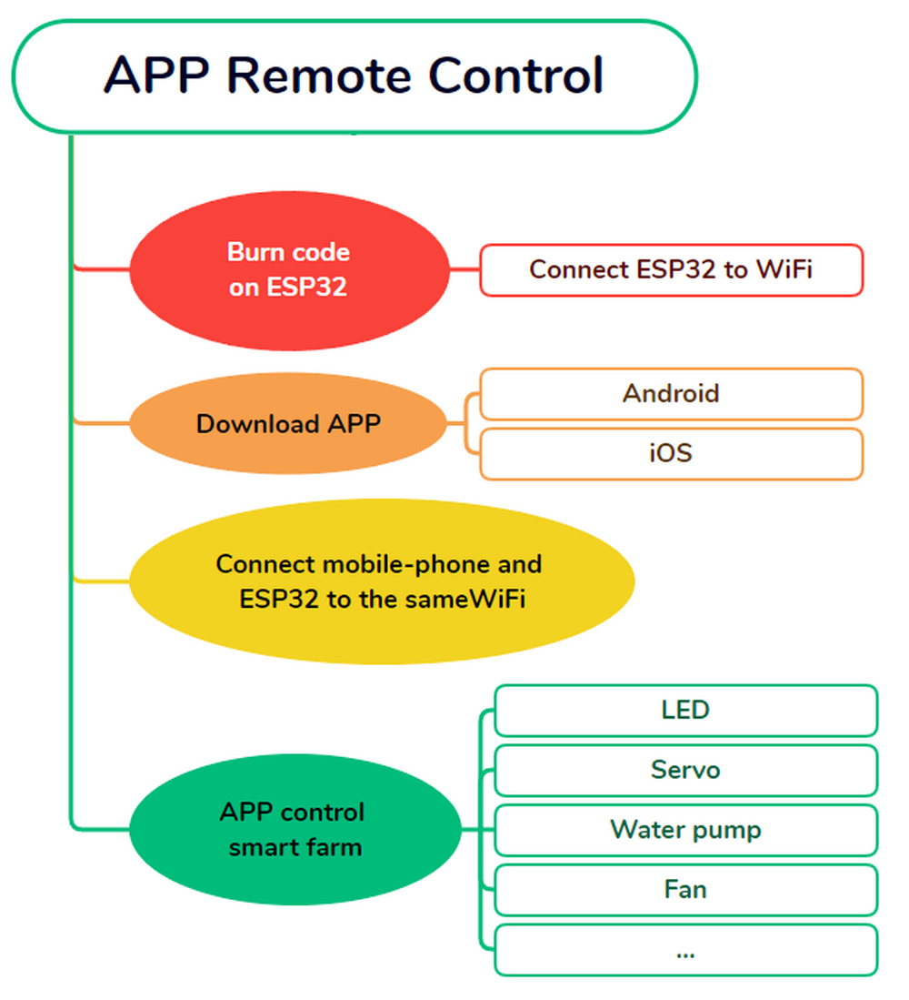

---

#### 4.12.3 Test Code

**Code Flow:**

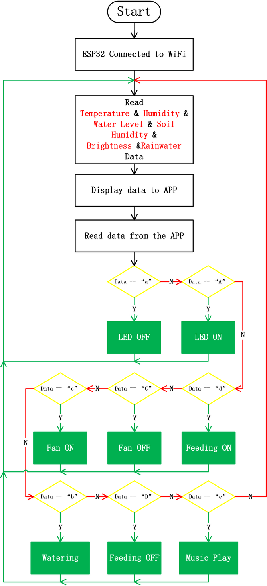

**Burn Code on ESP32:**

-  Connect ESP32 to WiFi. In the following code, **ssid** and **pwd** are respectively WiFi name and password

-  LCD displays IP address

-  Initialize wifi server. After initialization, ESP32 and APP can communicate with each other through WIFI.

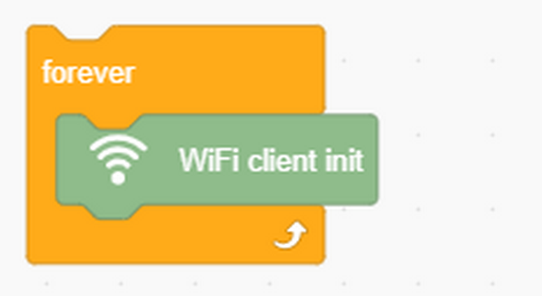

-  Check whether wifi is connected to client/APP

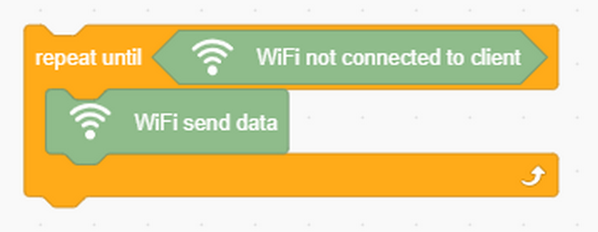

-  Send real time data of sensors to APP:

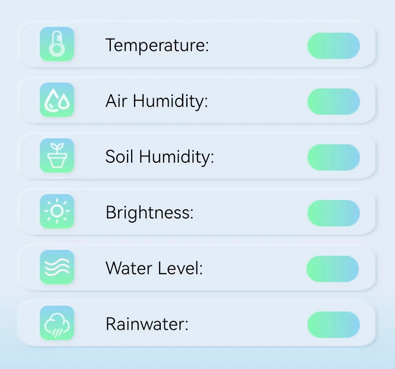

-  ESP32 receives data from APP and determine them. NOTE: All data are in the format of String.

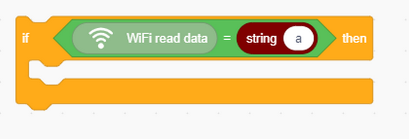

**Complete Code:**

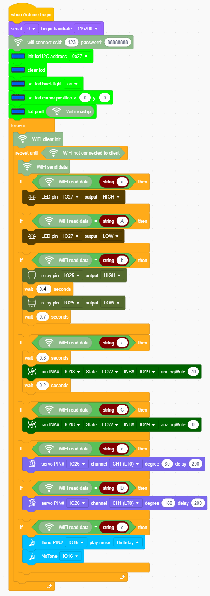

---

#### 4.12.4 APP

**APP Download:**

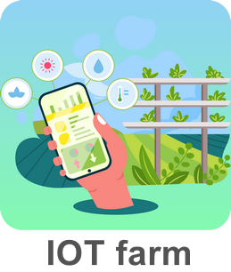

**Android：**

-  Open Google play, and search IOT farm to download.

 

-  In provided files, Android apk installing package is included:

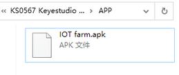

I **OS：**

Search **IOT farm** in APP Store and tap to download.

---

**APP Interface**

---

**APP Function Description:**

1. When your phone and ESP32 board connect to the same WIFI, you only
   need to input IP address at upper-right conner to link them.

2. Displays the temperature value of the farm in real time.

3. Displays the humidity value of the farm in real time.

4. Displays the soil humidity value of the farm in real time.

5. Displays the sun brightness value of the farm in real time.

6. Displays the water level of the farm in real time.

7. Displays the analog rainfall value of the farm in real time.

8. Control LED.

9. Control irrigation via water pump.

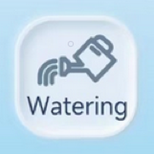

10. Control the fan to adjust temperature.

11. Control servo to open or close feeding box.

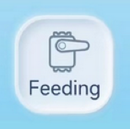

12. Control buzzer to play music.

---

#### 4.12.5 FAQ

Q: Wifi always fails to be connected.

A: Move ESP32 to the side of the router and reboot the board, and just be patient to wait. If it still fails to connected, please check whether the WiFi name and password are correct.

---

Q: APP fails to connect to ESP32.

A: Please make sure that APP and ESP32 are connected to the same WiFi.

---

Q: Fail to pump water?

A: Several pumping operations are required to fill the water pump before using it. These initial pumpings do not actually draw the water, but to introduce sufficient water into the pump. Only after the pump is full can water be carried out. So we are first for filling, not pumping.

---

