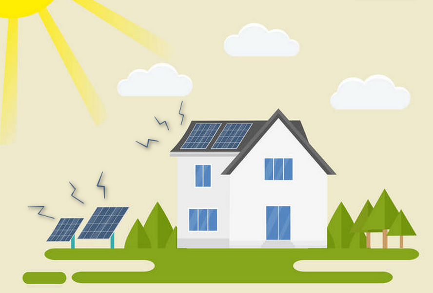
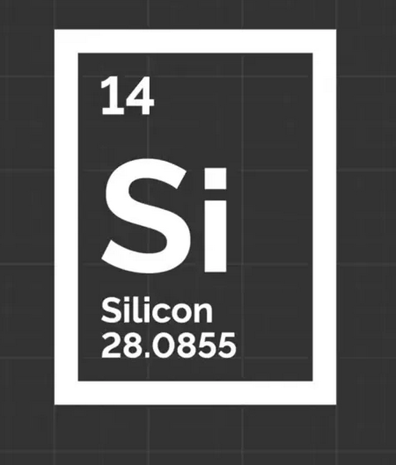
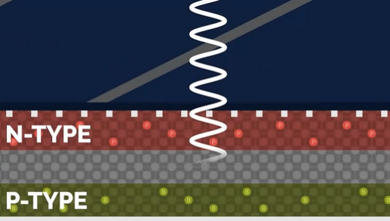
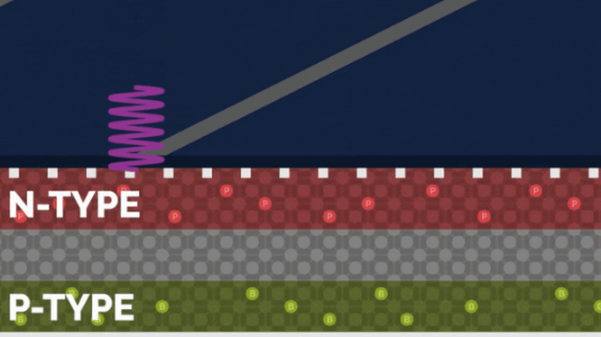
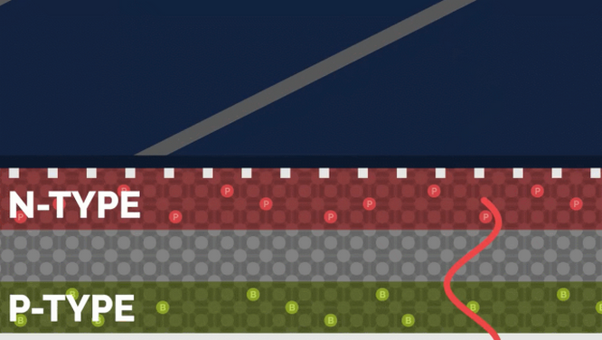
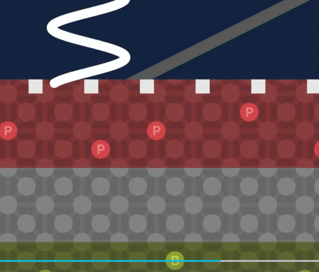
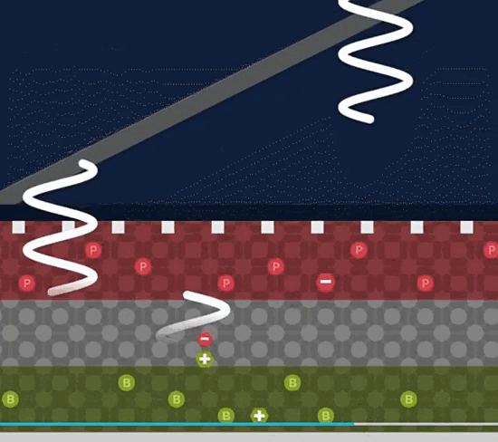
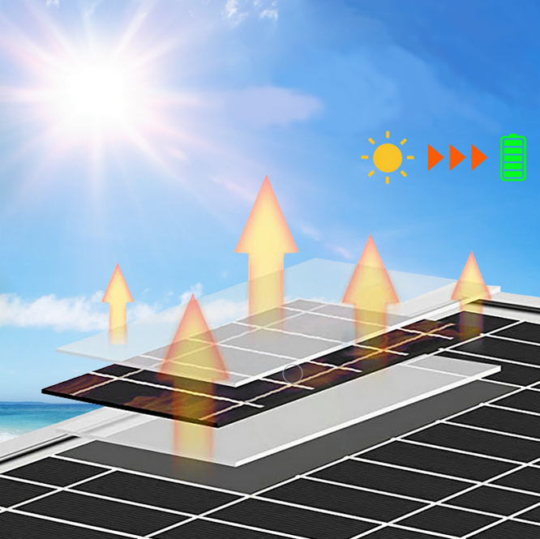

.. _45-project-solar-power-system:

4.5 Project: Solar Power System
===============================

|image1|

.. _451-description:

4.5.1 Description
-----------------

Solar panel converts solar power into electricity for the LED. It is
suitable for multiple applications, such as outdoor lighting, mobile
devices charging, and back up power. Hence, you may establish a
sophisticated and efficient solar power system according to your own
needs.

--------------

.. _452-working-principle:

4.5.2 Working Principle
-----------------------

**How does solar panel convert solar power into electricity?**

|image2|

The solar panel absorbs light and directly or indirectly converts solar
radiation into electricity. Compared with ordinary coal power
generation, solar, wind and water power are more energy-saving and
environment-friendly.

--------------

**How does light convert to electricity?**

Next, let's talk about the conversion process from inside to outside in
a solar panel .

**The Sun emits energy in waves with a wide range of wavelengths, from
ultraviolet to visible to infrared light.**

- Wavelength of Ultraviolet: 150~400nm;

- Wavelength of Visible Light: 400~760nm;

- Wavelength of Infrared Light: 760~4000nm;

**The panel absorbs one of these ranges of wavelength and converts them
into electricity. But how? Let's move on.**

--------------

**The active part of most solar panel cell is made of a semiconductor
--- silicon(Si).**

|image3|

The conductivity of a semiconductor is between a conductor and an
insulator in atmospheric temperature. Generally, it cannot conduct well,
yet its conductivity improves in certain conditions.

--------------

|image4|

**The diagram above shows the internal structure of the semiconductor in
solar cell, which is divided into three layers:**

1. **The top layer (red part)** consists of Silicon(Si) and a little
   Phosphorus(P). The later carries more electrons than the former,
   providing sufficient electrons for the top layer. Due to these
   freely-moving electrons, this layer is conductive, so it is called
   **Negative or N-type.**

2. **The middle layer (gray part)** contains too few electrons to
   conduct.

3. **The bottom layer (green part)** mainly includes Silicon(Si) and
   Boron(B). The later carries less electrons than the former, so that a
   rarely few electrons move freely, causing the missing of electrons
   which are described as effective positive charge. Therefore, this
   layer is named **Positive or P-type.**

|image5|

**Usually, only the middle layer of the solar panel absorbs light waves
with wavelength of 350~1140nm.** According to the spectrum distribution
in previous paragraphs, absorptions are long wave ultraviolet, short
wave infrared and visible light.

**The wavelength of ultraviolet is so short that they stops on the
surface.**

|image6|

**The wavelength of infrared light is too long too be absorbed by the
panel, so they usually passes through or is reflected back.**

|image7|

The middle layer absorbs light and knocks electrons off from silicon in
the top layer, leaving them in a free state, and empty electron holes
are generated at the place where they were before.

|image8|

The holes carries a positive charge. Meanwhile, free electrons move
upwards to reach N-type layer, while holes move downwards to reach
P-type layer.

**In conclusion, electrons in the top and bottom layers are struck out
after the middle layer absorbing solar energy. Therefore, N-type layer
carries negative charge as a negative pole, while P-type layer is
positively charged as a positive pole. In this case, as long as the two
layers are connected, it conducts.**

--------------

If sunlight shines on the solar panel, the above situation will last,
and a large number of free electrons and holes will be produced. As our
conclusion goes, electrons move upwards while holes move downwards,
which forms the two poles and generates current.

|image9|

--------------

|image10|

Solar energy is an alternative energy source, which features
sustainability and cost-effectiveness.

However, the electricity generated by one solar panel can be converted
into several watts of power, which is enough for a calculator or a
cellphone charger, yet not nearly enough to run a one-kilowatt toaster.

Solar power systems satisfy the needs of different users and benefit for
environment as well. Combined with KidsBlock programming, this kind of
ystem builds a variety of useful and efficient solar applications, like
automatic lighting, chargers and smart homes.

Generally speaking, solar energy promises well for a wonderful and
sustainable future.

--------------

.. _453-parameters:

4.5.3 Parameters
----------------

- Voltage: 5V

- Current: 80mA

- Power: 400mW

- Dimensions: 60*60mm

--------------

.. _454-test-result:

4.5.4 Test Result
-----------------

Codes are not required in this project. Importantly, we learn about the
new environmental energy --- solar power.

When good illumination is provided, LED will light up in yellow. The
brighter the light is, the brighter the LED will be.

--------------

.. _455-faq:

4.5.5 FAQ
---------

Q: Why does solar panel still work without sunlight?

A: It works with not only sunlight but also ambient light. The brighter
the light is, the greater the voltage will be, and the lighter the LED
will be.

--------------

.. |image2| image:: ./media/cou52.png

