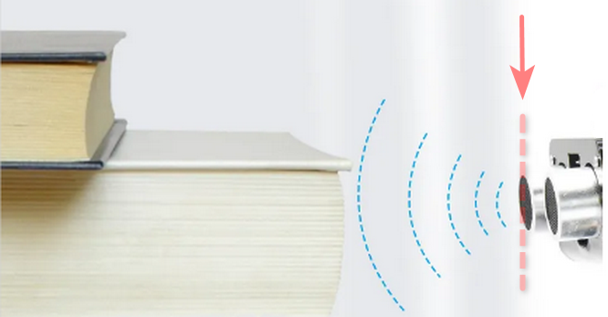

### 4.6 Project: Smart Feeding System

In this project, the ultrasonic module detects whether animals are in the feeding area, and the Servo automatically opens the feeding box for fowls. Besides, incorporating IOT enables remote monitoring of such feeding systems which provides much convenience.

Overall, the automation and remote operation are optimizing the feeding process for this system.

---

#### 4.6.1 Flow Diagram

---

#### 4.6.2 Servo

**Description:**

**Servo**, also called **RC Servo Device**, is a motor with a feedback. Commonly, Servo performs precise position control and outputs high torque, which most often appears in robotics projects, RC cars, airplanes and aircraft.

---

**Internal Structure:**

-  ① Signal(S): It receives the control signal from microcontroller.
-  ② Potentiometer: the feedback part of the Servo. It measures the position of output shaft.
-  ③ Embedded board (Internal controller): the core of the Servo. It processes external control signal and the feedback signal of position
   and drives the Servo.
-  ④ DC motor: the execution part. It outputs speed, torque and position.
-  ⑤ Gear system: It scales the outputs from motor to the final output Angle ccording to a certain transmission ratio.

---

**Drive the Servo:**

Signal(S) receives PWM to control the output of Servo, and **the position of output shaft directly relies on the duty cycle of PWM**.

For instance:

-  If we send a signal with pulse width of 1.5ms to Servo, its shaft(horn) will revolves to the middle position(90°);
-  If pulse width = `0.5ms`, the shaft turns to its minimum(0°);
-  If pulse width = `2.5ms`, the shaft turns to its maximum(180°).

**NOTE: The maximum angle varies from the types of Servos. Some are 170° while some are only 90°. In spite of this, Servos usually will move a half (of the maximum) if they receive a signal with pulse width of 1.5ms.**

The period of a Servo usually lasts 20ms and it produce pulses at a frequency of `50Hz`. Most servos work normally at 40~200Hz.

---

**Wiring Diagram:**

**Connect the Servo to io26.**

**Attention: Connect yellow to S(Signal), red to V(Power), and black to GND. Do not reverse them!**

---

**Test Code:**

-  Initialize the serial port and define a variable **item** with an assignment of 80.

-  Set **item** to the angle of Servo from 80° to 180°, rotating 1° every 15ms.

-  Servo rotates 1° every 15ms, from 180° to 80°.

Complete code:

**Test Result:**

The feeding box is slowly opened and then closed ,which is controllable.

**NOTE: SG90 servo can rotate 180°. As the feeding box is small, 100° of
rotation is enough to completely close the box.**

-  80°: fully open
-  120°: half open
-  180°: close

---

**ATTENTION**

**Do not put your fingers into the box to avoid nipping! **

**Do not block the door with something to avoid damaging servo!**

---

#### 4.6.3 Ultrasonic Sensor

**Description:**

**Schematic Diagram:**

---

The frequency of sound waves that the human can hear is 20Hz ~ 20KHz, while ultrasonic waves are beyond that range.

**Ultrasonic:**

Ultrasonic module converts electricity and ultrasonic wave into each other by piezoelectric effect, and it also transmits and receives ultrasonic wave.

This kind of wave features directivity, strong penetration and easy concentration of sound energy.

In this ultrasonic ranging system, we firstly program on MCU(ESP32 development board) to generate an original square wave at 40KHz and drive the ultrasonic module to emit it. Immediately, the module calculates the distance to the object after receiving the reflected wave(Echo) amplified and shaped by the circuit. Herein, it records the duration of emission and reflection and calculates the distance according to the time difference.

Simply, MCU controls the module to emit ultrasonic wave which is bounced back after encountering obstacles and is received by the module. The time difference between them is an important factor in computing the distance (the speed of sound propagation in air is 340m/s).

---

**Wiring Diagram:**

**Connect the Echo of Ultrasonic module to io13 and Trig to io12.**

**Attention: Connect yellow to S(Signal) and red to V(Power). Do not reverse them!**

---

**Test Code:**

Set the correct pin: Trig to pin io12; Echo to pin io13.

**Test Result:**

In this kit, the detection range is within 3~8cm.

Open the serial monitor, and observe.

---

#### 4.6.4 Smart Feeding System

**Description:**

The smart feeding system intelligently feeds domestic fowls via an ultrasonic module and a servo. The former detects the distance to animals while the later controls to open or close the feeding box. When a pet is detected close to the box, servo opens it to feed.

---

**Wiring Diagram:**

**Connect the Echo of Ultrasonic module to io13 and Trig to io12; connect the servo to io26.**

**Attention: Connect yellow to S(Signal), red to V(Power) and black to GND. Do not reverse them!**

---

**Test Code:**

Code Flow:

Code:

-  Initialize the serial port. Define a variable and assign it to 180.

-  Set the pin correctly, and print the received value.

-  Determine the detected distance value. If it is within 2cm ~ 7cm, the feeding box will open.

Complete code:

**Test Result:**

When an animal is detected, open the feeding box.

---

**ATTENTION**

**Do not put your fingers into the box to avoid nipping! **

**Do not block the door with something to avoid damaging servo!**

---

#### 4.6.5 FAQ

Q: Servo doesn't work.

A: It may be stuck by itself or by wires when mount the bottom plate. before installing, please adjust the servo to 180° first. For how, please refer to the installation guidance.

---

Q: The detected distance is inaccurate.

A: When detecting, please measure from the transmitting head. Herein, this module is not a high-precision detector, so errors may exist.

---

