## 1. KidsBlockの紹介

### 1.1 KidsBlockのインストール

#### 1.1.1 WindowsシステムへのKidsBlockのインストール

1. KidsBlockは以下からダウンロードできます。

   - リンク: http://xiazai.keyesrobot.cn/KidsBlock.exe

   - 提供ファイル: 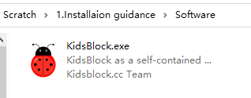

2. ダウンロード後、「KidsBlock.exe」をクリックします。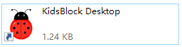

3. 「**このコンピューターを使用するすべてのユーザー(all users)**」にチェックを入れ、「**Next**」をクリックします。

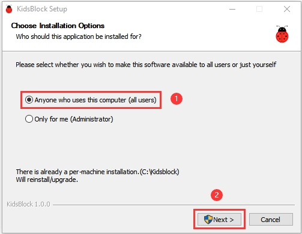

4. 「**Browse...**」をクリックしてインストールパスを選択し（ここではCドライブを選択していますが、お好きな場所を選択できます）、「**Install**」をクリックします。インストールが開始されます！

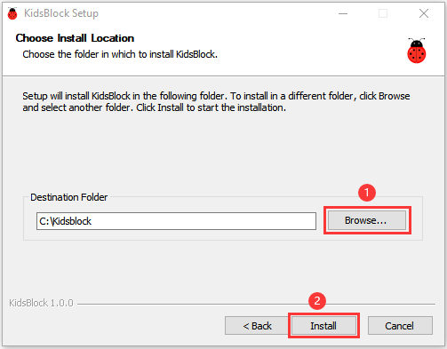

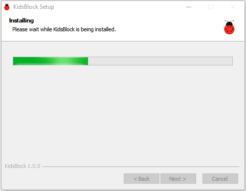

5. インストール完了後、「**Finish**」をクリックして開きます。

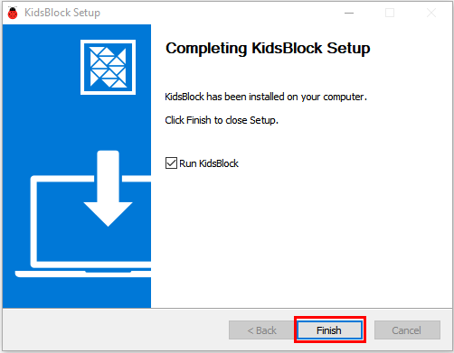

6. 警告が表示された場合は、「**Allow access**」をクリックしてソフトウェアのメインページに入ります。

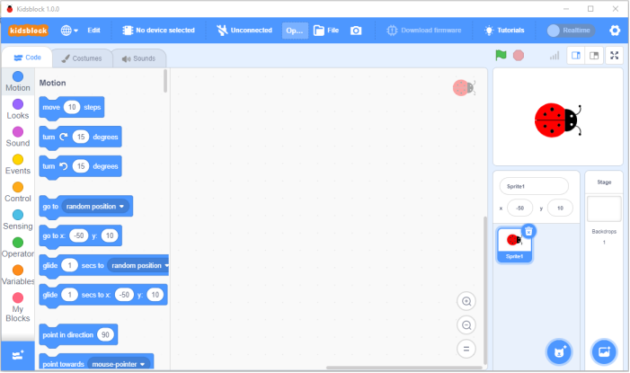

---

#### 1.1.2 MacOSへのKidsBlockのインストール

1. まずKidsBlockパッケージをダウンロードしてください: http://xiazai.keyesrobot.cn/KidsBlock.dmg

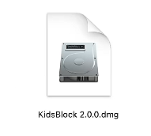

2. KidsBlockをクリックし、「**KidsBlock Desktop**」を「**Applications**」にドラッグします。以下に示す通りです。

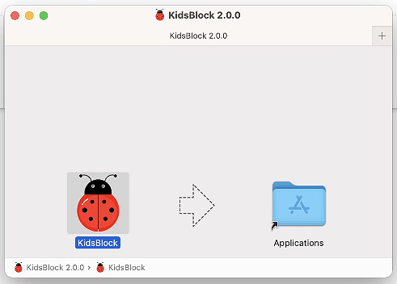

3. インストール後、KidsBlockアイコンが操作パッドに表示されます。

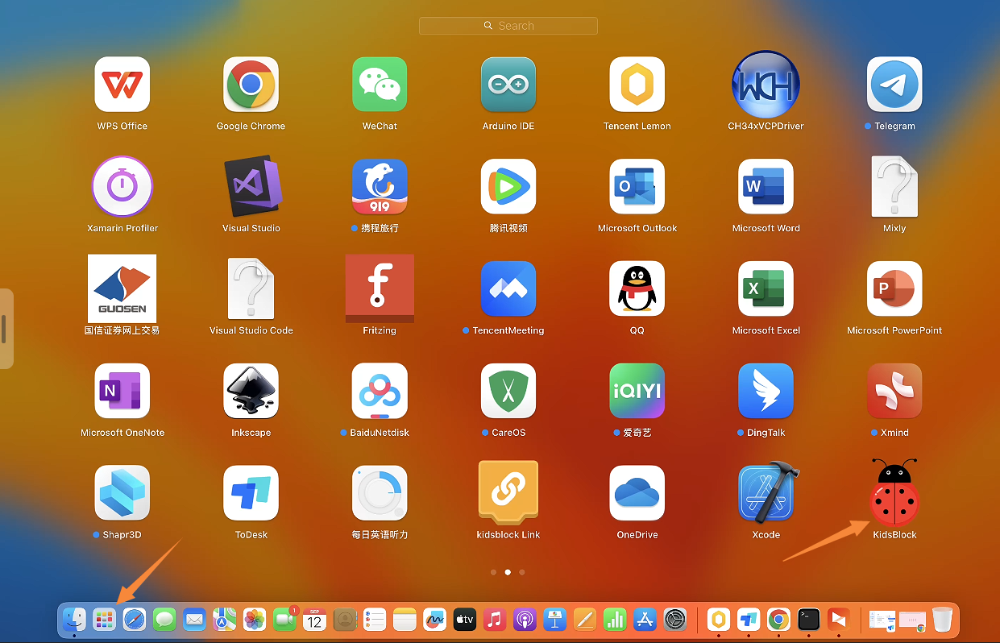

4. KidsBlockアイコンをクリックしてソフトウェアに入ります。失敗した場合は、一部のコンピューター設定を変更して再入力してください。これは、MacシステムがデフォルトでApp Storeでのインストールのみを許可しており、他のインストールが許可されていないためです。

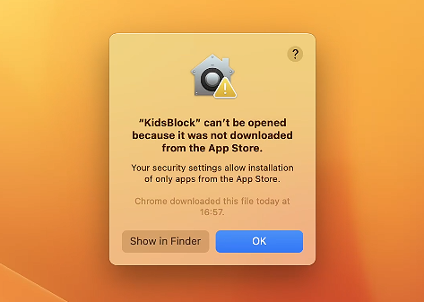

5. 設定を開き、「プライバシーとセキュリティ」をクリックします。セキュリティオプションを「App Storeと承認済み開発者」に切り替え、「それでも開く」をクリックします。

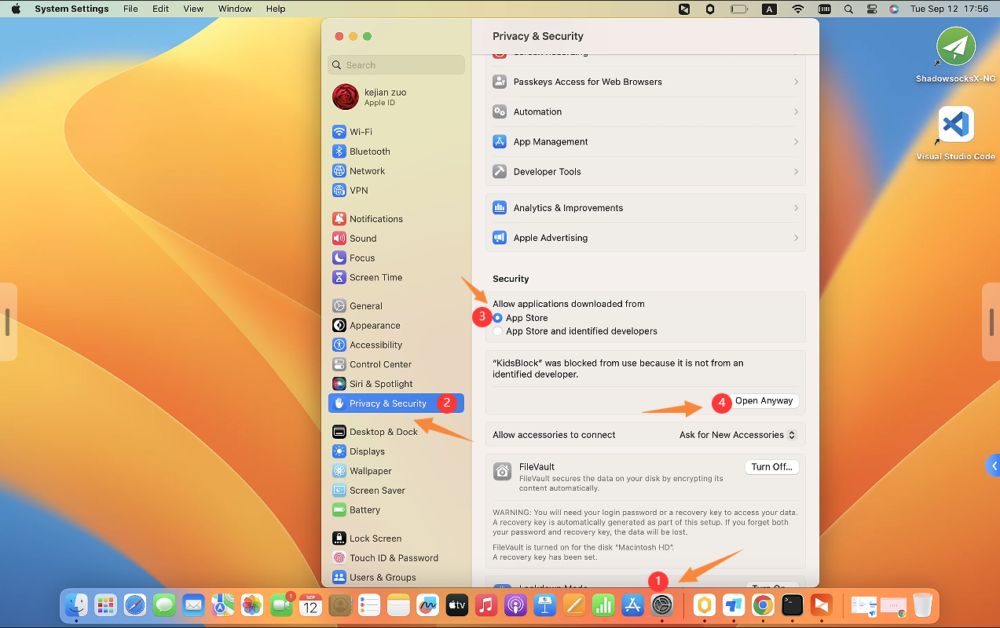

6. 「開く」をクリックして、ブロックされたソフトウェアに再入力します。

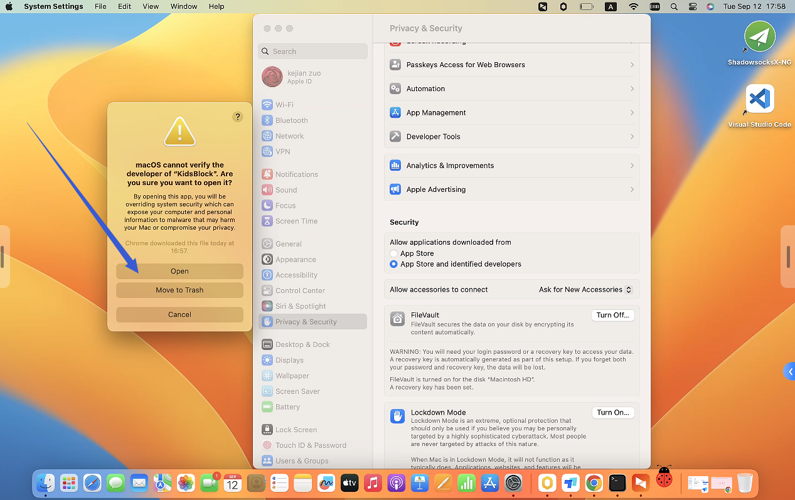

7. 設定後、正常に動作します。

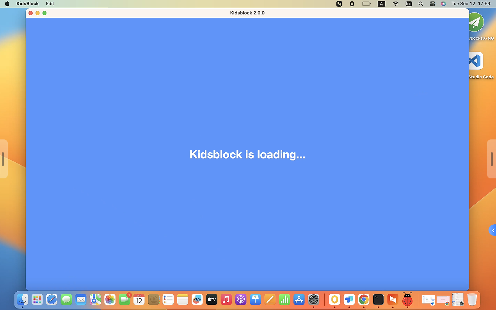

8. 起動インターフェースは以下の通りです。さあ、プログラミングの旅を楽しんでください！

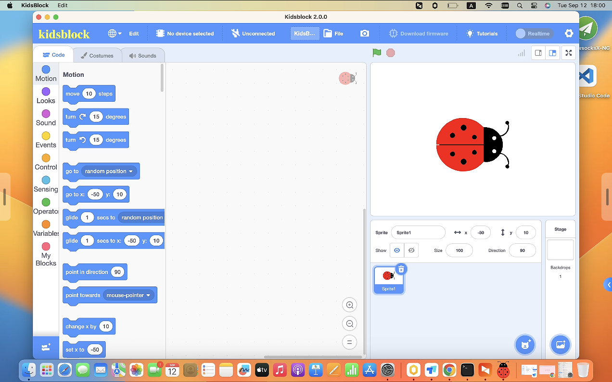

---

### 1.2 ソフトウェアガイド

（**以下のデモンストレーションはWindowsシステムに基づいており、MacOSの参考としてのみです。**）

#### 1.2.1 メインページ機能の分布 1

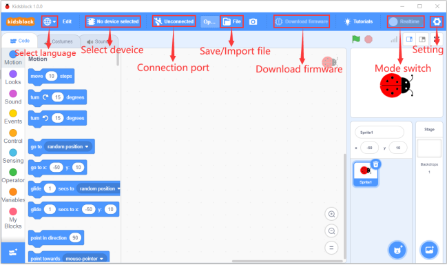

#### 1.2.2 言語の選択

をクリックして「English」または「简体中文」を選択します。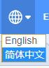

#### 1.2.3 デバイスの選択

**デバイスとシリアルポートを選択する**

- をクリックしてデバイスを選択します。

- ここでは**Kit**に入り、**Smart farm for ESP32**を見つけて追加します。すべてのセンサーはこのキットに含まれているため、追加でインポートする必要はありません。

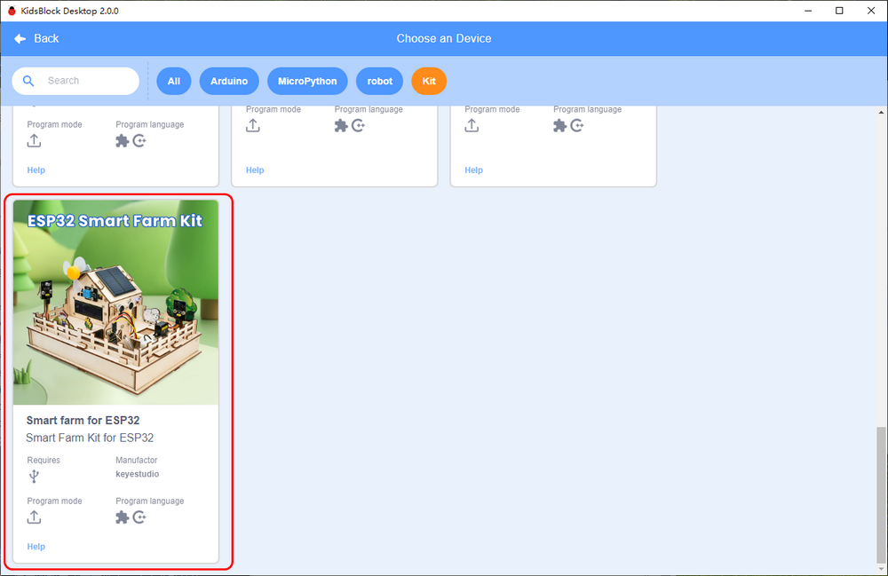

- このキットをインポートすると、ポート選択の以下のインターフェースが表示されます。正しいポートで「**Connect**」をクリックします。

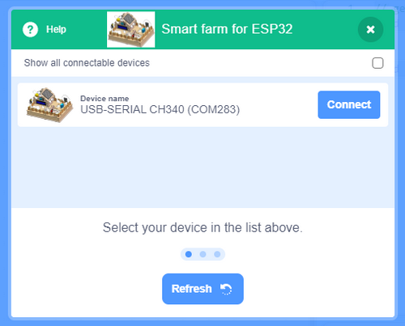

- 「**Go to Editor**」をタップします。

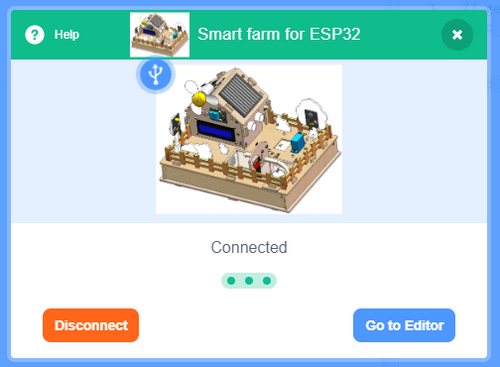

- メインページ:

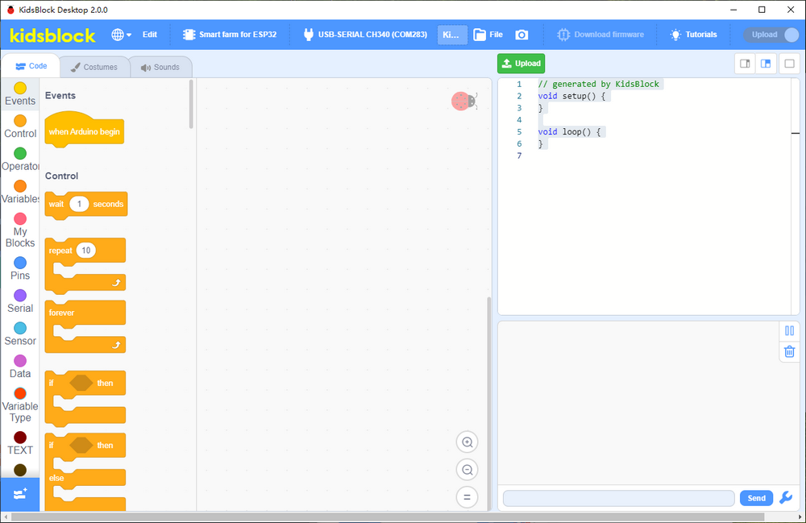

**デバイスの切断**

- キットとポートを切断したい場合は、をクリックしてください。

- 次に「**Disconnect**」をタップして、現在の接続を解除します。

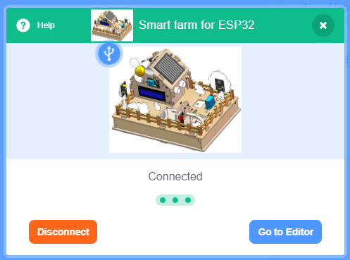

---

#### 1.2.4 メインページ機能の分布 2

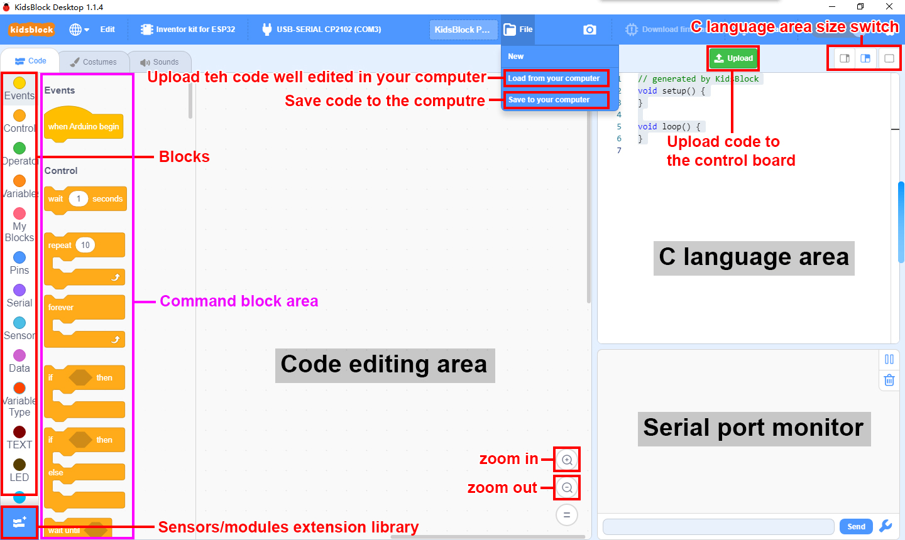

#### 1.2.5 センサー/モジュールの拡張

**注: 必要なすべてのセンサーがキットに統合されており、拡張する必要がないため、この部分はスキップできます。除外されたモジュールを採用したい場合は、以下の手順を参照してください。**

- をクリックしてセンサー/モジュール拡張ライブラリに入ります。

- 拡張機能を選択します。

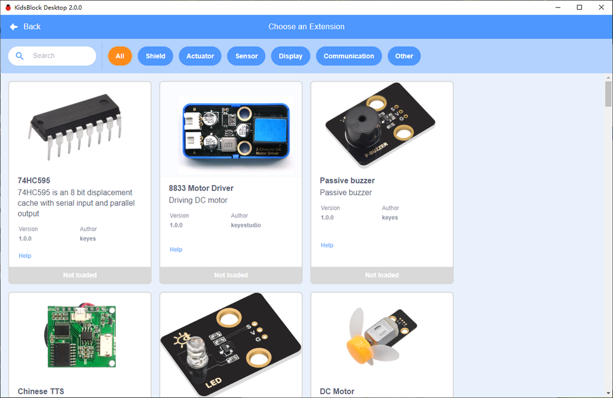

- 例えば、ブザーモジュールが必要な場合は、パッシブブザーをクリックします。

- 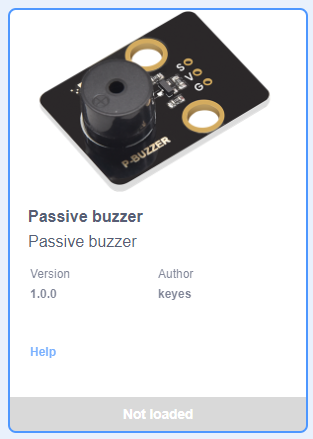

- 「**Not loaded**」が「**Loaded**」に変わると、このモジュールは正常にインポートされました。

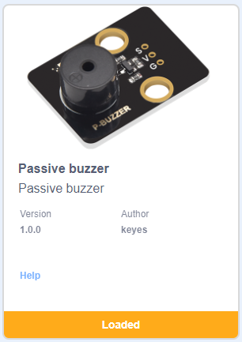

- をクリックしてエディターに戻ります。これで、コードにパッシブブザーブロックが表示されていることがわかります。

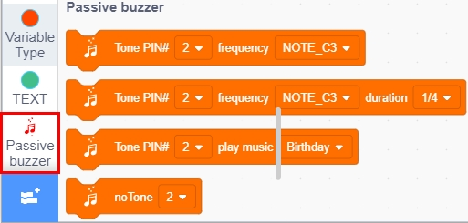

- 「Passive buzzer」を削除したい場合は、をクリックしてライブラリに入り、タップします。

- 「Loaded」が「Not loaded」に変わると、このモジュールは正常に削除されました。

#### 1.2.6 ファイルのインポート

- 方法 1

   - ソフトウェアが動作していない場合は、SB3ファイルを直接クリックして開きます。例えば、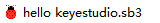をクリックして開きます。デバイスを選択することを忘れないでください。

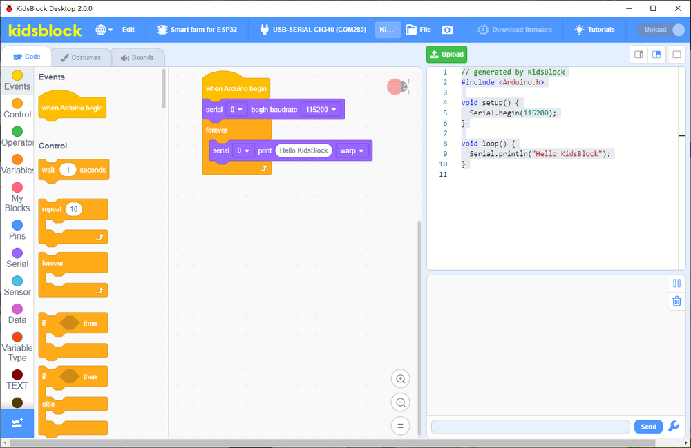

- 方法 2

   - Kidsblockを開きます。「**file**」をクリックして「**Load from your computer**」を選択します。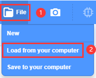

- SB3ファイルを選択します（例: ）。

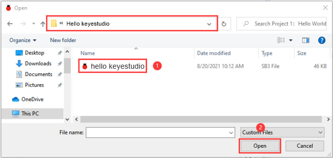

   - 正常にインポートされました！

#### 1.2.7 コードのアップロードとボーレートの設定

**コードのアップロード**

- ファイルをKidsblockにアップロードします。

- 開発ボードをコンピューターに接続し（ポートが表示されない場合は、まずドライバーをインストールしてください）、正しいポートを選択してをクリックします。

- アップロードを待ちます。

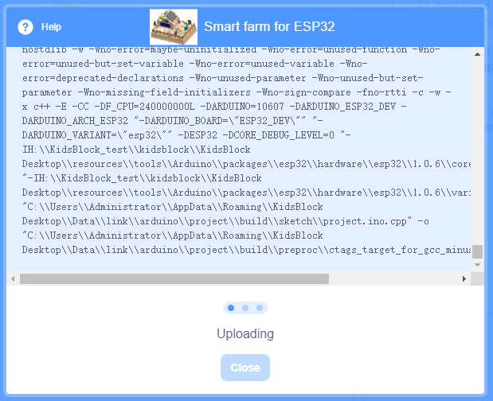

**ボーレートの設定**

- 印刷ボックスがない場合は、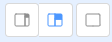のいずれかをクリックしてボックスサイズを調整してください。

   - 小さい印刷ボックス 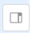
   - 大きい印刷ボックス 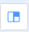
   - 印刷ボックスなし 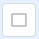

- をクリックして対応するボーレートを設定します。

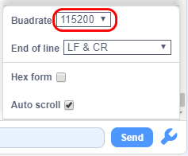

- 設定後、ボックスに「**Hello KidsBlock**」が印刷され始めます。

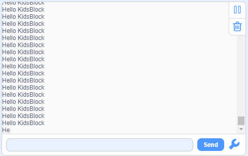