## 2. Installation du logiciel

### 2.1 Installer le pilote

**REMARQUE : Si un pilote est déjà installé sur votre ordinateur, veuillez simplement ignorer cette section. Sinon, veuillez suivre ces étapes.**

Cliquez sur  pour sélectionner « **Installer le pilote** ».

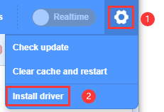

- Cliquez sur « **Suivant** » lorsque vous voyez l'assistant d'installation du pilote de périphérique :

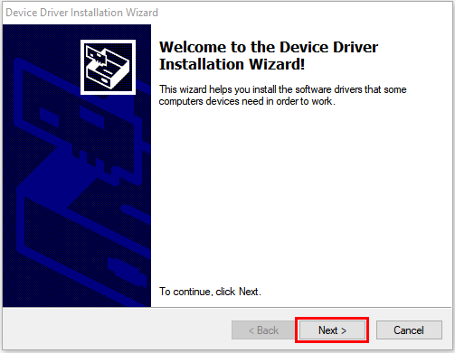

- Cliquez sur « **Terminer** ».

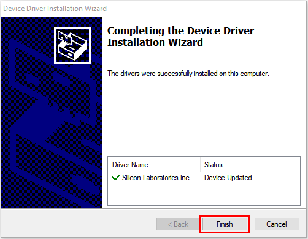

- Cliquez sur « **Suivant** ».

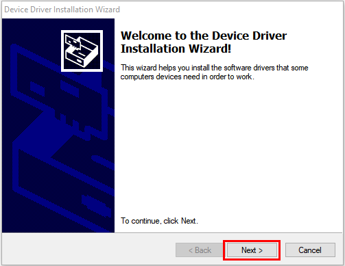

- Cliquez sur « **Terminer** ».

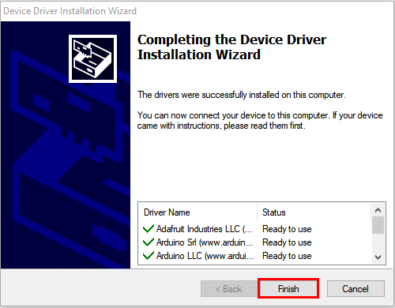

- Si un avertissement apparaît, cliquez simplement sur « **Autoriser** ». Cliquez ensuite sur « **Installer** ».

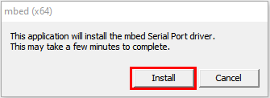

- Appuyez sur « **Terminer** ».

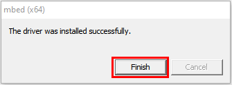

- Cliquez sur « **Extraire** ».

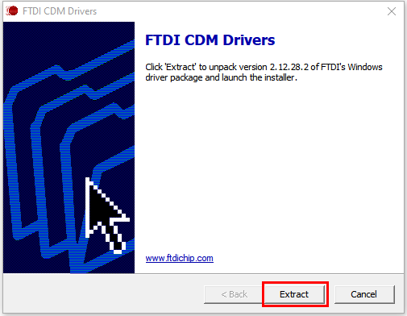

- Cliquez sur « **Suivant** ».

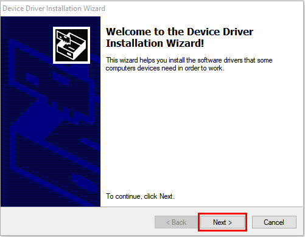

- Cochez « **J'accepte cet accord** » et cliquez sur « **Suivant** ».

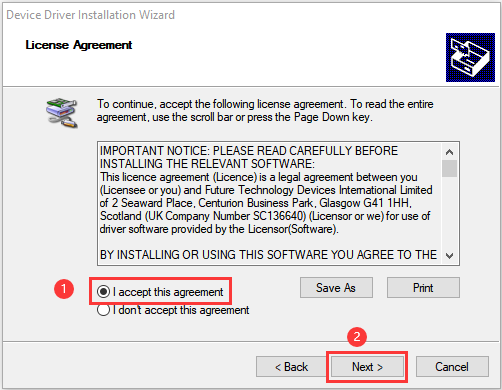

- Cliquez sur « **Terminer** ».

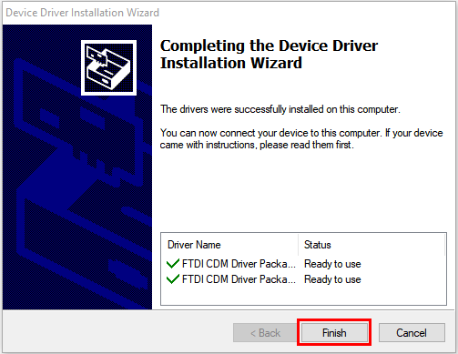

- Choisissez « **INSTALLER** ».

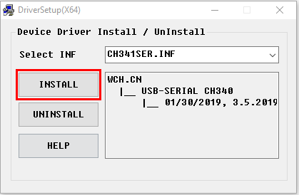

- Quelques secondes plus tard, le pilote sera installé avec succès. Cliquez ensuite sur « **OK** ».

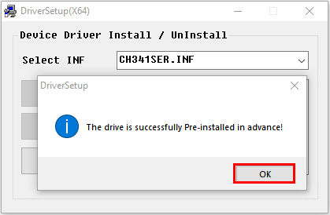