### 4.10 プロジェクト：自動灌漑システム

---

**注意！実験中にプラスチックプールから水を溢れさせないでください。他のセンサーに水をこぼすと、短絡して正常な動作を妨げるだけでなく、発熱や爆発を引き起こす可能性があります。細心の注意を払ってください！特に小さなお子様は、保護者の方と一緒に操作してください。安全を確保するため、ガイドラインと安全規則に従ってください。**

---

このプロジェクトでは、リレーモジュールによって制御されるウォーターポンプを介して灌漑をシミュレートします。さらに、水位センサーでプールに水があるかどうかを判断し、土壌湿度センサーで土壌湿度を検出します。このようにして、システムはウォーターポンプの制御においてよりインテリジェントになります。

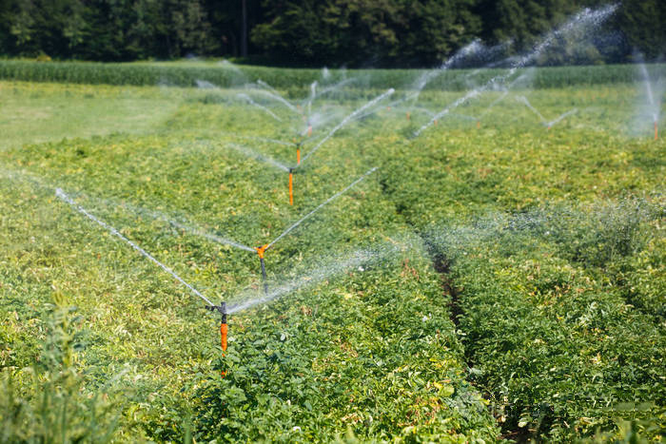

---

#### 4.10.1 フロー図

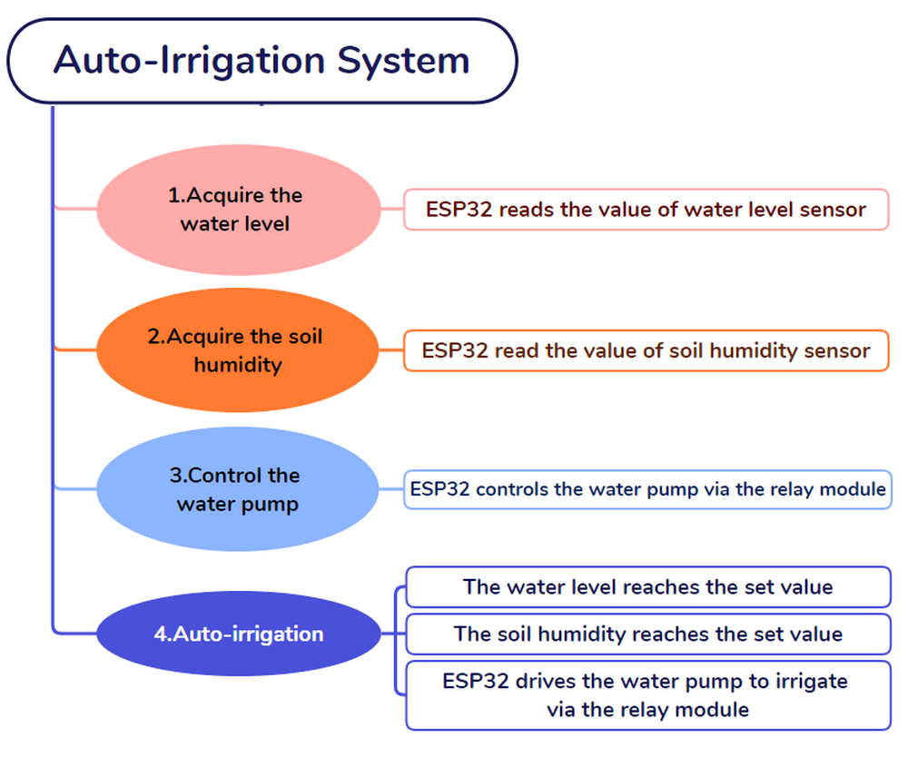

---

#### 4.10.2 揚水システム

**説明:**

この実験では、ESP32開発ボードを使用して、リレーモジュールでウォーターポンプのオン/オフを切り替えます。ポンプは水を汲み上げ、液体を輸送し、通常はリレーモジュールと組み合わせて使用されます。

ここでは、リレーモジュールとポンプをESP32ボードに接続し、リレーの状態を切り替えることでポンプを遠隔でオン/オフするプログラムを作成します。その方法として、モジュールの出力値またはプリセットされた時間に基づいてリレーの状態を決定します。

---

**リレーモジュール:**

使用時には、モーター、高電流センサー、高出力ライトなどの高電圧および負荷電流の管理によく使用されます。

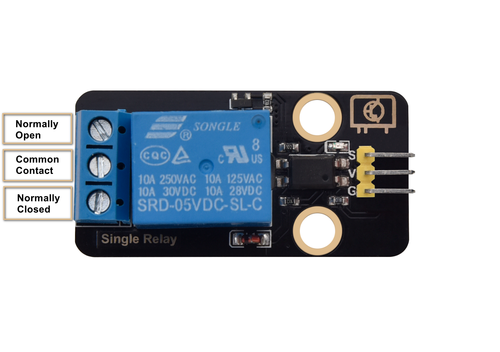

-  **ノーマルオープン (NO):** このピンは通常開いていますが、リレーの信号ピンが信号を受信すると閉じます。したがって、共通ピンはNCピンを介して切断され、NOピンを介して接続されます。

-  **共通接点 (COM):** このピンは、例えばウォーターポンプなど、他のモジュールに接続します。

   -  ウォーターポンプ:

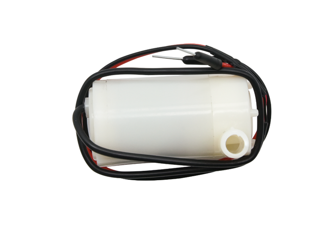

-  **ノーマルクローズ (NC):** NCピンはCOMピンとリンクして閉回路を形成します。ESP32ボードを使用してリレーモジュールの開閉を制御します。

---

**パラメータ:**

-  電源電圧: 5V
-  静止電流: 2mA
-  最大接点電圧: 250VAC/30VDC
-  最大電流: 10A

**回路図:**

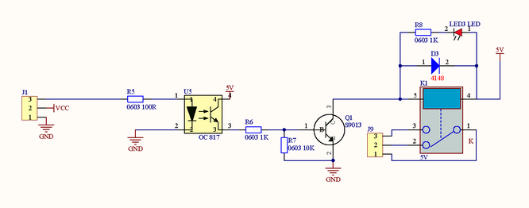

---

**配線図:**

**注意: 黄色をS(信号)、赤をV(電源)、黒をGNDに接続してください。逆接続しないでください！**

---

**テストコード:**

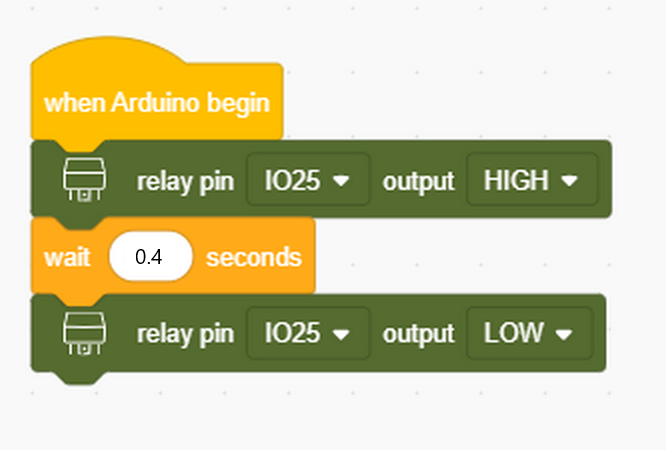

**テスト結果:**

コードをアップロードすると、デバイスは一度水を汲み上げます。

この実験では、ウォーターポンプが自動化され、手動操作の時間と労力を削減し、効率を向上させます。したがって、この揚水システムは農業生産や水処理で広く使用されています。

---

#### 4.10.3 自動灌漑システム

**説明:**

この実験では、土壌湿度センサー、水位センサー、リレーモジュール、ウォーターポンプを使用してスマート灌漑システムを実装します。2つのセンサーをESP32開発ボードに接続し、それらの出力値を読み取ってリレーとウォーターポンプを制御するプログラムを作成します。

土壌が非常に乾燥している場合、リレーがオンになり、ウォーターポンプを制御して植物に水を供給します。水位が低すぎる場合、ウォーターポンプは動作できず、ブザーが警報を発します。このようにして、植物の水やりと水位制御が自動化され、生産効率が向上し、手動操作の時間と労力が削減されます。

---

**配線図:**

-  **リレーモジュールをio25に接続します。そのNCピンをio2のGND(黒)に接続します。**
-  **ウォーターポンプ:**
   -  **赤い線をボードのPOWER 3V3に接続します。**
   -  **黒い線(GND)をリレーのCOMピンに接続します。**

-  **土壌湿度センサーをio32に接続します。**
-  **水位センサーをio33に接続します。**

**注意: 黄色をS(信号)、赤をV(電源)、黒をGNDに接続してください。逆接続しないでください！**

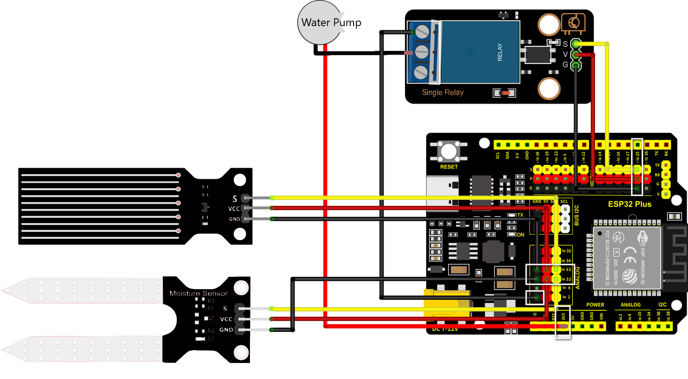

---

**テストコード:**

コードフロー:

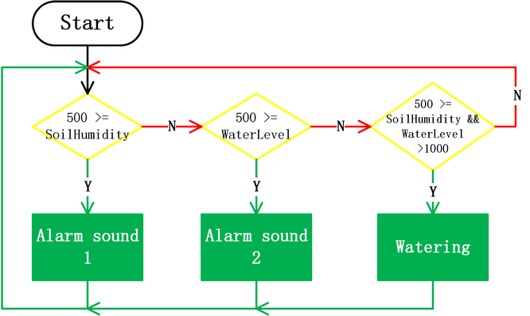

コード:

-  LCDを初期化してクリアし、LCDバックライトをオンにします。検出されたセンサー値として2つの変数を定義します。

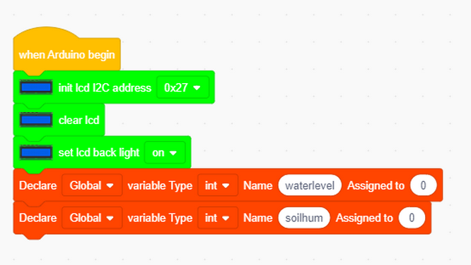

-  読み取った2つのセンサー値をこれらの変数に割り当てます。

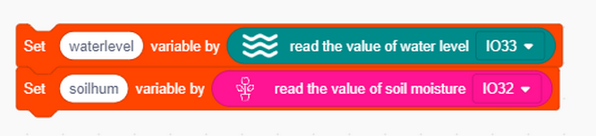

-  これらの値をLCDに表示します。

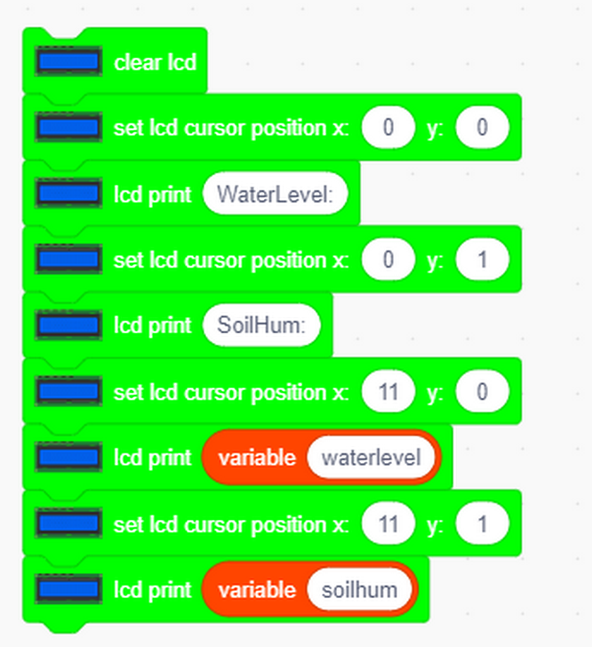

-  水位値が700未満、または土壌湿度値が1200未満の場合、ブザーが警報を発します。

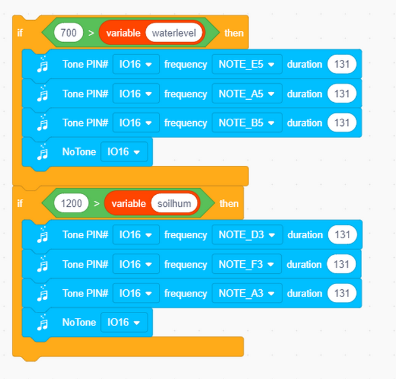

- 土壌湿度が1200より低く、水位が700より大きい場合、ウォーターポンプは自動的に農場を灌漑します。

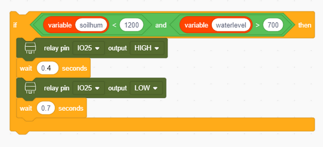

完全なコード：

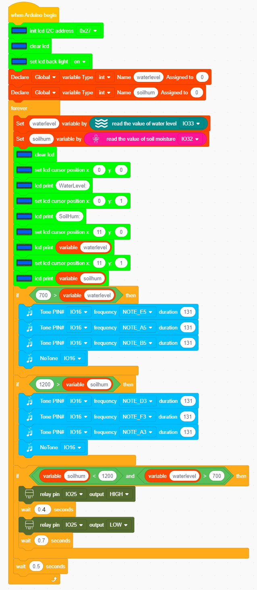

**テスト結果:**

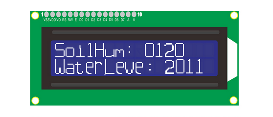

- LCD 1602は土壌湿度と水位の現在の値を表示します。検出された湿度が設定されたしきい値より低い場合、土壌が乾燥していることを意味し、灌漑が自動的に開始されます。
- 検出された水位が設定されたしきい値より低い場合、揚水システムは動作せず、ブザーが鳴って水不足を通知します。
- ボタンを押すとアラームが停止します。

---

**まとめると、このプロジェクトでは、水位に応じてウォーターポンプのオン/オフをインテリジェントに制御するアナログ自動灌漑システムを実現しました。このシステムは、家庭用および農業生産に通常適用されます。**

---

#### 4.10.4 FAQ

Q: モジュールは防水ですか？

A: リレーモジュールは防水ではありませんが、ウォーターポンプは防水です。ウォーターポンプの防水等級はIP68です。

---

Q: ウォーターポンプが動作するとESP32ボードがリセットされます。

A: ウォーターポンプが動作すると、他のモジュールよりも多くの電流が必要となるため、回路内の電圧と電流が変動する可能性があります。場合によっては、変動が大きすぎて、ESP32開発ボードの電圧と電流が極端に低くなり、リセットが発生することがあります。

ウォーターポンプを操作する際は、以下のサンプルコードに従ってください。

---

Q: 水を汲み上げることができませんか？

A: ウォーターポンプを使用する前に、ポンプを満たすために数回の汲み上げ操作が必要です。これらの最初の汲み上げは実際には水を汲み上げるのではなく、ポンプに十分な水を導入するためのものです。ポンプが満たされて初めて水を運ぶことができます。したがって、最初は汲み上げるのではなく、満たすためのものです。

---