### 4.11 プロジェクト: WIFI制御スマートファーム

---

**注意！実験中にプラスチックプールから水があふれないようにしてください。他のセンサーに水をこぼすと、ショートしたり、モジュールが動作しなくなる可能性があります。バッテリーが濡れると、爆発することさえあります。細心の注意を払ってください！小さなお子様は、保護者の方と一緒に操作してください。安全を確保するため、指示と安全規則に従ってください。**

---

---

#### 4.11.1 フロー図

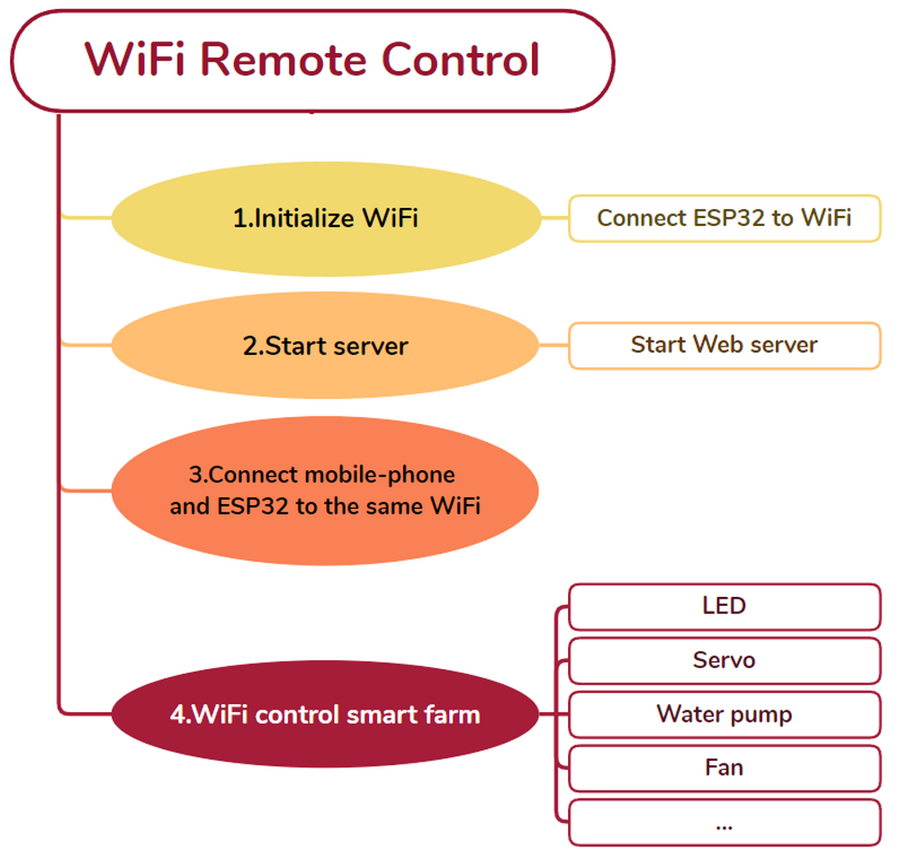

---

#### 4.11.2 WIFIウェブページ表示

**説明:**

ESP32ボードはWi-Fi(2.4G)とBluetooth(4.2)を搭載しており、Wi-Fiに簡単に接続し、ネットワーク上の他のデバイスと通信できます。さらに、ESP32を介してブラウザにウェブページを表示できます。

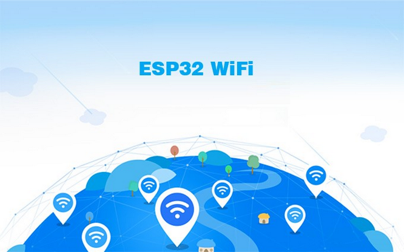

**ESP32ボードは、Wi-Fi設定とESP32 Wi-Fiネットワーク監視をサポートするライブラリファイル `<WiFi.h>` を提供します。**

- **基地局モード** (STAまたはWi-Fiクライアント側モード): このモードでは、ESP32はWi-Fiホットスポット (AP) に接続します。
- **APモード** (Soft-APまたはWi-Fiホットスポットモード): このモードでは、他のWi-FiデバイスがESP32に接続します。
- **AP-STAモード**: このモードでは、ESP32はWi-Fiホットスポットであると同時に、別のWi-Fiホットスポットに接続するWi-Fiデバイスでもあります。
- これらのモードは、WPA、WPA2、WEPなどの複数の安全モードと互換性があります。
- アクティブスキャンとパッシブスキャンを含むWi-Fiホットスポットをスキャンできます。
- IEEE802.11 Wi-Fiパケットを監視するためのプロミスキャスモードをサポートしています。

---

Wi-Fiの詳細については、以下を参照してください。

https://docs.espressif.com/projects/esp-idf/en/latest/esp32/api-reference/network/esp_wifi.html

ESPRESSIF公式サイト: https://www.espressif.com.cn/en/home

---

**ライブラリのインポート**

-  をクリックします。

-  をクリックして「**Web Page Editing PRO**」を選択すると、ライブラリがロードされます。

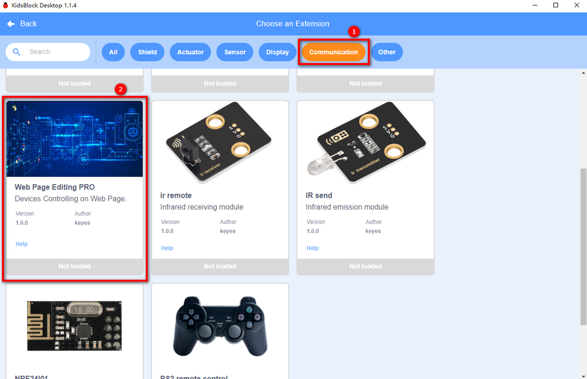

**テストコード:**

- WiFiホットスポットに接続し、SSIDとパスワードを入力します。

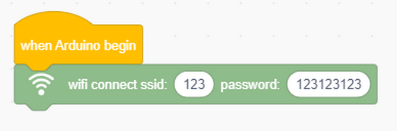

- LCDにIPアドレスを表示します。

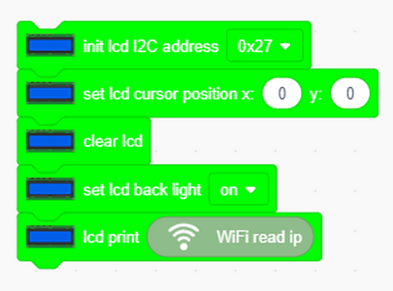

- 温度（単位: ℃）という名前のウェブページコンポーネントを定義します。

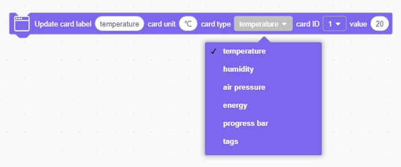

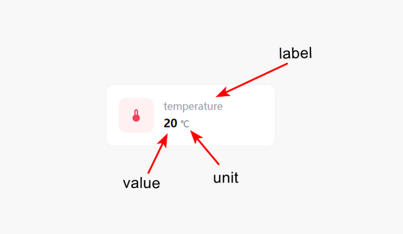

- 「button」という名前のボタンを追加します。

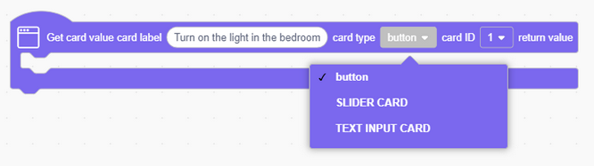

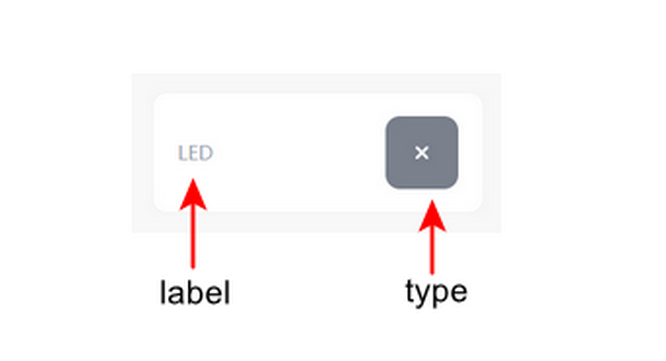

完全なコード:

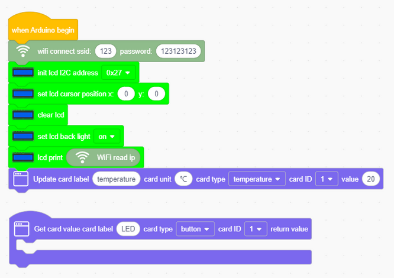

**ウェブサイトにアクセスする**

WiFiに接続すると、ESP32のウェブサーバーライブラリを使用してウェブページを提供できます。以下の例では、固定の温度情報を表示するシンプルなウェブページを作成します。

最後に、ブラウザでIPアドレスを開いてウェブページにアクセスできます。私たちのサンプルコードでは、「http://[ESP32のIPアドレス]」と入力してウェブサイトにアクセスしてください。

**注: PC、携帯電話、ESP32ボードが同じネットワークに接続されている場合、PCと携帯電話で同時にこのウェブサイトにアクセスできます。**

**これはあなた自身のESP32のIPアドレスです。**

*PC:*

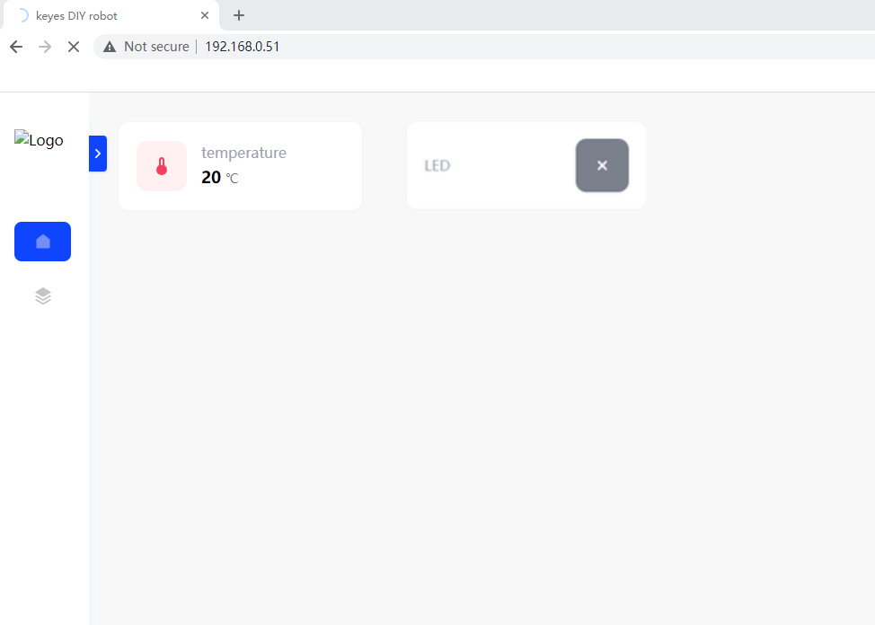

*携帯電話:*

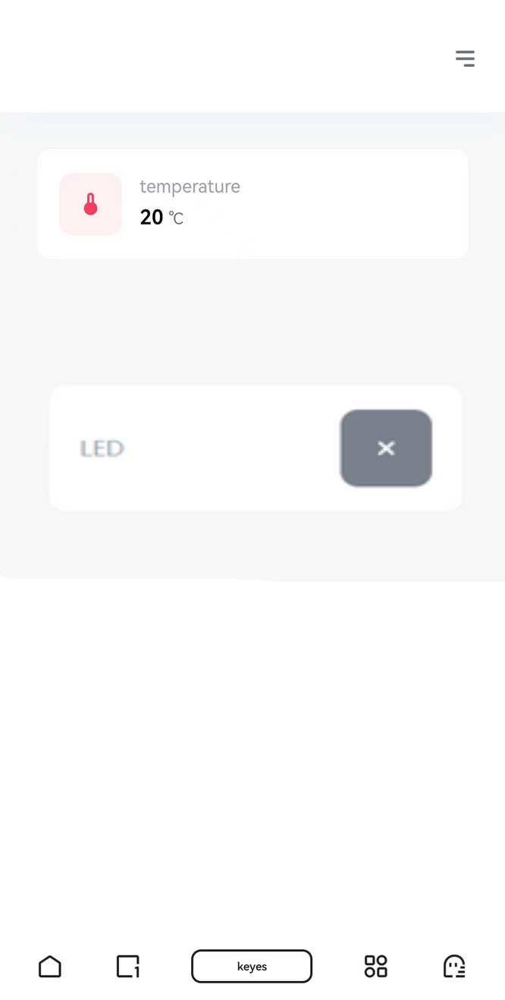

---

#### 4.11.3 WIFI制御スマートファーム

**コードフロー:**

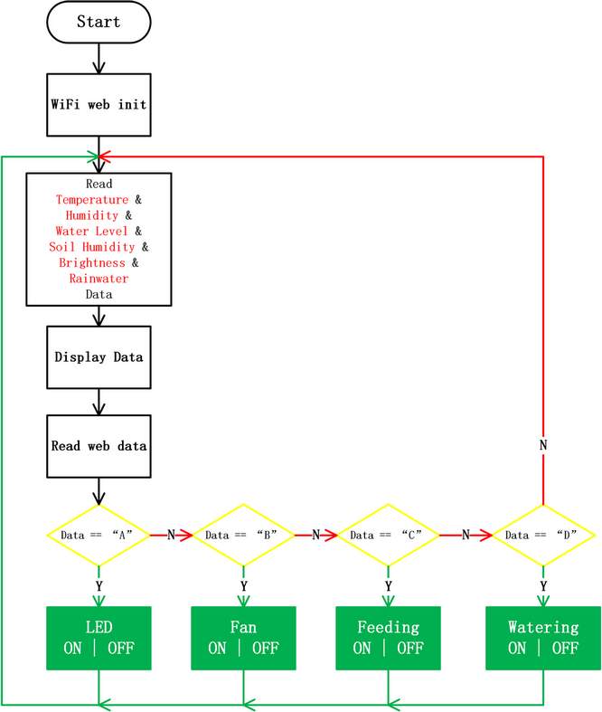

---

コードをアップロードします。

**SSID**と**PASSWORD**は、お使いのWi-Fi名とパスワードに変更する必要があります。

**完全なコード:**

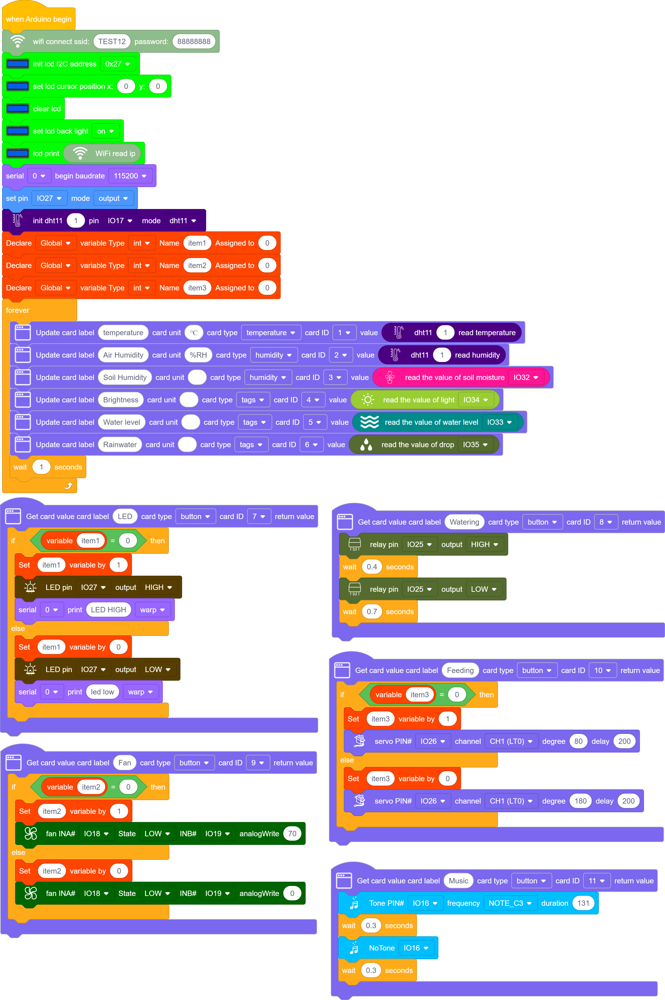

---

**結果:**

**PC:**

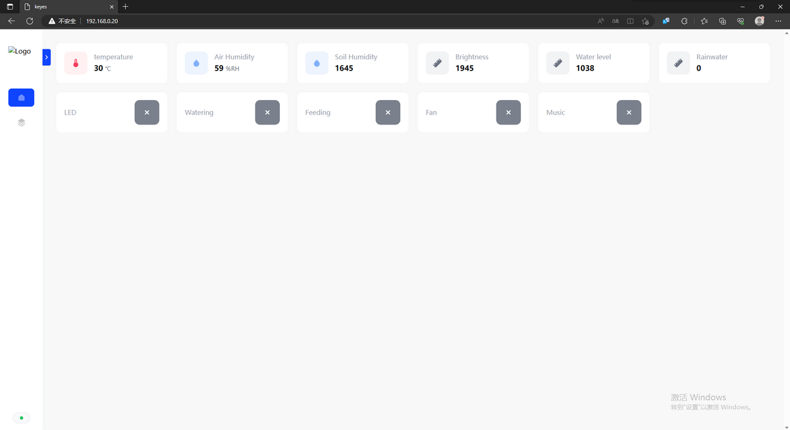

**携帯電話:**

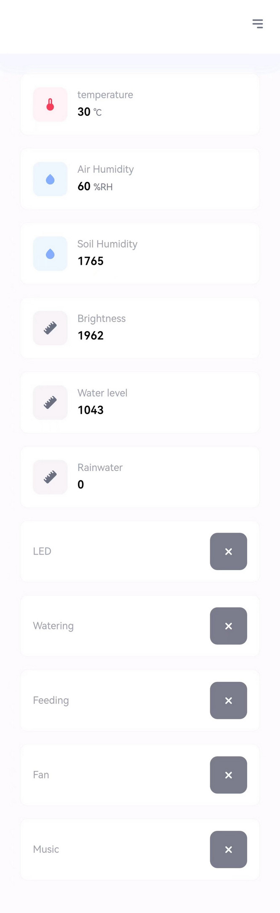

携帯電話またはPCのブラウザにIPアドレスを入力すると、センサー値を確認し、LEDとファンを制御できます。

---

| センサー値 | 制御可能なデバイス |
| --- | --- |
| 温度 (℃) | LED |
| 湿度 (%rh) | ファン |
| 水位 (%) | 給餌ボックス |
| 降雨量 (%) | ウォーターポンプ |
| 明るさ (0~4095) | |
| 土壌湿度 (%) | |

ESP32開発ボードを使って、温度、湿度、水位、土壌湿度などのセンサー値を表示するウェブページを作成する方法を学びました。また、LEDライト、ファン、給餌ボックス、ポンプを制御することもできます。さらに、これらの操作は携帯電話やコンピューターからリモートで完了できます。

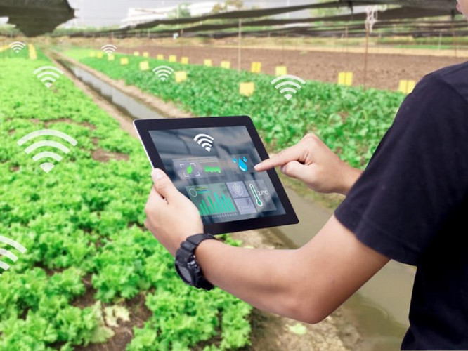

このプロジェクトでは、インテリジェントな遠隔管理を備えたスマートファームをシミュレートします。このような技術は、機器の制御を容易にし、農業の効率と品質を向上させ、モノのインターネット、情報化、自動化、インテリジェンスを可能にします。

---

#### 4.11.4 FAQ

Q: Wi-Fiが常に接続に失敗します。

A: ESP32をルーターのそばに移動してボードを再起動し、辛抱強く待ってください。それでも接続に失敗する場合は、Wi-Fi名とパスワードが正しいか確認してください。

---

Q: ウェブページでのリモート操作中に応答が遅いです。

A: 考えられる原因：

- 複数の接続により、ルーターのCPUリソースが不足しています。再接続を試すためにルーターを再起動してください。
- ルーターが長時間動作しています。ルーターを再起動してください。
- 無線干渉。無線信号は不安定なので、壁越しに使用しないでください。

ルーターの知識については、ご自身でGoogleで検索してください。

---

Q: 水を汲み上げられませんか？

A: ウォーターポンプを使用する前に、ポンプを満たすために数回の汲み上げ操作が必要です。これらの最初の汲み上げは実際には水を汲み上げるのではなく、ポンプに十分な水を導入するためのものです。ポンプが満たされて初めて水を汲み出すことができます。したがって、最初は汲み上げるのではなく、満たすためのものです。

---