### 4.1 Proyecto: Sistema de Iluminación

**Comencemos nuestro primer proyecto, el sistema de iluminación.**

---

Encender un LED es una de las prácticas más fundamentales de KidsBlock.

Esta lección de inicio está diseñada para que los principiantes comprendan la programación de hardware y software en la placa de desarrollo ESP32 y dominen los conocimientos básicos de circuitos y programación.

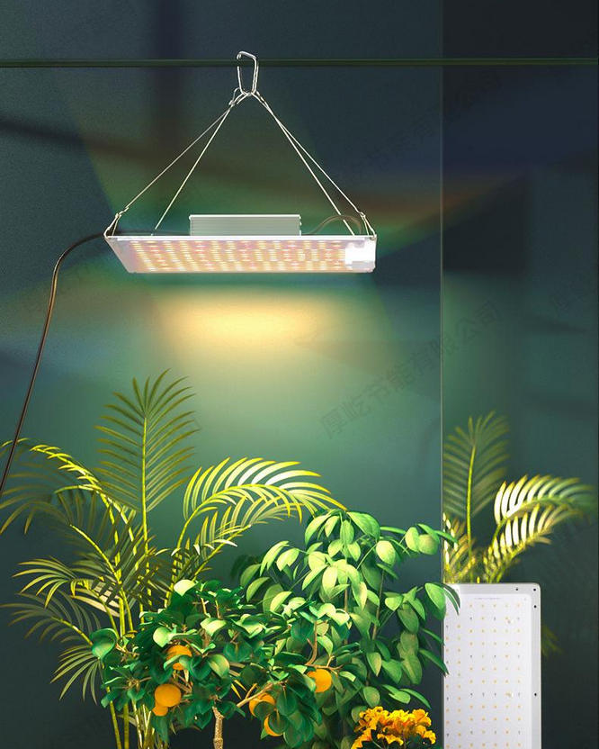

Por lo tanto, nuestra guía tutorial es sencilla. Y este intrigante proyecto se puede aplicar en escenarios reales en casa o en la oficina.

En este proyecto, habrás aprendido las conexiones y configuraciones básicas de la placa de desarrollo ESP32 en la programación gráfica de KidsBlock. Además, se te presentarán algunas funciones, como encender/apagar un LED a través del nivel de salida de un pin digital o mediante un botón.

En resumen, este es un tutorial de nivel de entrada para sentar las bases de las prácticas de programación KidsBlock posteriores.

---

#### 4.1.1 Diagrama de Flujo

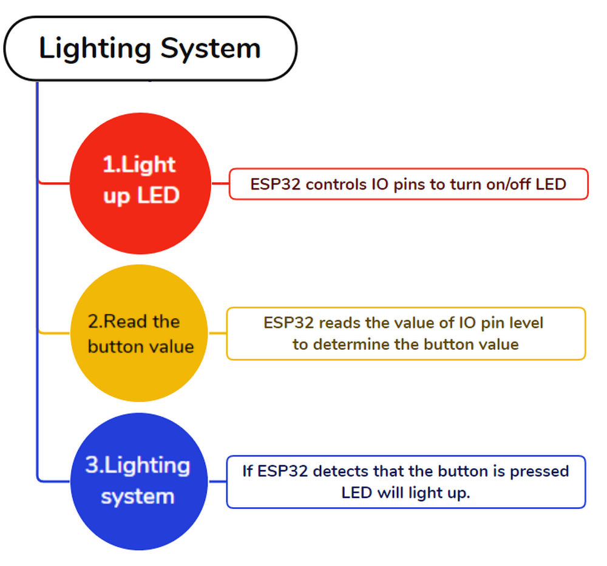

---

#### 4.1.2 Encender un LED

**Descripción:**

LED, abreviatura de Diodo Emisor de Luz, es un semiconductor de estado sólido que convierte la energía eléctrica en luz visible, por lo que también se le llama iluminación de estado sólido.

Cuando la corriente pasa a través de un LED, este se enciende.

**Varios LED:**

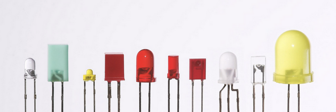

---

El **módulo LED** es un dispositivo de salida, cuya luminosidad y parpadeos pueden controlarse. Para usarlo, solo necesitas conectarlo directamente a los pines de salida digital de la placa de desarrollo.

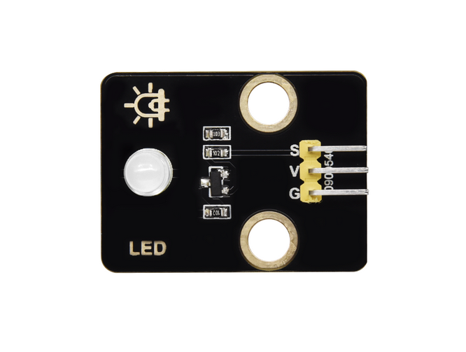

---

**Principio de funcionamiento:**

Cuando S está en un nivel alto, el triodo Q1 entra en conducción, y el voltaje VCC pasa a través del LED para encenderlo.

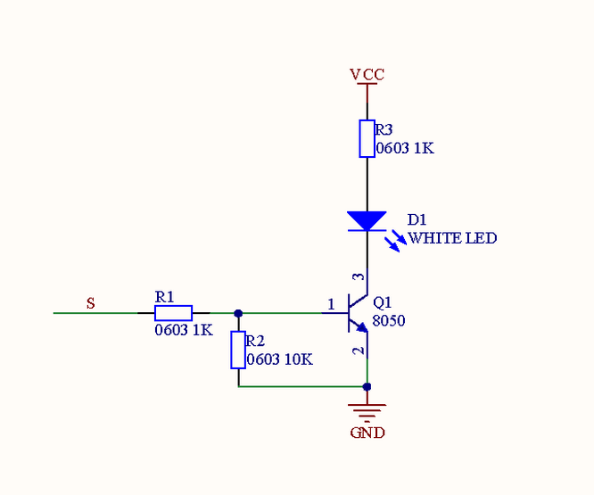

**Parámetros:**

- Voltaje: 3~5V
- Corriente: ≤1.5mA
- Potencia: 0.07W

---

**Diagrama de Cableado:**

**Conecte el módulo LED a io27.**

**Atención: Conecte el amarillo a S (Señal), el rojo a V (Alimentación) y el negro a GND. ¡No los invierta!**

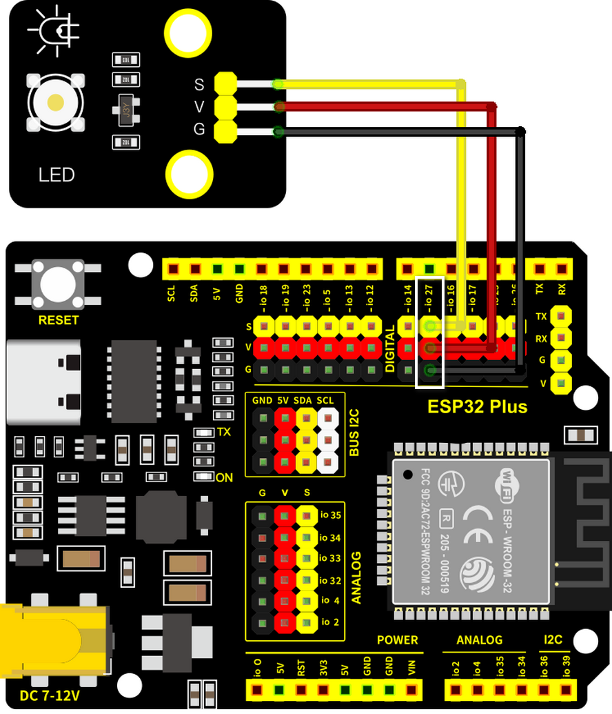

---

**Código de Prueba:**

- Abra Kidsblock y elija el dispositivo y puerto correctos.

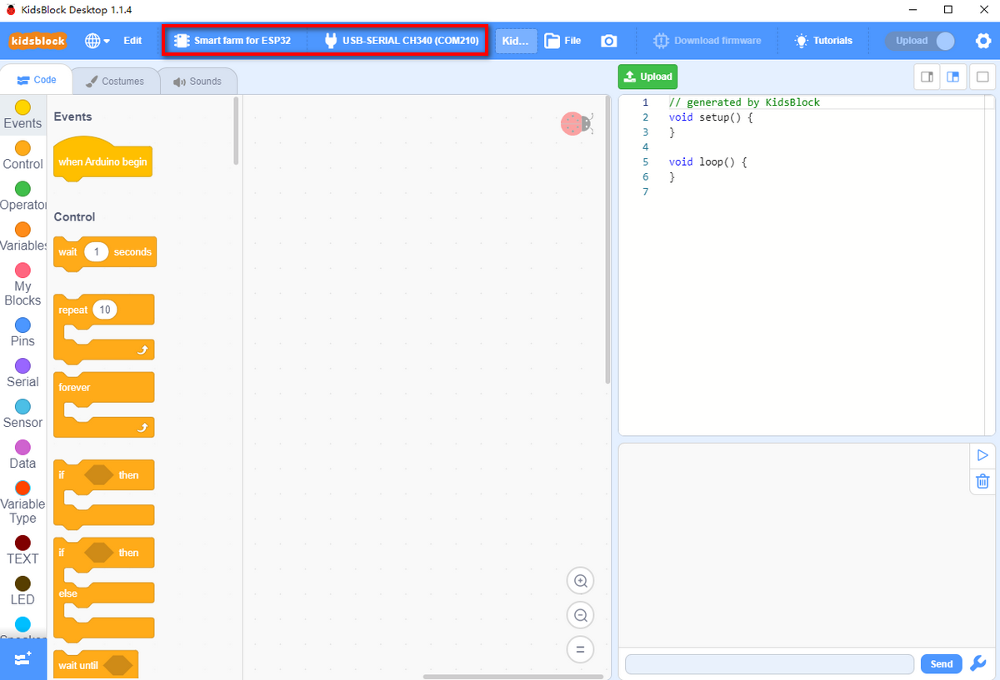

- Arrastre 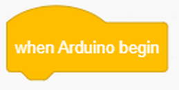 de  al área de edición de código. Los bloques de código solo se ejecutan cuando están en esta área.

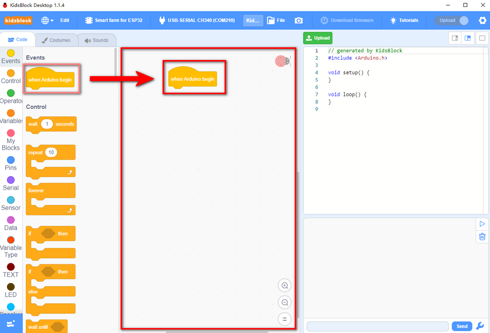

- Con este bloque, al iniciar la placa de desarrollo, el código se ejecutará.

- En , arrastre “ **forever** ” y péguelo debajo del bloque anterior. El bloque “**forever**” indica un bucle.

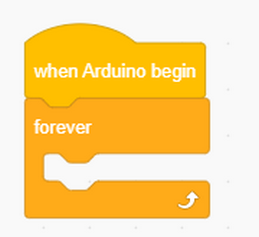

- Arrastre un bloque "**LED pin output**" de 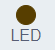 y péguelo en “ **forever** ”. Configure el pin en IO27 y el nivel de salida en HIGH, para que el pin del LED continúe emitiendo un nivel alto.

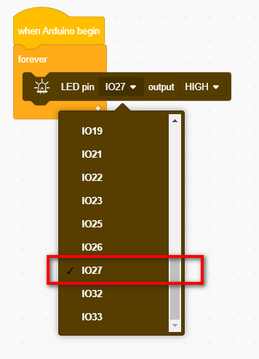

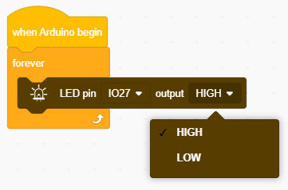

- Agregue un retraso de 1s. Duplique el bloque "**LED pin output**" pero configure la salida en LOW, y también agregue un retraso. Entonces el LED se encenderá y apagará en circulación.

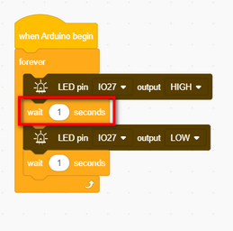

**Resultado de la prueba:**

El LED parpadea por segundo, porque io27 en la placa ESP32 emite nivel alto y bajo alternativamente cada segundo. Además, se pueden realizar varias aplicaciones interactivas a través de un LED, como LED de respiración, luces de flujo de agua y luz de policía intermitente.

| Nivel de potencia | Resultado |
| --- | --- |
| HIGH | LED encendido |
| LOW | LED apagado |

---

**Expansión: LED de Respiración**

**Descripción:**

Las interfaces IO de un MCU (como ESP32) solo emiten señales digitales (nivel alto o bajo). Por ejemplo, en el experimento anterior (encender un LED), las salidas digitales son solo HIGH (3.3V) y LOW (0V).

Si el MCU emite un nivel alto de 3.3V o un nivel bajo de 0V, el voltaje de entrada debe estar entre 0~3.3V. Por lo tanto, se necesita PWM (**Modulación por Ancho de Pulso**) para emitir diferentes valores de voltaje, lo que se denomina "salida analógica".

---

**Conocimiento:**

¿Qué es PWM?

PWM contiene tres elementos: Frecuencia (Hz), Período, Ciclo de Trabajo (%).

- **Frecuencia PWM (f):** las veces que la señal cambia de alto a bajo y vuelve a alto en un segundo. En general, la Frecuencia es el número de Períodos PWM en un segundo.

- **Período PWM (T):** Período = 1 / Frecuencia (T=1/f, y 1 significa 1 segundo). Por ejemplo: f = 50Hz, entonces T = 20ms, lo que implica que hay 50 veces de Período por segundo.

- **Ciclo de Trabajo PWM:** la relación de tiempo de HIGH con respecto a todo el Período. Si el Período = 10ms y 8ms es el tiempo de ancho de pulso, el nivel bajo ocupa 2ms, entonces el Ciclo de Trabajo = 8/(8+2) = 80%.

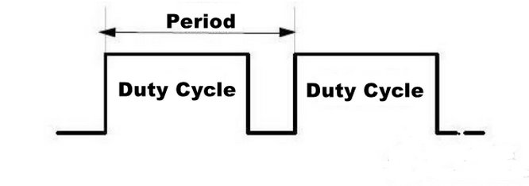

**Conclusión: A una frecuencia de señal apropiada, PWM cambia el voltaje de salida efectivo
cambiando el ciclo de trabajo en un período.** En lenguaje sencillo, dentro de un tiempo especificado, cuanto más nivel alto emita el puerto IO, mayor será el valor PWM y más brillante será el LED.

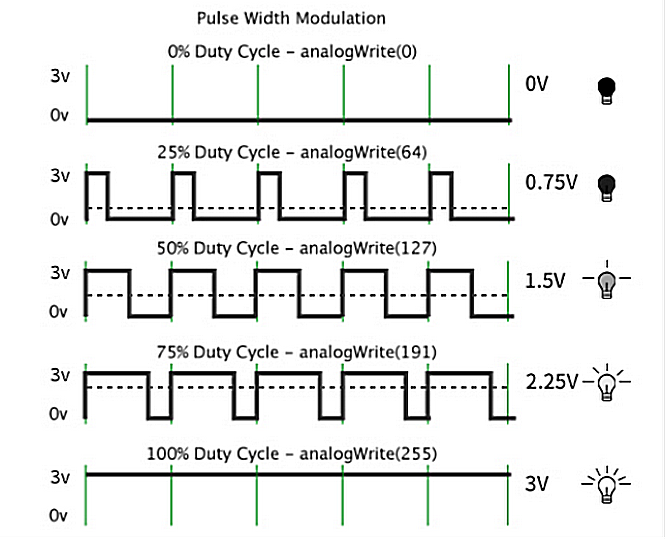

**Código de Prueba:**

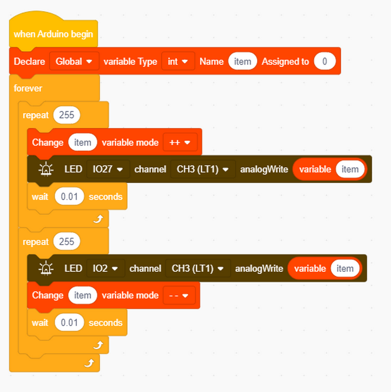

- Define una variable **item** y asígnale el valor 0.

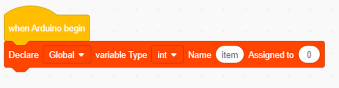

- Arrastre un bloque "**forever**" y pegue un bloque "**repeat**" dentro de él. Establezca las repeticiones en 255.

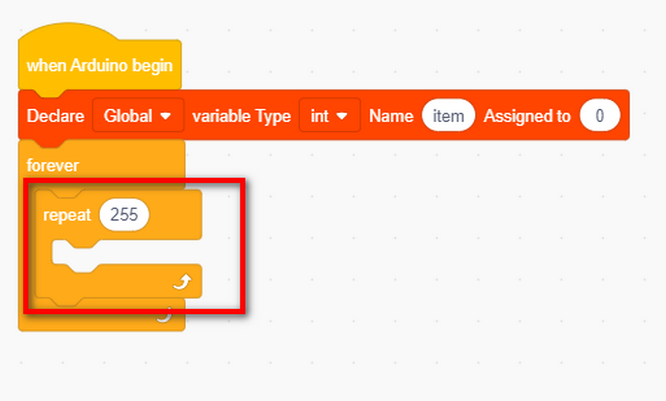

- Arrastre un bloque "**variable mode**" dentro de "**repeat**" y configure el modo en “ **++** ”, lo que significa que **item** aumentará en 1 después de cada ejecución.

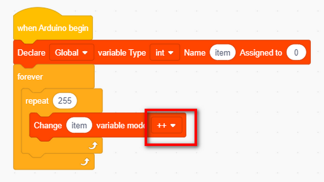

- Encuentre el bloque para configurar PWM que está contenido en  como se muestra
   a continuación, por lo que solo necesita configurar el pin correspondiente y el valor analógico para
   emitir PWM.

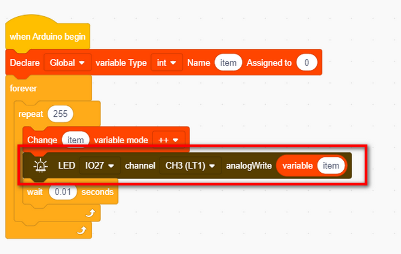

   - Configurar pin LED:

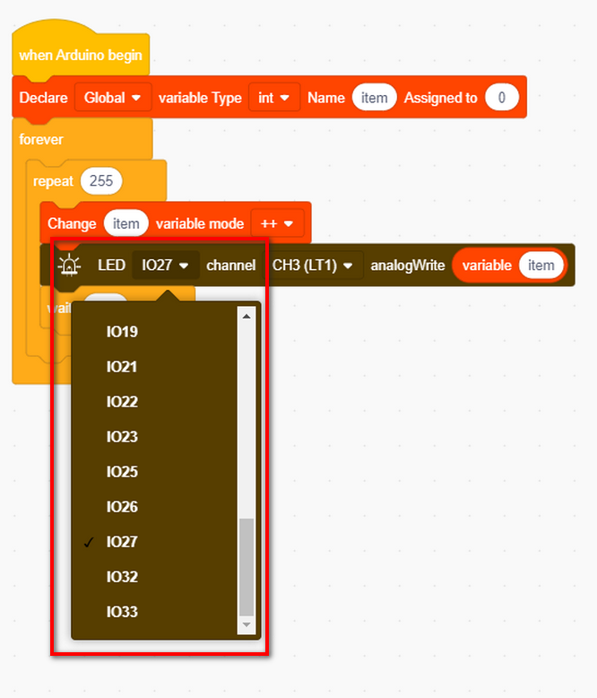

-  Establecer canal: (16 canales en total: incluyendo 0~15)

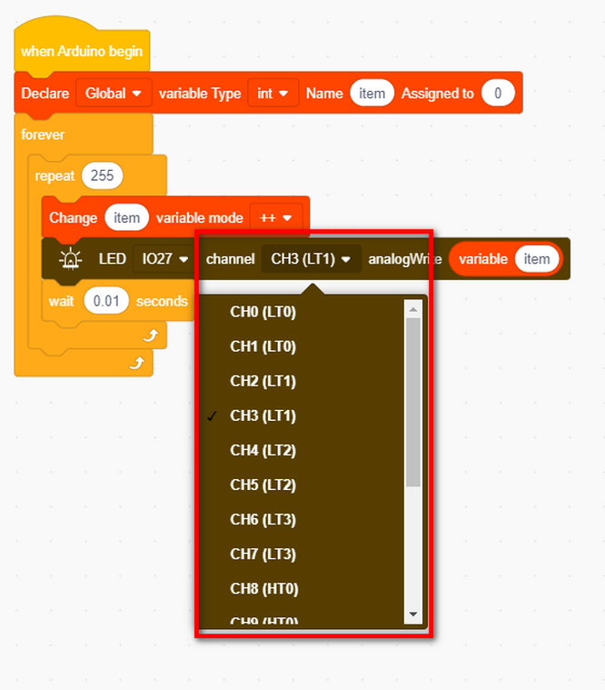

   -  Establezca el valor de salida PWM en **item**, que automáticamente agregará 1 de 0 a 255. **La salida PWM es de 0~255, por lo que configuramos las repeticiones en 255.**

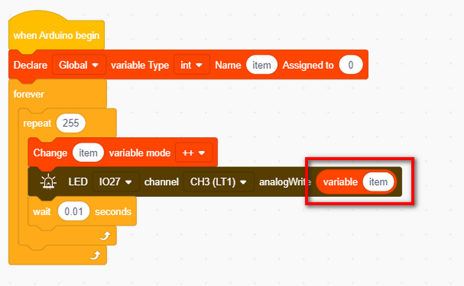

-  Agregue un retraso de 0.01s, para que el LED se encienda gradualmente en lugar de
   de repente.

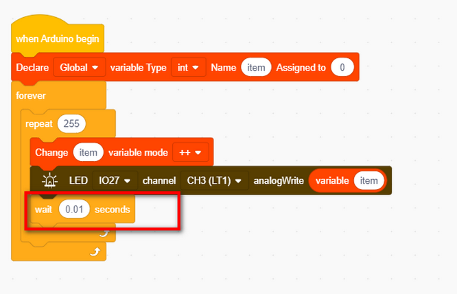

-  Duplique el bloque "**repeat**" de la siguiente manera, pero configure el modo en "**－－**", lo que disminuye la variable **item** cada vez. Y el LED se atenuará gradualmente.

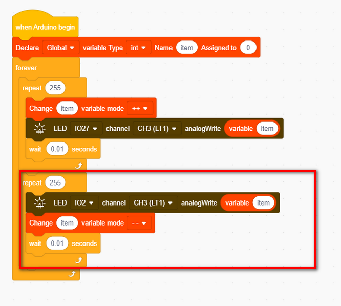

**Resultado de la prueba**

El LED se enciende y se atenúa gradualmente; respira uniformemente.

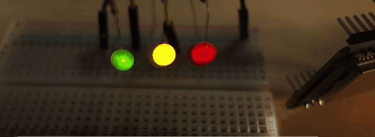

---

#### 4.1.4 Un botón

**Descripción**

El **Módulo de Botón** es un dispositivo de entrada. El MCU lee su nivel de potencia para detectar si el botón está presionado.

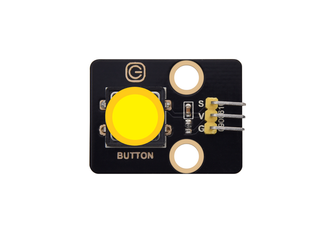

---

**Diagrama esquemático:**

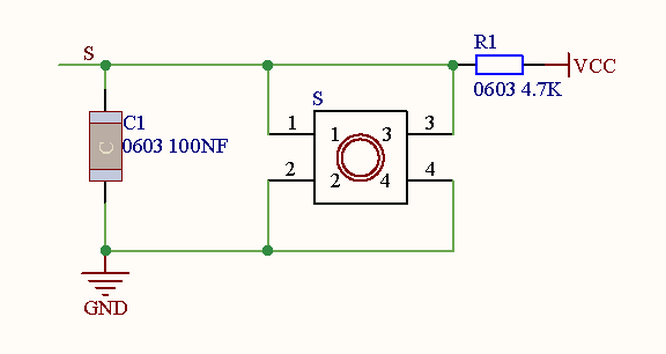

**Parámetros:**

-  Voltaje: 3~5V
-  Corriente: ≤1.1mA
-  Potencia: ≤5.5mW

---

**El principio del módulo de botón es un circuito controlado por este botón.**

-  **Cuando se presiona el botón**, el circuito está en estado cerrado, de modo que la corriente pasa a través del botón a GND, lo que hace que el pin de entrada digital detecte un nivel bajo.
-  **Cuando se suelta el botón**, el circuito se corta y el nivel del pin aumenta debido a una resistencia pull-up, lo que hace que el pin digital detecte un nivel alto.

---

**Diagrama de cableado:**

**Conecte el módulo de botón a io5**

**Atención: Conecte el amarillo a S (Señal), el rojo a V (Alimentación) y el negro a GND. ¡No los invierta!**

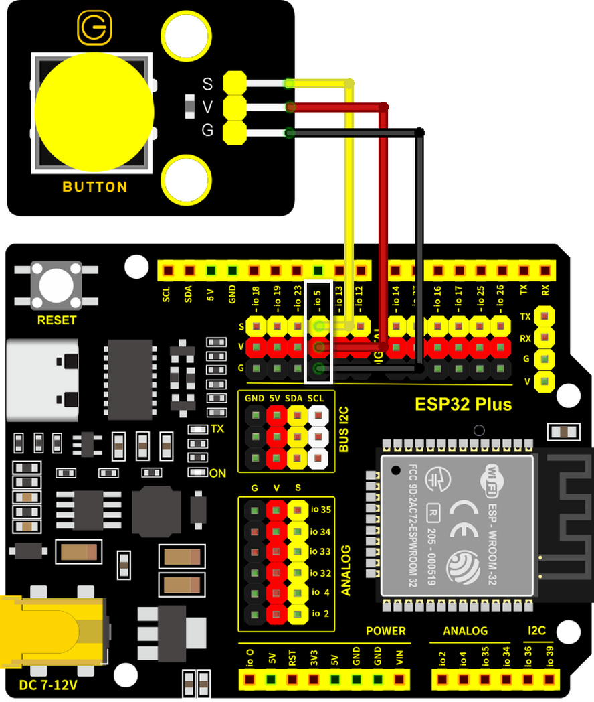

---

**Código de prueba**

-  Inicialice el puerto serie primero y configure la velocidad de transmisión a 115200.

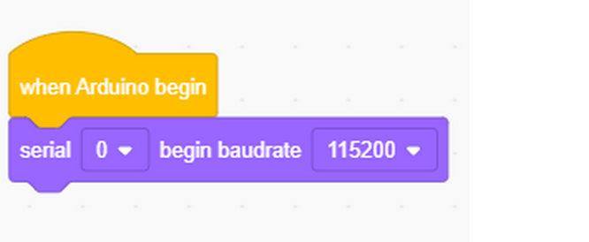

-  Establezca el pin en IO5 y el modo en entrada. Lo que sigue es un bloque "**forever**".

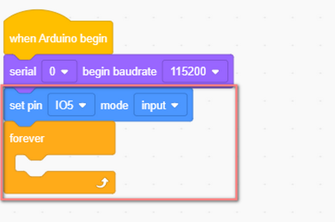

-  Lea el nivel de potencia del pin digital 5. Si es 1, imprima 1. De lo contrario, imprima 0.

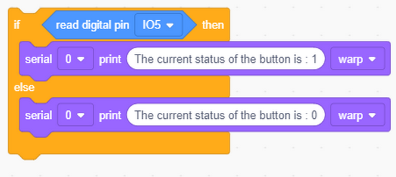

Código completo:

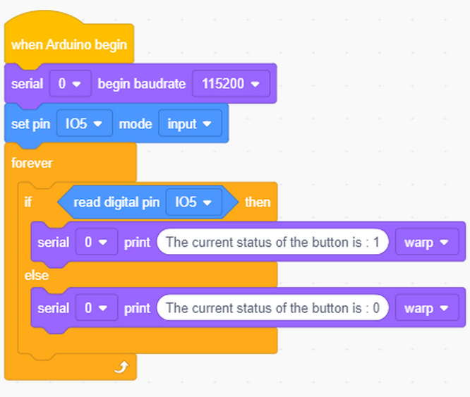

**Resultado de la prueba**

Abra el monitor serie y configure la velocidad de transmisión correspondiente.

Cuando se suelta el botón, el valor es 1; si presiona el botón, se convierte en 0.

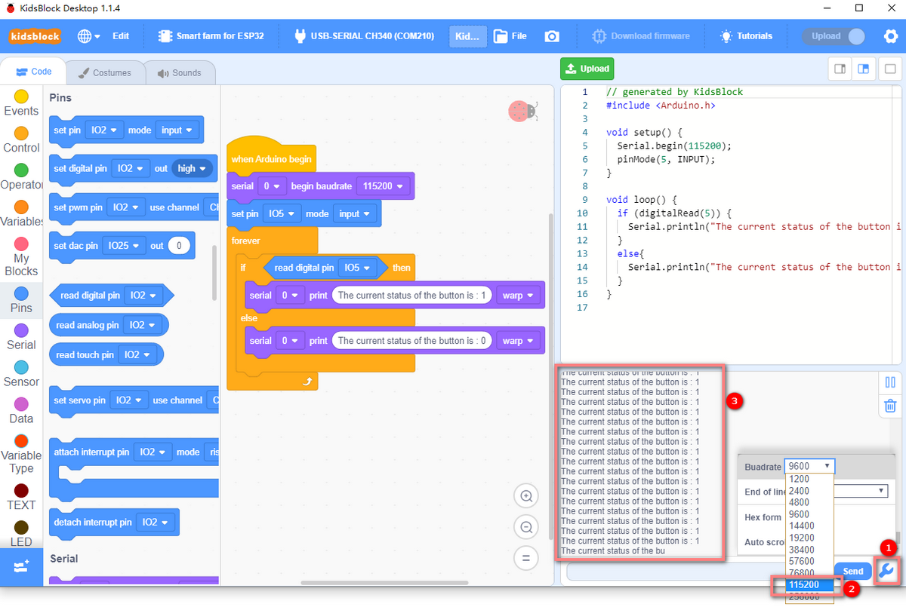

En KidsBlock, podemos leer el estado del pin de entrada digital programando para detectar si el botón está presionado. Así, se pueden realizar muchas aplicaciones interactivas a través de un módulo de botón, como encender/apagar un LED y ajustar el brillo de la pantalla.

---

**Expansión: Botón de autobloqueo**

Un botón de autobloqueo no salta cuando lo presionas sin mantenerlo, y nunca salta a menos que lo presiones de nuevo. Funciona como un interruptor. Para los botones normales, dicha función se puede realizar mediante MCU y software.

**Código de prueba**

-  Defina dos variables: **item** como el valor del botón leído y **button** como el valor desplazado por el botón.

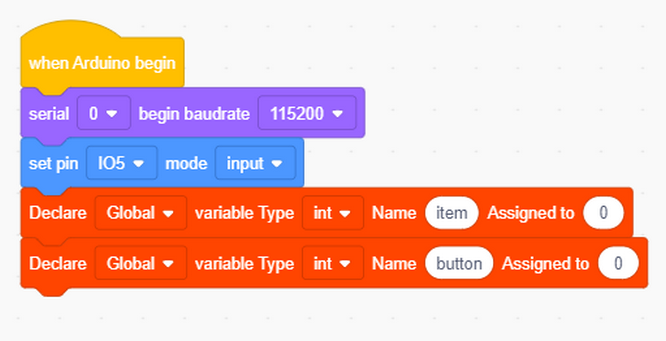

-  Asigne el valor del botón leído a **item**.

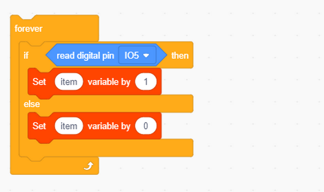

-  Determine si el botón está presionado. Si lo está, desplace el valor de **button** e imprímalo.

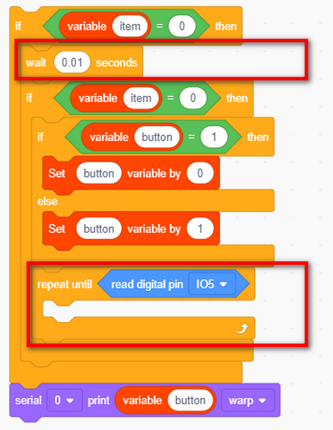

   -  Retraso de 0.01s para eliminar el rebote del botón.

      -  Si se detecta un estado cerrado en el botón, se ejecutará un retraso para eliminar el **Jitter de la puerta delantera**. Generalmente, el retraso está dentro de 5ms～10ms (las propiedades mecánicas lo deciden). Después de que el jitter desaparezca, verifique el estado del botón nuevamente. Si el nivel de estado cerrado aún se mantiene, se confirma que hay un botón presionado.
      -  Cuando se detecta un botón liberado, también debe ocurrir un retraso de 5ms～10ms para eliminar el **Jitter de la puerta trasera**, de modo que el programa para el botón pueda ejecutarse.
      
-  Cuando se presiona el botón (el pin físico lee **0**), la variable `button` cambia a **1** (estado del sistema: ENCENDIDO). Presiónelo de nuevo, `button` cambia a **0** (estado del sistema: APAGADO), alternativamente.

> **Nota:** El pin físico del botón lee **0 cuando se presiona** y **1 cuando se suelta** (debido a la resistencia pull-up interna). La variable `button` es un interruptor de software separado que alterna entre 0 y 1 cada vez que se detecta una pulsación. **No** confunda el valor del pin sin procesar con la variable de estado `button`.

Código completo:

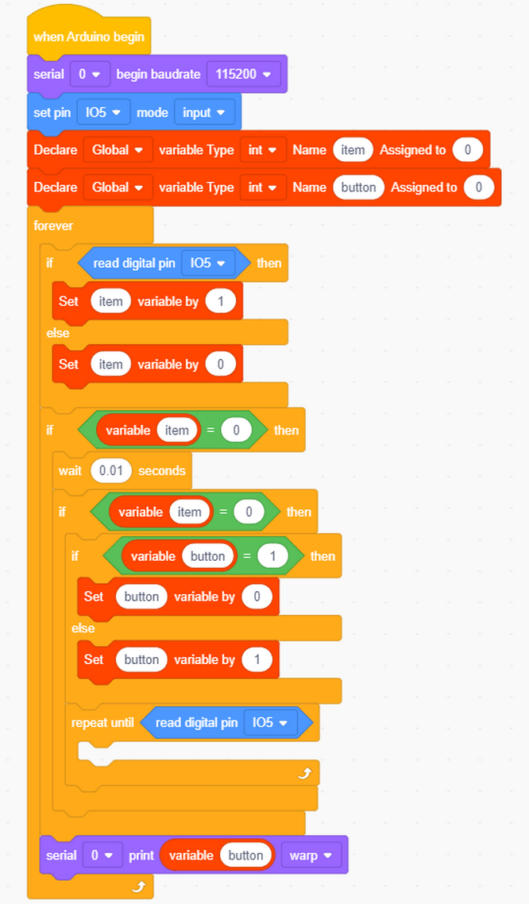

**Resultado de la prueba**

Suba el código y abra el monitor serie.

Cuando presiona el botón una vez, se mostrará 1. Si presiona el botón por segunda vez, el valor se convierte en 0. Ahora, un botón común cuenta con la función de uno de autobloqueo.

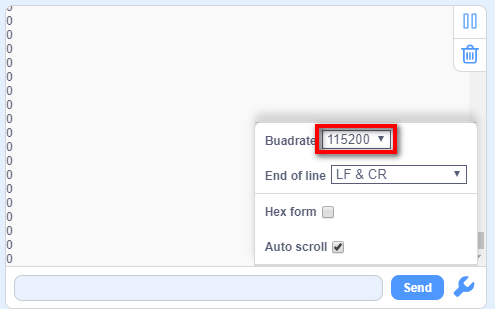

---

#### 4.1.3 Control de iluminación

**Descripción**

En los experimentos básicos anteriores, remodelamos un botón de autobloqueo para controlar el LED. Un botón de autobloqueo es adecuado para cualquier situación en la que sea necesario mantener un cierto estado, por ejemplo, cuando el LED necesita permanecer encendido durante mucho tiempo, se requiere la placa de desarrollo ESP32 para algunas operaciones.

En este experimento, adoptaremos la placa ESP32 PLUS para guiarlo en la implementación de un sistema de iluminación y simular escenas de la vida real para controlar la luz a través del botón.

---

**Diagrama de cableado:**

**Conecte el botón a io5 y el LED a io27**

**Atención: Conecte el amarillo a S (Señal), el rojo a V (Alimentación) y el negro a GND. ¡No los invierta!**

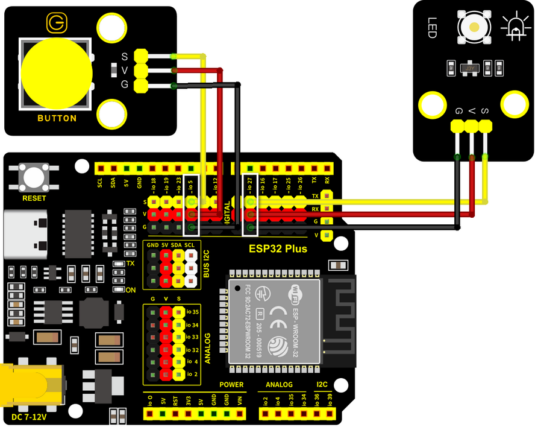

---

**Código de prueba:**

Flujo de código:

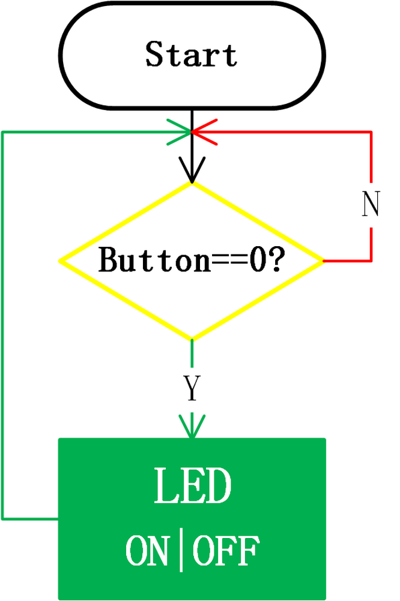

Código completo:

Basándonos en el código del botón de autobloqueo, agregamos bloques de "**salida de pin LED**".

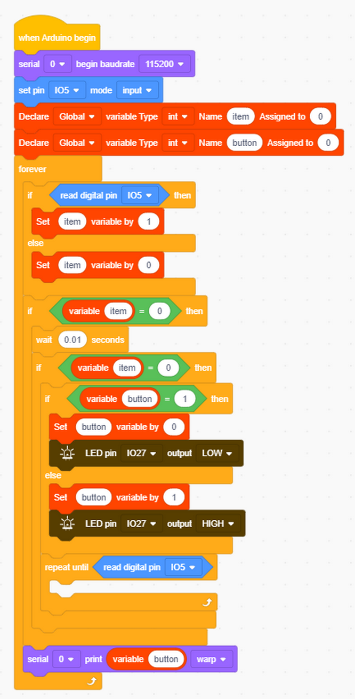

**Resultado de la prueba:**

**Cuando presionas el botón una vez, el LED se enciende; si presionas de nuevo, el LED
se apaga. Esta operación es un bucle, lo cual es consistente con el principio de iluminación en la realidad.**

---

En este capítulo, hemos demostrado cómo programar y controlar a través de KidsBlock, y hemos aprendido los conceptos básicos, así como algunos conceptos de software y hardware en experimentos como el botón de autobloqueo y el sistema de control de iluminación.

Estos son esenciales para un buen desarrollador de KidsBlock. A continuación, te guiaremos para que sigas explorando más aplicaciones y habilidades, ya seas principiante o veterano. Esperamos que disfrutes de la diversión y los desafíos mientras aprendes KidsBlock. ¡Continuemos!

---

#### 4.1.5 Preguntas frecuentes

**P: El LED no se enciende después de cargar el código.**

R: Por favor, verifica si el pin definido en el código es consistente con el de tus conexiones. Si son incompatibles, ajústalo consultando el código.

---

**P: El botón a veces funciona y a veces no.**

R: Por favor, modifica el retardo de eliminación de vibraciones a un valor adecuado.

---