### 4.2 Proyecto: Sistema de Control de Iluminación

En este proyecto, construiremos un sistema de control de iluminación mediante una fotorresistencia y un LED. Es un sistema inteligente para ajustar la luz, lo que ahorra energía y mejora la eficiencia.

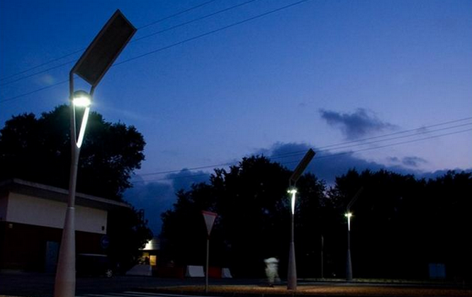

Este sistema es compatible con múltiples condiciones. Gracias a su fotorresistencia, es capaz de detectar la intensidad de la luz de día o de noche, logrando un sistema más inteligente y de ahorro energético.

Cuando la fotorresistencia detecta que el brillo ambiental es inferior al valor establecido, el LED se enciende. Por el contrario, si la intensidad de la luz ambiental es superior al valor establecido, la fotorresistencia enviará una señal diferente para apagar el LED.

---

#### 4.2.1 Diagrama de Flujo

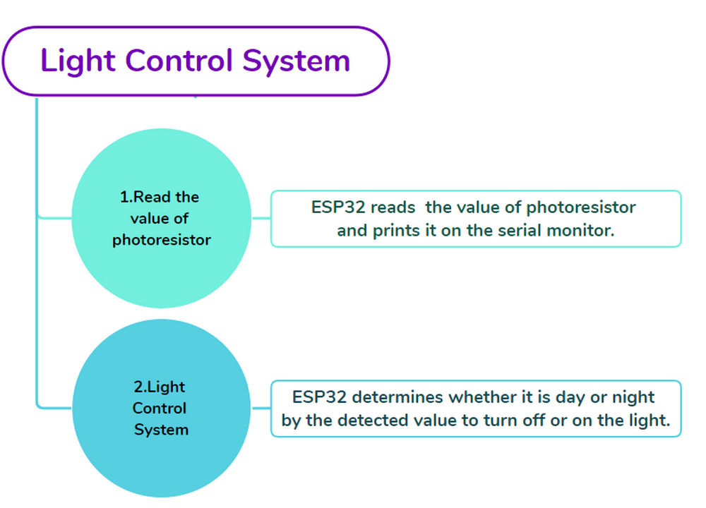

---

#### 4.2.2 Fotorresistencia

**Descripción:**

Una fotorresistencia, también llamada fotosensor, convierte la señal luminosa en señal eléctrica (voltaje, corriente y resistencia).

**Principio de funcionamiento:**

Colocamos una fotorresistencia en un circuito en conexión en serie y aplicamos un voltaje adecuado a ambos polos. Cuando no hay luz, la resistencia es infinita y el circuito casi se abre. Sin embargo, cuando hay luz, la resistencia disminuye mientras la corriente aumenta, y es equivalente a un cortocircuito cuando la intensidad de la luz es suficiente.

Ahora leeremos el valor de la fotorresistencia programando en la placa de desarrollo ESP32.

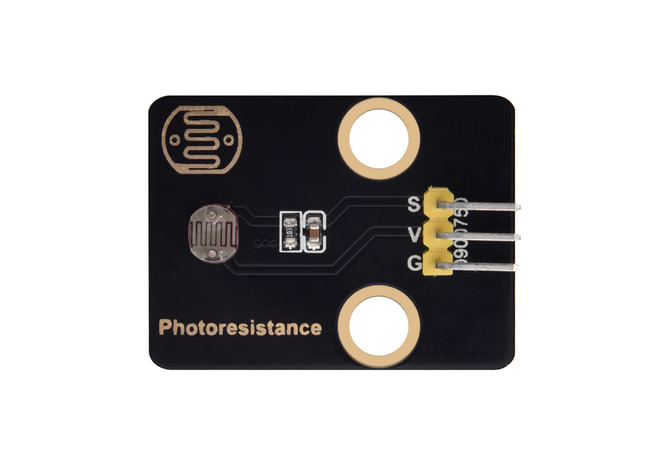

---

**Diagrama esquemático:**

Cuando la luz incide sobre la fotorresistencia, cuanto más fuerte es la luz, menor será la resistencia, por lo que mayor será el voltaje VCC que pasará a través de la resistencia.

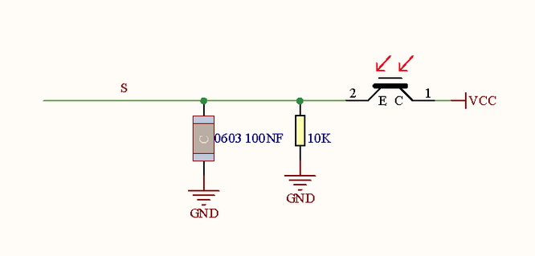

**Parámetros:**

- Voltaje: 3~5V
- Corriente: 0.2mA
- Potencia: 1mW
- Valor pico del espectro: 540nm
- Resistencia brillante (10lux): 5~10KR
- Resistencia oscura: 0.5MR

---

**Diagrama de cableado:**

**Conecte la fotorresistencia a io34.**

**Atención: Conecte el amarillo a S(Signal), el rojo a V(Power) y el negro a GND. ¡No los invierta!**

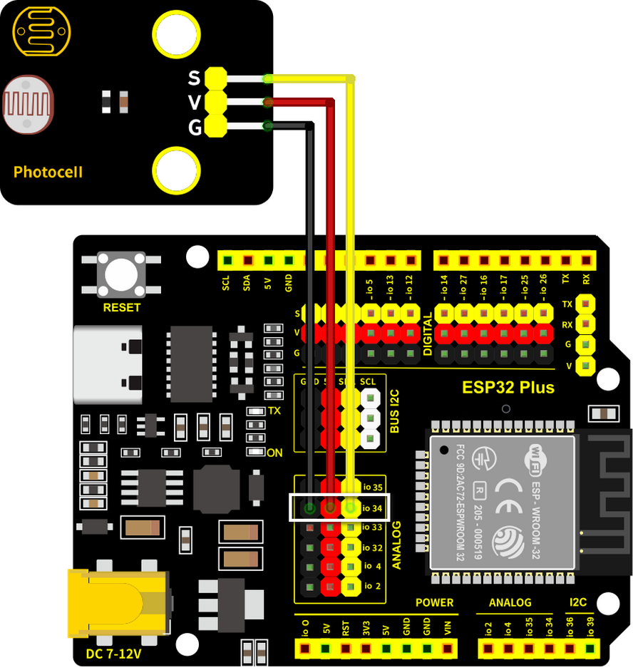

---

**Código de prueba:**

- Inicializar el puerto serie.

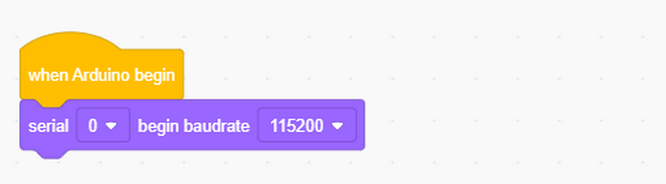

- Definir una variable global "**item**" como el valor de la fotorresistencia.

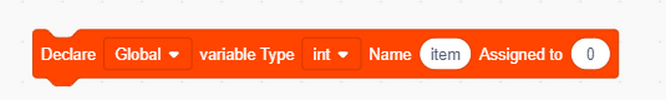

- Establecer "**item**" al valor leído e imprimirlo en el monitor serie.

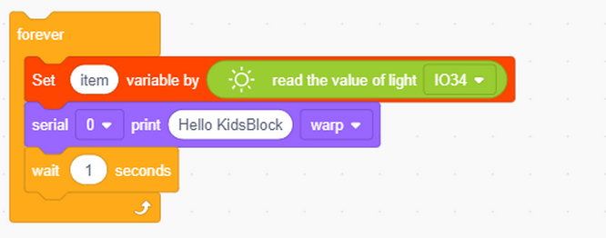

Código completo:

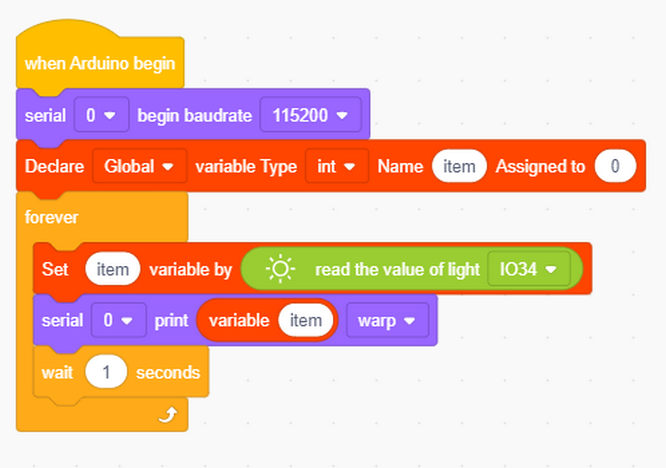

---

**Resultado de la prueba:**

Abra el monitor serie.

Cuanto más brillante sea la luz detectada por la fotorresistencia, mayor será el valor.

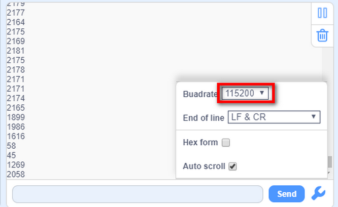

---

#### 4.2.3 Sistema de Control de Iluminación

**Diagrama de cableado:**

**Conecte la fotorresistencia a io34 y el LED a io27.**

**Atención: Conecte el amarillo a S(Signal), el rojo a V(Power) y el negro a GND. ¡No los invierta!**

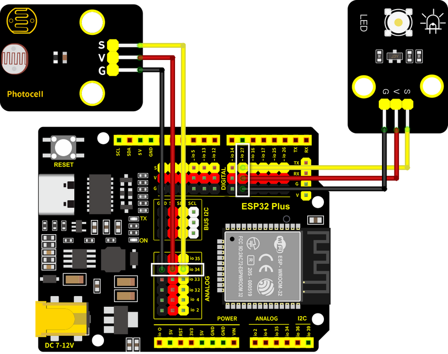

---

**Código de prueba:**

Flujo del código:

- Determinar:
  - El valor de la fotorresistencia >= 800, el LED se apaga.
  - El valor de la fotorresistencia =< 800, el LED se enciende.

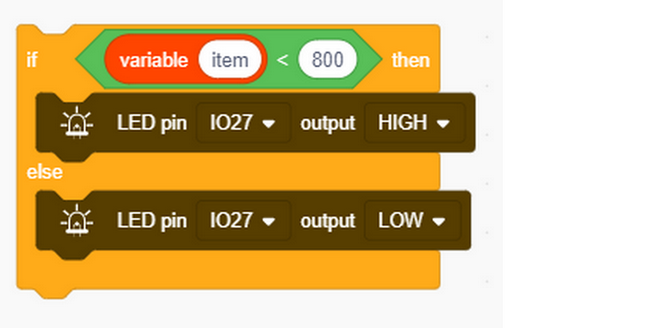

Código completo:

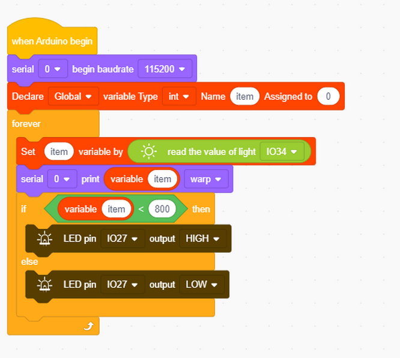

**Resultado de la prueba:**

Cuando el valor de la fotorresistencia es mayor que 800 (durante el día), el LED se apaga. Sin embargo, si el valor es menor que 800, el LED se encenderá automáticamente.

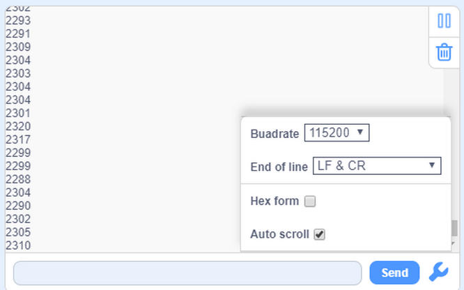

---

**Varias condiciones pueden adoptar este tipo de sistema. Gracias a su fotorresistencia, es capaz de detectar la intensidad de la luz de día o de noche, lo que ahorra energía e intelectualiza todo el sistema.**

---

#### 4.2.2 Preguntas Frecuentes

**P: El valor de la fotorresistencia no puede ser 0.**

R: En la vida real, existe poca luz aunque apagues todas las luces de tu habitación, por lo que el valor de la fotorresistencia solo se acerca a 0 en lugar de ser igual a 0.

---

**P: Después de subir el código, el LED no se enciende aunque la habitación esté oscura sin luces.**

R: Aumente el valor determinado de la fotorresistencia. En nuestro ejemplo, lo configuramos en 800. Por lo tanto, puede ajustarlo a 1000 o un valor mayor.

---