### 4.3 Projet : Système d'alarme

Dans ce projet, nous utilisons un capteur de mouvement PIR et un buzzer pour constituer un système d'alarme, qui peut être contrôlé par la carte de développement ESP32.

Comment ça marche ? Les signaux électriques sont détectés et lus par le capteur de mouvement PIR grâce à la programmation sur l'IDE KidsBlock, puis il détermine si une personne est présente. Si c'est le cas, le buzzer sonne. De cette façon, ce système d'alarme coûte beaucoup moins cher pour les familles et les bureaux.

---

#### 4.3.1 Diagramme de flux

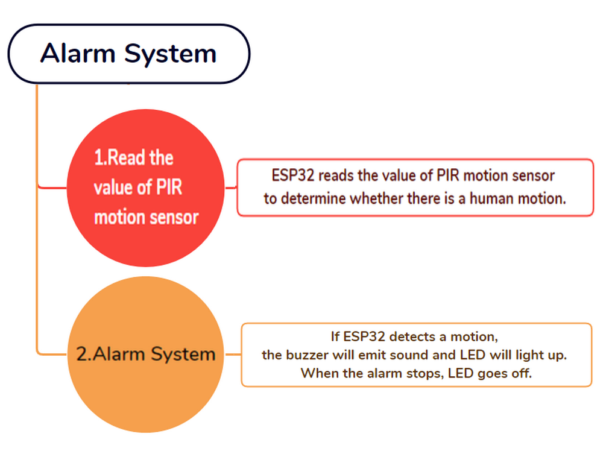

---

#### 4.3.2 Capteur de mouvement PIR

**Description :**

Un capteur de mouvement PIR détecte la présence d'une personne en détectant la chaleur dégagée par le corps humain.

De plus, ce capteur est petit et facile à utiliser.

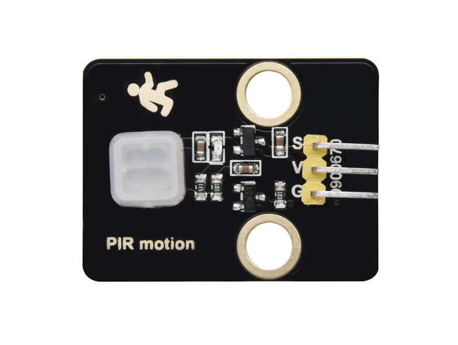

---

**Schéma de principe :**

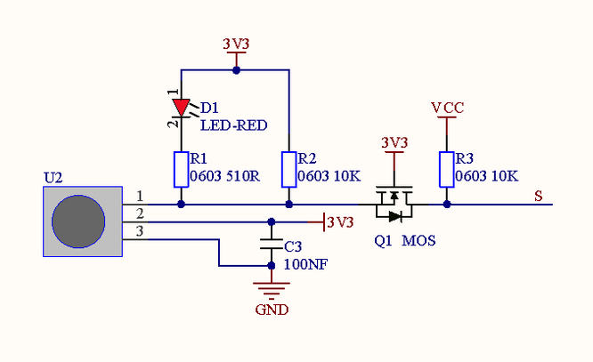

**Paramètres :**

- Tension : 3~5V
- Courant : 3.6mA
- Puissance : 18mW
- Angle de vue : Y = 90°, X = 110° (valeur théorique)
- Distance de détection : ≤5m

---

**Schéma de câblage :**

**Connectez le capteur de mouvement PIR à io23.**

**Attention : Connectez le jaune à S (Signal), le rouge à V (Alimentation) et le noir à GND. Ne les inversez pas !**

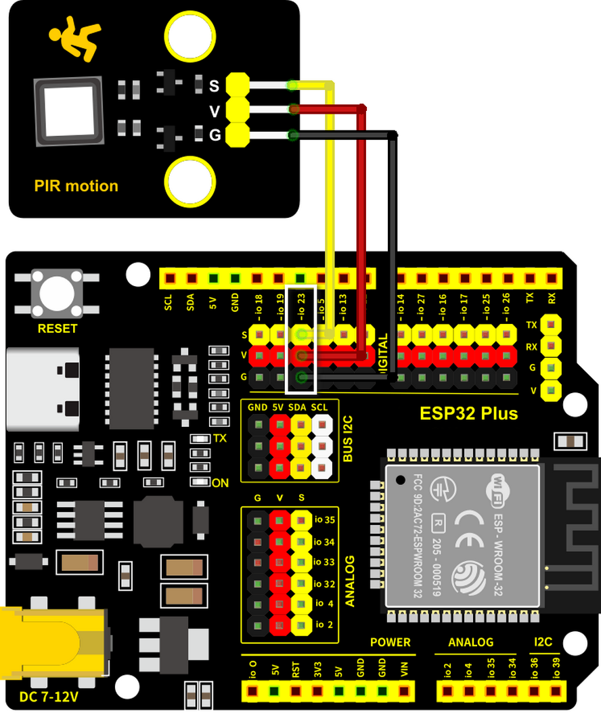

---

**Code de test :**

Lisez la valeur de la broche IO23 pour déterminer s'il y a un mouvement humain.

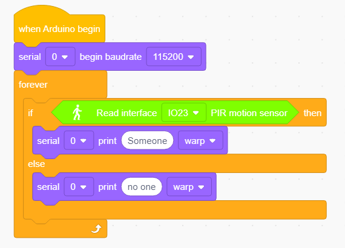

**Résultat du test :**

Ouvrez le moniteur série.

Quand quelqu'un est dans la zone, **Someone** s'affiche sur le moniteur, et la LED rouge du capteur s'éteint. Cependant, s'il n'y a personne, **No one** sera imprimé et la LED restera toujours allumée.

**ATTENTION** : Le capteur de mouvement PIR n'est pas capable de pénétrer les objets, veuillez donc ne pas couvrir le capteur lors de la détection de mouvements.

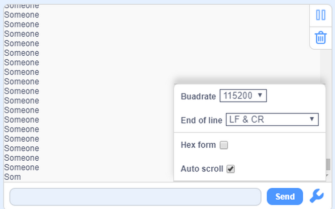

---

#### 4.3.3 Buzzer

**Description :**

Un buzzer est un avertisseur sonore électronique, qui émet des sons de différentes fréquences et durées et est alimenté par une tension continue. Ainsi, il peut être utilisé comme rappel ou alarme dans de nombreux appareils électroniques, tels que les ordinateurs, les imprimantes, les photocopieurs, les alarmes, les jouets électroniques, l'électronique automobile, les téléphones et les minuteries.

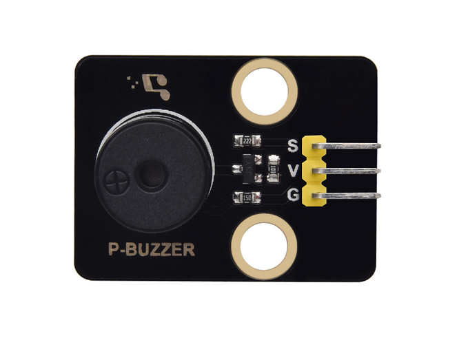

---

Un buzzer est composé d'un **dispositif de vibration** et d'un **dispositif de résonance**. Il existe deux catégories : les buzzers passifs et les buzzers actifs.

- Un **Buzzer Passif** ne peut pas `vibrer` pour émettre un son par lui-même, à moins de lui appliquer un signal `carré` d'une certaine fréquence. De plus, le son émis varie en fonction de la fréquence du signal carré, de sorte qu'un buzzer passif peut simuler des mélodies.

- Une onde carrée analogique peut être générée en modifiant le niveau de puissance aux broches. Par exemple, après que le niveau haut dure 500ms, il passe à un niveau bas pendant 500ms supplémentaires, puis à un niveau haut à nouveau...
- **Nous pilotons le buzzer via une onde carrée entre 200 et 5000Hz, et nous pouvons calculer la fréquence (f) : *f=1/T* ; T est la période (le temps total du niveau haut et bas).**

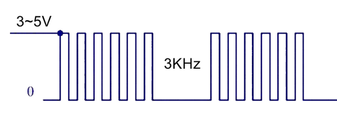

- Un **Buzzer Actif** est capable d'émettre un son automatiquement sans stimulateur externe, car il comprend un circuit de pilotage qui ne nécessite qu'une `alimentation en courant continu`. Cependant, son son est plat avec une fréquence relativement fixe.

---

**Dans cette expérience, un buzzer passif est utilisé pour "jouer de la musique".**

---

**Schéma de principe :**

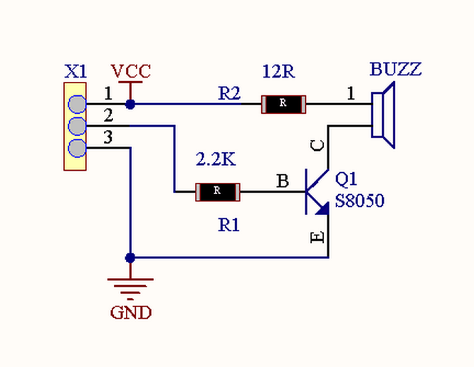

**Paramètres :**

- Tension : 3~5V
- Courant : ≤5mA
- Puissance : ≤25mW

---

**Schéma de câblage :**

**Connectez le buzzer à io16.**

**Attention : Connectez le jaune à S (Signal), le rouge à V (Alimentation) et le noir à GND. Ne les inversez pas !**

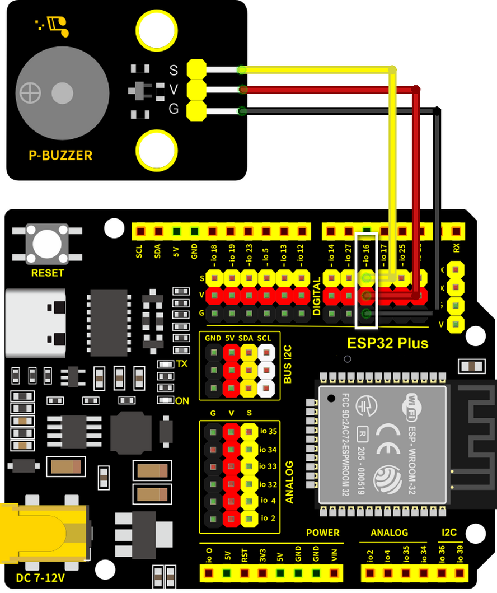

---

**Code de test :**

**Méthode 1 : Onde carrée analogique**

Un buzzer passif est piloté par des ondes carrées, nous allons donc simuler l'onde.

Une onde carrée analogique peut être générée en changeant le niveau de puissance de la broche : niveau haut pendant 500us et niveau bas pendant 500us. Ainsi, le buzzer émettra un son. De plus, les durées peuvent ajuster le volume sonore.

Essayez 1000us, 1500us, 3000us… Quelle est la différence ?

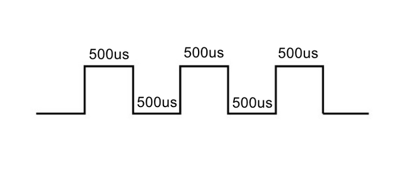

Code :

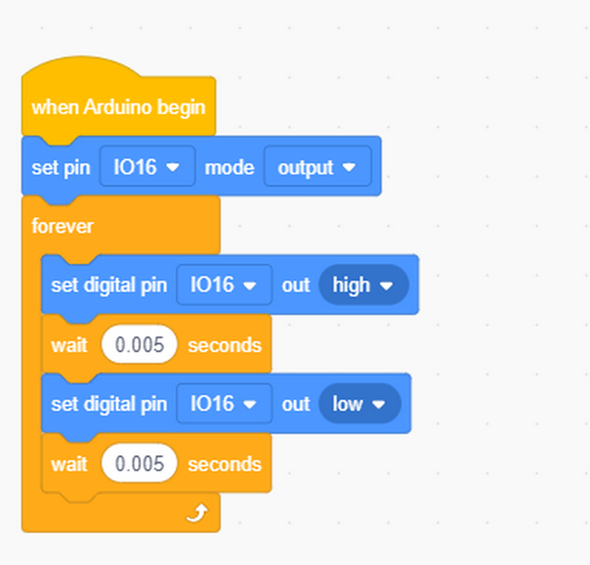

- Dans la fonction delay, l'unité de temps est la microseconde (us). Le bloc suivant représente donc un délai de 500ms.

Selon la formule :

Ainsi, 500us est la durée, et nous pouvons calculer la fréquence = 2kHz, c'est-à-dire que les niveaux haut et bas alternent 2000 fois par seconde.

---

**Méthode 2 : Blocs haut-parleur**

Nous utilisons les blocs de code Haut-parleur  pour faire vibrer le buzzer.

**Les blocs Haut-parleur génèrent un signal PWM avec une certaine fréquence pour faire vibrer le buzzer,** et la durée et la tonalité sont contrôlées par les paramètres associés.

Il existe deux façons de définir la durée. L'une consiste à ajuster les paramètres de la fonction tone() pour définir une durée, et l'autre consiste à utiliser une fonction noTone() pour arrêter directement le son. Si vous ne définissez pas de durée dans tone(), le signal sonore sera toujours généré à moins qu'un noTone() ne l'arrête.

Pour la carte ESP32, un seul son peut être produit à la fois. Si une broche de l'ESP32 génère un signal sonore via tone(), il n'est pas possible d'émettre un son par cette fonction sur une autre broche.

**Tableau des tonalités**

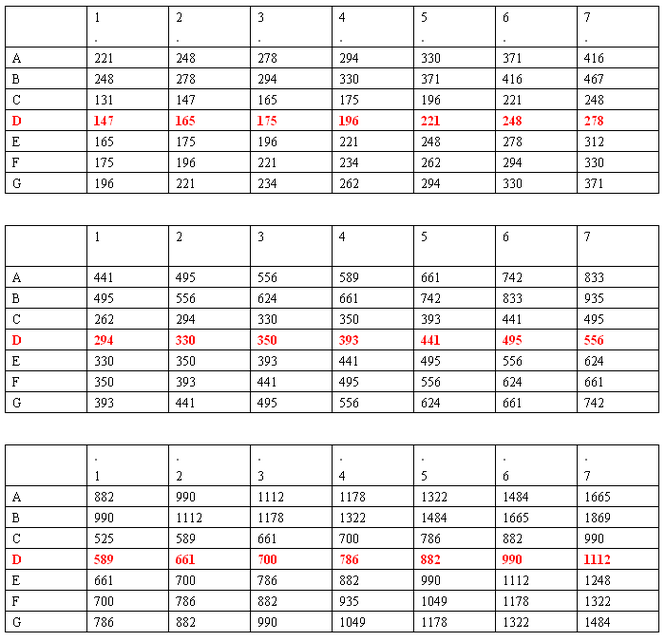

Code :

- Faites glisser un bloc "**Tone**" de  comme indiqué ci-dessous, et réglez la broche sur IO16.

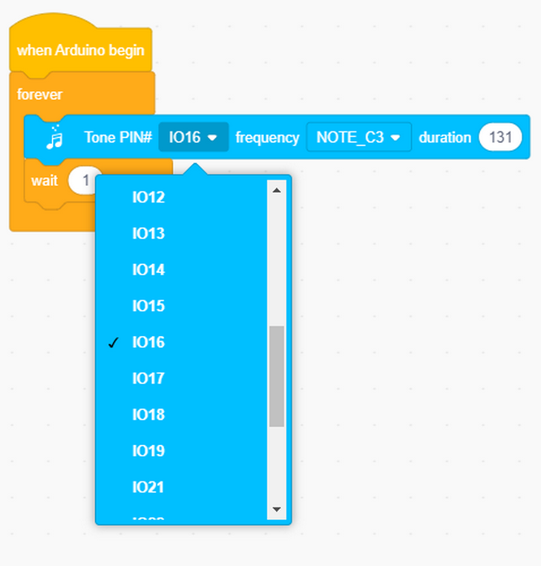

- Vous pouvez sélectionner une fréquence à volonté.

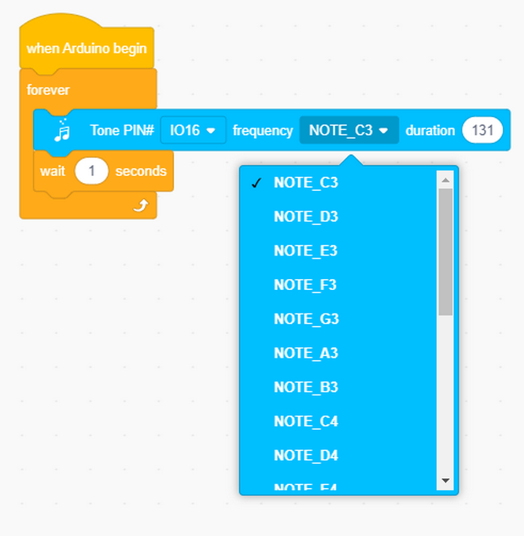

- No Tone : Il est utilisé pour désactiver toutes les tonalités.

Code complet :

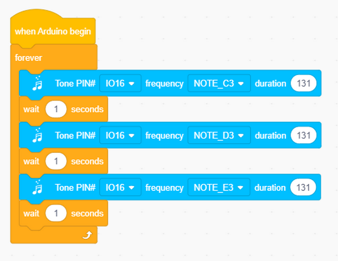

**Résultat du test :**

Méthode 1 : Le buzzer émet un son en continu.

Méthode 2 : Le buzzer alarme via la fonction tone().

---

**Extension : Jouer de la musique**

Jouer de la musique via tone().

Code complet :

---

#### 4.3.4 Système d'alarme

Dans cette expérience, nous allons construire un système d'alarme avec un capteur de mouvement PIR, un buzzer et une LED. Lorsque le capteur détecte un mouvement, le buzzer émet un son et la LED clignote pour signaler une intrusion.

---

**Schéma de câblage :**

**Connectez le capteur de mouvement PIR à io23, le buzzer à io16 et la LED à io27.**

**Attention : Connectez le jaune à S (Signal), le rouge à V (Alimentation) et le noir à GND. Ne les inversez pas !**

---

**Code de test :**

Flux de code :

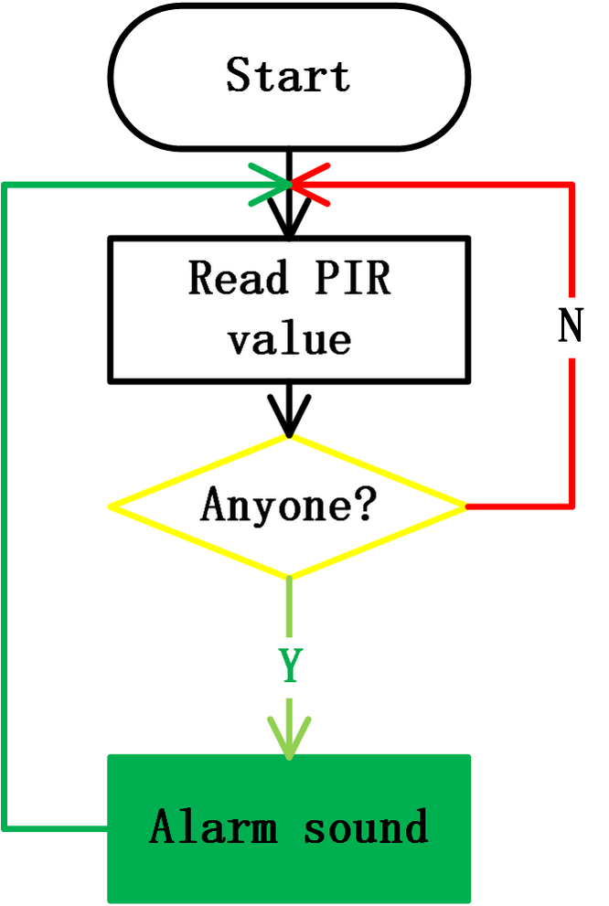

Code complet :

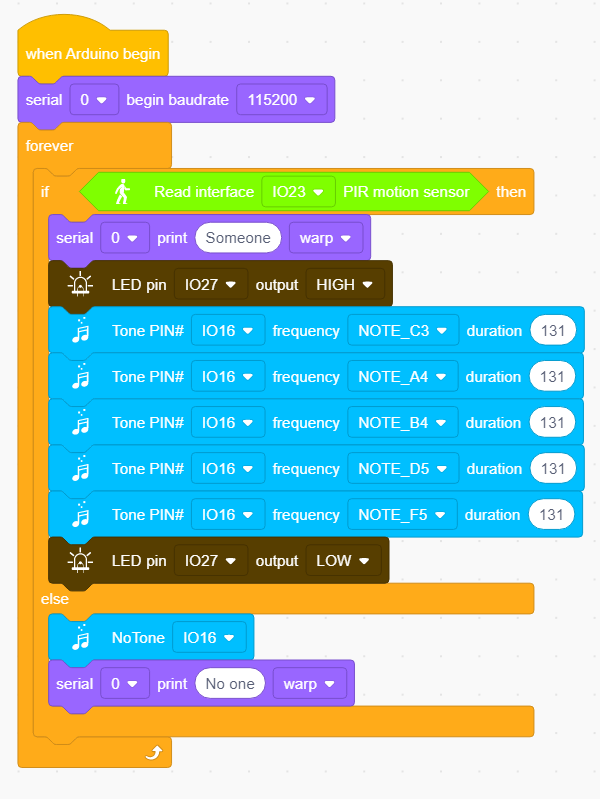

**Résultat du test :**

Téléchargez le code et le système d'alarme commence à fonctionner. Lorsqu'il détecte un mouvement, le buzzer sonne et la LED clignote.

---

#### 4.3.5 FAQ

**Q : Les tonalités du buzzer ne sont pas précises par rapport aux tonalités réelles.**

R : Ce buzzer ordinaire ne fait que simuler des tonalités, il n'est donc pas en mesure de répondre aux exigences professionnelles. Si vous souhaitez des tonalités standard, un haut-parleur plus spécialisé est nécessaire.

---

**Q : Le capteur de mouvement PIR donne des résultats erronés.**

R : Ce capteur de mouvement PIR n'est pas non plus un capteur professionnel.

Veuillez garantir les situations suivantes pour éviter une information erronée :

- Évitez que des objets soufflés par le vent ne flottent dans la zone de détection, tels que des rideaux, des vêtements et des fleurs.
- Évitez la lumière forte dans la zone de détection, comme la lumière du soleil, les phares de voiture, les projecteurs et d'autres sources lumineuses.
- Et ainsi de suite...

---