### 4.4 Projekt: Regendetektionssystem

**HINWEIS: Das Besprühen von Sensoren (außer Dampfsensoren) mit Wasser kann einen Kurzschluss verursachen oder die Module außer Betrieb setzen. Wenn Batterien nass werden, kann es sogar zu einer Explosion kommen. Seien Sie besonders vorsichtig! Jüngere Benutzer sollten das Gerät mit ihren Eltern bedienen. Um die Sicherheit zu gewährleisten, befolgen Sie bitte die Anweisungen und Sicherheitsvorschriften.**

---

In diesem Projekt erstellen wir ein Regendetektionssystem mit einem Dampfsensor. Wenn Regen erkannt wird, löst ESP32 verschiedene Aktionen aus, wie das Senden von Nachrichten, das Aktivieren von Sprinklern und das Einschalten von Lichtern. Durch dieses System kann die Niederschlagsmenge überwacht und auch Wasserlecks auf Dächern oder in Gebäuden erkannt werden.

Außerdem ist es einfach, den Dampfsensor mit dem ESP32-Board zu verbinden, was ein einfaches, aber effektives Regendetektionssystem bildet.

---

#### 4.4.1 Flussdiagramm

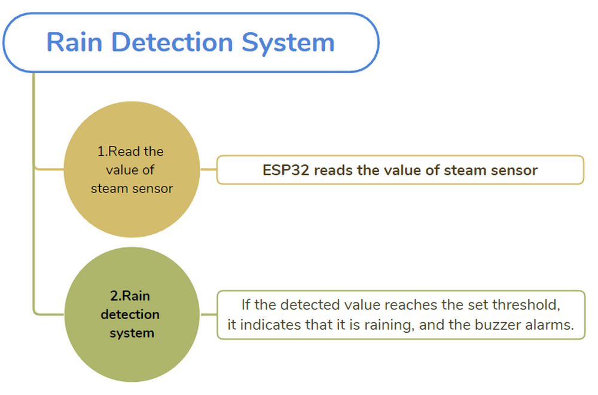

---

#### 4.4.2 Dampfsensor

**Beschreibung:**

Der Dampfsensor erkennt das Vorhandensein von Wasser, daher wird er üblicherweise zur Regendetektion eingesetzt. Wenn Regen auf die leitfähige Fläche des Sensors trifft, sendet er ein Signal an das KidsBlock-Board.

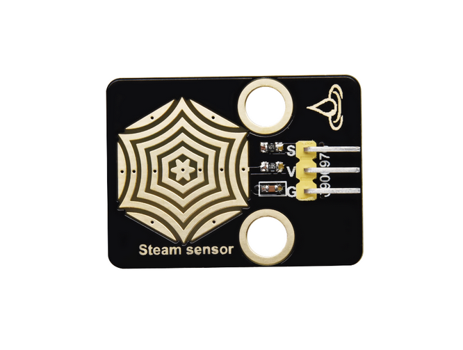

---

**Schaltplan:**

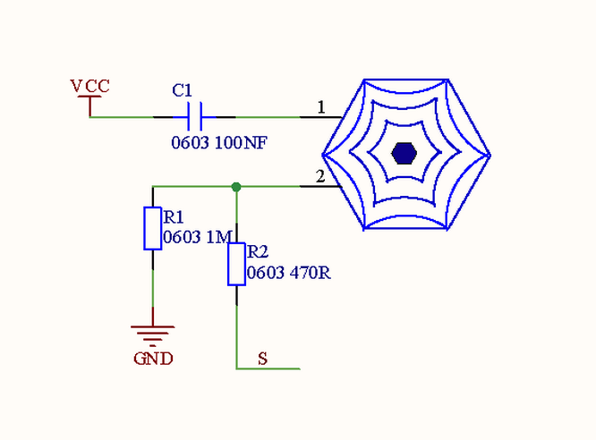

**Parameter:**

-  Spannung: 3~5V
-  Strom: 1.5mA
-  Leistung: 7.5mW

---

**Schaltplan:**

**Verbinden Sie den Dampfsensor mit io35.**

**Achtung: Gelb an S(Signal), Rot an V(Power) und Schwarz an GND anschließen. Nicht vertauschen!**

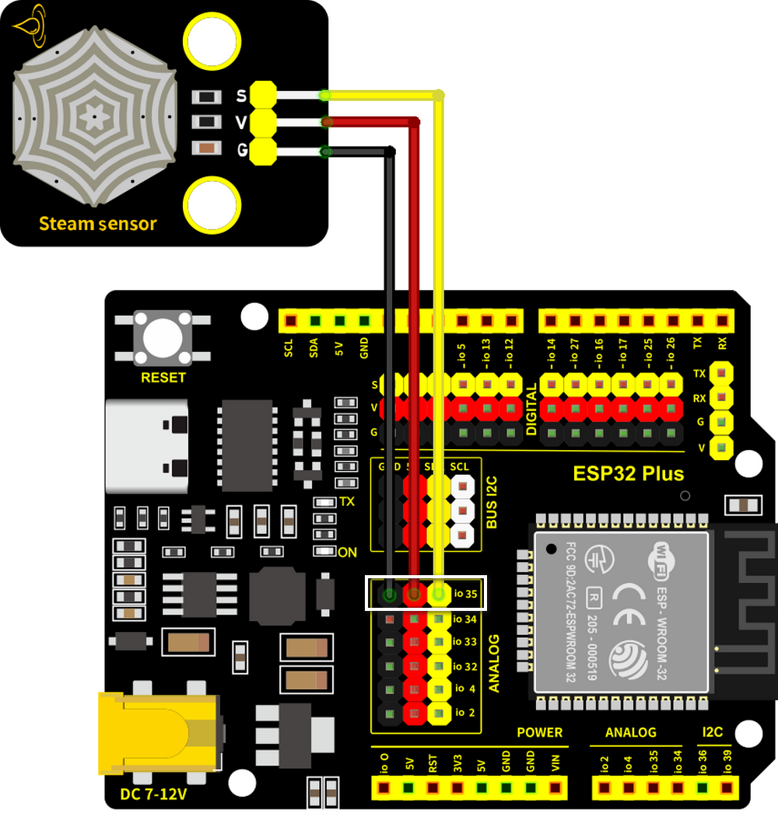

---

**Testcode:**

-  Initialisieren Sie den seriellen Port.

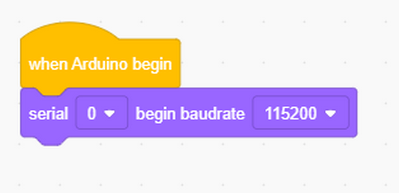

-  Lesen Sie den Sensorwert an Pin io35 und geben Sie ihn jede Sekunde aus.

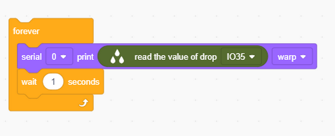

Vollständiger Code:

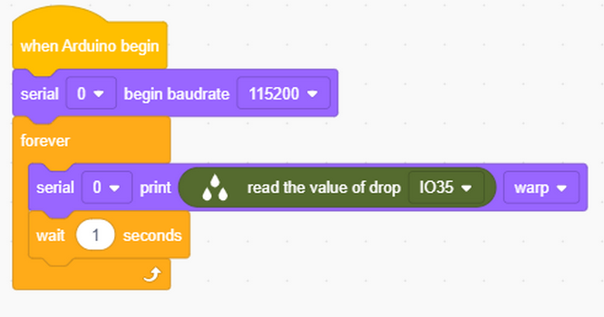

**Testergebnis:**

Berühren Sie den Erfassungsbereich mit einem nassen Finger. Je größer der berührte Bereich ist, desto größer ist der Wert. Sie können den seriellen Monitor öffnen, um den aktuell erkannten Wert (Bereich: 0~4095) zu beobachten.

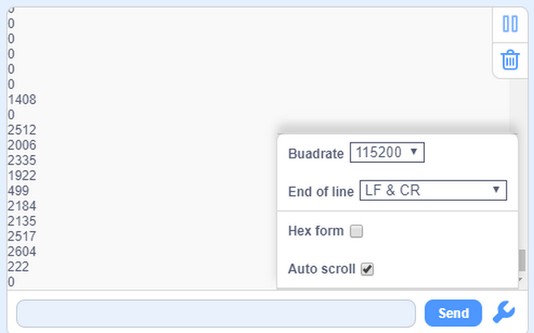

---

#### 4.4.3 Regendetektionssystem

**Beschreibung:**

Wenn der Dampfsensor Regen erkennt, sendet er ein Signal an das Board, um verschiedene Aktionen auszulösen, zum Beispiel alarmiert der Summer, um an den Regen zu erinnern. Dies ist besonders nützlich für die Gartenarbeit und Landwirtschaft im Freien, da es den Benutzern ermöglicht, die notwendigen Vorsichtsmaßnahmen zu treffen, um eine Überwässerung zu vermeiden.

Zusätzlich kann dieses System zur Erkennung von Wasserlecks verwendet werden, um Schäden durch Wassereintritt zu verhindern. Insgesamt ist der Dampfsensor vielseitig und effektiv in verschiedenen Anwendungen einsetzbar.

---

**Schaltplan:**

**Schließen Sie den Dampfsensor an io35 und den Summer an io16 an.**

**Achtung: Verbinden Sie Gelb mit S (Signal), Rot mit V (Power) und Schwarz mit
GND. Nicht vertauschen!**

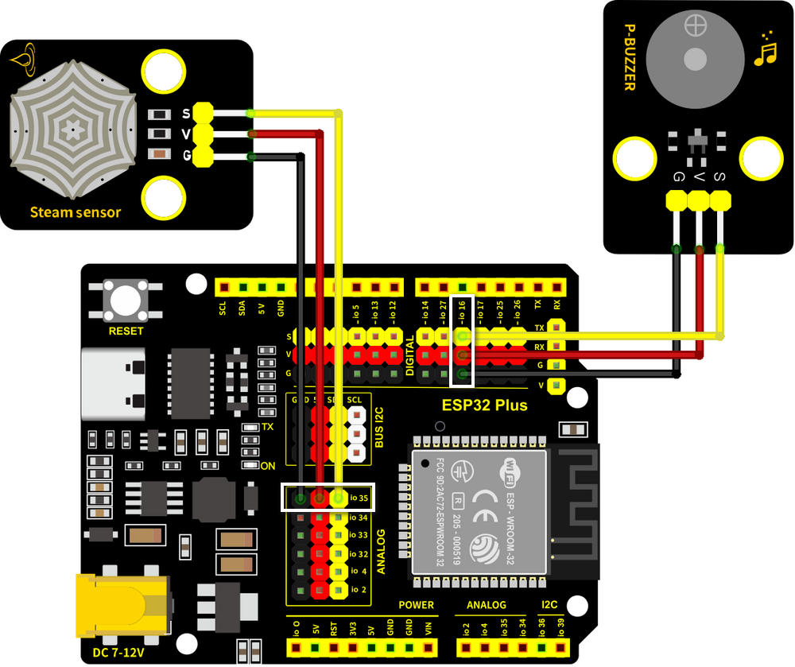

---

**Testcode:**

Codefluss:

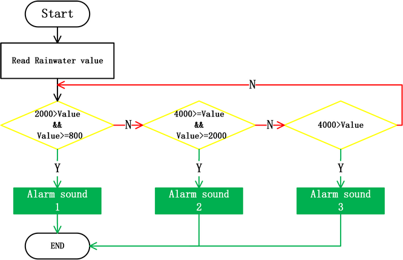

Code:

-  Initialisieren Sie den seriellen Port und definieren Sie eine Variable **item** als den empfangenen Sensorwert.

-  Empfangen Sie den Sensorwert und geben Sie ihn auf dem seriellen Monitor aus.

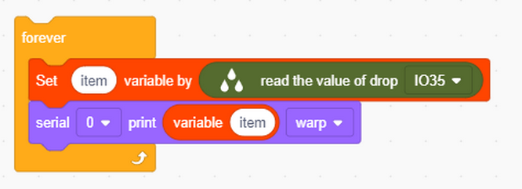

-  Der vom Sensor erkannte empfangene Wert liegt zwischen 800 und 1999:

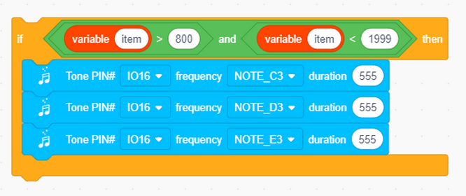

-  Der vom Sensor erkannte empfangene Wert liegt zwischen 2000 und 2999:

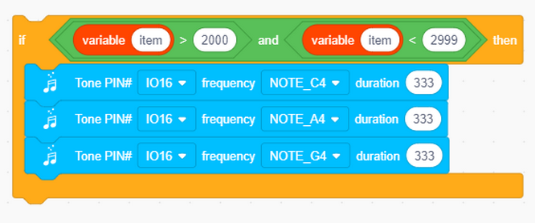

-  Der vom Sensor erkannte empfangene Wert ist größer als 3000:

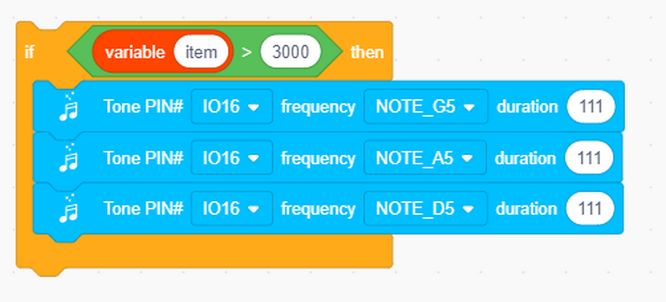

-  Am Ende der Codeblöcke fügen Sie ein „**No Tone**“ hinzu, um den Summer auszuschalten.

Vollständiger Code:

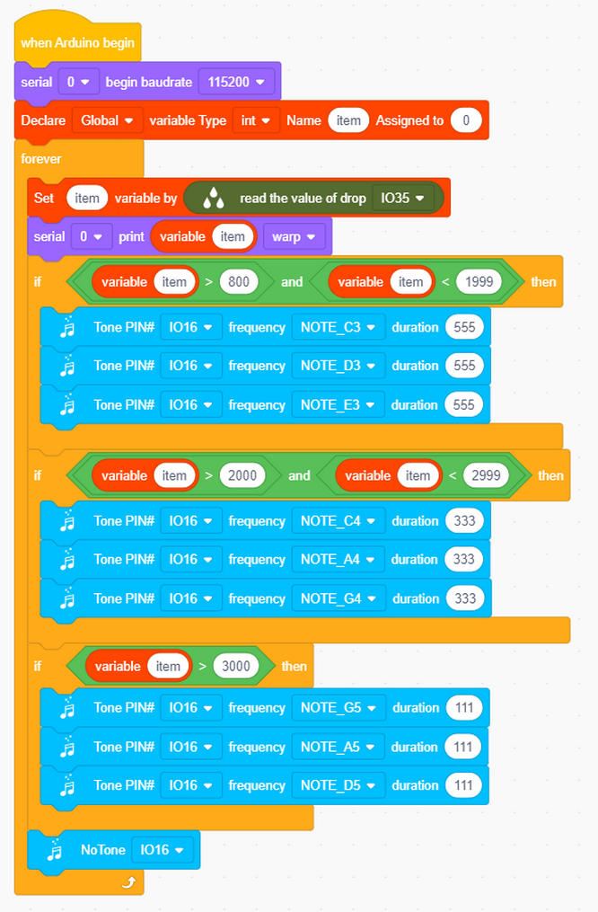

**Testergebnis:**

Je größer der erkannte Wert ist, desto lauter ist der vom Summer erzeugte Ton.

---

#### 4.4.4 FAQ

F: Ist der Dampfsensor wasserdicht?

A: Der Erfassungsbereich kann Wasser ausgesetzt werden, aber die Kabelverbindungen sind nicht wasserdicht. Achten Sie während des Experiments darauf, dass die Wassermenge nicht zu groß ist, um Kurzschlüsse zu vermeiden.

---

F: Obwohl seit der Wassererkennung durch den Sensor eine lange Zeit vergangen ist, summt der Summer immer noch.

A: Er summt weiter, weil sich noch Wasserflecken im Erfassungsbereich befinden. Bitte reinigen Sie ihn einfach.

---