### 4.6 Projet : Système d'alimentation intelligent

Dans ce projet, le module ultrasonique détecte si des animaux se trouvent dans la zone d'alimentation, et le Servo ouvre automatiquement la boîte d'alimentation pour les volailles. De plus, l'intégration de l'IOT permet une surveillance à distance de ces systèmes d'alimentation, ce qui offre beaucoup de commodité.

Globalement, l'automatisation et le fonctionnement à distance optimisent le processus d'alimentation pour ce système.

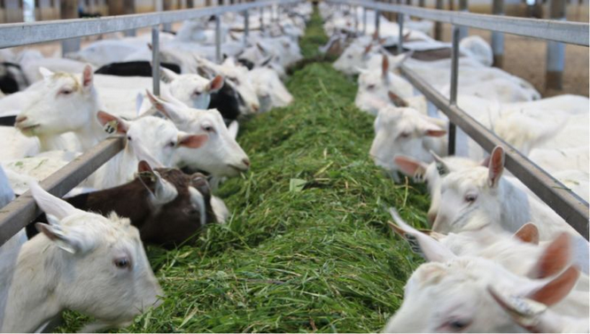

---

#### 4.6.1 Diagramme de flux

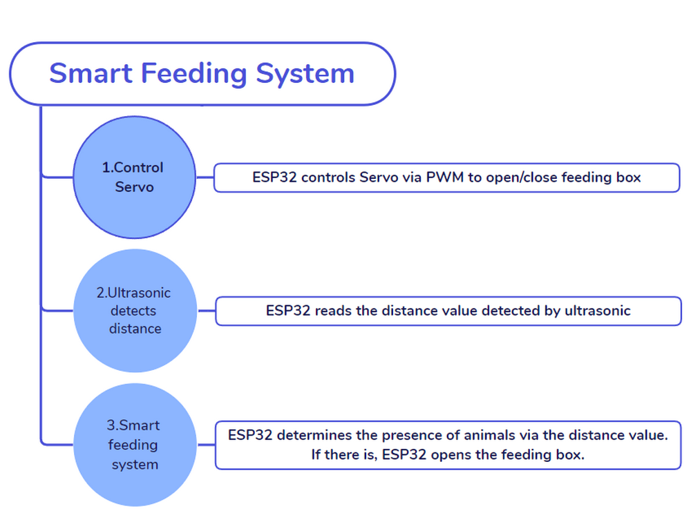

---

#### 4.6.2 Servo

**Description :**

Le **Servo**, également appelé **dispositif Servo RC**, est un moteur avec rétroaction. Généralement, le Servo effectue un contrôle précis de la position et fournit un couple élevé, ce qui apparaît le plus souvent dans les projets de robotique, les voitures RC, les avions et les aéronefs.

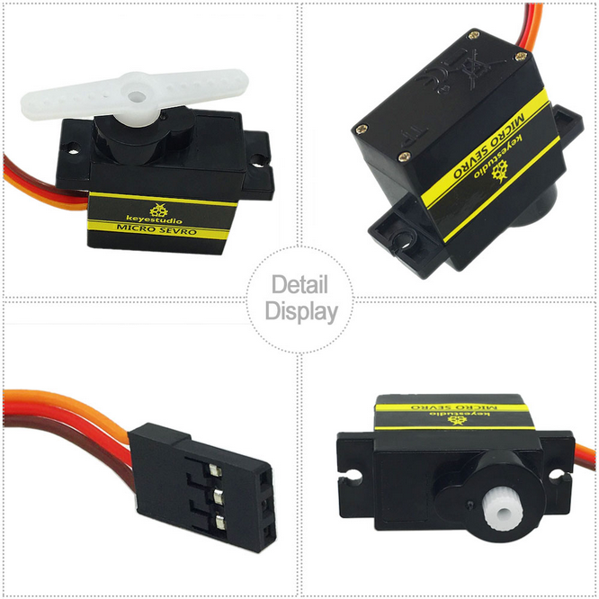

---

**Structure interne :**

-  ① Signal (S) : Il reçoit le signal de commande du microcontrôleur.
-  ② Potentiomètre : la partie rétroaction du Servo. Il mesure la position de l'arbre de sortie.
-  ③ Carte embarquée (contrôleur interne) : le cœur du Servo. Il traite le signal de commande externe et le signal de rétroaction de position
   et pilote le Servo.
-  ④ Moteur DC : la partie exécution. Il fournit la vitesse, le couple et la position.
-  ⑤ Système d'engrenages : Il met à l'échelle les sorties du moteur vers l'angle de sortie final selon un certain rapport de transmission.

---

**Piloter le Servo :**

Le signal (S) reçoit un PWM pour contrôler la sortie du Servo, et **la position de l'arbre de sortie dépend directement du rapport cyclique du PWM**.

Par exemple :

-  Si nous envoyons un signal avec une largeur d'impulsion de 1,5 ms au Servo, son arbre (corne) tournera à la position médiane (90°) ;
-  Si la largeur d'impulsion = `0,5 ms`, l'arbre tourne à son minimum (0°) ;
-  Si la largeur d'impulsion = `2,5 ms`, l'arbre tourne à son maximum (180°).

**NOTE : L'angle maximal varie selon les types de Servos. Certains sont de 170° tandis que d'autres ne sont que de 90°. Malgré cela, les Servos se déplaceront généralement de moitié (du maximum) s'ils reçoivent un signal avec une largeur d'impulsion de 1,5 ms.**

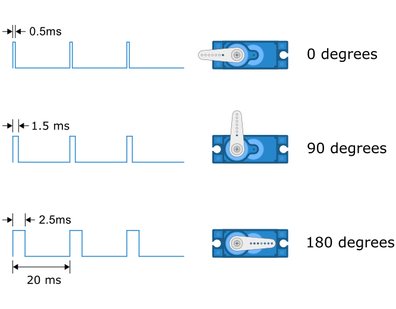

La période d'un Servo dure généralement 20 ms et il produit des impulsions à une fréquence de `50 Hz`. La plupart des servos fonctionnent normalement à 40 ~ 200 Hz.

---

**Schéma de câblage :**

**Connectez le Servo à io26.**

**Attention : Connectez le jaune à S (Signal), le rouge à V (Alimentation) et le noir à GND. Ne les inversez pas !**

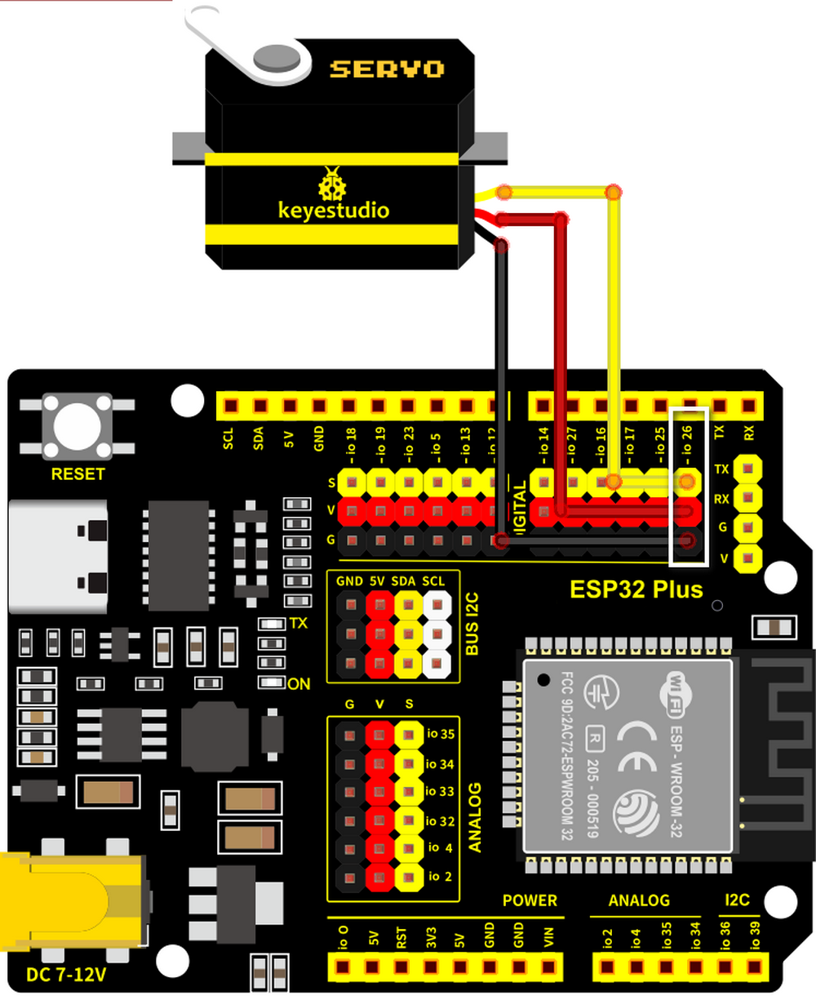

---

**Code de test :**

-  Initialisez le port série et définissez une variable **item** avec une valeur de 80.

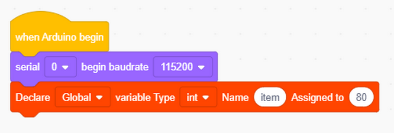

-  Réglez **item** sur l'angle du Servo de 80° à 180°, en tournant de 1° toutes les 15 ms.

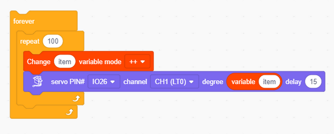

-  Le Servo tourne de 1° toutes les 15 ms, de 180° à 80°.

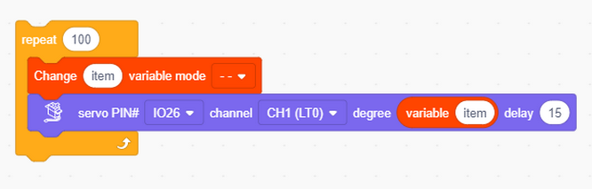

Code complet :

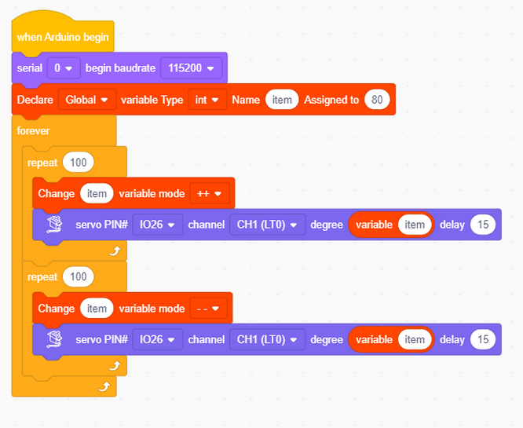

**Résultat du test :**

La boîte d'alimentation est lentement ouverte puis fermée, ce qui est contrôlable.

**NOTE : Le servo SG90 peut tourner de 180°. Comme la boîte d'alimentation est petite, une rotation de 100°
est suffisante pour fermer complètement la boîte.**

-  80° : entièrement ouvert
-  120° : à moitié ouvert
-  180° : fermé

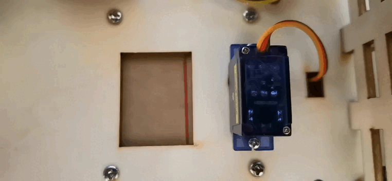

---

**ATTENTION**

**Ne mettez pas vos doigts dans la boîte pour éviter de vous pincer !**

**Ne bloquez pas la porte avec quelque chose pour éviter d'endommager le servo !**

---

#### 4.6.3 Capteur à ultrasons

**Description :**

**Schéma synoptique :**

---

La fréquence des ondes sonores que l'homme peut entendre est de 20 Hz ~ 20 KHz, tandis que les ondes ultrasonores dépassent cette plage.

**Ultrasons :**

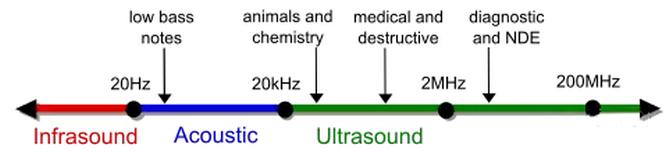

Le module ultrasonique convertit l'électricité et les ondes ultrasonores l'une en l'autre par effet piézoélectrique, et il transmet et reçoit également les ondes ultrasonores.

Ce type d'onde présente une directivité, une forte pénétration et une concentration facile de l'énergie sonore.

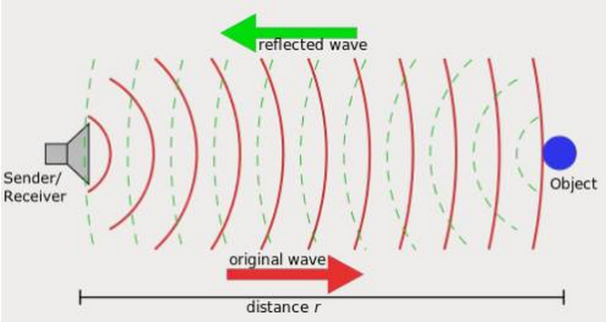

Dans ce système de télémétrie ultrasonique, nous programmons d'abord sur le MCU (carte de développement ESP32) pour générer une onde carrée originale à 40 KHz et piloter le module ultrasonique pour l'émettre. Immédiatement, le module calcule la distance à l'objet après avoir reçu l'onde réfléchie (Echo) amplifiée et mise en forme par le circuit. Ici, il enregistre la durée d'émission et de réflexion et calcule la distance en fonction de la différence de temps.

Simplement, le MCU contrôle le module pour émettre une onde ultrasonore qui est renvoyée après avoir rencontré des obstacles et est reçue par le module. La différence de temps entre eux est un facteur important dans le calcul de la distance (la vitesse de propagation du son dans l'air est de 340 m/s).

---

**Schéma de câblage :**

**Connectez l'Echo du module ultrasonique à io13 et Trig à io12.**

**Attention : Connectez le jaune à S (Signal) et le rouge à V (Alimentation). Ne les inversez pas !**

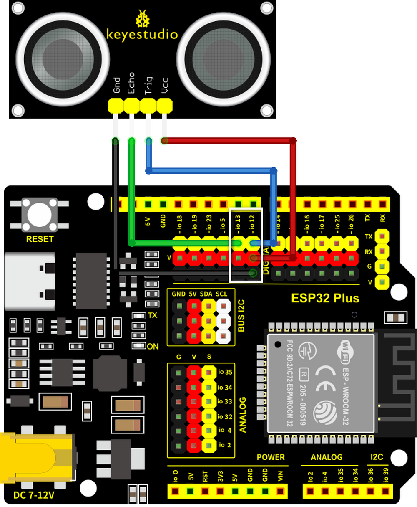

---

**Code de test :**

Définissez la broche correcte : Trig sur la broche io12 ; Echo sur la broche io13.

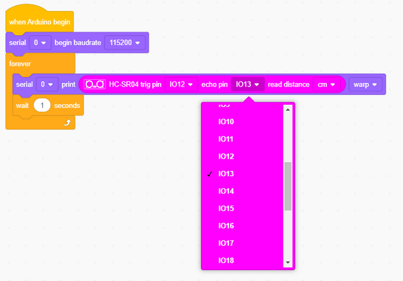

**Résultat du test :**

Dans ce kit, la plage de détection est de 3 à 8 cm.

Ouvrez le moniteur série et observez.

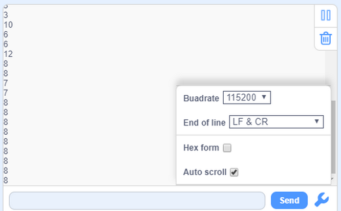

---

#### 4.6.4 Système d'alimentation intelligent

**Description :**

Le système d'alimentation intelligent nourrit intelligemment les volailles domestiques via un module ultrasonique et un servo. Le premier détecte la distance aux animaux tandis que le second contrôle l'ouverture ou la fermeture de la boîte d'alimentation. Lorsqu'un animal de compagnie est détecté près de la boîte, le servo l'ouvre pour le nourrir.

---

**Schéma de câblage :**

**Connectez l'Echo du module ultrasonique à io13 et Trig à io12 ; connectez le servo à io26.**

**Attention : Connectez le jaune à S (Signal), le rouge à V (Alimentation) et le noir à GND. Ne les inversez pas !**

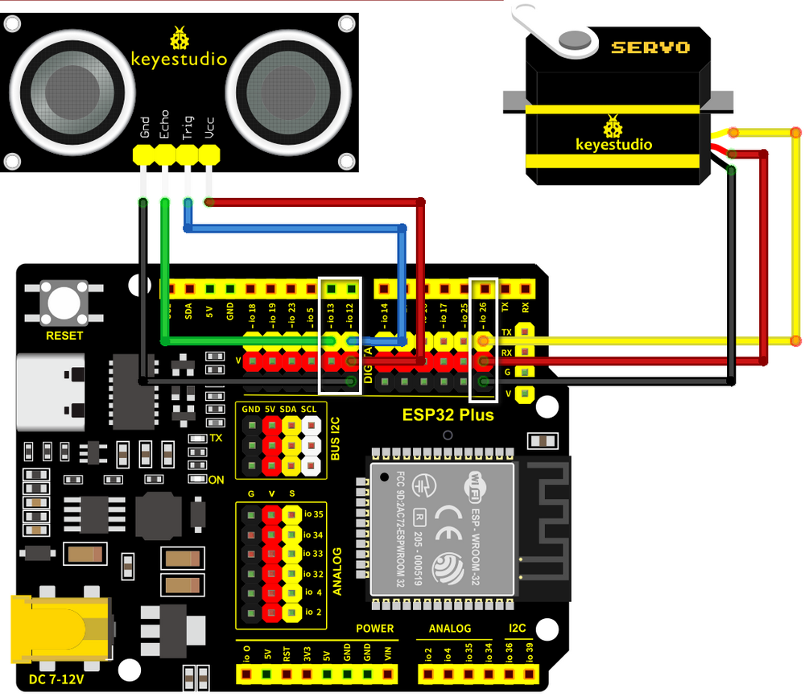

---

**Code de test :**

Flux de code :

Code :

-  Initialisez le port série. Définissez une variable et attribuez-lui la valeur 180.

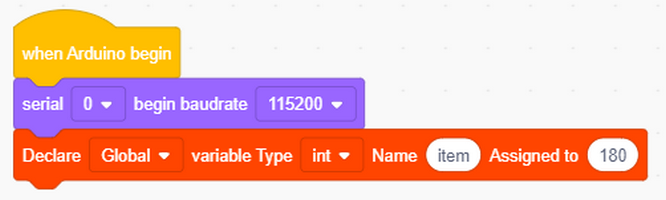

-  Définissez correctement la broche et imprimez la valeur reçue.

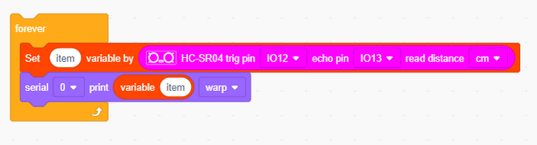

-  Déterminez la valeur de distance détectée. Si elle est comprise entre 2 cm et 7 cm, la boîte d'alimentation s'ouvrira.

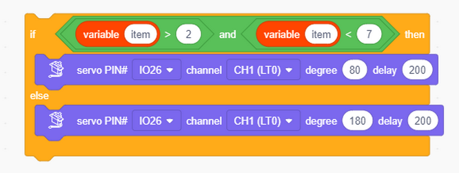

Code complet :

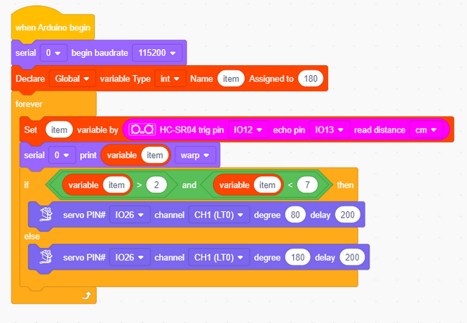

**Résultat du test :**

Lorsqu'un animal est détecté, ouvrez la boîte d'alimentation.

