### 4.7 Proyecto: Sistema de Control de Temperatura

En este proyecto, demostraremos cómo usar un sensor de temperatura y humedad, un ventilador y una pantalla LCD1602 para constituir un sistema inteligente de control de temperatura y humedad.

El sistema mide la temperatura y humedad ambiente y controla el ventilador para enfriar según sea necesario. Cuando la temperatura excede el umbral establecido, el ventilador se enciende automáticamente para reducir la temperatura ambiente por debajo del valor establecido. Mientras tanto, los valores actuales de temperatura y humedad se mostrarán en la LCD1602.

Por lo tanto, realiza el ajuste automático de la temperatura y humedad ambiente, lo cual es perfecto para proyectos que requieren estas funciones.

---

#### 4.7.1 Diagrama de Flujo

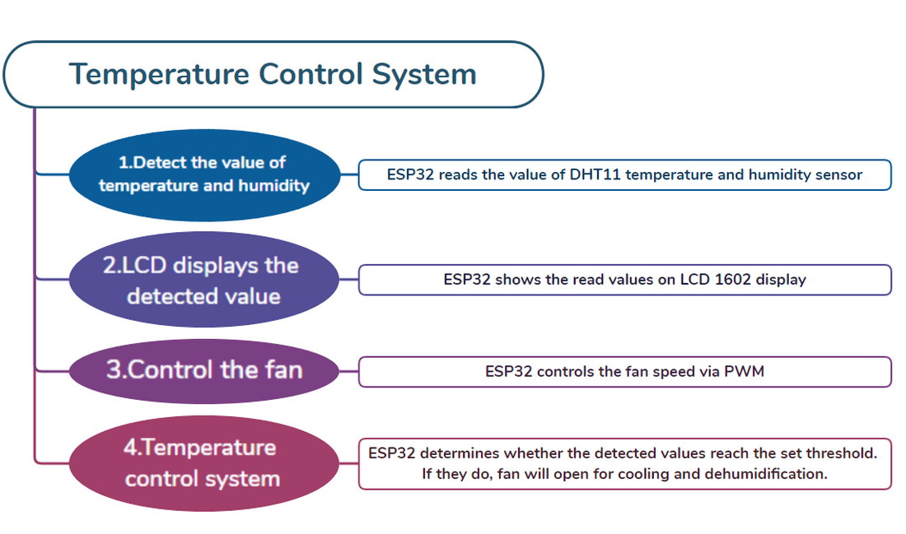

---

#### 4.7.2 Sensor de Temperatura y Humedad

**Descripción:**

El sensor de temperatura y humedad DHT11 emite señales digitales. Aplica principios de adquisición y conversión de señales analógicas, así como tecnología de detección de temperatura y humedad, por lo que presenta estabilidad a largo plazo y alta fiabilidad. Además, el sensor integra un sensor de humedad resistivo de alta precisión y un sensor de temperatura termosensible resistivo, y está conectado con un MCU de 8 bits de alto rendimiento.

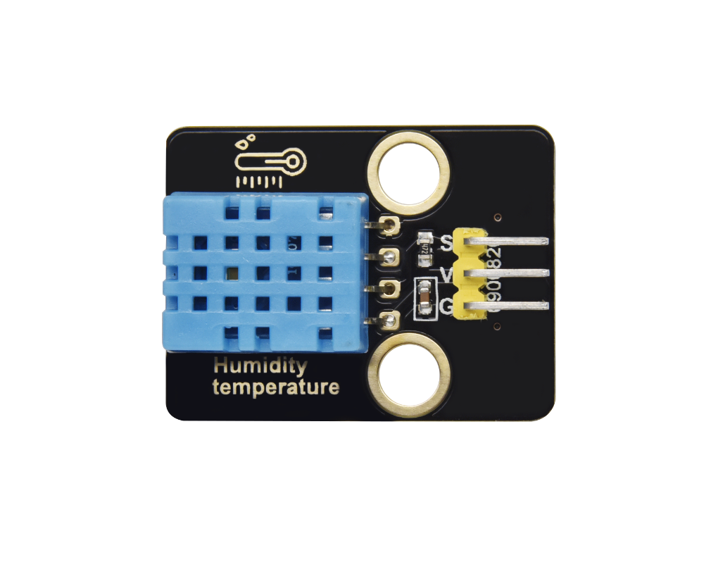

---

**Medios de Comunicación del DHT11:**

El DHT11 se comunica a través de un monobús (un solo bus) que intercambia y controla datos.

-  El monobús transmite **Bit de Datos**:

   -  Formato de datos del monobús: transmite 40 bits de datos cada vez, y el bit más significativo primero.
   -  Valor entero de humedad de 8 bits + valor decimal de humedad de 8 bits + valor entero de temperatura de 8 bits + valor decimal de temperatura de 8 bits + paridad de bits.
   -  **NOTA: El valor decimal de humedad es igual a 0.**
   
-  **Bit de Paridad**:

   -  Valor entero de humedad de 8 bits + valor decimal de humedad de 8 bits + valor entero de temperatura de 8 bits + valor decimal de temperatura de 8 bits.
   -  La paridad de 8 bits es igual a los últimos 8 bits del resultado.

**Diagrama de Tiempos:**

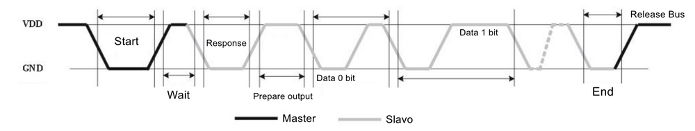

**NOTA: **

**El host siempre lee los valores de temperatura y humedad de la última medición del DHT11. Por lo tanto, si el intervalo entre dos mediciones es largo, detecte consecutivamente dos veces y adopte el
segundo resultado.**

Para más detalles, visite el sitio web oficial de ASAIR: http://www.aosong.com/products-21.html

---

**Diagrama de Cableado:**

**Conecte el sensor de temperatura y humedad a io17.**

**Atención: Conecte el amarillo a S (Señal), el rojo a V (Alimentación) y el negro a GND. ¡No los invierta!**

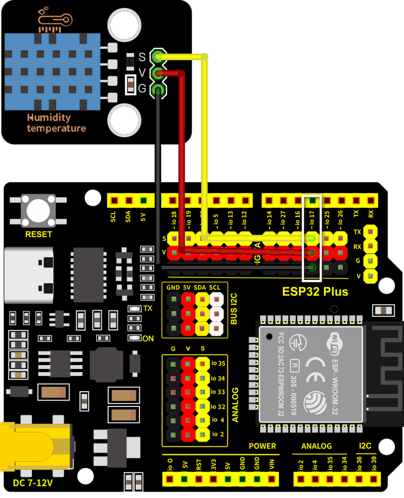

---

**Código de Prueba:**

-  Inicialice el puerto serie y el sensor.

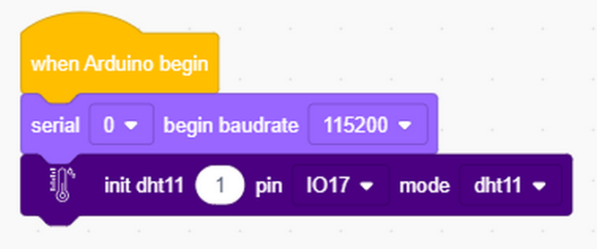

-  El monitor serie imprime y actualiza los valores de humedad y temperatura por segundo.

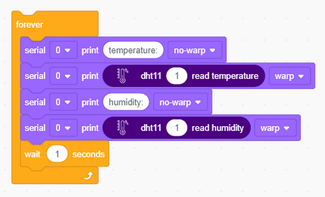

Código completo:

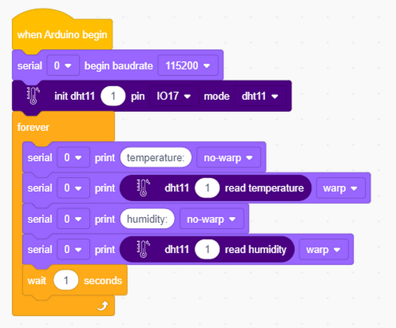

**Resultado de la Prueba:**

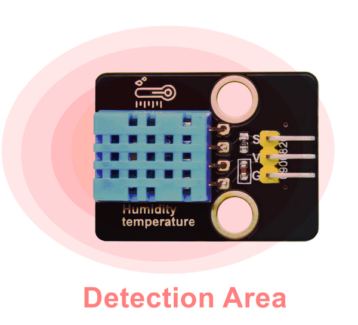

Abra el monitor serie y verá el valor actual de temperatura y humedad.

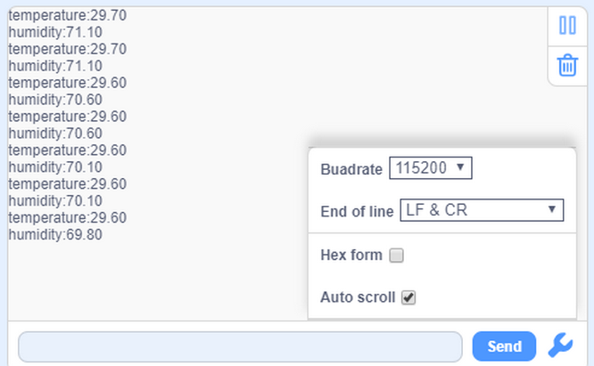

---

#### 4.7.3 Módulo LCD 1602

**Descripción:**

La LCD 1602 posee una interfaz estándar de 14 pines (sin retroiluminación) o 16 pines (con retroiluminación), lo que ahorra pines del MCU. Su controlador de pantalla IC realiza el control I2C.

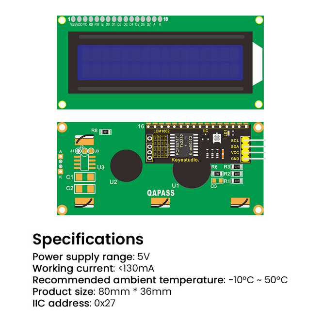

---

**Comunicación Serie I2C:**

La comunicación I2C, conocida completamente como Inter-Integrated Circuit (IIC) o Two-Wire Interface (TWI), es un protocolo de comunicación de doble bus (un host y un esclavo) comúnmente utilizado, desarrollado por Phillips Semiconductor (adquirido por US NXP Semiconductors).

La mayor ventaja es que solo dos cables completan la transmisión de datos, lo que simplifica enormemente los circuitos. En total, el bus I2C puede conectar 127 nodos en paralelo, por lo que admite múltiples hosts y esclavos.

Generalmente, no se necesita una fuente de alimentación externa para los esclavos, ya que el bus I2C les transmitirá la energía:

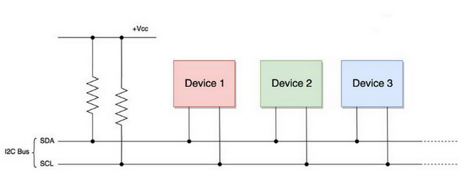

El bus I2C transmite datos mediante una transmisión de datos de 8 bits. Por lo general, un dato de un byte se compone de nueve señales de reloj, ocho de las cuales transmiten datos y la última marca el final de la transmisión.

Además, el bus I2C admite la transmisión de datos de varios bytes repitiendo el proceso anterior continuamente.

El Protocolo I2C básicamente consiste en:

-  **Señal de inicio**: Antes de la transmisión, el remitente transmite una señal de inicio para informar al receptor del punto de partida.
-  **Dirección**: Notifica al receptor a quién se envían los datos.
-  **Datos**: Se transmiten un byte cada vez y bit a bit.
-  **Señal de fin**: Al finalizar la transmisión, el remitente finaliza los datos con una señal de fin para informar al receptor que el proceso ha terminado.

**Diagrama de Tiempos del Protocolo Serie:**

Para más detalles, visite el sitio web oficial: https://www.nxp.com/

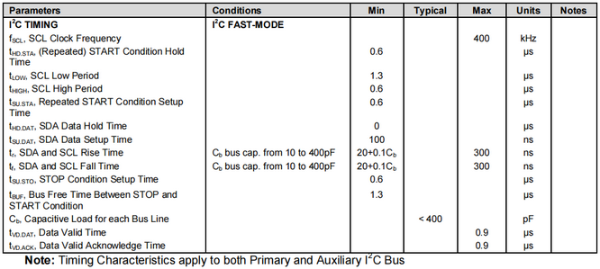

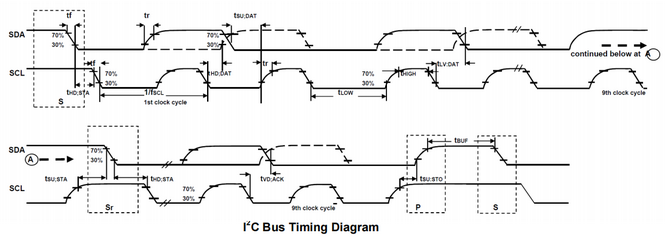

Le proporcionamos un archivo de biblioteca **Wire.h** para el protocolo I2C, en el que se pueden llamar directamente funciones para comunicarse con dispositivos I2C/TWI.

Para detalles de la biblioteca, consulte:

https://www.arduino.cc/reference/en/language/functions/communication/wire/

---

**Diagrama de Cableado:**

**Conecte la LCD al BUS I2C como se muestra a continuación.**

**Atención: Conecte el amarillo a S (Señal), el rojo a V (Alimentación) y el negro a GND. ¡No los invierta!**

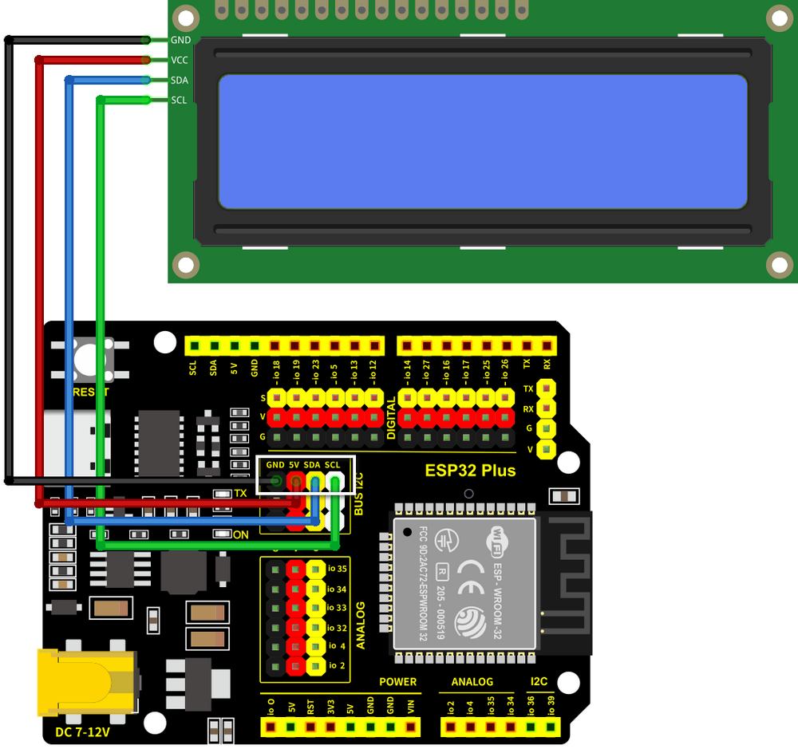

---

**Código de Prueba:**

-  Inicialice la dirección I2C de la LCD y encienda su retroiluminación.

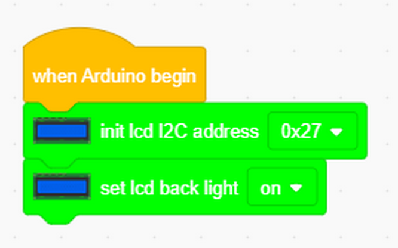

-  Establezca la posición del cursor de la LCD en el eje X e Y (el eje X muestra un máximo de 16 caracteres y el eje Y muestra un máximo de 2 columnas).

-  Introduzca el contenido a imprimir (No más de 16 caracteres, de lo contrario no estará completo).

Código completo:

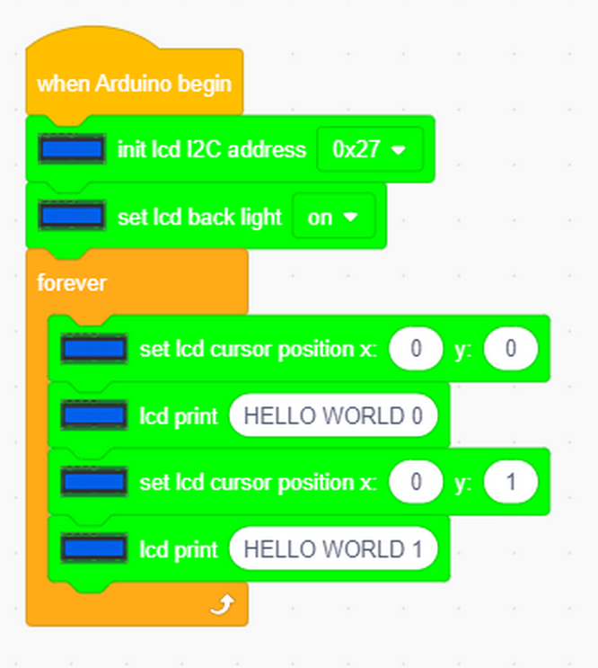

**Resultado de la prueba:**

La LCD1602 enciende su retroiluminación y muestra " **HELLO WORLD 0** " y " **HELLO WORLD 1** ".

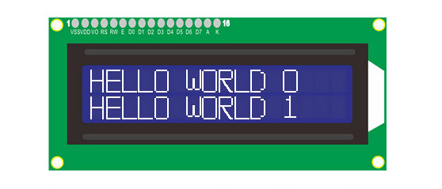

---

#### 4.7.4 Módulo de ventilador

**Descripción:**

El motor 130 es capaz de ajustar la velocidad a través de PWM. En el proceso, se necesitan dos pines para conectarse para el control.

El módulo es adecuado para múltiples aplicaciones, como la disipación de calor de computadoras y la producción industrial. Además, es compacto y fácil de instalar, lo que lo hace muy práctico.

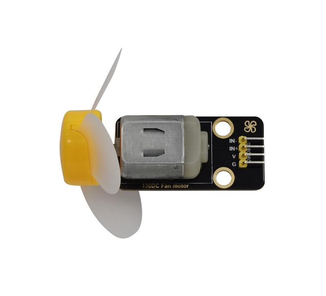

---

**Diagrama esquemático:**

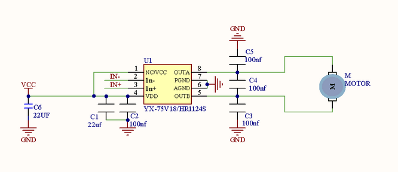

---

**Diagrama de cableado:**

**Conecte el motor a io18 y io19.**

**Atención: Conecte el amarillo a S (Señal), el rojo a V (Alimentación) y el negro a GND. ¡No los invierta!**

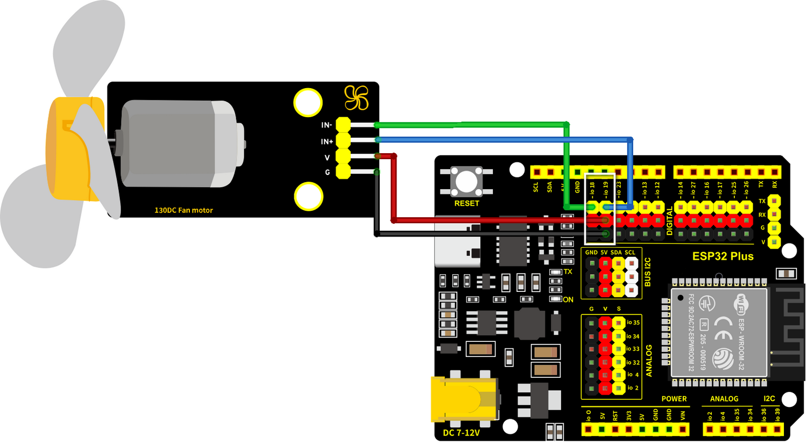

---

**Código de prueba:**

-   Establecer el pin del ventilador **INA**

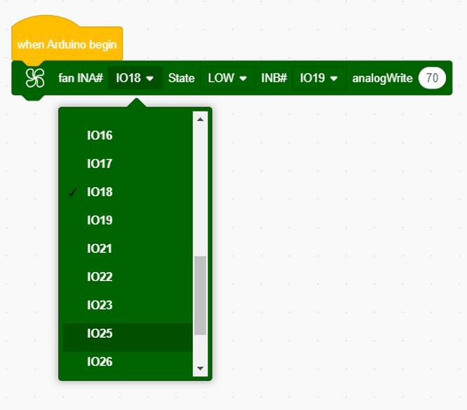

-   Establecer el estado del nivel de potencia de **INA**, que determina la dirección de rotación del ventilador.

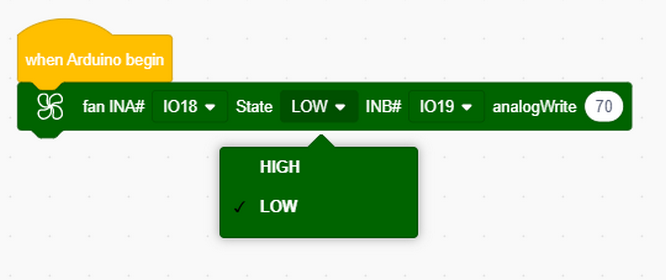

-   Establecer el pin del ventilador **INB**.

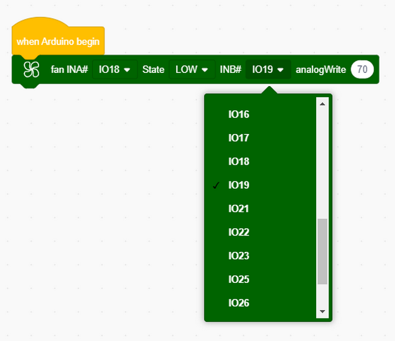

-   Establecer la salida analógica en **INB**, que decide la velocidad de rotación.
    -   Cuando INA está en alto, cuanto menor sea la salida analógica en INB, más rápido girará el ventilador.
    -   Cuando INA está en bajo, cuanto mayor sea la salida analógica en INB, más rápido girará el ventilador.

**Resultado de la prueba:**

El motor 130 gira alternativamente a la izquierda y a la derecha cada 2 segundos.

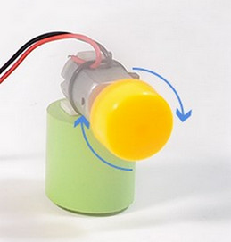

**NOTA:**

**Existen paradas intermitentes durante el cambio de dirección de rotación. Estas evitan una corriente excesiva en el momento de la inversión. De lo contrario, podría producirse un reinicio forzado debido a una fuente de alimentación insuficiente en la placa de desarrollo.**

---

#### 4.7.5 Sistema de control de temperatura

**Descripción:**

Aquí, leemos el valor del sensor de temperatura y humedad DHT11 a través de comunicación monobús, y los valores se mostrarán en la LCD. Si los valores superan el umbral establecido, el ventilador se encenderá para deshumidificación y enfriamiento para proteger a los animales y plantas en la granja. Notablemente, este sistema es fácil de instalar con múltiples funciones, como el control de velocidad a través de PWM y la transmisión de datos por monobús.

En general, es un sistema práctico que ayuda a los agricultores a monitorear y controlar el estado en tiempo real para mejorar la eficiencia de la producción.

---

**Diagrama de cableado:**

-   **Conecte el sensor de temperatura y humedad a io17.**
-   **Conecte el módulo del motor (ventilador) a io18 y io19.**
-   **Conecte la LCD1602 al BUS I2C.**

**Atención: Conecte el amarillo a S (Señal), el rojo a V (Alimentación) y el negro a GND. ¡No los invierta!**

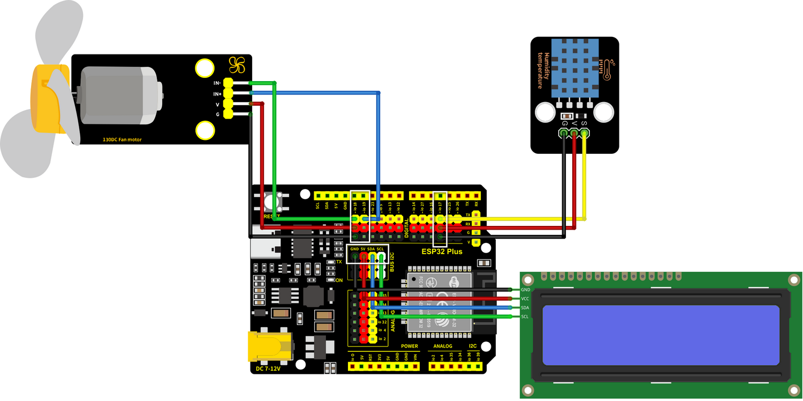

---

**Código de prueba:**

Flujo del código:

Código:

-   Inicialice la LCD para establecer una dirección y borre la pantalla. Encienda su retroiluminación y establezca la posición del cursor:

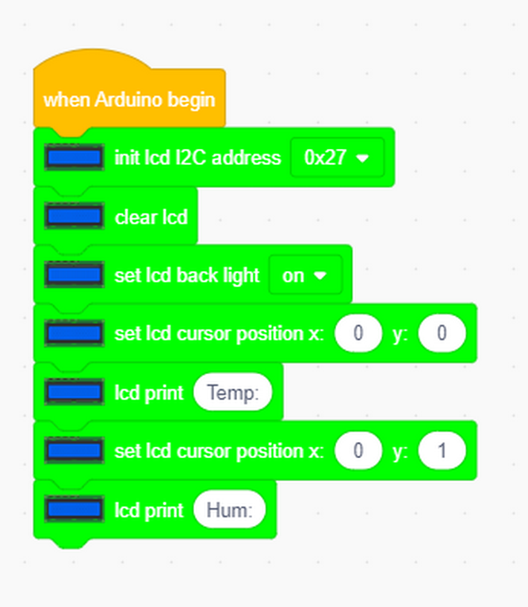

-   Inicialice el sensor DHT11 y elija un pin correspondiente. Defina dos variables como valores de temperatura y humedad.

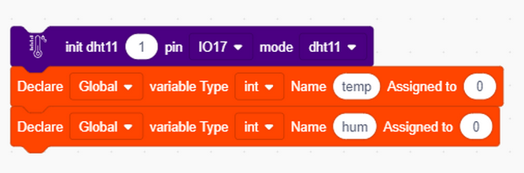

-   En el bucle, asigne respectivamente los valores detectados a las dos variables.

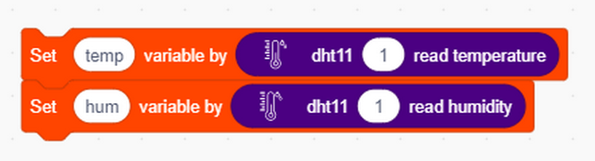

-   Muestre los valores en la LCD.

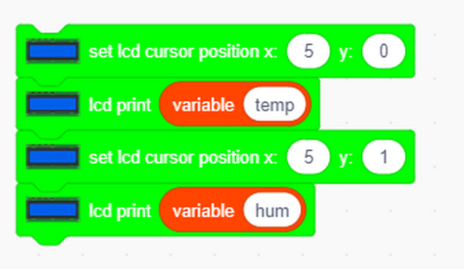

-   Determine el valor de temperatura y humedad. Si la temperatura es superior a 29° o la humedad excede el 80%, el ventilador girará.

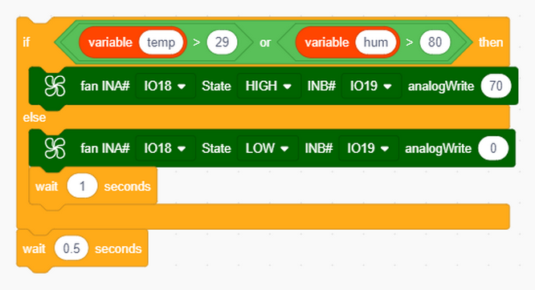

Código completo:

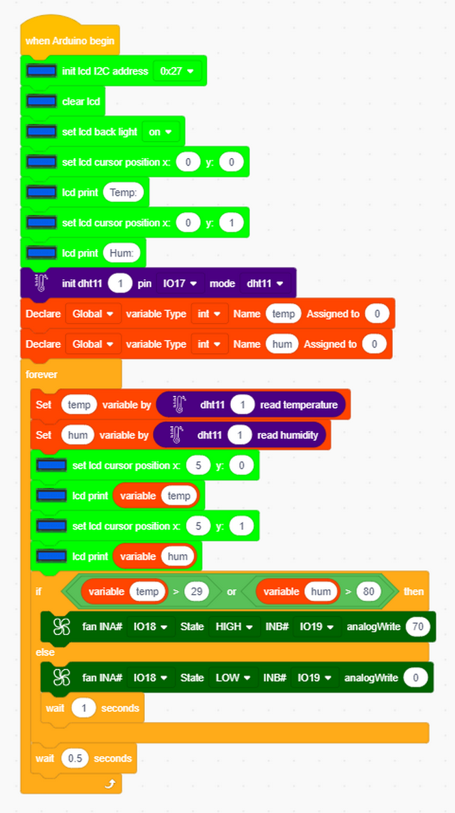

**Resultado de la prueba:**

Cuando la temperatura alcanza los 29°C, el ventilador se encenderá para disipar el calor. Cuando sea inferior a 29°C, el ventilador se apagará (el ventilador solo simula la disipación de calor, por lo que el efecto no es bueno), lo que ahorra energía para la granja.

---

#### 4.7.6 Preguntas frecuentes

#P: ¿El sensor de temperatura y humedad es impermeable?

R: No. Detecta la temperatura y humedad ambiente (en el aire), así que por favor no lo ponga en agua.

---

#P: La placa ESP32 se reinicia cuando el ventilador gira.

R: Cuando el ventilador gira, se requiere más corriente que otros sensores, por lo que el voltaje y la corriente pueden fluctuar en el circuito. Especialmente en el momento de la inversión del ventilador, las fluctuaciones pueden ser demasiado fuertes, lo que resulta en un reinicio debido a un voltaje y corriente extremadamente bajos en la placa de desarrollo ESP32.

---