### 4.8 Projet : Système de surveillance de l'humidité du sol

---

**Attention ! Ne faites pas déborder l'eau des piscines en plastique lors des expériences. Le déversement d'eau sur d'autres capteurs peut non seulement provoquer un court-circuit ou la mise hors service des modules, mais aussi générer de la chaleur et même une explosion. Soyez extrêmement prudent ! Surtout pour les jeunes utilisateurs, veuillez opérer avec vos parents. Pour garantir la sécurité, veuillez respecter les directives et les règles de sécurité.**

---

---

#### 4.8.1 Diagramme de flux

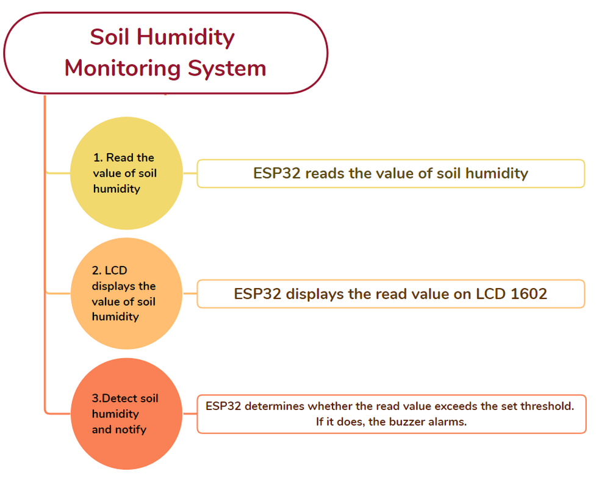

---

#### 4.8.2 Capteur d'humidité du sol

**Description :**

Les capteurs d'humidité du sol sont principalement utilisés pour mesurer la teneur en eau volumétrique du sol, surveiller l'humidité du sol, irriguer les cultures et protéger les forêts. Ce type de capteur est intégré dans les systèmes d'irrigation agricole pour fournir de l'eau régulièrement et efficacement, ce qui optimise l'irrigation pour une croissance optimale des plantes.

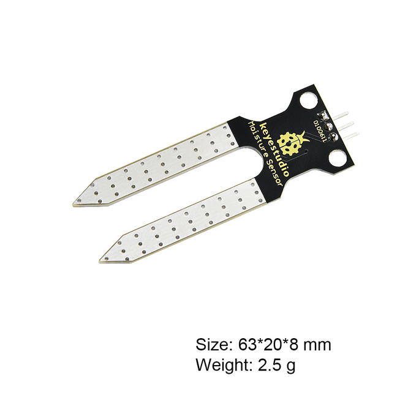

---

**Schéma :**

---

**Schéma de câblage :**

**Connectez le capteur d'humidité du sol à io32.**

**Attention : Connectez le jaune à S (Signal), le rouge à V (Alimentation) et le noir à GND. Ne les inversez pas !**

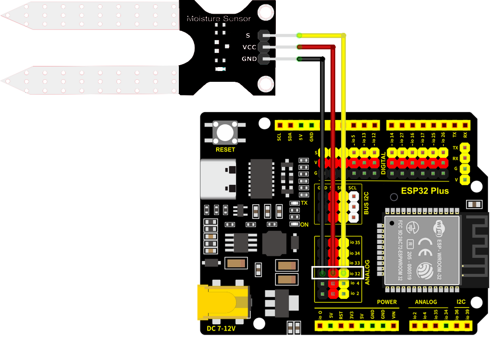

---

**Code de test :**

- Initialiser le port série.

- Afficher la valeur lue du capteur.

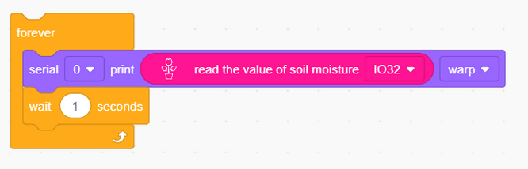

Code complet :

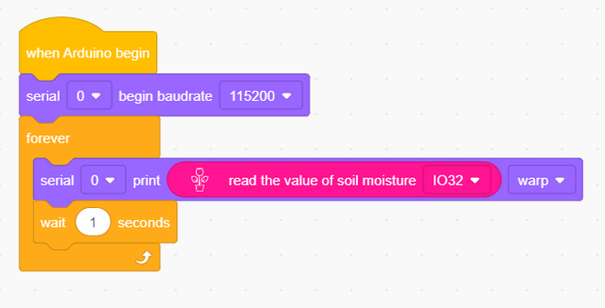

**Résultat du test :**

Ouvrez le moniteur série.

Touchez la zone de détection du capteur avec un doigt humide et la valeur d'humidité actuellement détectée sera affichée sur le moniteur (plage : 0~4095).

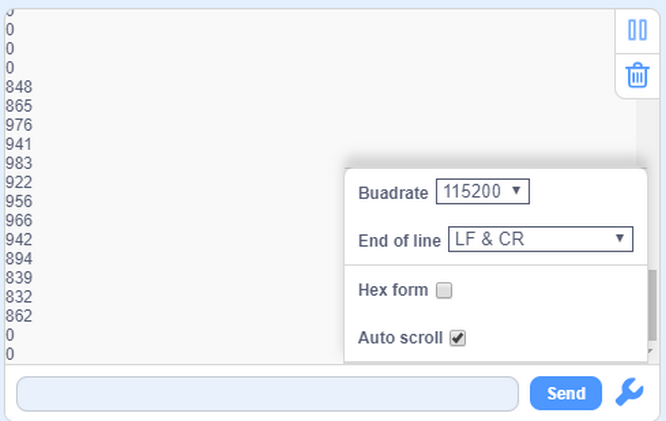

---

#### 4.8.3 Système de surveillance de l'humidité du sol

Nous utilisons un LCD1602 pour afficher la valeur en temps réel de l'humidité du sol. Lorsque la valeur est inférieure à l'humidité minimale définie, le buzzer émet un son pour avertir les agriculteurs d'irriguer.

**Schéma de câblage :**

- **Connectez le capteur d'humidité du sol à io32.**
- **Connectez le buzzer à io16.**
- **Connectez le LCD1602 au BUS I2C.**

**Attention : Connectez le jaune à S (Signal), le rouge à V (Alimentation) et le noir à GND. Ne les inversez pas !**

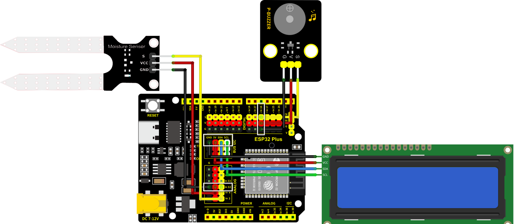

---

**Code de test :**

Flux de code :

Code :

- Initialiser l'écran LCD et effacer son affichage. Allumez le rétroéclairage pour observer la valeur affichée.

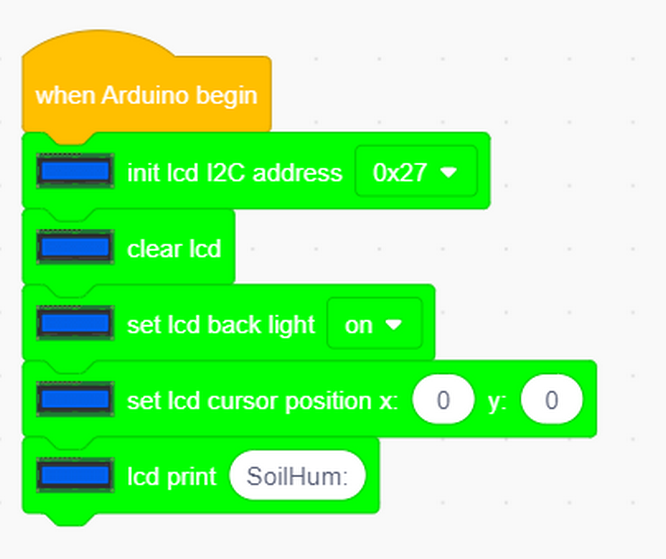

- Initialiser le port série et définir une variable.

- Lire la valeur de l'humidité du sol et l'assigner à la variable. L'écran LCD affiche la valeur.

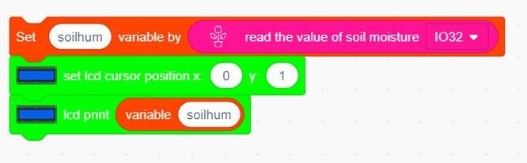

- Déterminer la valeur lue. Si elle est inférieure à 200, le buzzer sonnera.

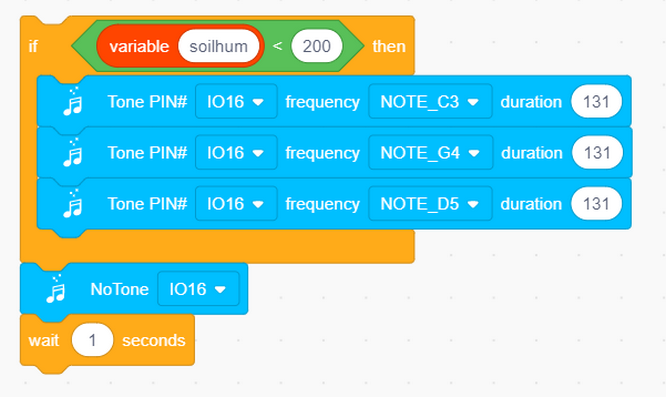

Code complet :

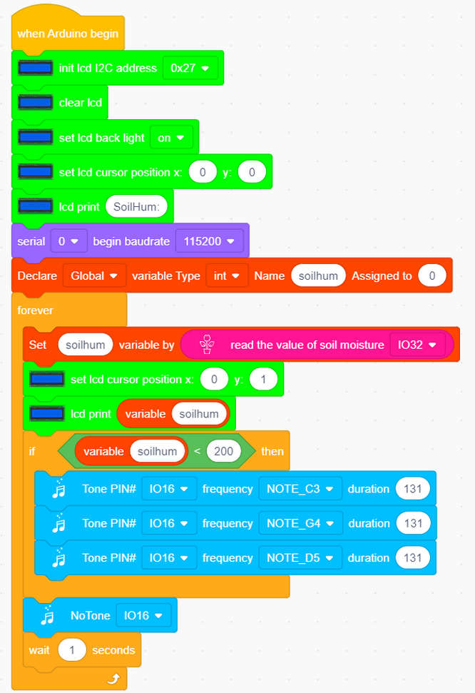

**Résultat du test :**

Lorsque la valeur détectée par le capteur d'humidité du sol est inférieure au seuil défini, le buzzer émet un son pour alerter.

---

#### 4.8.4 FAQ

Q : Le capteur d'humidité du sol est-il étanche ?

R : À l'exception de la zone de détection, le capteur n'est pas étanche. Le déversement d'eau sur d'autres zones peut entraîner un court-circuit.

---