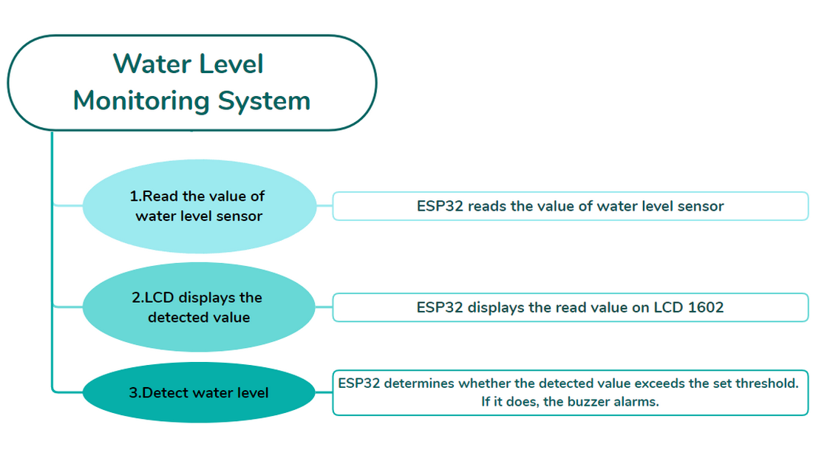
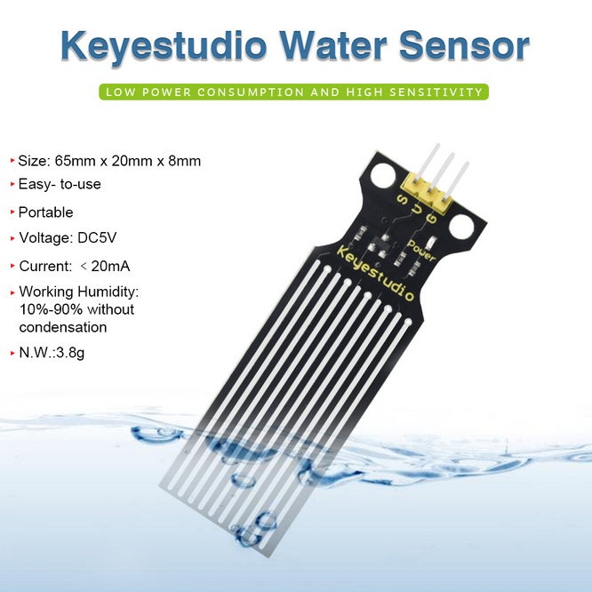
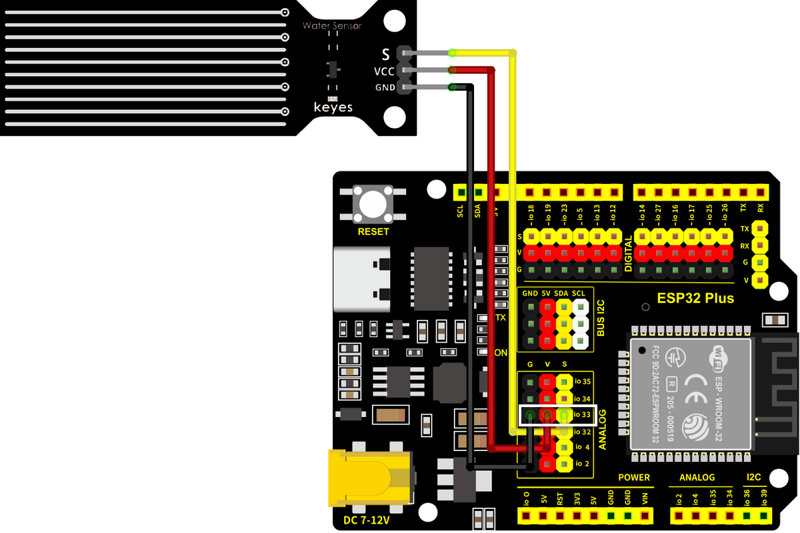
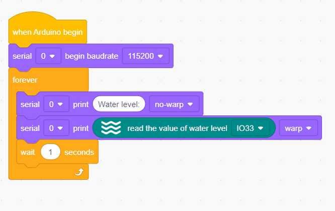
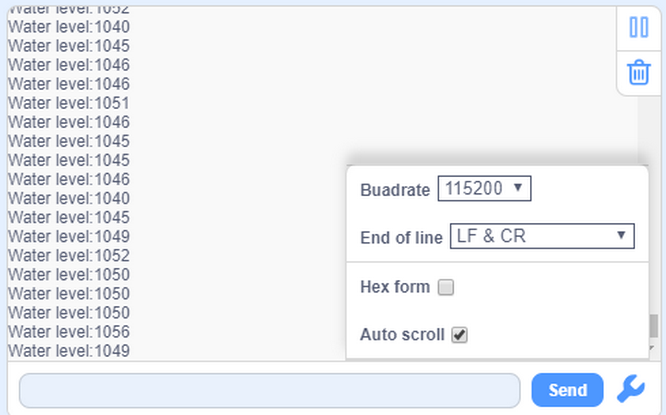
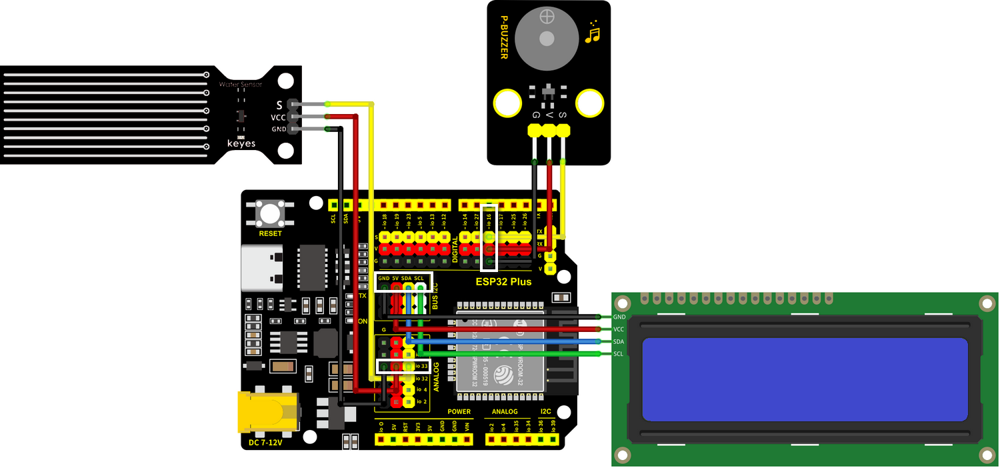
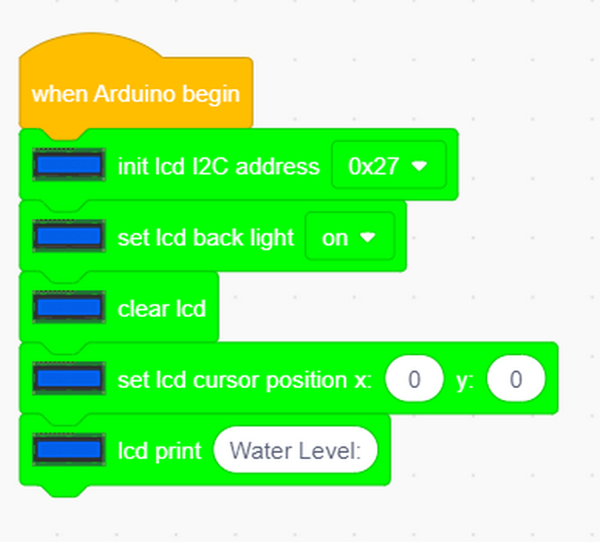
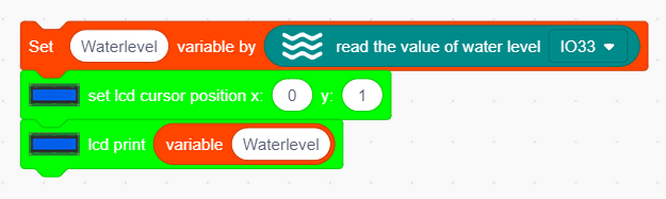
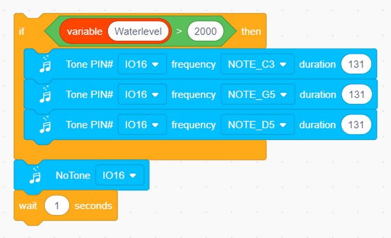
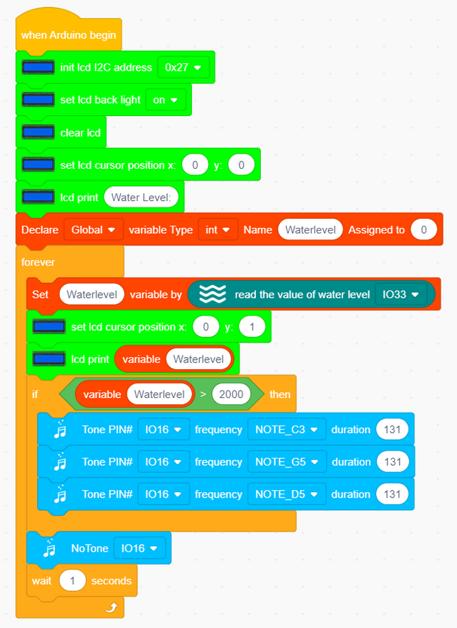

### 4.9 Proyecto: Sistema de monitoreo del nivel del agua

---

**¡Atención! No desborde agua de las piscinas de plástico en los experimentos. Derramar agua sobre otros sensores puede causar no solo un cortocircuito que perturbe las operaciones normales, sino también la generación de calor e incluso una explosión. ¡Tenga mucho cuidado! Especialmente para los usuarios más jóvenes, opere con sus padres. Para garantizar la seguridad, obedezca las guías y las normas de seguridad.**

---

#### 4.9.1 Diagrama de flujo

---

#### 4.9.2 Sensor de nivel de agua

**Descripción:**

El sensor de nivel de agua es fácil de usar, portátil y rentable. Integra una serie de líneas paralelas expuestas para medir el volumen de agua y gotas. El sensor no solo es más pequeño e inteligente que otros detectores de agua, sino que también presenta:

-  Transición suave entre el volumen de agua y el volumen analógico;
-  Gran flexibilidad. El sensor emite valores analógicos básicos;
-  Bajo consumo de energía y alta sensibilidad;
-  Conexión directa a microprocesadores o circuitos, y es adecuado para varias placas de desarrollo y controladores, como los controladores KidsBlock, microordenadores de un solo chip STC y AVR.

---

**Diagrama de cableado:**

**Conecte el sensor de nivel de agua a io33.**

**Atención: Conecte el amarillo a S (Señal), el rojo a V (Alimentación) y el negro a GND. ¡No los invierta!**

---

**Código de prueba:**

**Resultado de la prueba:**

Abra el monitor serie.

Toque el área de detección del sensor con un dedo húmedo y el valor detectado actualmente se imprimirá en el monitor (rango: 0~4095).

---

#### 4.9.3 Sistema de monitoreo del nivel del agua

El sistema de monitoreo del nivel del agua supervisa el cambio del nivel del agua para aclarar los problemas a tiempo y tomar medidas para evitar desastres. Se utiliza ampliamente en proyectos de conservación del agua, drenaje urbano y monitoreo ambiental.

**Diagrama de cableado:**

-  **Conecte el sensor de nivel de agua a io33.**
-  **Conecte el zumbador a io16.**
-  **Conecte el LCD1602 al BUS I2C.**

**Atención: Conecte el amarillo a S (Señal), el rojo a V (Alimentación) y el negro a GND. ¡No los invierta!**

---

**Código de prueba:**

Flujo de código:

Código:

-  Inicialice la pantalla LCD y encienda su retroiluminación; borre toda la pantalla y luego imprima el nivel del agua.

-  Defina una variable como el nivel de agua detectado.

-  Lea el valor del sensor y muéstrelo en la pantalla LCD.

-  Determine el valor del nivel del agua. Si es mayor que 2000, el zumbador emitirá una alarma.

Código completo:

**Resultado de la prueba:**

La pantalla LCD muestra el valor en tiempo real del nivel del agua. En el experimento, cubrimos el área de detección con agua para simular el nivel del agua. Cuando el valor detectado excede el umbral, el zumbador comienza a sonar.

---

#### 4.9.4 Preguntas frecuentes

P: ¿Es el sensor de nivel de agua impermeable?

R: Con la excepción del área de detección, el sensor no es impermeable. Derramar agua en otras áreas puede provocar un cortocircuito.

---